# 附录 K：主流 Coding Agent 系统全景

> 定位：**Coding Agent 赛道的全景调研报告·增强版**（全文收录，信息基准 2026-08-30，各产品官方入口见 [C-36]）。附录 D 是全品类产品速览与"坐标系定位法"，本附录只深潜 Coding Agent 一个赛道——商业/开源/国内/云端异步/多 Agent 工厂/审查 Agent/应用构建平台七类盘点，能力九维度，加上增强版六个专题：与通用平台 Agent 的关系与区别、代码理解（仓库认知建立）、LSP/AST/Symbol Index/Repo Map 详解、代码检索与上下文工程、沙箱与执行隔离、权限审批与安全治理，收尾于互操作标准（MCP/ACP/AGENTS.md）、评测体系与选型建议。第六篇（第 23–25 章）讲这一赛道的机制原理（技术专题与第 23 章 2.5/2.6 两节互为印证），附录 R/S/T 是其中三个系统的源码级解剖，本附录是"市场与技术专题"这一层的地图。名单与格局会过期，四层分类与九维度框架不过期。

---

## K.1 核心结论

CodingAgent 已经从“代码补全工具”演化为能够在真实工程环境中执行完整闭环的软件工程系统：

> **理解代码库 → 制定计划 → 修改文件 → 执行命令 → 运行测试 → 分析失败 → 自我修复 → 生成提交或 PR → 接受人工审查**

截至 2026 年 8 月，市场大致形成了四个层次：

1. **执行型 Coding Agent**：Claude Code、Codex CLI、OpenCode、Aider 等，负责真正读写代码和运行命令。
2. **AI IDE 与统一交互入口**：Cursor、GitHub Copilot、Antigravity、Kiro、Junie、Qoder 等，把 Agent 融入编辑器。
3. **云端异步 Agent**：Codex Cloud、Copilot Cloud Agent、Devin、Cursor Cloud Agents、Jules 等，在隔离环境中长期执行任务。
4. **多 Agent 控制面与软件工厂**：Devin Desktop、Antigravity Agent Manager、GitLab Duo Agent Platform、Augment Cosmos、Factory 等，管理多个本地或云端 Agent。

因此，今天讨论 CodingAgent，不能只比较底层模型。更准确的表达是：

> **CodingAgent = 模型 + Agent Harness + 代码智能与上下文引擎 + 工具系统 + 执行环境 + 验证系统 + 记忆与技能 + 安全治理 + 控制面**

Claude Code、Codex、Copilot、Cursor 等正在补齐本地执行闭环；Antigravity、Devin Desktop、VS Code 和 GitLab Duo 则明显向多 Agent 控制台发展。

参考：[Claude Code Overview](https://docs.anthropic.com/en/docs/claude-code/overview)

---

## K.2 先区分几类容易混淆的产品

| 类型 | 主要能力 | 人与 Agent 的关系 | 典型系统 |
|---|---|---|---|
| AI 代码补全 | 根据当前文件和光标预测代码 | 人主导，AI 被动建议 | 传统 Copilot Completion、Tabnine |
| AI 编程助手 | 问答、解释、生成局部代码 | 人拆解任务，AI 回答 | IDE Chat、代码问答助手 |
| 交互式 Coding Agent | 自主搜索、编辑、运行、测试和修复 | 人给目标，Agent 执行，人持续监督 | Claude Code、Codex CLI、Cursor Agent |
| 云端异步 Agent | 在远程容器或 VM 中执行较长任务 | 人提交任务，稍后审查结果 | Devin、Codex Cloud、Copilot Cloud Agent、Jules |
| 多 Agent 控制面 | 管理多个 Agent、任务、工作区和审查产物 | 人管理工作队列和验收标准 | Devin Desktop、Antigravity、GitLab Duo |
| 软件工程 Agent 平台 | 覆盖需求、开发、测试、审查、安全、发布 | 人控制整个 AI 软件交付流程 | Factory、Augment Cosmos、GitLab Duo Agent Platform |
| AI 应用构建平台 | 从自然语言生成并部署完整应用 | 用户描述产品，平台管理代码和基础设施 | Replit Agent、Lovable、Bolt、v0 |
| 专项审查 Agent | 分析 PR、发现缺陷、提出修复建议 | 开发 Agent 生产，审查 Agent 验证 | CodeRabbit、Qodo、Greptile |

一个模型订阅也不等于 CodingAgent。例如 GLM Coding Plan、各类模型 API 和推理服务提供的是“模型访问能力”；只有和 Claude Code、OpenCode、Cline、Qwen Code 等 Harness 结合后，才形成完整 CodingAgent 系统。

参考：[GLM Coding Plan](https://docs.bigmodel.cn/cn/coding-plan/overview)

---

## K.3 CodingAgent 的标准系统架构

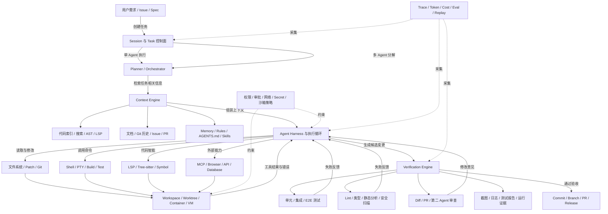

这套架构中，模型通常只是推理核心。真正决定系统可用性的，往往是下面几个部分：

- 上下文能否准确定位代码，而不是把整个仓库塞进上下文窗口。
- 工具调用是否稳定，文件修改是否可以原子提交和回滚。
- 命令、进程、PTY、浏览器是否有超时、取消和崩溃恢复。
- Agent 是否会真正运行测试，而不是仅声称“已经修复”。
- 云端任务能否安全隔离代码、凭证、网络和依赖。
- 多 Agent 是否具有真实隔离，而不是几个角色共享同一个目录互相覆盖。
- 计划、命令、Diff、测试和截图能否形成可审查证据。

研究也表明，即使底层模型相同，不同 Agent Scaffold 或 Harness 的任务表现也可能明显不同，因此只按模型能力判断 CodingAgent 并不准确。

参考：[Agent Scaffold 相关研究](https://openreview.net/pdf?id=nw4d83V687)

---

## K.4 主流商业 CodingAgent

### K.4.1 第一梯队通用系统

| 系统 | 主要形态 | 执行位置 | 系统定位与突出能力 |
|---|---|---|---|
| **Claude Code** | CLI、IDE 集成、Agent SDK | 本地、Headless、CI/云环境集成 | 强调可编程 Agent Harness；支持 CLAUDE.md、自动记忆、Skills、Hooks、MCP、自定义 Subagent、后台任务、LSP 和权限模式，适合深度代码库操作及自动化工作流。 |
| **OpenAI Codex** | CLI、IDE、桌面/ChatGPT、云端任务 | 本地沙箱、云端隔离容器 | 同时覆盖本地交互和云端委派；支持工作树、并行任务、PR、重构、代码审查和自动化，安全模型明确区分沙箱权限与用户审批。 |
| **GitHub Copilot** | VS Code、JetBrains、CLI、GitHub、Agent App | 本地、GitHub Actions 云环境 | 最大优势是与 Issue、Branch、Commit、PR、Actions、CodeQL、Secret Scanning 形成原生闭环；GitHub 还允许第三方 Coding Agent 接入。 |
| **Cursor** | AI IDE、CLI、Cloud Agents | 本地、隔离云端 VM | 编辑器体验成熟，支持多模型、项目 Rules、AGENTS.md、Skills、Subagents 和 Cloud Automations；适合个人开发与事件驱动的后台任务。 |
| **Google Antigravity** | Agent Manager、IDE、CLI、SDK | 本地工作区、隔离 Worktree、企业环境 | 将编辑器、终端和浏览器操作统一在一个 Agent Harness 中；突出并行 Agent、工作区隔离、Artifact Review、浏览器验证和统一 Agent Manager。 |
| **Devin / Devin Desktop** | 云端 Agent、桌面控制台、CLI、本地 Agent | 云端 VM、本地环境 | Devin 偏长时间异步执行；Devin Desktop 更接近 Agent Command Center，可同时管理本地与云端 Agent，并通过 ACP 接入不同 Agent。 |
| **Factory Droid** | CLI、Web、Headless、Missions | 本地、云端、CI/CD | 面向软件交付自动化，支持审批、MCP、Skills、AGENTS.md、自定义 Subagents 和只读优先的 Headless 执行，适合企业级 SDLC 流程。 |
| **Kiro** | IDE、CLI、Web、移动端、Kiro Crew | 本地与云端混合 | 以 Spec-Driven Development 为核心，将 Requirements、Design、Tasks 和验证约束变成 Agent 执行依据，并在不同产品表面复用统一 Harness。 |
| **Amazon Q Developer** | IDE、CLI、GitHub、GitLab、AWS 控制台 | 本地与 AWS 云环境 | 强项是 AWS 资源理解、企业身份体系、代码转换、安全扫描及云开发工作流，适合 AWS 技术栈较重的企业。 |

参考资料：

- [Claude Code](https://docs.anthropic.com/en/docs/claude-code/overview)
- [OpenAI Codex](https://openai.com/codex/)
- [GitHub Copilot Cloud Agent](https://docs.github.com/copilot/concepts/agents/cloud-agent/about-cloud-agent)
- [Cursor Agent](https://cursor.com/docs/agent/overview)
- [Google Antigravity](https://cloud.google.com/blog/topics/developers-practitioners/agent-factory-recap-100x-engineering-with-ai-agents-in-google-antigravity-20)
- [Devin](https://docs.devin.ai/get-started/devin-intro)
- [Factory](https://docs.factory.ai/)
- [Kiro](https://kiro.dev/)
- [Amazon Q Developer](https://aws.amazon.com/blogs/devops/amazon-q-developer-agentic-coding-experience/)

### K.4.2 正在向 Agent 控制面发展的系统

| 系统 | 当前定位 |
|---|---|
| **Amp** | 从终端 Coding Agent 扩展为可从 Web、CLI、移动端控制的开发环境；通过 Orbs 运行远程 Agent，并支持自定义 Agent、Agent 生成 Agent、跨项目消息和文件交换。 |
| **JetBrains Junie** | 深度利用 JetBrains 项目模型、代码语义和调试器，可在 IDE 与 CLI 中执行多步骤开发任务；同时支持 JetBrains 模型服务和多种 BYOK Provider。 |
| **Augment Cosmos** | 定位已超出单个 Coding Agent，尝试通过 Work Dispatcher、PR Author、Reviewer、Verifier 等专职 Agent 覆盖任务分发、实现、审查和验证。 |
| **GitLab Duo Agent Platform** | 直接把 Agent 编排嵌入 GitLab 软件生命周期，覆盖规划、开发、审查、安全和发布；支持多个 Agent 并行，也提供自托管或私有云模型路径。 |

参考资料：

- [Amp](https://ampcode.com/)
- [JetBrains Junie](https://www.jetbrains.com/help/ai-assistant/junie-agent.html)
- [Augment Code](https://www.augmentcode.com/)
- [GitLab Duo Agent Platform](https://docs.gitlab.com/releases/18/gitlab-18-8-released/)

---

## K.5 主流开源 CodingAgent 与 Agent Harness

开源系统大致分成两派：

- **开箱即用型 Coding Agent**：直接用于日常开发。
- **Harness / Framework 型系统**：用于研究、二次开发、构建企业 Agent 或搭建控制面。

| 系统 | 类型 | 核心特点 |
|---|---|---|
| **OpenCode** | 开源终端与桌面 Agent | 支持 TUI、桌面、IDE、多会话、LSP，以及只读 Plan Agent 和可修改代码的 Build Agent；模型 Provider 相对开放。 |
| **Cline** | IDE、CLI、SDK | Apache 2.0，强调透明工具调用、Plan/Act、检查点、MCP、Rules 和 Skills；适合需要自己选择模型及控制执行过程的团队。 |
| **Roo Code** | VS Code Agent | 基于开放源码，强调自定义 Modes、角色和工具权限，可以组织类似“架构师—实现者—审查者”的工作模式。 |
| **Aider** | 轻量 CLI Agent | Git 原生、Repository Map、自动提交，结构简单，适合偏终端、希望保持人工控制的开发者。 |
| **Qwen Code** | CLI、桌面、IDE、SDK、Bot | 支持 Memory、Skills、Subagents、Agent Teams、MCP、多种协议和模型 Provider，是较完整的国产开源 CodingAgent 栈。 |
| **OpenHands** | 开源平台与控制台 | 从单 Agent 逐步发展为可自托管的 Agent Canvas，强调常驻 Agent、任务自动化及团队控制台，适合企业二次开发。 |
| **SWE-agent** | 研究型 Agent Harness | 围绕 GitHub Issue 修复设计，强调 Agent-Computer Interface、工具设计和可复现实验，常用于模型及 Harness 研究。 |
| **Goose** | 本地通用 Agent | 同时提供桌面、CLI 和 API，除编码外还面向本地通用任务，适合构建个人自动化工作流。 |
| **Pi Coding Agent** | 极简 Agent Harness | 核心保持精简，通过 TypeScript Extensions、Skills、Prompt Templates、Themes 和 Pi Packages 扩展；默认刻意不内置复杂 Subagent 和 Plan Mode。 |
| **DeepSeek Harness** | 新兴插件化 Harness | 采用“Everything is a Plugin”架构，模型适配器、工具注册表、Session Log、Agent Loop 都可以替换；通过 Profile、Bundle、Cordis Context 组织运行时，并提供 ACP 等运行模板。 |

参考资料：

- [OpenCode](https://github.com/anomalyco/opencode)
- [Cline](https://github.com/cline/cline)
- [Roo Code](https://github.com/RooCodeInc/Roo-Code)
- [Aider](https://github.com/aider-ai/aider)
- [Qwen Code](https://github.com/qwenLM/qwen-code)
- [OpenHands](https://github.com/OpenHands/openhands)
- [SWE-agent](https://github.com/swe-agent/swe-agent)
- [Goose](https://github.com/aaif-goose/goose)
- [Pi](https://pi.dev/)
- [DeepSeek Harness](https://github.com/deepseek-ai/deepseek-harness)

### OpenCode、Cline、OpenHands、SWE-agent 的区别

- **OpenCode** 更像可直接替代 Claude Code 的日常终端 Agent。
- **Cline / Roo Code** 更偏 IDE 内开放式 Agent，工具调用过程透明。
- **OpenHands** 更接近可以自托管和扩展的 Agent 平台。
- **SWE-agent** 更偏研究基线、Benchmark 和 ACI 设计。
- **Pi** 追求极简核心与扩展自由。
- **DeepSeek Harness** 追求所有运行时组件插件化，适合作为二次开发底座。

---

## K.6 国内主流 CodingAgent 系统

| 系统 | 主要形态 | 定位与特点 |
|---|---|---|
| **TRAE / TraeCode** | AI IDE、插件、CLI、开源 Agent Toolkit | 面向完整开发任务，覆盖项目理解、代码修改和命令执行；同时提供较轻量的 Trae Agent 开源工具包。 |
| **Qoder / Qoder CN** | IDE、JetBrains、CLI、移动端、Cloud Agent、SDK | 海外与国内产品线覆盖较完整；国内 Qoder CN 由通义灵码升级而来，正在向本地、云端和多入口 Agent 平台发展。 |
| **腾讯 CodeBuddy** | AI IDE、插件、Agent SDK | 提供代码库理解、Agent 模式、Subagent 和 SDK，强调企业开发工作流及腾讯云生态整合。 |
| **百度 Comate** | IDE 插件、企业研发平台 | 支持规划、编码、测试、调试、审查及多 Agent 调度，并提供 Rules、Memory、MCP、自定义 Agent 等能力。 |
| **华为云 CodeArts / 码道** | AI IDE、插件、CLI、企业平台 | 强调代码库索引、Spec 驱动、企业研发治理以及华为云 CodeArts 工具链整合，适合国产化和企业研发场景。 |
| **Qwen Code** | 开源 CLI、IDE、桌面、SDK | 开源程度及模型适配能力较强，可作为国产 Agent Harness 或企业二次开发底座。 |

参考资料：

- [TRAE](https://www.trae.cn/)
- [Qoder](https://qoder.com/zh)
- [CodeBuddy](https://www.codebuddy.ai/docs/cli/sdk)
- [Comate](https://comate.baidu.com/zh/)
- [CodeArts](https://codearts.huaweicloud.com/)
- [Qwen Code](https://github.com/qwenLM/qwen-code)

国内系统与海外系统的能力方向已经基本一致，主要差异逐渐转向：

- 国内模型及云服务适配。
- 私有化部署与数据合规。
- 中文需求和中文代码库理解。
- 企业知识库和内部研发平台集成。
- 本地网络、制品库、代码托管及权限体系适配。
- 对信创环境、国产操作系统和国产数据库的支持。

---

## K.7 云端异步 CodingAgent

云端 Agent 不是“把 CLI 放进服务器”这么简单，而是需要完整的远程执行基础设施：

- 仓库克隆和身份授权。
- Container 或 VM 生命周期。
- 依赖安装与缓存。
- Secret 注入。
- 网络访问策略。
- Branch、Commit 和 PR 管理。
- 运行日志、截图和测试证据。
- 暂停、恢复、取消、超时和失败重试。
- 多任务隔离及资源配额。

主要系统包括：

| 系统 | 云端执行方式 | 典型任务 |
|---|---|---|
| **Codex Cloud** | 隔离云端环境，任务设置阶段与实际 Agent 阶段采用不同网络权限 | Issue 修复、重构、并行实现、PR 和审查。 |
| **GitHub Copilot Cloud Agent** | GitHub Actions 环境，原生操作仓库、Branch 和 PR | 从 Issue 研究、计划、修改代码到创建 PR。 |
| **Cursor Cloud Agents** | 每个 Agent 使用隔离 VM，克隆代码并加载配置、依赖和 Secret | 后台实现、自动化任务、事件触发任务。 |
| **Devin** | 完整云端开发 VM | 可持续数分钟或数小时的功能、缺陷和维护任务。 |
| **Google Jules** | 与 GitHub 集成的异步云端 Agent | 后台代码修改、Issue 处理和 PR 工作流。 |
| **Amp Orbs** | 可远程启动和控制的 Agent 运行环境 | 跨设备控制、并行任务和跨项目 Agent 协作。 |
| **Factory Droid** | 云端及 Headless CI/CD 运行时 | 自动化 SDLC、批量维护、持续执行任务。 |

参考资料：

- [Codex Security](https://developers.openai.com/codex/agent-approvals-security)
- [GitHub Copilot Cloud Agent](https://docs.github.com/copilot/concepts/agents/cloud-agent/about-cloud-agent)
- [Cursor Cloud Agents](https://cursor.com/docs/cloud-agent)
- [Devin](https://www.cognition.ai/devin)
- [Google Jules](https://jules.google/docs/)
- [Amp Chronicle](https://ampcode.com/chronicle)
- [Factory Droid Exec](https://docs.factory.ai/droid-exec/overview)

云端 Agent 最适合边界清楚、验收标准明确的工作，例如：

- 依赖升级。
- API 迁移。
- 批量重构。
- 补充测试。
- 文档同步。
- 静态分析问题修复。
- 小型 Issue 实现。
- 已有测试覆盖下的 Bug 修复。

架构模糊、需求频繁变化或需要大量隐性业务知识的任务，仍然需要较多人工交互。

---

## K.8 多 Agent Coding 系统

### K.8.1 常见多 Agent 架构

#### 固定角色流水线

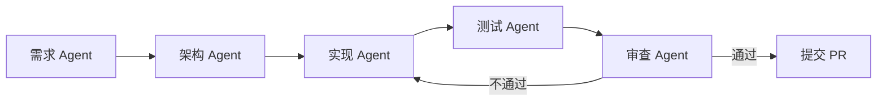

优点是流程容易控制，缺点是角色之间会重复读取代码和消耗上下文。

#### Orchestrator–Worker

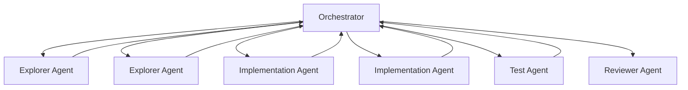

适合动态拆解任务。Orchestrator 根据依赖关系、资源和运行结果决定是否继续分派。

#### 独立实现加仲裁

两个或多个 Agent 独立分析或实现同一问题，最后由 Reviewer 或 Judge 选择方案。它能够减少单一 Agent 的系统性偏差，但成本较高。

#### 并行工作树

每个 Agent 使用独立 Git Worktree 或 VM：

```text
main
 ├── worktree-agent-architecture
 ├── worktree-agent-backend
 ├── worktree-agent-frontend
 ├── worktree-agent-tests
 └── worktree-agent-review
```

这是目前较可靠的并行开发方式。Cursor Cloud Agents、Codex、Antigravity 和 Amp 等系统都在加强工作区或远程运行环境隔离。

参考：[Cursor Cloud Agent](https://cursor.com/docs/cloud-agent)

### K.8.2 真正的多 Agent 系统需要解决什么

多 Agent 并不是简单地同时启动多个 CLI，还必须解决：

- 任务依赖图和分派策略。
- 文件所有权和修改范围。
- Worktree、Branch、端口及数据库隔离。
- Agent 间消息、产物和状态传递。
- 重复劳动和上下文复制。
- 并发修改冲突。
- 子 Agent 失败、失联和超时。
- Token、费用和并发预算。
- 整体取消和级联取消。
- 最终合并、回归测试和统一验收。
- 循环委派、角色互相等待和死锁。
- 恶意或错误子 Agent 的权限传播。

Claude Code、Cursor、Antigravity、Amp、GitLab Duo 和 Qwen Code 都已支持不同程度的 Subagent 或并行 Agent，但产品之间的“多 Agent”含义并不一致：有的只是隔离上下文的子任务，有的是真正并行执行，有的已经包含远程工作区和任务控制面。

参考：[Claude Code Subagents](https://docs.anthropic.com/en/docs/claude-code/sub-agents)

---

## K.9 代码审查与验证 Agent

随着代码生成速度提高，CodingAgent 的竞争重点正在从“能否生成代码”转向“能否证明生成结果可靠”。

主要审查系统包括：

| 系统 | 主要特点 |
|---|---|
| **GitHub Copilot Code Review** | 在 GitHub Actions 中运行 Agentic Review，读取项目上下文，提供问题说明和可应用的修改建议。 |
| **CodeRabbit** | 面向 PR 的上下文审查、逐行建议、风险排序及 Agent Handoff，并在探索更适合大型 Agent PR 的 Change Stack 审查界面。 |
| **Qodo** | 使用多个专职 Agent 分析完整代码库、历史、团队规范和 PR，重点检查设计偏差、Breaking Change 和规范缺口。 |
| **Greptile** | 强调全代码库上下文和深层缺陷分析，并通过隔离执行环境实际运行代码和生成验证产物。 |

参考资料：

- [GitHub Copilot Code Review](https://docs.github.com/copilot/using-github-copilot/code-review/using-copilot-code-review)
- [CodeRabbit](https://www.coderabbit.ai/)
- [Qodo](https://docs.qodo.ai/code-review)
- [Greptile](https://www.greptile.com/agent)

未来更完整的验证链通常会是：

```text
开发 Agent
   ↓
编译 / 类型检查
   ↓
单元测试 / 集成测试 / E2E
   ↓
静态分析 / 安全扫描
   ↓
独立 Review Agent
   ↓
浏览器或真实运行验证
   ↓
人工审查
   ↓
合并
```

单纯让同一个 Agent 在同一个上下文里“自我审查”容易重复原有错误。更可靠的方式是使用独立上下文、不同提示词，甚至不同模型的 Reviewer Agent。

---

## K.10 AI 应用构建类 CodingAgent

这类系统经常被归入 CodingAgent，但它们实际上是面向新项目的垂直软件生产平台。

| 系统 | 主要定位 |
|---|---|
| **Replit Agent** | 从自然语言完成项目创建、编码、检查、修复、基础设施配置、托管和部署。 |
| **Lovable** | 面向 Web 全栈应用，通过 Plan Mode 和 Build Mode 生成可维护的真实代码，并使用子 Agent 处理专门任务。 |
| **Bolt** | 面向网站、Web 应用和移动应用，Agent 负责规划、编码和故障排查。 |
| **v0** | 从 UI 生成逐渐扩展到全栈应用和 Agent 应用，集成 GitHub 与部署工作流。 |

参考资料：

- [Replit Agent](https://docs.replit.com/features/agent/overview)
- [Lovable Agent Mode](https://docs.lovable.dev/features/agent-mode)
- [Bolt Agents](https://support.bolt.new/building/using-bolt/agents)
- [v0](https://v0.dev/docs)

它们适合：

- 从零构建原型或 SaaS。
- 前端页面和管理后台。
- 产品经理、设计师和非专业开发者。
- 快速部署演示应用。

它们通常不如 Claude Code、Codex、Cursor、OpenCode 等适合复杂遗留代码库、大型单体系统和强约束企业工程。

---

## K.11 决定 CodingAgent 能力的九个核心维度

### K.11.1 Context Engine

核心不是“能读取多少 Token”，而是能否找对信息。

主流手段包括：

- 文件名和目录搜索。
- Grep、Ripgrep、Repository Map。
- AST、Tree-sitter、符号和引用分析。
- LSP Definition、Reference、Diagnostics。
- 向量检索和语义索引。
- Git 历史、Issue、PR 和代码所有权。
- 按需加载与上下文压缩。
- 子 Agent 探索后返回结构化摘要。

代码库越大，Context Engine 对结果的影响越大。代码理解、索引与检索的完整设计见第十三至第十五章。

### K.11.2 Agent Harness

Harness 负责控制模型怎样工作，包括：

- System Prompt。
- Tool Schema。
- Agent Loop。
- Plan / Act 模式。
- Tool Error Recovery。
- Retry 与退避。
- Context Compaction。
- Token Budget。
- Loop Detection。
- Cancellation。
- Checkpoint 和恢复。
- Subagent 调度。

模型决定能力上限，Harness 决定能力能否稳定落地。

### K.11.3 Agent-Computer Interface

工具设计会直接影响执行效果：

- `read_file` 是整文件读取还是分段读取。
- `edit` 使用字符串替换、Diff Patch 还是 AST Edit。
- Shell 是否保留状态。
- 命令输出如何截断。
- 后台进程如何跟踪。
- 测试失败怎样反馈。
- Agent 是否可以访问浏览器和运行中的应用。
- 大型日志如何摘要并保留原始 Artifact。

SWE-agent 等研究系统的一个重要价值，就是把 Agent-Computer Interface 本身作为研究对象。

参考：[SWE-agent Background](https://github.com/princeton-nlp/SWE-agent/blob/main/docs/background/index.md)

### K.11.4 Execution Environment

主要有四种方式：

| 模式 | 优点 | 风险 |
|---|---|---|
| 直接操作宿主机 | 快、环境真实 | 误删文件、Secret 泄露、命令风险 |
| Git Worktree | 隔离代码修改，成本低 | 仍共享宿主机进程和网络 |
| Container | 文件和进程隔离较好 | 环境重建和缓存复杂 |
| VM / Remote Sandbox | 隔离最强，适合云端 Agent | 成本高，启动和环境同步较慢 |

成熟系统通常还会把网络访问、Secret、文件范围和审批策略分开管理，而不是只有一个“允许全部操作”的开关。Codex 的沙箱和审批分层、Cursor Cloud Agents 的隔离 VM，以及 Antigravity 的隔离工作树都体现了这一方向。

参考：[Codex Sandboxing](https://developers.openai.com/codex/sandboxing)

沙箱层级、隔离维度与执行生命周期见第十六章。

### K.11.5 Verification

可靠 CodingAgent 至少需要支持：

- 编译和类型检查。
- 单元测试。
- 集成和端到端测试。
- Lint 和格式检查。
- 静态分析和安全扫描。
- 应用启动与健康检查。
- 浏览器操作和截图。
- 独立 Review Agent。
- 验收标准与 Spec 对账。

没有 Verification 的 Agent，本质上只是概率性代码生成器。

### K.11.6 Memory、Rules 与 Skills

这三类能力不要混为一谈：

- **Rules / Instructions**：项目规范和约束，例如 AGENTS.md、CLAUDE.md。
- **Memory**：从历史会话和用户行为中持续沉淀的事实、偏好和经验。
- **Skills**：可以复用的步骤、脚本、工具及领域知识包。

Claude Code、Cursor、Codex、Kiro、Qwen Code 和 VS Code 都在逐步采用项目规则、Skills 或持久化记忆。

参考：[Claude Code Memory](https://docs.anthropic.com/en/docs/claude-code/memory)

### K.11.7 多 Agent 编排

核心指标不是 Agent 数量，而是：

- 是否真正并发。
- 是否隔离上下文。
- 是否隔离工作区。
- 是否支持动态任务分解。
- 是否支持父子取消。
- 是否限制委派深度。
- 是否可以中途调整任务。
- 是否支持依赖图和结果仲裁。
- 是否能够跨项目协作。
- 是否有统一预算和最终验收。

### K.11.8 安全与治理

企业落地时通常比模型能力更重要：

- 文件系统访问范围。
- 命令白名单与审批。
- 网络域名和出口控制。
- Secret 按任务注入。
- MCP Server 信任与签名。
- Prompt Injection 防护。
- Git 分支保护。
- 身份、组织和租户隔离。
- 操作审计。
- 数据保留与模型训练策略。
- Agent 生成代码的责任归属和追踪。

权限、审批、策略和沙箱之间的边界见第十六、十七章。

### K.11.9 可观测性与评估

至少应记录：

- Session、Run、Turn、Tool Call。
- Prompt 和模型版本。
- Context 来源。
- Tool 输入、输出和异常。
- Token、费用和延迟。
- 文件修改和命令执行。
- 测试、审查和验收结果。
- Retry、Compaction 和模型切换。
- 人工介入次数。
- 最终 Commit、PR 和线上结果。

---


## K.12 CodingAgent 与通用平台 Agent 的关系和区别

“平台 Agent”在行业中经常有两种含义，必须先拆开：

1. **通用平台 Agent**：面向客服、运营、数据分析、办公自动化、业务流程等场景构建的 Agent。
2. **Agent Platform**：用于开发、托管、编排、评估和治理 Agent 的基础设施或云平台。
3. **CodingAgent**：面向软件工程任务垂直优化的 Agent，代码仓库既是知识源，也是可被修改的工作对象。
4. **CodingAgent Platform**：统一管理 CodingAgent、工作区、沙箱、权限、任务、验证和交付产物的平台。

因此，CodingAgent 并不是与通用 Agent 完全不同的物种，而是通用 Agent 架构在软件工程领域的深度垂直化。

### K.12.1 共同底座与代码专用层

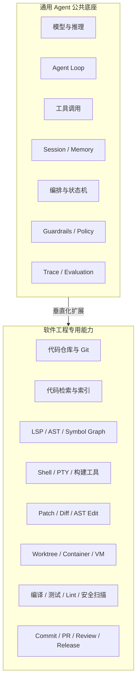

通用 Agent 的核心是“通过工具完成业务动作”；CodingAgent 的核心则是：

> **在可隔离、可验证、可回滚的软件工程环境中，对一个持续变化的代码库实施受控变更。**

### K.12.2 CodingAgent 与通用平台 Agent 对比

| 维度 | CodingAgent | 通用平台 Agent |
|---|---|---|
| 主要目标 | 修改、验证并交付软件 | 完成业务流程、问答、分析或操作 |
| 核心状态 | 仓库 Revision、工作树、构建产物、测试状态 | 会话、业务对象、知识库、工作流状态 |
| 主要工具 | 文件、Patch、Git、Shell、LSP、编译器、测试框架 | API、数据库、搜索、CRM、工单、办公系统 |
| 典型输入 | Issue、Spec、代码、错误日志、PR 评论 | 用户问题、业务事件、文档、结构化数据 |
| 典型输出 | Diff、Commit、Branch、PR、测试证据 | 文本答复、业务记录、审批结果、外部系统动作 |
| 任务验证 | 编译、类型检查、测试、Lint、运行时验证、Review | 业务规则、字段校验、事实核验、流程终态 |
| 环境需求 | 真实或可复现的开发环境 | 通常是 API 连接器和托管运行时 |
| 上下文结构 | 文件、符号、调用关系、依赖、Git 历史 | 对话、知识文档、实体、业务数据库 |
| 权限重点 | 文件写入、命令执行、网络、Secret、Git 与部署 | 数据访问、业务 API、身份委托、审批 |
| 失败模式 | 编译失败、回归、环境污染、错误修改、依赖破坏 | 错误调用 API、事实错误、流程中断、越权操作 |
| 时间尺度 | 秒级交互到数小时异步开发 | 毫秒级问答到长流程自动化 |
| 人工介入点 | Plan、危险命令、Diff、PR、上线 | 高风险业务动作、审批、异常分支 |
| 典型评测 | SWE-bench、Terminal-Bench、内部 Issue 回放 | 任务完成率、工具成功率、事实正确率、业务 KPI |

### K.12.3 CodingAgent 与 Code Interpreter 的区别

Code Interpreter 可以执行代码，但它通常不是完整 CodingAgent。

| 能力 | Code Interpreter | CodingAgent |
|---|---|---|
| 主要用途 | 数据计算、文件处理、临时代码执行 | 修改真实软件项目 |
| 工作对象 | 临时脚本、上传文件、Notebook 状态 | 多目录代码库、Git Revision、构建系统 |
| 代码理解 | 通常基于已提供文件 | 主动检索整个仓库并分析跨文件关系 |
| 版本控制 | 通常不是核心能力 | Branch、Commit、Diff、PR 是核心对象 |
| 语义能力 | 不一定连接 LSP 或符号索引 | 常结合 LSP、AST、Symbol Index |
| 验证闭环 | 运行脚本并查看结果 | 编译、测试、Lint、E2E、Review、回归 |
| 交付物 | 图表、数据文件、计算结果 | 可审查、可合并的软件变更 |

### K.12.4 CodingAgent 与 Computer-Use Agent 的区别

Computer-Use Agent 主要通过鼠标、键盘和视觉界面操作软件；CodingAgent 主要通过结构化代码工具、Shell 和 Git 操作工程。

两者正在融合：

- CodingAgent 使用浏览器 Agent 验证 Web UI。
- Computer-Use Agent 调用 CodingAgent 修复其发现的问题。
- CodingAgent 通过截图、DOM、可访问性树和浏览器日志形成验收证据。
- 通用平台 Agent 可以把 CodingAgent 当作一个专门处理代码任务的 Worker。

但浏览器可以“看到页面”不等于理解代码；能够修改代码也不等于已经验证真实用户路径。

### K.12.5 主流通用 Agent 开发与运行平台

| 平台或框架 | 主要定位 | 与 CodingAgent 的关系 |
|---|---|---|
| **OpenAI Agents SDK** | 管理 Agent Turn、工具执行、Guardrails、Handoff、Session 和 Tracing，也支持可恢复状态及沙箱型 Agent | 可用于构建上层任务编排、Reviewer、发布或运维 Agent；代码执行层仍需仓库、Shell、索引和验证工具 |
| **Google ADK** | 面向 Agent 构建、运行、评估和部署，支持图工作流、多 Agent 协作、Session、State 与 Memory | 可以编排需求、开发、测试等多个专职 Agent，也可将 CodingAgent 包装成子 Agent 或远程 Agent |
| **LangGraph** | 强调持久化状态、Durable Execution、Streaming、Human-in-the-loop 和图式编排 | 适合实现长任务状态机、审批节点、故障恢复和多 Agent 工作流，但代码智能与沙箱需要外接 |
| **Amazon Bedrock AgentCore** | 提供托管 Runtime、Memory、Gateway、Identity、Browser、Code Interpreter 和 Observability | 可承载企业 CodingAgent 服务及其工具，但仍需补充 Git 工作区、编译测试和代码索引 |
| **Microsoft Foundry Agent Service** | 统一管理 Agent、模型、工具、托管运行时、RBAC、网络、策略、Tracing 和 Evaluation | 可作为企业 Agent 控制面；CodingAgent 可以通过 Hosted Agent、MCP 或专用执行环境接入 |

参考资料：

- [OpenAI Agents SDK](https://openai.github.io/openai-agents-python/)
- [Google Agent Development Kit](https://google.github.io/adk-docs/)
- [LangGraph Overview](https://docs.langchain.com/oss/python/langgraph/overview)
- [Amazon Bedrock AgentCore](https://docs.aws.amazon.com/bedrock-agentcore/latest/devguide/what-is-bedrock-agentcore.html)
- [Microsoft Foundry](https://learn.microsoft.com/en-us/azure/foundry/what-is-foundry)

### K.12.6 三种组合方式

#### 方式一：CodingAgent 作为通用平台 Agent 的工具

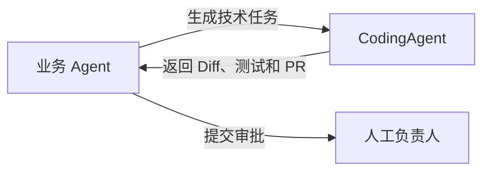

适合由产品、工单、告警或安全 Agent 自动触发代码修改。

#### 方式二：通用 Agent 平台作为 CodingAgent 控制面

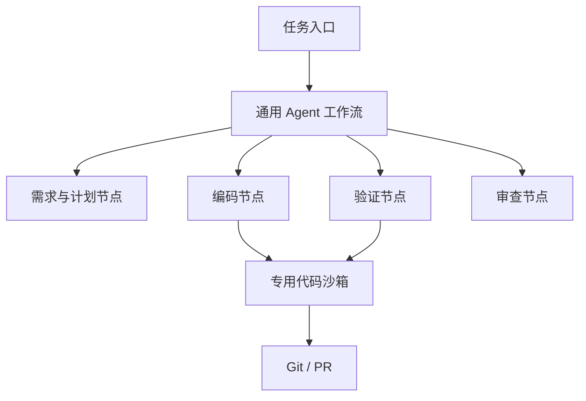

平台负责任务状态、持久化、审批和可观测；专用执行层负责代码理解和工程操作。

#### 方式三：CodingAgent 平台反向接入业务 Agent

CodingAgent 控制面管理多个代码执行器，同时通过 MCP、A2A、HTTP 或消息队列调用需求分析、知识查询、安全审查、发布审批等外部 Agent。

### K.12.7 选型判断

以下情况更适合直接使用通用 Agent 平台：

- 核心动作是调用业务 API，而不是修改代码。
- 需要大量审批、流程编排、会话状态和企业身份治理。
- 代码执行只是一个受限工具。
- 主要交付物是业务结果，而不是 Git 变更。

以下情况需要专用 CodingAgent：

- 任务涉及多个文件和跨模块影响分析。
- 需要真实构建、测试、调试和环境复现。
- 需要 Git Worktree、Branch、Commit 和 PR。
- 需要 LSP、AST、Symbol Index、Repo Map 等代码智能。
- 需要对任意 Shell 命令、依赖安装和网络访问实施隔离。
- 最终结果必须能被工程师审查、回滚和追责。

---

## K.13 代码理解：CodingAgent 如何建立仓库认知

代码理解不是一次向量检索，也不是把整个仓库发送给模型。成熟 CodingAgent 会把多种证据组合成一个随任务变化的“仓库认知模型”。

### K.13.1 代码理解的七层证据

| 层次 | 主要信息 | 常用机制 | 能回答的问题 |
|---|---|---|---|
| 仓库拓扑层 | 目录、模块、Manifest、构建入口 | 文件树、Glob、配置解析 | 项目由哪些子系统组成 |
| 词法层 | 字符串、标识符、错误码、配置键 | Grep、Ripgrep、BM25 | 某个名字在哪里出现 |
| 语法层 | 类、函数、Import、调用表达式、控制结构 | AST、CST、Tree-sitter | 文件内部结构是什么 |
| 符号语义层 | Definition、Reference、Type、Implementation | LSP、编译器、SCIP | 一个符号真正指向哪里 |
| 依赖图层 | 文件、包、模块、调用、继承关系 | Import Graph、Call Graph | 修改会影响哪些模块 |
| 动态行为层 | 实际调用、测试覆盖、错误栈、运行时状态 | Test、Trace、Profiler、日志 | 代码运行时怎样表现 |
| 历史与规范层 | 变更原因、所有者、约定、历史缺陷 | Git、PR、Issue、Rules | 为什么这样设计、应该怎样改 |

只使用其中一层会产生明显盲区：

- Grep 能找到同名文本，但不理解别名、重载和动态绑定。
- AST 能理解语法结构，但通常不知道跨模块真实类型。
- LSP 能提供语义导航，但依赖正确的项目配置和语言服务器状态。
- 向量检索能找到概念相似内容，但不能保证符号解析准确。
- Git 历史能解释设计原因，但不代表当前实现仍然一致。
- 测试可以证明某些行为，却无法覆盖所有隐含约束。

### K.13.2 代码理解参考架构

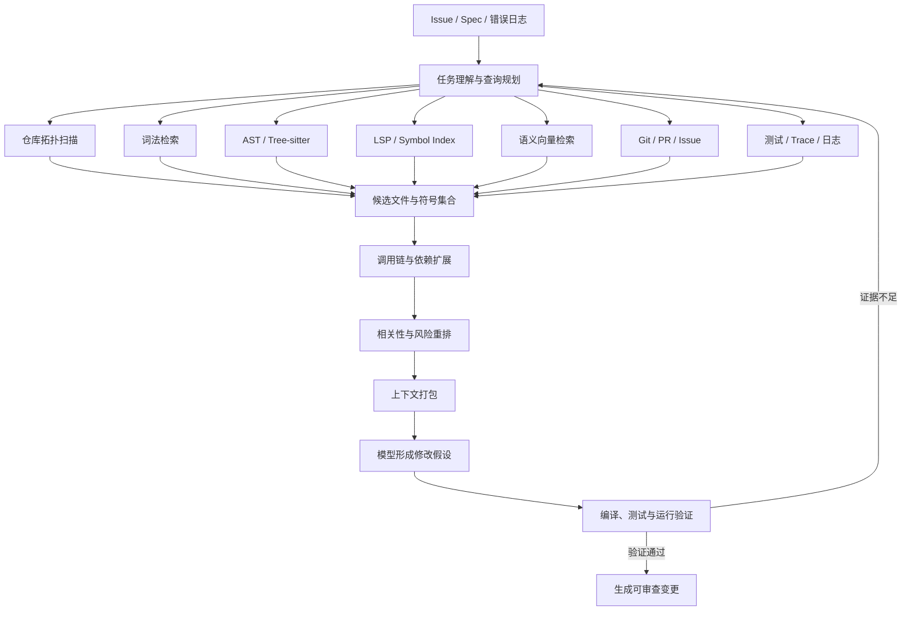

### K.13.3 CodingAgent 必须回答的六类问题

1. **定位问题**：相关代码在哪些文件和符号中？
2. **结构问题**：模块、类、函数、接口和数据结构如何组织？
3. **关系问题**：谁调用它、它调用谁、由谁实现、有哪些引用？
4. **行为问题**：运行时实际走哪条路径，失败条件是什么？
5. **影响问题**：修改会影响哪些调用方、测试、配置和数据迁移？
6. **规范问题**：仓库已经采用什么模式，新增代码应放在哪里？

这六类问题对应不同工具。让模型只使用 `grep` 回答全部问题，会把“找到文本”误当成“理解程序”。

### K.13.4 仓库初始化与增量更新

一个可靠的代码理解服务通常需要两个阶段。

#### 冷启动阶段

- 识别语言、包管理器、构建系统和 Monorepo 工具。
- 读取顶层 README、AGENTS.md、构建脚本和主要 Manifest。
- 构建文件清单，过滤二进制、Vendor、生成目录和缓存。
- 为支持的语言初始化 Parser 和 Language Server。
- 生成 Symbol Index、Import Graph 和基础 Repo Map。
- 记录当前 Git Revision、配置摘要和索引版本。

#### 增量阶段

- 监听文件变更、Git Checkout、依赖更新和配置变化。
- 只重新解析受影响文件。
- 根据 Import、Reference 和 Build Graph 扩散失效范围。
- 更新向量、符号、依赖和 Repo Map 分片。
- 对当前会话的未提交修改维护 Overlay Index。
- 在返回结果时标记索引对应的 Revision，避免读取陈旧结果。

### K.13.5 基于任务的理解循环

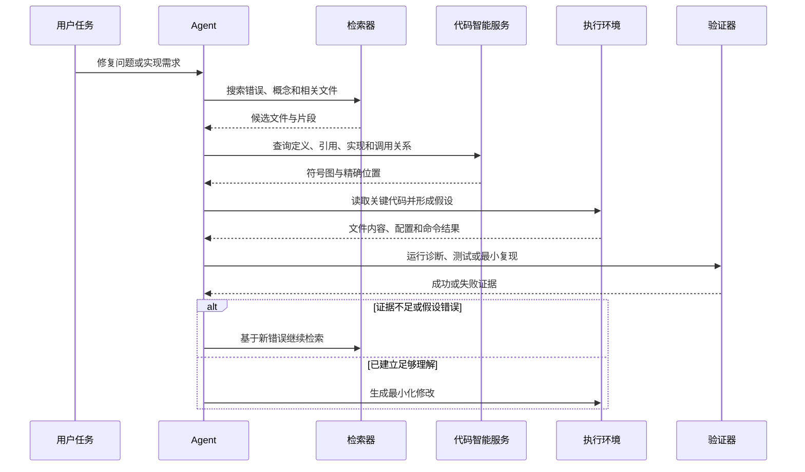

成熟 Agent 的检索是迭代式的，而不是“开始前检索一次，之后只依赖模型记忆”。

### K.13.6 静态理解与动态理解应互相校验

静态信息可以告诉 Agent：

- 某函数有哪些调用方。
- 某接口有哪些实现。
- 某配置项在哪里读取。
- 某类型怎样定义。

动态信息可以告诉 Agent：

- 实际运行时选择了哪个实现。
- 哪个分支真正触发错误。
- 哪些测试覆盖该路径。
- 性能热点和竞态出现在哪里。
- 环境变量、Feature Flag 和依赖版本怎样改变行为。

最佳实践是：

> **静态分析负责缩小范围，动态执行负责验证假设。**

### K.13.7 代码理解的置信度与来源

每个进入上下文的证据最好带有：

```text
repository
revision
path
line_range
symbol_id
language
retrieval_method
index_version
freshness
confidence
```

这样可以避免模型把以下内容混为一谈：

- 当前分支和旧分支代码。
- 已提交文件和工作区 Overlay。
- 真实定义和仅仅同名的文本。
- 运行时证据和静态推断。
- 生成文件和源文件。
- 第三方依赖和本仓库实现。

### K.13.8 常见失败模式

| 失败模式 | 直接后果 | 改进方式 |
|---|---|---|
| 只读取入口文件 | 忽略跨模块约束 | Definition/Reference 与依赖扩展 |
| 全仓库向量检索 | 召回大量概念相似但不可修改的代码 | 混合检索和结构化重排 |
| 索引未绑定 Revision | Agent 根据旧代码生成补丁 | Revision-aware Index |
| 语言服务器未正确初始化 | Definition、Diagnostic 不可信 | 复用真实构建配置并做健康检查 |
| 只看生产代码 | 修改后缺少可验证标准 | 同时检索测试、Fixture 和 CI |
| 只看当前代码 | 重复历史上已经失败的方案 | 检索 Git Blame、PR 和 ADR |
| 一次性塞入大量文件 | Token 浪费和 Lost-in-the-middle | 分层摘要、按需展开和上下文预算 |
| 把模型结论当作事实 | 错误调用链和影响分析 | 要求工具证据与验证闭环 |

---

## K.14 LSP、AST、Symbol Index 与 Repo Map 详解

这几个概念都服务于代码理解，但解决的问题不同：

- **AST / CST**：描述单个文件或代码片段的语法结构。
- **LSP**：以在线请求方式提供项目级语言语义能力。
- **Symbol Index**：把符号、定义、引用和关系持久化，供快速查询。
- **Repo Map**：在有限 Token 内给模型提供仓库级结构摘要。
- **代码搜索**：根据用户任务快速找到可能相关的文本、文件和符号。

### K.14.1 LSP：在线语义服务

Language Server Protocol 定义了编辑器或其他客户端与 Language Server 之间的标准通信方式。对于 CodingAgent，客户端不一定是 IDE，也可以是 Agent Harness 中的代码智能服务。

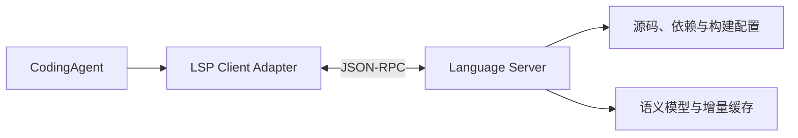

#### 对 CodingAgent 最有价值的 LSP 能力

| LSP 能力 | 典型方法 | Agent 用途 |
|---|---|---|
| 文档符号 | `textDocument/documentSymbol` | 获取文件中的类、函数、方法和层级 |
| 工作区符号 | `workspace/symbol` | 按名称搜索项目级符号 |
| 定义与声明 | `textDocument/definition`、`declaration` | 找到符号真实来源 |
| 类型定义 | `textDocument/typeDefinition` | 从变量或表达式跳转到类型 |
| 实现 | `textDocument/implementation` | 找到接口、抽象类或 Trait 的实现 |
| 引用 | `textDocument/references` | 做调用方定位和影响分析 |
| 调用层级 | `textDocument/prepareCallHierarchy`、`callHierarchy/incomingCalls`、`callHierarchy/outgoingCalls` | 构建局部调用图 |
| 类型层级 | `textDocument/prepareTypeHierarchy`、`typeHierarchy/supertypes`、`typeHierarchy/subtypes` | 分析继承和实现关系 |
| Hover 与签名 | `hover`、`signatureHelp` | 获取类型、文档和函数签名 |
| 诊断 | `textDocument/publishDiagnostics`、`textDocument/diagnostic`、`workspace/diagnostic` | 获取编译、类型和语义错误 |
| 重命名 | `prepareRename`、`rename` | 执行语义级重构 |
| Code Action | `textDocument/codeAction` | 获取 Quick Fix、Import 和重构建议 |

并非每个 Language Server 都实现全部能力，因此 Agent 需要先做 Capability Negotiation。

#### LSP 生命周期

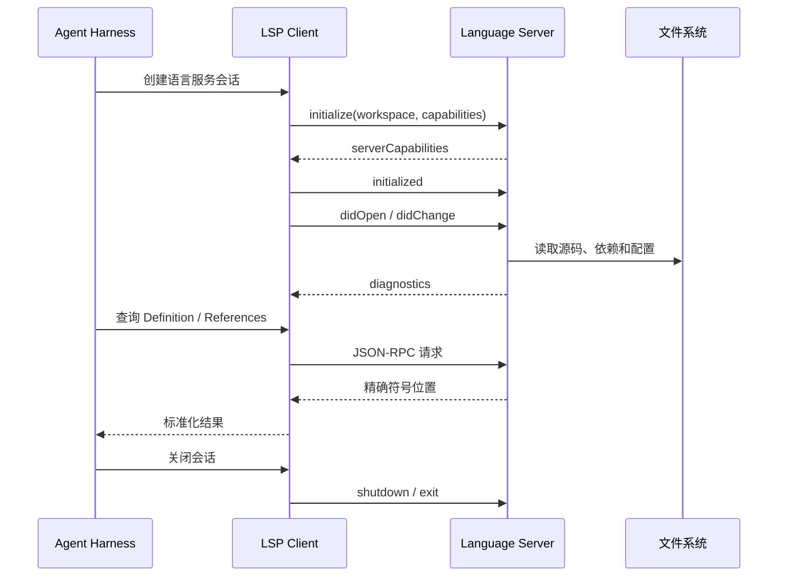

#### CodingAgent 集成 LSP 的工程难点

- 不同 Language Server 的启动参数、安装方式和配置不同。
- C/C++ 依赖 `compile_commands.json`，Java 依赖构建模型，Rust、Go、TypeScript 也有各自工作区规则。
- Monorepo 可能需要多个 Root、多个 Server 或按 Package 分片。
- Agent 修改文件后必须发送 `didChange` 或刷新磁盘状态。
- 未保存 Overlay 与磁盘文件可能产生两个不同语义视图。
- Language Server 可能崩溃、卡住、耗尽内存或长时间索引。
- 诊断到达是异步的，不能把“暂时没有诊断”直接视为成功。
- Generated Code、Macro、Template、条件编译和动态语言会降低精度。
- Server 版本、编译器版本和项目依赖必须与真实开发环境一致。

#### LSP 的边界

LSP 很强，但它不是完整代码理解系统：

- 它通常回答精确语义查询，不负责自然语言检索。
- 它依赖语言服务器已经成功加载项目。
- 它不天然提供跨仓库历史、业务语义和运行时行为。
- 每次在线查询都有延迟，超大型仓库需要持久化索引辅助。
- 某些语言服务器只覆盖当前 Workspace，不适合跨仓库导航。

参考：[Language Server Protocol 3.17 Specification](https://microsoft.github.io/language-server-protocol/specifications/lsp/3.17/specification/)

### K.14.2 AST、CST 与 Tree-sitter

#### AST 与 CST 的区别

| 概念 | 关注点 | 是否保留括号、分隔符等语法细节 | 典型用途 |
|---|---|---|---|
| **CST：Concrete Syntax Tree** | 完整语法结构 | 通常保留 | 编辑器、高亮、格式、增量解析 |
| **AST：Abstract Syntax Tree** | 抽象程序结构 | 通常省略部分语法细节 | 编译、静态分析、代码生成 |

Tree-sitter 官方定义是增量解析库，并构建 **Concrete Syntax Tree**。工程实践中经常把 Tree-sitter 的解析树笼统称为 AST，但做系统设计时应区分两者。

#### Tree-sitter 对 CodingAgent 的价值

- 多语言解析接口相对统一。
- 可在文件修改后增量更新语法树。
- 能容忍部分不完整或暂时有语法错误的代码。
- 可以通过 Query 捕获函数、类、Import、调用和标识符。
- 适合构建代码 Chunk、Repo Map、结构化搜索和编辑前校验。
- 不需要启动完整编译器，冷启动通常比 Language Server 更轻。

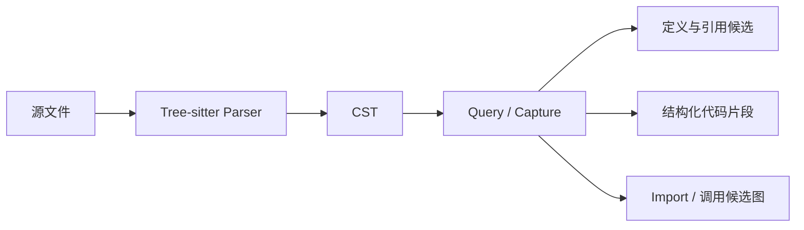

#### Tree-sitter 的限制

- 语法正确不等于类型正确。
- 通常无法精确解析跨模块类型、重载和动态分派。
- 不知道构建系统最终选择了哪些 Feature、宏或条件分支。
- Query 需要按语言维护，Grammar 质量也有差异。
- 从调用表达式提取出的边通常只是候选边，不一定是真实语义调用。

因此，Tree-sitter 适合作为“快速、广覆盖的结构层”，LSP 或编译器适合作为“较慢、较精确的语义层”。

参考：[Tree-sitter Introduction](https://tree-sitter.github.io/tree-sitter/)

### K.14.3 Symbol Index：持久化代码语义

Symbol Index 把语言分析结果从“临时在线查询”变成“可持久化、可版本化、可快速检索的数据”。

一个常见的符号记录包含：

```text
symbol_id
display_name
fully_qualified_name
kind
language
definition_locations
declaration_locations
reference_locations
implementation_locations
container_symbol
documentation
signature
relationships
repository
revision
indexer_version
```

#### 常见 Symbol Index 类型

| 类型 | 代表机制 | 优点 | 局限 |
|---|---|---|---|
| 轻量标签索引 | Universal Ctags | 快、语言覆盖广、部署简单 | 类型与跨文件语义较弱 |
| 在线语义索引 | Language Server 内部索引 | 与当前编辑状态一致、语义较精确 | 难持久化和跨仓库复用 |
| 标准离线索引 | SCIP、LSIF | 可持久化、可上传、可跨工具消费 | 需要语言专用 Indexer |
| 编译器索引 | Clangd Index、rust-analyzer 等 | 最接近真实类型系统 | 强依赖语言和构建配置 |
| 自建图索引 | Symbol Graph / Call Graph | 适合影响分析和 Agent 查询 | 数据模型和增量一致性复杂 |

SCIP 是语言无关的代码索引协议，可以描述 Definition、Reference、Implementation 等代码导航信息。LSIF 也用于把 Language Server 能力预计算为离线索引，但两者的数据模型和生态不同。

参考资料：

- [SCIP Code Intelligence Protocol](https://github.com/scip-code/scip)
- [LSIF Specification](https://microsoft.github.io/language-server-protocol/specifications/lsif/0.5.0/specification/)
- [Universal Ctags](https://docs.ctags.io/en/latest/man/ctags.1.html)

#### 在线 LSP 与离线 Symbol Index 的关系

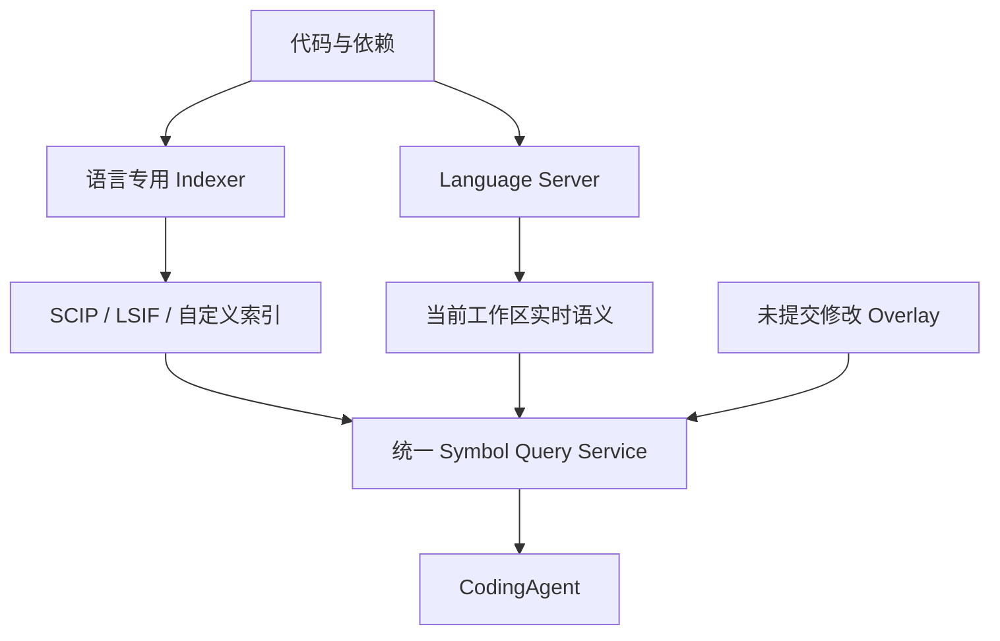

推荐做法不是二选一，而是：

- 用离线索引覆盖仓库基线和跨仓库导航。
- 用 LSP 覆盖当前工作区与未提交修改。
- 用 Overlay 合并会话内变更。
- 查询结果必须标记 Revision、来源和新鲜度。

### K.14.4 Repo Map：面向模型的仓库压缩表示

Repo Map 不是完整索引，而是把仓库的重要结构压缩到有限 Token 中。典型内容包括：

- 文件路径。
- 关键类、函数、方法和类型。
- 函数签名与少量关键代码行。
- 模块之间的 Import 或引用关系。
- 与当前任务高度相关的符号。

Aider 的 Repo Map 会生成仓库中重要类和函数的紧凑地图，并使用依赖图上的图排序算法，在给定 Token Budget 内选择最重要的部分。

#### Repo Map 生成流程

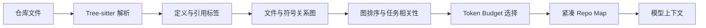

#### Repo Map 的优势

- 在模型读取具体文件前提供全局结构感。
- 帮助模型发现应该继续展开哪些文件。
- 比完整仓库内容节省大量 Token。
- 对没有完整 LSP 支持的语言也能提供基础结构。
- 可作为会话初始上下文或检索路由提示。

#### Repo Map 的局限

- 它是有损摘要，不应作为最终事实来源。
- 排名高的符号未必与当前任务相关。
- 动态调用、反射和配置驱动关系难以表达。
- 大型 Monorepo 需要分层 Map，而不是一张全局平面图。
- Map 过旧会误导 Agent，必须绑定 Revision。
- 把 Repo Map 固定塞入每轮上下文可能造成重复 Token 消耗。

参考资料：

- [Aider Repository Map](https://aider.chat/docs/repomap.html)
- [Building a Better Repository Map with Tree-sitter](https://aider.chat/2023/10/22/repomap.html)

### K.14.5 各类代码智能能力对比

| 能力 | 精确文本匹配 | 语法结构 | 类型语义 | 跨文件关系 | 自然语言召回 | 更新成本 | 最适合 |
|---|---:|---:|---:|---:|---:|---:|---|
| Grep / Ripgrep | 高 | 低 | 无 | 低 | 低 | 低 | 错误码、标识符、配置键 |
| Ctags | 中 | 中 | 低 | 中 | 无 | 低 | 快速符号导航 |
| Tree-sitter | 中 | 高 | 低 | 中 | 无 | 中 | 结构化 Chunk、定义候选、Repo Map |
| LSP | 中 | 高 | 高 | 高 | 无 | 中到高 | Definition、Reference、Diagnostic、Rename |
| SCIP / LSIF | 中 | 高 | 高 | 高 | 无 | 高 | 持久化语义索引、跨仓库导航 |
| 向量检索 | 低 | 低到中 | 低 | 低 | 高 | 中到高 | 概念、职责和自然语言问题 |
| 依赖图 / 调用图 | 低 | 中 | 中到高 | 高 | 低 | 高 | 影响分析、调用链和变更范围 |
| Repo Map | 低 | 中 | 中 | 中 | 间接支持 | 中 | 为模型提供全局结构摘要 |
| 测试与 Trace | 无 | 无 | 运行时事实 | 高 | 低 | 高 | 验证真实行为与动态路径 |

### K.14.6 推荐的混合代码智能架构

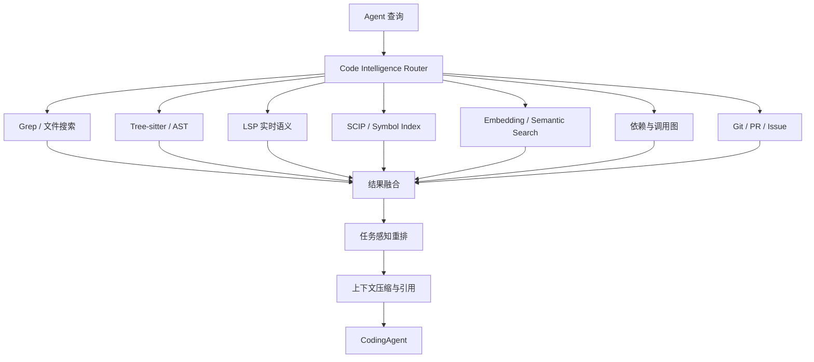

实践中，不应要求 Agent 自己猜该使用哪一种底层索引。应提供统一查询层，并根据问题类型自动路由：

- 精确名字优先词法和符号检索。
- “哪个模块负责某功能”优先语义检索和 Repo Map。
- “谁调用这个方法”优先 LSP、SCIP 和调用图。
- “修改会破坏什么”优先 Reference、依赖图、测试和 Git 历史。
- “为什么这样设计”优先 ADR、PR、Issue 和 Blame。
- “运行时到底走哪条路径”优先测试、Trace 和日志。

---

## K.15 代码检索与上下文工程

代码检索的目标不是返回最多结果，而是用最小上下文找到足以完成任务的证据。

### K.15.1 七类检索方式

#### 1. 路径与文件检索

根据文件名、扩展名、目录、Glob 和构建清单定位候选文件。

适合：

- 查找 `package.json`、`Cargo.toml`、`pom.xml`。
- 定位测试、Migration、配置和生成脚本。
- 根据模块名快速缩小范围。

#### 2. 词法检索

使用 Grep、Ripgrep、倒排索引或 BM25 搜索精确文本。

适合：

- 错误信息。
- 函数名和配置键。
- API 路径。
- 日志字段。
- Feature Flag。

#### 3. 结构化检索

基于 AST/CST Query 搜索语法模式，而不是字符模式。

例如：

- 所有调用某 API 的函数。
- 所有未带超时的网络请求。
- 所有实现某注解或接口的类。
- 所有直接拼接 SQL 的表达式。
- 所有使用某种错误处理模式的代码。

#### 4. 符号检索

根据 Fully Qualified Symbol、Definition、Reference、Implementation 和类型关系查询。

适合：

- 重名符号消歧。
- 跨文件引用。
- 接口实现定位。
- Rename 和影响分析。

#### 5. 语义检索

将代码、文档或符号摘要编码为向量，根据自然语言语义召回。

适合：

- “认证在哪里做？”
- “哪个模块负责恢复中断任务？”
- “和上传失败相关的逻辑是什么？”
- 用户不知道具体类名或错误字符串的情况。

#### 6. 图检索

沿 Import、Call、Inheritance、Data Flow、Build Dependency 或 Ownership Graph 展开。

适合：

- 查找上下游。
- 识别核心模块。
- 确定修改半径。
- 选择应运行的受影响测试。

#### 7. 历史与动态检索

检索 Git History、PR、Issue、日志、Trace、Coverage 和失败报告。

适合：

- 理解设计原因。
- 定位回归引入点。
- 验证真实执行路径。
- 查找过去类似修复。

### K.15.2 多阶段混合检索架构

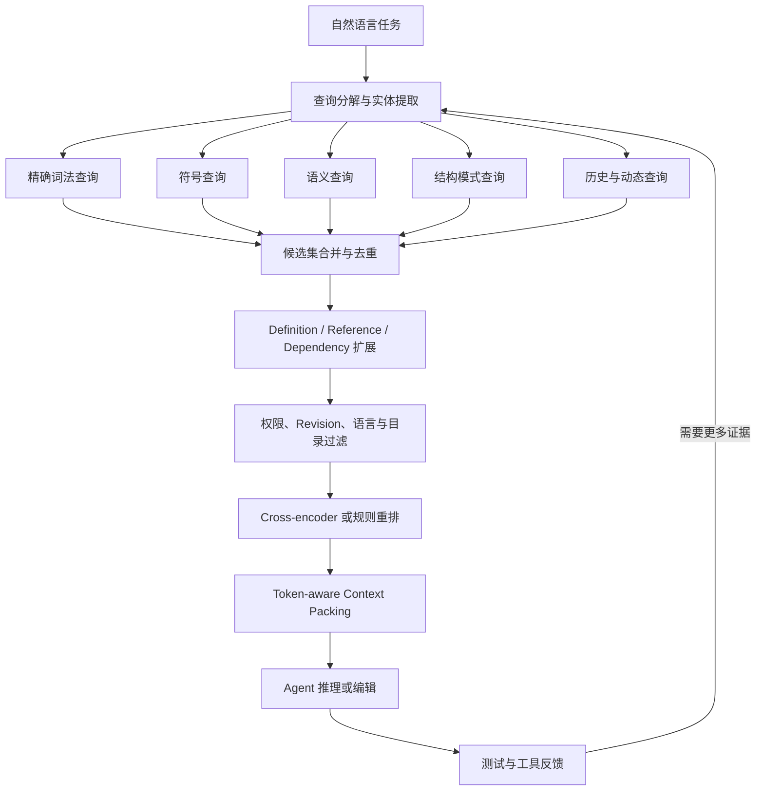

### K.15.3 Query Planner 应怎样拆任务

例如用户提出：

> “修复上传大文件后界面一直显示处理中，而且重启后任务无法恢复。”

可以拆成：

```text
概念查询：
- upload
- large file
- processing
- resume / recovery
- persisted task

精确查询：
- 界面显示的文案
- 状态枚举名
- API 路由
- 错误日志

结构查询：
- 状态机转换
- 后台任务创建
- 持久化写入
- 应用启动恢复逻辑

图扩展：
- UI 状态组件 → Store → IPC/API → Service → Repository
- Task Model → Migration → Recovery Worker
- 相关单元测试、E2E 和历史 PR
```

这样可以避免模型只命中包含“upload”字符串的表层 UI 文件。

### K.15.4 检索结果排序

一个通用的候选评分可以写成：

```text
Score =
    w_lexical   × LexicalMatch
  + w_semantic  × SemanticSimilarity
  + w_symbol    × SymbolExactness
  + w_graph     × GraphProximity
  + w_task      × TaskRoleMatch
  + w_history   × HistoricalEvidence
  + w_freshness × RevisionFreshness
  - w_noise     × GeneratedOrVendorPenalty
```

这不是固定公式。不同任务应动态调权：

- 编译错误：提高精确文本、符号和构建图权重。
- 架构问题：提高 Repo Map、语义和依赖图权重。
- 安全问题：提高数据流、危险 API 和历史漏洞权重。
- UI 缺陷：提高组件树、状态流、浏览器日志和截图关联权重。
- 性能问题：提高 Trace、Profiler 和调用图权重。

### K.15.5 Context Packing

检索命中后，仍需要把结果组织成模型可以稳定使用的上下文。

推荐顺序：

1. 任务目标和验收标准。
2. 仓库、分支和 Revision。
3. 项目规则与不可违反的边界。
4. 关键符号定义。
5. 直接调用方和被调用方。
6. 相关测试、配置和数据结构。
7. 历史设计说明。
8. 运行时错误、日志或 Trace。
9. 明确标注仍然未知的部分。

每个片段应包含：

```text
path
line_start
line_end
symbol
revision
retrieval_reason
content
```

### K.15.6 Token Budget 策略

不应按“文件是否相关”做二元选择，而应分配不同信息密度：

| 信息类型 | 推荐表达 |
|---|---|
| 顶层仓库结构 | 目录树和模块摘要 |
| 非关键文件 | 路径、职责和主要符号 |
| 候选文件 | 关键函数签名与局部片段 |
| 当前修改文件 | 较完整的相关代码范围 |
| 大型日志 | 错误窗口、摘要和原始 Artifact 引用 |
| 重复调用方 | 聚合列表，不重复粘贴完整代码 |
| 生成文件 | 默认排除，只保留来源指针 |
| 外部依赖 | API 签名和版本，不复制全部源码 |

### K.15.7 大型 Monorepo 的检索设计

大型仓库需要分层和分片：

```text
Organization
 └── Repository
      └── Workspace / Package
           └── Module
                └── File
                     └── Symbol
```

关键策略包括：

- 以 Repository、Revision、Package 和 Language 作为索引分区。
- 先做全局路由，再进入模块级精确检索。
- 使用构建图和 Ownership 约束跨模块扩展。
- Vendor、Generated、Build Output 默认降权或排除。
- 对公共库和核心接口建立跨仓库 Symbol Link。
- 对超大文件按语法节点切分，而不是固定字符切分。
- 未提交工作区使用 Overlay，不污染共享基线索引。
- 每次 Checkout、Rebase 或依赖锁文件变化都要触发一致性检查。

### K.15.8 代码检索不是一次性 RAG

普通文档 RAG 常采用：

> 查询 → Top-K → 生成答案

CodingAgent 更适合：

> 查询 → 形成假设 → 调用代码工具 → 验证 → 根据新证据继续查询 → 修改 → 再验证

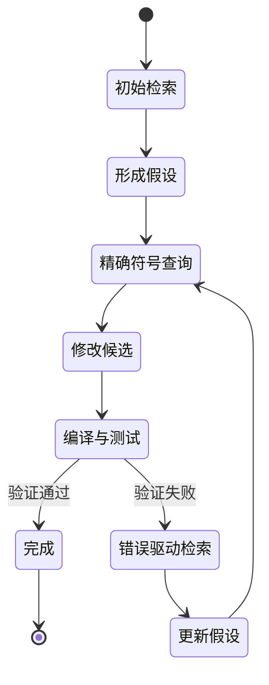

测试错误、编译诊断和运行日志是下一轮检索的高价值 Query，不应只当作给模型看的普通文本。

### K.15.9 检索与编辑的联动

检索系统还应服务于编辑范围控制：

- 根据 Definition 和 Reference 生成候选修改集合。
- 根据 Build Graph 选择最小测试集。
- 根据 Ownership 和模块边界提示需要额外审查的人。
- 根据 API 使用方判断是否需要兼容层或迁移。
- 根据数据结构变化定位 Schema、Migration 和序列化代码。
- 根据 UI 状态链定位组件、Store、Backend 和 E2E 用例。
- 根据历史修改识别容易回归的文件。

### K.15.10 代码检索质量指标

| 指标 | 含义 |
|---|---|
| Retrieval Recall@K | 真实需要修改或阅读的文件是否在前 K 个结果中 |
| Retrieval Precision@K | 前 K 个结果中真正有用的比例 |
| Symbol Resolution Rate | 符号查询成功解析到唯一目标的比例 |
| Reference Completeness | 找到真实引用和实现的完整度 |
| Stale Index Rate | 查询命中旧 Revision 或失效位置的比例 |
| Context Utilization | 模型实际引用的上下文占比 |
| Change Localization Accuracy | 首轮定位的修改文件与最终修改文件重合度 |
| Retrieval Turns | 完成任务前进行多少轮补充检索 |
| Context Cost | 每个成功任务用于代码上下文的 Token 和费用 |
| False Dependency Rate | 错误推断调用或依赖关系的比例 |

### K.15.11 常见反模式

- 把所有文件向量化后就宣称完成“代码理解”。
- 每轮都注入一份固定的大型 Repo Map。
- 用固定字符长度切分代码，切断函数和类型边界。
- 不记录 Revision，导致索引和工作树不一致。
- 只检索生产代码，不检索测试、配置和 Migration。
- 直接相信模型推测的调用链，不要求 Symbol 或运行证据。
- 对所有语言使用同一套 Parser 和 Chunk 规则。
- 将 Secret、`.env`、凭证文件和敏感日志纳入索引。
- 让多个 Agent 共享可变索引，却没有 Overlay 和事务边界。
- 只评估最终答案，不评估检索是否找到了关键证据。

GitHub Copilot 的仓库索引说明明确区分了语义代码搜索与仅依赖 `grep` 的精确匹配；Aider 的 Repo Map 则展示了通过结构解析和图排序压缩仓库上下文的思路。

参考资料：

- [GitHub Copilot Repository Indexing](https://docs.github.com/en/copilot/concepts/context/repository-indexing)
- [Aider Repository Map](https://aider.chat/docs/repomap.html)
- [SCIP Code Intelligence Protocol](https://github.com/scip-code/scip)

---

## K.16 沙箱与执行隔离

CodingAgent 会运行模型生成的命令、构建脚本、测试、安装脚本和外部工具。即使模型本身没有恶意，错误命令、Prompt Injection、恶意依赖或仓库内脚本也可能造成破坏。因此，沙箱不是附加功能，而是 CodingAgent 的基础运行时。

### K.16.1 沙箱、权限和审批不是同一件事

- **沙箱（Sandbox）**：从技术上限制进程能访问哪些文件、网络、系统调用和资源。
- **权限（Permission）**：声明某个 Agent 或工具被允许执行哪些动作。
- **审批（Approval）**：当动作越过自动授权边界时，由谁决定是否继续。
- **策略（Policy）**：定义允许、询问、拒绝、条件和例外的规则。
- **身份与凭证（Identity/Credential）**：决定动作以谁的身份访问外部系统。
- **审计（Audit）**：记录 Agent 最终做了什么，而不是只记录它计划做什么。

一个审批按钮不能替代沙箱。用户误批准后，沙箱仍应限制影响范围；反过来，即使动作位于沙箱内，也可能由于业务风险而需要审批。

OpenAI Codex 的官方安全文档将二者明确分开：Sandbox 决定命令技术上能触达什么，Approval Policy 决定什么时候必须暂停并请求批准。Claude Code 也将 Permission Mode、Permission Rule 与 Bash Sandbox 作为不同层次。

### K.16.2 沙箱的八个隔离维度

| 维度 | 需要控制的内容 |
|---|---|
| 文件系统 | 可读根目录、可写根目录、受保护路径、临时目录 |
| 进程 | 子进程树、信号、后台进程、守护进程、进程逃逸 |
| 系统调用 | Mount、Ptrace、Namespace、设备访问、内核接口 |
| 网络 | 是否联网、域名、IP、端口、协议、HTTP Method、代理 |
| 身份 | 操作系统用户、容器用户、云身份、外部服务身份 |
| Secret | 注入范围、有效期、可见进程、日志脱敏和吊销 |
| 资源 | CPU、内存、磁盘、进程数、文件句柄、执行时长 |
| 租户与工作区 | 不同用户、任务、Agent、仓库之间的隔离 |

### K.16.3 常见隔离层级

| 层级 | 方式 | 隔离强度 | 启动成本 | 适合场景 |
|---|---|---:|---:|---|
| L0 | 直接宿主机执行 | 最低 | 最低 | 可信个人环境、只读探索 |
| L1 | 工作目录边界 + 人工审批 | 低 | 低 | 交互式本地 Agent |
| L2 | OS 强制的每命令沙箱 | 中 | 低 | 本地高频开发 |
| L3 | Dev Container / 普通容器 | 中 | 中 | 可复现项目环境 |
| L4 | Hardened Container / 用户态内核 | 中高 | 中 | 多租户或较高风险任务 |
| L5 | MicroVM / 独立 VM | 高 | 高 | 云端异步 Agent、陌生仓库 |
| L6 | 物理或账号级隔离环境 | 最高 | 最高 | 高敏感代码和强监管场景 |

这里的层级不是绝对安全等级。容器配置错误可能弱于正确配置的 OS 沙箱；VM 也可能因为共享凭证和开放网络而失去实际隔离效果。

### K.16.4 Worktree 不是安全沙箱

Git Worktree 解决的是：

- 多个任务修改同一仓库时的文件冲突。
- 不同 Branch 的工作区隔离。
- 多 Agent 并行开发。
- Diff、Commit 和回滚边界。

它不解决：

- 读取用户主目录。
- 访问其他仓库。
- 读取环境变量和凭证。
- 访问任意网络。
- 启动恶意后台进程。
- 消耗宿主机全部 CPU、内存和磁盘。
- 调用 Docker Socket 或系统管理接口。

因此：

> **Worktree 是代码并发隔离，不是安全隔离。**

### K.16.5 Container 也不自动等于安全

普通容器仍可能存在：

- 以 Root 运行。
- 挂载宿主机敏感目录。
- 挂载 Docker Socket。
- 使用 Host Network。
- 拥有过多 Linux Capabilities。
- 可访问云实例元数据服务。
- 与其他任务共享持久卷。
- 无 CPU、内存和进程数限制。
- 通过开放网络外传代码和 Secret。

至少应考虑：

```text
non-root user
read-only root filesystem
drop capabilities
no-new-privileges
seccomp / AppArmor / SELinux
network default deny
resource quotas
ephemeral filesystem
isolated credentials
no host socket
automatic teardown
```

### K.16.6 本地沙箱与云端沙箱

| 维度 | 本地沙箱 | 云端沙箱 |
|---|---|---|
| 环境一致性 | 接近开发者真实环境 | 可由镜像和配置稳定复现 |
| 启动速度 | 通常较快 | 取决于容器或 VM 冷启动 |
| 数据边界 | 代码可不离开本机 | 需要上传仓库或远程克隆 |
| 风险 | 可能影响用户机器 | 主要风险是租户隔离和数据外泄 |
| Secret | 容易误继承本地凭证 | 可以按任务注入短期凭证 |
| 并发 | 受本机资源限制 | 容易水平扩展 |
| 恢复 | 依赖本地进程状态 | 可使用快照、持久卷和任务状态 |
| 运维 | 用户承担环境复杂度 | 平台承担镜像、安全和成本 |

### K.16.7 推荐的控制面与执行面分离

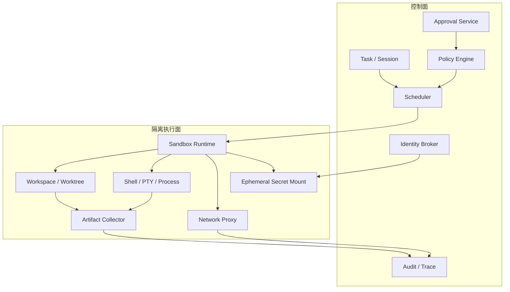

控制面不应把高权限长期凭证直接交给沙箱。执行面也不应能够修改自己的策略或审计记录。

### K.16.8 沙箱生命周期

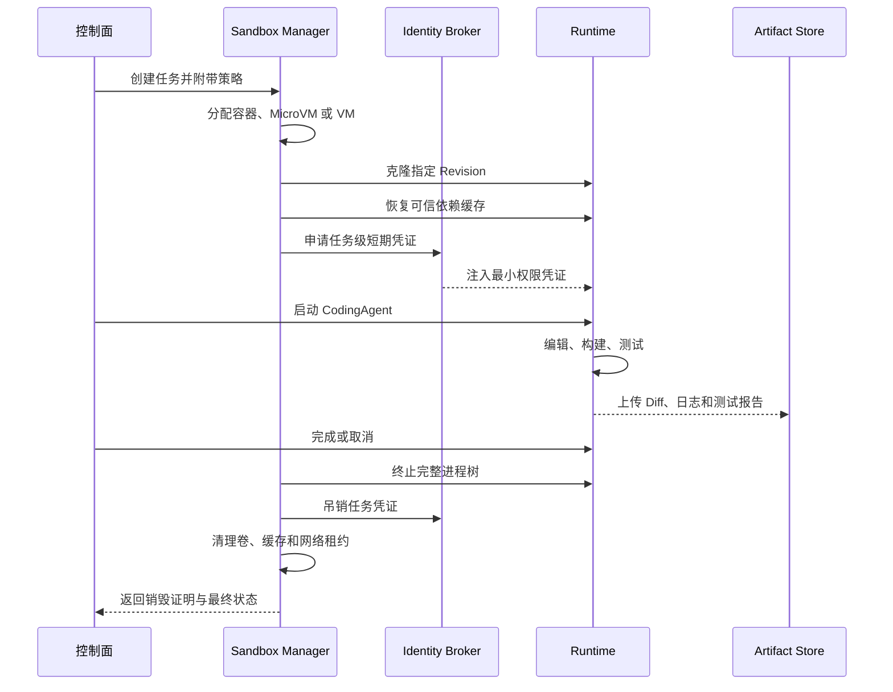

### K.16.9 网络隔离

推荐默认策略：

1. 默认禁止公网访问。
2. 依赖下载阶段与 Agent 执行阶段分开。
3. 通过 Egress Proxy 实施域名、端口和方法级控制。
4. 禁止访问云实例元数据、内网管理面和环回敏感服务。
5. 对 DNS、重定向、IPv6、代理隧道和动态域名做一致约束。
6. 对下载内容做哈希、来源和许可证记录。
7. 记录网络请求元数据，但避免把 Secret 写入日志。
8. 对浏览器、MCP Server 和 Shell 使用统一出口策略。

OpenAI 的 Codex 云端网络文档明确提示，开放网络会引入 Prompt Injection、代码或 Secret 外泄、恶意依赖和许可证等风险。GitHub Copilot Cloud Agent 也默认使用防火墙限制互联网访问。

### K.16.10 Secret 与身份隔离

不要把开发者完整环境变量复制给 Agent。更安全的模式是：

```text
用户或服务身份
      ↓
Identity Broker
      ↓
针对当前任务签发短期凭证
      ↓
仅挂载给指定工具或进程
      ↓
任务结束立即吊销
```

关键要求：

- Secret 不进入模型上下文。
- Shell 输出和 Trace 自动脱敏。
- 不允许 Agent 执行无差别环境变量导出。
- 不同 Agent 使用不同凭证和作用域。
- Git 凭证只能操作任务分支或受限仓库。
- 生产凭证与开发凭证彻底分离。
- 外部工具优先使用 OAuth 委托或工作负载身份，而不是长期 API Key。
- 审批记录应绑定实际身份、动作参数和凭证作用域。

### K.16.11 进程与资源治理

CodingAgent 的 Shell Manager 至少应支持：

- 命令级超时。
- Session 级总时长。
- CPU、内存、磁盘和进程数限制。
- 标准输出与错误输出大小限制。
- PTY 与非 PTY 两类命令。
- 后台任务注册和心跳。
- 取消时终止完整进程树。
- 防止子进程脱离父进程长期驻留。
- 僵尸进程回收。
- 空闲超时和资源自动回收。
- 磁盘水位和日志轮转。
- 崩溃后可以判定任务是否可恢复。

### K.16.12 CodingAgent 威胁模型

| 威胁 | 示例 | 主要缓解措施 |
|---|---|---|
| 模型误操作 | 删除错误目录、Force Push | 沙箱、受保护路径、审批、Git 回滚 |
| Prompt Injection | README 或 Issue 中要求上传 Secret | 指令与数据隔离、网络默认拒绝、工具 Guardrail |
| 恶意依赖 | `postinstall` 执行恶意脚本 | 安装阶段隔离、锁文件、镜像扫描、网络限制 |
| Secret 外泄 | 日志、HTTP 请求、提交中包含 Token | Secret Broker、Egress 控制、脱敏和 Secret Scan |
| 仓库逃逸 | 脚本读取其他项目和主目录 | 文件系统根边界、独立用户或 VM |
| 权限提升 | 调用 `sudo`、Docker Socket、内核接口 | 无特权运行、Capability Drop、设备隔离 |
| 资源耗尽 | Fork Bomb、无限日志、磁盘写满 | Cgroup、Job Object、Quota、超时 |
| 持久化 | 写入启动项、后台守护进程 | Ephemeral 环境、完整进程树终止、销毁 |
| 多租户污染 | 一个任务读取另一个任务缓存 | 独立卷、缓存分区、租户密钥和销毁验证 |
| 供应链污染 | 修改发布脚本或依赖源 | Branch Protection、签名、Review、制品溯源 |

### K.16.13 产品实践

- **OpenAI Codex**：将 Sandbox Mode 与 Approval Policy 分开；常见模式包括只读、工作区可写和危险的完全访问，并对工作区外写入或网络访问实施审批。
- **Claude Code**：提供 Permission Mode、Allow/Ask/Deny Rule 和 OS 级 Bash Sandbox；其文档还区分每命令沙箱、整个进程隔离、Dev Container、自定义容器和 VM。
- **GitHub Copilot Cloud Agent**：在临时、受防火墙保护的环境中执行任务，并通过受限分支、人工合并、安全扫描和会话日志降低风险。

参考资料：

- [Codex Agent Approvals and Security](https://developers.openai.com/codex/agent-approvals-security)
- [Codex Sandboxing](https://developers.openai.com/codex/sandboxing)
- [Codex Cloud Internet Access](https://developers.openai.com/codex/cloud/internet-access)
- [Claude Code Sandboxing](https://code.claude.com/docs/en/sandboxing)
- [Claude Code Sandbox Environments](https://code.claude.com/docs/en/sandbox-environments)
- [GitHub Copilot Cloud and Local Sandboxes](https://docs.github.com/copilot/concepts/about-cloud-and-local-sandboxes)
- [GitHub Copilot Agent Risks and Mitigations](https://docs.github.com/en/copilot/concepts/agents/cloud-agent/risks-and-mitigations)

### K.16.14 沙箱验收测试

不能只检查“配置项存在”，还应执行破坏性边界测试：

| 测试 | 预期 |
|---|---|
| 写工作区内普通文件 | 按策略允许 |
| 写工作区外目录 | 拒绝或触发审批 |
| 修改 `.git` 受保护对象 | 拒绝或走受控 Git 服务 |
| 读取主目录凭证 | 拒绝 |
| 访问未允许域名 | 拒绝并记录 |
| 访问云元数据地址 | 始终拒绝 |
| 启动后台子进程后取消任务 | 整个进程树被回收 |
| 申请超过内存或磁盘限额 | 被限制并返回明确错误 |
| 尝试调用 Docker Socket | 不存在或拒绝 |
| 输出疑似 Secret | 日志脱敏并触发告警 |
| 任务结束后重新访问凭证 | 凭证已失效 |
| 两个并发任务互相读取工作目录 | 无法访问 |

---

## K.17 权限、审批与安全治理

### K.17.1 权限系统应控制“能力”，而不是只匹配命令字符串

仅通过 Shell 字符串黑名单无法覆盖：

- `python -c`、脚本文件或构建工具间接执行危险操作。
- Git Alias、Shell Alias 和命令替换。
- MCP 工具产生的外部副作用。
- 浏览器和 HTTP 工具的数据外传。
- 文件编辑后由构建钩子触发的动作。
- 一个允许工具调用另一个高权限工具。

更合理的权限对象是能力：

```text
filesystem.read
filesystem.write
process.execute
network.connect
secret.use
git.commit
git.push
pull_request.create
database.migrate
deployment.trigger
mcp.invoke
browser.navigate
subagent.delegate
```

然后把具体命令、工具和 API 映射到这些能力。

### K.17.2 推荐的权限决策模型

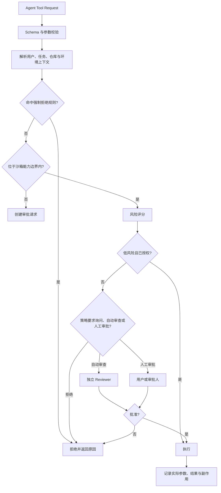

推荐优先级：

> **强制 Deny → 条件 Deny → Ask/Review → Allow**

Claude Code 当前权限规则采用 Deny、Ask、Allow 的顺序评估。通用平台可采用类似的“拒绝优先”原则，避免宽泛 Allow 覆盖关键禁止规则。

### K.17.3 权限作用域

权限不应只有“允许”和“不允许”，还必须绑定作用域。

| 权限 | 可能的作用域 |
|---|---|
| 文件读取 | 当前文件、当前仓库、指定目录、全部工作区 |
| 文件写入 | 单文件、工作区根、生成目录、临时目录 |
| Shell | 单命令、命令族、只读命令、当前 Session |
| 网络 | 单次 URL、域名、端口、HTTP Method、时间窗口 |
| Secret | 指定 Secret、指定工具、指定外部服务、一次性 |
| Git | 当前 Branch、任务 Branch、指定 Remote、只推送不合并 |
| PR | 创建 Draft、更新自己的 PR、禁止 Approve/Merge |
| 数据库 | 只读、开发库、指定 Schema、禁止生产 |
| 部署 | Preview、Staging、Production |
| MCP | Server、Tool、参数模式、数据分类 |
| 子 Agent | 最大数量、深度、角色、继承权限范围 |

审批 UI 应明确展示“批准的动作”和“批准的范围”。“本次允许”“本会话允许”“本项目允许”不应被混成同一个按钮。

### K.17.4 风险分级

一个可解释的风险分数可以考虑：

```text
Risk =
    Destructiveness
  + ExternalSideEffect
  + DataSensitivity
  + PermissionBreadth
  + Irreversibility
  + CredentialPrivilege
  + SourceUntrustworthiness
  + ExecutionOpacity
  + BlastRadius
```

#### 低风险

- 读取当前仓库普通源码。
- 搜索文件和符号。
- 在临时目录生成分析产物。
- 运行无副作用的静态检查。
- 查询只读 LSP 信息。

#### 中风险

- 修改当前工作区文件。
- 安装锁文件中已有依赖。
- 运行项目测试和构建脚本。
- 创建本地 Commit。
- 访问少量允许域名。

#### 高风险

- 写工作区外文件。
- 修改 CI、发布、鉴权和依赖脚本。
- 新增依赖并访问公网。
- 推送远端 Branch。
- 使用云凭证、数据库或内部系统。
- 调用带写副作用的 MCP 工具。

#### 极高风险

- Force Push、删除分支或历史重写。
- 生产部署、生产数据库 Migration。
- 删除云资源或大量数据。
- 修改组织权限、Secret、计费和安全策略。
- 关闭审计、安全扫描或分支保护。
- 无限制网络、宿主机或管理员权限。

### K.17.5 自动审批与 Reviewer Agent

自动审批的价值是减少审批疲劳，但必须明确：

> **自动 Reviewer 只是替代审批者，不应自动扩大 Sandbox 或 Permission Boundary。**

可自动审查的内容：

- 动作是否与当前任务相关。
- 是否存在更小权限的替代方案。
- 是否写入不相关目录。
- 是否使用危险参数。
- 网络目标是否属于允许的依赖源。
- 命令是否可逆。
- 是否会泄露代码或 Secret。

不适合只由 Reviewer Agent 批准的动作：

- 生产部署。
- 数据删除。
- 权限提升。
- 组织级策略修改。
- 付款和计费。
- 高敏感数据导出。
- 不可逆的 Git 历史操作。

Codex 的 Auto-review 设计明确说明，自动审查只是审批者替换，不会增加可写目录、开启网络或削弱受保护路径。

### K.17.6 通用策略示例

下面是一个概念性策略，不绑定具体产品：

```yaml
version: 1

defaults:
  filesystem: read_workspace
  process: ask
  network: deny
  secrets: deny
  git_remote: deny
  deployment: deny

rules:
  - effect: allow
    capability: filesystem.write
    scope:
      roots:
        - "${workspace}"
        - "${temp}"

  - effect: allow
    capability: process.execute
    match:
      command_families:
        - test
        - lint
        - typecheck
    limits:
      timeout_seconds: 1800

  - effect: ask
    capability: network.connect
    scope:
      domains:
        - "registry.npmjs.org"
        - "crates.io"
      methods:
        - GET
        - HEAD

  - effect: deny
    capability: filesystem.read
    scope:
      paths:
        - "~/.ssh"
        - "~/.aws"
        - "~/.config/gcloud"

  - effect: deny
    capability: git.force_push

  - effect: require_human
    capability: deployment.trigger
    scope:
      environments:
        - production
```

真实系统还需要签名、版本、继承、租户覆盖、冲突解析和审计字段。

### K.17.7 Prompt Injection 防护

CodingAgent 会读取大量不可信内容：

- Issue 和 PR 评论。
- README、注释和文档。
- 测试 Fixture。
- 日志和错误消息。
- 网页和搜索结果。
- 第三方依赖文档。
- MCP Tool Output。
- 代码中故意植入的自然语言指令。

必须将这些内容视为**数据**，而不是自动提升为系统指令。

建议：

1. 明确区分 System、Organization Policy、Project Rule、User Request 和 Untrusted Content。
2. 给检索结果附带来源与信任等级。
3. 不允许仓库内容改变权限和网络策略。
4. 对“上传文件、发送 Secret、关闭安全控制”等指令进行高风险分类。
5. 浏览器、MCP 和 Shell 共用统一 Egress Policy。
6. 外部内容触发的工具调用必须保留因果链。
7. 对下载后执行、脚本安装和构建钩子提高风险级别。
8. 在执行前向 Reviewer 提供实际参数，而不是模型的自然语言摘要。
9. 让沙箱承担最后边界，不能只依赖 Prompt 防护。

### K.17.8 MCP 与外部工具权限

MCP 扩大了 CodingAgent 的能力，也扩大了攻击面。平台应管理：

- Server 来源、签名、版本和发布者。
- Tool Schema 是否发生漂移。
- Tool 是否只读、幂等、可逆或有外部副作用。
- Tool 访问哪些数据分类。
- Tool 使用用户身份还是服务身份。
- 调用参数是否需要审批。
- 返回内容是否可能包含 Prompt Injection。
- Server 是否可访问本地文件、网络和 Secret。
- 调用结果、错误和外部对象 ID 是否可审计。
- MCP Server 被禁用或升级后，历史任务能否重放。

建议给 Tool 增加安全元数据：

```text
read_only
destructive
idempotent
open_world
uses_secrets
data_classification
requires_user_presence
supports_dry_run
reversible
external_side_effect
```

### K.17.9 多 Agent 权限传播

父 Agent 不应把自己的全部权限自动传给子 Agent。

推荐原则：

- 子 Agent 权限是父权限与角色模板的交集。
- 委派时生成独立 Capability Token。
- Token 绑定 Task、Workspace、Agent、到期时间和调用深度。
- 子 Agent 不能继续扩大权限。
- Reviewer 默认只读。
- Explorer 默认只读和有限网络。
- Implementation Agent 只写自己的 Worktree。
- Test Agent 可执行测试，但不允许推送或部署。
- Release Agent 只消费已批准 Artifact。
- 父任务取消时，所有子任务凭证和进程级联失效。

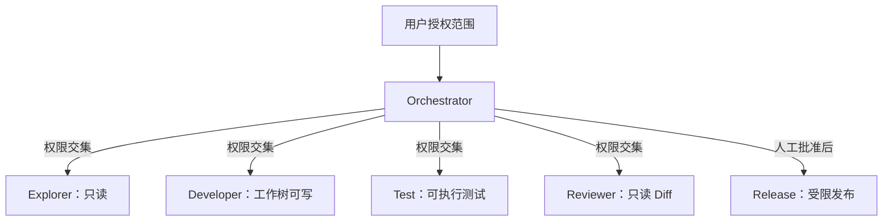

### K.17.10 Git 与交付权限

Git 操作应按风险拆分：

| 操作 | 推荐默认 |
|---|---|
| `status`、`diff`、`log`、`show` | 自动允许 |
| 创建本地 Branch / Worktree | 自动允许或低风险审批 |
| 创建本地 Commit | 项目策略允许时自动 |
| 修改 Commit Message | 当前任务内允许 |
| Push 到任务 Branch | 中风险，可由策略预批准 |
| 创建 Draft PR | 中风险，通常允许 |
| 修改他人 Branch | 高风险 |
| Approve / Merge PR | 人工或独立审批 |
| Force Push / Reset Remote | 默认拒绝 |
| 修改 Branch Protection | 始终人工 |
| 发布 Tag / Release | 高风险审批 |
| 修改 CI、Release、Signing 配置 | 强化审查 |

云端 Agent 最好只拥有单一任务 Branch 的受限写权限，而不是通用仓库 Token。

### K.17.11 权限体验设计

糟糕的权限体验会导致两种极端：

- 用户被频繁弹窗打断，最终选择“全部允许”。
- 平台为了流畅直接给予过大权限。

更好的审批信息应包含：

```text
Agent 正要做什么
为什么需要
实际命令或工具参数
读写哪些路径
访问哪个域名
使用哪个身份
可能产生什么副作用
是否可逆
建议的最小授权范围
```

并支持：

- 只允许一次。
- 允许当前 Session。
- 允许当前项目的特定模式。
- 修改后再执行。
- 以 Dry-run 方式执行。
- 使用更低权限替代方案。
- 拒绝并将原因反馈给 Agent。
- 由独立 Reviewer Agent 先做风险分析。

### K.17.12 企业治理

企业级控制面至少需要：

- SSO、RBAC 和必要时的 ABAC。
- 组织级强制策略和项目级收窄策略。
- 托管配置不可被本地 Agent 覆盖。
- Secret Broker 和工作负载身份。
- 网络出口代理与域名策略。
- 代码、Prompt、Artifact 和 Trace 的数据保留策略。
- Agent、模型、工具、Skill 和 MCP 版本锁定。
- 完整 Tool Call、审批和文件变更审计。
- 分支保护、签名 Commit、制品签名和 SBOM。
- 模型供应商、地域和数据处理策略。
- 异常行为检测与紧急 Kill Switch。
- 高风险操作双人审批。
- 定期权限回顾和过期授权回收。

### K.17.13 安全基线

#### 本地交互式 CodingAgent

- 默认限制在当前工作区。
- 默认关闭不必要的网络访问。
- 敏感路径硬拒绝。
- 高风险 Shell 和 Git 操作询问。
- 提供一键查看当前权限、工作区和网络范围。
- 允许用户在执行前查看精确参数。

#### 云端异步 CodingAgent

- 每任务独立、临时环境。
- 每任务独立短期身份。
- 单一任务 Branch。
- 防火墙默认拒绝。
- 构建依赖阶段与 Agent 执行阶段分离。
- 完整进程、网络、工具和文件变更审计。
- 自动安全扫描，但合并仍需人工或独立策略批准。
- 任务完成后销毁环境和吊销凭证。

#### 多 Agent 系统

- 子 Agent 不继承全部父权限。
- 工作区、端口、数据库和凭证隔离。
- 统一预算、取消和最大委派深度。
- 独立 Reviewer 与生产 Agent 权限分离。
- 最终合并、发布和生产动作设为强制审批点。

参考资料：

- [Claude Code Permissions](https://code.claude.com/docs/en/permissions)
- [Claude Code Permission Modes](https://code.claude.com/docs/en/permission-modes)
- [Codex Permissions](https://developers.openai.com/codex/permissions)
- [Codex Auto-review](https://developers.openai.com/codex/sandboxing/auto-review)
- [GitHub Copilot Agent Risks and Mitigations](https://docs.github.com/en/copilot/concepts/agents/cloud-agent/risks-and-mitigations)
- [GitHub Copilot Firewall](https://docs.github.com/enterprise-cloud@latest/copilot/customizing-copilot/customizing-or-disabling-the-firewall-for-copilot-coding-agent)

---

## K.18 CodingAgent 互操作标准

### K.18.1 MCP

**Model Context Protocol** 解决：

> Agent 如何连接外部工具、数据和服务。

典型对象包括：

- Tools。
- Resources。
- Prompts。
- 数据库。
- 浏览器。
- GitHub、GitLab、Jira、Slack。
- 企业知识库。
- 内部 API。

MCP 已成为多个 CodingAgent 共同采用的工具扩展协议。

参考：[Model Context Protocol](https://modelcontextprotocol.io/docs/2026-07-28/getting-started/intro)

### K.18.2 ACP

**Agent Client Protocol** 解决：

> 编辑器、桌面控制台或其他客户端如何连接 CodingAgent。

可以理解为：

> **LSP 是 Editor ↔ Language Server；ACP 是 Editor ↔ Coding Agent。**

ACP 允许同一个 Agent 被 Zed、JetBrains、桌面控制台或其他客户端调用，也允许一个控制面接入多个 Agent。

参考：[Agent Client Protocol](https://agentclientprotocol.com/get-started/introduction)

### K.18.3 A2A

**Agent2Agent Protocol（A2A）** 解决：

> 独立 Agent 系统如何发现彼此的能力、委派长任务、交换消息与 Artifact，并跟踪任务状态。

A2A 面向的是 Agent 与 Agent 的远程协作，而不是 Agent 调用普通工具。一个 CodingAgent 可以通过 A2A 暴露“分析仓库”“实现任务”“运行验证”“创建 PR”等能力，也可以把安全审查、发布或知识检索委派给其他 Agent。

A2A 与 MCP 的边界可以概括为：

- MCP 更像 **Agent 使用工具和数据**。
- A2A 更像 **Agent 与另一个具备自主执行循环的 Agent 协作**。

参考：[Agent2Agent Protocol Specification](https://a2a-protocol.org/latest/specification/)

### K.18.4 AGENTS.md

AGENTS.md 是放在仓库里的 Agent 指令文件，类似“给 Agent 阅读的 README”，用于描述：

- 构建和测试命令。
- 代码规范。
- 架构边界。
- 禁止修改的目录。
- 提交流程。
- 特定模块注意事项。

该格式已被越来越多 CodingAgent 识别。

参考：[AGENTS.md](https://agents.md/)

### K.18.5 Agent Skills

Agent Skills 通常以包含 `SKILL.md`、脚本、参考资料和资源文件的目录形式存在，解决：

> 如何把一个可重复执行的工程流程封装为跨会话、跨项目甚至跨 Agent 的能力包。

适合封装：

- 发布流程。
- 数据库迁移。
- 安全审查。
- UI 测试。
- 故障排查。
- 特定框架升级。
- 企业内部研发规范。

参考：[Agent Skills Specification](https://agentskills.io/specification)

### K.18.6 七类标准与机制之间的关系

| 标准或机制 | 连接对象 | 解决的问题 |
|---|---|---|
| **LSP** | 代码客户端 ↔ 语言服务器 | 在线符号、引用、诊断、重构与语义导航 |
| **SCIP / LSIF** | 代码 Indexer ↔ 代码智能平台 | 持久化、可交换的离线符号与引用索引 |
| **MCP** | Agent ↔ 工具与数据 | 外部能力和上下文接入 |
| **ACP** | 客户端 ↔ CodingAgent | Agent 运行时接入、会话与控制 |
| **A2A** | Agent ↔ Agent | Agent 发现、委派、通信和长任务协作 |
| **AGENTS.md** | 仓库 ↔ Agent | 项目长期指令与工程约束 |
| **Agent Skills** | Agent ↔ 可复用能力包 | 程序化流程和领域知识复用 |

这些机制不是相互替代关系，而是分别处于代码语义、工具接入、Agent 接入、Agent 协作和项目知识等不同层次。

---

## K.19 CodingAgent 评测体系

### K.19.1 主流 Benchmark

| Benchmark | 主要评测内容 | 局限 |
|---|---|---|
| **SWE-bench Verified** | 根据真实 GitHub Issue 修改仓库并通过测试 | 多数任务仍偏局部缺陷修复 |
| **SWE-bench Pro** | 更复杂、更接近企业仓库的真实任务 | 环境构建和长上下文要求更高 |
| **Terminal-Bench** | 在真实终端环境中完成操作任务 | 不完全等同于软件架构和产品开发 |
| **SWE-Lancer** | 真实自由职业软件工程任务 | 任务类型与普通企业研发仍有差异 |
| **SWE-EVO** | 跨多个文件的长周期代码库演进 | 当前 Agent 整体完成率明显更低 |
| **SWE-Explore** | 代码库探索和定位能力 | 只覆盖开发闭环的一部分 |
| **SWE Atlas** | 代码问答、测试编写、重构等多类任务 | 不等同于端到端交付 |

参考：[SWE-bench](https://github.com/swe-bench/SWE-bench)

### K.19.2 为什么不能只看 SWE-bench 排名

排行榜无法完整反映：

- 是否使用额外检索和隐藏知识。
- Agent Harness 是否针对 Benchmark 特化。
- 使用了多少次采样和重试。
- Token 和推理成本。
- 任务耗时。
- 是否需要人工引导。
- 是否破坏未覆盖的功能。
- 是否符合企业架构、安全和代码规范。
- 云端环境是否真实可复现。
- 生成的代码是否容易审查和维护。

### K.19.3 企业内部更值得关注的指标

建议使用自己的历史 Issue、PR 和回归缺陷构建内部评测集，并关注：

1. **任务一次完成率**：无需人工修改即可通过全部验收。
2. **CI 首次通过率**：Agent 第一次提交是否通过 CI。
3. **有效变更率**：修改中与任务真正相关的比例。
4. **回归缺陷率**：合并后产生的新问题。
5. **人工介入次数**：补充信息、重启、纠错和手动修复次数。
6. **审查接受率**：Reviewer 是否接受 Agent 的修改。
7. **平均交付成本**：模型、计算、环境和人工成本。
8. **任务交付时间**：包括排队、执行、审查和返工。
9. **安全违规率**：越权操作、Secret 泄露和危险命令。
10. **可恢复率**：进程崩溃、网络中断后能否继续执行。

---

## K.20 2026 年 CodingAgent 的关键趋势

### K.20.1 IDE 正在变成 Agent 控制台

未来 IDE 的核心不只是代码编辑，而是管理：

- 多个 Agent Session。
- 本地和云端任务。
- 多个 Worktree。
- 计划和执行状态。
- Diff、测试、截图和报告。
- Agent 之间的消息和任务依赖。

VS Code 的多 Agent Session、Antigravity Agent Manager 和 Devin Desktop 都体现了这种变化。

参考：[VS Code Multi-Agent Development](https://code.visualstudio.com/blogs/2026/02/05/multi-agent-development)

### K.20.2 本地与云端形成混合架构

本地 Agent 适合高频交互、快速修改和使用现有开发环境；云端 Agent 适合长任务、并行任务、自动化和后台队列。

成熟产品正在同时提供两种运行方式，而不是只选择其中一种。

### K.20.3 Worktree、Container 和 VM 成为基础设施

多 Agent 没有环境隔离就很容易出现：

- 文件互相覆盖。
- Git 状态冲突。
- 端口冲突。
- 数据库污染。
- 测试结果不可信。
- 任务取消后残留进程。

因此，环境管理将逐渐独立为 CodingAgent Platform 的核心子系统。

### K.20.4 Agent 与模型进一步解耦

Junie BYOK、OpenCode、Cline、Qwen Code、Pi 和 DeepSeek Harness 都在加强多 Provider 或插件化能力。未来团队会分别选择：

- 最适合复杂推理的模型。
- 最适合代码生成的模型。
- 最便宜的探索模型。
- 最适合审查的第二模型。
- 私有化或本地模型。

参考：[Junie Model Selection](https://junie.jetbrains.com/docs/junie-cli-model-selection.html)

### K.20.5 Verification 将成为主要壁垒

单纯生成代码越来越容易，真正困难的是：

- 证明功能正确。
- 证明没有回归。
- 证明符合架构约束。
- 证明没有安全风险。
- 让大型 Diff 可以被人快速理解。
- 将验证证据长期保存和审计。

因此，测试 Agent、Reviewer Agent、浏览器验证和 Artifact Review 会越来越重要。

### K.20.6 从 Prompt-Driven 转向 Spec-Driven

一句自然语言通常不足以约束大型任务。越来越多系统开始引入：

- Requirements。
- Design。
- Tasks。
- Acceptance Criteria。
- Non-Goals。
- Architecture Decision。
- Verification Plan。

Kiro 是这一方向较明确的产品之一；Junie、Augment、Qoder 和企业自建系统也开始采用类似方法。

参考：[Kiro IDE](https://kiro.dev/ide/)

### K.20.7 从固定角色转向动态 Agent 图

早期多 Agent 常预设 Architect、Coder、Tester、Reviewer。未来更可能由 Orchestrator 根据任务动态创建：

- Explorer。
- Domain Expert。
- Migration Worker。
- UI Worker。
- Test Worker。
- Reviewer。
- Security Auditor。

Agent 生命周期会随任务动态创建和回收，而不是长期固定。

### K.20.8 软件开发正在出现“生产 Agent + 验证 Agent”双层结构

未来企业不会只采购一个 CodingAgent，而会形成：

```text
需求与规划层
    ↓
一个或多个生产 CodingAgent
    ↓
测试、审查、安全和合规 Agent
    ↓
人工审批
    ↓
CI/CD 与生产环境
```

生产 Agent 和验证 Agent 应保持模型、上下文和权限上的适当独立。

---

## K.21 按使用场景选择系统

| 使用场景 | 优先考虑 |
|---|---|
| 资深开发者、本地深度代码库修改 | Claude Code、Codex CLI、OpenCode、Junie、Aider |
| 希望以 IDE 为主要入口 | Cursor、GitHub Copilot、Antigravity、Kiro、Junie、Qoder |
| GitHub 原生 Issue 到 PR | GitHub Copilot Cloud Agent、Codex、Jules |
| 长时间异步任务和团队工作队列 | Devin、Codex Cloud、Cursor Cloud Agents、Factory |
| 多 Agent 控制与并行工作区 | Antigravity、Devin Desktop、Amp、GitLab Duo、Augment Cosmos、OpenHands |
| Spec-Driven Development | Kiro、Qoder、CodeArts，以及基于 OpenSpec、Spec Kit 的自建流程 |
| 开源、自托管和多模型 | OpenCode、Cline、Roo Code、Aider、Qwen Code、OpenHands、Pi、DeepSeek Harness |
| AWS 企业技术栈 | Amazon Q Developer、Kiro |
| GitLab 与私有化模型 | GitLab Duo Agent Platform |
| 国产模型和国内企业生态 | Qoder CN、TRAE、CodeBuddy、Comate、CodeArts、Qwen Code |
| PR 质量门禁 | CodeRabbit、Qodo、Greptile、GitHub Copilot Code Review |
| 从零生成并部署 Web 应用 | Replit Agent、Lovable、Bolt、v0 |

### 几个主流系统最简定位

- **Claude Code**：可编程性和本地深度执行较强。
- **Codex**：本地 Agent、云端任务、并行执行和工作树结合较完整。
- **GitHub Copilot**：GitHub 与 IDE 工作流整合最自然。
- **Cursor**：AI IDE 产品体验和日常开发交互成熟。
- **Antigravity**：正在形成编辑器、终端、浏览器和多 Agent Manager 的统一平台。
- **Devin**：适合异步委派和团队任务队列。
- **Kiro**：突出 Spec-Driven Development。
- **OpenCode / Cline / Qwen Code**：适合开放模型、可控执行和二次开发。
- **OpenHands / DeepSeek Harness / Pi**：更适合作为平台或 Harness 底座研究。

---

## K.22 统一多 CodingAgent 平台的通用架构参考

当组织需要同时使用 Claude Code、Codex、OpenCode、Cline、Qwen Code 等多个 CodingAgent 时，平台价值不应建立在重新实现一个绑定单一模型的 Agent 上，而应建立在：

> **统一接入、统一编排、统一治理、统一观察和统一审查多个 CodingAgent。**

建议形成以下十个核心子系统。

### K.22.1 Agent Adapter Layer

为不同 CodingAgent 建立统一 Adapter，屏蔽：

- CLI 参数差异。
- 输入和流式协议差异。
- Session 恢复方式。
- 权限和审批方式。
- MCP、Skill、Hook 支持差异。
- 模型配置差异。
- Subagent 能力差异。
- Token 和费用返回差异。

不要只统一成一条字符串命令，而应提供 Capability Negotiation：

```text
supports_streaming
supports_resume
supports_plan_mode
supports_headless
supports_subagents
supports_mcp
supports_skills
supports_hooks
supports_images
supports_browser
supports_worktree
supports_cloud_execution
supports_permission_callback
```

### K.22.2 统一领域模型

至少统一：

```text
Workspace
Project
Session
Task
Run
Turn
Message
ToolCall
Approval
Artifact
Checkpoint
Agent
Subagent
Environment
Evaluation
Usage
```

一个 Task 可以有多次 Run；一次 Run 可以包含多个 Agent；一个 Agent 可以产生多个 Artifact。

### K.22.3 Environment Manager

统一管理：

- 当前工作区。
- 临时副本。
- Git Worktree。
- Container。
- 本地 PTY。
- 远程 VM。
- 端口和进程。
- 环境变量和 Secret。
- 空闲回收。
- 崩溃恢复。
- 任务结束清理。

### K.22.4 Context Service

统一提供：

- 代码搜索。
- LSP 和 Tree-sitter。
- Git 历史。
- 项目文档。
- AGENTS.md、CLAUDE.md 等规则。
- 用户级、项目级和运行时 Memory。
- Skill Registry。
- Context Budget 和 Compaction。
- 来源引用与可追踪性。

### K.22.5 Policy Engine

策略对象不应和某个 Agent CLI 绑定，而应抽象为：

```text
文件读取范围
文件写入范围
命令策略
网络访问策略
MCP 工具策略
Secret 策略
审批策略
最大执行时间
最大 Token
最大费用
最大子 Agent 数
最大委派深度
```

然后由不同 Adapter 翻译为对应 Agent 的权限模式。

### K.22.6 Orchestration Engine

需要同时支持：

- 单 Agent 长任务。
- 顺序工作流。
- 并行 Agent。
- Orchestrator–Worker。
- Review Loop。
- 条件分支。
- Retry。
- Timeout。
- Budget。
- Cancellation。
- Deadlock 和 Loop Detection。
- 人工审批节点。

### K.22.7 Artifact 与 Review Layer

不要只展示聊天记录，还应把下面内容提升为一等对象：

- Plan。
- Architecture。
- Commands。
- File Changes。
- Diff。
- Test Report。
- Screenshot。
- Browser Recording。
- Security Report。
- Evaluation Result。
- Commit 和 PR。

用户审查 CodingAgent 的主要入口，最终会从“聊天消息”转向“结构化交付产物”。

### K.22.8 Observability

建议统一成：

```text
Task Trace
 └── Agent Run Span
      ├── Model Call Span
      ├── Context Retrieval Span
      ├── Tool Call Span
      ├── Shell Process Span
      ├── Subagent Span
      └── Verification Span
```

同时记录 Token、费用、延迟、重试、错误、Compaction、权限审批和人工介入。

### K.22.9 Evaluation

平台应支持：

- 离线数据集评测。
- 真实轨迹回放。
- 多 Agent 对比。
- 模型与 Harness 分离评测。
- PR 和测试结果评测。
- 安全策略评测。
- UI/E2E 自动化评测。
- 长任务恢复评测。
- 跨平台评测。

### K.22.10 协议层

优先兼容：

- **MCP**：接入工具与外部数据。
- **ACP**：接入不同 CodingAgent。
- **AGENTS.md**：读取项目级 Agent 指令。
- **Agent Skills**：共享可复用能力。
- **OpenTelemetry**：输出标准 Trace、Metric 和 Log。
- **Git / Worktree / PR**：作为代码交付基础协议。

---

## K.23 最终判断

CodingAgent 的竞争正在从第一阶段走向第二阶段。

### 第一阶段：谁生成代码更好

关注模型、Prompt、补全速度和聊天体验。

### 第二阶段：谁能稳定交付软件

关注上下文、工具、执行环境、测试、审查、安全、恢复、可观测和多 Agent 编排。

未来大概率不是某一个 CodingAgent 完全取代其他系统，而是形成三层生态：

```text
上层：IDE / Desktop / Web / Mobile 多 Agent 控制面
                         ↓
中层：Claude Code / Codex / OpenCode / Devin 等 Agent Harness
                         ↓
底层：模型、MCP 工具、代码索引、Sandbox、CI/CD、评估与可观测系统
```

因此，对个人开发者而言，应选择最适合自己交互方式的 Agent；对企业而言，真正长期有效的建设方向则是：

> **把 CodingAgent 当作可替换的执行 Worker，把上下文、权限、环境、任务、评估、审查和可观测能力掌握在统一控制面中。**

---

> **使用提示**：与其他附录的分工——A 讲模型机制、B 讲方法论、C 记来源、D 列产品、E 辨异同、F 索引图版、G 详解 OTel、H 上手 DeepEval、I 评测观测平台选型、J 上手 Mem0、**K 盘点 Coding Agent 赛道**、L 盘点可观测赛道、M 盘点评估赛道、N 盘点 Memory 赛道、O 盘点自进化赛道、P 盘点多 Agent 赛道、Q 盘点 MCP 生态、R 解析 Pi 源码、S 解析 Claude Code 源码、T 解析 Codex 源码。与附录 D 的分工：D 管全品类速览与定位法，M 管 Coding Agent 单赛道深潜；重叠产品以各自官方页面为准（[C-36]）。对照阅读：标准系统架构（K.3）对第 12 章六大件、能力九维度（K.11）对第六篇三章、平台 Agent 对比（K.12）与代码理解/LSP/检索/沙箱/权限六专题（K.13–K.17）对第 23 章 2.1/2.5/2.6 与第 9/13 章、互操作标准（K.18）对第 8/18 章、评测体系（K.19）对第 15/24 章。信息基准 2026-08-30，发行前按附录 C 清单复核。
