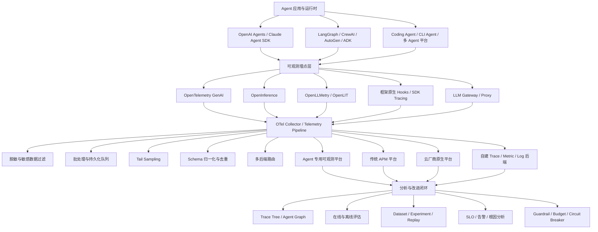
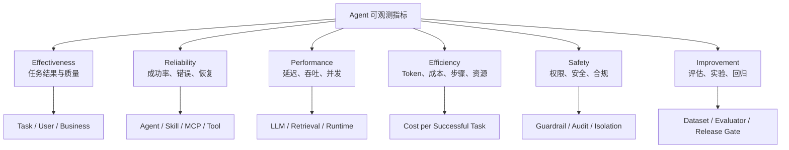
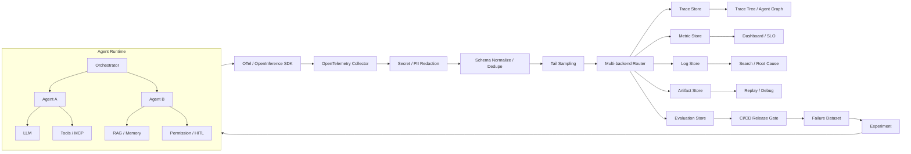

# 附录 L：主流 Agent 可观测系统全景

> 定位：**Agent 可观测赛道的全景调研报告**（全文收录，信息基准 2026-08，各平台官方入口见 [C-37]）。与相邻内容的分工：第 14 章讲可观测的方法论与本书实现，附录 G 讲 OTel 本身的机制，附录 I 深评其中五个平台（Langfuse/Phoenix/MLflow 等），本附录是整个赛道的地图——标准与埋点生态（GenAI SemConv/OpenInference/OpenLLMetry）、开源自托管/商业专用/传统 APM/云厂商原生/框架原生五路平台盘点、指标体系、生产参考架构与成熟度模型。名单会过期，六类问题框架与成熟度模型不过期。

---

Agent 可观测已经从早期的“记录 Prompt、响应、Token 和延迟”，发展成覆盖 **Agent 规划、模型调用、工具执行、MCP、RAG、Memory、多 Agent 协作、权限审批、重试循环、任务结果、质量评估和业务指标** 的完整工程体系。

它需要同时回答六类问题：

| 问题 | 对应能力 |
|---|---|
| Agent 到底执行了什么 | Trace、Span、Agent Graph、Trajectory |
| 为什么失败或变慢 | 错误、重试、工具耗时、模型耗时、调用依赖 |
| 最终结果是否正确 | 离线评估、在线评估、人工反馈、业务结果 |
| 为什么成本突然升高 | Token、模型成本、工具成本、循环次数、上下文膨胀 |
| 是否存在安全风险 | Prompt 注入、敏感信息、越权工具、危险动作、Guardrail |
| 修改后是否真的变好 | Dataset、Experiment、Replay、版本对比、发布门禁 |

OpenTelemetry 正在成为 Agent 可观测的统一数据平面；OpenInference 等规范在其上补充 Agent、LLM、Tool、Retriever 等 AI 语义。平台之间真正的差异，正逐渐从“能不能采集 Trace”转移到 **Agent 语义建模、质量评估、问题归因、生产告警、数据闭环和全栈关联**。

参考资料：[OpenTelemetry — GenAI Observability](https://opentelemetry.io/blog/2026/genai-observability/)

---

## L.1 Agent 可观测的整体技术栈



完整方案通常包括五层：

| 层级 | 代表技术 |
|---|---|
| Agent 运行时层 | LangGraph、OpenAI Agents SDK、Claude Agent SDK、CrewAI、AutoGen、ADK、Microsoft Agent Framework |
| 埋点与语义层 | OpenTelemetry GenAI、OpenInference、OpenLLMetry、OpenLIT |
| 传输治理层 | OTLP、OpenTelemetry Collector、脱敏、采样、批处理、路由 |
| 存储分析层 | Langfuse、Phoenix、LangSmith、MLflow、Datadog、Splunk、CloudWatch 等 |
| 质量闭环层 | Evaluator、Dataset、Experiment、Replay、Human Feedback、CI/CD Gate |

---

## L.2 Agent 可观测的核心数据模型

传统 APM 通常采用：

```text
Service → Trace → Span
```

Agent 系统需要更丰富的数据模型：

```text
Project
  └── Agent / Application
       └── Session / Thread
            └── Turn / Task / Trace
                 └── Agent Run
                      ├── Planning
                      ├── LLM Generation
                      ├── Tool Call
                      ├── MCP Call
                      ├── Retrieval
                      ├── Memory Read / Write
                      ├── Sub-Agent / Handoff
                      ├── Guardrail / Permission
                      └── Evaluation
```

例如，Langfuse 将单个步骤组织成 Observation，将多个 Observation 组织成 Trace，再通过 Session 串联多个 Trace；LangSmith 则进一步区分 Run、Trace、Thread 和扁平化的 Trajectory。

参考资料：[Langfuse Observability Best Practices](https://langfuse.com/docs/observability/best-practices)

### 推荐的对象边界

| 对象 | 推荐含义 |
|---|---|
| Session / Thread | 一次完整会话、长期任务或工作区活动 |
| Trace / Task Run | 一次用户请求、一次 Agent 任务或一次循环执行 |
| Agent Span | 一个 Agent 或子 Agent 的一次运行 |
| LLM Span | 一次模型调用 |
| Tool Span | 一次函数、Shell、HTTP、数据库或文件工具调用 |
| MCP Span | 一次 MCP Server 工具调用 |
| Retrieval Span | 一次向量检索、搜索、重排 |
| Memory Span | 一次记忆检索、写入、压缩或淘汰 |
| Guardrail Span | 一次权限判断、安全检查或人工审批 |
| Evaluation Span | 对步骤、Trace 或 Session 的一次质量评分 |
| Artifact | 补丁、文件、截图、报告、终端输出等大对象 |

对于异步任务和多 Agent 系统，不能只依赖父子 Span，还需要使用 **Span Link** 表达：

- Orchestrator 向多个 Worker 并行委派；
- 一个任务恢复另一个历史运行；
- Agent 从队列消费异步任务；
- 多个 Agent 共同产出一个最终结果；
- Replay 与原始生产 Trace 的关联。

---

## L.3 标准与埋点生态

### 1. OpenTelemetry GenAI Semantic Conventions

OpenTelemetry GenAI 是目前最重要的基础标准，定义了模型名称、输入输出 Token、模型参数、工具调用、工具结果以及可选的 Prompt、Completion 内容等通用属性。它使遥测数据能够通过 OTLP 导出到不同后端。

它解决的是：

```text
如何统一采集、传输和描述 AI 遥测数据
```

它本身并不负责：

```text
如何展示 Agent Graph
如何做 LLM Judge
如何生成评测集
如何回放生产 Trace
如何分析 Tool Selection
```

因此，OpenTelemetry 更像是 Agent 可观测的“网络协议和数据总线”，而不是完整产品。

需要注意，GenAI Semantic Conventions 仍在持续演进。生产系统应记录 schema/version 信息，避免规范升级后旧数据无法解释。

参考资料：[OpenTelemetry — GenAI Observability](https://opentelemetry.io/blog/2026/genai-observability/)

### 2. OpenInference

OpenInference 是建立在 OpenTelemetry 之上的 AI 专用语义规范，由 Phoenix/Arize 生态推动。它不是 OpenTelemetry 的替代品，而是对它的补充。

参考资料：[OpenInference Documentation](https://arize.com/docs/phoenix/resources/openinference)

它提供的典型 Span Kind 包括：

| Span Kind | 含义 |
|---|---|
| `AGENT` | Agent Loop 或 Agent Run |
| `LLM` | 模型调用 |
| `TOOL` | 工具调用 |
| `RETRIEVER` | 检索 |
| `EMBEDDING` | 向量化 |
| `RERANKER` | 重排 |
| `CHAIN` | 工作流或链路节点 |
| `GUARDRAIL` | 安全检查 |
| `EVALUATOR` | 评估步骤 |

OpenInference 对 RAG、Agent、Tool、Graph Node 等对象的表达通常比通用 OTel 更直接，适合希望保持后端可移植性的 AI 平台。

### 3. OpenLLMetry / Traceloop

OpenLLMetry 是基于 OpenTelemetry 的自动埋点项目，重点解决：

```text
如何用尽量少的代码，对主流 LLM SDK、Agent Framework、
Vector DB 和工作流进行自动跟踪
```

它既可以把 Trace 发送到 Traceloop，也可以发送到 Datadog、Grafana、Splunk、New Relic、SigNoz 等现有可观测后端。

OpenLLMetry 更接近“采集 SDK”，而不是完整的评估与实验平台。

参考资料：[OpenLLMetry Introduction](https://www.traceloop.com/docs/openllmetry/introduction)

### 4. Agent Spec Tracing

Agent Spec Tracing 尝试标准化不同 Agent Runtime 对 Agent、Flow 和多 Agent 执行过程的 Trace 表达，并通过 OpenTelemetry Instrumentor 输出统一数据。其目标是让不同框架的运行数据能够被同一可观测后端消费。

它属于值得关注的前沿方向，但当前成熟度和采用度仍不如 OpenTelemetry GenAI 与 OpenInference。

参考资料：[Agent Spec Tracing Integration](https://arize.com/docs/phoenix/integrations/python/agentspec/agentspec-tracing)

---

## L.4 开源与自托管 Agent 可观测平台

### 1. Langfuse

**定位：开源、通用、全流程 AI Engineering 平台。**

Langfuse 覆盖 Trace、Session、Agent Graph、Prompt 管理、Evaluation、Dataset、Experiment、用户反馈、成本与延迟分析，并支持自托管。它能够记录模型调用和非模型调用，包括检索、Embedding、API、工具等，同时支持 OpenTelemetry。

适合：

- 希望自托管并掌控数据；
- 同时需要 Trace、Prompt、Evaluation 和 Experiment；
- 使用多种模型与 Agent 框架；
- 中小团队快速搭建完整 AgentOps 平台。

相对特点：

- AI 应用开发闭环比较完整；
- Agent Trace 体验成熟；
- 基础设施、数据库、容器等全栈关联能力通常不如传统 APM，需要和现有 APM 配合。

参考资料：[Langfuse Documentation](https://langfuse.com/docs)

### 2. Arize Phoenix

**定位：OpenInference 原生、偏调试与评估的开源 AI 可观测平台。**

Phoenix 提供 OpenTelemetry/OpenInference Trace、Response 和 Retrieval Evaluation、Dataset、Experiment、Playground、Prompt Management 以及生产 Trace 回放。

适合：

- RAG 和 Agentic RAG；
- 希望使用 OpenInference；
- 需要对 Retrieval、Tool、Agent Trajectory 进行分析；
- 本地开发、Notebook、实验和问题排查；
- 希望未来平滑升级到企业版 Arize AX。

Phoenix 偏向本地优先和开放生态，Arize AX 则负责更完整的企业级在线观测、Signal、持续评估和实验闭环。

参考资料：

- [Phoenix Documentation](https://arize.com/docs/phoenix/resources/github)
- [Arize AX Documentation](https://arize.com/docs/ax)

### 3. MLflow Tracing

**定位：将 Agent 可观测整合进传统 MLOps/MLflow 体系。**

MLflow Tracing 完全兼容 OpenTelemetry，能够采集 Agent 请求中每个中间步骤的输入、输出与元数据，并与 Evaluation、Experiment、Dataset、Feedback 等 MLflow 能力连接。官方文档还提供了大量 Agent 与 LLM 框架的自动 Trace 集成。

适合：

- 企业已经使用 MLflow；
- 希望把模型实验、Prompt、Agent Trace、评估统一管理；
- 数据科学和平台工程团队共同使用；
- 需要开源、自托管和较低平台锁定。

MLflow 的最大优势不是单独某个 Agent UI，而是：

```text
传统模型生命周期 + GenAI + Agent + Experiment
```

能够放入同一个平台体系。

参考资料：[MLflow Tracing](https://mlflow.org/docs/latest/genai/tracing/)

### 4. OpenLIT

**定位：OpenTelemetry 原生、全自托管的 AI Engineering 平台。**

OpenLIT 集成 Agent/LLM Trace、Evaluation、Prompt Management、Token 与成本、异常监控、GPU 指标，并提供对大量模型、Agent Framework 和 Vector DB 的自动埋点。

其特点是：

- 从底层开始基于 OpenTelemetry；
- 可以使用 Docker Compose 或 Helm 自托管；
- 能自动发现 Agent 及其调用图；
- 关注 Coding Agent、MCP、Agent Framework 和基础设施指标；
- 比较适合希望建设统一 AI Telemetry Plane 的平台团队。

OpenLIT 的 Agent 页面能够基于 Trace 自动发现 Agent、版本和调用图，而不要求预先在平台中注册 Agent。

参考资料：

- [OpenLIT Overview](https://docs.openlit.io/latest/overview)
- [OpenLIT Agent Observability](https://docs.openlit.io/latest/openlit/observability/agents/overview)

### 5. AgentOps

**定位：轻量、Agent-first、多 Agent 运行跟踪。**

AgentOps 通过自动埋点和装饰器记录 Agent、Session、LLM、Tool 和层级 Span，底层基于 OpenTelemetry；同时提供自托管方案。

适合：

- CrewAI、AutoGen/AG2 等多 Agent 场景；
- 希望用较少代码获得 Agent Session 和执行链；
- 原型阶段或中小型 Agent 应用；
- 重点关注 Agent 行为而不是完整 MLOps。

与 Langfuse、Phoenix、MLflow 相比，AgentOps 的核心心智更接近：

```text
给 Agent 应用快速加一个运行监控器
```

参考资料：[AgentOps Core Concepts](https://docs.agentops.ai/v2/concepts/core-concepts)

### 6. Helicone

**定位：LLM Gateway、模型流量与 Session 可观测。**

Helicone 通过网关和请求 Header 将同一 Agent 工作流中的多次模型调用组织成 Session，支持成本、延迟、请求分析以及 Session Replay。

适合：

- 多模型路由和统一 Gateway；
- 希望快速记录模型请求；
- 关注成本、缓存、路由、失败切换和 Session；
- 不方便深度修改应用代码。

需要区分：

```text
网关能天然看到模型请求，
但不一定天然看到 Agent 内部所有 Tool、Memory、Permission 和本地动作。
```

要获得完整 Agent Trace，通常仍需要应用侧 Span 或框架埋点。

参考资料：[Helicone Sessions](https://docs.helicone.ai/features/sessions)

### 7. TruLens

**定位：Tracing 与 Evaluation 深度结合，尤其强调逐步骤评分。**

TruLens 基于 OpenTelemetry 记录 Agent、Tool、Retrieval、Generation、MCP 等 Span，并可在步骤级别评估 Tool Selection、Plan Adherence、Execution Efficiency、Groundedness 和 Context Relevance。

适合：

- Agent 与 RAG 质量评估；
- 需要检测“最终答案正确，但执行路径很差”的情况；
- 需要逐 Span 解释评分结果；
- 希望把评估结果直接关联到 Trace。

它更偏“评估驱动的可观测”，而不是基础设施 APM。

参考资料：[TruLens](https://www.trulens.org/)

---

## L.5 商业 AI Engineering 与 Agent 专用平台

### 1. LangSmith

**定位：LangChain/LangGraph 原生，但已扩展到多框架的 Agent 工程平台。**

LangSmith 支持 Trace、Run、Thread、Trajectory、Evaluation、Dataset、Prompt Engineering 和 Agent Deployment，并支持通过 OpenTelemetry 接收非 LangChain 应用的 Trace。

适合：

- LangGraph 和 LangChain 深度用户；
- 复杂有状态 Agent；
- 需要 Thread、Trajectory 和 Agent Studio；
- 希望将调试、评估和部署放在同一平台。

企业版本提供自托管，但属于企业授权能力，而不是普通开源自托管。

参考资料：

- [LangSmith Observability](https://docs.langchain.com/langsmith/observability)
- [LangSmith Self-hosting](https://docs.langchain.com/langsmith/self-hosted)

### 2. W&B Weave

**定位：W&B 体系中的 Agent Observability 与 Evaluation。**

Weave 能记录 Session、Turn、LLM Call、Tool Call、自定义函数和用户反馈，并通过 LLM Judge 与自定义 Scorer 评估 Agent。其 SDK 与 OpenTelemetry 兼容。

适合：

- 已使用 Weights & Biases；
- 希望连接模型训练、实验和 Agent 应用；
- 需要版本、评估、反馈和生产监控；
- 数据科学与应用开发团队共用平台。

其突出优势是能够把 Agent 的生产行为与 W&B 的实验和模型生命周期连接起来。

参考资料：[W&B Weave Documentation](https://docs.wandb.ai/weave)

### 3. Braintrust

**定位：Evaluation-first 的生产可观测与持续改进平台。**

Braintrust 使用相同数据结构表达生产 Trace 和实验数据，使生产 Trace 可以直接转换为评测数据集，评分和反馈也可以同时应用于日志与实验。

适合：

- 强调评估驱动开发；
- 希望从生产失败自动沉淀 Dataset；
- 需要 Scorer、Experiment、Trace 和 Feedback 统一；
- 对 Agent 修改进行持续回归测试。

Braintrust 的核心价值可以概括为：

```text
Production Trace
    → 失败样本
    → Evaluation Dataset
    → Experiment
    → 新版本
    → Production
```

参考资料：[Braintrust Observe](https://www.braintrust.dev/docs/observe)

### 4. Arize AX

**定位：企业级 Agent Observability、Evaluation 与持续改进平台。**

Arize AX 将生产 Trace、问题 Signal、评估、实验和发布验证组织成完整工作流，并支持 Agent Trajectory Evaluation。

适合：

- 企业级在线 Agent；
- 需要大规模在线评估；
- 需要对 Planner、Router、Skill、Memory、Reflection 分别评估；
- 希望从 Phoenix 的开放生态升级到企业平台。

参考资料：[Arize AX Documentation](https://arize.com/docs/ax)

---

## L.6 传统 APM 厂商的 Agent 可观测

传统 APM 的优势不一定是 Prompt 或评测 UI，而是能够把：

```text
Agent → API → 微服务 → 数据库 → 消息队列 → Kubernetes → GPU
```

连接成一条完整调用链。

### 1. Datadog Agent Observability

Datadog 提供 Agent Trace、Token、成本、延迟、错误、Evaluation，并能将 Agent Span 和传统 APM Span 关联。

适合：

- 已使用 Datadog APM；
- Agent 后面有大量微服务和云资源；
- SRE、平台团队与 Agent 团队共同排障；
- 需要统一告警和 Dashboard。

核心优势是：

```text
从错误的 Agent 输出，一直下钻到具体服务、数据库或外部工具。
```

参考资料：[Datadog LLM Observability](https://docs.datadoghq.com/llm_observability/)

### 2. New Relic AI Monitoring

New Relic 可以捕获 Agent Invocation、Tool Call、Handoff、延迟、错误和 Token，并将 Agent 与 Tool 作为 Entity 显示在依赖图和 Trace Waterfall 中。

适合：

- 已经使用 New Relic APM Agent；
- 希望低成本扩展现有 APM；
- 使用 LangGraph、Strands、AutoGen 等受支持框架；
- 重点关注性能、成本和全栈错误。

参考资料：[New Relic AI Agents](https://docs.newrelic.com/docs/ai-monitoring/explore-ai-data/view-ai-agents/)

### 3. Dynatrace AI Observability

Dynatrace 强调从 LLM、Agent、编排层到应用和基础设施的端到端关联，并使用其拓扑和因果分析能力进行问题定位。

适合：

- 大型企业复杂基础设施；
- Kubernetes、多云和大量微服务；
- 需要拓扑、异常检测和根因分析；
- Agent 是现有业务系统的一部分，而不是独立 AI Demo。

参考资料：[Dynatrace AI Observability](https://docs.dynatrace.com/docs/observe/dynatrace-for-ai-observability)

### 4. Splunk Agent Observability

Splunk AI Agent Monitoring 覆盖 Agent Trace、性能、质量、Token、估算成本和风险，并支持零代码、代码埋点和第三方埋点转换。

需要特别更新一个行业信息：

> **Galileo 已经并入 Splunk Agent Observability 体系。**

旧资料中常把 Galileo 单独列为 Agent Reliability 和 Evaluation 平台；截至 2026 年 8 月，官方文档已将其描述为 Splunk Agent Observability 的组成部分。

Splunk 的特点是把：

```text
Agent Quality
+ Token Cost
+ Security Risk
+ APM
+ Infrastructure
```

放进统一企业可观测平台。

参考资料：

- [Splunk AI Agent Monitoring](https://help.splunk.com/en/splunk-observability-cloud/observability-for-ai/splunk-ai-agent-monitoring)
- [Galileo Documentation](https://docs.galileo.ai/cookbooks/overview)

### 5. Grafana、Elastic、SigNoz、Jaeger 等通用后端

这些平台可以通过 OTLP 接收 Agent Trace，但通常需要额外完成：

- OpenTelemetry GenAI/OpenInference 字段解析；
- Agent、Tool、Retriever 等专用 Dashboard；
- Token 与模型价格映射；
- Evaluation 存储；
- Session 和 Agent Graph；
- Prompt、Response 和 Artifact 展示；
- 高基数属性治理。

它们适合已经有成熟可观测团队、希望避免新增专用 SaaS 的企业。

这种方案的典型组合是：

```text
OpenLLMetry / OpenLIT / OpenInference
            ↓ OTLP
OpenTelemetry Collector
            ↓
Tempo / Jaeger + Prometheus + Loki
```

但其建设成本通常高于直接采用 Langfuse、Phoenix 或 LangSmith。

---

## L.7 云厂商原生 Agent 可观测

### 1. AWS Bedrock AgentCore Observability

AgentCore Observability 使用 CloudWatch 展示 Agent 工作流步骤、Session、延迟、持续时间、Token 和错误，并为 Agent、Gateway、Memory 等 AgentCore 资源提供内置指标。其数据采用 OpenTelemetry 兼容格式。

适合：

- Agent 主要运行在 AWS；
- 使用 Bedrock AgentCore Runtime、Memory、Gateway；
- 已经采用 CloudWatch；
- 希望减少额外平台部署。

参考资料：[AWS Bedrock AgentCore Observability](https://docs.aws.amazon.com/bedrock-agentcore/latest/devguide/observability.html)

### 2. Google Cloud Agent Observability

Google Cloud 的 Agent Observability 使用：

- Cloud Logging 记录事件和错误；
- Metrics 观察延迟和 Token；
- Cloud Trace 分析执行路径；
- Prompt/Response 数据结合 Gen AI Evaluation 评估质量。

Google 的 Agent Evaluation 还支持：

- Final Response Evaluation；
- Trajectory Evaluation；
- Tool Call 路径与最终答案联合评估。

适合 ADK、Gemini Enterprise Agent Platform、Vertex AI 体系和 Google Cloud 原生应用。

参考资料：

- [Google Cloud Agent Observability](https://docs.cloud.google.com/stackdriver/docs/observability/agent-observability)
- [Google Cloud Agent Evaluation](https://docs.cloud.google.com/gemini-enterprise-agent-platform/models/evaluation-agents)

### 3. Microsoft Foundry Observability

Microsoft Foundry 将 Trace 存储在 Azure Monitor Application Insights 中，并采用 OpenTelemetry Semantic Conventions。对于托管 Agent，可以通过连接 Application Insights 启用服务端 Trace，无需修改 Agent 代码。

它可以记录：

- Agent 输入输出；
- Tool Call；
- Retrieval；
- Latency；
- Exception；
- Token；
- Conversation；
- Ordered Actions。

截至 2026 年 7 月底，Prompt Agent 和 Hosted Agent 的 Tracing 已正式可用，而 Workflow 和 External Agent 的部分能力仍处于预览。

Azure Monitor 还开始提供面向 Claude Code、Codex、OpenCode 等 Coding Agent 的 OTLP 接入和 Grafana Dashboard。

参考资料：

- [Microsoft Foundry Agent Tracing](https://learn.microsoft.com/en-us/azure/foundry/observability/how-to/trace-agent-setup)
- [Azure Monitor Agents View](https://learn.microsoft.com/en-us/azure/azure-monitor/app/agents-view)

---

## L.8 Agent Framework 原生可观测

### 1. OpenAI Agents SDK Tracing

OpenAI Agents SDK 内置 Trace，可以记录：

- LLM Generation；
- Tool Call；
- Handoff；
- Guardrail；
- 自定义事件；
- Token Usage。

其 Trace 默认覆盖完整 Agent Run，可用于开发与生产调试。

优点是接入简单、Agent 语义准确。

限制是：

- 更偏 OpenAI Agents SDK；
- 跨供应商、跨微服务、跨基础设施时仍需要额外 OTel/APM；
- 多后端可移植性需要自定义 Trace Processor 或额外桥接。

参考资料：[OpenAI Agents SDK Tracing](https://openai.github.io/openai-agents-python/tracing/)

### 2. Anthropic Claude Agent SDK / Claude Code OTel

Claude Agent SDK 提供成本、使用情况和 OpenTelemetry 可观测能力；通过 `TRACEPARENT` 等机制，可以将 Agent SDK 或非交互式 Claude Code Session 连接到应用已有 Trace。

这对 Coding Agent 很重要，因为一次任务可能横跨：

```text
宿主应用
→ Claude Agent SDK
→ Shell
→ MCP Server
→ Git
→ 测试进程
→ 外部 API
```

仅记录模型请求无法还原完整执行过程，必须传播 Trace Context。

参考资料：[Claude Agent SDK](https://docs.anthropic.com/en/docs/claude-code/sdk)

---

## L.9 各平台应该怎么选

| 场景 | 优先考虑 |
|---|---|
| 开源、自托管、功能均衡 | **Langfuse** |
| OpenInference、RAG、深度 Trace 调试 | **Phoenix** |
| 已有 MLflow/MLOps 平台 | **MLflow Tracing** |
| OTel 原生、全自托管、广泛自动埋点 | **OpenLIT** |
| 轻量 Agent 和多 Agent 运行跟踪 | **AgentOps** |
| LLM Gateway、模型成本和 Session | **Helicone** |
| LangGraph/LangChain 深度使用 | **LangSmith** |
| 已有 W&B 训练与实验体系 | **W&B Weave** |
| Evaluation-first、生产数据转评测集 | **Braintrust** |
| 逐步骤 Agent/RAG 评估 | **TruLens** |
| 企业级 AI 质量和在线评估 | **Arize AX** |
| 已使用 Datadog | **Datadog Agent Observability** |
| 已使用 New Relic | **New Relic AI Monitoring** |
| 企业拓扑和因果根因分析 | **Dynatrace AI Observability** |
| Splunk/Cisco 企业体系 | **Splunk Agent Observability** |
| AWS AgentCore | **CloudWatch + AgentCore Observability** |
| Google ADK/Gemini/Vertex | **Google Cloud Agent Observability** |
| Microsoft Foundry/Azure | **Application Insights + Foundry Observability** |
| 完全自建可观测管道 | **OTel Collector + Grafana/Elastic/SigNoz** |

这里不存在一个所有场景都最优的产品。真正的分界线通常是：

```text
AI Engineering 平台
还是
企业全栈 APM
还是
云厂商原生平台
```

---

## L.10 Agent 可观测指标体系

Agent 系统不能只监控“请求量、错误率、延迟和 Token”。完整指标体系需要同时覆盖：

```text
结果是否正确
→ Agent 是否采用了合理轨迹
→ LLM、Skill、MCP、Tool、Memory 是否正常工作
→ 成本与性能是否可接受
→ 是否满足安全、权限和合规要求
→ 修改后是否持续改善
```

推荐将指标分为六个观察面：



### 1. 指标设计原则与公共维度

#### 1.1 不只看平均值

延迟、Token、步骤数、成本等指标至少应展示：

- `p50`：典型请求体验；
- `p95`：大部分用户可感知的长尾；
- `p99`：极端长尾、卡死和异常循环；
- 最大值及异常样本对应的 Trace；
- 与上一版本、上一周期和基线模型的变化。

平均值很容易掩盖少量但严重的超时、死循环、MCP 卡顿和 Memory 污染问题。

#### 1.2 推荐公共维度

| 维度 | 示例 | 用途 |
|---|---|---|
| Environment | `dev`、`staging`、`prod` | 区分环境 |
| Application | 应用、服务、工作流名称 | 聚合业务系统 |
| Agent | Agent 名称、角色、版本 | 对比 Agent 行为 |
| Task Type | 搜索、编码、客服、分析 | 按任务难度分桶 |
| Model | Provider、模型、版本、区域 | 分析模型质量与成本 |
| Skill | 名称、版本、来源 | 分析技能选择与效果 |
| MCP Server | Server、Transport、协议版本 | 分析 MCP 健康度 |
| MCP Tool | Tool 名称、Schema 版本 | 分析具体工具调用 |
| Memory | 类型、作用域、索引版本 | 分析记忆质量与隔离性 |
| Outcome | 成功、失败、取消、超时、预算耗尽 | 统一终态 |
| Error Type | 网络、鉴权、限流、Schema、业务错误 | 根因聚合 |
| Release | Agent、Prompt、Skill、模型配置版本 | 发布前后比较 |

以下字段通常属于高基数数据，不应直接作为 Prometheus、时序数据库或 APM Metric Label：

```text
user_id
session_id
thread_id
trace_id
prompt_hash
完整 URL
完整错误消息
文件路径
Tool Arguments
模型输出
```

这些字段更适合保存到 Trace、Log 或 Artifact 中，再通过 Exemplars 或 Trace Link 从指标跳转到具体样本。

#### 1.3 指标、Trace、Log、Evaluation 的职责边界

| 信号 | 适合回答的问题 |
|---|---|
| Metric | 是否整体退化、何时退化、影响范围多大 |
| Trace | 某一次任务经过了哪些 Agent、LLM、Skill、MCP 和 Tool |
| Log | 某个组件发生了什么离散事件或错误 |
| Artifact | 大文本、文件、补丁、截图、终端输出和模型上下文 |
| Evaluation | 输出和执行轨迹是否正确、相关、安全、有效 |

不能仅靠 Metric 解释一次复杂 Agent 失败，也不能仅靠 Trace 判断整体 SLO 是否退化。

---

### 2. Agent 核心指标

Agent 指标应覆盖任务结果、执行轨迹、运行可靠性、自主程度和资源效率。

#### 2.1 任务结果与用户结果

| 指标 | 定义或计算方式 | 主要用途 |
|---|---|---|
| Task Request Count | 接收的任务总数 | 业务流量基线 |
| Task Completion Rate | 正常结束任务数 ÷ 已开始任务数 | 判断是否完成流程 |
| Task Success Rate | 满足业务成功条件的任务数 ÷ 可评估任务数 | 核心成功指标 |
| First-Pass Success Rate | 无重试、无人工修正即成功的任务数 ÷ 成功任务数 | 衡量一次完成能力 |
| User Acceptance Rate | 用户接受、采用或确认结果的任务数 ÷ 已反馈任务数 | 观察真实可用性 |
| User Correction Rate | 用户修改、纠正或重新提示的任务数 ÷ 完成任务数 | 识别“表面成功” |
| Reopen Rate | 完成后再次打开或重新执行的任务数 ÷ 完成任务数 | 识别隐藏失败 |
| Abandonment Rate | 用户中途退出或长期无响应的任务数 ÷ 已开始任务数 | 识别体验问题 |
| Human Escalation Rate | 转人工任务数 ÷ 可自动处理任务数 | 衡量自动化上限 |
| Resolution Rate | 最终解决问题的会话数 ÷ 已结束会话数 | 适合客服和运维 Agent |
| Output Contract Validity | 满足 JSON、Schema、格式或接口契约的输出数 ÷ 输出总数 | 观察机器可消费性 |
| Artifact Acceptance Rate | 生成的文件、补丁、报告等被采用的数量 ÷ 产出数量 | 观察实际交付质量 |

“完成”与“成功”必须分开。Agent 正常返回 `completed` 只代表流程结束，不代表任务正确完成。

#### 2.2 执行轨迹与效率

| 指标 | 定义或计算方式 | 异常含义 |
|---|---|---|
| Steps per Task | 每个任务的 Agent Step 数分布 | 突增可能出现绕路或循环 |
| LLM Calls per Task | 每个任务的模型调用次数 | 反映推理放大 |
| Tool Calls per Task | 每个任务的 Tool 调用次数 | 反映执行放大 |
| Skill Invocations per Task | 每个任务调用的 Skill 数量 | 观察技能依赖程度 |
| MCP Calls per Task | 每个任务的 MCP 调用次数 | 观察远端工具依赖 |
| Plan Creation Rate | 创建结构化计划的任务数 ÷ 适用任务数 | 观察规划覆盖 |
| Plan Adherence Score | 实际执行步骤与计划步骤的一致程度 | 识别计划失效 |
| Duplicate Action Rate | 重复且无新增信息的动作数 ÷ 动作总数 | 识别无效消耗 |
| No-Progress Step Rate | 未改变状态、证据或结果的步骤数 ÷ 总步骤数 | 识别卡顿与空转 |
| Loop Iterations | 每个任务的循环次数分布 | 识别异常长循环 |
| Loop Escape Rate | 触发循环检测后成功退出的任务数 ÷ 触发数 | 观察保护机制有效性 |
| Retry Amplification | 实际执行尝试数 ÷ 逻辑操作数 | 量化重试放大 |
| Backtracking Rate | 回滚、撤销或重新规划次数 ÷ 任务数 | 观察规划稳定性 |
| Context Switch Count | Agent、Skill、Tool 或任务目标切换次数 | 过高可能出现策略抖动 |
| Idle Ratio | 等待时间 ÷ 端到端耗时 | 区分计算慢与外部等待 |
| Useful Action Ratio | 对最终结果有贡献的动作数 ÷ 动作总数 | 衡量轨迹效率 |

#### 2.3 可靠性、终止与恢复

| 指标 | 说明 |
|---|---|
| Agent Run Success Rate | Agent Run 正常完成比例 |
| Agent Error Rate | Agent Run 发生错误的比例 |
| Timeout Rate | 达到任务、步骤、工具或模型超时的比例 |
| Cancellation Rate | 用户取消、系统取消和上游取消比例 |
| Budget Exhaustion Rate | 因 Token、成本、步骤或时间预算耗尽而终止的比例 |
| Stuck Run Count | 超过最大无进展窗口仍未终止的 Run 数量 |
| Termination Reason Distribution | `success`、`failed`、`timeout`、`cancelled`、`budget_exhausted`、`loop_detected` 等分布 |
| Checkpoint Save Success Rate | 状态检查点成功保存比例 |
| Resume Success Rate | 中断后从检查点恢复并继续执行的比例 |
| Recovery Time | 从失败检测到恢复完成的耗时 |
| Duplicate Execution after Recovery | 恢复后重复执行非幂等动作的数量 |
| Orphan Run Count | 无父任务、无所有者或长期无人回收的 Run 数量 |

#### 2.4 自主性指标

| 指标 | 定义 |
|---|---|
| Autonomy Rate | 无人工介入完成的任务数 ÷ 可自动完成任务数 |
| Approval-Free Completion Rate | 无需人工审批即完成的低风险任务比例 |
| Clarification Rate | Agent 需要向用户补充提问的任务比例 |
| Intervention Count per Task | 每个任务的用户、审核员或运维介入次数 |
| Manual Takeover Rate | 执行中被人工接管的比例 |
| Safe Autonomy Rate | 无人工介入且无安全告警、无回滚的成功任务比例 |

自主性不能单独追求最大化，必须与正确率、安全率和可回滚性一起观察。

---

### 3. LLM 可观测指标

LLM 指标应同时覆盖调用可靠性、流式性能、Token、上下文、成本、结构化输出和内容质量。

#### 3.1 调用量与可靠性

| 指标 | 说明 |
|---|---|
| LLM Request Count | 按 Provider、模型、区域、操作类型统计调用量 |
| LLM Success Rate | 成功获得可用响应的调用比例 |
| LLM Error Rate | 模型调用错误比例 |
| Error by Type | 429、5xx、网络、DNS、TLS、鉴权、配额、内容过滤、解析错误 |
| Retry Rate | 发生重试的调用比例 |
| Retry Success Rate | 重试后恢复成功的比例 |
| Fallback Rate | 主模型失败或质量不足后切换备用模型的比例 |
| Fallback Success Rate | 切换模型后任务恢复成功的比例 |
| Stream Interruption Rate | 流式输出中断、连接断开或提前结束的比例 |
| Empty Response Rate | 返回空内容或无有效结构的比例 |
| Finish Reason Distribution | 正常停止、长度截断、工具调用、内容过滤等终止原因分布 |
| Provider Availability | 模型供应商在统计窗口内可用比例 |

#### 3.2 延迟与流式体验

| 指标 | 计算方式或说明 |
|---|---|
| Queue Time | 请求进入网关到真正发给模型的时间 |
| Time to First Token | 发出请求到接收首个 Token 的耗时 |
| Time to First Meaningful Token | 到首个可展示、可解析或有业务意义内容的耗时 |
| Generation Duration | 首 Token 到最后 Token 的耗时 |
| Total LLM Latency | 请求开始到完整响应结束的耗时 |
| Inter-Token Latency | 相邻流式 Token 或 Chunk 的间隔 |
| Output Token Throughput | 输出 Token 数 ÷ Generation Duration |
| Streaming Stall Count | 流式过程中超过阈值无新 Chunk 的次数 |
| Cold-Start Latency | Serverless、专有部署或本地模型冷启动耗时 |

#### 3.3 Token、上下文与缓存

| 指标 | 说明 |
|---|---|
| Input Tokens | 输入 Token 数 |
| Output Tokens | 输出 Token 数 |
| Reasoning Tokens | 供应商可提供时记录内部推理 Token 消耗 |
| Cached Input Tokens | 命中 Prompt Cache 的输入 Token 数 |
| Tokens per Task | 一个完整 Agent 任务消耗的所有模型 Token |
| Context Occupancy | 输入 Token 数 ÷ 模型上下文窗口上限 |
| Context Headroom | 上下文窗口上限 − 当前输入 Token 数 |
| Context Truncation Rate | 因超过上下文窗口而发生截断的调用比例 |
| Compaction Trigger Rate | 触发摘要、压缩或历史裁剪的会话比例 |
| Compaction Compression Ratio | 压缩前 Token 数 ÷ 压缩后 Token 数 |
| Post-Compaction Quality Change | 压缩前后任务质量差异 |
| Prompt Cache Hit Rate | 命中缓存的请求数或 Token 数 ÷ 可缓存请求数或 Token 数 |
| Context Waste Ratio | 未被模型有效使用的注入上下文 Token ÷ 总上下文 Token |

`Context Occupancy` 接近 100% 时，不仅会增加成本，还可能导致系统消息、历史对话、Tool 结果或关键证据被截断。

#### 3.4 成本与路由

| 指标 | 说明 |
|---|---|
| Input Token Cost | 输入 Token 成本 |
| Output Token Cost | 输出 Token 成本 |
| Cached Token Savings | Prompt Cache 节省的估算成本 |
| LLM Cost per Call | 单次模型调用成本 |
| LLM Cost per Task | 单任务模型成本之和 |
| Cost per Successful Task | 所有任务总成本 ÷ 成功任务数 |
| Cost per Quality Point | 总成本 ÷ 质量得分总和 |
| Model Route Distribution | 不同模型、层级和 Provider 的路由占比 |
| Expensive Model Escalation Rate | 从低成本模型升级到高成本模型的比例 |
| Unnecessary Escalation Rate | 升级模型但未带来质量提升的比例 |
| Rate-Limit Headroom | 距请求、Token 或并发配额上限的余量 |

#### 3.5 输出质量与契约

| 指标 | 说明 |
|---|---|
| Structured Output Validity | JSON、XML、Schema 或函数参数校验通过比例 |
| Tool-Call Parse Success Rate | Tool Call 能被正确解析的比例 |
| Instruction Adherence | 对系统指令、用户约束和格式要求的遵循程度 |
| Groundedness | 输出是否由给定证据支持 |
| Hallucination Rate | 存在无法由证据或事实支持内容的比例 |
| Citation Correctness | 引用是否真正支持对应结论 |
| Refusal Rate | 模型拒绝响应的比例 |
| Appropriate Refusal Rate | 应拒绝场景中正确拒绝的比例 |
| Over-Refusal Rate | 合法请求被不必要拒绝的比例 |
| Toxicity / Safety Violation Rate | 输出触发安全、偏见、毒性或内容策略的比例 |
| Self-Contradiction Rate | 同一回答内部或多轮回答之间出现矛盾的比例 |
| Model Disagreement Rate | 多模型、Judge 或采样结果之间不一致的比例 |

---

### 4. Skill 可观测指标

这里的 Skill 指可被 Agent 发现、选择和执行的可复用能力单元，可能包含 Prompt、工具集合、MCP Server、工作流、代码、规则、资源和权限声明。

Skill 可观测应覆盖完整生命周期：

```text
注册与发现
→ 候选召回
→ 选择与装载
→ 执行
→ 结果利用
→ 质量评估
→ 版本升级、回滚和淘汰
```

#### 4.1 注册、发现与覆盖率

| 指标 | 说明 |
|---|---|
| Registered Skill Count | 已注册 Skill 数量 |
| Enabled Skill Count | 当前启用 Skill 数量 |
| Skill Registry Availability | Skill Registry 可用率 |
| Registry Lookup Latency | 查询 Skill 元数据和能力的耗时 |
| Skill Index Freshness | Skill 更新到发现索引可见的延迟 |
| Candidate Skills per Task | 每个任务召回的候选 Skill 数量 |
| No-Matching-Skill Rate | 无合适 Skill 候选的任务比例 |
| Skill Coverage Rate | 有可用 Skill 支持的任务意图数 ÷ 已识别意图数 |
| Skill Metadata Completeness | 描述、输入 Schema、权限、版本、来源等元数据完整比例 |
| Dependency Resolution Success Rate | Skill 依赖、运行时、MCP 和凭据解析成功比例 |
| Skill Name/Capability Conflict Count | 名称冲突、能力重叠或优先级冲突数量 |

#### 4.2 Skill 选择质量

| 指标 | 说明 |
|---|---|
| Skill Selection Rate | 任务中选用某 Skill 的比例 |
| Skill Selection Precision | 被选择 Skill 中实际适用的比例 |
| Skill Selection Recall | 应使用 Skill 的任务中成功选到该 Skill 的比例 |
| Top-1 Skill Accuracy | 排名第一的 Skill 即为正确 Skill 的比例 |
| Skill Ranking MRR | 正确 Skill 在候选列表中的平均倒数排名 |
| Wrong-Skill Rate | 选择错误 Skill 的任务比例 |
| Missed-Skill Rate | 存在合适 Skill 但未选择的任务比例 |
| Overuse Rate | 无需 Skill 或可直接完成时仍调用 Skill 的比例 |
| Skill Routing Entropy | 同类任务在多个 Skill 之间的选择分散程度 |
| Skill Selection Explanation Coverage | 选择记录中包含可审计选择依据的比例 |

Skill 选择准确率最好基于人工标注、规则标签或离线评测集计算，而不是仅根据“调用是否成功”推断。

#### 4.3 装载与执行可靠性

| 指标 | 说明 |
|---|---|
| Skill Load Success Rate | Skill 包、Prompt、依赖和配置装载成功比例 |
| Skill Cold-Start Latency | 首次装载 Skill 的耗时 |
| Skill Cache Hit Rate | Skill 元数据、依赖或运行时缓存命中比例 |
| Input Schema Validity | Skill 输入满足声明 Schema 的比例 |
| Skill Invocation Count | Skill 调用量 |
| Skill Execution Success Rate | Skill 执行正常完成比例 |
| Skill Timeout Rate | Skill 执行超时比例 |
| Skill Error Rate | 按业务、依赖、权限、Schema、运行时分类的错误率 |
| Skill Retry Rate | Skill 发生重试的比例 |
| Skill Fallback Rate | Skill 失败后切换其他 Skill、Tool 或通用 Agent 的比例 |
| Output Contract Validity | Skill 输出满足声明契约的比例 |
| Side-Effect Rollback Rate | Skill 产生副作用后触发回滚的比例 |
| Skill Duration | Skill 端到端执行耗时及 p50/p95/p99 |
| Skill Cost | Skill 内部 LLM、Tool、MCP 和计算资源总成本 |

#### 4.4 Skill 贡献与使用价值

| 指标 | 说明 |
|---|---|
| Skill Output Utilization Rate | Skill 输出被后续步骤引用或采用的比例 |
| Skill-Assisted Task Success Rate | 使用该 Skill 的任务成功率 |
| Skill Quality Lift | 使用 Skill 相对未使用或基线方案的质量提升 |
| Skill Latency Overhead | 使用 Skill 相对基线增加的延迟 |
| Skill Cost Overhead | 使用 Skill 相对基线增加的成本 |
| Skill Net Value | 质量或业务收益 − 延迟、成本和风险代价 |
| Skill Contribution Rate | 对最终成功结果有可归因贡献的调用数 ÷ Skill 调用数 |
| Skill Reuse Rate | 同一 Skill 跨任务、用户或 Agent 的复用程度 |
| Dormant Skill Rate | 长期启用但从未被选用的 Skill 比例 |
| Dead Skill Rate | 被调用但持续失败、无贡献或已无兼容环境的 Skill 比例 |
| Skill Concentration | 调用量是否过度集中于少数 Skill |

#### 4.5 版本、演进与供应链

| 指标 | 说明 |
|---|---|
| Skill Version Adoption | 各版本调用量和活跃任务占比 |
| Skill Upgrade Success Rate | 升级后成功装载与执行比例 |
| Skill Regression Rate | 新版本相对旧版本质量或可靠性下降比例 |
| Skill Rollback Rate | 版本发布后触发回滚的比例 |
| Skill Drift Score | 实际行为与声明用途、基线轨迹或历史质量的偏移程度 |
| Generated Skill Acceptance Rate | 自动生成或自演进 Skill 被人工/门禁接受的比例 |
| Promotion Pass Rate | 候选 Skill 通过离线评估、Replay 和安全检查的比例 |
| Replay Pass Rate | 在历史失败与代表性任务上回放通过的比例 |
| Signature Verification Failure | 签名验证失败次数 |
| Missing Provenance Rate | 缺少作者、来源、版本或内容哈希的 Skill 比例 |
| Dependency Integrity Failure | 依赖哈希、来源或版本校验失败次数 |
| Sandbox Violation Count | Skill 尝试越过沙箱边界的次数 |
| Undeclared Permission Attempt | Skill 使用未声明权限的次数 |

---

### 5. MCP 可观测指标

MCP 可观测不能只记录一次 Tool Call。还需要覆盖 Server 生命周期、协议握手、能力发现、Transport、鉴权、资源订阅、调用质量和服务端容量。

#### 5.1 MCP Server 生命周期与连接

| 指标 | 说明 |
|---|---|
| MCP Server Availability | MCP Server 在统计窗口内可用比例 |
| Process Start Success Rate | `stdio` Server 进程成功启动比例 |
| Initialization Success Rate | MCP 初始化和能力协商成功比例 |
| Handshake Latency | 建立连接到完成初始化的耗时 |
| Connection Duration | MCP Session 或连接持续时间 |
| Active MCP Connections | 当前活跃连接数 |
| Connection Churn Rate | 单位时间内建立和断开的连接数量 |
| Reconnect Rate | 连接中断后重连比例 |
| Reconnect Success Rate | 重连成功比例 |
| Heartbeat Failure Rate | 心跳或健康检查失败比例 |
| Transport Error Rate | `stdio`、SSE、Streamable HTTP 等传输层错误率 |
| Protocol Version Mismatch | 客户端与 Server 协议版本不兼容次数 |
| Unexpected Server Exit Count | MCP Server 异常退出次数 |
| Restart Count | MCP Server 自动重启次数 |

#### 5.2 能力发现与 Schema

| 指标 | 说明 |
|---|---|
| `tools/list` Success Rate | Tool 列表发现成功比例 |
| `resources/list` Success Rate | Resource 列表发现成功比例 |
| `prompts/list` Success Rate | Prompt 列表发现成功比例 |
| Capability Discovery Latency | 完成能力发现的耗时 |
| Advertised Tool Count | Server 暴露的 Tool 数量 |
| Advertised Resource Count | Server 暴露的 Resource 数量 |
| Capability Change Count | Server 能力集合发生变化的次数 |
| Tool Schema Change Count | Tool 输入/输出 Schema 变化次数 |
| Breaking Schema Change Rate | 不兼容 Schema 变更比例 |
| Duplicate Tool Name Count | 同一作用域内 Tool 名称冲突数量 |
| Invalid Schema Rate | 无法解析或不符合约束的 Schema 比例 |
| Capability Cache Hit Rate | MCP 能力缓存命中比例 |
| Capability Cache Staleness | 缓存能力与 Server 实际能力不一致的持续时间 |

#### 5.3 MCP 调用可靠性与性能

| 指标 | 说明 |
|---|---|
| MCP Request Count | 按 Server、方法、Tool 统计请求量 |
| MCP Call Success Rate | MCP 请求成功比例 |
| MCP Error Rate | JSON-RPC、业务、Transport、鉴权等错误率 |
| MCP Timeout Rate | 请求超时比例 |
| MCP Cancellation Rate | 请求被客户端或上游取消的比例 |
| MCP Retry Rate | MCP 调用重试比例 |
| MCP Call Latency | MCP 请求端到端耗时及 p50/p95/p99 |
| Server Processing Time | Server 内部处理耗时，支持时单独记录 |
| Client Queue Time | 客户端等待并发槽位或连接的时间 |
| Active MCP Requests | 当前正在执行的 MCP 请求数 |
| MCP Concurrency Saturation | 活跃请求数 ÷ 最大并发数 |
| MCP Result Size | 返回内容、结构化数据或 Artifact 大小 |
| Serialization Failure Rate | JSON-RPC 编码、解码和类型转换失败比例 |
| Partial Result Rate | 流式或分页调用仅返回部分结果的比例 |
| Empty Result Rate | 成功响应但无可用结果的比例 |
| Rate-Limit Rate | MCP Server 返回限流或资源耗尽的比例 |
| Auth Failure Rate | Token、OAuth、证书或其他认证失败比例 |

#### 5.4 MCP Tool 质量与安全

| 指标 | 说明 |
|---|---|
| MCP Tool Selection Accuracy | Agent 是否选择正确 MCP Tool |
| MCP Argument Validity | 参数通过 Tool Schema 校验的比例 |
| MCP Result Utilization Rate | MCP 返回结果被后续步骤使用的比例 |
| MCP Result Usefulness Score | 返回结果对完成任务的帮助程度 |
| Stale Resource Rate | 读取到过期 Resource 的比例 |
| Prompt Injection Detection Rate | MCP 内容中检测到间接 Prompt 注入的比例 |
| Suspicious Content Rate | Tool/Resource 返回内容包含高风险指令、脚本或外链的比例 |
| Permission Denial Rate | MCP Tool 因权限策略被拒绝的比例 |
| Undeclared Capability Use | Agent 尝试使用未发现或未允许能力的次数 |
| Cross-Tenant Access Violation | MCP Server 发生跨租户访问的次数 |
| Secret Exposure Count | MCP 请求或响应中检测到密钥泄露的数量 |

#### 5.5 MCP Server 容量指标

| 指标 | 说明 |
|---|---|
| CPU / Memory | MCP Server 资源消耗 |
| File Descriptor Usage | 文件描述符占用及上限比例 |
| Worker Utilization | Worker 忙碌比例 |
| Queue Depth | 待处理请求数量 |
| Queue Wait Time | 请求排队耗时 |
| Event Loop Lag | Node.js 等事件循环延迟 |
| Thread Pool Saturation | 线程池占用率 |
| External Dependency Latency | MCP Server 调用数据库、API 或文件系统的耗时 |
| Crash Loop Count | 短时间内反复崩溃和重启的次数 |

---

### 6. Tool 与外部动作指标

MCP Tool 只是 Tool 的一种来源。Agent 还可能调用本地函数、Shell、浏览器、HTTP API、数据库、文件系统、搜索、代码执行器和自动化平台。

| 指标 | 说明 |
|---|---|
| Tool Call Count | Tool 调用量 |
| Tool Selection Accuracy | Agent 是否选择正确 Tool |
| Tool Argument Accuracy | 参数语义是否正确，不仅是 Schema 合法 |
| Tool Success Rate | Tool 正常完成比例 |
| Tool Business Success Rate | Tool 返回成功且真正完成目标的比例 |
| Tool Error Rate | 按错误类型统计失败比例 |
| Tool Timeout Rate | Tool 调用超时比例 |
| Tool Retry Rate | Tool 重试比例 |
| Tool Latency | Tool 调用耗时及分位数 |
| Tool Output Utilization Rate | Tool 结果被后续步骤使用的比例 |
| Tool Result Freshness | 搜索、查询和外部 API 结果的新鲜度 |
| Idempotency Violation Count | 重试导致重复写入、重复支付等非幂等问题数量 |
| Side-Effect Count | 写文件、发消息、改配置等副作用动作数量 |
| Destructive Action Count | 删除、覆盖、转账、发布等高风险动作数量 |
| Dry-Run Usage Rate | 支持预演的动作中实际先执行 Dry Run 的比例 |
| Rollback Success Rate | 副作用失败后成功补偿或回滚的比例 |
| Human Approval Latency | 高风险动作等待人工批准的耗时 |
| Tool Blast Radius | 单次 Tool 动作影响的资源、记录或用户数量 |

建议同时记录 Tool 的四种结果：

```text
技术成功：调用没有报错
业务成功：目标状态确实改变
结果被使用：Agent 后续采用了返回结果
最终有贡献：该调用对任务成功产生了正向贡献
```

---

### 7. Memory 可观测指标

Memory 可分为：

| Memory 类型 | 示例 |
|---|---|
| Working Memory | 当前任务状态、Scratchpad、短期上下文 |
| Episodic Memory | 历史会话、过去任务和事件 |
| Semantic Memory | 稳定事实、用户偏好、项目知识 |
| Procedural Memory | 流程、策略、操作经验和 Skill 使用方式 |
| Profile Memory | 用户、组织、角色和权限画像 |

Memory 指标至少要覆盖读取、写入、索引、生命周期、隔离、安全和实际效果。

#### 7.1 Memory 检索指标

| 指标 | 说明 |
|---|---|
| Memory Query Count | Memory 检索次数 |
| Memory Retrieval Latency | 查询到返回候选记忆的耗时 |
| Candidate Memory Count | 检索前或粗召回候选数量 |
| Retrieved Memory Count | 最终注入上下文的记忆数量 |
| Memory Hit Rate | 检索返回至少一条候选记忆的查询比例 |
| Useful Memory Hit Rate | 返回至少一条被使用且有帮助记忆的查询比例 |
| Empty Retrieval Rate | 未返回任何记忆的查询比例 |
| Precision@K | Top-K 记忆中相关记忆的比例 |
| Recall@K | 需要的相关记忆中被 Top-K 找回的比例 |
| MRR / nDCG | 相关记忆排序质量 |
| Retrieval-to-Use Ratio | 被后续步骤使用的记忆数 ÷ 检索返回记忆数 |
| Memory Citation Rate | 输出显式引用或可追溯到 Memory 的比例 |
| Duplicate Retrieval Rate | 同一查询返回重复或高度相似记忆的比例 |
| Stale Retrieval Rate | 检索到已过期、被替代或失效记忆的比例 |
| Scope Filter Rejection Count | 因用户、项目、会话或权限作用域不匹配而过滤的记录数 |
| Retrieval Diversity | 返回结果在来源、时间和主题上的多样性 |
| Memory Rerank Latency | Memory 重排耗时 |

普通 `Memory Hit Rate` 只能说明“搜到了东西”，不能说明“搜到了正确且有用的东西”。生产看板应优先使用 `Useful Memory Hit Rate`。

#### 7.2 Memory 写入与抽取指标

| 指标 | 说明 |
|---|---|
| Memory Write Trigger Rate | 满足写入条件并触发抽取的会话或任务比例 |
| Memory Candidate Count | 抽取器生成的候选记忆数量 |
| Memory Write Acceptance Rate | 候选记忆通过规则、Judge 或人工审核的比例 |
| Memory Write Success Rate | 记忆成功持久化比例 |
| Memory Write Error Rate | 写入失败比例 |
| Memory Write Latency | 抽取、校验、去重和持久化总耗时 |
| Memory Deduplication Rate | 被识别为重复并合并或拒绝的候选比例 |
| Create / Update / Merge Ratio | 新建、更新、合并记忆的分布 |
| Memory Extraction Precision | 写入内容中后续被确认正确、稳定且有用的比例 |
| Memory Source Coverage | 写入记忆带有来源 Trace、消息或 Artifact 的比例 |
| Memory Provenance Completeness | 作者、时间、来源、版本、作用域等元数据完整比例 |
| Memory Confidence Distribution | 写入记忆置信度分布 |
| Contradiction at Write Rate | 新记忆与既有记忆冲突的比例 |
| Sensitive Memory Rejection Rate | 因 PII、Secret 或策略限制被拒绝写入的比例 |
| User Edit/Delete Rate | 用户后续修改或删除自动生成记忆的比例 |

#### 7.3 索引、一致性与存储生命周期

| 指标 | 说明 |
|---|---|
| Memory Record Count | 按类型、作用域和状态统计记录数 |
| Memory Storage Size | Memory 原文、索引和向量存储大小 |
| Memory Growth Rate | 单位时间新增记录或存储容量 |
| Indexing Success Rate | Memory 成功写入检索索引的比例 |
| Index Lag | 权威存储提交到索引可检索的时间差 |
| Index Consistency Error | 权威存储与派生索引不一致数量 |
| Orphan Index Entry Count | 索引存在但权威记录不存在的数量 |
| Missing Index Entry Count | 权威记录存在但未进入索引的数量 |
| Index Rebuild Count | 索引重建次数 |
| Repair Success Rate | 自动修复不一致记录的成功比例 |
| Compaction Ratio | 压缩前 Memory 体积 ÷ 压缩后体积 |
| Eviction Rate | 因容量、TTL、重要度等被淘汰的比例 |
| Expired-but-Retained Count | 已过期但仍未删除的记录数 |
| Memory Age Distribution | 记忆年龄分布 |
| Access Frequency Distribution | 热、温、冷记忆访问分布 |

#### 7.4 正确性、隔离与安全

| 指标 | 说明 |
|---|---|
| Cross-Scope Contamination | 跨用户、租户、项目、角色或会话污染次数 |
| Wrong-Identity Memory Rate | 将某个实体或用户的记忆错误归属给另一实体的比例 |
| Temporal Inconsistency Rate | 使用了已失效或时间顺序错误的事实比例 |
| Memory Contradiction Rate | 同一作用域内互相矛盾记忆的比例 |
| Memory Hallucination Rate | 写入内容无法从来源材料支持的比例 |
| Unauthorized Memory Access | 未授权读取、写入、修改或删除次数 |
| Memory PII/Secret Detection | Memory 中检测到敏感信息的数量 |
| Deletion Compliance Rate | 删除请求在规定时间内从原文、索引、缓存和备份清除的比例 |
| Retention Policy Violation | 超出保留期限仍存在的数据数量 |
| Provenance Break Rate | 无法追溯 Memory 来源或变更历史的比例 |
| Scope Enforcement Latency | 权限和作用域过滤耗时 |

跨作用域污染属于零容忍指标。只要发生一次，就应保留完整 Trace、访问主体、Memory ID、作用域决策和传播路径。

#### 7.5 Memory 对任务的实际影响

| 指标 | 说明 |
|---|---|
| Memory-Assisted Success Rate | 使用 Memory 的任务成功率 |
| Memory Quality Lift | 启用 Memory 相对禁用 Memory 的质量提升 |
| Memory First-Pass Lift | Memory 对一次成功率的提升 |
| Memory Token Overhead | Memory 注入增加的 Token 数 |
| Memory Latency Overhead | 检索、重排和注入增加的延迟 |
| Memory Cost Overhead | Memory 相关存储、检索、Embedding 和 LLM 成本 |
| Negative Transfer Rate | Memory 导致错误决策、偏题或质量下降的任务比例 |
| Memory-Induced Hallucination | 因错误或过期 Memory 导致幻觉的比例 |
| Memory ROI | Memory 带来的质量或业务收益 ÷ Memory 总成本 |
| Memory Ablation Delta | 移除某条或某类 Memory 后结果变化 |

要评估 Memory 是否真正有效，建议对代表性任务进行 A/B Test 或 Ablation：

```text
相同任务 + 相同模型 + 相同参数
仅改变 Memory 是否启用、召回策略或注入内容
```

---

### 8. RAG、Retriever 与知识库指标

Memory 与 RAG 有重叠，但两者观察重点不同：Memory 更强调个体化、长期生命周期、作用域与更新；RAG 更强调外部知识库的摄取、检索、证据和引用质量。

#### 8.1 数据摄取与索引

| 指标 | 说明 |
|---|---|
| Ingestion Success Rate | 文档成功摄取比例 |
| Ingestion Error Rate | 解析、清洗、切块、Embedding、写索引错误率 |
| Source Freshness Lag | 源数据更新到知识库可检索的延迟 |
| Document Count | 文档总量及来源分布 |
| Chunk Count | Chunk 数量及平均大小 |
| Duplicate Chunk Rate | 重复或近重复 Chunk 比例 |
| Parse Coverage | 文本、表格、图片、代码等内容被正确解析的比例 |
| Embedding Latency | Embedding 生成耗时 |
| Embedding Error Rate | Embedding 生成失败比例 |
| Index Build Duration | 全量或增量索引构建耗时 |
| Index Size | 向量和倒排索引体积 |
| Tombstone Lag | 源文档删除到索引清除的时间差 |

#### 8.2 检索与重排

| 指标 | 说明 |
|---|---|
| Retrieval Request Count | 检索请求量 |
| Retrieval Latency | 检索端到端耗时 |
| Vector Search Latency | 向量召回耗时 |
| Keyword Search Latency | 关键词或 BM25 检索耗时 |
| Reranker Latency | 重排耗时 |
| Recall@K | 相关证据被 Top-K 找回的比例 |
| Precision@K | Top-K 结果中相关证据比例 |
| MRR / nDCG | 检索排序质量 |
| Context Precision | 注入上下文中真正有用内容比例 |
| Context Recall | 回答需要的证据中被注入上下文覆盖的比例 |
| Retrieval Miss Rate | 有答案但未召回相关证据的比例 |
| No-Answer Accuracy | 无答案场景中正确判断无法回答的比例 |
| Source Diversity | 检索结果来源多样性 |
| Reranker Lift | 重排前后检索指标的提升 |

#### 8.3 生成与证据一致性

| 指标 | 说明 |
|---|---|
| Groundedness | 回答是否被检索证据支持 |
| Citation Precision | 引用的证据是否真正支持对应结论 |
| Citation Completeness | 需要引用的关键结论中带有正确引用的比例 |
| Unsupported Claim Rate | 无证据支持的事实性断言比例 |
| Source Freshness Score | 输出所依赖来源的新鲜程度 |
| Answer Relevance | 回答与用户问题的相关性 |
| Evidence Utilization Rate | 检索证据被最终回答使用的比例 |
| Conflicting Evidence Rate | 检索结果之间出现冲突的比例 |
| Retrieval Cost per Task | 搜索、Embedding、重排和存储查询总成本 |

---

### 9. 多 Agent 与编排指标

多 Agent 系统除单 Agent 指标外，还要观察委派、协作、通信、并行效率、共享状态和冲突。

#### 9.1 委派与 Handoff

| 指标 | 说明 |
|---|---|
| Delegation Count per Task | 每个任务的子任务委派次数 |
| Handoff Success Rate | 接收方成功接管并继续执行的比例 |
| Handoff Latency | 发起委派到接收方开始执行的耗时 |
| Handoff Context Completeness | 委派上下文包含目标、约束、证据、状态的完整程度 |
| Handoff Rejection Rate | 子 Agent 拒绝或无法接受任务的比例 |
| Wrong-Agent Routing Rate | 子任务分配给不合适角色或能力的比例 |
| Re-Delegation Rate | 子任务被再次转派的比例 |
| Delegation Depth | Agent 委派层级深度 |
| Fan-Out | 单个 Orchestrator 并行派出的子 Agent 数量 |
| Orphan Sub-Agent Count | 父任务已终止但仍在执行的子 Agent 数量 |

#### 9.2 协作效率

| 指标 | 说明 |
|---|---|
| Agent Message Count | Agent 间消息数 |
| Coordination Token Cost | Agent 间通信消耗的 Token |
| Coordination Latency | 协商、等待、同步和评审耗时 |
| Coordination Overhead Ratio | 协调耗时 ÷ 任务端到端耗时 |
| Duplicate Work Ratio | 多个 Agent 重复执行相同工作量 ÷ 总工作量 |
| Parallelism Efficiency | 有效并行工作时间相对理论并行能力的利用程度 |
| Critical Path Duration | 决定任务总耗时的最长依赖路径 |
| Straggler Delay | 最慢子 Agent 对总完成时间造成的额外延迟 |
| Agent Utilization | Agent 实际工作时间 ÷ 分配时间 |
| Load Imbalance | 各 Agent 任务量、Token、耗时的离散程度 |
| Shared-State Conflict Rate | 多 Agent 同时修改状态产生冲突的比例 |
| Merge Conflict Rate | 多 Agent 产出合并冲突比例 |

#### 9.3 决策与结果一致性

| 指标 | 说明 |
|---|---|
| Consensus Rate | 多 Agent 对结论或方案达成一致的比例 |
| Reviewer Disagreement Rate | 执行 Agent 与审核 Agent 结论不一致的比例 |
| Arbitration Rate | 需要仲裁 Agent 或人工决策的比例 |
| Role Violation Count | Agent 执行超出角色职责范围的动作次数 |
| Contribution Attribution Coverage | 成果可追溯到具体 Agent 和步骤的比例 |
| Sub-Agent Contribution Rate | 子 Agent 产出被最终结果采用的比例 |
| Multi-Agent Quality Lift | 多 Agent 相对单 Agent 的质量提升 |
| Multi-Agent Cost Multiplier | 多 Agent 成本 ÷ 单 Agent 基线成本 |
| Multi-Agent Latency Multiplier | 多 Agent 耗时 ÷ 单 Agent 基线耗时 |
| Deadlock Count | Agent 相互等待且无法推进的次数 |
| Livelock Count | Agent 持续交互但任务无实际进展的次数 |

多 Agent 方案是否值得，不能只看最终分数，还应同时看：

```text
质量提升
÷
成本放大 × 延迟放大 × 协调风险
```

---

### 10. Workflow、Graph、Loop 与状态指标

| 指标 | 说明 |
|---|---|
| Workflow Run Count | 工作流执行次数 |
| Node Execution Count | 每个节点执行次数 |
| Node Success Rate | 每个节点成功率 |
| Node Latency | 节点执行耗时及分位数 |
| Edge/Branch Distribution | 条件分支和状态转移分布 |
| Invalid Transition Count | 违反状态机规则的转换次数 |
| Loop Iteration Distribution | 循环次数分布 |
| Max-Iteration Trigger Rate | 达到最大循环次数的任务比例 |
| No-Progress Loop Rate | 连续多轮无状态或证据增量的循环比例 |
| Loop Detection Precision | 被循环检测器拦截的任务中确属异常循环的比例 |
| Loop Detection Recall | 实际异常循环中被检测到的比例 |
| State Read/Write Error Rate | 状态读取和持久化错误率 |
| State Size | 工作流状态对象大小 |
| State Growth Rate | 单任务状态随步骤增长速度 |
| State Invariant Violation | 状态约束被破坏的次数 |
| Checkpoint Duration | 保存检查点耗时 |
| Checkpoint Size | 检查点大小 |
| Resume Success Rate | 从检查点恢复成功比例 |
| Replay Determinism | 相同输入和版本回放时轨迹或结果一致程度 |
| Compensation Success Rate | Saga、回滚或补偿动作成功比例 |
| Dead-Letter Queue Depth | 无法处理任务进入死信队列的数量 |
| Queue Backlog | 待执行任务数量 |
| Queue Wait Time | 任务排队时间 |

---

### 11. Evaluation 与质量监控指标

Evaluation 本身也需要被观测。否则 Judge 漂移、评测集老化或采样偏差会让质量看板失真。

#### 11.1 输出与轨迹评估

| 指标 | 说明 |
|---|---|
| Evaluation Coverage | 被自动或人工评估的任务比例 |
| Evaluation Pass Rate | 满足门槛的任务比例 |
| Score Distribution | 正确性、相关性、完整性、安全性等得分分布 |
| Trajectory Quality Score | Agent 执行路径质量 |
| Tool Selection Score | Tool 选择质量 |
| Tool Argument Score | Tool 参数语义正确性 |
| Plan Adherence Score | 实际轨迹与计划一致性 |
| Execution Efficiency Score | 是否以合理步骤和成本完成任务 |
| Final Answer Correctness | 最终答案正确性 |
| Groundedness / Faithfulness | 输出与证据一致性 |
| Robustness Score | 对改写、噪声、对抗输入和环境变化的稳定性 |
| Safety Score | 安全、权限和合规表现 |

#### 11.2 Evaluator 自身质量

| 指标 | 说明 |
|---|---|
| Judge Agreement | 多个 Judge 之间一致性 |
| Human-Judge Correlation | 自动评估与人工评分相关性 |
| Inter-Annotator Agreement | 多个人工标注者之间一致性 |
| Judge Drift | Judge 模型或 Prompt 升级前后评分偏移 |
| False Positive Rate | 将正确结果误判为失败的比例 |
| False Negative Rate | 将错误结果误判为通过的比例 |
| Evaluation Latency | 评估耗时 |
| Evaluation Cost | Judge 和人工评估成本 |
| Evaluation Failure Rate | Judge 超时、解析失败或无结果比例 |
| Score Calibration Error | 得分与真实成功概率之间的偏差 |
| Delayed Label Lag | 任务发生到获得真实标签的时间差 |

#### 11.3 数据集与实验

| 指标 | 说明 |
|---|---|
| Dataset Coverage | 评测集覆盖的任务类型、风险和难度范围 |
| Dataset Freshness | 最近一次更新距当前的时间 |
| Duplicate Sample Rate | 重复或近重复样本比例 |
| Data Leakage Rate | 评测样本泄漏到训练、Prompt 或检索库的比例 |
| Hard-Case Coverage | 长尾、对抗和历史故障样本覆盖比例 |
| Online-Offline Gap | 离线评测与生产表现差异 |
| Experiment Lift | 候选版本相对基线的质量提升 |
| Regression Count | 显著退化的指标或样本数量 |
| Cohort Regression Rate | 特定任务类型、用户群或语言上的退化比例 |
| Release Gate Pass Rate | 版本通过质量、成本、安全门禁的比例 |

---

### 12. 安全、权限与治理指标

| 指标 | 说明 |
|---|---|
| Prompt Injection Detection Rate | 直接或间接 Prompt 注入检测比例 |
| Injection Bypass Rate | 攻击绕过检测并影响 Agent 的比例 |
| Secret/PII Detection Count | 输入、上下文、Memory、Tool 或输出中检测到敏感信息的数量 |
| Secret/PII Leakage Rate | 敏感信息被发送到未授权模型、Tool、MCP 或用户的比例 |
| Data Exfiltration Attempt | 尝试向外部域、Tool 或 Agent 发送敏感数据的次数 |
| Guardrail Trigger Rate | Guardrail 触发比例 |
| Guardrail Block Rate | 被 Guardrail 阻止的请求或动作比例 |
| Guardrail False Positive Rate | 合法动作被错误阻止的比例 |
| Guardrail False Negative Rate | 高风险动作未被阻止的比例 |
| Permission Request Count | 权限申请数量 |
| Permission Approval Rate | 权限被批准比例 |
| Permission Denial Rate | 权限被拒绝比例 |
| Permission Decision Latency | 权限策略评估和人工审批耗时 |
| Least-Privilege Violation | 使用超过任务所需权限的次数 |
| Privilege Escalation Attempt | 尝试提升权限的次数 |
| Sandbox Violation Count | 越过文件、网络、进程或资源沙箱边界的次数 |
| Unauthorized Tool Attempt | 调用未授权 Tool、Skill 或 MCP 能力的次数 |
| Destructive Action without Approval | 未经审批执行高风险动作的次数 |
| Policy Version Drift | 运行实例使用过期权限或安全策略的比例 |
| Audit Completeness | 关键动作具备主体、时间、输入、决策、结果和关联 Trace 的比例 |
| Redaction Success Rate | 遥测上报前敏感字段成功脱敏比例 |
| Data Residency Violation | 数据发送到不允许区域或供应商的次数 |
| Retention Violation | 超期保留 Trace、Prompt、Memory 或 Artifact 的数量 |

建议对风险事件增加严重等级与风险加权指标：

```text
Risk-Weighted Unsafe Action Score
= Σ（事件数量 × 资产敏感度 × 动作破坏性 × 暴露范围）
```

---

### 13. Runtime、基础设施与遥测管道指标

#### 13.1 Agent Runtime 与基础设施

| 指标 | 说明 |
|---|---|
| Runtime Availability | Agent Runtime 可用率 |
| Process Uptime | 进程持续运行时间 |
| Process Restart / Crash Count | 进程重启和崩溃次数 |
| CPU / Memory / GPU Usage | Runtime 和本地模型资源占用 |
| GPU Utilization / Memory | 自托管模型推理资源利用率 |
| Worker Utilization | Agent Worker 忙碌比例 |
| Active Runs | 当前活跃任务数 |
| Concurrency Saturation | 活跃任务数 ÷ 最大并发数 |
| Thread / Event Loop Lag | 线程池或事件循环阻塞情况 |
| Queue Depth | 待执行任务数量 |
| Queue Wait Time | 排队时间 |
| Backpressure Trigger Rate | 触发背压的请求比例 |
| Disk Usage | Artifact、Trace、Memory、缓存和日志占用 |
| Database Latency / Error Rate | 状态库、配置库和任务库性能 |
| Vector Store Latency / Error Rate | 向量数据库性能 |
| External API Dependency Health | 外部 API 可用率和延迟 |
| Network Error Rate | DNS、TLS、连接重置等网络错误率 |

#### 13.2 可观测系统自身的可观测性

| 指标 | 说明 |
|---|---|
| Span Export Success Rate | Span 成功导出比例 |
| Span Drop Rate | 因队列满、超限、采样或后端失败丢弃的 Span 比例 |
| Log Drop Rate | 日志丢失比例 |
| Metric Export Error Rate | 指标导出错误率 |
| Collector Queue Depth | Collector 待导出数据量 |
| Exporter Retry Count | Exporter 重试次数 |
| Telemetry End-to-End Lag | 事件发生到后端可查询的延迟 |
| Trace Completeness | 必需 Span、关键事件和终态字段完整比例 |
| Orphan Span Rate | 无法关联父 Span 或 Trace 的 Span 比例 |
| Trace Context Propagation Success | 跨线程、进程、队列、MCP 和 Tool 的上下文传播成功比例 |
| Broken Trace Count | 同一任务被错误拆成多个不关联 Trace 的数量 |
| Clock Skew | 不同进程或节点时间偏差 |
| Schema Validation Failure | 遥测不符合约定 Schema 的比例 |
| Unknown Schema Version | 后端无法识别的遥测版本数量 |
| Redaction Failure Count | 脱敏失败或敏感字段未覆盖数量 |
| Attribute Cardinality | Metric Label 或索引字段基数 |
| Oversized Span Count | 超过后端限制的 Span 数量 |
| Artifact Upload Failure | 大对象上传失败比例 |
| Sampling Rate by Outcome | 成功、失败、安全事件等不同类型采样比例 |
| Trace-to-Evaluation Link Rate | Trace 能关联到质量评分的比例 |

“可观测平台没有报错”不等于系统健康。首先要确认遥测数据没有丢失、断链、延迟或被错误采样。

---

### 14. 业务与产品指标

技术指标最终需要与真实价值关联。

| 指标 | 说明 |
|---|---|
| Automation Rate | 原本需要人工处理的任务中被 Agent 自动完成的比例 |
| Time to Resolution | 从用户发起到问题解决的时间 |
| Human Time Saved | Agent 节省的人工工时 |
| Rework Rate | Agent 结果需要重新处理的比例 |
| Business Conversion | Agent 对购买、提交、解决或其他业务转化的影响 |
| Revenue / Value per Task | 单任务带来的收入或估算价值 |
| Cost-to-Value Ratio | Agent 总成本 ÷ 产生的业务价值 |
| Customer Satisfaction | CSAT、NPS 或其他满意度 |
| Retention Impact | 使用 Agent 后留存变化 |
| SLA Attainment | 满足业务服务等级的任务比例 |
| Successful Tasks per Dollar | 每单位成本完成的成功任务数 |
| Quality-Adjusted Throughput | 单位时间完成且达到质量门槛的任务数 |

其中最有代表性的综合指标通常是：

```text
Cost per Successful Task
= Agent、LLM、Skill、MCP、Tool、Memory、评估和基础设施总成本
  ÷
  满足业务成功条件的任务数
```

一个模型单次调用更便宜，不代表完成任务的总成本更低。低质量模型可能导致更多重试、Tool 调用、人工介入和任务失败。

---

### 15. 推荐核心公式

| 指标 | 公式 |
|---|---|
| Task Success Rate | 成功任务数 ÷ 可评估任务数 |
| First-Pass Success Rate | 无重试、无人工修正的成功任务数 ÷ 成功任务数 |
| Safe Autonomy Rate | 无人工介入且无安全事件的成功任务数 ÷ 可自动处理任务数 |
| Retry Amplification | 实际尝试次数 ÷ 逻辑操作次数 |
| Useful Action Ratio | 对最终结果有贡献的动作数 ÷ 总动作数 |
| Cost per Successful Task | 总成本 ÷ 成功任务数 |
| Context Occupancy | 输入 Token 数 ÷ 上下文窗口上限 |
| Prompt Cache Hit Rate | 缓存命中 Token 数 ÷ 可缓存输入 Token 数 |
| Skill Selection Precision | 正确选择的 Skill 次数 ÷ Skill 选择总次数 |
| Skill Selection Recall | 正确选择的 Skill 次数 ÷ 应选择 Skill 的任务数 |
| Skill Contribution Rate | 对最终成功有贡献的 Skill 调用数 ÷ Skill 调用数 |
| MCP Server Availability | 可用时间 ÷ 统计窗口总时间 |
| MCP Concurrency Saturation | 活跃请求数 ÷ 最大并发数 |
| Useful Memory Hit Rate | 至少召回一条有用 Memory 的查询数 ÷ Memory 查询数 |
| Retrieval-to-Use Ratio | 被后续使用的记忆或证据数 ÷ 检索返回数 |
| Negative Transfer Rate | 因 Memory 导致质量下降的任务数 ÷ 使用 Memory 的任务数 |
| Coordination Overhead Ratio | Agent 间协调耗时 ÷ 任务端到端耗时 |
| Duplicate Work Ratio | 重复工作量 ÷ 多 Agent 总工作量 |
| Trace Completeness | 已采集的必需观测项数 ÷ 应采集的必需观测项数 |
| Quality-Adjusted Throughput | 达到质量门槛的成功任务数 ÷ 时间 |

---

### 16. 推荐看板

| 看板 | 核心内容 |
|---|---|
| Executive / Business | 成功率、自动化率、业务价值、成本、人工节省 |
| Agent Health | Task Success、E2E Latency、错误、超时、终止原因、卡死任务 |
| Agent Efficiency | 步骤数、循环、重试、Tool/LLM 调用放大、Cost per Successful Task |
| LLM | Provider/模型可用率、TTFT、Token、缓存、成本、Fallback、输出质量 |
| Skill | 发现、选择准确率、执行成功率、贡献率、版本回归、供应链风险 |
| MCP | Server 可用率、握手、连接、调用延迟、Schema 变化、鉴权、容量 |
| Tool | 选择、参数、执行、结果利用、副作用、回滚和审批 |
| Memory | Useful Hit、写入质量、索引延迟、污染、矛盾、负迁移、ROI |
| RAG | 摄取、索引新鲜度、Recall/Precision、Groundedness、Citation |
| Multi-Agent | Handoff、协调成本、并行效率、重复工作、冲突和贡献 |
| Evaluation | 得分、覆盖率、Judge 一致性、实验提升和回归 |
| Safety & Governance | 注入、泄露、权限、沙箱、危险动作、审计完整性 |
| Telemetry Pipeline | Span 丢失、断链、延迟、Schema、脱敏和基数 |

---

### 17. SLO 与告警示例

以下仅作为起始模板，应按任务风险、业务价值、模型能力和历史基线校准。

| SLO / 告警 | 示例条件 |
|---|---|
| Task Success SLO | 按任务类型分别定义月度成功率目标 |
| End-to-End Latency SLO | 分交互式、后台和长任务定义 p95/p99 |
| Agent Stuck Alert | 超过无进展时间或最大循环次数仍未终止 |
| Cost Anomaly Alert | 单任务成本高于同类任务历史 p99 或预算 |
| LLM Provider Alert | 5 分钟窗口错误率、429 或 TTFT 显著升高 |
| Skill Regression Alert | 新版本成功率或质量分显著低于旧版本 |
| MCP Availability Alert | Server 不可用、握手失败或连续重连 |
| MCP Schema Drift Alert | Tool Schema 出现未声明的破坏性变化 |
| Memory Isolation Alert | 任意跨用户、租户、项目或会话污染事件 |
| Memory Index Alert | Index Lag、缺失索引或一致性错误持续升高 |
| RAG Freshness Alert | 数据源更新后超过允许时间仍未进入索引 |
| Multi-Agent Deadlock Alert | Agent 相互等待且状态长期无变化 |
| Guardrail Alert | 高严重度注入、泄露、越权或危险动作事件 |
| Telemetry Loss Alert | Span Drop、Broken Trace 或 Trace Completeness 低于目标 |
| Evaluation Drift Alert | Judge 与人工相关性下降或评分分布异常漂移 |

建议采用以下告警原则：

1. **安全与隔离问题按事件告警**：跨作用域 Memory 泄露、Secret 外传、未审批危险动作不应等待聚合阈值。
2. **性能和成本按基线异常告警**：不同任务复杂度差异很大，优先采用同任务类型的动态基线。
3. **质量使用窗口和最小样本量**：避免少量 Judge 分数波动导致频繁误报。
4. **所有聚合告警都应关联 Exemplars 或代表性 Trace**：告警必须能直接下钻到问题轨迹。
5. **发布门禁按分群判断**：整体均值正常，不代表某种语言、用户群、Skill 或模型路由没有明显退化。

---


### 18. 指标落地优先级

不建议第一阶段同时实现全部指标。更合理的方式是先保证关键链路可关联，再逐步增加质量判断、归因分析和自动控制。

#### P0：基础可观测与故障定位

| 对象 | 首批必须采集的指标 |
|---|---|
| Task / Agent | Task Success Rate、端到端延迟、终止原因、Steps per Task、Retry Amplification、Stuck Run Count |
| LLM | Request Count、Success/Error、TTFT、总延迟、Input/Output Token、Cost、Retry、Fallback、Finish Reason |
| Tool | Tool Success、业务成功、参数合法性、延迟、超时、重试、副作用和回滚结果 |
| Skill | Registry Availability、候选数量、Selection Accuracy、Load Success、Execution Success、版本、耗时和成本 |
| MCP | Server Availability、Initialize Success、握手延迟、连接中断、Tool Call Success、超时、Schema、鉴权失败 |
| Memory | Write Success、Index Lag、Useful Hit Rate、Retrieval Latency、Stale Retrieval、Cross-Scope Contamination |
| RAG | Ingestion Success、Index Freshness、Retrieval Latency、Precision/Recall、Groundedness、Citation Correctness |
| 多 Agent | Handoff Success、上下文完整性、协调耗时、重复工作、孤儿子 Agent、死锁与活锁 |
| Safety | Permission Decision、Prompt Injection、Secret/PII、Sandbox Violation、未授权危险动作 |
| Telemetry | Trace Coverage、Trace Completeness、Span Drop、Broken Trace、Export Lag、Redaction Failure |

P0 阶段首先要保证以下链路可贯通：

```text
Task / Session
  → Agent Run
    → LLM / Skill / Tool / MCP / Memory / RAG
      → Permission / Guardrail
        → Result / Artifact / Evaluation
```

如果同一任务的各步骤无法通过 Trace ID、Task ID、Agent Run ID 和版本信息关联，再多的聚合指标也难以支持根因分析。

#### P1：质量、效率与版本回归

P1 阶段重点增加：

- Agent 的 Plan Adherence、No-Progress Step、Useful Action、Loop Escape 和恢复正确性；
- LLM 的结构化输出、上下文利用、压缩质量、模型路由和质量成本比；
- Skill 的 Discovery Recall、Selection Precision/Recall、贡献率、Fallback、版本回归和供应链完整性；
- MCP 的 Capability Drift、Breaking Schema Change、Result Utilization、容量饱和和间接 Prompt 注入；
- Memory 的 Precision@K、Recall@K、矛盾、负迁移、写入准确性、索引一致性和删除合规；
- 多 Agent 的委派准确率、并行效率、Straggler、冲突、Reviewer 价值和贡献归因；
- Evaluation 的线上覆盖率、Judge 与人工相关性、误通过、误拒绝和数据集覆盖率；
- 按 Agent、Prompt、模型、Skill、MCP Server 和 Memory Schema 版本进行 Cohort 对比。

#### P2：闭环优化与运行时控制

P2 阶段将指标从“观察信号”升级为“控制信号”：

| 异常信号 | 可触发的自动动作 |
|---|---|
| LLM Error、429 或 TTFT 恶化 | 切换 Provider、模型降级、限流或排队 |
| Tool/MCP 连续失败 | 熔断、切换备用能力、降低并发或转人工 |
| Agent 无进展、重复动作或预算异常 | 重规划、压缩上下文、切换 Agent 或终止循环 |
| Skill 新版本回归 | 停止灰度、自动回滚、恢复旧版本 |
| Memory 陈旧、矛盾或负迁移 | 降低权重、隔离记录、重建索引或临时禁用 Memory |
| RAG 证据不足或引用错误 | 扩大检索、切换数据源、拒答或要求人工确认 |
| 多 Agent 协调成本过高 | 降级为单 Agent、减少 Fan-Out 或调整拓扑 |
| 安全、权限或跨作用域污染 | 立即阻断、撤销动作、隔离 Session 并保留审计证据 |
| 高成本但质量无提升 | 调整路由、缓存、上下文预算或评审策略 |
| 生产失败模式重复出现 | 自动沉淀 Dataset、Replay 并加入发布门禁 |

成熟度不应以“采集了多少指标”衡量，而应以这些指标能否形成以下闭环衡量：

```text
发现异常
→ 下钻 Trace
→ 定位 Agent / LLM / Skill / MCP / Memory 根因
→ 复现并进入 Evaluation Dataset
→ 对比候选版本
→ 发布门禁
→ 自动降级、回滚或恢复
```

---
## L.11 推荐的生产参考架构



### 推荐采集策略

#### 元数据与内容分离

不要把完整 Prompt、Response、文件内容直接塞进 Span Attribute。

建议：

```text
Span Attribute
    保存 ID、长度、Hash、类型、Token、状态等元数据

Span Event / Artifact Store
    保存大文本、终端输出、补丁、截图和文件
```

这样可以避免：

- Trace 属性体积失控；
- 高基数索引成本；
- Secret 和 PII 扩散；
- Backend 单 Span 大小限制；
- 无法单独控制内容保留周期。

OpenTelemetry 对 Prompt 和 Completion 全量内容采用可选采集方式；生产环境应默认脱敏，并允许按租户、环境和数据类别控制。

#### Tail Sampling

不推荐仅使用随机 Head Sampling，因为它容易丢失最重要的长尾问题。

推荐规则：

```text
100% 保留：
- Error
- Timeout
- Cancel
- 高成本
- 高延迟
- Guardrail 触发
- Permission 拒绝
- 低 Evaluation Score
- 异常循环
- 用户差评

抽样保留：
- 普通成功 Trace
```

#### 不记录原始隐藏思维链

可观测系统应记录：

- 结构化计划；
- 选择了哪个工具；
- 工具参数；
- 使用了哪些证据；
- 决策标签；
- 状态转移；
- 结果摘要。

不应依赖保存模型原始隐藏思维链。生产系统需要的是 **可审计的结构化决策证据**，而不是未经治理的内部推理文本。

---

## L.12 Agent 可观测成熟度模型

| 等级 | 能力 |
|---|---|
| L0：日志阶段 | 只有普通文本日志，无法串联一次 Agent 执行 |
| L1：模型监控 | 能查看 Prompt、Response、Token、模型延迟 |
| L2：Agent Trace | 能查看 Agent、Tool、RAG、Memory、Handoff、Retry |
| L3：质量可观测 | Trace 关联 Evaluation、用户反馈和业务结果 |
| L4：生产治理 | SLO、告警、采样、脱敏、RBAC、多租户、成本预算 |
| L5：闭环改进 | 生产失败自动进入 Dataset、Replay、Experiment 和发布门禁 |
| L6：运行时控制 | 根据 Trace 和 Evaluation 自动限流、降级、切模型、熔断或转人工 |

大量系统目前仍停留在 L1—L2：

```text
“我能看到模型调用了什么”
```

真正成熟的 AgentOps 平台需要达到 L4—L5：

```text
“我能判断哪里错了、为什么错了，
修改后是否改善，并防止同类问题再次上线”
```

---

## L.13 未来发展方向

### 1. OpenTelemetry 成为统一数据总线

未来框架、Coding Agent、MCP Server、Agent Runtime 和云服务都会越来越多地直接输出 OTLP。平台竞争重点将从 SDK 埋点转向数据理解和问题解决。

### 2. 从 Trace Tree 转向 Agent Graph 和 Trajectory

简单的父子 Span 无法完整表达并行 Agent、循环、异步委派和恢复。未来产品会同时提供：

```text
Trace Tree
Timeline
Agent Graph
State Graph
Conversation Trajectory
Evidence Graph
```

LangSmith 已经区分 Thread 和 Trajectory，Phoenix、Arize 等平台也在强化 Agent Graph 与轨迹评估。

参考资料：[LangSmith Observability Concepts](https://docs.langchain.com/langsmith/observability-concepts)

### 3. Evaluation 成为第一类遥测信号

Evaluation 不再只是上线前跑一次 Benchmark，而会成为和 Trace、Metric、Log 并列的持续信号：

```text
Span Evaluation
Trace Evaluation
Session Evaluation
Online Evaluation
Human Evaluation
Business Outcome
```

TruLens、Arize AX、Braintrust、Langfuse、Weave 等产品都在向这一方向发展。

### 4. 从“监控”走向运行时控制

未来 Agent 可观测平台会直接参与运行时决策：

- Token 预算耗尽时终止；
- Tool 连续失败时熔断；
- 质量下降时切换模型；
- 高风险动作转人工；
- 发现死循环时停止；
- 检索质量差时切换数据源；
- 低置信度时触发二次验证。

这意味着 Observability 会逐渐成为 Agent Control Plane 的一部分。

### 5. 关注 Cost × Quality，而不是单纯 Token

未来的核心指标不会只是：

```text
每百万 Token 多少钱
```

而是：

```text
完成一个成功任务需要多少钱
为了提高 1% 成功率需要增加多少成本
哪种模型、工具和轨迹具有最佳质量成本比
```

### 6. Coding Agent 成为独立可观测类别

Coding Agent 会产生大量传统 LLM 平台未覆盖的数据：

- 文件读取与修改；
- Shell 命令；
- Git 操作；
- 测试执行；
- MCP 调用；
- 权限审批；
- 工作区状态；
- 长任务恢复；
- 补丁与 Artifact；
- 多 Agent 并行实现与审核。

OpenLIT、Azure Monitor、Arize 等平台已经开始提供 Coding Agent 专用能力。

---

## L.14 总结

当前主流 Agent 可观测生态可以归纳为五个阵营：

| 阵营 | 代表系统 |
|---|---|
| 开放标准与采集 | OpenTelemetry GenAI、OpenInference、OpenLLMetry |
| 开源 Agent 平台 | Langfuse、Phoenix、MLflow、OpenLIT、AgentOps、Helicone、TruLens |
| 商业 AI Engineering | LangSmith、W&B Weave、Braintrust、Arize AX |
| 企业全栈 APM | Datadog、New Relic、Dynatrace、Splunk |
| 云厂商原生 | AWS AgentCore、Google Cloud Agent Observability、Microsoft Foundry |

从长期架构看，最稳妥的路线不是押注某一家平台，而是：

```text
OpenTelemetry 作为统一数据平面
OpenInference/GenAI SemConv 作为基础语义
自定义领域属性表达自身 Agent 模型
Collector 负责治理和多后端路由
可观测平台负责展示、评估、告警和改进闭环
```

一个成熟的 Agent 可观测体系不应只停留在“展示 LLM 调用记录”，而应统一覆盖：

```text
Agent / Multi-Agent
Model / Prompt
Tool / MCP
RAG / Memory
Permission / Guardrail
Loop / Retry / Handoff
Trace / Metric / Log / Artifact
Evaluation / Dataset / Experiment
Cost / Quality / Security / Business Outcome
```

其最终目标不是单纯地“看见系统”，而是形成以下工程闭环：

```text
采集执行事实
    → 定位失败原因
    → 评估结果与轨迹
    → 沉淀失败数据集
    → 回放与实验
    → 发布门禁
    → 生产运行时控制
```

---

> **使用提示**：与其他附录的分工——A 讲模型机制、B 讲方法论、C 记来源、D 列产品、E 辨异同、F 索引图版、G 详解 OTel、H 上手 DeepEval、I 评测观测平台选型、J 上手 Mem0、K 盘点 Coding Agent 赛道、**L 盘点 Agent 可观测赛道**、M 盘点评估赛道、N 盘点 Memory 赛道、O 盘点自进化赛道、P 盘点多 Agent 赛道、Q 盘点 MCP 生态、R 盘点沙箱赛道、S 盘点 RAG 赛道、T 盘点 LLM Wiki 赛道、U 解析 Pi 源码、V 解析 Claude Code 源码、W 解析 Codex 源码、X 解析 OpenCode 源码。对照阅读：数据模型与对象边界（L.2）对第 14 章 2.1 四层 Span、标准生态（L.3）对附录 G.2.17 语义约定、平台盘点（L.4–L.8）中五家的深评见附录 I、指标体系（L.10）对第 14 章三类指标框架、参考架构（L.11）对附录 G.20 生产部署。信息基准 2026-08（[C-37]），发行前按附录 C 清单复核。
