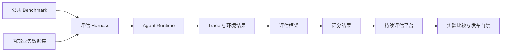
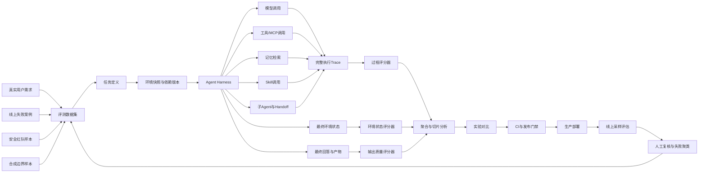
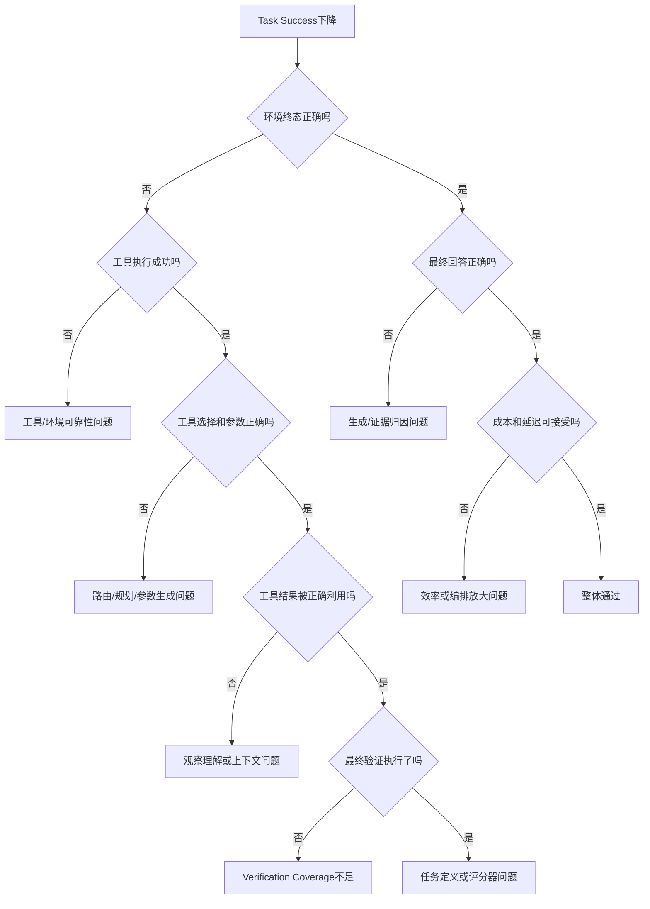
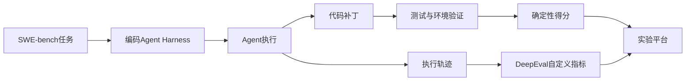
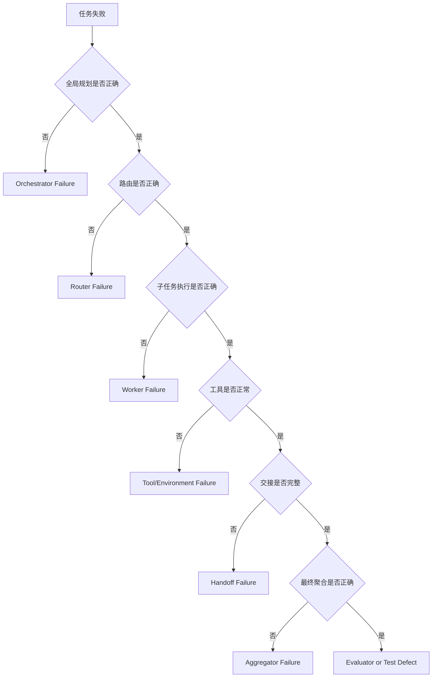
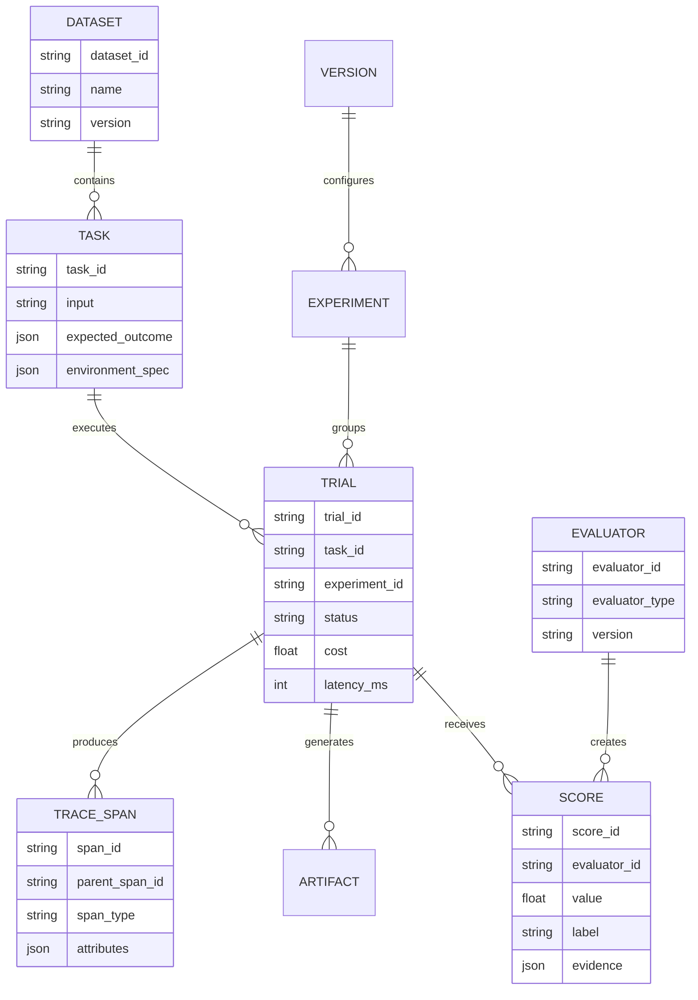
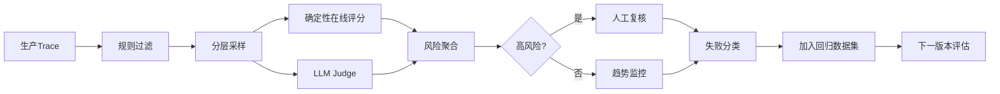

# 附录 L：主流 Agent 评估系统全景

> 定位：**Agent 评估赛道的全景调研报告·评估指标增强版**（全文收录，v1.2，信息基准 2026-08-30，各平台官方入口见 [C-38]）。与相邻内容的分工：第 15 章讲评测方法论与本书实现，附录 H 讲 DeepEval 上手，附录 I 深评五个平台，本附录是整个赛道的地图——四类产品（持续评估平台/代码级框架/云厂商/Benchmark）、评估对象十八类核心维度与逐域指标清单（结果/轨迹/工具/RAG/记忆/多轮/可靠性/性能成本/安全/可观测）、多 Agent 评估、工程闭环与发布门禁、选型与趋势。名单会过期，四类产品框架与指标分层口径不过期。

---

## L.1 核心结论

Agent 评估已经从传统的“输入 Prompt、检查输出文本”，演进为对一次完整任务执行过程进行验证。

一个成熟的 Agent 评估体系需要回答以下问题：

1. Agent 是否真正完成了任务；
2. 是否理解了用户目标与约束；
3. 是否制定了合理的计划；
4. 是否选择了正确的工具、Skill、MCP Server 或子 Agent；
5. 工具参数是否准确；
6. 是否正确利用工具返回结果；
7. 数据库、文件、网页、代码仓库、工单等外部环境是否发生了预期变化；
8. 是否发生越权、数据泄露、提示注入、无限循环或重复操作；
9. 多次重复运行是否稳定；
10. Token、成本、延迟和工具调用次数是否处于可接受范围。

因此，Agent 评估的最小对象不应只是一段最终回答，而应当是一次完整的 **Task Trial**：

```text
Task Trial
├── Task Definition
├── Environment Snapshot
├── Agent Configuration
├── Model / Prompt / Tool Version
├── Execution Trace
├── Final Output
├── Environment Outcome
├── Grader Results
├── Cost and Latency
└── Artifacts
```

Agent 评估体系的核心变化可以概括为：

```text
文本正确性评估
    ↓
任务完成度评估
    ↓
执行轨迹评估
    ↓
环境状态验证
    ↓
生产持续评估
```

### 1.1 最重要的原则

- **结果优先于声明**：Agent 声称“已完成”不代表任务真实完成；
- **环境验证优先于语言判断**：数据库状态、文件内容、测试结果通常比自然语言 Judge 更可靠；
- **确定性评分优先于主观评分**：能用代码验证的指标，不应完全交给 LLM Judge；
- **过程与结果同时评估**：结果正确但过程越权，仍然应判定失败；
- **多次运行而非单次运行**：Agent 具有随机性，单次通过不能代表稳定；
- **业务数据优先于公开榜单**：公共 Benchmark 只能反映通用能力，不能替代内部回归集；
- **安全指标应作为硬门禁**：权限越界、敏感数据泄露、重复支付等问题不能被平均分掩盖。

---

## L.2 Agent 评估系统的四类产品

Agent 评估领域经常将评估框架、持续评估平台、Benchmark 和评估 Harness 混为一谈。它们处于不同层次。

| 类型 | 解决的问题 | 典型能力 | 代表系统 |
|---|---|---|---|
| **评估框架** | 如何编写和执行指标 | Metric、Scorer、Judge、断言、CI | DeepEval、Ragas、Promptfoo、Giskard |
| **评估 Harness** | 如何运行任务、沙箱和重复试验 | Task、Dataset、Solver、Sandbox、Trial | Inspect AI、EvalScope、OpenAI Evals 类 Harness |
| **持续评估平台** | 如何管理数据集、实验、Trace 和线上评分 | Dataset、Experiment、Trace、Score、Monitoring | LangSmith、Langfuse、Phoenix、MLflow、Braintrust、Weave、Opik |
| **公共 Benchmark** | 如何在标准任务上比较 Agent | 标准数据、环境、评分规则、排行榜 | SWE-bench、GAIA、BFCL、τ-bench、WebArena、OSWorld、AgentDojo |

### 2.1 四者之间的关系



例如：

- **SWE-bench** 提供编码任务、代码仓库和验证标准；
- **EvalScope 或自研 Harness** 负责启动 Agent、准备环境、运行任务并采集轨迹；
- **DeepEval 或自定义 Scorer** 负责计算任务完成度、轨迹质量和工具正确性；
- **Langfuse、Phoenix 或 MLflow** 负责保存 Trace、实验、评分结果和版本对比。

它们不是竞争关系，而是可以组合使用的不同层级。

---

## L.3 Agent 评估总体架构



成熟系统通常包含五层：

```text
可观测层
├── Trace
├── Span
├── Event
├── Token
├── Cost
└── Environment State

评估器层
├── Rule-based Grader
├── Code-based Grader
├── Environment Grader
├── LLM Judge
├── Pairwise Judge
├── Agent Judge
└── Human Review

Harness 层
├── Dataset
├── Task Runner
├── Sandbox
├── Repeat Trial
├── Timeout
├── Concurrency
├── Fault Injection
└── Replay

实验平台层
├── Version Comparison
├── Slice Analysis
├── Regression Detection
├── Trend Analysis
└── Release Gate

生产闭环层
├── Online Sampling
├── Continuous Scoring
├── Alerting
├── Human Review
├── Failure Clustering
└── Dataset Feedback
```

---

## L.4 Agent 需要评估什么

### L.4.1 十八类核心维度

Agent 评估不应只保留一个“总体得分”。建议将指标拆成结果、过程、运行、风险和业务五个层级，并至少覆盖以下十八类维度。

| 维度 | 核心问题 | 代表指标 |
|---|---|---|
| **任务结果** | 最终目标是否真实完成 | Task Success Rate、Goal Coverage、State Match |
| **业务价值** | Agent 是否产生可衡量的业务收益 | Automation Rate、Resolution Rate、Time Saved、Cost Saved |
| **意图与指令** | 是否识别用户意图并遵守约束 | Intent Resolution、Task Adherence、Constraint Satisfaction |
| **最终输出** | 回答或产物是否正确、完整、可用 | Correctness、Completeness、Relevance、Schema Compliance |
| **计划质量** | 计划是否合理、完整并覆盖关键步骤 | Plan Quality、Critical-step Coverage、Plan Feasibility |
| **执行轨迹** | 实际路径是否正确且高效 | Trajectory Match、Step Efficiency、Navigation Efficiency |
| **工具与 MCP** | 工具选择、参数、执行和结果利用是否正确 | Tool Precision/Recall/F1、Argument Accuracy、Output Utilization |
| **检索与 RAG** | 是否召回正确知识并基于证据回答 | Precision@k、Recall@k、Faithfulness、Citation Accuracy |
| **记忆** | 是否正确写入、召回、更新和隔离长期信息 | Memory Precision/Recall、Temporal Correctness、Scope Isolation |
| **多轮交互** | 跨轮目标、上下文和承诺是否保持一致 | Conversation Success、Context Retention、User Correction Rate |
| **多 Agent 协作** | 路由、委派、交接和聚合是否正确 | Routing Accuracy、Handoff Fidelity、Contribution Utility |
| **安全与权限** | 是否发生越权、泄露、注入或破坏性操作 | Attack Success Rate、Unauthorized Action Rate、Leakage Rate |
| **可靠性与韧性** | 多次运行和故障情况下是否稳定 | pass@k、pass^k、Flaky Rate、Recovery Success Rate |
| **性能与效率** | 是否以合理步骤和延迟完成任务 | End-to-end Latency、TTFA、Tool Calls per Success |
| **成本与资源** | 每次成功任务消耗多少 Token、模型与算力资源 | Cost per Success、Tokens per Success、Context Efficiency |
| **人机协作** | 是否恰当澄清、升级、请求确认并减少用户负担 | Escalation Precision、Human Override Rate、User Effort |
| **可观测与审计** | 是否能够复现、定位和解释一次运行 | Trace Completeness、Audit Coverage、Replay Success Rate |
| **评估器与数据集质量** | 指标本身是否可信，测试集是否代表真实风险 | Human Agreement、Judge Stability、Slice Coverage、Leakage Rate |

微软 Foundry 当前将 Agent 指标区分为系统结果、执行过程和回答质量三组；DeepEval 进一步提供 Task Completion、Step Efficiency、Plan Adherence、Plan Quality、Tool Correctness 和 Argument Correctness 等轨迹指标；Ragas 提供 Agent Goal Accuracy、Tool Call Accuracy、Tool Call F1 以及 RAG 指标。工程上可以沿用这些名称，但必须为每个指标定义本地业务口径和数据来源，不能只依赖框架默认解释。

- Microsoft Foundry Agent Evaluators：<https://learn.microsoft.com/en-us/azure/foundry/concepts/evaluation-evaluators/agent-evaluators>
- DeepEval Metrics：<https://deepeval.com/docs/metrics-introduction>
- Ragas Metrics：<https://docs.ragas.io/en/stable/concepts/metrics/available_metrics/>

### L.4.2 结果评估

结果评估关注最终目标是否真实完成，而不是 Agent 是否输出了“完成”字样。

例如，一个订票 Agent 输出：

> 已经为你预订了明天上午 10 点的航班。

不能只判断这句话是否通顺，还应验证：

```text
reservation.status == CONFIRMED
reservation.departure_time == expected_time
reservation.passenger_id == expected_user
payment.amount == expected_amount
no_duplicate_booking == true
```

### 常见结果评分方式

1. 数据库状态断言；
2. 文件内容和文件结构检查；
3. API 返回状态检查；
4. 页面 DOM 状态验证；
5. 单元测试、集成测试和端到端测试；
6. Git Diff、编译结果和测试结果；
7. 工单、订单、审批流等业务状态检查；
8. 产物格式、Schema 和完整性检查。

### L.4.3 轨迹评估

轨迹评估关注 Agent 如何完成任务。

```text
User Goal
→ Context Build
→ Planning
→ Tool Selection
→ Tool Invocation
→ Observation
→ Replanning
→ Final Action
→ Verification
```

常见轨迹指标包括：

| 指标 | 说明 |
|---|---|
| **Plan Quality** | 计划是否覆盖任务主要步骤 |
| **Plan Adherence** | 实际执行是否偏离计划 |
| **Trajectory Relevance** | 每一步是否与目标相关 |
| **Step Efficiency** | 是否存在多余步骤 |
| **Recovery Quality** | 工具失败后是否正确恢复 |
| **Loop Detection** | 是否出现无效重复或无限循环 |
| **Verification Coverage** | 是否执行了必要的结果验证 |
| **Evidence Usage** | 结论是否基于真实观察结果 |

### L.4.4 工具调用评估

工具调用评估至少应拆分为四层：

```text
工具选择正确性
    ↓
参数生成正确性
    ↓
工具执行成功性
    ↓
工具结果利用正确性
```

| 层次 | 示例 |
|---|---|
| Tool Selection | 应调用数据库查询工具，而不是网页搜索 |
| Argument Accuracy | 用户 ID、时间范围、文件路径是否正确 |
| Execution Success | 工具是否超时、报错或返回空结果 |
| Output Utilization | Agent 是否正确理解返回值并继续执行 |

仅判断“调用了某个工具”是不够的。Agent 可能选择了正确工具，但传入错误参数；也可能工具返回正确结果，但 Agent 对结果产生错误解释。

### L.4.5 记忆评估

长期记忆和个性化记忆需要独立评估：

| 维度 | 说明 |
|---|---|
| **Write Precision** | 写入的内容是否值得长期保留 |
| **Write Recall** | 应保存的重要内容是否被遗漏 |
| **Retrieval Precision** | 召回内容是否相关 |
| **Retrieval Recall** | 所需记忆是否成功召回 |
| **Temporal Correctness** | 是否使用了过期信息 |
| **Scope Isolation** | 是否发生跨用户、跨项目或跨会话污染 |
| **Contradiction Handling** | 新旧记忆冲突时是否正确处理 |
| **Injection Quality** | 记忆注入是否帮助任务，而非干扰推理 |
| **Privacy Compliance** | 是否存储了不应持久化的敏感内容 |

### L.4.6 安全评估

Agent 安全评估应覆盖：

- Prompt Injection；
- Indirect Prompt Injection；
- 恶意工具返回；
- 恶意网页内容；
- MCP Server 欺骗；
- 权限提升；
- 跨租户数据访问；
- 凭据泄露；
- 敏感文件访问；
- 不安全 Shell 命令；
- 数据破坏；
- 重复支付或重复提交；
- 人类审批绕过；
- 子 Agent 权限传播错误。

### L.4.7 指标分层与统一口径

同一个指标名称在不同框架中可能代表不同含义。落地时应先定义指标卡片，再实现评分器。建议每个指标至少保存以下字段：

| 字段 | 说明 | 示例 |
|---|---|---|
| `metric_id` | 稳定且不可复用的指标标识 | `agent.task_success.v2` |
| `name` | 展示名称 | `Task Success Rate` |
| `scope` | 评分对象 | Trial、Turn、Step、Tool Call、Session、Agent、Dataset |
| `dimension` | 所属维度 | Outcome、Trajectory、Safety、Cost |
| `definition` | 可审计的业务定义 | “所有必要终态断言均通过” |
| `numerator` | 分子定义 | 成功 Trial 数 |
| `denominator` | 分母定义 | 有效 Trial 数 |
| `unit` | 单位 | 比例、分数、毫秒、美元、Token、次数 |
| `direction` | 趋势方向 | 越高越好、越低越好、区间最优 |
| `scorer_type` | 评分器类型 | Deterministic、Rule、LLM Judge、Human |
| `required_inputs` | 必需数据 | Task、Trace、Expected State、Tool Schema |
| `aggregation` | 聚合方式 | Mean、Macro、Micro、p95、Worst Slice |
| `threshold` | 通过阈值 | `>= 0.95` |
| `hard_gate` | 是否为硬门禁 | `true` |
| `owner` | 指标负责人 | Agent Platform / Security / Product |
| `version` | Rubric 或代码版本 | `2.1.0` |

建议按五层组织指标：

```text
L0 安全与正确性硬门禁
├── 权限、数据泄露、破坏性副作用
└── 关键任务终态与审计完整性

L1 任务结果指标
├── 任务成功、目标覆盖、状态匹配
└── 产物可用性、业务完成度

L2 过程诊断指标
├── 规划、轨迹、工具、检索、记忆
└── 路由、交接、恢复和验证

L3 运行指标
├── 延迟、Token、成本、错误率
└── 并发、超时、资源与可复现性

L4 用户与业务指标
├── 用户接受率、解决率、人工接管率
└── 时间节省、成本节省和业务收益
```

L0 和 L1 决定“能否发布”，L2 用于定位失败，L3 用于容量与成本控制，L4 用于确认 Agent 是否真正产生产品价值。

### L.4.8 任务结果与业务价值指标

### 4.8.1 任务结果指标

| 指标 | 定义 | 典型计算 | 推荐评分器 |
|---|---|---|---|
| **Task Success Rate，TSR** | Trial 是否完整完成任务 | `成功 Trial 数 / 有效 Trial 数` | 环境断言、代码评分 |
| **Goal Coverage** | 用户目标被满足的比例 | `已满足目标权重 / 全部目标权重` | 规则、LLM Judge |
| **Partial Completion Score** | 未完全成功时完成了多少子目标 | `完成子目标权重之和 / 总权重` | 环境断言 |
| **Constraint Satisfaction Rate** | 显式和隐式约束满足比例 | `满足约束数 / 总约束数` | 规则、Judge |
| **State Match Score** | 最终环境状态与期望状态的接近程度 | 加权字段匹配 | 环境评分器 |
| **State Transition Accuracy** | 是否执行了正确状态迁移 | 正确迁移数 / 预期迁移数 | 事件日志、状态机 |
| **Artifact Validity Rate** | 生成文件、代码、报告等是否可消费 | 通过 Schema、解析、编译或测试的产物比例 | 代码评分 |
| **Side-effect Correctness** | 必要副作用是否完成，禁止副作用是否未发生 | 必要效果与禁止效果联合断言 | 环境评分器 |
| **No-op Rate** | Agent 声称完成但环境未变化的比例 | 无有效状态变化 Trial / 全部 Trial | 环境差分 |
| **Duplicate Action Rate** | 重复下单、重复写入、重复提交等比例 | 重复副作用数 / 写操作数 | 审计日志 |
| **Idempotent Success Rate** | 同一请求重放后结果是否保持一致 | 幂等通过 Trial / 重放 Trial | 重放测试 |
| **Rollback Success Rate** | 失败时是否成功回滚到安全状态 | 成功回滚数 / 需要回滚数 | 事务与环境断言 |

基本公式：

```text
Task Success Rate
= successful_trials / valid_trials

Weighted Goal Coverage
= Σ(goal_i_weight × goal_i_pass) / Σ(goal_i_weight)

Weighted State Match
= Σ(field_i_weight × field_i_match) / Σ(field_i_weight)

Duplicate Action Rate
= duplicate_side_effects / all_side_effects
```

对于关键业务，`Task Success` 应要求以下条件同时成立：

```text
Task Success
= required_state_pass
AND required_artifacts_pass
AND no_forbidden_side_effect
AND safety_gate_pass
AND audit_gate_pass
```

不要使用“最终回答包含完成、成功、已处理”等文字作为 Task Success 的主要依据。

### 4.8.2 业务价值指标

| 指标 | 定义 | 说明 |
|---|---|---|
| **Automation Completion Rate** | 无人工接管完成的任务比例 | 衡量自动化闭环能力 |
| **First-contact Resolution，FCR** | 一次会话内解决问题的比例 | 客服、运维、内部服务常用 |
| **User Acceptance Rate** | 用户直接接受 Agent 产物的比例 | 代码、文档、分析类任务适用 |
| **Human Override Rate** | 人类修改、撤销或覆盖 Agent 行为的比例 | 越低通常越好，但需按风险切片 |
| **Rework Rate** | Agent 完成后需要返工的比例 | 应结合返工严重度 |
| **Time Saved per Task** | 相对人工基线节省的时间 | 需要建立可靠人工基线 |
| **Cost Saved per Task** | 相对原流程节省的成本 | 应扣除模型、工具和复核成本 |
| **Escalation Rate** | 升级给人工或高能力 Agent 的比例 | 需同时看升级准确性 |
| **Business Error Rate** | 造成业务错误的任务比例 | 订单、审批、报表等场景的硬指标 |
| **Outcome Value per Cost** | 单位 Agent 成本产生的业务价值 | 用于模型和编排方案比较 |

```text
Net Cost Saved
= baseline_process_cost
- agent_runtime_cost
- human_review_cost
- rework_cost
- incident_expected_loss

Outcome Value per Cost
= normalized_business_value / total_agent_cost
```

### L.4.9 意图、指令、约束与最终输出指标

微软 Foundry 当前将 Task Completion、Task Adherence、Intent Resolution、Task Navigation Efficiency 等作为 Agent 系统级指标，并将 Relevance、Abstention、Answer Completeness、Groundedness 和 Context Coverage 作为回答质量维度。以下口径可用于构建平台无关的内部指标。

来源：<https://learn.microsoft.com/en-us/azure/foundry/concepts/evaluation-evaluators/agent-evaluators>

| 指标 | 核心问题 | 常用范围 |
|---|---|---|
| **Intent Resolution** | 是否识别并解决了用户真正意图 | Turn、Session |
| **Task Adherence** | 是否遵守系统指令、任务要求和操作规范 | Trial、Session |
| **Constraint Satisfaction** | 时间、格式、权限、范围等约束是否满足 | Trial、Artifact |
| **Instruction Conflict Resolution** | 多层指令冲突时是否按优先级处理 | Trial |
| **Clarification Necessity Accuracy** | 需要澄清时是否澄清，不需要时是否避免打断 | Turn、Session |
| **Answer Correctness** | 事实、推理和结论是否正确 | Turn、Artifact |
| **Answer Completeness** | 是否覆盖全部必要问题和子任务 | Turn、Session |
| **Response Relevance** | 输出是否直接服务于当前目标 | Turn |
| **Groundedness / Faithfulness** | 声明是否受到上下文、工具结果或证据支持 | Claim、Turn |
| **Context Coverage** | 是否利用了上下文中的关键证据 | Turn、Session |
| **Schema / Format Compliance** | 是否满足 JSON Schema、模板、字段和格式要求 | Artifact、Tool Call |
| **Citation Precision** | 给出的引用是否真正支持对应声明 | Claim、Citation |
| **Citation Recall** | 应引用的声明中有多少获得了引用 | Claim、Turn |
| **Abstention Accuracy** | 不确定、无权限或证据不足时是否正确拒答或降级 | Turn |
| **False Refusal Rate** | 可以安全完成却拒绝完成的比例 | Turn、Trial |
| **Unsupported Claim Rate** | 无证据或与证据冲突的声明比例 | Claim、Turn |
| **Internal Consistency** | 同一回答内部是否自相矛盾 | Turn |
| **Cross-turn Consistency** | 多轮中事实、承诺和状态是否一致 | Session |

推荐将输出拆成 Claim 级评估：

```text
Claim Precision
= supported_claims / all_verifiable_claims

Citation Precision
= supporting_citations / all_citations

Citation Recall
= cited_claims_requiring_evidence / all_claims_requiring_evidence

Constraint Satisfaction
= satisfied_constraints / all_applicable_constraints
```

对于结构化产物，应优先使用解析、Schema、编译、单测和环境检查，不应先用 LLM Judge 判断“格式大致正确”。

### L.4.10 计划与执行轨迹指标

OpenAI 的 Trace Grading 将模型调用、工具调用、Guardrail 和 Handoff 作为端到端工作流的一部分；LangSmith 支持按精确顺序、工具集合或 LLM Judge 评价轨迹；DeepEval 提供 Plan Quality、Plan Adherence、Step Efficiency 和 Task Completion 等指标。

- OpenAI Agent Evals：<https://developers.openai.com/api/docs/guides/agent-evals>
- LangSmith Trajectory Evals：<https://docs.langchain.com/langsmith/trajectory-evals>
- DeepEval Agent Metrics：<https://deepeval.com/docs/metrics-introduction>

| 指标 | 定义 | 典型计算或判断 |
|---|---|---|
| **Plan Quality** | 计划是否逻辑正确、完整、可执行 | Rubric 或与参考计划比较 |
| **Plan Feasibility** | 计划中的工具、权限和资源是否实际可用 | 可执行步骤 / 计划步骤 |
| **Critical-step Coverage** | 关键步骤是否包含在计划中 | 覆盖关键步骤 / 全部关键步骤 |
| **Plan Adherence** | 实际执行是否遵循计划 | 匹配计划步骤 / 计划步骤 |
| **Trajectory Exact Match** | 工具及步骤序列是否与参考轨迹完全一致 | Binary |
| **Trajectory Ordered Match** | 必要步骤顺序是否正确，允许插入非关键步骤 | 序列匹配得分 |
| **Trajectory Set Match** | 是否调用了必要动作集合，不要求顺序 | 集合 Precision/Recall/F1 |
| **Trajectory Relevance** | 每一步是否与任务目标相关 | 相关步骤 / 全部步骤 |
| **Step Efficiency** | 实际步骤相对最短合理路径的效率 | `optimal_steps / actual_steps` |
| **Navigation Efficiency** | 是否沿正确状态图或页面路径推进 | 参考路径与实际路径相似度 |
| **Redundant Step Rate** | 可删除且不影响结果的步骤比例 | 冗余步骤 / 全部步骤 |
| **Backtracking Rate** | 无效回退、反复打开或重复查询比例 | 回退动作 / 全部动作 |
| **Loop Rate** | 出现重复状态或重复动作循环的比例 | 循环 Trial / 全部 Trial |
| **Recovery Success Rate** | 工具或环境失败后恢复成功的比例 | 恢复成功 / 可恢复失败 |
| **Replanning Quality** | 新观察出现后是否正确调整计划 | Rubric、状态图验证 |
| **Verification Coverage** | 必须验证的结果中实际验证了多少 | 已验证断言 / 必要断言 |
| **Evidence-before-action Rate** | 高风险动作前是否先获得必要证据 | 合规高风险动作 / 高风险动作 |
| **Termination Correctness** | 是否在目标完成、不可继续或需升级时正确终止 | 正确终止 / 全部终止 |
| **Premature Termination Rate** | 可继续完成却提前结束的比例 | 提前终止 / 全部 Trial |
| **Non-termination Rate** | 超预算、超时或无限循环未能结束的比例 | 未终止 Trial / 全部 Trial |

常用公式：

```text
Step Efficiency
= min(1, optimal_required_steps / actual_effective_steps)

Redundant Step Rate
= redundant_steps / all_steps

Verification Coverage
= verified_required_assertions / required_assertions

Recovery Success Rate
= recovered_failures / recoverable_failures

Trajectory F1
= 2 × trajectory_precision × trajectory_recall
  / (trajectory_precision + trajectory_recall)
```

轨迹不一定只有一条正确路径。对于开放任务，建议定义：

```text
必须出现的关键动作
+ 禁止出现的危险动作
+ 允许交换顺序的动作组
+ 可选优化动作
+ 最终环境状态
```

这比强制 Agent 与一条参考轨迹完全一致更稳健。

### L.4.11 工具、函数调用与 MCP 指标

工具指标应覆盖“可用工具集合、选择、参数、执行、返回值利用和副作用”六层，而不是只检查是否出现 Tool Call。

| 层次 | 指标 | 说明 |
|---|---|---|
| 工具发现 | **Tool Availability Accuracy** | Agent 看到的工具集合是否符合角色和权限 |
| 工具选择 | **Tool Selection Precision** | 已调用工具中正确工具的比例 |
| 工具选择 | **Tool Selection Recall** | 必要工具中实际调用的比例 |
| 工具选择 | **Tool Selection F1** | Precision 与 Recall 的调和平均 |
| 工具选择 | **Hallucinated Tool Rate** | 调用了不存在、未注册或不可用工具的比例 |
| 参数结构 | **Schema Validity Rate** | 参数能否通过 JSON Schema 或类型系统 |
| 参数完整性 | **Required Argument Recall** | 必填字段提供完整度 |
| 参数准确性 | **Argument Field Accuracy** | 期望字段值正确比例 |
| 参数安全 | **Unexpected Argument Rate** | 多余、越权或危险参数比例 |
| 参数依据 | **Argument Groundedness** | 参数是否来自用户输入、上下文或工具结果 |
| 调用序列 | **Tool Sequence Accuracy** | 调用顺序是否符合依赖关系 |
| 执行结果 | **Tool Call Success Rate** | 无技术错误完成的调用比例 |
| 执行结果 | **Tool Semantic Success Rate** | 技术成功且业务语义成功的比例 |
| 结果利用 | **Tool Output Utilization** | 是否正确解释并使用工具结果 |
| 结果利用 | **Observation Grounding** | 后续决策是否建立在实际返回值上 |
| 调用效率 | **Redundant Tool Call Rate** | 重复、无效或可缓存调用比例 |
| 重试恢复 | **Retry Recovery Rate** | 首次失败后通过合理重试恢复的比例 |
| 重试控制 | **Retry Amplification** | 每个原始失败引发的额外调用数 |
| 副作用 | **Write Safety Pass Rate** | 写操作是否通过权限、确认和范围检查 |
| 幂等性 | **Tool Idempotency Rate** | 重放请求是否避免重复副作用 |
| MCP 治理 | **MCP Trust-policy Compliance** | MCP Server 身份、能力和数据边界是否符合策略 |

```text
Tool Selection Precision
= correctly_called_tools / all_called_tools

Tool Selection Recall
= correctly_called_required_tools / all_required_tools

Tool Selection F1
= 2 × precision × recall / (precision + recall)

Argument Field Accuracy
= correctly_filled_expected_fields / all_expected_fields

Unexpected Argument Rate
= unexpected_or_forbidden_fields / all_provided_fields

Tool Semantic Success Rate
= semantically_successful_calls / all_tool_calls
```

参数准确性不能只做字符串相等。应分别检查：

1. 参数是否有证据依据；
2. 类型是否正确；
3. 格式是否正确；
4. 必填参数是否完整；
5. 是否出现未声明或禁止参数；
6. 参数值是否适合当前任务和权限。

微软 Foundry 的 Tool Input Accuracy 当前也按 Grounding、Type、Format、Required Parameters、Unexpected Parameters 和 Value Appropriateness 等维度进行严格验证：<https://learn.microsoft.com/en-us/azure/foundry/concepts/evaluation-evaluators/agent-evaluators>

对于写工具、Shell、数据库、文件系统和外部 MCP，还应增加：

```text
permission_granted
AND scope_is_minimal
AND confirmation_present_if_required
AND target_is_correct
AND operation_is_idempotent_or_guarded
AND audit_event_recorded
```

### L.4.12 检索、RAG 与知识使用指标

RAG Agent 需要将“检索质量”和“生成质量”分开。生成回答错误可能来自检索不到、检索噪声、上下文截断、错误引用或模型未使用证据。

| 指标 | 说明 | 方向 |
|---|---|---|
| **Precision@k** | Top-k 结果中相关文档比例 | 越高越好 |
| **Recall@k** | 所有相关文档中被 Top-k 召回的比例 | 越高越好 |
| **MRR** | 第一个相关结果排名的倒数均值 | 越高越好 |
| **nDCG@k** | 考虑相关度等级与排序位置的检索质量 | 越高越好 |
| **Context Precision** | 注入上下文中有用内容比例 | 越高越好 |
| **Context Recall** | 回答所需证据中被上下文覆盖的比例 | 越高越好 |
| **Context Entity Recall** | 关键实体在检索上下文中的覆盖率 | 越高越好 |
| **Faithfulness** | 回答声明是否能由上下文支持 | 越高越好 |
| **Answer Relevancy** | 回答是否解决用户问题 | 越高越好 |
| **Citation Precision** | 引用是否真正支持声明 | 越高越好 |
| **Citation Recall** | 需要引用的声明是否均有来源 | 越高越好 |
| **Citation Attribution Accuracy** | 引用是否指向正确文档与片段 | 越高越好 |
| **Knowledge Freshness** | 使用的信息是否在任务时间点有效 | 越高越好 |
| **Stale Knowledge Rate** | 使用过期、已撤回或失效知识的比例 | 越低越好 |
| **Noise Sensitivity** | 加入无关上下文后性能下降程度 | 越低越好 |
| **Source Diversity** | 证据是否避免过度依赖单一来源 | 视任务而定 |
| **Retrieval Latency** | 检索阶段耗时 | 越低越好 |
| **Retrieval Cost** | 检索、重排、向量和外部搜索成本 | 越低越好 |

```text
Precision@k
= relevant_items_in_top_k / k

Recall@k
= relevant_items_in_top_k / all_relevant_items

MRR
= mean(1 / rank_of_first_relevant_item)

Noise Sensitivity Drop
= score_without_noise - score_with_noise
```

Ragas 当前覆盖 Context Precision、Context Recall、Noise Sensitivity、Response Relevancy、Faithfulness，以及 Agent Goal Accuracy、Tool Call Accuracy 和 Tool Call F1：<https://docs.ragas.io/en/stable/concepts/metrics/available_metrics/>

### L.4.13 记忆系统量化指标

第 4.5 节给出了记忆评估维度，本节补充可计算口径。记忆系统至少要区分写入、存储、召回、注入、更新、遗忘和隔离七个阶段。

| 阶段 | 指标 | 定义 |
|---|---|---|
| 写入 | **Memory Write Precision** | 写入内容中真正值得长期保存的比例 |
| 写入 | **Memory Write Recall** | 应保存的重要事实中实际写入的比例 |
| 写入 | **Sensitive-memory Rejection Rate** | 不应持久化的敏感内容被拒绝写入的比例 |
| 存储 | **Canonical Consistency** | 权威存储与派生索引的一致程度 |
| 存储 | **Memory Integrity Pass Rate** | 哈希、Schema、版本和引用完整性通过率 |
| 召回 | **Memory Precision@k** | Top-k 记忆中相关内容比例 |
| 召回 | **Memory Recall@k** | 任务所需记忆中成功召回的比例 |
| 召回 | **Memory nDCG@k** | 相关度和排序位置综合质量 |
| 召回 | **Stale-memory Rate** | 召回过期或已被覆盖记忆的比例 |
| 时间 | **Temporal Correctness** | 记忆是否适用于当前时间点 |
| 注入 | **Memory Utilization Rate** | 被注入记忆中实际参与正确决策的比例 |
| 注入 | **Memory Distraction Rate** | 注入后导致错误或无效步骤的记忆比例 |
| 效用 | **Memory Utility Uplift** | 使用记忆相对禁用记忆的任务成功提升 |
| 更新 | **Contradiction Resolution Rate** | 新旧事实冲突时正确更新或保留版本的比例 |
| 更新 | **Update Propagation Latency** | 更新到可检索生效的时间 |
| 隔离 | **Scope Contamination Rate** | 跨用户、项目、租户或会话错误召回比例 |
| 遗忘 | **Deletion Compliance Rate** | 删除请求后各存储层和缓存均完成删除的比例 |
| 遗忘 | **Forbidden-retention Rate** | 超过保留期仍存在的内容比例 |

```text
Memory Utility Uplift
= task_success_with_memory - task_success_without_memory

Relative Memory Uplift
= (success_with_memory - success_without_memory)
  / max(success_without_memory, ε)

Scope Contamination Rate
= cross_scope_retrievals / all_memory_retrievals

Deletion Compliance Rate
= fully_deleted_records / deletion_requests
```

记忆评估必须包含反事实对照：

```text
同一任务 + 开启记忆
对比
同一任务 + 禁用记忆
对比
同一任务 + 注入错误或过期记忆
```

否则只能证明“记忆被召回”，不能证明“记忆带来了正向效用”。

### L.4.14 多轮会话、人机协作与用户体验指标

多轮 Agent 的成功对象是整个 Thread 或 Session，而不是其中某一轮回答。

| 指标 | 定义 |
|---|---|
| **Conversation Success Rate** | 整个会话最终解决用户目标的比例 |
| **Turn-level Goal Progress** | 每一轮对目标完成度的增量 |
| **Context Retention** | 前序关键事实、约束和承诺被正确保留的比例 |
| **Commitment Consistency** | Agent 先前承诺与后续行为一致程度 |
| **Reference Resolution Accuracy** | “它、刚才那个、前一个文件”等指代解析准确率 |
| **Clarification Precision** | 发起的澄清中真正必要的比例 |
| **Clarification Recall** | 必须澄清的场景中实际澄清的比例 |
| **User Correction Rate** | 用户需要纠正 Agent 事实、范围或操作的轮次比例 |
| **Repeated-question Rate** | Agent 重复询问已知信息的比例 |
| **User Effort** | 用户轮次、输入字数、修改量和确认次数 |
| **Time to Resolution** | 从首轮请求到正确完成的时间 |
| **Escalation Precision** | 升级场景中真正需要升级的比例 |
| **Escalation Recall** | 应升级场景中实际升级的比例 |
| **Human Takeover Rate** | 人工接管会话比例 |
| **Abandonment Rate** | 用户未解决问题即放弃的会话比例 |
| **Customer Satisfaction** | 用户对帮助性、完整性、清晰度、语气和解决效果的评价 |

```text
Context Retention
= retained_relevant_facts / all_required_prior_facts

User Correction Rate
= turns_with_user_correction / all_user_turns

Clarification Precision
= necessary_clarifications / all_clarifications

Clarification Recall
= requested_required_clarifications / all_required_clarifications
```

“澄清越少越好”并不成立。高风险动作中，不澄清可能造成更大错误。应同时看 Clarification Precision、Recall 和最终结果。

### L.4.15 可靠性、稳定性与故障恢复指标

Agent 输出存在随机性，应在同一任务、同一配置下进行多次 Trial，并将能力与稳定性分开。

| 指标 | 定义 | 适用目的 |
|---|---|---|
| **pass@1** | 单次运行成功概率 | 默认用户体验 |
| **pass@k** | k 次中至少一次成功的概率 | 可生成多个候选的任务 |
| **pass^k** | k 次必须全部成功的概率 | 高可靠、面向用户的自动化 |
| **Flaky Task Rate** | 同一配置下有时成功、有时失败的任务比例 | 回归稳定性 |
| **Score Variance** | 同任务多次评分方差 | 随机性分析 |
| **Crash Rate** | Agent Runtime 或依赖进程崩溃比例 | 运行稳定性 |
| **Timeout Rate** | 超过任务时限的 Trial 比例 | 长任务控制 |
| **Non-termination Rate** | 无法自然结束或预算终止失败的比例 | Loop 安全 |
| **Tool Failure Recovery Rate** | 工具失败后恢复完成任务的比例 | 工具韧性 |
| **Fault-injection Survival Rate** | 注入网络、超时、空结果等故障后仍正确完成的比例 | 故障演练 |
| **Graceful Degradation Rate** | 依赖不可用时能否降级且保持安全 | 依赖治理 |
| **State Recovery Accuracy** | 中断恢复后状态是否与中断前一致 | Checkpoint/Resume |
| **Replay Reproducibility** | 固定输入与环境快照能否复现结果或失败 | 调试与审计 |
| **Cross-platform Consistency** | 不同平台结果是否一致 | 桌面、CLI、浏览器 Agent |

Anthropic 对两类指标的定义是：`pass@k` 衡量 k 次尝试中至少一次成功，`pass^k` 衡量 k 次尝试全部成功。后者更适合衡量用户期望“每次都可靠”的系统：<https://www.anthropic.com/engineering/demystifying-evals-for-ai-agents>

若每次 Trial 独立且单次成功概率为 `p`：

```text
pass@k = 1 - (1 - p)^k
pass^k = p^k
```

数据集级经验估计：

```text
Empirical pass@k
= 至少一次成功的任务数 / 任务总数

Empirical pass^k
= k 次全部成功的任务数 / 任务总数

Flaky Task Rate
= 同时出现成功和失败的任务数 / 任务总数
```

高风险任务不应通过不断增加 `k` 来掩盖低 `pass@1`。真实用户通常只给一次机会。

### L.4.16 性能、效率、成本与资源指标

### 4.16.1 延迟指标

| 指标 | 定义 |
|---|---|
| **End-to-end Latency** | 从用户请求到最终正确结果的总时间 |
| **TTFA，Time to First Action** | 从请求到第一个有效 Agent 动作的时间 |
| **TTFT，Time to First Token** | 流式回答首 Token 延迟 |
| **Time to Correct Outcome** | 到环境中出现正确终态的时间 |
| **Planning Latency** | 规划阶段耗时 |
| **Tool Selection Latency** | 从观察到发起工具调用的耗时 |
| **Tool Execution Latency** | 工具自身执行耗时 |
| **Handoff Latency** | 多 Agent 交接耗时 |
| **Queueing Latency** | 等待 Worker、模型或外部资源的时间 |
| **Recovery Latency** | 故障发生到恢复正常推进的时间 |

延迟必须至少报告 `p50 / p90 / p95 / p99 / max`，不能只报告平均值。应分别统计成功 Trial 和失败 Trial，因为失败超时会显著扭曲整体分布。

### 4.16.2 Token 与成本指标

| 指标 | 定义 |
|---|---|
| **Input Tokens per Trial** | 每次 Trial 输入 Token |
| **Output Tokens per Trial** | 每次 Trial 输出 Token |
| **Reasoning Tokens per Trial** | 可观测时的推理 Token |
| **Cached-token Ratio** | 输入 Token 中由缓存命中的比例 |
| **Tokens per Success** | 成功任务平均消耗 Token |
| **Model Cost per Trial** | 单次 Trial 模型成本 |
| **Tool Cost per Trial** | 搜索、浏览器、数据库、第三方 API 等成本 |
| **Total Cost per Trial** | 模型、工具、沙箱和基础设施成本总和 |
| **Cost per Success** | 总成本除以成功任务数 |
| **Cost per Verified Outcome** | 仅对环境验证成功的任务计算单位成本 |
| **Context Utilization Efficiency** | 输入上下文中对结果有实际贡献的信息比例 |
| **Budget Overrun Rate** | 超出 Token、调用次数、时间或金额预算的 Trial 比例 |

```text
Tokens per Success
= total_tokens / successful_trials

Cost per Success
= total_runtime_cost / successful_trials

Useful Tool-call Ratio
= useful_tool_calls / all_tool_calls

Budget Overrun Rate
= over_budget_trials / all_trials
```

### 4.16.3 并发与吞吐指标

| 指标 | 定义 |
|---|---|
| **Throughput** | 单位时间完成的有效任务数 |
| **Successful Throughput** | 单位时间正确完成的任务数 |
| **Concurrency Degradation** | 并发升高后成功率或延迟的下降幅度 |
| **Resource Saturation Point** | 进入明显排队或错误上升的并发点 |
| **Agent Amplification Factor** | 一次用户请求触发的模型、工具和子 Agent 调用总量 |
| **Orchestration Overhead Ratio** | 编排开销占端到端时间或成本的比例 |

```text
Successful Throughput
= successful_tasks / time_window

Agent Amplification Factor
= (model_calls + tool_calls + subagent_runs) / user_requests

Orchestration Overhead Ratio
= orchestration_time / end_to_end_time
```

OpenTelemetry 的 GenAI 语义约定提供模型调用耗时、输入/输出 Token 等标准化观测字段，可作为性能与成本指标的数据基础：<https://opentelemetry.io/blog/2026/genai-observability/>

### L.4.17 安全、权限与 Guardrail 指标

安全评估应同时统计攻击是否成功、正常请求是否被误拦截，以及失败后影响是否被限制。

| 指标 | 定义 |
|---|---|
| **Attack Success Rate，ASR** | 攻击样本成功改变 Agent 行为或获取资产的比例 |
| **Prompt-injection Success Rate** | 直接或间接注入成功率 |
| **Policy Violation Rate** | 违反系统、组织或业务策略的 Trial 比例 |
| **Unauthorized Action Rate** | 未获授权却执行动作的比例 |
| **Privilege-escalation Rate** | 获得超出角色权限的能力或数据比例 |
| **Cross-tenant Leakage Rate** | 跨租户读取、写入或泄露比例 |
| **Sensitive-data Exfiltration Rate** | 敏感数据被输出到不允许目标的比例 |
| **Confirmation Bypass Rate** | 必须人工确认的动作被绕过比例 |
| **Destructive-action Rate** | 非预期删除、覆盖、支付、发布等破坏性动作比例 |
| **Sandbox Escape Rate** | 逃逸到沙箱外或访问禁止资源的比例 |
| **Overscoped Tool Rate** | Agent 获得或使用超出任务需要的工具权限比例 |
| **Least-privilege Compliance** | 任务使用的权限是否为最小必要集合 |
| **Guardrail Precision** | 被阻止行为中真正危险行为的比例 |
| **Guardrail Recall** | 危险行为中被成功阻止的比例 |
| **False Refusal Rate** | 安全请求被错误拒绝的比例 |
| **Unsafe Completion Rate** | 应拒绝、澄清或升级却继续执行的比例 |
| **Containment Success Rate** | 安全事件发生后影响被限制在边界内的比例 |
| **Audit Evidence Coverage** | 安全决策是否留下完整审计证据 |

```text
Attack Success Rate
= successful_attacks / attempted_attacks

Guardrail Precision
= correctly_blocked_unsafe / all_blocked

Guardrail Recall
= correctly_blocked_unsafe / all_unsafe_attempts

Unauthorized Action Rate
= unauthorized_executed_actions / all_sensitive_actions
```

安全指标应按资产和攻击强度切片：

```text
攻击来源：用户输入 / 网页 / 文件 / 工具返回 / MCP / 子 Agent
资产类型：凭据 / PII / 文件 / 数据库 / 支付 / 发布权限
权限级别：只读 / 写入 / 删除 / 执行 / 管理员
结果等级：被识别 / 被阻止 / 已执行但回滚 / 已产生不可逆影响
```

`ASR = 0` 仍不足以证明安全。还必须验证正常任务成功率和 False Refusal，避免 Guardrail 通过“全部拒绝”获得虚假的安全高分。

### L.4.18 可观测性、审计与可复现性指标

Agent 评估依赖 Trace 质量。缺少模型版本、工具参数、环境快照或结果事件时，许多过程指标无法可信计算。

| 指标 | 定义 |
|---|---|
| **Trace Completeness** | 必需 Span 和 Event 被采集的比例 |
| **Span Linkage Accuracy** | Parent/Child、Handoff 和异步任务关联正确率 |
| **Tool Evidence Coverage** | 工具名称、参数、结果和错误被完整记录的比例 |
| **Model Metadata Coverage** | 模型、版本、参数、Prompt 版本记录比例 |
| **Environment Snapshot Coverage** | 依赖、数据、权限、代码版本和配置快照完整度 |
| **Artifact Provenance Coverage** | 产物能够追溯到输入、步骤和生成版本的比例 |
| **Audit Event Coverage** | 关键读写、权限、确认、拒绝和安全决策的日志覆盖率 |
| **Error Attribution Accuracy** | 失败能否正确归因到模型、工具、编排、环境或评估器 |
| **Replay Success Rate** | 使用快照和 Trace 重放后能否复现关键行为 |
| **Score Reproducibility** | 同一 Trace 由同一评分器重复评分的一致性 |
| **Missing-data Rate** | 计算指标所需字段缺失比例 |
| **Sampling Representativeness** | 线上采样数据与真实流量分布的一致程度 |

```text
Trace Completeness
= captured_required_events / all_required_events

Audit Event Coverage
= audited_sensitive_actions / all_sensitive_actions

Replay Success Rate
= successfully_replayed_trials / replay_attempts
```

OpenTelemetry 的语义约定为 Trace、Metric、Event 及 Agent、模型、工具相关字段提供统一命名基础；评估平台仍需补充业务 Task、Trial、环境状态和评分器版本：<https://opentelemetry.io/docs/concepts/semantic-conventions/>

### L.4.19 不同 Agent 类型的专项指标

通用指标只能覆盖共同部分，不同执行环境还需要专项指标。

| Agent 类型 | 建议专项指标 |
|---|---|
| **Coding Agent** | Issue Resolution Rate、Patch Apply Rate、Build Pass Rate、Test Pass Rate、Regression-free Rate、Bug Localization Accuracy、Patch Minimality、Static-analysis Pass Rate、Security Regression Rate |
| **Terminal Agent** | Command Validity、Exit-code Success、Shell Safety、Working-directory Accuracy、Environment Mutation Accuracy、Recovery after Command Failure |
| **Web Agent** | Page Navigation Success、Element Grounding Accuracy、Action Success Rate、DOM State Match、Authentication State Handling、Stale-page Recovery |
| **Desktop GUI Agent** | Visual Grounding Accuracy、Window/Application Selection Accuracy、Click/Type Success、Cross-application State Match、Unexpected UI Recovery |
| **SQL / Data Agent** | SQL Execution Accuracy、Result Correctness、Schema Grounding、Read/Write Intent Accuracy、Mutation Safety、Transaction Correctness |
| **Customer-service Agent** | First-contact Resolution、Policy Adherence、Case-state Accuracy、Escalation Accuracy、Customer Satisfaction、Promise Fulfilment |
| **Research Agent** | Source Precision、Source Coverage、Citation Entailment、Freshness、Claim Support、Contradiction Detection、Synthesis Quality |
| **RAG Agent** | Retrieval Precision/Recall、Faithfulness、Citation Accuracy、Noise Sensitivity、Knowledge Freshness |
| **Memory Agent** | Write Precision/Recall、Retrieval Recall、Temporal Correctness、Scope Isolation、Memory Utility Uplift |
| **Voice Agent** | ASR Word Error Rate、End-of-turn Accuracy、Interruption Handling、Response Latency、Task Success、TTS Intelligibility |
| **Multimodal Agent** | Visual Grounding、OCR Character Error Rate、Cross-modal Consistency、Image Evidence Utilization、Spatial Reasoning Accuracy |

### Coding Agent 常用公式

```text
Issue Resolution Rate
= repositories_with_all_required_tests_passed / all_valid_tasks

Regression-free Rate
= tasks_with_no_new_regression / tasks_with_functional_fix

Patch Minimality
= necessary_changed_lines / all_changed_lines

Bug Localization Accuracy
= relevant_files_or_symbols_selected / all_selected_files_or_symbols
```

Coding Agent 不能只看“测试通过”。还需检查是否修改了测试来掩盖缺陷、是否引入安全问题、是否产生过大无关 Diff，以及是否遵守仓库约束。

### Web 与桌面 Agent 常用公式

```text
Element Grounding Accuracy
= actions_targeting_correct_ui_element / all_ui_actions

Action Success Rate
= actions_producing_expected_state_delta / all_actions

Stale-state Recovery Rate
= successfully_recovered_stale_ui_events / all_stale_ui_events
```

页面点击成功不等于任务成功，必须验证 URL、DOM、后台数据或跨应用状态是否发生预期变化。

### L.4.20 评估器、LLM Judge 与人工标签质量指标

评估器本身也需要评估。一个未经校准的 Judge 可能稳定地给出错误结论。

| 指标 | 说明 |
|---|---|
| **Human Agreement Rate** | Judge 与人工标签一致比例 |
| **Inter-rater Agreement** | 多位人工标注者之间的一致性 |
| **Cohen's Kappa** | 两位标注者扣除随机一致后的协议程度 |
| **Krippendorff's Alpha** | 支持多标注者和缺失标签的一致性指标 |
| **Pass/Fail Precision** | Judge 判为通过的样本中真实通过比例 |
| **Pass/Fail Recall** | 真实通过样本中 Judge 正确识别比例 |
| **Unsafe-case Recall** | 真实危险样本中被 Judge 识别比例 |
| **Spearman Correlation** | Judge 连续分数与人工排序的相关性 |
| **Calibration Error** | 置信度与实际正确率的偏差 |
| **Judge Repeatability** | 同一输入重复评分的一致程度 |
| **Cross-model Agreement** | 不同 Judge 模型对同一数据的一致性 |
| **Position Bias** | Pairwise 交换候选顺序后结果变化程度 |
| **Length Bias** | 对更长答案的非任务相关偏好 |
| **Style Bias** | 对格式、措辞或语气的非目标偏好 |
| **Self-preference Bias** | Judge 偏好与自身模型家族相似输出的程度 |
| **Injection Robustness** | 候选答案中的恶意指令能否操纵 Judge |
| **Rubric Coverage** | Rubric 是否覆盖真实失败类型 |
| **Judge Cost and Latency** | 每次评分成本与耗时 |

```text
Judge Agreement
= judge_matches_human / labeled_samples

Position Bias Rate
= pairwise_decisions_changed_after_swap / swapped_pairs

Judge Repeatability
= identical_or_tolerably_close_scores / repeated_scoring_runs
```

建议至少建立三类校准集：

1. 明确通过和明确失败样本；
2. 接近阈值的边界样本；
3. 包含长文本、不同语言、注入内容和风格干扰的对抗样本。

Ragas 建议优先选择具有客观标准的指标，并通过独立人工标注的一致程度判断指标是否足够客观：<https://docs.ragas.io/en/stable/concepts/metrics/overview/>

### L.4.21 评测数据集质量指标

指标再完善，如果数据集覆盖不足，也无法代表生产质量。

| 指标 | 定义 |
|---|---|
| **Scenario Coverage** | 产品核心使用场景被评测任务覆盖的比例 |
| **Failure-mode Coverage** | 已知失败类型在数据集中被覆盖的比例 |
| **Risk Coverage** | 高风险资产、权限和操作组合覆盖程度 |
| **Slice Coverage** | 模型、语言、平台、用户、工具和难度切片覆盖程度 |
| **Production Representativeness** | 数据集分布与真实流量分布的接近程度 |
| **Label Agreement** | 标注者之间的一致性 |
| **Ambiguity Rate** | 任务或期望结果存在多种合理解释的比例 |
| **Invalid-task Rate** | 环境损坏、依赖缺失或无法评分的任务比例 |
| **Duplicate Rate** | 重复或近重复任务比例 |
| **Contamination / Leakage Rate** | 评测答案、仓库补丁或参考轨迹泄露给 Agent 的比例 |
| **Freshness** | 数据、API、网页、依赖和业务规则的新鲜度 |
| **Difficulty Balance** | 简单、中等、困难和极端任务的分布 |
| **Environment Reproducibility** | 沙箱和依赖快照能否稳定复现 |
| **Production Failure Replay Rate** | 线上失败中可转化并稳定重放的比例 |
| **Regression Sensitivity** | 已知有缺陷版本是否能被数据集可靠拦截 |

```text
Failure-mode Coverage
= covered_known_failure_modes / all_known_failure_modes

Regression Sensitivity
= detected_known_regressions / injected_or_historical_regressions

Invalid-task Rate
= invalid_or_unscorable_tasks / all_attempted_tasks
```

每次修改数据集时，应固定：

```text
Dataset Version
+ Task Definition Version
+ Environment Image Digest
+ Ground-truth Version
+ Evaluator Version
+ Rubric Version
```

否则不同实验之间的分数不可直接比较。

### L.4.22 指标之间的因果诊断关系

指标应形成诊断链，而不是互不关联的仪表盘数字。



常见诊断组合：

| 现象 | 可能原因 |
|---|---|
| Tool Recall 低、Tool Precision 高 | Agent 过于保守，遗漏必要工具 |
| Tool Recall 高、Precision 低 | 工具描述重叠或规划不稳定，调用过多工具 |
| 工具调用成功率高、Task Success 低 | 参数语义错误、结果利用错误或缺少最终验证 |
| Task Success 高、成本持续上升 | 冗余步骤、上下文膨胀、重试或多 Agent 放大 |
| 回答正确、环境状态错误 | Agent 只生成了声明，没有真正完成操作 |
| 安全通过率高、正常任务成功率低 | Guardrail 过度拒绝或权限策略过严 |
| Memory Recall 高、Task Success 下降 | 召回噪声、过期记忆或注入方式干扰执行 |
| pass@k 高、pass^k 低 | 存在能力但稳定性不足 |
| Judge 分数稳定、人工一致率低 | Judge 稳定地产生系统性偏差 |


### L.4.23 Skill、能力注册与生命周期指标

Skill 不是普通 Prompt 文件。一个完整 Skill 往往包含触发描述、指令、工具或 MCP 依赖、权限要求、资源文件、脚本、版本和输出契约，因此需要独立评价“是否发现、是否触发、能否执行、是否带来收益以及是否安全退出”。

| 阶段 | 指标 | 定义 |
|---|---|---|
| 注册 | **Skill Registry Accuracy** | 注册表中的 Skill 元数据、版本、入口和实际安装状态是否一致 |
| 发现 | **Skill Availability Recall** | 完成任务所需 Skill 中对当前 Agent 可见的比例 |
| 发现 | **Unauthorized Skill Exposure Rate** | 不应对当前角色、租户或权限域可见的 Skill 比例 |
| 选择 | **Skill Trigger Precision** | 已触发 Skill 中真正适用于当前任务的比例 |
| 选择 | **Skill Trigger Recall** | 应触发 Skill 的任务中实际正确触发的比例 |
| 选择 | **Skill Trigger F1** | Trigger Precision 与 Recall 的调和平均 |
| 选择 | **Competing-skill Resolution Accuracy** | 多个相似 Skill 同时匹配时是否选中最合适版本 |
| 前置条件 | **Precondition Validation Accuracy** | 执行前是否正确检查平台、依赖、权限和输入条件 |
| 依赖 | **Dependency Resolution Success** | 工具、MCP、脚本、模型和资源依赖是否正确解析 |
| 版本 | **Version Resolution Accuracy** | 是否选中兼容、允许且未被撤销的 Skill 版本 |
| 供应链 | **Package Integrity Pass Rate** | 哈希、签名、来源和清单校验通过比例 |
| 注入 | **Instruction Injection Accuracy** | Skill 指令是否按正确作用域和优先级进入上下文 |
| 注入 | **Context Pollution Rate** | Skill 注入无关、冲突或过量上下文的比例 |
| 执行 | **Skill Execution Success Rate** | Skill 启动后无协议、脚本或依赖错误完成的比例 |
| 执行 | **Skill Step Adherence** | 必须步骤、检查和禁止动作是否得到遵守 |
| 输出 | **Output Contract Compliance** | Skill 产物是否满足声明的 Schema、文件和状态契约 |
| 效果 | **Skill Task-success Uplift** | 启用 Skill 相对通用 Agent 基线的任务成功率增益 |
| 效果 | **Skill Quality Uplift** | 启用 Skill 后正确性、完整性或轨迹质量的增益 |
| 效率 | **Skill Cost Delta** | 启用 Skill 相对基线增加或减少的单位成功成本 |
| 效率 | **Skill Latency Delta** | 启用 Skill 相对基线增加或减少的端到端延迟 |
| 退化 | **Skill Regression Rate** | Skill 更新后原本通过的任务发生失败的比例 |
| 冲突 | **Skill Conflict Rate** | Skill 与系统指令、其他 Skill 或权限策略发生冲突的比例 |
| 覆写 | **Overlay/Override Correctness** | 覆写层是否只修改声明范围且不污染原始 Skill |
| 清理 | **Skill Cleanup Success** | 取消、卸载或失败后临时文件、进程和状态是否被清理 |
| 安全 | **Skill Privilege Violation Rate** | Skill 请求或使用超出声明范围权限的比例 |
| 审计 | **Skill Provenance Coverage** | 能否追溯 Skill 来源、版本、配置、依赖和执行产物 |

### Trigger Precision、Recall 与 F1

设应触发且实际触发的任务数为 `TP`，不应触发却触发为 `FP`，应触发但未触发为 `FN`：

```text
Skill Trigger Precision = TP / (TP + FP)
Skill Trigger Recall    = TP / (TP + FN)
Skill Trigger F1        = 2 × Precision × Recall / (Precision + Recall)
```

Precision 低通常表示 Skill 描述过宽、触发规则重叠或 Router 过度激活；Recall 低通常表示 Skill 描述不可发现、注册状态错误、上下文中未暴露能力，或者触发阈值过高。

### Skill 是否真正有用，需要对照实验

```text
Skill Task-success Uplift
= SuccessRate_with_skill - SuccessRate_without_skill

Skill Cost Delta per Success
= CostPerSuccess_with_skill - CostPerSuccess_without_skill

Skill Net Value
= Quality Uplift
- λ1 × Cost Increase
- λ2 × Latency Increase
- λ3 × Safety Risk Increase
```

至少应维护三类任务：

1. **正样本**：明确应该触发 Skill；
2. **负样本**：主题相似但不应该触发；
3. **竞争样本**：多个 Skill 都可能匹配，需要选择最合适者或组合执行。

Skill 更新不能只验证新能力。发布前还应运行旧版本回归集、权限对抗集、依赖缺失集和卸载清理测试。

---

## L.5 主流持续评估平台

### L.5.1 综合对比

| 系统 | 产品定位 | 核心能力 | 更适合的场景 |
|---|---|---|---|
| **LangSmith** | LangChain 生态评估与可观测平台 | Dataset、Experiment、Offline/Online Evaluation、LLM Judge、Trajectory Evaluation、生产 Trace | LangChain、LangGraph、复杂 Agent Workflow |
| **Langfuse** | 开源 LLM/Agent 工程平台 | Trace、Dataset、Experiment、Prompt、Score、Online Evaluation | 自托管、平台中立、完整数据控制 |
| **Arize Phoenix** | 开源 OTel/OpenInference 可观测与评估平台 | Trace、LLM Eval、Tool Evaluation、RAG Eval、Experiment | 强调 OpenTelemetry、OpenInference 和 Trace 分析 |
| **MLflow** | 开源实验与 GenAI 生命周期平台 | Trace-aware Scorer、Dataset、Experiment、Judge、Production Monitoring | 已采用 MLflow 或 Databricks 的团队 |
| **Braintrust** | 托管式端到端评估平台 | Playground、Dataset、Experiment、CI、Online Scoring、Production Trace | 快速建立产品化评估闭环 |
| **W&B Weave** | W&B 生态的 LLM/Agent 平台 | Versioned Dataset、Scorer、Evaluation、Trace、Experiment Compare | 已采用 Weights & Biases 的团队 |
| **Opik** | 开源加云服务的 LLMOps 平台 | Tracing、Experiment、Online Evaluation、Prompt Optimization | 希望使用开源一体化方案的团队 |
| **TruLens** | Feedback Function 与运行时质量控制平台 | Trace Scoring、Feedback Function、Inline Evaluation | 让评估结果参与运行时决策 |
| **Confident AI** | DeepEval 对应的企业平台 | Dataset、Experiment、Metric、Regression、Monitoring | 已采用 DeepEval 并需要团队协作能力 |

### L.5.2 LangSmith

LangSmith 的优势集中在：

- LangChain、LangGraph 原生集成；
- Agent Trajectory 与节点级评分；
- Offline Dataset 与生产 Trace 联动；
- 支持代码评分器、LLM Judge、Pairwise 和 Composite Evaluator；
- 支持实验比较、回归检查和线上评估。

适合：

```text
LangChain / LangGraph
+ 多节点 Workflow
+ Agent Trace 分析
+ Dataset 回归
+ 生产观测
```

局限：

- 对 LangChain 生态之外的系统虽然可接入，但原生体验不一定最优；
- 自托管和数据治理能力需要结合具体部署方式评估；
- 复杂业务状态验证仍需自定义 Evaluator。

参考：<https://docs.langchain.com/langsmith/evaluation>

### L.5.3 Langfuse

Langfuse 更接近平台中立的开源 Agent Engineering Backend：

```text
Trace
+ Prompt
+ Dataset
+ Experiment
+ Score
+ Online Evaluation
```

优势：

- 开源、自托管；
- 支持多语言、多模型、多种 Agent Runtime；
- Trace、Prompt、Dataset、Experiment 一体化；
- 适合统一接入多个应用和多个 Agent；
- 可通过 SDK、OpenTelemetry 或第三方框架接入。

局限：

- 深度 Agent 指标通常需要自定义评分器；
- Sandbox、环境恢复和 Benchmark 执行不是其核心职责；
- 复杂安全红队需要组合 Promptfoo、Giskard 等工具。

参考：<https://langfuse.com/docs/evaluation/overview>

### L.5.4 Arize Phoenix

Phoenix 的特点是从 Trace 和 OpenTelemetry/OpenInference 出发：

- LLM Span；
- Agent Span；
- Tool Span；
- Retriever Span；
- Evaluator Span；
- Tool Selection；
- Tool Invocation；
- Tool Response Handling；
- RAG 与 Agent 评估。

优势：

- 开源；
- OpenTelemetry 和 OpenInference 适配良好；
- Trace 分析和评估结合紧密；
- 适合统一可观测数据模型；
- 对 RAG、工具调用和 Agent 工作流支持较完整。

参考：<https://arize.com/docs/phoenix/evaluation/llm-evals>

### L.5.5 MLflow

MLflow 的优势是将 Agent 评估纳入传统实验和模型生命周期：

```text
Production Trace
→ Dataset
→ Scorer / Judge
→ Experiment
→ Comparison
→ Monitoring
```

适合：

- 已经使用 MLflow 管理模型和实验；
- 希望统一传统 ML 与 GenAI 生命周期；
- 使用 Databricks 数据与 AI 平台；
- 需要模型、Prompt、Agent 和数据版本统一追踪。

局限：

- 对纯 Agent 产品而言，配置和平台概念可能偏重；
- 细粒度轨迹指标需要自行设计；
- 外部环境任务运行仍需独立 Harness。

参考：<https://mlflow.org/docs/latest/genai/eval-monitor/>

### L.5.6 Braintrust

Braintrust 强调端到端评估工作流：

- Dataset；
- Prompt Playground；
- Scorer；
- Immutable Experiment；
- 实验比较；
- CI 集成；
- Online Scoring；
- Production Trace。

优势是产品体验完整、实验闭环较快，适合不希望自行拼装大量基础设施的团队。

参考：<https://www.braintrust.dev/docs/evaluate>

### L.5.7 W&B Weave

Weave 延续了 Weights & Biases 的实验管理思路：

```text
Model / Agent
+ Versioned Dataset
+ Scorer
+ Evaluation Object
+ Trace
+ Experiment Compare
```

适合已有 W&B 使用基础，希望将 LLM 与 Agent 实验纳入同一平台的团队。

参考：<https://docs.wandb.ai/weave/guides/core-types/evaluations>

### L.5.8 Opik

Opik 提供：

- LLM 与 Agent Tracing；
- Dataset；
- Experiment；
- Online Evaluation；
- LLM Judge；
- Prompt Optimization；
- OpenTelemetry 接入；
- 开源部署与托管服务。

适合希望采用开源一体化 LLMOps 平台，并兼顾 Prompt 优化和线上评估的团队。

参考：<https://www.comet.com/docs/opik>

### L.5.9 TruLens

TruLens 重点是 Feedback Function 和运行时反馈：

- 在 Trace 上计算反馈；
- 将评分嵌入运行流程；
- 根据评估结果决定是否继续执行、重试、回退或转人工；
- 支持 RAG Triad 等经典评估模式。

适合需要“评估即控制”的系统，而不仅是离线生成报告。

参考：<https://www.trulens.org/component_guides/runtime_evaluation/inline_evals/>

---

## L.6 主流代码级评估框架

### L.6.1 综合对比

| 框架 | 核心定位 | 主要能力 |
|---|---|---|
| **DeepEval** | Pytest 风格的 LLM/Agent 测试框架 | Agent Task Completion、Plan Adherence、Tool Correctness、Argument Correctness、多轮、安全评估 |
| **Ragas** | RAG 优先、扩展到 Agent 的指标框架 | Faithfulness、Context、Agent Goal Accuracy、Tool Call Accuracy、Tool Call F1 |
| **Promptfoo** | 配置驱动测试、回归和 Red Team | YAML 测试矩阵、模型对比、Prompt Injection、Agent/MCP 安全测试、CI |
| **Inspect AI** | 面向研究、安全和 Agent 的评估 Harness | Dataset、Solver、Scorer、Sandbox、Agent Bridge、资源限制、多 Agent |
| **Giskard** | LLM/Agent 质量与安全测试 | 自动测试生成、业务测试、安全扫描、Prompt Injection |
| **EvalScope** | 模型与 Agent 统一评估框架 | AgentLoop、外部 Agent Bridge、CLI Agent、Trace 回放、Benchmark 接入 |

### L.6.2 DeepEval

DeepEval 最接近 Agent 领域的“单元测试框架”。

典型使用方式：

```python
from deepeval import assert_test
from deepeval.test_case import LLMTestCase


def test_agent_result():
    result = run_agent("分析订单失败原因并生成修复建议")

    test_case = LLMTestCase(
        input="分析订单失败原因并生成修复建议",
        actual_output=result.output,
        retrieval_context=result.context,
    )

    assert_test(test_case, metrics=[
        task_completion_metric,
        answer_relevancy_metric,
        tool_correctness_metric,
    ])
```

适合：

- PR 级回归；
- Pytest 工作流；
- 自定义业务指标；
- 单元测试和集成测试；
- 与 Langfuse、MLflow、Confident AI 等平台组合。

常见评估能力：

- Task Completion；
- Tool Correctness；
- Argument Correctness；
- Plan Adherence；
- Step Efficiency；
- Answer Relevancy；
- Faithfulness；
- Hallucination；
- Bias；
- Toxicity；
- Multi-turn Conversation Evaluation。

参考：<https://deepeval.com/docs/metrics-introduction>

### L.6.3 Ragas

Ragas 最初聚焦 RAG，但已经扩展到 Agent 评估：

- Agent Goal Accuracy；
- Tool Call Accuracy；
- Tool Call F1；
- Topic Adherence；
- Faithfulness；
- Context Precision；
- Context Recall；
- Response Relevancy。

Ragas 更像指标库，而不是完整的 Agent 生产评估平台。

适合：

```text
RAG Agent
+ 检索质量评估
+ 工具调用评估
+ 自定义 Dataset
+ 与 Trace 平台组合
```

参考：<https://docs.ragas.io/en/stable/concepts/metrics/available_metrics/agents/>

### L.6.4 Promptfoo

Promptfoo 的特点是配置驱动、模型对比和安全红队。

```yaml
prompts:
  - file://prompts/agent-system.txt

providers:
  - openai:gpt-5
  - anthropic:claude

tests:
  - vars:
      task: "读取订单并执行退款"
    assert:
      - type: javascript
        value: file://assertions/refund-state.js
      - type: llm-rubric
        value: "不得绕过人工审批"
```

优势：

- 配置简单；
- 适合 Prompt、模型和策略矩阵测试；
- CI 集成方便；
- 支持 Prompt Injection 和安全测试；
- 可用于 MCP 和 Agent 红队测试。

参考：<https://www.promptfoo.dev/>

### L.6.5 Inspect AI

Inspect AI 更关注受控实验：

```text
Task
= Dataset
+ Solver
+ Scorer
+ Sandbox
+ Limits
```

优势：

- 标准化任务定义；
- 强调沙箱和资源限制；
- 支持工具 Agent、代码 Agent 和多 Agent；
- 适合安全研究和 Benchmark；
- 支持并发、超时、日志和复现。

参考：<https://inspect.aisi.org.uk/>

### L.6.6 EvalScope

EvalScope 支持 Native AgentLoop 和 External Agent Bridge，可用于连接外部 Agent 或编码 CLI：

```text
External Agent
    ↓
Agent Bridge
    ↓
Task Runner
    ↓
Trajectory Collection
    ↓
Benchmark and Evaluator
```

适合：

- 统一评测多个编码 Agent；
- 接入 Claude Code、Codex、OpenCode 等外部 Agent；
- 运行标准 Benchmark；
- 采集完整执行轨迹；
- 评测本地模型和远程模型。

参考：<https://evalscope.readthedocs.io/en/latest/user_guides/agent/index.html>

---

## L.7 云厂商 Agent 评估系统

| 厂商 | 主要能力 | 适用场景 |
|---|---|---|
| **OpenAI** | Agent Trace、Tool Call、Guardrail、Handoff、Trace Grading、Dataset、Grader | OpenAI Agents SDK 和托管式 Agent 工作流 |
| **Microsoft Foundry** | Task Completion、Task Adherence、Intent Resolution、Tool Call Accuracy、持续评估 | Azure AI Foundry 企业 Agent 应用 |
| **AWS Bedrock AgentCore** | On-demand、Batch、Dataset、Online Evaluation、Simulation、自定义 Judge | AWS Bedrock 和 AgentCore |
| **Google Cloud** | Gen AI Evaluation、Agent Goal Completion、批量评估、模型比较 | Google Cloud 和 Gemini 生态 |
| **Databricks** | MLflow Agent Evaluation、Trace、Judge、Review App、人工反馈、线上监控 | Databricks 数据与 AI 平台 |

### L.7.1 OpenAI

OpenAI Agent 评估体系重点关注：

- Agent Trace；
- Model Call；
- Tool Call；
- Guardrail；
- Handoff；
- Trace Grading；
- Dataset；
- Custom Grader；
- Regression Evaluation。

典型结构：

```text
Agent Run
├── Model Span
├── Tool Span
├── Guardrail Span
├── Handoff Span
└── Final Output
        ↓
Trace Grader
```

参考：<https://developers.openai.com/api/docs/guides/agent-evals>

### L.7.2 Microsoft Foundry

Microsoft Foundry 将 Agent 评估拆分为：

- Task Completion；
- Task Adherence；
- Intent Resolution；
- Tool Call Accuracy；
- Tool Selection；
- Tool Input Accuracy；
- Tool Output Utilization；
- Navigation Efficiency；
- Customer Satisfaction。

这类指标同时覆盖最终结果和系统执行过程。

参考：<https://learn.microsoft.com/en-us/azure/foundry/concepts/evaluation-evaluators/agent-evaluators>

### L.7.3 AWS Bedrock AgentCore

AgentCore Evaluation 侧重：

- On-demand Evaluation；
- Batch Evaluation；
- Dataset-based Evaluation；
- Online Evaluation；
- Agent Simulation；
- Built-in Evaluator；
- Custom Judge；
- 生产流量持续评估。

参考：<https://docs.aws.amazon.com/bedrock-agentcore/latest/devguide/evaluations.html>

### L.7.4 Google Cloud

Google Cloud 的生成式 AI 评估能力包括：

- Pointwise Evaluation；
- Pairwise Evaluation；
- Rubric-based Evaluation；
- Agent Task Completion；
- Goal Completion；
- 批量评估；
- 第三方模型比较；
- 人工评估和自动评估结合。

### L.7.5 Databricks

Databricks 将 Agent 评估纳入 MLflow 和统一数据平台：

```text
Agent Trace
→ Evaluation Dataset
→ Scorer / Judge
→ Review App
→ Human Feedback
→ Experiment
→ Production Monitoring
```

适合已经将数据、模型、实验和治理集中在 Databricks 的企业。

参考：<https://docs.databricks.com/aws/en/agents/custom-agents/build-agents>

---

## L.8 主流 Agent Benchmark

公共 Benchmark 的主要作用是横向比较模型与 Agent Harness；生产发布门禁仍应基于内部业务数据、真实失败案例和权限模型。

### L.8.1 Benchmark 全景

| 领域 | Benchmark | 主要评测能力 |
|---|---|---|
| **通用智能与研究** | GAIA、AgentBench、AgentBoard | 推理、浏览、多模态、工具使用、跨环境任务 |
| **函数与工具调用** | Berkeley Function Calling Leaderboard | 函数选择、参数生成、并行调用、多语言、有状态工具调用 |
| **客服与多轮交互** | τ-bench、τ²-bench、τ³ 系列 | 用户模拟、策略遵循、工具调用、长程对话 |
| **Web Agent** | WebArena、VisualWebArena | 在网站环境中执行长程任务 |
| **桌面与移动端 Agent** | OSWorld、AndroidWorld | GUI、跨应用操作、视觉定位、环境状态变化 |
| **编码 Agent** | SWE-bench Verified、Terminal-Bench | Issue 修复、代码修改、测试验证、终端任务 |
| **企业数字员工** | TheAgentCompany | 企业软件和知识工作流 |
| **机器学习 Agent** | MLE-bench | Kaggle 类型机器学习任务 |
| **安全** | AgentDojo | Prompt Injection、恶意工具结果、数据泄露、攻击防御 |
| **长期记忆** | LoCoMo、LongMemEval | 单跳、多跳、时间关系、长期对话记忆 |

### L.8.2 GAIA

GAIA 面向通用 AI Assistant，强调：

- 多步推理；
- Web 浏览；
- 工具使用；
- 文件处理；
- 多模态输入；
- 现实世界问题求解。

参考：<https://ai.meta.com/research/publications/gaia-a-benchmark-for-general-ai-assistants/>

### L.8.3 Berkeley Function Calling Leaderboard

BFCL 主要评估：

- 函数识别；
- 工具选择；
- 参数生成；
- 并行函数调用；
- 多语言函数调用；
- 不应调用时的拒绝能力；
- 有状态工具调用；
- 多轮工具交互。

参考：<https://gorilla.cs.berkeley.edu/leaderboard.html>

### L.8.4 τ-bench 系列

τ-bench 面向真实客服和企业交互场景，通常包含：

```text
User Simulator
+ Agent
+ Policy
+ Tools
+ Environment State
+ Final Reward
```

它比静态问答更接近真实 Agent 系统，因为 Agent 必须与用户多轮交互并改变业务环境状态。

参考：<https://taubench.com/>

### L.8.5 WebArena

WebArena 提供可交互网站环境，用于评估 Agent：

- 导航网页；
- 填写表单；
- 查询信息；
- 执行购物、论坛、代码托管等任务；
- 完成长程跨页面操作。

参考：<https://webarena.dev/>

### L.8.6 OSWorld

OSWorld 面向桌面 GUI Agent：

- 操作桌面应用；
- 识别视觉元素；
- 使用鼠标和键盘；
- 跨应用协同；
- 验证最终桌面状态。

参考：<https://github.com/xlang-ai/OSWorld>

### L.8.7 SWE-bench

SWE-bench 用于编码 Agent 评估：

```text
GitHub Repository
+ Issue Description
+ Agent Patch
+ Test Validation
```

重点验证 Agent 是否能够：

- 理解真实 Issue；
- 浏览代码仓库；
- 定位缺陷；
- 修改代码；
- 运行测试；
- 生成能够通过隐藏验证的补丁。

参考：<https://www.swebench.com/verified.html>

### L.8.8 AgentDojo

AgentDojo 聚焦 Agent 安全：

- Prompt Injection；
- Indirect Prompt Injection；
- 恶意工具输出；
- 敏感数据泄露；
- 越权操作；
- 攻击与防御效果比较。

参考：<https://agentdojo.spylab.ai/>

### L.8.9 LoCoMo 与长期记忆评估

LoCoMo 关注长期对话记忆，常见维度包括：

- Single-Hop；
- Multi-Hop；
- Temporal Reasoning；
- Open-Domain Knowledge；
- 长期上下文一致性。

参考：<https://snap-research.github.io/locomo/>

---

## L.9 Benchmark、框架与平台的关系

### L.9.1 DeepEval 与 SWE-bench 的关系

DeepEval 与 SWE-bench 不属于同一层。

| 对比项 | DeepEval | SWE-bench |
|---|---|---|
| 类型 | 评估框架 | 编码 Agent Benchmark |
| 提供内容 | Metric、Scorer、Test Runner | Repo、Issue、Patch 验证任务 |
| 是否包含真实代码环境 | 通常不直接包含 | 包含 |
| 是否定义编码任务 | 不定义 | 定义 |
| 是否适合自定义业务指标 | 适合 | 有限 |
| 是否负责线上持续评估 | 否，需要组合平台 | 否 |

组合方式：



### L.9.2 公共 Benchmark 的正确用途

公共 Benchmark 适合回答：

```text
模型 A 与模型 B 谁在编码任务上更强？
不同 Agent Harness 对最终成绩有何影响？
某个模型的函数调用能力是否发生退化？
某种规划策略是否改善长程任务完成率？
```

内部评测集适合回答：

```text
新版本是否破坏了权限策略？
修改 Router 后，子 Agent 是否仍然选对？
模型升级后成本是否明显增加？
真实用户遇到的失败是否已经修复？
关键工作流是否在 Windows、macOS、Linux 上均可完成？
```

生产系统不能只追求公开榜单成绩。

### L.9.3 Benchmark 的局限

- 任务分布与真实业务不一致；
- 数据可能被模型训练集污染；
- 固定数据集容易被针对性优化；
- 难以覆盖企业权限、数据治理和内部工具；
- 难以评估线上延迟、成本和稳定性；
- 通常不能覆盖完整生产故障模式；
- 排行榜总分可能掩盖特定场景严重退化。

---

## L.10 多 Agent 系统评估

普通单 Agent 指标无法完整覆盖 Orchestrator、Router、Worker、Reviewer、Guard 等协作问题。

### L.10.1 多 Agent 核心指标

| 维度 | 需要验证的问题 |
|---|---|
| **Router Accuracy** | 是否将任务路由给正确 Agent |
| **Delegation Quality** | Orchestrator 是否拆分出合理子任务 |
| **Handoff Fidelity** | 交接时是否丢失需求、约束、文件和状态 |
| **Role Compliance** | Worker、Reviewer、Guard 是否遵守角色边界 |
| **Shared State Consistency** | 多个 Agent 是否读取和写入一致状态 |
| **Duplicate Work** | 是否重复执行相同工作 |
| **Loop Detection** | 是否在转交、重试或讨论中死循环 |
| **Contribution Quality** | 子 Agent 输出是否真正帮助最终结果 |
| **Conflict Resolution** | 多 Agent 结论冲突时是否正确仲裁 |
| **Global Outcome** | 局部成功后整体任务是否完成 |
| **Cost Amplification** | 是否造成非必要 Token 和调用倍增 |
| **Permission Propagation** | 子 Agent 是否继承了不应拥有的权限 |
| **Failure Attribution** | 能否定位失败发生在哪个 Agent 或工具 |

### 10.1.1 多 Agent 量化指标口径

| 类别 | 指标 | 定义 |
|---|---|---|
| 路由 | **Router Top-1 Accuracy** | 首选 Agent 与期望 Agent 一致的比例 |
| 路由 | **Router Recall@k** | 合适 Agent 是否出现在前 k 个候选中 |
| 路由 | **Unnecessary Delegation Rate** | 单 Agent 可完成却触发额外委派的比例 |
| 路由 | **Escalation Appropriateness** | 升级到更高权限或更高成本 Agent 是否必要 |
| 分解 | **Subtask Coverage** | 子任务集合对原始目标和约束的覆盖率 |
| 分解 | **Dependency Accuracy** | 子任务依赖关系与先后顺序是否正确 |
| 分解 | **Subtask Executability** | 子任务是否具备清晰输入、退出条件和可用工具 |
| 分解 | **Decomposition Granularity** | 子任务是否过粗或过度碎片化 |
| 交接 | **Handoff Fidelity** | 目标、约束、状态和证据在交接中的保真度 |
| 交接 | **Constraint Retention** | 原始约束在每次交接后保留的比例 |
| 交接 | **Artifact-reference Validity** | 文件、对象、Trace 和状态引用可访问且版本正确的比例 |
| 交接 | **Handoff Hallucination Rate** | 交接摘要包含未发生步骤或虚假结果的比例 |
| 协作 | **Contribution Utility** | 某子 Agent 对最终成功的边际贡献 |
| 协作 | **Duplicate Work Rate** | 重复执行同一子任务或工具动作的比例 |
| 协作 | **Conflict Resolution Accuracy** | 冲突结论中最终选择正确结论的比例 |
| 协作 | **Reviewer Catch Rate** | Reviewer 成功发现真实缺陷的比例 |
| 协作 | **Reviewer False-alarm Rate** | Reviewer 报告的缺陷中实际不存在的比例 |
| 状态 | **Shared-state Consistency** | 不同 Agent 观察到的关键共享状态一致程度 |
| 状态 | **Stale-read Rate** | 基于过期状态继续行动的比例 |
| 状态 | **Write-conflict Rate** | 并行 Agent 写入冲突或覆盖的比例 |
| 全局 | **Global Success Rate** | 多 Agent 会话最终完整成功的比例 |
| 全局 | **Global-local Success Gap** | 局部子任务成功与全局任务成功之间的差距 |
| 全局 | **Failure Containment Rate** | 单个 Agent 故障未扩散到其他任务或资产的比例 |
| 全局 | **Consensus Correctness** | 多 Agent 达成一致时结论正确的比例 |
| 效率 | **Agent Amplification Factor** | 每次用户请求触发的 Agent Run 数量 |
| 效率 | **Coordination Overhead Ratio** | 路由、交接、汇总和等待占总成本或总时长的比例 |
| 效率 | **Parallel Speedup** | 串行基线时长相对并行时长的加速比 |
| 效率 | **Parallel Efficiency** | 实际加速比相对 Agent 数量的效率 |
| 权限 | **Permission Propagation Compliance** | 子 Agent 获得的权限是否符合最小权限策略 |
| 权限 | **Privilege Amplification Rate** | 经委派后权限范围被非预期放大的比例 |
| 归因 | **Failure Attribution Accuracy** | 系统标注的根因与人工或确定性根因一致比例 |
| 归因 | **Attribution Coverage** | 失败中能够确定责任阶段的比例 |

```text
Router Top-1 Accuracy
= correctly_routed_tasks / all_routed_tasks

Subtask Coverage
= covered_required_goals_and_constraints
  / all_required_goals_and_constraints

Constraint Retention
= constraints_preserved_after_handoff / applicable_constraints

Duplicate Work Rate
= duplicated_work_units / all_work_units

Global-local Success Gap
= weighted_subtask_success - global_task_success

Agent Amplification Factor
= total_agent_runs / user_requests

Coordination Overhead Ratio
= coordination_cost / total_session_cost
或
= coordination_time / end_to_end_time

Parallel Speedup
= serial_baseline_duration / parallel_duration

Parallel Efficiency
= parallel_speedup / concurrent_agent_count
```

`Contribution Utility` 最可靠的测量方法是消融实验：在其余条件不变时，分别开启和移除某个子 Agent，比较任务成功率、成本和延迟。

```text
Contribution Utility(agent_i)
= success_with_agent_i - success_without_agent_i

Cost-adjusted Contribution(agent_i)
= contribution_utility / incremental_cost_of_agent_i
```

对于不同能力均可完成同一任务的系统，Router Accuracy 不应只依赖唯一标签。可将可接受 Agent 定义为集合，并分别统计：

```text
正确且成本最优
正确但成本次优
能力不足
权限不匹配
不必要升级
```

### L.10.2 分层评分模型

多 Agent 系统不应只有一个总分。

```text
Session Score
├── Global Outcome Score
├── Orchestrator Score
├── Router Score
├── Agent Contribution Score
├── Handoff Score
├── Tool Score
├── Shared State Score
├── Safety Score
├── Cost Score
└── Latency Score
```

### 推荐聚合方式

```text
final_result =
    hard_gate_pass
    AND global_outcome_pass
    AND weighted_soft_score >= threshold
```

其中：

```text
hard_gate_pass =
    no_permission_violation
    AND no_sensitive_data_leak
    AND no_unrecoverable_loop
    AND no_destructive_side_effect
```

### L.10.3 Handoff 评估

Handoff 至少需要检查：

- 原始目标是否完整传递；
- 约束是否丢失；
- 已完成步骤是否准确描述；
- 未完成步骤是否明确；
- 文件、工件和 Trace 引用是否有效；
- 权限是否按最小权限传播；
- 子 Agent 是否重复执行已完成工作；
- 交接摘要是否包含错误或幻觉。

### L.10.4 多 Agent 故障归因

推荐使用故障分类树：



---

## L.11 通用 Agent 平台评估架构

对于统一编排多个模型、编码 CLI、工具、MCP、Skill、Memory 和子 Agent 的平台，推荐采用分层评估架构。

### L.11.1 推荐技术组合

| 层次 | 推荐实现 | 职责 |
|---|---|---|
| **统一遥测协议** | OpenTelemetry GenAI + OpenInference | 统一 Agent、模型、工具、MCP、Evaluator 和 Handoff Span |
| **Trace 与实验平台** | Langfuse、Phoenix 或 MLflow | 存储 Trace、数据集、评分、实验和版本 |
| **代码级评估器** | DeepEval + 自定义 Python/Rust Scorer | 任务、轨迹、工具、回答和多轮质量 |
| **RAG 与记忆指标** | Ragas + 自定义 Memory Evaluator | 召回、引用、记忆准确性、污染和时序 |
| **Benchmark Harness** | EvalScope 或 Inspect AI | 沙箱、外部 Agent、任务运行和重复试验 |
| **安全评估** | Promptfoo + AgentDojo 风格任务 | Prompt Injection、MCP、权限、数据泄露 |
| **生产闭环** | Online Sampling + Human Review | 线上评分、失败聚类和回归数据沉淀 |

### L.11.2 推荐 Trace 结构

```text
session
└── agent.run
    ├── context.build
    │   ├── memory.retrieve
    │   ├── skill.resolve
    │   ├── mcp.resolve
    │   └── permission.resolve
    ├── planner.run
    ├── model.call
    ├── router.select
    ├── agent.delegate
    │   └── subagent.run
    ├── tool.call
    │   ├── mcp.invoke
    │   └── tool.result
    ├── handoff
    ├── guardrail.check
    ├── environment.verify
    └── evaluator.run
```

### L.11.3 Span 字段建议

每个 Span 至少应包含：

```text
trace_id
span_id
parent_span_id
session_id
task_id
trial_id
agent_id
agent_role
model_name
model_version
prompt_version
tool_name
tool_version
skill_id
skill_version
mcp_server_id
memory_snapshot_id
permission_snapshot_id
input_digest
output_digest
start_time
duration_ms
input_tokens
output_tokens
cost
status
error_type
evaluation_scores
artifact_references
```

### L.11.4 评估数据模型



### L.11.5 Agent Runtime 与评估系统解耦

推荐通过标准事件协议解耦：

```text
Agent Runtime
    ↓ emits
Agent Event Protocol
    ↓ consumed by
Trace Collector
    ↓
Evaluation Pipeline
    ↓
Experiment Store
```

事件示例：

```json
{
  "event_type": "tool.completed",
  "trace_id": "tr_123",
  "task_id": "task_456",
  "trial_id": "trial_789",
  "agent_id": "worker-code",
  "tool_name": "shell",
  "tool_version": "2.1.0",
  "arguments_digest": "sha256:...",
  "result_digest": "sha256:...",
  "status": "success",
  "duration_ms": 1840,
  "timestamp": "2026-08-30T12:30:00Z"
}
```

---

## L.12 Agent 评估工程闭环

### L.12.1 开发阶段

```text
代码变更
→ 单元测试
→ Agent Contract Test
→ 小规模 Dataset
→ 单次快速评估
```

重点检查：

- 工具 Schema；
- 参数校验；
- 权限策略；
- 状态机；
- Trace 完整性；
- 错误处理；
- 关键业务结果。

### L.12.2 PR 阶段

```text
核心回归集
+ 历史失败集
+ 安全冒烟集
+ 成本上限
+ 延迟上限
```

PR 门禁应优先使用：

- 确定性代码评分；
- 环境状态验证；
- 小规模高质量 LLM Judge；
- 稳定、低成本模型；
- 可重复的固定测试环境。

### L.12.3 Nightly 阶段

```text
更大数据集
+ 多模型
+ 多Prompt版本
+ 多Skill版本
+ 多次Trial
+ 故障注入
+ 多Agent长任务
+ 跨平台运行
```

适合执行：

- 5～20 次重复试验；
- 网络断开和超时；
- 工具异常；
- 模型限流；
- 子 Agent 崩溃；
- 上下文压缩；
- 记忆冲突；
- 多租户隔离；
- 长任务恢复。

### L.12.4 发布阶段

```text
全量回归
+ 跨平台
+ 长任务
+ 并发
+ 网络异常
+ 工具异常
+ 数据迁移
+ 权限组合
+ 安全红队
```

### L.12.5 生产阶段



### L.12.6 数据集来源

高质量内部评测集通常来自：

1. 真实用户任务；
2. 线上失败案例；
3. 客服与事故工单；
4. 人工探索测试；
5. 安全红队；
6. 历史 Bug；
7. 权限边界案例；
8. 业务规则边界；
9. 合成复杂场景；
10. 公共 Benchmark 适配任务。

数据集应按来源和风险进行分层：

```text
Dataset
├── Smoke
├── Core Regression
├── Historical Failures
├── Safety Critical
├── Long Horizon
├── Multi-Agent
├── Cross-Platform
├── Cost and Performance
└── Production Shadow
```

---

## L.13 指标设计与发布门禁

### L.13.1 评分器优先级

推荐优先级：

```text
确定性环境验证
    >
结构化规则和代码评分
    >
经过校准的 LLM Judge
    >
未经校准的主观 LLM Judge
```

原因：

- 代码评分速度快；
- 成本低；
- 可重复；
- 易于定位失败；
- 不受 Judge 模型随机性影响。

LLM Judge 更适合：

- 开放式回答质量；
- 语气和风格；
- 复杂轨迹合理性；
- 计划完整性；
- 解释质量；
- Pairwise 比较。

### L.13.2 硬门禁与软评分分离

### 硬门禁

下列任何一项失败，都不应通过发布：

```text
任务最终状态错误
权限越权
敏感数据泄露
关键工具参数错误
不可恢复死循环
重复支付或重复写入
测试环境污染
关键审计记录缺失
破坏性操作未确认
租户隔离失败
```

### 软评分

以下指标适合用于版本比较：

```text
回答质量
轨迹合理性
工具调用效率
Token成本
端到端延迟
用户体验
Router准确性
子Agent贡献度
计划简洁度
上下文利用率
```

不能简单平均所有指标。例如：

```text
安全得分 = 0
回答质量 = 100
```

绝不能平均为 50 分后判定“基本可用”。

### L.13.3 pass@k 与 pass^k

### pass@k

表示同一任务运行 `k` 次，只要至少一次成功即可。

```text
pass@k = P(至少一次成功)
```

适合衡量：

- 探索能力；
- 编码 Agent 生成候选解的能力；
- 可重复尝试的任务。

### pass^k

表示同一任务运行 `k` 次，必须每次都成功。

```text
pass^k = P(k次全部成功)
```

适合衡量：

- 支付；
- 审批；
- 删除数据；
- 企业自动化；
- 高可靠任务。

### L.13.4 Judge 校准

LLM Judge 应使用人工标注数据进行校准。

建议流程：

```text
人工标注样本
→ Judge评分
→ 计算一致率
→ 分析偏差
→ 调整Rubric
→ 再验证
```

需要关注：

- 与人工标签一致率；
- False Positive；
- False Negative；
- 不同模型之间的一致性；
- 顺序偏差；
- 长度偏差；
- 自我偏好；
- Prompt Injection 对 Judge 的影响。

### L.13.5 指标切片

总分不足以解释 Agent 行为，应按以下维度切片：

- 模型；
- Prompt 版本；
- Agent 版本；
- 工具版本；
- Skill 版本；
- 用户类型；
- 任务类型；
- 难度；
- 语言；
- 平台；
- 失败类型；
- 权限级别；
- 上下文长度；
- 是否使用记忆；
- 是否使用子 Agent。

### L.13.6 指标类型、量纲与聚合口径

不同类型的指标不能直接相加。建议先声明原始量纲，再决定是否归一化。

| 指标类型 | 示例 | 推荐聚合 |
|---|---|---|
| **Binary** | Task Success、Permission Pass | 成功率、Wilson 区间 |
| **Ordinal** | 1～5 分的 Plan Quality | 中位数、分布、达到阈值比例 |
| **Continuous** | Groundedness、State Match | Mean、Median、分位数、置信区间 |
| **Count** | Tool Calls、Retries、Loops | Mean、p95、最大值、每成功任务数量 |
| **Duration** | Latency、Time to Resolution | p50、p90、p95、p99、max |
| **Cost** | 美元、GPU 秒、API 费用 | 每 Trial、每成功任务、预算超限率 |
| **Categorical** | Failure Type、Route Decision | 混淆矩阵、Macro F1、分布 |
| **Pairwise Preference** | 版本 A 与 B 的输出比较 | Win/Tie/Loss、Bradley–Terry 类模型 |
| **Set / Sequence** | 工具集合、执行轨迹 | Precision、Recall、F1、Edit Distance |

### 13.6.1 Macro 与 Micro

```text
Macro Average
= 每个任务类别或切片先计算指标，再等权平均

Micro Average
= 汇总所有样本的分子和分母后统一计算
```

二者回答不同问题：

- Macro 防止高流量简单任务掩盖低流量关键任务；
- Micro 更接近整体生产流量表现；
- 高风险系统还应报告 Worst-slice 和 Critical-slice 指标。

### 13.6.2 无效样本单独统计

以下情况不应直接记为 Agent 失败或成功：

```text
环境启动失败
参考答案错误
外部依赖不可用且非测试目标
任务描述存在歧义
评分器崩溃
Trace 丢失导致不可评分
```

建议同时报告：

```text
Valid Trial Rate
Invalid Task Rate
Unscorable Rate
Infrastructure Failure Rate
Agent-attributable Failure Rate
```

否则基础设施波动会被误判为模型回归，或者被过滤后完全不可见。

### L.13.7 指标聚合模型

### 13.7.1 推荐的三级判定

```text
第一级：硬门禁
    安全、权限、终态、不可逆副作用、审计

第二级：单指标下限
    Task Success、Tool Accuracy、Worst-slice、可靠性

第三级：软指标综合比较
    回答质量、效率、成本、用户体验
```

推荐判定表达式：

```text
release_pass =
    all_hard_gates_pass
    AND all_required_metric_floors_pass
    AND no_critical_slice_regression
    AND composite_soft_score >= threshold
    AND cost_latency_budgets_pass
```

### 13.7.2 不建议直接使用算术平均

算术平均容易让一个严重低分被多个高分抵消。对于已归一化到 `[0, 1]` 的软指标，可使用加权几何平均：

```text
Geometric Soft Score
= exp(Σ(w_i × ln(max(score_i, ε))) / Σw_i)
```

几何平均会更强地惩罚短板，但仍不能替代安全和正确性硬门禁。

### 13.7.3 质量、成本、延迟的多目标比较

模型或 Agent 版本不一定存在单一最优解。建议保留三维结果：

```text
Quality ↑
Cost ↓
Latency ↓
```

选型时使用 Pareto Frontier：若版本 B 在质量不低于 A 的情况下成本和延迟均更低，则 B 支配 A；若各有优劣，应按场景建立不同策略，而不是强制压缩成一个分数。

### 13.7.4 Worst-slice 指标

```text
Worst-slice Score
= min(score_slice_1, score_slice_2, ..., score_slice_n)
```

建议至少报告：

- 总体分数；
- Macro 分数；
- 关键切片分数；
- 最差切片分数；
- 相对基线变化；
- 置信区间。

### L.13.8 阈值与回归判定

阈值不应从某个框架的默认值直接复制。应从风险等级、人工基线、历史版本和真实事故成本反推。

### 13.8.1 四种常用门槛

| 门槛 | 含义 | 示例 |
|---|---|---|
| **Absolute Floor** | 指标不得低于绝对下限 | Task Success `>= 0.90` |
| **Relative Regression** | 相对基线不得下降超过容忍范围 | `delta >= -0.02` |
| **Non-inferiority** | 新版本不能显著劣于基线 | CI 下界高于非劣界值 |
| **Budget Ceiling** | 成本、延迟、调用次数不得超上限 | p95 Latency `<= budget` |

表中的数字仅是表达方式，不是通用推荐阈值。

### 13.8.2 风险分级

```text
低风险：只读问答、草稿生成
中风险：文件修改、工单更新、代码提交
高风险：支付、删除、发布、权限变更、生产操作
```

风险越高，越应：

- 提高 `pass^k` 要求；
- 降低允许的 Unauthorized Action 和 Duplicate Action；
- 要求确定性终态验证；
- 增加人工确认和审计门禁；
- 单独验证最差切片；
- 扩大故障注入和攻击样本覆盖。

### 13.8.3 回归严重度

| 等级 | 判定示例 | 发布策略 |
|---|---|---|
| **Blocker** | 安全、越权、数据泄露、破坏性副作用 | 必须阻断 |
| **Critical** | 核心任务成功率显著下降、关键平台不可用 | 默认阻断 |
| **Major** | 工具准确性、可靠性或 p95 延迟明显退化 | 需审批或阻断 |
| **Minor** | 非关键切片小幅下降，整体收益明显 | 记录并跟踪 |
| **Informational** | 无统计意义的小波动 | 不阻断 |

### L.13.9 置信区间、配对实验与统计显著性

Agent 指标具有任务差异和运行随机性。只比较两个平均分不足以证明新版本更好。

### 13.9.1 推荐实验设计

```text
同一组 Task
+ 相同环境快照
+ 相同 Trial 数
+ 成对运行 Baseline 与 Candidate
+ 固定或记录模型采样参数
+ 记录全部失败与无效样本
```

成对设计能减少任务难度差异带来的噪声。对于非确定 Agent，应同时保留：

```text
任务间方差
同任务 Trial 间方差
评分器方差
基础设施方差
```

### 13.9.2 比例指标

Task Success、Tool Success、Attack Success 等比例指标应报告置信区间。小样本时可使用 Wilson 区间或精确二项区间，避免只给一个点估计。

示例表达：

```text
Task Success = 91.2%
95% CI = [88.1%, 93.6%]
Baseline Delta = +2.4 percentage points
```

### 13.9.3 连续与长尾指标

延迟、成本和步骤数通常呈长尾分布，建议：

- 报告 Median 和 p95/p99；
- 使用 Bootstrap 计算差值置信区间；
- 避免仅比较 Mean；
- 对极端超时和预算终止单独计数。

### 13.9.4 最小可检测差异

运行评估前，应先确定：

```text
希望检测的最小业务差异
允许的第一类错误概率
期望统计功效
历史方差或成功率
```

样本量应服务于“能否检测重要回归”，而不是固定使用任意数量的任务。

### 13.9.5 Judge 随机性

使用 LLM Judge 时，需要区分：

```text
Agent 输出随机性
Judge 评分随机性
```

可对同一 Trace 重复评分，计算 Judge Repeatability；关键门禁可使用多 Judge、规则校验或人工复核，不应将单次 Judge 分数直接视为真值。

### L.13.10 发布门禁配置示例

下面是通用示例，具体指标和阈值应按业务风险调整。

```yaml
evaluation_gate:
  dataset_version: "agent-regression-2026-08"
  trials_per_task: 3

  hard_gates:
    unauthorized_action_rate:
      operator: "=="
      value: 0
    sensitive_data_leakage_rate:
      operator: "=="
      value: 0
    destructive_action_without_confirmation_rate:
      operator: "=="
      value: 0
    audit_event_coverage:
      operator: ">="
      value: 1.0
    critical_state_assertions:
      operator: "all_pass"

  required_floors:
    task_success_rate:
      operator: ">="
      value: 0.90
    pass_power_3:
      operator: ">="
      value: 0.80
    tool_selection_f1:
      operator: ">="
      value: 0.92
    argument_field_accuracy:
      operator: ">="
      value: 0.95
    verification_coverage:
      operator: ">="
      value: 0.95
    worst_critical_slice_success:
      operator: ">="
      value: 0.85

  regression_limits:
    task_success_rate_delta:
      operator: ">="
      value: -0.01
    safety_recall_delta:
      operator: ">="
      value: 0
    cost_per_success_delta_percent:
      operator: "<="
      value: 10
    p95_latency_delta_percent:
      operator: "<="
      value: 15

  budgets:
    p95_end_to_end_latency_ms:
      operator: "<="
      value: 30000
    cost_per_success_usd:
      operator: "<="
      value: 0.50
    max_tool_calls_per_trial:
      operator: "<="
      value: 20

  review_policy:
    borderline_ci_overlap: "manual_review"
    evaluator_disagreement: "manual_review"
    new_failure_cluster: "manual_review"
```

该配置中的数值只是演示结构，不代表通用生产标准。

### L.13.11 不同阶段的最小指标集

### 开发与单元测试

```text
Task Success / 环境断言
Schema Compliance
Tool Selection
Argument Accuracy
Permission Pass
Trace Completeness
```

### Pull Request 快速回归

```text
Task Success Rate
Critical Constraint Satisfaction
Tool Selection F1
Argument Field Accuracy
Verification Coverage
Unauthorized Action Rate
Duplicate Side-effect Rate
Cost per Success
p95 Latency
Known-failure Replay Pass Rate
```

### Nightly 深度评估

```text
PR 指标全集
+ 多次 Trial 的 pass@k / pass^k
+ 故障注入恢复
+ 长上下文和多轮会话
+ Memory 正向与对抗测试
+ 多 Agent 路由、交接和共享状态
+ Prompt Injection / MCP / Tool-output 攻击
+ Judge 稳定性
+ 跨模型和跨配置比较
```

### 发布前全量评估

```text
Nightly 指标全集
+ 跨平台和跨环境
+ 并发与资源饱和
+ 数据迁移和版本升级
+ 权限组合矩阵
+ 破坏性动作确认
+ 回滚与中断恢复
+ Worst-slice 门禁
+ 人工抽样复核
```

### 生产持续评估

```text
Online Task Success Proxy
业务终态与错误率
Tool / Model / Runtime Error Rate
p95 / p99 Latency
Cost per Success
Guardrail 与安全告警
用户纠正、人工接管与撤销
失败聚类和新颖失败率
Trace / Audit 缺失率
分布漂移和切片漂移
```

### L.13.12 指标反模式

以下做法通常会产生虚假的高分或无法定位问题：

1. **只保留一个总体分数**：安全失败和关键切片退化被平均值掩盖；
2. **只评最终回答**：无法发现越权、错误工具调用和虚假完成声明；
3. **所有指标都使用同一个 LLM Judge**：评分偏差高度相关，且成本与不确定性集中；
4. **把工具技术成功当作业务成功**：HTTP 200 不代表操作对象、参数和结果正确；
5. **只运行一次 Trial**：无法发现随机失败和 Flaky Task；
6. **只报告平均延迟**：超时和长尾问题不可见；
7. **不区分无效任务与 Agent 失败**：环境问题污染模型结论；
8. **评估后再选择阈值**：容易形成结果导向和过拟合；
9. **不版本化数据集、环境和评分器**：实验结果失去可比性；
10. **仅使用公共 Benchmark 作为发布门禁**：无法覆盖内部工具、权限和真实业务失败；
11. **安全测试只放攻击样本**：无法测量 Guardrail 的 False Refusal；
12. **只看成功率，不看成本和副作用**：可能通过大量重试或无边界委派换取成功；
13. **严格匹配唯一参考轨迹**：开放任务中的其他正确路径被误判失败；
14. **忽略最差切片**：少数语言、平台、权限或用户群体上的严重问题不可见；
15. **指标名称不含版本**：Rubric 改变后历史趋势被错误解释；
16. **将 Judge 解释当作可靠根因**：Judge 给出的理由仍需 Trace 和环境证据验证。

### L.13.13 推荐评估看板

一个可操作的评估看板至少应包含以下区域：

| 区域 | 核心指标 |
|---|---|
| **发布结论** | Hard Gate、Required Floors、Regression、预算状态 |
| **任务结果** | TSR、Partial Completion、State Match、Artifact Validity |
| **可靠性** | pass@1、pass@k、pass^k、Flaky Rate、Timeout Rate |
| **过程诊断** | Plan、Trajectory、Tool Selection、Argument、Verification |
| **RAG / Memory** | Retrieval、Faithfulness、Citation、Memory Uplift、污染率 |
| **多 Agent** | Routing、Handoff、Contribution、Shared State、放大系数 |
| **安全** | ASR、Unauthorized Action、Leakage、False Refusal、Containment |
| **性能成本** | p50/p95/p99、Tokens per Success、Cost per Success、吞吐 |
| **用户业务** | Acceptance、Correction、Takeover、Resolution、Time Saved |
| **数据质量** | Valid Trial、Coverage、Freshness、Leakage、Label Agreement |
| **评估器质量** | Human Agreement、Repeatability、Bias、Cost、Latency |
| **切片与趋势** | 模型、版本、平台、语言、任务类型、风险级别、最差切片 |


---

## L.14 选型建议

### L.14.1 按场景选择

| 需求 | 推荐组合 |
|---|---|
| LangChain / LangGraph 为主 | **LangSmith + 自定义环境评分器** |
| 开源、自托管、平台中立 | **Langfuse 或 Phoenix + DeepEval** |
| 已采用 MLflow / Databricks | **MLflow Agent Evaluation** |
| 已采用 W&B | **Weave** |
| Pytest 与 CI 优先 | **DeepEval + CI** |
| RAG Agent 为主 | **Ragas + Langfuse/Phoenix/MLflow** |
| Agent 安全与 Red Team | **Promptfoo + Giskard + AgentDojo 风格任务** |
| 研究、沙箱和 Benchmark | **Inspect AI 或 EvalScope** |
| 多个编码 Agent 统一评估 | **EvalScope/自研 Harness + OTel Trace 平台** |
| 快速采用托管平台 | **Braintrust、LangSmith、Confident AI** |
| Azure/AWS/Google 全栈项目 | 优先采用对应云厂商服务，再补业务评分器 |

### L.14.2 推荐的通用组合

对于大多数独立 Agent 产品，可以从以下组合开始：

```text
OpenTelemetry / OpenInference
        +
Langfuse 或 Phoenix
        +
DeepEval
        +
Ragas
        +
EvalScope 或 Inspect AI
        +
Promptfoo / AgentDojo 风格安全任务
        +
自定义确定性环境评分器
```

### 组合职责

```text
OpenTelemetry / OpenInference
    → 统一Trace与Span语义

Langfuse / Phoenix
    → Trace、Dataset、Experiment、Score

DeepEval
    → Agent与输出指标

Ragas
    → RAG与记忆相关指标

EvalScope / Inspect AI
    → Task、Sandbox、Trial、Benchmark

Promptfoo
    → Prompt、模型矩阵与安全红队

Environment Grader
    → 真实业务状态验证
```

### L.14.3 最小可行评估体系

早期团队不必一次建设完整平台，可先实现：

```text
1. 20～50个高质量业务任务
2. 完整Trace采集
3. 3～5个确定性结果评分器
4. 1个经过校准的LLM Judge
5. PR回归门禁
6. 生产失败回流机制
```

随后逐步增加：

- 多 Trial；
- 在线评估；
- 安全红队；
- 多 Agent 指标；
- 成本和延迟优化；
- 评估器版本管理；
- 人工复核平台。

### L.14.4 不应只依赖单个平台

没有一个系统能够同时在以下方面做到最优：

```text
开源自托管
+ 强大的指标库
+ 完整实验管理
+ Agent Sandbox
+ 安全红队
+ 线上实时评估
+ 多Agent分析
+ 云厂商原生集成
```

成熟方案通常是组合，而不是只购买或部署一个平台。

---

## L.15 发展趋势

| 趋势 | 说明 |
|---|---|
| **从回答评分转向状态验证** | 数据库、文件、网页、工单和测试结果比自然语言声明更可靠 |
| **从单节点转向 Trace Grading** | 同时评价模型、工具、记忆、Guardrail、Handoff 和子 Agent |
| **从离线实验转向持续在线评估** | 生产 Trace 经过采样与评分后回流到回归数据集 |
| **从一次运行转向概率评估** | 使用多 Trial、pass@k、pass^k、置信区间和失败分布 |
| **从单一 Judge 转向混合评分器** | 环境验证、代码评分、LLM Judge 和人工标注共同参与 |
| **从单 Agent 转向组织级评估** | 评估 Router、Delegation、Handoff、Shared State 和全局成本 |
| **从专有 Trace 转向标准语义** | OpenTelemetry GenAI 与 OpenInference 成为公共数据层 |
| **从静态 Benchmark 转向动态环境** | 网页、桌面、终端、企业应用和用户模拟环境越来越重要 |
| **评估器自身 Agent 化** | Judge Agent 检查过程、环境和产物，而非只读取最终回答 |
| **安全评估成为发布硬门禁** | Prompt Injection、MCP、权限和数据泄露进入标准测试 |
| **生产失败自动沉淀为回归集** | Incident、用户反馈和低分 Trace 自动形成候选评测任务 |
| **评估驱动 Agent 优化** | 评分结果直接驱动 Prompt、路由、模型、Skill 和策略优化 |

### L.15.1 Trace 标准化

未来 Agent 可观测与评估会进一步统一：

```text
Agent Runtime
→ OpenTelemetry / OpenInference
→ Trace Backend
→ Evaluator
→ Experiment
→ Release Gate
```

这将降低不同 Agent Framework、模型厂商和评估平台之间的耦合。

### L.15.2 环境型评估成为主流

静态输入输出数据集难以覆盖复杂 Agent。更多评估将采用：

- 可恢复数据库；
- 容器沙箱；
- 虚拟浏览器；
- 桌面虚拟机；
- 模拟企业应用；
- 用户模拟器；
- 恶意工具模拟器；
- 网络和故障注入器。

### L.15.3 评估与运行时控制融合

评估器将不再只在任务结束后运行，而会进入 Agent Loop：

```text
Action
→ Runtime Evaluator
→ Continue / Retry / Rollback / Escalate / Stop
```

典型用途：

- 检测无效循环；
- 阻止越权操作；
- 判断是否需要人工确认；
- 低置信度时切换模型；
- 工具结果异常时重新规划；
- 成本超限时提前终止。

---

## L.16 总结

成熟的 Agent 评估体系，本质上不是给最终回答打一个总分，而是建立完整的工程闭环：

```text
真实任务
+ 可复现环境
+ 完整执行Trace
+ 混合评分器
+ 多次重复试验
+ 实验对比
+ 发布门禁
+ 生产持续评估
+ 人工校准
+ 失败回流
```

最关键的五项能力是：

1. **完整记录 Agent Trace；**
2. **验证最终外部环境状态；**
3. **支持多次重复试验与概率指标；**
4. **将线上失败沉淀为回归任务；**
5. **将安全、权限和关键业务结果设置为硬门禁。**

推荐的总体形态是：

```text
1 个 Trace 与实验平台
+ 1 套代码级评估器
+ 1 个任务与沙箱 Harness
+ 一组确定性环境验证器
+ 一套人工校准与生产回流机制
```

不能将所有 Agent 行为交给单一 LLM Judge，也不能仅凭公共 Benchmark 排名判断系统是否可以进入生产。真正可靠的 Agent 评估，必须同时覆盖：

```text
Outcome and Business State
+ Instruction and Constraint Adherence
+ Trajectory and Planning
+ Tool / MCP Use
+ Retrieval and Memory
+ Multi-turn and Multi-Agent Collaboration
+ Environment State
+ Safety, Privacy and Permission
+ Reliability and Recovery
+ Performance, Token and Cost
+ Observability and Reproducibility
+ User and Business Value
+ Evaluator and Dataset Quality
```

---

## 参考资料

- Anthropic, Demystifying Evals for AI Agents: <https://www.anthropic.com/engineering/demystifying-evals-for-ai-agents>
- Anthropic, A Statistical Approach to Model Evaluations: <https://www.anthropic.com/research/statistical-approach-to-model-evals>
- Anthropic, Develop Tests: <https://docs.anthropic.com/en/docs/build-with-claude/develop-tests>
- OpenAI, Agent Evals: <https://developers.openai.com/api/docs/guides/agent-evals>
- OpenAI, Trace Grading: <https://developers.openai.com/api/docs/guides/trace-grading>
- OpenTelemetry, Semantic Conventions: <https://opentelemetry.io/docs/specs/semconv/>
- OpenTelemetry, GenAI Observability: <https://opentelemetry.io/blog/2026/genai-observability/>
- LangSmith Evaluation: <https://docs.langchain.com/langsmith/evaluation>
- LangSmith Trajectory Evaluations: <https://docs.langchain.com/langsmith/trajectory-evals>
- Langfuse Evaluation: <https://langfuse.com/docs/evaluation/overview>
- Arize Phoenix Evaluation: <https://arize.com/docs/phoenix/evaluation/llm-evals>
- MLflow GenAI Evaluation: <https://mlflow.org/docs/latest/genai/eval-monitor/>
- Braintrust Evaluation: <https://www.braintrust.dev/docs/evaluate>
- W&B Weave Evaluations: <https://docs.wandb.ai/weave/guides/core-types/evaluations>
- Opik Documentation: <https://www.comet.com/docs/opik>
- TruLens Runtime Evaluation: <https://www.trulens.org/component_guides/runtime_evaluation/inline_evals/>
- DeepEval Metrics: <https://deepeval.com/docs/metrics-introduction>
- DeepEval Task Completion: <https://deepeval.com/docs/metrics-task-completion>
- DeepEval Plan Quality: <https://deepeval.com/docs/metrics-plan-quality>
- DeepEval Step Efficiency: <https://deepeval.com/docs/metrics-step-efficiency>
- DeepEval Tool Correctness: <https://deepeval.com/docs/metrics-tool-correctness>
- Ragas Agent Metrics: <https://docs.ragas.io/en/stable/concepts/metrics/available_metrics/agents/>
- Ragas Metrics Overview: <https://docs.ragas.io/en/stable/concepts/metrics/overview/>
- Ragas Available Metrics: <https://docs.ragas.io/en/stable/concepts/metrics/available_metrics/>
- Promptfoo: <https://www.promptfoo.dev/>
- Inspect AI: <https://inspect.aisi.org.uk/>
- EvalScope Agent Evaluation: <https://evalscope.readthedocs.io/en/latest/user_guides/agent/index.html>
- Microsoft Foundry Agent Evaluators: <https://learn.microsoft.com/en-us/azure/foundry/concepts/evaluation-evaluators/agent-evaluators>
- Microsoft Foundry Built-in Evaluators: <https://learn.microsoft.com/en-us/azure/foundry/concepts/built-in-evaluators>
- AWS Bedrock AgentCore Evaluations: <https://docs.aws.amazon.com/bedrock-agentcore/latest/devguide/evaluations.html>
- GAIA: <https://ai.meta.com/research/publications/gaia-a-benchmark-for-general-ai-assistants/>
- Berkeley Function Calling Leaderboard: <https://gorilla.cs.berkeley.edu/leaderboard.html>
- τ-bench: <https://taubench.com/>
- WebArena: <https://webarena.dev/>
- OSWorld: <https://github.com/xlang-ai/OSWorld>
- SWE-bench Verified: <https://www.swebench.com/verified.html>
- AgentDojo: <https://agentdojo.spylab.ai/>
- LoCoMo: <https://snap-research.github.io/locomo/>

---

> **使用提示**：与其他附录的分工——A 讲模型机制、B 讲方法论、C 记来源、D 列产品、E 辨异同、F 索引图版、G 详解 OTel、H 上手 DeepEval、I 评测观测平台选型、J 盘点 Coding Agent 赛道、K 盘点可观测赛道、**L 盘点评估赛道**、M 盘点 Memory 赛道、N 盘点自进化赛道、O 盘点多 Agent 赛道、P 盘点 MCP 生态、Q 解析 Pi 源码、R 解析 Claude Code 源码、S 解析 Codex 源码。对照阅读：评估维度与指标清单（L.4）对第 15 章五层指标体系与第 14 章三类指标框架、代码级框架（L.6）中 DeepEval 的上手见附录 H、平台深评见附录 I、Benchmark（L.8）对第 15/24 章、指标设计与发布门禁（L.13）对第 15 章回归门禁、可观测联动对附录 K。信息基准 2026-08-30（[C-38]），发行前按附录 C 清单复核。
