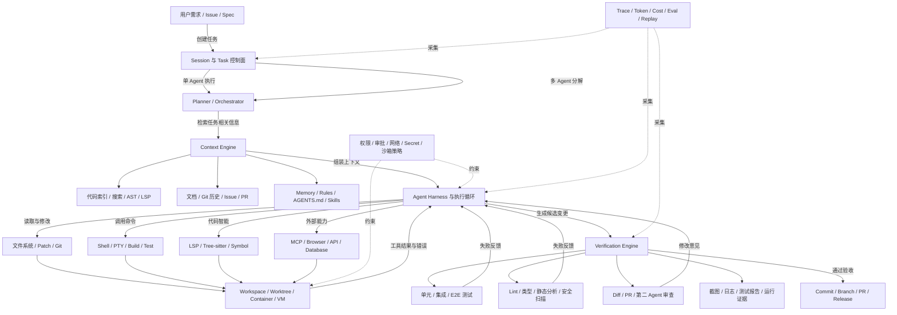
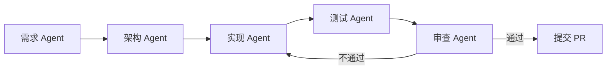
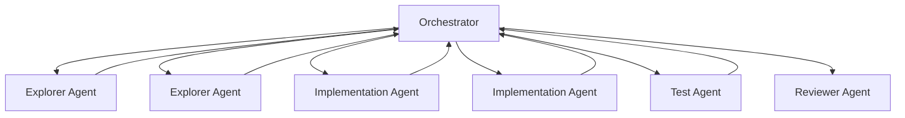

# 附录 M：主流 Coding Agent 系统全景

> 定位：**Coding Agent 赛道的全景调研报告**（全文收录，信息基准 2026-08-30，各产品官方入口见 [C-36]）。附录 D 是全品类产品速览与"坐标系定位法"，本附录只深潜 Coding Agent 一个赛道——商业/开源/国内/云端异步/多 Agent 工厂/审查 Agent/应用构建平台七类盘点，加上能力九维度、互操作标准（MCP/ACP/AGENTS.md）、评测体系与选型建议。第六篇（第 23–25 章）讲这一赛道的机制原理，附录 J/K/L 是其中三个系统的源码级解剖，本附录是"市场这一层"的地图。名单与格局会过期，四层分类与九维度框架不过期。

---

## M.1 核心结论

CodingAgent 已经从“代码补全工具”演化为能够在真实工程环境中执行完整闭环的软件工程系统：

> **理解代码库 → 制定计划 → 修改文件 → 执行命令 → 运行测试 → 分析失败 → 自我修复 → 生成提交或 PR → 接受人工审查**

截至 2026 年 8 月，市场大致形成了四个层次：

1. **执行型 Coding Agent**：Claude Code、Codex CLI、OpenCode、Aider 等，负责真正读写代码和运行命令。
2. **AI IDE 与统一交互入口**：Cursor、GitHub Copilot、Antigravity、Kiro、Junie、Qoder 等，把 Agent 融入编辑器。
3. **云端异步 Agent**：Codex Cloud、Copilot Cloud Agent、Devin、Cursor Cloud Agents、Jules 等，在隔离环境中长期执行任务。
4. **多 Agent 控制面与软件工厂**：Devin Desktop、Antigravity Agent Manager、GitLab Duo Agent Platform、Augment Cosmos、Factory 等，管理多个本地或云端 Agent。

因此，今天讨论 CodingAgent，不能只比较底层模型。更准确的表达是：

> **CodingAgent = 模型 + Agent Harness + 上下文引擎 + 工具系统 + 执行环境 + 验证系统 + 记忆与技能 + 安全治理 + 控制面**

Claude Code、Codex、Copilot、Cursor 等正在补齐本地执行闭环；Antigravity、Devin Desktop、VS Code 和 GitLab Duo 则明显向多 Agent 控制台发展。

参考：[Claude Code Overview](https://docs.anthropic.com/en/docs/claude-code/overview)

---

## M.2 先区分几类容易混淆的产品

| 类型 | 主要能力 | 人与 Agent 的关系 | 典型系统 |
|---|---|---|---|
| AI 代码补全 | 根据当前文件和光标预测代码 | 人主导，AI 被动建议 | 传统 Copilot Completion、Tabnine |
| AI 编程助手 | 问答、解释、生成局部代码 | 人拆解任务，AI 回答 | IDE Chat、代码问答助手 |
| 交互式 Coding Agent | 自主搜索、编辑、运行、测试和修复 | 人给目标，Agent 执行，人持续监督 | Claude Code、Codex CLI、Cursor Agent |
| 云端异步 Agent | 在远程容器或 VM 中执行较长任务 | 人提交任务，稍后审查结果 | Devin、Codex Cloud、Copilot Cloud Agent、Jules |
| 多 Agent 控制面 | 管理多个 Agent、任务、工作区和审查产物 | 人管理工作队列和验收标准 | Devin Desktop、Antigravity、GitLab Duo |
| 软件工程 Agent 平台 | 覆盖需求、开发、测试、审查、安全、发布 | 人控制整个 AI 软件交付流程 | Factory、Augment Cosmos、GitLab Duo Agent Platform |
| AI 应用构建平台 | 从自然语言生成并部署完整应用 | 用户描述产品，平台管理代码和基础设施 | Replit Agent、Lovable、Bolt、v0 |
| 专项审查 Agent | 分析 PR、发现缺陷、提出修复建议 | 开发 Agent 生产，审查 Agent 验证 | CodeRabbit、Qodo、Greptile |

一个模型订阅也不等于 CodingAgent。例如 GLM Coding Plan、各类模型 API 和推理服务提供的是“模型访问能力”；只有和 Claude Code、OpenCode、Cline、Qwen Code 等 Harness 结合后，才形成完整 CodingAgent 系统。

参考：[GLM Coding Plan](https://docs.bigmodel.cn/cn/coding-plan/overview)

---

## M.3 CodingAgent 的标准系统架构



这套架构中，模型通常只是推理核心。真正决定系统可用性的，往往是下面几个部分：

- 上下文能否准确定位代码，而不是把整个仓库塞进上下文窗口。
- 工具调用是否稳定，文件修改是否可以原子提交和回滚。
- 命令、进程、PTY、浏览器是否有超时、取消和崩溃恢复。
- Agent 是否会真正运行测试，而不是仅声称“已经修复”。
- 云端任务能否安全隔离代码、凭证、网络和依赖。
- 多 Agent 是否具有真实隔离，而不是几个角色共享同一个目录互相覆盖。
- 计划、命令、Diff、测试和截图能否形成可审查证据。

研究也表明，即使底层模型相同，不同 Agent Scaffold 或 Harness 的任务表现也可能明显不同，因此只按模型能力判断 CodingAgent 并不准确。

参考：[Agent Scaffold 相关研究](https://openreview.net/pdf?id=nw4d83V687)

---

## M.4 主流商业 CodingAgent

### M.4.1 第一梯队通用系统

| 系统 | 主要形态 | 执行位置 | 系统定位与突出能力 |
|---|---|---|---|
| **Claude Code** | CLI、IDE 集成、Agent SDK | 本地、Headless、CI/云环境集成 | 强调可编程 Agent Harness；支持 CLAUDE.md、自动记忆、Skills、Hooks、MCP、自定义 Subagent、后台任务、LSP 和权限模式，适合深度代码库操作及自动化工作流。 |
| **OpenAI Codex** | CLI、IDE、桌面/ChatGPT、云端任务 | 本地沙箱、云端隔离容器 | 同时覆盖本地交互和云端委派；支持工作树、并行任务、PR、重构、代码审查和自动化，安全模型明确区分沙箱权限与用户审批。 |
| **GitHub Copilot** | VS Code、JetBrains、CLI、GitHub、Agent App | 本地、GitHub Actions 云环境 | 最大优势是与 Issue、Branch、Commit、PR、Actions、CodeQL、Secret Scanning 形成原生闭环；GitHub 还允许第三方 Coding Agent 接入。 |
| **Cursor** | AI IDE、CLI、Cloud Agents | 本地、隔离云端 VM | 编辑器体验成熟，支持多模型、项目 Rules、AGENTS.md、Skills、Subagents 和 Cloud Automations；适合个人开发与事件驱动的后台任务。 |
| **Google Antigravity** | Agent Manager、IDE、CLI、SDK | 本地工作区、隔离 Worktree、企业环境 | 将编辑器、终端和浏览器操作统一在一个 Agent Harness 中；突出并行 Agent、工作区隔离、Artifact Review、浏览器验证和统一 Agent Manager。 |
| **Devin / Devin Desktop** | 云端 Agent、桌面控制台、CLI、本地 Agent | 云端 VM、本地环境 | Devin 偏长时间异步执行；Devin Desktop 更接近 Agent Command Center，可同时管理本地与云端 Agent，并通过 ACP 接入不同 Agent。 |
| **Factory Droid** | CLI、Web、Headless、Missions | 本地、云端、CI/CD | 面向软件交付自动化，支持审批、MCP、Skills、AGENTS.md、自定义 Subagents 和只读优先的 Headless 执行，适合企业级 SDLC 流程。 |
| **Kiro** | IDE、CLI、Web、移动端、Kiro Crew | 本地与云端混合 | 以 Spec-Driven Development 为核心，将 Requirements、Design、Tasks 和验证约束变成 Agent 执行依据，并在不同产品表面复用统一 Harness。 |
| **Amazon Q Developer** | IDE、CLI、GitHub、GitLab、AWS 控制台 | 本地与 AWS 云环境 | 强项是 AWS 资源理解、企业身份体系、代码转换、安全扫描及云开发工作流，适合 AWS 技术栈较重的企业。 |

参考资料：

- [Claude Code](https://docs.anthropic.com/en/docs/claude-code/overview)
- [OpenAI Codex](https://openai.com/codex/)
- [GitHub Copilot Cloud Agent](https://docs.github.com/copilot/concepts/agents/cloud-agent/about-cloud-agent)
- [Cursor Agent](https://cursor.com/docs/agent/overview)
- [Google Antigravity](https://cloud.google.com/blog/topics/developers-practitioners/agent-factory-recap-100x-engineering-with-ai-agents-in-google-antigravity-20)
- [Devin](https://docs.devin.ai/get-started/devin-intro)
- [Factory](https://docs.factory.ai/)
- [Kiro](https://kiro.dev/)
- [Amazon Q Developer](https://aws.amazon.com/blogs/devops/amazon-q-developer-agentic-coding-experience/)

### M.4.2 正在向 Agent 控制面发展的系统

| 系统 | 当前定位 |
|---|---|
| **Amp** | 从终端 Coding Agent 扩展为可从 Web、CLI、移动端控制的开发环境；通过 Orbs 运行远程 Agent，并支持自定义 Agent、Agent 生成 Agent、跨项目消息和文件交换。 |
| **JetBrains Junie** | 深度利用 JetBrains 项目模型、代码语义和调试器，可在 IDE 与 CLI 中执行多步骤开发任务；同时支持 JetBrains 模型服务和多种 BYOK Provider。 |
| **Augment Cosmos** | 定位已超出单个 Coding Agent，尝试通过 Work Dispatcher、PR Author、Reviewer、Verifier 等专职 Agent 覆盖任务分发、实现、审查和验证。 |
| **GitLab Duo Agent Platform** | 直接把 Agent 编排嵌入 GitLab 软件生命周期，覆盖规划、开发、审查、安全和发布；支持多个 Agent 并行，也提供自托管或私有云模型路径。 |

参考资料：

- [Amp](https://ampcode.com/)
- [JetBrains Junie](https://www.jetbrains.com/help/ai-assistant/junie-agent.html)
- [Augment Code](https://www.augmentcode.com/)
- [GitLab Duo Agent Platform](https://docs.gitlab.com/releases/18/gitlab-18-8-released/)

---

## M.5 主流开源 CodingAgent 与 Agent Harness

开源系统大致分成两派：

- **开箱即用型 Coding Agent**：直接用于日常开发。
- **Harness / Framework 型系统**：用于研究、二次开发、构建企业 Agent 或搭建控制面。

| 系统 | 类型 | 核心特点 |
|---|---|---|
| **OpenCode** | 开源终端与桌面 Agent | 支持 TUI、桌面、IDE、多会话、LSP，以及只读 Plan Agent 和可修改代码的 Build Agent；模型 Provider 相对开放。 |
| **Cline** | IDE、CLI、SDK | Apache 2.0，强调透明工具调用、Plan/Act、检查点、MCP、Rules 和 Skills；适合需要自己选择模型及控制执行过程的团队。 |
| **Roo Code** | VS Code Agent | 基于开放源码，强调自定义 Modes、角色和工具权限，可以组织类似“架构师—实现者—审查者”的工作模式。 |
| **Aider** | 轻量 CLI Agent | Git 原生、Repository Map、自动提交，结构简单，适合偏终端、希望保持人工控制的开发者。 |
| **Qwen Code** | CLI、桌面、IDE、SDK、Bot | 支持 Memory、Skills、Subagents、Agent Teams、MCP、多种协议和模型 Provider，是较完整的国产开源 CodingAgent 栈。 |
| **OpenHands** | 开源平台与控制台 | 从单 Agent 逐步发展为可自托管的 Agent Canvas，强调常驻 Agent、任务自动化及团队控制台，适合企业二次开发。 |
| **SWE-agent** | 研究型 Agent Harness | 围绕 GitHub Issue 修复设计，强调 Agent-Computer Interface、工具设计和可复现实验，常用于模型及 Harness 研究。 |
| **Goose** | 本地通用 Agent | 同时提供桌面、CLI 和 API，除编码外还面向本地通用任务，适合构建个人自动化工作流。 |
| **Pi Coding Agent** | 极简 Agent Harness | 核心保持精简，通过 TypeScript Extensions、Skills、Prompt Templates、Themes 和 Pi Packages 扩展；默认刻意不内置复杂 Subagent 和 Plan Mode。 |
| **DeepSeek Harness** | 新兴插件化 Harness | 采用“Everything is a Plugin”架构，模型适配器、工具注册表、Session Log、Agent Loop 都可以替换；通过 Profile、Bundle、Cordis Context 组织运行时，并提供 ACP 等运行模板。 |

参考资料：

- [OpenCode](https://github.com/anomalyco/opencode)
- [Cline](https://github.com/cline/cline)
- [Roo Code](https://github.com/RooCodeInc/Roo-Code)
- [Aider](https://github.com/aider-ai/aider)
- [Qwen Code](https://github.com/qwenLM/qwen-code)
- [OpenHands](https://github.com/OpenHands/openhands)
- [SWE-agent](https://github.com/swe-agent/swe-agent)
- [Goose](https://github.com/aaif-goose/goose)
- [Pi](https://pi.dev/)
- [DeepSeek Harness](https://github.com/deepseek-ai/deepseek-harness)

### OpenCode、Cline、OpenHands、SWE-agent 的区别

- **OpenCode** 更像可直接替代 Claude Code 的日常终端 Agent。
- **Cline / Roo Code** 更偏 IDE 内开放式 Agent，工具调用过程透明。
- **OpenHands** 更接近可以自托管和扩展的 Agent 平台。
- **SWE-agent** 更偏研究基线、Benchmark 和 ACI 设计。
- **Pi** 追求极简核心与扩展自由。
- **DeepSeek Harness** 追求所有运行时组件插件化，适合作为二次开发底座。

---

## M.6 国内主流 CodingAgent 系统

| 系统 | 主要形态 | 定位与特点 |
|---|---|---|
| **TRAE / TraeCode** | AI IDE、插件、CLI、开源 Agent Toolkit | 面向完整开发任务，覆盖项目理解、代码修改和命令执行；同时提供较轻量的 Trae Agent 开源工具包。 |
| **Qoder / Qoder CN** | IDE、JetBrains、CLI、移动端、Cloud Agent、SDK | 海外与国内产品线覆盖较完整；国内 Qoder CN 由通义灵码升级而来，正在向本地、云端和多入口 Agent 平台发展。 |
| **腾讯 CodeBuddy** | AI IDE、插件、Agent SDK | 提供代码库理解、Agent 模式、Subagent 和 SDK，强调企业开发工作流及腾讯云生态整合。 |
| **百度 Comate** | IDE 插件、企业研发平台 | 支持规划、编码、测试、调试、审查及多 Agent 调度，并提供 Rules、Memory、MCP、自定义 Agent 等能力。 |
| **华为云 CodeArts / 码道** | AI IDE、插件、CLI、企业平台 | 强调代码库索引、Spec 驱动、企业研发治理以及华为云 CodeArts 工具链整合，适合国产化和企业研发场景。 |
| **Qwen Code** | 开源 CLI、IDE、桌面、SDK | 开源程度及模型适配能力较强，可作为国产 Agent Harness 或企业二次开发底座。 |

参考资料：

- [TRAE](https://www.trae.cn/)
- [Qoder](https://qoder.com/zh)
- [CodeBuddy](https://www.codebuddy.ai/docs/cli/sdk)
- [Comate](https://comate.baidu.com/zh/)
- [CodeArts](https://codearts.huaweicloud.com/)
- [Qwen Code](https://github.com/qwenLM/qwen-code)

国内系统与海外系统的能力方向已经基本一致，主要差异逐渐转向：

- 国内模型及云服务适配。
- 私有化部署与数据合规。
- 中文需求和中文代码库理解。
- 企业知识库和内部研发平台集成。
- 本地网络、制品库、代码托管及权限体系适配。
- 对信创环境、国产操作系统和国产数据库的支持。

---

## M.7 云端异步 CodingAgent

云端 Agent 不是“把 CLI 放进服务器”这么简单，而是需要完整的远程执行基础设施：

- 仓库克隆和身份授权。
- Container 或 VM 生命周期。
- 依赖安装与缓存。
- Secret 注入。
- 网络访问策略。
- Branch、Commit 和 PR 管理。
- 运行日志、截图和测试证据。
- 暂停、恢复、取消、超时和失败重试。
- 多任务隔离及资源配额。

主要系统包括：

| 系统 | 云端执行方式 | 典型任务 |
|---|---|---|
| **Codex Cloud** | 隔离云端环境，任务设置阶段与实际 Agent 阶段采用不同网络权限 | Issue 修复、重构、并行实现、PR 和审查。 |
| **GitHub Copilot Cloud Agent** | GitHub Actions 环境，原生操作仓库、Branch 和 PR | 从 Issue 研究、计划、修改代码到创建 PR。 |
| **Cursor Cloud Agents** | 每个 Agent 使用隔离 VM，克隆代码并加载配置、依赖和 Secret | 后台实现、自动化任务、事件触发任务。 |
| **Devin** | 完整云端开发 VM | 可持续数分钟或数小时的功能、缺陷和维护任务。 |
| **Google Jules** | 与 GitHub 集成的异步云端 Agent | 后台代码修改、Issue 处理和 PR 工作流。 |
| **Amp Orbs** | 可远程启动和控制的 Agent 运行环境 | 跨设备控制、并行任务和跨项目 Agent 协作。 |
| **Factory Droid** | 云端及 Headless CI/CD 运行时 | 自动化 SDLC、批量维护、持续执行任务。 |

参考资料：

- [Codex Security](https://developers.openai.com/codex/agent-approvals-security)
- [GitHub Copilot Cloud Agent](https://docs.github.com/copilot/concepts/agents/cloud-agent/about-cloud-agent)
- [Cursor Cloud Agents](https://cursor.com/docs/cloud-agent)
- [Devin](https://www.cognition.ai/devin)
- [Google Jules](https://jules.google/docs/)
- [Amp Chronicle](https://ampcode.com/chronicle)
- [Factory Droid Exec](https://docs.factory.ai/droid-exec/overview)

云端 Agent 最适合边界清楚、验收标准明确的工作，例如：

- 依赖升级。
- API 迁移。
- 批量重构。
- 补充测试。
- 文档同步。
- 静态分析问题修复。
- 小型 Issue 实现。
- 已有测试覆盖下的 Bug 修复。

架构模糊、需求频繁变化或需要大量隐性业务知识的任务，仍然需要较多人工交互。

---

## M.8 多 Agent Coding 系统

### M.8.1 常见多 Agent 架构

#### 固定角色流水线



优点是流程容易控制，缺点是角色之间会重复读取代码和消耗上下文。

#### Orchestrator–Worker



适合动态拆解任务。Orchestrator 根据依赖关系、资源和运行结果决定是否继续分派。

#### 独立实现加仲裁

两个或多个 Agent 独立分析或实现同一问题，最后由 Reviewer 或 Judge 选择方案。它能够减少单一 Agent 的系统性偏差，但成本较高。

#### 并行工作树

每个 Agent 使用独立 Git Worktree 或 VM：

```text
main
 ├── worktree-agent-architecture
 ├── worktree-agent-backend
 ├── worktree-agent-frontend
 ├── worktree-agent-tests
 └── worktree-agent-review
```

这是目前较可靠的并行开发方式。Cursor Cloud Agents、Codex、Antigravity 和 Amp 等系统都在加强工作区或远程运行环境隔离。

参考：[Cursor Cloud Agent](https://cursor.com/docs/cloud-agent)

### M.8.2 真正的多 Agent 系统需要解决什么

多 Agent 并不是简单地同时启动多个 CLI，还必须解决：

- 任务依赖图和分派策略。
- 文件所有权和修改范围。
- Worktree、Branch、端口及数据库隔离。
- Agent 间消息、产物和状态传递。
- 重复劳动和上下文复制。
- 并发修改冲突。
- 子 Agent 失败、失联和超时。
- Token、费用和并发预算。
- 整体取消和级联取消。
- 最终合并、回归测试和统一验收。
- 循环委派、角色互相等待和死锁。
- 恶意或错误子 Agent 的权限传播。

Claude Code、Cursor、Antigravity、Amp、GitLab Duo 和 Qwen Code 都已支持不同程度的 Subagent 或并行 Agent，但产品之间的“多 Agent”含义并不一致：有的只是隔离上下文的子任务，有的是真正并行执行，有的已经包含远程工作区和任务控制面。

参考：[Claude Code Subagents](https://docs.anthropic.com/en/docs/claude-code/sub-agents)

---

## M.9 代码审查与验证 Agent

随着代码生成速度提高，CodingAgent 的竞争重点正在从“能否生成代码”转向“能否证明生成结果可靠”。

主要审查系统包括：

| 系统 | 主要特点 |
|---|---|
| **GitHub Copilot Code Review** | 在 GitHub Actions 中运行 Agentic Review，读取项目上下文，提供问题说明和可应用的修改建议。 |
| **CodeRabbit** | 面向 PR 的上下文审查、逐行建议、风险排序及 Agent Handoff，并在探索更适合大型 Agent PR 的 Change Stack 审查界面。 |
| **Qodo** | 使用多个专职 Agent 分析完整代码库、历史、团队规范和 PR，重点检查设计偏差、Breaking Change 和规范缺口。 |
| **Greptile** | 强调全代码库上下文和深层缺陷分析，并通过隔离执行环境实际运行代码和生成验证产物。 |

参考资料：

- [GitHub Copilot Code Review](https://docs.github.com/copilot/using-github-copilot/code-review/using-copilot-code-review)
- [CodeRabbit](https://www.coderabbit.ai/)
- [Qodo](https://docs.qodo.ai/code-review)
- [Greptile](https://www.greptile.com/agent)

未来更完整的验证链通常会是：

```text
开发 Agent
   ↓
编译 / 类型检查
   ↓
单元测试 / 集成测试 / E2E
   ↓
静态分析 / 安全扫描
   ↓
独立 Review Agent
   ↓
浏览器或真实运行验证
   ↓
人工审查
   ↓
合并
```

单纯让同一个 Agent 在同一个上下文里“自我审查”容易重复原有错误。更可靠的方式是使用独立上下文、不同提示词，甚至不同模型的 Reviewer Agent。

---

## M.10 AI 应用构建类 CodingAgent

这类系统经常被归入 CodingAgent，但它们实际上是面向新项目的垂直软件生产平台。

| 系统 | 主要定位 |
|---|---|
| **Replit Agent** | 从自然语言完成项目创建、编码、检查、修复、基础设施配置、托管和部署。 |
| **Lovable** | 面向 Web 全栈应用，通过 Plan Mode 和 Build Mode 生成可维护的真实代码，并使用子 Agent 处理专门任务。 |
| **Bolt** | 面向网站、Web 应用和移动应用，Agent 负责规划、编码和故障排查。 |
| **v0** | 从 UI 生成逐渐扩展到全栈应用和 Agent 应用，集成 GitHub 与部署工作流。 |

参考资料：

- [Replit Agent](https://docs.replit.com/features/agent/overview)
- [Lovable Agent Mode](https://docs.lovable.dev/features/agent-mode)
- [Bolt Agents](https://support.bolt.new/building/using-bolt/agents)
- [v0](https://v0.dev/docs)

它们适合：

- 从零构建原型或 SaaS。
- 前端页面和管理后台。
- 产品经理、设计师和非专业开发者。
- 快速部署演示应用。

它们通常不如 Claude Code、Codex、Cursor、OpenCode 等适合复杂遗留代码库、大型单体系统和强约束企业工程。

---

## M.11 决定 CodingAgent 能力的九个核心维度

### M.11.1 Context Engine

核心不是“能读取多少 Token”，而是能否找对信息。

主流手段包括：

- 文件名和目录搜索。
- Grep、Ripgrep、Repository Map。
- AST、Tree-sitter、符号和引用分析。
- LSP Definition、Reference、Diagnostics。
- 向量检索和语义索引。
- Git 历史、Issue、PR 和代码所有权。
- 按需加载与上下文压缩。
- 子 Agent 探索后返回结构化摘要。

代码库越大，Context Engine 对结果的影响越大。

### M.11.2 Agent Harness

Harness 负责控制模型怎样工作，包括：

- System Prompt。
- Tool Schema。
- Agent Loop。
- Plan / Act 模式。
- Tool Error Recovery。
- Retry 与退避。
- Context Compaction。
- Token Budget。
- Loop Detection。
- Cancellation。
- Checkpoint 和恢复。
- Subagent 调度。

模型决定能力上限，Harness 决定能力能否稳定落地。

### M.11.3 Agent-Computer Interface

工具设计会直接影响执行效果：

- `read_file` 是整文件读取还是分段读取。
- `edit` 使用字符串替换、Diff Patch 还是 AST Edit。
- Shell 是否保留状态。
- 命令输出如何截断。
- 后台进程如何跟踪。
- 测试失败怎样反馈。
- Agent 是否可以访问浏览器和运行中的应用。
- 大型日志如何摘要并保留原始 Artifact。

SWE-agent 等研究系统的一个重要价值，就是把 Agent-Computer Interface 本身作为研究对象。

参考：[SWE-agent Background](https://github.com/princeton-nlp/SWE-agent/blob/main/docs/background/index.md)

### M.11.4 Execution Environment

主要有四种方式：

| 模式 | 优点 | 风险 |
|---|---|---|
| 直接操作宿主机 | 快、环境真实 | 误删文件、Secret 泄露、命令风险 |
| Git Worktree | 隔离代码修改，成本低 | 仍共享宿主机进程和网络 |
| Container | 文件和进程隔离较好 | 环境重建和缓存复杂 |
| VM / Remote Sandbox | 隔离最强，适合云端 Agent | 成本高，启动和环境同步较慢 |

成熟系统通常还会把网络访问、Secret、文件范围和审批策略分开管理，而不是只有一个“允许全部操作”的开关。Codex 的沙箱和审批分层、Cursor Cloud Agents 的隔离 VM，以及 Antigravity 的隔离工作树都体现了这一方向。

参考：[Codex Sandboxing](https://developers.openai.com/codex/sandboxing)

### M.11.5 Verification

可靠 CodingAgent 至少需要支持：

- 编译和类型检查。
- 单元测试。
- 集成和端到端测试。
- Lint 和格式检查。
- 静态分析和安全扫描。
- 应用启动与健康检查。
- 浏览器操作和截图。
- 独立 Review Agent。
- 验收标准与 Spec 对账。

没有 Verification 的 Agent，本质上只是概率性代码生成器。

### M.11.6 Memory、Rules 与 Skills

这三类能力不要混为一谈：

- **Rules / Instructions**：项目规范和约束，例如 AGENTS.md、CLAUDE.md。
- **Memory**：从历史会话和用户行为中持续沉淀的事实、偏好和经验。
- **Skills**：可以复用的步骤、脚本、工具及领域知识包。

Claude Code、Cursor、Codex、Kiro、Qwen Code 和 VS Code 都在逐步采用项目规则、Skills 或持久化记忆。

参考：[Claude Code Memory](https://docs.anthropic.com/en/docs/claude-code/memory)

### M.11.7 多 Agent 编排

核心指标不是 Agent 数量，而是：

- 是否真正并发。
- 是否隔离上下文。
- 是否隔离工作区。
- 是否支持动态任务分解。
- 是否支持父子取消。
- 是否限制委派深度。
- 是否可以中途调整任务。
- 是否支持依赖图和结果仲裁。
- 是否能够跨项目协作。
- 是否有统一预算和最终验收。

### M.11.8 安全与治理

企业落地时通常比模型能力更重要：

- 文件系统访问范围。
- 命令白名单与审批。
- 网络域名和出口控制。
- Secret 按任务注入。
- MCP Server 信任与签名。
- Prompt Injection 防护。
- Git 分支保护。
- 身份、组织和租户隔离。
- 操作审计。
- 数据保留与模型训练策略。
- Agent 生成代码的责任归属和追踪。

### M.11.9 可观测性与评估

至少应记录：

- Session、Run、Turn、Tool Call。
- Prompt 和模型版本。
- Context 来源。
- Tool 输入、输出和异常。
- Token、费用和延迟。
- 文件修改和命令执行。
- 测试、审查和验收结果。
- Retry、Compaction 和模型切换。
- 人工介入次数。
- 最终 Commit、PR 和线上结果。

---

## M.12 CodingAgent 互操作标准

### M.12.1 MCP

**Model Context Protocol** 解决：

> Agent 如何连接外部工具、数据和服务。

典型对象包括：

- Tools。
- Resources。
- Prompts。
- 数据库。
- 浏览器。
- GitHub、GitLab、Jira、Slack。
- 企业知识库。
- 内部 API。

MCP 已成为多个 CodingAgent 共同采用的工具扩展协议。

参考：[Model Context Protocol](https://modelcontextprotocol.io/docs/2026-07-28/getting-started/intro)

### M.12.2 ACP

**Agent Client Protocol** 解决：

> 编辑器、桌面控制台或其他客户端如何连接 CodingAgent。

可以理解为：

> **LSP 是 Editor ↔ Language Server；ACP 是 Editor ↔ Coding Agent。**

ACP 允许同一个 Agent 被 Zed、JetBrains、桌面控制台或其他客户端调用，也允许一个控制面接入多个 Agent。

参考：[Agent Client Protocol](https://agentclientprotocol.com/get-started/introduction)

### M.12.3 AGENTS.md

AGENTS.md 是放在仓库里的 Agent 指令文件，类似“给 Agent 阅读的 README”，用于描述：

- 构建和测试命令。
- 代码规范。
- 架构边界。
- 禁止修改的目录。
- 提交流程。
- 特定模块注意事项。

该格式已被越来越多 CodingAgent 识别。

参考：[AGENTS.md](https://agents.md/)

### M.12.4 Agent Skills

Agent Skills 通常以包含 `SKILL.md`、脚本、参考资料和资源文件的目录形式存在，解决：

> 如何把一个可重复执行的工程流程封装为跨会话、跨项目甚至跨 Agent 的能力包。

适合封装：

- 发布流程。
- 数据库迁移。
- 安全审查。
- UI 测试。
- 故障排查。
- 特定框架升级。
- 企业内部研发规范。

参考：[Agent Skills Specification](https://agentskills.io/specification)

### M.12.5 五者之间的关系

| 标准或机制 | 连接对象 | 解决的问题 |
|---|---|---|
| **LSP** | 编辑器 ↔ 语言服务器 | 代码符号、引用、诊断和补全 |
| **MCP** | Agent ↔ 工具与数据 | 外部能力接入 |
| **ACP** | 客户端 ↔ CodingAgent | Agent 运行时接入与控制 |
| **AGENTS.md** | 仓库 ↔ Agent | 项目长期指令 |
| **Agent Skills** | Agent ↔ 可复用能力包 | 程序化流程和领域知识复用 |

这几种机制不是相互替代关系，而是分别处于不同层次。

---

## M.13 CodingAgent 评测体系

### M.13.1 主流 Benchmark

| Benchmark | 主要评测内容 | 局限 |
|---|---|---|
| **SWE-bench Verified** | 根据真实 GitHub Issue 修改仓库并通过测试 | 多数任务仍偏局部缺陷修复 |
| **SWE-bench Pro** | 更复杂、更接近企业仓库的真实任务 | 环境构建和长上下文要求更高 |
| **Terminal-Bench** | 在真实终端环境中完成操作任务 | 不完全等同于软件架构和产品开发 |
| **SWE-Lancer** | 真实自由职业软件工程任务 | 任务类型与普通企业研发仍有差异 |
| **SWE-EVO** | 跨多个文件的长周期代码库演进 | 当前 Agent 整体完成率明显更低 |
| **SWE-Explore** | 代码库探索和定位能力 | 只覆盖开发闭环的一部分 |
| **SWE Atlas** | 代码问答、测试编写、重构等多类任务 | 不等同于端到端交付 |

参考：[SWE-bench](https://github.com/swe-bench/SWE-bench)

### M.13.2 为什么不能只看 SWE-bench 排名

排行榜无法完整反映：

- 是否使用额外检索和隐藏知识。
- Agent Harness 是否针对 Benchmark 特化。
- 使用了多少次采样和重试。
- Token 和推理成本。
- 任务耗时。
- 是否需要人工引导。
- 是否破坏未覆盖的功能。
- 是否符合企业架构、安全和代码规范。
- 云端环境是否真实可复现。
- 生成的代码是否容易审查和维护。

### M.13.3 企业内部更值得关注的指标

建议使用自己的历史 Issue、PR 和回归缺陷构建内部评测集，并关注：

1. **任务一次完成率**：无需人工修改即可通过全部验收。
2. **CI 首次通过率**：Agent 第一次提交是否通过 CI。
3. **有效变更率**：修改中与任务真正相关的比例。
4. **回归缺陷率**：合并后产生的新问题。
5. **人工介入次数**：补充信息、重启、纠错和手动修复次数。
6. **审查接受率**：Reviewer 是否接受 Agent 的修改。
7. **平均交付成本**：模型、计算、环境和人工成本。
8. **任务交付时间**：包括排队、执行、审查和返工。
9. **安全违规率**：越权操作、Secret 泄露和危险命令。
10. **可恢复率**：进程崩溃、网络中断后能否继续执行。

---

## M.14 2026 年 CodingAgent 的关键趋势

### M.14.1 IDE 正在变成 Agent 控制台

未来 IDE 的核心不只是代码编辑，而是管理：

- 多个 Agent Session。
- 本地和云端任务。
- 多个 Worktree。
- 计划和执行状态。
- Diff、测试、截图和报告。
- Agent 之间的消息和任务依赖。

VS Code 的多 Agent Session、Antigravity Agent Manager 和 Devin Desktop 都体现了这种变化。

参考：[VS Code Multi-Agent Development](https://code.visualstudio.com/blogs/2026/02/05/multi-agent-development)

### M.14.2 本地与云端形成混合架构

本地 Agent 适合高频交互、快速修改和使用现有开发环境；云端 Agent 适合长任务、并行任务、自动化和后台队列。

成熟产品正在同时提供两种运行方式，而不是只选择其中一种。

### M.14.3 Worktree、Container 和 VM 成为基础设施

多 Agent 没有环境隔离就很容易出现：

- 文件互相覆盖。
- Git 状态冲突。
- 端口冲突。
- 数据库污染。
- 测试结果不可信。
- 任务取消后残留进程。

因此，环境管理将逐渐独立为 CodingAgent Platform 的核心子系统。

### M.14.4 Agent 与模型进一步解耦

Junie BYOK、OpenCode、Cline、Qwen Code、Pi 和 DeepSeek Harness 都在加强多 Provider 或插件化能力。未来团队会分别选择：

- 最适合复杂推理的模型。
- 最适合代码生成的模型。
- 最便宜的探索模型。
- 最适合审查的第二模型。
- 私有化或本地模型。

参考：[Junie Model Selection](https://junie.jetbrains.com/docs/junie-cli-model-selection.html)

### M.14.5 Verification 将成为主要壁垒

单纯生成代码越来越容易，真正困难的是：

- 证明功能正确。
- 证明没有回归。
- 证明符合架构约束。
- 证明没有安全风险。
- 让大型 Diff 可以被人快速理解。
- 将验证证据长期保存和审计。

因此，测试 Agent、Reviewer Agent、浏览器验证和 Artifact Review 会越来越重要。

### M.14.6 从 Prompt-Driven 转向 Spec-Driven

一句自然语言通常不足以约束大型任务。越来越多系统开始引入：

- Requirements。
- Design。
- Tasks。
- Acceptance Criteria。
- Non-Goals。
- Architecture Decision。
- Verification Plan。

Kiro 是这一方向较明确的产品之一；Junie、Augment、Qoder 和企业自建系统也开始采用类似方法。

参考：[Kiro IDE](https://kiro.dev/ide/)

### M.14.7 从固定角色转向动态 Agent 图

早期多 Agent 常预设 Architect、Coder、Tester、Reviewer。未来更可能由 Orchestrator 根据任务动态创建：

- Explorer。
- Domain Expert。
- Migration Worker。
- UI Worker。
- Test Worker。
- Reviewer。
- Security Auditor。

Agent 生命周期会随任务动态创建和回收，而不是长期固定。

### M.14.8 软件开发正在出现“生产 Agent + 验证 Agent”双层结构

未来企业不会只采购一个 CodingAgent，而会形成：

```text
需求与规划层
    ↓
一个或多个生产 CodingAgent
    ↓
测试、审查、安全和合规 Agent
    ↓
人工审批
    ↓
CI/CD 与生产环境
```

生产 Agent 和验证 Agent 应保持模型、上下文和权限上的适当独立。

---

## M.15 按使用场景选择系统

| 使用场景 | 优先考虑 |
|---|---|
| 资深开发者、本地深度代码库修改 | Claude Code、Codex CLI、OpenCode、Junie、Aider |
| 希望以 IDE 为主要入口 | Cursor、GitHub Copilot、Antigravity、Kiro、Junie、Qoder |
| GitHub 原生 Issue 到 PR | GitHub Copilot Cloud Agent、Codex、Jules |
| 长时间异步任务和团队工作队列 | Devin、Codex Cloud、Cursor Cloud Agents、Factory |
| 多 Agent 控制与并行工作区 | Antigravity、Devin Desktop、Amp、GitLab Duo、Augment Cosmos、OpenHands |
| Spec-Driven Development | Kiro、Qoder、CodeArts，以及基于 OpenSpec、Spec Kit 的自建流程 |
| 开源、自托管和多模型 | OpenCode、Cline、Roo Code、Aider、Qwen Code、OpenHands、Pi、DeepSeek Harness |
| AWS 企业技术栈 | Amazon Q Developer、Kiro |
| GitLab 与私有化模型 | GitLab Duo Agent Platform |
| 国产模型和国内企业生态 | Qoder CN、TRAE、CodeBuddy、Comate、CodeArts、Qwen Code |
| PR 质量门禁 | CodeRabbit、Qodo、Greptile、GitHub Copilot Code Review |
| 从零生成并部署 Web 应用 | Replit Agent、Lovable、Bolt、v0 |

### 几个主流系统最简定位

- **Claude Code**：可编程性和本地深度执行较强。
- **Codex**：本地 Agent、云端任务、并行执行和工作树结合较完整。
- **GitHub Copilot**：GitHub 与 IDE 工作流整合最自然。
- **Cursor**：AI IDE 产品体验和日常开发交互成熟。
- **Antigravity**：正在形成编辑器、终端、浏览器和多 Agent Manager 的统一平台。
- **Devin**：适合异步委派和团队任务队列。
- **Kiro**：突出 Spec-Driven Development。
- **OpenCode / Cline / Qwen Code**：适合开放模型、可控执行和二次开发。
- **OpenHands / DeepSeek Harness / Pi**：更适合作为平台或 Harness 底座研究。

---

## M.16 统一多 CodingAgent 平台的通用架构参考

当组织需要同时使用 Claude Code、Codex、OpenCode、Cline、Qwen Code 等多个 CodingAgent 时，平台价值不应建立在重新实现一个绑定单一模型的 Agent 上，而应建立在：

> **统一接入、统一编排、统一治理、统一观察和统一审查多个 CodingAgent。**

建议形成以下十个核心子系统。

### M.16.1 Agent Adapter Layer

为不同 CodingAgent 建立统一 Adapter，屏蔽：

- CLI 参数差异。
- 输入和流式协议差异。
- Session 恢复方式。
- 权限和审批方式。
- MCP、Skill、Hook 支持差异。
- 模型配置差异。
- Subagent 能力差异。
- Token 和费用返回差异。

不要只统一成一条字符串命令，而应提供 Capability Negotiation：

```text
supports_streaming
supports_resume
supports_plan_mode
supports_headless
supports_subagents
supports_mcp
supports_skills
supports_hooks
supports_images
supports_browser
supports_worktree
supports_cloud_execution
supports_permission_callback
```

### M.16.2 统一领域模型

至少统一：

```text
Workspace
Project
Session
Task
Run
Turn
Message
ToolCall
Approval
Artifact
Checkpoint
Agent
Subagent
Environment
Evaluation
Usage
```

一个 Task 可以有多次 Run；一次 Run 可以包含多个 Agent；一个 Agent 可以产生多个 Artifact。

### M.16.3 Environment Manager

统一管理：

- 当前工作区。
- 临时副本。
- Git Worktree。
- Container。
- 本地 PTY。
- 远程 VM。
- 端口和进程。
- 环境变量和 Secret。
- 空闲回收。
- 崩溃恢复。
- 任务结束清理。

### M.16.4 Context Service

统一提供：

- 代码搜索。
- LSP 和 Tree-sitter。
- Git 历史。
- 项目文档。
- AGENTS.md、CLAUDE.md 等规则。
- 用户级、项目级和运行时 Memory。
- Skill Registry。
- Context Budget 和 Compaction。
- 来源引用与可追踪性。

### M.16.5 Policy Engine

策略对象不应和某个 Agent CLI 绑定，而应抽象为：

```text
文件读取范围
文件写入范围
命令策略
网络访问策略
MCP 工具策略
Secret 策略
审批策略
最大执行时间
最大 Token
最大费用
最大子 Agent 数
最大委派深度
```

然后由不同 Adapter 翻译为对应 Agent 的权限模式。

### M.16.6 Orchestration Engine

需要同时支持：

- 单 Agent 长任务。
- 顺序工作流。
- 并行 Agent。
- Orchestrator–Worker。
- Review Loop。
- 条件分支。
- Retry。
- Timeout。
- Budget。
- Cancellation。
- Deadlock 和 Loop Detection。
- 人工审批节点。

### M.16.7 Artifact 与 Review Layer

不要只展示聊天记录，还应把下面内容提升为一等对象：

- Plan。
- Architecture。
- Commands。
- File Changes。
- Diff。
- Test Report。
- Screenshot。
- Browser Recording。
- Security Report。
- Evaluation Result。
- Commit 和 PR。

用户审查 CodingAgent 的主要入口，最终会从“聊天消息”转向“结构化交付产物”。

### M.16.8 Observability

建议统一成：

```text
Task Trace
 └── Agent Run Span
      ├── Model Call Span
      ├── Context Retrieval Span
      ├── Tool Call Span
      ├── Shell Process Span
      ├── Subagent Span
      └── Verification Span
```

同时记录 Token、费用、延迟、重试、错误、Compaction、权限审批和人工介入。

### M.16.9 Evaluation

平台应支持：

- 离线数据集评测。
- 真实轨迹回放。
- 多 Agent 对比。
- 模型与 Harness 分离评测。
- PR 和测试结果评测。
- 安全策略评测。
- UI/E2E 自动化评测。
- 长任务恢复评测。
- 跨平台评测。

### M.16.10 协议层

优先兼容：

- **MCP**：接入工具与外部数据。
- **ACP**：接入不同 CodingAgent。
- **AGENTS.md**：读取项目级 Agent 指令。
- **Agent Skills**：共享可复用能力。
- **OpenTelemetry**：输出标准 Trace、Metric 和 Log。
- **Git / Worktree / PR**：作为代码交付基础协议。

---

## M.17 最终判断

CodingAgent 的竞争正在从第一阶段走向第二阶段。

### 第一阶段：谁生成代码更好

关注模型、Prompt、补全速度和聊天体验。

### 第二阶段：谁能稳定交付软件

关注上下文、工具、执行环境、测试、审查、安全、恢复、可观测和多 Agent 编排。

未来大概率不是某一个 CodingAgent 完全取代其他系统，而是形成三层生态：

```text
上层：IDE / Desktop / Web / Mobile 多 Agent 控制面
                         ↓
中层：Claude Code / Codex / OpenCode / Devin 等 Agent Harness
                         ↓
底层：模型、MCP 工具、代码索引、Sandbox、CI/CD、评估与可观测系统
```

因此，对个人开发者而言，应选择最适合自己交互方式的 Agent；对企业而言，真正长期有效的建设方向则是：

> **把 CodingAgent 当作可替换的执行 Worker，把上下文、权限、环境、任务、评估、审查和可观测能力掌握在统一控制面中。**

---

> **使用提示**：与其他附录的分工——A 讲模型机制、B 讲方法论、C 记来源、D 列产品、E 辨异同、F 索引图版、G 详解 OTel、H 上手 DeepEval、I 评测观测平台选型、J 解析 Pi 源码、K 解析 Claude Code 源码、L 解析 Codex 源码、**M 盘点 Coding Agent 赛道**。与附录 D 的分工：D 管全品类速览与定位法，M 管 Coding Agent 单赛道深潜；重叠产品以各自官方页面为准（[C-36]）。对照阅读：标准系统架构（M.3）对第 12 章六大件、能力九维度（M.11）对第六篇三章、互操作标准（M.12）对第 8/18 章、评测体系（M.13）对第 15/24 章。信息基准 2026-08-30，发行前按附录 C 清单复核。
