# 附录 N：主流 Agent Memory 系统全景

> 定位：**Agent 记忆赛道的全景调研报告**（全文收录，信息基准 2026-08，各系统官方入口见 [C-39]）。与相邻内容的分工：第 10 章讲记忆的机制原理与本书实现（两级架构 × CoALA 四分类、写入/遗忘策略、远程记忆数据库），本附录是整个赛道的地图——定义边界（Memory ≠ Context ≠ RAG ≠ Checkpoint）、认知分类、通用架构与数据模型（MemoryRecord/三时间字段/作用域）、独立系统盘点（Mem0/Zep/Letta/Hindsight/LangMem/Cognee 等十二家）、框架原生与云厂商方案、Coding Agent 文件型记忆、研究演进路线、Benchmark 解读、企业参考架构与选型方法。名单会过期，认知分类与数据模型口径不过期。

---

## N.1 核心结论

Agent Memory 已经从“把聊天记录写入向量数据库”演进为一套完整的状态与知识管理系统。一个成熟的 Memory 系统通常需要同时处理：

- 原始事件留存；
- 事实、偏好和经历提取；
- 冲突检测与版本更新；
- 时间有效性建模；
- 用户、项目、Agent 和会话隔离；
- 关键词、向量、图谱与时间混合检索；
- Token Budget 下的上下文编译；
- 反思、经验沉淀与程序性知识演进；
- 删除、遗忘、审计、权限和合规；
- 记忆质量、任务收益和安全性的持续评测。

当前主流 Agent Memory 大致形成七条技术路线：

| 技术路线 | 代表系统 | 核心定位 |
|---|---|---|
| 通用 Memory API | Mem0、Redis Agent Memory、Memobase | 为已有 Agent 快速增加长期记忆 |
| 时序知识图谱 | Zep、Graphiti | 处理实体关系、事实变化和多跳推理 |
| Memory-Native Agent Runtime | Letta / MemGPT | 让 Agent 主动管理上下文和分层记忆 |
| 反思与经验学习 | Hindsight、LangMem | 从任务成功、失败和历史轨迹中提炼经验 |
| 数据与知识记忆 | Cognee、Supermemory | 将文档、对话和业务数据转为可检索知识结构 |
| 一体化 Agent Runtime | Backboard | 将 Memory、RAG、State 和模型路由统一托管 |
| Memory OS 与前沿研究 | MemOS、MemoryOS、A-MEM | 统一管理文本、激活状态、参数记忆及其生命周期 |

不存在脱离场景的“最佳 Memory 系统”：

- 通用用户偏好和事实记忆：优先考察 **Mem0**；
- 时间变化、实体关系和多跳推理：优先考察 **Zep / Graphiti**；
- 长期运行、自主管理上下文的 Agent：优先考察 **Letta**；
- 失败反思、经验积累和策略演进：优先考察 **Hindsight / LangMem**；
- 企业知识图谱和数据治理：优先考察 **Cognee**；
- 用户画像和个性化服务：优先考察 **Memobase / Supermemory**；
- 云上托管和企业合规：优先考察 **AWS AgentCore Memory、Google Memory Bank、Azure Foundry Memory**；
- 本地优先、多 Agent、可替换供应商的平台：更适合采用 **自有领域模型 + Memory Port + 多 Provider Adapter**。

---

## N.2 Agent Memory 的定义与边界

### N.2.1 Context Window 不等于 Memory

Context Window 是模型单次推理时可见的输入集合，包括：

- System Prompt；
- 当前用户输入；
- 最近若干轮对话；
- 工具调用及其结果；
- 临时计划和状态；
- 从外部系统检索得到的内容。

它具有以下限制：

1. 容量有限；
2. 请求结束后不天然持久化；
3. 历史越长，噪声和成本越高；
4. 模型无法保证自动区分长期事实与临时信息；
5. 上下文压缩可能造成信息丢失和语义漂移。

因此，Memory 的目标不是无限扩张上下文，而是在需要时将正确、可信、适用的信息重新注入有限上下文。

### N.2.2 Session、Checkpoint、RAG 与 Memory 的区别

| 机制 | 主要保存内容 | 是否主动演进 | 主要用途 | 是否属于完整 Agent Memory |
|---|---|---:|---|---:|
| Context Window | 当前 Prompt、最近消息、工具结果 | 否 | 单次推理 | 否 |
| Compaction / Summary | 被压缩的历史上下文 | 少量 | 控制 Token 消耗 | 否 |
| Session | 会话消息和基础状态 | 通常否 | 跨请求连续对话 | 部分 |
| Checkpoint | 工作流节点、执行状态、游标 | 否 | 中断恢复和持久化 | 部分 |
| RAG | 文档、网页、数据库知识 | 通常只读 | 外部知识增强 | 否 |
| Agent Memory | 用户事实、偏好、经历、决策、经验和技能 | 是 | 跨会话个性化与持续学习 | 是 |
| Skill / Prompt | 可复用操作方法与行为规则 | 可演进 | 程序性能力 | 属于程序性记忆 |
| Fine-tuning | 模型参数中的知识和行为 | 离线演进 | 参数化学习 | 属于参数记忆 |

### N.2.3 完整 Memory 系统需要回答的问题

一个完整的 Agent Memory 系统至少需要解决以下问题：

1. **记什么**：哪些消息、动作、结果和反馈值得长期保存；
2. **如何表示**：原文、结构化事实、图关系、摘要、规则还是技能；
3. **如何写入**：同步写入、后台提取还是显式调用；
4. **如何更新**：新增、覆盖、合并、失效还是忽略；
5. **如何检索**：关键词、向量、图、多跳、时间和元数据过滤；
6. **如何使用**：如何在 Token Budget 内构造适合当前任务的上下文；
7. **如何验证**：记忆是否真实、适用、完整且有充分证据；
8. **如何遗忘**：TTL、衰减、归档、删除和隐私清除；
9. **如何隔离**：租户、用户、组织、项目、Agent 和会话作用域；
10. **如何评测**：不仅衡量问答正确率，还要衡量对实际行动的提升。

---

## N.3 Agent Memory 的认知分类

CoALA 等研究通常借鉴认知科学，将 Agent Memory 分为工作记忆、情景记忆、语义记忆和程序性记忆。

### N.3.1 工作记忆（Working Memory）

保存当前任务正在使用的信息：

- 当前目标；
- 当前计划；
- 最近对话；
- 工具调用结果；
- 临时变量；
- 未完成步骤；
- 当前约束和 Token Budget。

工作记忆一般位于 Context Window、Agent State 或 Checkpoint 中，生命周期较短。

### N.3.2 情景记忆（Episodic Memory）

保存 Agent 或用户经历过的具体事件：

- 某次任务如何完成；
- 某次工具调用为何失败；
- 用户在某个时间做了什么决定；
- 某次发布出现了什么问题；
- 某次对话中形成了什么结论。

典型结构：

```yaml
id: episode_01J...
task: 修复数据库迁移失败
context: Windows 环境，SQLite 版本升级
attempts:
  - 使用旧迁移脚本，失败
  - 修正事务边界，成功
outcome: success
lesson: 迁移开始前需要检查 schema_version
observed_at: 2026-08-20T10:00:00Z
source_refs:
  - session_123/message_88
```

### N.3.3 语义记忆（Semantic Memory）

保存相对稳定的事实、概念、偏好和关系：

- 用户偏好使用中文；
- 某项目采用 PostgreSQL；
- 某服务由某团队维护；
- 某客户属于金融行业；
- 某 API 需要 OAuth 认证。

语义记忆往往需要去重、规范化、冲突更新和时间有效性处理。

### N.3.4 程序性记忆（Procedural Memory）

保存“如何做”的知识：

- Prompt 规则；
- 工具调用策略；
- Debug 流程；
- 工作流模板；
- Skill；
- 成功任务的操作步骤；
- 特定场景下的重试、降级和验证策略。

程序性记忆对 Agent 的长期收益通常高于普通聊天摘要，但其风险也更高。错误程序一旦被反复调用，会持续放大失败。

### N.3.5 关系记忆与时间记忆

很多现实事实不是独立文本，而是关系和状态变化：

```text
用户 A --就职于--> 公司 B
服务 X --依赖--> 数据库 Y
项目 P --采用--> 框架 F
```

这些关系还会随时间变化：

```text
2025-01：用户主要使用 PostgreSQL
2026-03：用户改为主要使用 SQLite
```

因此需要显式区分：

- 事实什么时候被系统观察到；
- 事实什么时候开始成立；
- 事实什么时候失效；
- 当前是否仍然有效；
- 历史版本是否需要保留。

---

## N.4 通用系统架构

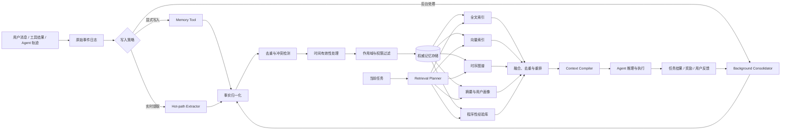

### N.4.1 写入链路

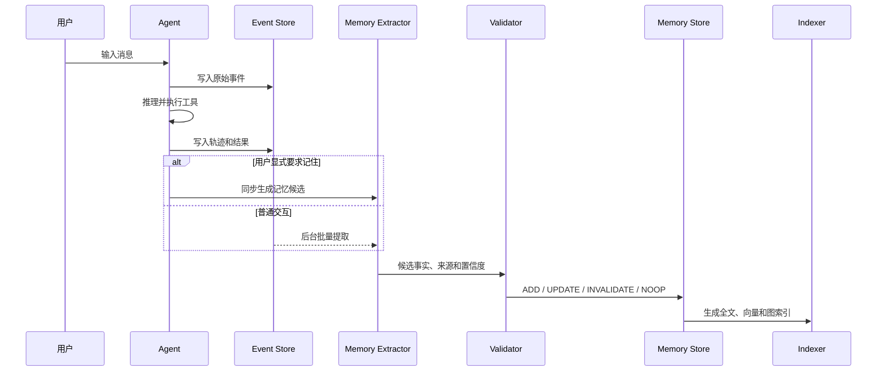

### N.4.2 检索链路

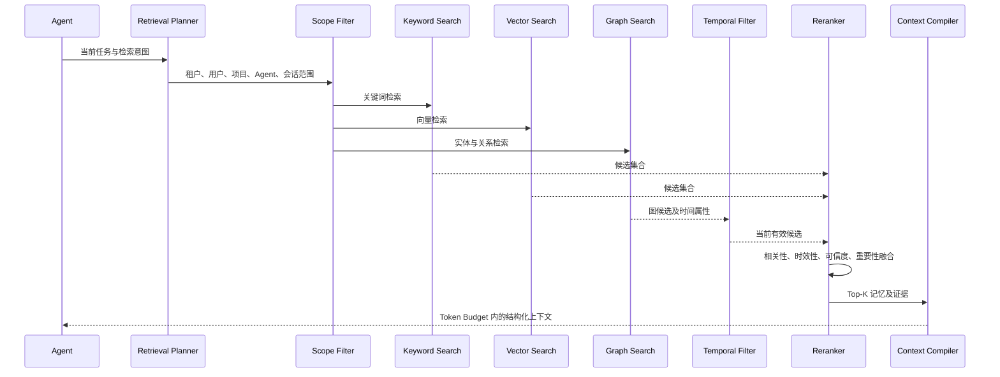

### N.4.3 Memory 生命周期

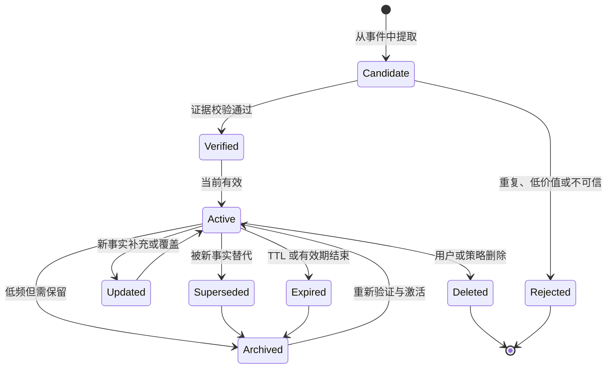

---

## N.5 核心数据模型

### N.5.1 推荐 MemoryRecord

```yaml
MemoryRecord:
  id: string
  tenant_id: string
  organization_id: string | null
  user_id: string | null
  workspace_id: string | null
  project_id: string | null
  agent_id: string | null
  session_id: string | null

  kind: profile | fact | episode | decision | procedure | reflection | artifact
  content: string
  structured_payload: object | null

  source_refs: string[]
  source_type: user_message | tool_result | agent_output | document | system

  observed_at: datetime
  valid_from: datetime | null
  valid_to: datetime | null

  confidence: number
  importance: number
  sensitivity: public | internal | confidential | restricted

  status: candidate | active | superseded | expired | archived | deleted
  ttl_seconds: integer | null

  version: integer
  supersedes_id: string | null
  content_hash: string
  created_at: datetime
  updated_at: datetime
```

### N.5.2 为什么需要三个时间字段

| 字段 | 含义 | 示例 |
|---|---|---|
| `observed_at` | 系统何时看到这条信息 | 2026-08-10 收到用户消息 |
| `valid_from` | 事实何时开始成立 | 用户从 2026-07-01 起就职于新公司 |
| `valid_to` | 事实何时不再成立 | 旧职位在 2026-06-30 结束 |

只有 `created_at` 无法正确表达迟到事件、历史导入、事实回溯和新旧状态替换。

### N.5.3 作用域模型

推荐至少支持以下作用域：

```text
Tenant
└── Organization
    ├── User Private
    ├── Workspace Shared
    │   └── Project Shared
    ├── Agent Private
    └── Session Temporary
```

检索时应先做确定性的 ACL 与 Scope 过滤，再执行全文、向量和图检索：

```text
正确顺序：
租户过滤
  → 用户/组织/项目/Agent 过滤
  → 敏感级别和状态过滤
  → 关键词/向量/图检索
  → 重排

高风险顺序：
全库向量搜索
  → LLM 重排
  → 最后再过滤权限
```

后者可能在搜索、重排、缓存、日志或遥测阶段暴露不应访问的数据。

### N.5.4 记忆更新操作

一个通用 Memory 更新器通常需要支持：

| 操作 | 含义 |
|---|---|
| `ADD` | 新增此前不存在的事实或经历 |
| `UPDATE` | 对同一事实进行补充或修正 |
| `SUPERSEDE` | 新事实替换旧事实，但保留历史版本 |
| `INVALIDATE` | 标记旧事实不再有效 |
| `MERGE` | 合并重复或高度重叠的记忆 |
| `NOOP` | 新内容没有新增价值 |
| `DELETE` | 按用户请求或策略彻底删除 |

---

## N.6 主流独立 Agent Memory 系统

### N.6.1 总览对比

| 系统 | 核心路线 | 主要记忆类型 | 主要检索方式 | 部署形态 | 典型优势 | 主要限制 |
|---|---|---|---|---|---|---|
| Mem0 | 通用 Memory API | 用户事实、偏好、情景记忆 | 向量、关键词、可选图 | OSS + 托管 | API 简单、生态广、接入成本低 | 复杂程序性记忆和运行时状态需额外建设 |
| Zep / Graphiti | 时序知识图谱 | 实体、关系、动态事实 | 图、向量、全文、时间 | OSS + 托管 | 时间变化、多跳和关系推理强 | 图构建和实体消歧复杂 |
| Letta | Memory-Native Runtime | Core、Conversation、Archival | Agent 主动查询与编辑 | OSS + 托管 | 上下文分层清晰，适合长期有状态 Agent | Runtime 较强势，迁移成本较高 |
| Hindsight | 经验反思 | Observation、World Fact、Experience、Mental Model | Semantic、BM25、Graph、Temporal | OSS / 服务 | 反思与经验学习是一等能力 | 反思错误需要严格验证 |
| LangMem | 框架扩展 | 语义、情景、程序性记忆 | Store + 语义检索 | OSS | 与 LangGraph 集成紧密 | 对 LangGraph 生态依赖较强 |
| Cognee | 知识图谱与数据记忆 | 文档、事实、关系、本体 | 图、向量、关系查询 | OSS + 托管 | 适合企业知识工程和多源数据 | 对简单对话记忆偏重 |
| Supermemory | Context Infrastructure | 用户画像、多源内容、语义关系 | 向量、图、Profile | 托管 + 自托管 | Connectors、Memory、RAG 一体化 | 平台语义和业务耦合较高 |
| Backboard | 一体化 Agent Runtime | 长期记忆、线程状态、文档 | 混合检索 | 托管 | Memory、RAG、State、Routing 集成 | 平台绑定较强 |
| Memobase | 用户画像 | Profile、事件、主题 | 向量、主题过滤 | OSS + 服务 | 个性化和用户建模突出 | 程序性和项目型记忆较弱 |
| Redis Agent Memory | 基础设施型 Memory | Session Event、长期事实、摘要 | 向量、关键词、混合检索 | 自托管 / 云 | 实时性好，适合已有 Redis 架构 | 上层提取、冲突和反思策略仍需设计 |
| MemOS | Memory OS | 文本、激活、参数记忆 | 统一调度与生命周期管理 | OSS / 研究 | 记忆类型和生命周期抽象完整 | 前沿能力较多，生产成熟度需单独验证 |

---

### N.6.2 Mem0

### 定位

Mem0 是典型的 Memory-as-a-Service / Memory SDK。它从用户和 Agent 的交互中提取值得长期保存的事实、偏好和经历，并在后续任务中按作用域检索。

### 典型处理流程

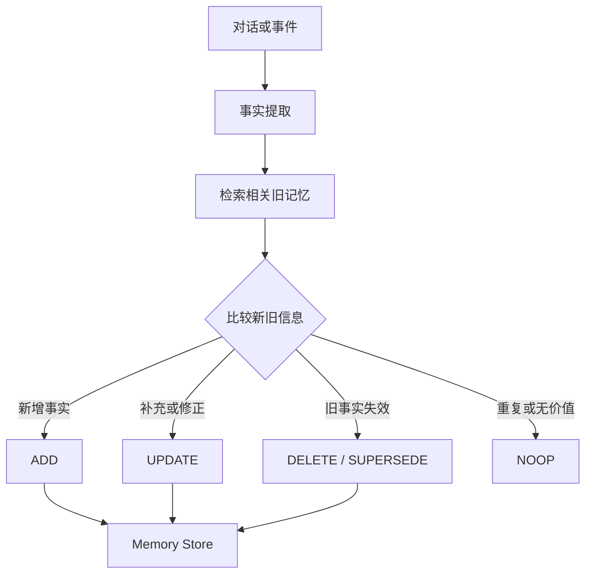

### 主要优势

- 接口简单，容易接入已有 Agent；
- 支持用户级、Agent 级和运行级隔离；
- 适合用户画像、偏好和一般事实记忆；
- 支持开源和托管形态；
- 与 LangChain、CrewAI、AutoGen 等生态有较多集成。

### 主要限制

- 更接近 Memory Layer，不是完整 Agent Runtime；
- 复杂程序性记忆和轨迹学习需要业务层补充；
- 自动事实提取的准确性依赖模型和 Prompt；
- 图记忆并不必然在所有任务上优于普通文本记忆；
- 需要额外设计来源追踪、权限审计和删除传播机制。

### 适用场景

- 客服 Agent；
- 个人助手；
- 教育与陪伴型 Agent；
- 需要快速增加长期个性化能力的现有系统。

---

### N.6.3 Zep / Graphiti

### 定位

Zep / Graphiti 代表时序知识图谱路线。系统不只保存独立文本，而是将对话、文档和业务事件转换为实体、关系和具有有效期的事实。

### 时间事实示例

```text
USES_DATABASE(User, PostgreSQL)
valid_from = 2025-01-01
valid_to   = 2026-02-28

USES_DATABASE(User, SQLite)
valid_from = 2026-03-01
valid_to   = null
```

普通向量数据库可能同时返回两条冲突事实；时序图谱能够判断当前有效状态，同时保留历史演变。

### 主要优势

- 适合事实变化、人物关系和多跳问题；
- 能表达事实的开始时间、结束时间和来源；
- 图遍历更适合组织知识、依赖关系和复杂项目上下文；
- 召回路径相对容易解释。

### 主要限制

- 图构建和实体消歧成本更高；
- 需要处理别名、同名实体、关系冲突和边更新；
- 查询链路比普通向量检索复杂；
- 对简单用户偏好场景可能过度设计。

### 适用场景

- 长期个人助手；
- CRM 与客户关系系统；
- 企业知识助手；
- 复杂项目 Agent；
- 多 Agent 共享知识；
- 动态业务状态和时间推理。

---

### N.6.4 Letta / MemGPT

### 定位

Letta 来源于 MemGPT 的“LLM 操作系统”思想：把上下文窗口视为有限主存，把外部存储视为持久化存储，并让 Agent 主动执行记忆读写和上下文管理。

### 分层模型

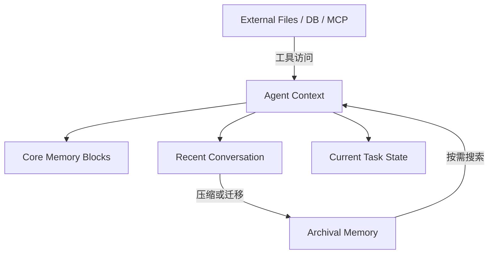

典型层次包括：

1. **Memory Blocks**：身份、用户画像、长期约束等高优先级信息；
2. **Conversation History**：近期消息和交互；
3. **Archival Memory**：按需查询的长期存储；
4. **External Memory**：文件、数据库、MCP 和其他外部系统。

### 主要优势

- Agent 可以主动编辑和查询自己的记忆；
- 上下文分层和 Token Budget 模型清晰；
- 适合跨天、跨周乃至持续运行的 Agent；
- 支持共享 Memory Block 等多 Agent 记忆模式。

### 主要限制

- 不只是一个轻量 SDK，而是较完整的 Runtime；
- 已有平台接入时，架构改造成本较高；
- 如果只需要简单偏好记忆，系统可能偏重；
- Agent 自主修改核心记忆时需要额外治理和验证。

### 适用场景

- 长期自治 Agent；
- 数字员工；
- 研究 Agent；
- 持续运营型 Agent；
- 需要主动上下文管理的长期任务。

---

### N.6.5 Hindsight

### 定位

Hindsight 将记忆处理分成三个核心动作：

```text
retain()  → 保存经历和事实
recall()  → 召回相关信息
reflect() → 基于历史形成高层判断和经验
```

它不仅关注“找到历史事实”，还关注 Agent 如何形成 Mental Model 和可复用经验。

### 记忆类型

- **Observation**：直接从输入或环境中得到的观察；
- **World Fact**：关于外部世界的事实；
- **Experience Fact**：Agent 自己经历过的任务、结果和教训；
- **Mental Model**：对用户、环境、任务和关系的整体理解。

### 检索思路

Hindsight 的检索可以组合：

- Semantic Retrieval；
- BM25 Keyword Retrieval；
- Graph Retrieval；
- Temporal Retrieval；
- 融合与重排。

### 主要优势

- 反思和经验学习是一等能力；
- 同时考虑语义、关键词、图和时间；
- 适合从任务轨迹中提炼经验；
- 可以为不同用户或角色维护独立 Mental Model。

### 主要限制

- 反思结果不是天然事实；
- 错误自我诊断可能污染后续决策；
- 需要保存证据、置信度、适用条件和验证状态；
- 对简单 CRUD 型用户偏好记忆可能偏重。

### 适用场景

- 编码 Agent；
- 研究 Agent；
- 游戏 Agent；
- 运维诊断 Agent；
- 需要从成功和失败中持续改进的任务系统。

---

### N.6.6 LangMem

### 定位

LangMem 是 LangGraph 生态中的长期记忆工具集，重点覆盖语义记忆、情景记忆和程序性记忆。

### 主要能力

- 从对话中提取和合并事实；
- 保存成功案例和任务经历；
- 根据历史反馈改进 Prompt；
- 将记忆写入 LangGraph Store；
- 通过命名空间实现用户、Agent 和应用隔离；
- 支持执行路径内写入和后台写入。

### 两种写入模式

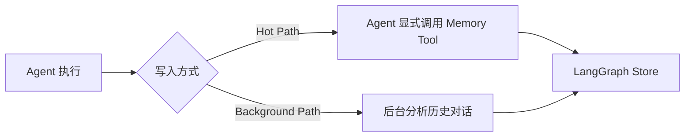

### 主要优势

- 与 LangGraph 的状态、Store 和图工作流集成紧密；
- 将 Prompt 改进和成功示例纳入程序性、情景记忆；
- 适合已经采用 LangGraph 的应用。

### 主要限制

- 更像框架扩展而非独立 Memory Server；
- 跨框架使用时需要额外抽象；
- 实际能力会受 LangGraph Store 和应用架构影响。

---

### N.6.7 Cognee

### 定位

Cognee 更接近 AI Memory Data Platform。它把文档、对话和业务数据加工为可检索的向量、关系和知识图谱。

### 典型生命周期

```text
remember → recall → improve → forget
```

### 主要优势

- 可以统一处理文档、数据和对话；
- 支持本体、实体关系和图查询；
- 适合企业知识工程和数据治理；
- 能将临时会话内容逐步沉淀为稳定知识。

### 主要限制

- 对话记忆只是整体能力的一部分；
- 数据建模和图谱处理成本高于轻量 Memory SDK；
- 简单个性化场景可能不需要完整知识平台。

### 适用场景

- 企业知识库；
- 数据分析 Agent；
- 科研资料库；
- 多源文档管理；
- 关系密集型业务知识。

---

### N.6.8 Supermemory

### 定位

Supermemory 将自身定位为统一 Context Infrastructure，覆盖长期和短期上下文、用户画像、检索、连接器和多模态数据。

### 主要能力

- Memory；
- Retrieval；
- User Profile；
- Connectors；
- Extractors；
- Evaluation；
- Observability；
- 多模态内容处理。

### 主要优势

- 邮件、文件、网页和对话等多源信息可以统一接入；
- Memory、RAG、Profile 和 Connectors 集成度较高；
- 适合构建个人上下文层和跨应用助手。

### 主要限制

- 平台覆盖越广，应用和平台数据模型耦合越明显；
- 复杂任务轨迹反思和程序性 Skill 仍需上层设计；
- 迁移、权限和数据主权需要单独评估。

---

### N.6.9 Backboard

### 定位

Backboard 更接近统一 AI Runtime，而非单一 Memory 服务。其能力通常包括：

- 长期 Memory；
- Thread / State；
- RAG；
- 模型提供商路由；
- Assistant Runtime；
- MCP 接口。

### 主要优势

- 一套服务覆盖多个 Agent 基础设施问题；
- 托管接入成本较低；
- 适合希望快速获得完整 Runtime 的团队。

### 主要限制

- 平台绑定范围不仅是 Memory，还包括 State、RAG 和模型路由；
- 自定义底层数据模型的自由度有限；
- 厂商公开 Benchmark 需要区分测试条件与独立复现结果。

---

### N.6.10 Memobase

### 定位

Memobase 以 User Profile 为核心，将记忆组织为用户画像、主题、子主题、事件和时间标签。

### 主要优势

- 用户建模和个性化能力突出；
- 适合长期维护偏好、背景和用户状态；
- Profile 结构比简单事实列表更适合个性化应用。

### 主要限制

- 项目型记忆、复杂任务轨迹和程序性知识不是其主要重点；
- 多 Agent 共享决策和复杂工作流状态需要额外模型。

### 适用场景

- AI Companion；
- 教育助手；
- 健康陪伴；
- 客户画像；
- 个性化推荐；
- 长期个人助手。

---

### N.6.11 Redis Agent Memory

### 定位

Redis Agent Memory 代表基础设施型 Memory 路线，利用 Redis 的实时数据、索引和检索能力管理会话事件与长期记忆。

### 主要能力

- 按时间排列的 Session Events；
- 持久化长期记忆；
- 自动摘要；
- 后台事实提取；
- 关键词、向量和混合检索；
- 多 Session 范围过滤；
- 敏感数据排除；
- 自定义结构化记忆类型。

### 主要优势

- 适合已经使用 Redis 的系统；
- 实时写入和低延迟读取能力较好；
- 可以与缓存、消息和会话状态统一部署；
- 不强制绑定某一 Agent Framework。

### 主要限制

Redis 解决了高性能存储和检索底座，但以下问题仍需上层设计：

- 什么值得记；
- 如何验证事实；
- 如何解决冲突；
- 如何形成反思；
- 如何进行程序性经验升级。

---

### N.6.12 MemOS

### 定位

MemOS 尝试将 Memory 从应用附属功能提升为可调度的系统资源，并统一管理不同记忆形态。

### 记忆形态

- Plaintext Memory；
- Activation Memory；
- Parametric Memory。

### 生命周期

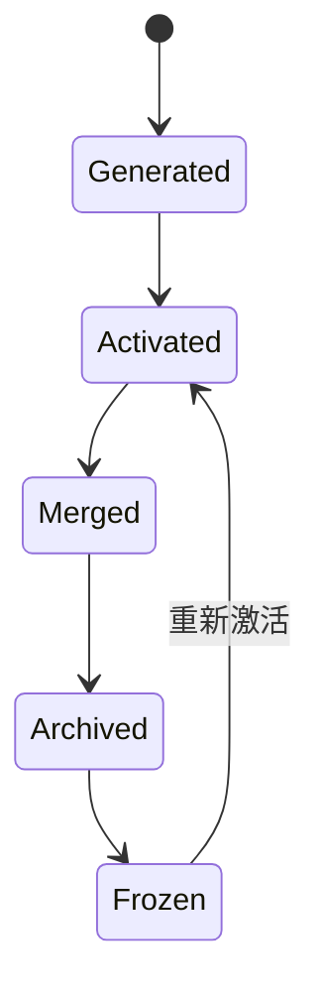

### 主要优势

- 记忆生命周期和治理抽象较完整；
- 将文本、激活状态和参数记忆纳入统一模型；
- 适合研究下一代 Memory 基础设施。

### 主要限制

- 激活记忆和参数记忆仍较前沿；
- 普通业务系统的部署与理解成本较高；
- 生产成熟度、工具链和跨模型可移植性需要单独验证。

---

## N.7 Agent 框架原生 Memory

### N.7.1 LlamaIndex Memory

LlamaIndex 的 Memory 抽象通常包括：

- 有 Token 上限的短期 FIFO；
- 超出预算后刷新到长期 Memory Block；
- Static Block；
- Fact Extraction Block；
- Vector Memory Block；
- 按 Token Budget 合并短期和长期内容。

适合已经采用 LlamaIndex 进行文档处理、RAG 和 Agent 构建的系统。

### N.7.2 CrewAI Memory

CrewAI 的 Memory 主要服务于 Crew 和多 Agent 协作，重点考虑：

- 当前任务上下文；
- 语义相关性；
- 记忆时效性；
- 重要性；
- Agent 和 Crew 范围。

其优势是与 Crew 调度和角色模型集成；限制是跨框架可移植性较弱。

### N.7.3 AutoGen Memory

AutoGen 提供可扩展 Memory Protocol，典型方法包括：

```text
add
query
update_context
clear
close
```

它更像框架级接口规范。开发者可以在其后端接入向量数据库、Redis 或第三方 Memory Provider。

### N.7.4 OpenAI Agents SDK Sessions

OpenAI Agents SDK 的 Sessions 负责跨多次 Agent Run 保存会话历史和工作上下文，可配合 SQLite、Redis、SQLAlchemy、Dapr、加密 Session、OpenAI Conversations 和压缩机制使用。

需要明确：

```text
Sessions 主要解决持久化会话状态与连续对话，
不自动等价于完整的语义长期记忆系统。
```

完整 Memory 仍需补充：

- 用户画像提取；
- 事实去重和冲突更新；
- 时间有效性；
- 记忆检索规划；
- 程序性经验学习；
- 删除和审计治理。

---

## N.8 云厂商 Agent Memory

| 云平台 | 产品 | 核心特点 |
|---|---|---|
| AWS | AgentCore Memory | 短期 Event、长期 Memory、Memory Strategy、Namespace、自动提取与自定义策略 |
| Google Cloud | Vertex AI Memory Bank | 托管长期记忆、Scope 隔离、TTL、主题控制，可与 Agent Runtime 集成 |
| Microsoft Azure | Foundry Agent Service Memory | 托管记忆提取、合并、Memory Store 和 Scope 隔离 |

### N.8.1 AWS AgentCore Memory

典型模型：

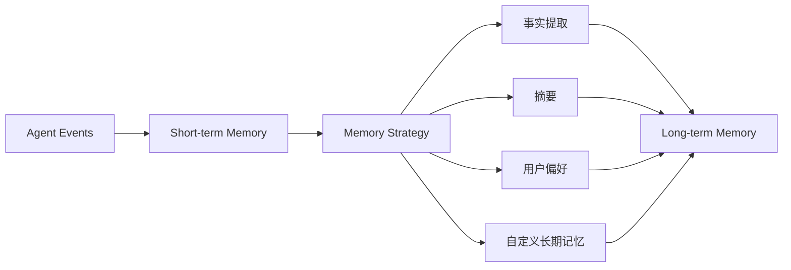

适合已经在 AWS 上部署模型、Agent、日志和 IAM 的企业系统。

### N.8.2 Google Vertex AI Memory Bank

主要关注：

- 托管长期记忆；
- 作用域隔离；
- TTL；
- 主题控制；
- 与 Vertex Agent Runtime 组合；
- 作为独立 Memory 服务调用。

### N.8.3 Azure Foundry Agent Memory

主要关注：

- 长期知识提取；
- 记忆合并；
- Memory Store；
- Scope 分区；
- 与 Foundry Agent Service 集成。

### N.8.4 云 Memory 的共同优势

- 托管扩缩容；
- 云 IAM、审计和合规能力；
- 与模型、Agent Runtime 和日志平台集成；
- 无需自行维护索引和后台任务；
- 企业采购和运维路径相对清晰。

### N.8.5 云 Memory 的共同限制

- 云厂商绑定；
- 数据迁移成本；
- 底层提取、排序和更新逻辑可解释性有限；
- 本地优先和离线 Agent 不适合；
- 不同云厂商的 Memory Schema 难以直接互通；
- 隐私删除和跨区域数据驻留需要严格验证。

---

## N.9 Coding Agent 的文件型记忆

文件型记忆不完全等同于 Mem0、Zep 等 Memory 服务，但对 Coding Agent 非常实用。

### N.9.1 Claude Code

Claude Code 常见记忆形态包括：

- `CLAUDE.md`：用户显式维护的项目规则、命令和约束；
- Auto Memory：Agent 在使用过程中积累的项目经验、构建方式、调试信息和偏好。

其特点是项目绑定、本地可见、可直接编辑，并能在后续 Session 中重新加载。

### N.9.2 Codex

Codex 采用分层 `AGENTS.md` 表达项目指令，也可以结合历史会话记忆、Skills 和 MCP 构成长期上下文：

```text
AGENTS.md  → 长期项目规则
Memories   → 历史上下文和经验
Skills     → 可复用操作流程
MCP        → 外部系统与知识连接
```

### N.9.3 文件型记忆的优势

- 本地优先；
- 用户可直接查看和编辑；
- 可以通过 Git 审计；
- 与代码仓库天然绑定；
- 迁移成本低；
- 不依赖外部数据库。

### N.9.4 文件型记忆的限制

- 大规模语义检索较弱；
- 时间和冲突建模能力有限；
- 跨项目、跨用户和跨组织共享不方便；
- 文件过大后仍需要分层、摘要和索引；
- 自动提取内容的质量难以系统评估；
- 删除、权限和敏感信息治理需要额外机制。

### N.9.5 文件与索引分离模式

本地优先系统常采用：

```text
Markdown / JSONL / YAML
        = 权威事实来源

SQLite / FTS / Vector / Graph
        = 可删除、可重建的派生索引
```

该模式的优点是：

- 数据可读、可审计；
- 索引损坏时可以重建；
- 存储后端可以替换；
- 用户可以直接控制项目级记忆；
- 不会因为向量库异常而失去原始事实。

---

## N.10 研究型 Memory 演进路线

### N.10.1 Generative Agents

Generative Agents 提出了经典的：

```text
Observation → Memory Stream → Retrieval → Reflection → Planning
```

系统将经历写入 Memory Stream，并依据以下因素召回：

- 相关性；
- 近期性；
- 重要性。

随后周期性把低层经历归纳为高层 Reflection，用于未来规划。

### N.10.2 Reflexion

Reflexion 不直接更新模型参数，而是根据任务反馈生成文字反思，并将其写入情景记忆，在下一次尝试时重新注入上下文。

典型闭环：

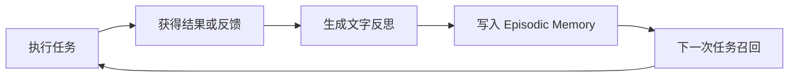

风险在于：反思模型可能对失败原因做出错误归因。因此反思内容不应直接作为高可信事实。

### N.10.3 ExpeL

ExpeL 从多个训练任务的成功和失败轨迹中提炼自然语言经验，并在新任务中召回：

- 抽象经验规则；
- 相似的成功示例；
- 应避免的失败模式。

它代表从“保存单次经历”向“跨任务提炼可迁移经验”演进。

### N.10.4 A-MEM

A-MEM 借鉴 Zettelkasten，将记忆组织为可链接、可更新的笔记网络，而不是彼此独立的向量条目。

核心思想：

- 每条记忆具有结构化属性；
- 新记忆会与既有记忆形成链接；
- 链接和标签可随新信息动态更新；
- 检索不仅依赖向量相似度，也依赖记忆网络结构。

### N.10.5 MemoryOS

MemoryOS 采用短期、中期和长期的分层结构，将原始对话逐步聚合为稳定记忆：

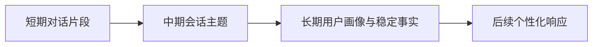

### N.10.6 从检索到“检索—批判—重构”

前沿研究正在从简单的：

```text
Retrieve → Inject → Answer
```

转向：

```text
Observe
  → Retrieve
  → Critique Applicability
  → Reconstruct Experience
  → Act
  → Evaluate
  → Update Memory
```

核心变化是：旧经验不能因为“语义相似”就直接使用，还需要判断：

- 当前状态是否满足旧经验的前提；
- 旧经验是否已经过时；
- 当时成功是否由其他条件造成；
- 该经验是否适用于当前工具、模型和环境；
- 是否需要把多个旧经验重构为新策略。

---

## N.11 Benchmark 与排行榜解读

### N.11.1 常见 LoCoMo 结果

公开材料中经常出现如下 LoCoMo 对比结果：

| Method | Single-Hop | Multi-Hop | Open Domain | Temporal | Overall |
|---|---:|---:|---:|---:|---:|
| Backboard | 89.36 | 75.00 | 91.20 | 91.90 | 90.00 |
| Memobase v0.0.37 | 70.92 | 46.88 | 77.17 | 85.05 | 75.78 |
| Zep | 74.11 | 66.04 | 67.71 | 79.79 | 75.14 |
| Memobase v0.0.32 | 63.83 | 52.08 | 71.82 | 80.37 | 70.91 |
| Mem0-Graph | 65.71 | 47.19 | 75.71 | 58.13 | 68.44 |
| Mem0 | 67.13 | 51.15 | 72.93 | 55.51 | 66.88 |
| LangMem | 62.23 | 47.92 | 71.12 | 23.43 | 58.10 |
| OpenAI 基线 | 63.79 | 42.92 | 62.29 | 21.71 | 52.90 |

> 注意：这类表格通常来自特定厂商仓库、特定模型、特定 Judge Prompt 和特定数据过滤条件，不能直接视为统一官方排行榜。

### N.11.2 为什么不能只看 Overall

不同测试可能存在以下差异：

1. 使用的数据子集不同；
2. 是否过滤 adversarial 或不可回答问题不同；
3. 回答模型不同；
4. 评分模型不同；
5. Judge Prompt 的宽松程度不同；
6. 系统版本不同；
7. 是否使用全部记忆、Top-K 记忆或动态检索不同；
8. 是否包含人工调参不同；
9. 是否统一计算成本和延迟不同；
10. 是否由独立第三方复现不同。

因此，排行榜更适合说明某个系统在特定条件下的表现，而不是直接证明其在所有生产场景中更优。

### N.11.3 “OpenAI”基线的解释

部分论文和测试中的 “OpenAI” 指的是根据 ChatGPT Memory 机制构造的实验基线，并不等价于：

- OpenAI Agents SDK Sessions；
- OpenAI Conversations API；
- 所有当前版本的 ChatGPT Memory；
- 任何未公开的线上记忆检索实现。

比较时必须阅读原始实验设置。

### N.11.4 主流 Memory Benchmark

| Benchmark | 主要评估内容 |
|---|---|
| LoCoMo | 长期多 Session 对话中的单跳、多跳、时间和开放域问题 |
| LongMemEval | 信息抽取、跨 Session 推理、时间推理、知识更新和拒答 |
| LoCoMo-Plus | 超越直接事实召回的认知型长期记忆 |
| LongMemEval-V2 | Web Agent 的动态状态、工作流知识和前提识别 |
| MemoryArena | Memory 是否真正改善后续 Agent 行动 |
| MEMPROBE | 直接检查 Memory Artifact 是否恢复正确用户状态 |

### N.11.5 工程评测指标

生产系统不应只测最终问答准确率，还应覆盖：

| 维度 | 典型指标 |
|---|---|
| 写入质量 | Memory Precision、Memory Recall、错误写入率、重复率 |
| 检索质量 | Recall@K、MRR、nDCG、证据覆盖率 |
| 时间能力 | 新旧事实替换准确率、相对时间解析准确率 |
| 冲突能力 | 矛盾检测率、历史保留率、当前事实选择准确率 |
| 上下文效率 | 注入 Token 数、有效 Token 比例、压缩损失率 |
| 行动效果 | Task Success、工具调用成功率、重试次数、完成时长 |
| 安全隔离 | 跨用户、跨项目、跨 Agent 泄露率 |
| 删除治理 | 删除传播时间、索引残留率、备份残留率 |
| 可解释性 | 来源覆盖率、可追溯率、召回理由完整度 |
| 性能成本 | 写入延迟、查询延迟、LLM 调用数、Token 和存储成本 |
| 反思质量 | 错误归因率、经验适用率、负迁移率 |
| 鲁棒性 | 索引损坏恢复、Provider 故障降级、并发一致性 |

### N.11.6 推荐评测矩阵

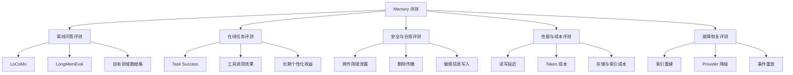

---

## N.12 企业级 Agent Memory 参考架构

### N.12.1 架构原则

企业级系统更适合采用 Provider-neutral 架构，而不是让业务领域模型直接依赖某个 Memory 厂商。

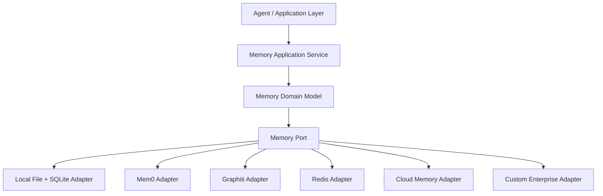

核心原则：

1. 业务层只依赖稳定的 Memory Port；
2. Provider 只负责具体存储和检索实现；
3. 权限、作用域、领域语义和审计规则由平台统一控制；
4. 外部 Provider 故障时可以降级到本地或其他后端；
5. 关键数据需要可导出、可迁移、可删除和可重建。

### N.12.2 推荐 Memory Port

```rust
pub trait MemoryPort {
    fn append_event(&self, event: MemoryEvent) -> Result<EventId, MemoryError>;

    fn write_memory(
        &self,
        candidate: MemoryCandidate,
    ) -> Result<MemoryWriteResult, MemoryError>;

    fn search_memory(
        &self,
        query: MemoryQuery,
    ) -> Result<Vec<MemoryHit>, MemoryError>;

    fn consolidate(
        &self,
        scope: MemoryScope,
    ) -> Result<ConsolidationReport, MemoryError>;

    fn reflect(
        &self,
        trajectory: Trajectory,
    ) -> Result<Vec<ReflectionCandidate>, MemoryError>;

    fn forget(
        &self,
        policy: ForgetPolicy,
    ) -> Result<ForgetReport, MemoryError>;

    fn explain(
        &self,
        memory_id: MemoryId,
    ) -> Result<MemoryExplanation, MemoryError>;
}
```

### N.12.3 权威数据与派生索引分离

推荐结构：

```text
Event Log / Markdown / JSONL / Relational Tables
                     = 权威数据

FTS / Vector Index / Graph Index / Summary Cache
                     = 派生数据
```

派生索引必须满足：

- 可以从权威数据重建；
- 带有构建版本和内容哈希；
- 删除操作能够传播到所有索引；
- 索引失败不能破坏权威数据；
- 读取时可以检测索引漂移；
- 支持重新嵌入和模型升级。

### N.12.4 双路径写入

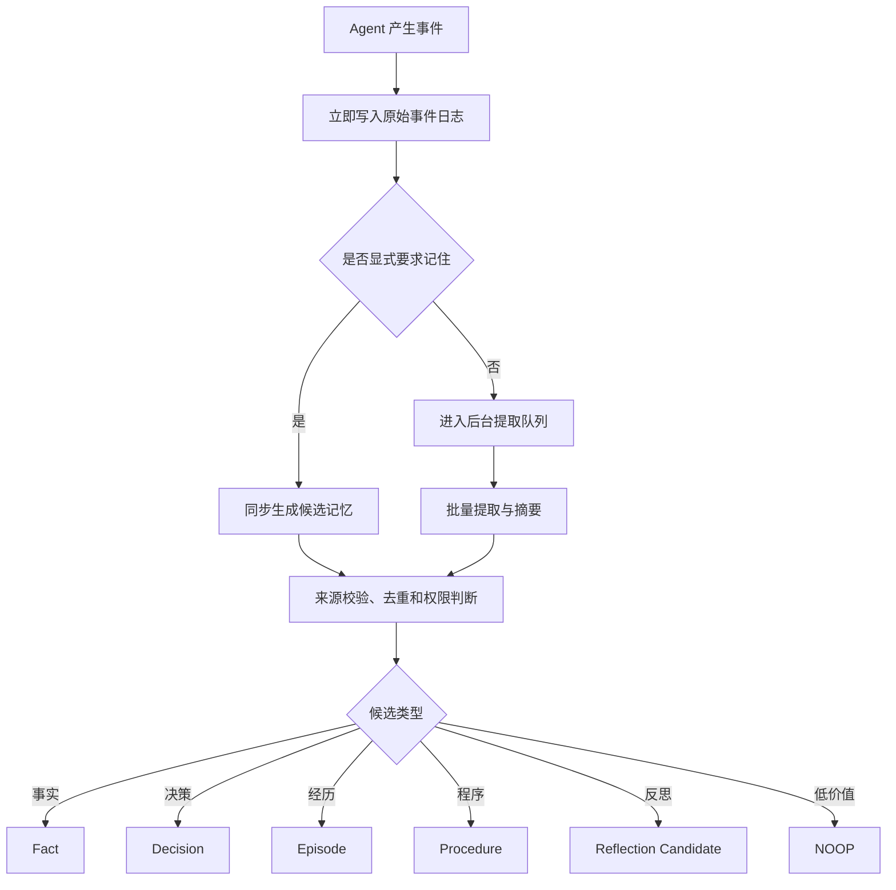

同步路径适合：

- 用户明确要求记住；
- 安全和权限规则；
- 当前任务后续步骤立即需要的信息；
- 不可丢失的业务决策。

后台路径适合：

- 用户画像提取；
- 历史摘要；
- 重复事实压缩；
- 冲突合并；
- 失败经验和成功模式；
- 图关系构建；
- 低优先级嵌入计算。

### N.12.5 Context Compiler

Memory 不应简单按 Top-K 原样拼接。Context Compiler 应根据任务类型和 Token Budget 进行结构化编译。

示例预算：

| 内容类型 | 建议占比 |
|---|---:|
| System Rules | 20% |
| 当前任务、计划和状态 | 25% |
| 最近对话 | 20% |
| 高优先级用户/项目事实 | 10% |
| 相关历史经历 | 10% |
| 程序性经验 | 10% |
| 引用和安全余量 | 5% |

每条注入内容建议附带：

```text
[记忆类型]
[作用域]
[有效时间]
[来源]
[置信度]
[召回原因]
[是否允许覆盖]
```

### N.12.6 程序性记忆的升级门禁

反思或经验不能直接升级为正式 Procedure。推荐流程：

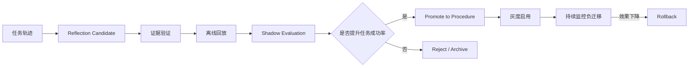

建议保存：

- 产生经验的原始轨迹；
- 适用前提；
- 不适用条件；
- 验证数据集；
- 成功率变化；
- 使用的模型和工具版本；
- 推广、回滚和过期记录。

### N.12.7 可解释 Memory UI

企业级 Memory 管理界面至少应展示：

- 为什么保存这条记忆；
- 来源消息、文档或工具结果；
- 哪些用户、项目和 Agent 可以访问；
- 当前是否有效；
- 可信度和重要性；
- 生效时间和失效时间；
- 版本和被替代关系；
- 最近在哪些任务中被召回；
- 对任务结果产生了什么影响；
- 删除是否已传播到所有索引和缓存。

可提供操作：

- 固定；
- 编辑；
- 合并；
- 标记错误；
- 调整作用域；
- 立即过期；
- 删除；
- 查看来源；
- 查看召回历史；
- 重新生成索引。

### N.12.8 分阶段实施建议

### Phase 1：Memory Core

- Event Log；
- Profile、Fact、Episode、Decision、Procedure；
- Scope 和 ACL；
- 显式 Memory Tool；
- 关键词检索；
- Memory 管理界面；
- 来源追踪和删除。

### Phase 2：语义与时间能力

- Embedding；
- 混合检索；
- `valid_from / valid_to`；
- 冲突检测；
- 版本链；
- 索引重建；
- Context Compiler。

### Phase 3：经验学习

- 任务轨迹收集；
- 成功/失败分类；
- Reflection Candidate；
- 离线验证；
- Procedure Promotion；
- 回滚和负迁移监控。

### Phase 4：Provider Adapter

- 本地适配器；
- Mem0 适配器；
- Graphiti 适配器；
- Redis 适配器；
- 云 Memory 适配器；
- Provider 一致性测试。

### Phase 5：评测与自适应治理

- LoCoMo / LongMemEval；
- 自有业务数据集；
- 行动效果评测；
- 跨作用域泄露测试；
- 错误记忆注入测试；
- 基于实际收益的 Promotion / Demotion；
- 自动 TTL 和归档策略。

---

## N.13 系统选型方法

### N.13.1 需求到方案映射

| 需求 | 优先方案 |
|---|---|
| 快速为已有 Agent 增加长期记忆 | Mem0 |
| 用户画像和个性化助手 | Mem0、Memobase、Supermemory |
| 时间变化、关系和多跳推理 | Zep / Graphiti |
| 长期运行并由 Agent 自主管理上下文 | Letta |
| 从成功和失败中学习 | Hindsight、LangMem |
| LangGraph 技术栈 | LangMem + LangGraph Store |
| 文档、数据、本体和知识图谱 | Cognee |
| 已有 Redis 核心基础设施 | Redis Agent Memory |
| 一站式托管 Runtime | Backboard |
| AWS 企业系统 | AgentCore Memory |
| Google Cloud Agent | Vertex AI Memory Bank |
| Azure Agent 平台 | Foundry Agent Memory |
| Coding Agent 项目级规则 | 文件型记忆 + 本地索引 |
| 研究文本、激活和参数统一记忆 | MemOS |

### N.13.2 选型评分维度

建议按 1—5 分进行加权评分：

| 维度 | 说明 | 建议权重 |
|---|---|---:|
| 记忆准确性 | 写入、更新和召回是否可靠 | 15% |
| 时间与冲突 | 是否支持事实演变、版本和失效 | 10% |
| 作用域与权限 | 是否支持用户、项目、Agent 和租户隔离 | 15% |
| 可解释性 | 是否能展示来源、召回原因和更新过程 | 10% |
| 部署与数据主权 | 自托管、本地运行、区域和迁移能力 | 10% |
| Framework 兼容性 | 是否容易接入现有 Agent 技术栈 | 10% |
| 性能与成本 | 延迟、Token、存储和模型调用成本 | 10% |
| 可扩展性 | 自定义 Schema、检索器、模型和 Provider | 10% |
| 评测与可观测性 | 是否具备质量评测和运行监控 | 5% |
| 生态与成熟度 | 文档、社区、版本稳定性和维护能力 | 5% |

### N.13.3 选型决策树

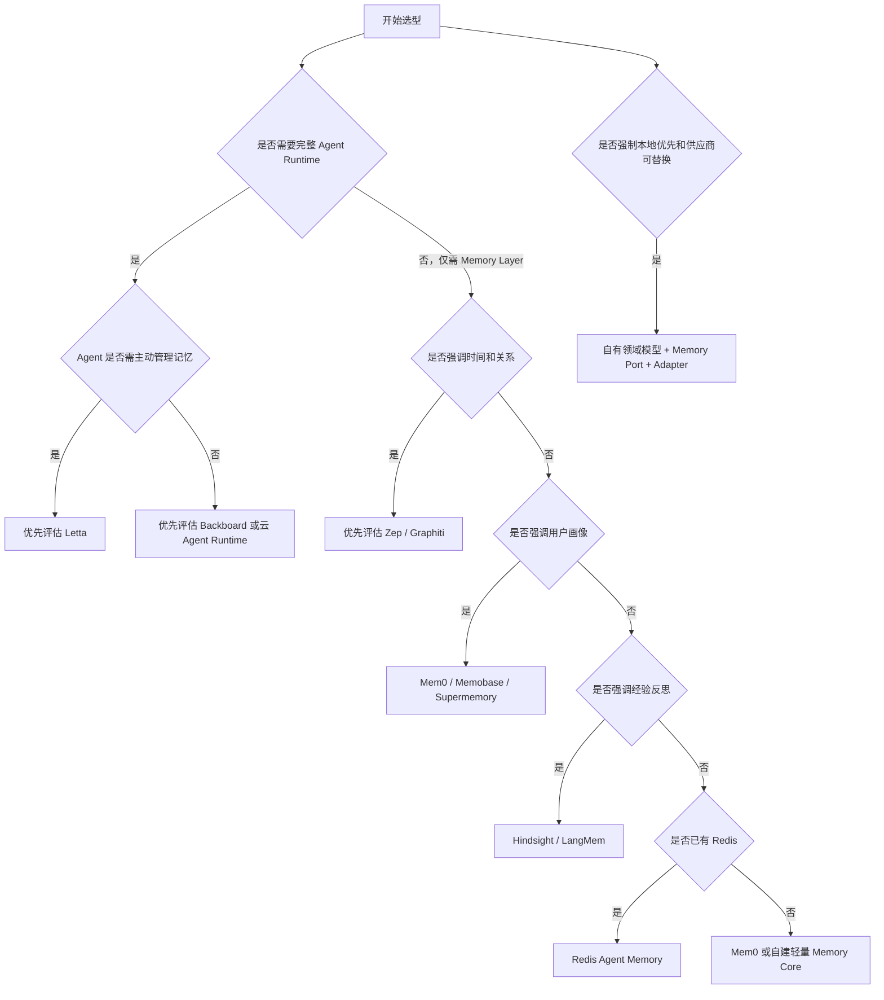

### N.13.4 PoC 必测项目

在决定采购或集成前，至少应完成：

1. 同一用户跨 30—100 个 Session 的长期召回；
2. 新旧事实冲突与时间更新；
3. 跨用户、跨项目和跨 Agent 隔离；
4. 删除后全文、向量、图和缓存的传播；
5. 模型更换后的索引兼容和重建；
6. Provider 故障与超时降级；
7. 记忆写入错误和反思错误的回滚；
8. Token 成本、P95 查询延迟和后台处理成本；
9. 来源追踪和审计；
10. 实际任务成功率是否提升，而不只是问答分数提升。

---

## N.14 未来发展方向

### N.14.1 从被动存储到主动 Memory Management

Agent 将不再只是被动接收检索结果，而会主动决定：

- 当前需要读取哪类记忆；
- 哪些上下文应从工作记忆迁移到长期记忆；
- 哪些旧事实需要重新验证；
- 哪些内容应压缩、归档或遗忘；
- 哪些经验值得升级为程序性知识。

### N.14.2 从语义相似到任务效用

传统向量检索主要优化语义相似度，未来系统会同时考虑：

```text
Memory Utility =
    语义相关性
  × 当前适用性
  × 可信度
  × 时效性
  × 历史任务收益
  ÷ Token 与延迟成本
```

### N.14.3 从事实列表到可演化世界模型

Memory 将逐步成为 Agent 的动态世界模型，包含：

- 实体；
- 关系；
- 状态；
- 时间；
- 事件；
- 因果假设；
- 不确定性；
- 观测来源；
- 冲突版本。

### N.14.4 Memory 与 Skill 融合

未来程序性记忆与 Skill 的边界会逐渐模糊：

```text
任务轨迹
  → 经验提取
  → 程序候选
  → 验证
  → Skill / Policy
  → 在线使用
  → 效果监控
  → 更新或回滚
```

### N.14.5 多 Agent 共享记忆

多 Agent 系统需要区分：

- 私有记忆；
- 团队共享记忆；
- 角色专属记忆；
- 组织公共知识；
- 任务临时黑板；
- 已验证经验库。

共享不是简单共用一个向量库，还需要：

- 写入权限；
- 读取权限；
- 可信度和来源；
- 并发更新；
- 版本冲突；
- 贡献者身份；
- 审批和发布流程。

### N.14.6 隐私与可遗忘性

Memory 系统会越来越接近个人数据处理系统，必须支持：

- 用户查看和导出；
- 精确删除；
- 敏感信息检测；
- 最小化收集；
- 目的限制；
- 保留期限；
- 加密；
- 跨区域治理；
- 派生索引和备份删除证明。

### N.14.7 标准化趋势

未来可能逐步出现跨系统标准：

- Memory Record Schema；
- Scope 和 ACL 语义；
- 来源与证据格式；
- 时间事实表达；
- Provider-neutral Memory API；
- 记忆导入导出格式；
- Memory Evaluation Protocol；
- MCP Memory Server 规范。

---

## N.15 总结

主流 Agent Memory 系统可以概括为：

- **Mem0**：通用 Memory API 的代表；
- **Zep / Graphiti**：时序关系记忆的代表；
- **Letta**：Memory-Native Agent Runtime 的代表；
- **Hindsight**：经验反思和认知型记忆的代表；
- **LangMem**：LangGraph 生态中语义、情景和程序性记忆的代表；
- **Cognee**：企业数据知识图谱化的代表；
- **Supermemory**：统一 Context Infrastructure 的代表；
- **Backboard**：Memory、RAG、State 和模型路由一体化平台；
- **Memobase**：用户画像与长期个性化的代表；
- **Redis Agent Memory**：实时基础设施型 Memory 的代表；
- **MemOS**：统一文本、激活和参数记忆的前沿路线；
- **云厂商 Memory**：强调托管、治理和云生态集成。

真正决定生产效果的通常不是“是否有向量数据库”，而是以下能力是否完整：

1. 是否只保存有价值且有证据的信息；
2. 是否正确处理新旧事实和时间变化；
3. 是否能在严格作用域内检索；
4. 是否能在 Token Budget 内编译高质量上下文；
5. 是否能验证反思和程序性经验；
6. 是否支持删除、审计和故障恢复；
7. 是否在真实任务中持续提升行动成功率。

对于需要本地优先、多 Agent、数据可控和供应商可替换的系统，更稳健的工程路线通常是：

```text
自有 Memory Domain Model
        +
Provider-neutral Memory Port
        +
权威数据与派生索引分离
        +
关键词 / 向量 / 图 / 时间混合检索
        +
可验证的经验反思闭环
        +
系统化评测与治理
```

---

## 参考资料

### 基础理论与论文

1. [CoALA: Cognitive Architectures for Language Agents](https://arxiv.org/abs/2309.02427)
2. [MemGPT: Towards LLMs as Operating Systems](https://arxiv.org/abs/2310.08560)
3. [Generative Agents: Interactive Simulacra of Human Behavior](https://arxiv.org/abs/2304.03442)
4. [Reflexion: Language Agents with Verbal Reinforcement Learning](https://arxiv.org/abs/2303.11366)
5. [ExpeL: LLM Agents Are Experiential Learners](https://arxiv.org/abs/2308.10144)
6. [A-MEM: Agentic Memory for LLM Agents](https://arxiv.org/abs/2502.12110)
7. [MemoryOS: An Operating System for Personalized AI](https://arxiv.org/abs/2506.06326)
8. [Mem0: Building Production-Ready AI Agents with Scalable Long-Term Memory](https://arxiv.org/abs/2504.19413)

### 独立 Memory 系统

9. [Mem0 Documentation](https://docs.mem0.ai/)
10. [Zep Documentation](https://help.getzep.com/)
11. [Graphiti](https://www.getzep.com/product/graphiti/)
12. [Letta Documentation](https://docs.letta.com/)
13. [Hindsight Documentation](https://hindsight.vectorize.io/)
14. [LangMem Documentation](https://langchain-ai.github.io/langmem/)
15. [Cognee Documentation](https://docs.cognee.ai/)
16. [Supermemory Documentation](https://supermemory.ai/docs/overview/what-is-supermemory)
17. [Backboard](https://backboard.io/)
18. [Memobase GitHub](https://github.com/memodb-io/memobase)
19. [Redis Agent Memory](https://redis.io/docs/latest/develop/ai/context-engine/agent-memory/)
20. [MemOS Documentation](https://memos-docs.openmem.net/open_source/home/memos_intro/)

### 框架与云服务

21. [LlamaIndex Agent Memory](https://developers.llamaindex.ai/python/framework/module_guides/deploying/agents/memory/)
22. [CrewAI Documentation](https://docs.crewai.com/)
23. [AutoGen Memory](https://microsoft.github.io/autogen/stable/user-guide/agentchat-user-guide/memory.html)
24. [OpenAI Agents SDK Sessions](https://openai.github.io/openai-agents-python/sessions/)
25. [AWS Bedrock AgentCore Memory](https://docs.aws.amazon.com/bedrock-agentcore/latest/devguide/memory.html)
26. [Google Vertex AI Memory Bank](https://docs.cloud.google.com/gemini-enterprise-agent-platform/scale/memory-bank)
27. [Azure Foundry Agent Memory](https://learn.microsoft.com/en-us/azure/foundry/agents/concepts/what-is-memory)
28. [Claude Code Memory](https://docs.anthropic.com/en/docs/claude-code/memory)
29. [Codex AGENTS.md](https://developers.openai.com/codex/guides/agents-md/)

### Benchmark

30. [LoCoMo: Evaluating Very Long-Term Conversational Memory of LLM Agents](https://arxiv.org/abs/2402.17753)
31. [LongMemEval](https://arxiv.org/abs/2410.10813)
32. [Backboard LoCoMo Benchmark Repository](https://github.com/Backboard-io/Backboard-Locomo-Benchmark)


---

> **使用提示**：与其他附录的分工——A 讲模型机制、B 讲方法论、C 记来源、D 列产品、E 辨异同、F 索引图版、G 详解 OTel、H 上手 DeepEval、I 评测观测平台选型、J 上手 Mem0、K 盘点 Coding Agent 赛道、L 盘点可观测赛道、M 盘点评估赛道、**N 盘点 Memory 赛道**、O 盘点自进化赛道、P 盘点多 Agent 赛道、Q 盘点 MCP 生态、R 解析 Pi 源码、S 解析 Claude Code 源码、T 解析 Codex 源码。对照阅读：定义与边界（N.2）对附录 E.1 四机制辨析、认知分类（N.3）对第 10 章 CoALA 四分类、MemGPT/Letta（N.6.4）对第 10 章 2.3 与 [C-24]、文件型记忆（N.9）对第 6 章 CLAUDE.md 与第 23 章项目知识文件、记忆评测（N.11）对第 15 章与附录 M、参考架构（N.12）对第 10 章远程记忆数据库一节。信息基准 2026-08（[C-39]），发行前按附录 C 清单复核。
