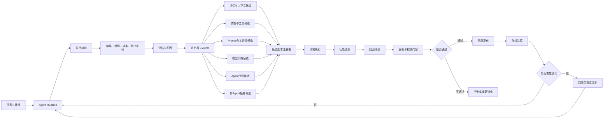
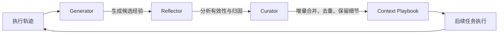
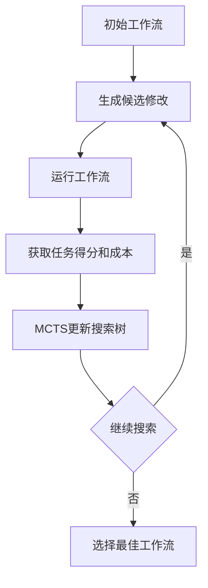
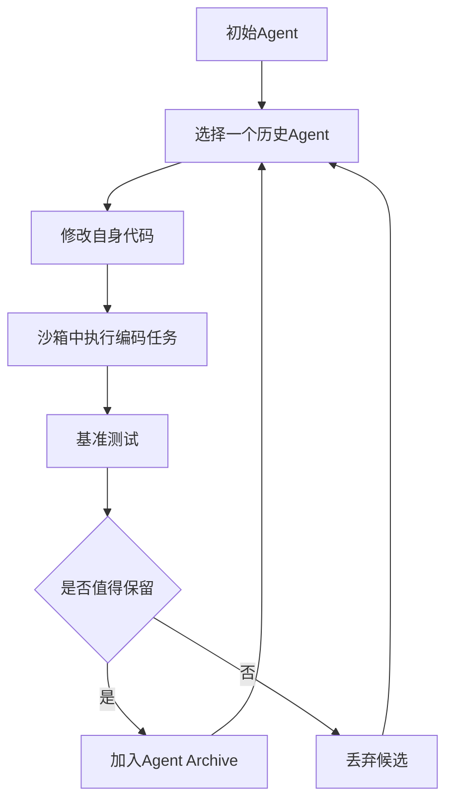
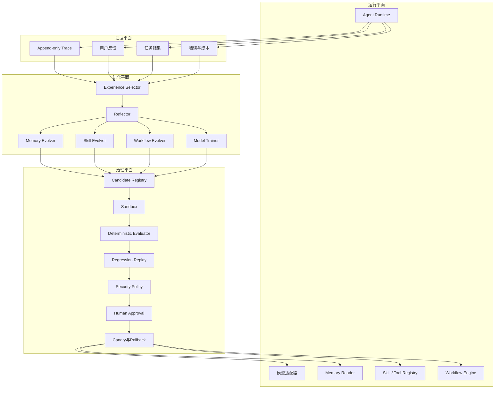

# 附录 O：主流 Agent 自进化系统全景

> 定位：**Agent 自进化赛道的全景调研报告**（全文收录，信息基准 2026-08-30，代表系统与论文入口见 [C-40]）。与相邻内容的分工：第 26 章讲前沿方向的克制判断（自进化 = 自动化的变更管理、后训练四道闸、三问判断框架），本附录是整个赛道的地图——定义与易混概念、六路进化版图（经验上下文/记忆/技能工具/Prompt 与工作流/模型参数与自博弈/代码级递归）、群体进化、系统对比、评测体系、风险清单、生产参考架构与落地路线。注意本领域的成熟度分层：记忆与技能进化开始工程化、工作流进化进入试点、模型与代码自进化仍以研究为主——名单会过期，这个分层判断与风险框架不过期。

---

## O.1 先统一定义：什么才算 Agent 自进化

一个比较严格的定义是：

> Agent 根据自身执行轨迹、环境反馈、用户反馈或评估结果，持续修改自己的模型参数、上下文状态、记忆、技能、工具、工作流、拓扑或实现代码，并使这些修改能够影响后续任务。

近期综述通常将进化对象划分为模型、上下文与记忆、工具与技能、Agent 架构等类别，同时区分单任务内进化、跨任务进化、在线进化和离线进化。

可以将 Agent 状态抽象为：

\[
A_t=(M_{\theta_t},P_t,Mem_t,Skill_t,Tool_t,Graph_t,Code_t)
\]

其中：

- \(M_{\theta_t}\)：基础模型及其参数；
- \(P_t\)：Prompt、规则、Playbook、角色配置；
- \(Mem_t\)：情景记忆、语义记忆、程序记忆；
- \(Skill_t\)：可复用技能；
- \(Tool_t\)：工具、API、MCP Server；
- \(Graph_t\)：单 Agent 工作流或多 Agent 协作拓扑；
- \(Code_t\)：Agent Harness 或 Agent 自身实现。

执行任务产生轨迹 \(\tau_t\) 和反馈 \(f_t\)，进化器生成候选变更：

\[
\Delta_t=Evolve(A_t,\tau_t,f_t)
\]

但只有满足效果、安全、成本和稳定性约束时，才应提交：

\[
A_{t+1}=Commit(A_t,\Delta_t)
\]

这意味着，完整自进化并不只是“反思一次”，而是：

```text
执行 → 采集证据 → 归因 → 产生候选变更 → 验证 → 发布 → 监控 → 回滚
```

---

## O.2 最容易混淆的几个概念

| 概念 | 是否持久化 | 是否影响后续任务 | 是否属于严格自进化 |
|---|---:|---:|---|
| Retry 重试 | 否 | 否 | 否 |
| Self-Correction 自纠错 | 通常否 | 通常否 | 否 |
| Self-Refine 输出迭代 | 否 | 否 | 弱相关 |
| Reflection 反思 | 可能 | 可能 | 取决于是否写入长期状态 |
| Memory Learning | 是 | 是 | 是，属于上下文层进化 |
| Skill Learning | 是 | 是 | 是，属于能力层进化 |
| Workflow Optimization | 是 | 是 | 是，属于架构层进化 |
| Online RL | 写入模型参数 | 是 | 是，属于模型层进化 |
| Self-Modification | 写入自身代码 | 是 | 强自进化 |
| Artifact Evolution | 修改外部代码、算法、方案 | 是 | 不一定是 Agent 本体进化 |

**Self-Refine** 让同一个模型生成、批评并反复修改当前输出，但一般不会将改进结果持久化到后续任务，因此更准确地说是“单任务内优化”。

**Reflexion** 则把失败后的自然语言反思写入情景记忆，在后续尝试中使用这些反思，不需要修改模型参数，因此已经具备早期的经验驱动进化特征。

判断一个系统是否真正具有自进化能力，可以问四个问题：

1. 学到的内容是否跨任务、跨会话持久存在？
2. 更新的是输出，还是 Agent 自身的记忆、技能、流程、模型或代码？
3. 更新前是否有独立验证，而不是 Agent 自己说自己变好了？
4. 发生退化后是否能够定位版本、撤销变更和恢复历史状态？

---

## O.3 Agent 自进化总体版图



从工程成熟度看，可以分为六个层级。

### L0：输出级自改进

代表系统：

- Self-Refine；
- Iterative Critique；
- Self-Correction；
- Critic–Solver。

主要更新当前回答、计划或代码补丁，不写入长期状态。

- **成熟度：高**
- **进化深度：低**

它适合作为 Agent Loop 中的一层纠错机制，但不应单独称为长期自进化系统。

### L1：反思与经验进化

代表系统：

- Reflexion；
- ExpeL；
- ACE；
- EvolveR；
- Agent S。

核心是把执行轨迹转化为可重用经验：

```text
失败轨迹
  → 原因归纳
  → 提炼原则
  → 写入经验库
  → 后续任务检索
  → 指导新的规划与执行
```

这是目前最容易落地、风险相对可控的一条路线。

### L2：记忆与技能进化

代表系统：

- Mem0；
- A-MEM；
- Hermes Agent；
- Voyager；
- SkillWeaver；
- SkillOS；
- MUSE-Autoskill。

Agent 不只记住“发生过什么”，还会学习“以后怎么做”，把经验转化为程序记忆、Skill、API 或执行模板。

这是截至 2026 年最接近实际生产应用的自进化路线。

### L3：工具、Prompt 与工作流进化

代表系统：

- ACE；
- AFlow；
- ADAS / Meta Agent Search；
- Alita；
- STELLA；
- ToolMaker。

Agent 开始修改：

- System Prompt；
- Agent 角色；
- 工具组合；
- MCP 能力；
- 工作流节点；
- 节点连接关系；
- 多 Agent 协作拓扑。

这类系统通常依赖明确评估器，更适合代码、数学、Web、科研等结果可验证的场景。

### L4：模型策略与训练课程进化

代表系统：

- WebRL；
- Absolute Zero / AZR；
- Agent0；
- Tool-R0；
- AgentEvolver；
- Multi-Agent Evolve。

这类系统开始通过强化学习、自博弈、自动课程生成等机制直接更新模型策略或参数。

它们主要是**训练系统**，而不是可以直接安装使用的 Agent 产品。

### L5：Agent 代码与进化器自身进化

代表系统：

- Gödel Agent；
- Darwin Gödel Machine；
- Huxley-Gödel Machine；
- ADAS；
- 部分 Self-Improving Coding Agent 系统。

此时 Agent 不只修改记忆、Prompt 或 Skill，而是直接修改自己的代码、工具实现、上下文管理方式，甚至修改“如何改进自己”的进化逻辑。

这是强自进化和递归自改进方向，目前仍属于前沿研究。

### L6：群体与生态进化

代表方向：

- Multi-Agent Evolve；
- Group-Evolving Agents；
- 多 Agent 自博弈；
- Agent 种群搜索；
- 角色与拓扑共同进化。

进化单位不再是单个 Agent，而是：

- Agent 团队；
- 角色集合；
- 协作协议；
- 通信拓扑；
- Agent 种群；
- Skill 与经验生态。

群体进化可以提高探索多样性，但也会引入通信成本、错误传播、群体偏见和评价器串谋等问题。

---

## O.4 主流经验与上下文进化系统

### 4.1 Reflexion：自然语言反思记忆

Reflexion 是 Agent 自进化研究中的奠基性系统之一。

它不修改模型权重，而是：

1. Agent 执行任务；
2. 环境或评估器给出反馈；
3. Agent 对失败原因进行自然语言反思；
4. 将反思写入情景记忆；
5. 下一次执行时，把相关反思注入上下文。

因此，Reflexion 本质上是：

```text
语言反馈 + 情景记忆 + 多轮试错
```

它的价值在于证明了 Agent 可以通过非参数化方式从失败中学习，无需每次进行昂贵的微调。

局限也非常明显：

- 反思可能是错误归因；
- 一条经验可能被过度泛化；
- 记忆数量增长后检索效果下降；
- Agent 既是执行者又是反思者，缺乏真正独立的审核；
- 原始 Reflexion 更偏向多次尝试同一任务，不等同于完整的跨领域终身学习。

### 4.2 ExpeL：从多条轨迹提炼通用经验

ExpeL 将多个任务的成功和失败轨迹汇总起来，提取自然语言形式的通用经验，再在新任务中检索和复用这些经验。

相对于 Reflexion，ExpeL 更强调：

- 跨任务经验汇总；
- 成功与失败案例比较；
- 从具体轨迹提炼抽象原则；
- 在推理时检索历史经验；
- 不修改基础模型参数。

两者可以简单理解为：

```text
Reflexion：一次失败 → 一条反思
ExpeL：多次执行 → 一组抽象经验
```

### 4.3 ACE：让上下文成为持续演化的 Playbook

ACE，即 Agentic Context Engineering，不只是维护若干零散记忆，而是把 Agent Context 视为一个持续演化的结构化 Playbook。

其核心由三类角色组成：



ACE 特别关注两个常见问题：

- **Brevity Bias**：为了简洁而丢失关键细节；
- **Context Collapse**：经过多次总结、改写后，上下文内容逐渐失真或退化。

为此，ACE 使用结构化、增量式更新，而不是每次整体重写上下文。它既可以优化离线 System Prompt，也可以进行在线记忆适配。

ACE 是当前很值得工程系统借鉴的一条路线，因为它：

- 不要求训练模型；
- 变更内容可读；
- 容易版本化；
- 容易对比 Diff；
- 可以回滚；
- 适合与 Agent 评估系统结合。

### 4.4 EvolveR：完整经验生命周期

EvolveR 将 Agent 经验学习拆成两个阶段。

#### 在线交互阶段

Agent 执行任务，积累多样化轨迹和反馈。

#### 离线自蒸馏阶段

系统把轨迹整理成抽象、通用的策略原则，并存入经验仓库；后续在线任务再检索这些原则指导决策。

它形成：

```text
在线执行
 → 轨迹积累
 → 离线自蒸馏
 → 战略原则库
 → 在线检索与应用
 → 新轨迹
```

相比只在任务结束后生成一句反思，EvolveR 更接近完整的经验生产、提炼、使用和再训练闭环。

---

## O.5 记忆型自进化系统

### 5.1 Mem0

Mem0 是一个面向长期 Agent 记忆的工程化系统，主要流程是：

```text
对话或轨迹
 → 信息抽取
 → 与历史记忆比较
 → 新增、更新、合并或删除
 → 持久化
 → 按任务检索
 → 注入 Agent Context
```

Mem0 还提出图结构记忆变体，用于表示人物、事件和关系。其论文把重点放在长期对话、多会话一致性、检索准确率、Token 成本和延迟等工程指标上。

需要注意：

> Mem0 本身主要是“记忆基础设施”，不是完整的自进化 Agent。

只有当它与轨迹评估、经验提炼、Skill 生成和更新门禁组合起来时，才构成完整闭环。

### 5.2 A-MEM

A-MEM 借鉴 Zettelkasten 卡片盒方法，把记忆组织为相互关联的原子笔记。

新增记忆时，系统会生成：

- 上下文描述；
- 关键词；
- 标签；
- 时间信息；
- 与已有记忆的关系。

新记忆还可以触发旧记忆的属性和关系更新，使记忆网络随经验持续变化。

它比简单向量数据库更接近“记忆进化”，但也带来新的治理问题：

- 新记忆是否有资格修改旧记忆；
- 关系是否经过验证；
- 相互矛盾的事实如何共存；
- 过期事实如何失效；
- 用户隐私信息如何删除；
- 图关系错误是否会污染后续推理。

### 5.3 Agent S

Agent S 是面向计算机操作的 Agent 系统，结合：

- 外部知识搜索；
- 情景记忆；
- Narrative Memory；
- 层次化规划；
- GUI 操作经验。

系统会持续更新叙事型与情景型记忆，在后续 GUI 任务中复用历史经验。

Agent S 代表一个重要方向：

> 自进化不能只存在于对话系统，还必须进入 Web、桌面、移动端和真实软件环境。

### 5.4 Hermes Agent

Hermes Agent 是少数明确把“持久记忆 + 自建 Skill + Skill 使用中改进”作为产品能力的开源 Agent。

其公开资料通常强调：

- 跨会话持久记忆；
- 历史会话搜索；
- 从经验创建技能；
- 使用过程中更新技能；
- 用户模型；
- 周期性学习触发。

不过应区分：

- “具备自动写记忆和技能的能力”；
- “已经证明长期使用一定持续变好”。

后者仍然需要长期、独立、跨任务评测，而不能只依据项目自身定位。

---

## O.6 技能与工具自进化系统

### 6.1 Voyager：程序化技能库的经典系统

Voyager 是开放环境终身学习的重要代表，主要由三部分组成：

1. 自动课程生成；
2. 持续增长的可执行代码技能库；
3. 使用环境反馈、执行错误和自验证的迭代 Prompt 机制。

Agent 在 Minecraft 中自主探索，将成功行为封装成代码技能，并在后续任务中组合和复用。整个过程不需要更新基础模型参数。

Voyager 的重要意义不是 Minecraft 本身，而是建立了一个通用范式：

```text
探索环境
 → 发现能力缺口
 → 生成程序
 → 执行验证
 → 修复程序
 → 注册为技能
 → 后续组合复用
```

### 6.2 SkillWeaver：Web Agent 自主发现和练习技能

SkillWeaver 面向网站操作，让 Agent：

1. 自主探索网站；
2. 发现可以复用的操作；
3. 将操作封装为 API；
4. 反复练习；
5. 根据执行结果修复；
6. 写入技能库；
7. 将技能转移给其他 Agent。

它将浏览器操作轨迹抽象成轻量、可复用的 API，并展示了强 Agent 创建的技能可以帮助较弱 Agent。

SkillWeaver 比“保存成功轨迹”更进一步，因为它会把轨迹编译为参数化、可组合的程序能力。

### 6.3 ToolMaker：从论文和代码仓库制造工具

ToolMaker 面向科研和专业计算场景。

给定任务描述和代码仓库后，它可以：

- 安装依赖；
- 理解仓库接口；
- 生成工具封装代码；
- 执行测试；
- 根据错误进行调试；
- 最终输出 Agent 可调用工具。

其验证过程使用单元测试和闭环纠错。

ToolMaker 的核心价值是把：

```text
人类可使用的软件仓库
```

转化为：

```text
Agent 可调用、可验证、可复用的工具
```

这类系统非常适合科学计算，但安装未知依赖和运行第三方代码会带来严重供应链风险，因此必须在隔离环境中运行。

### 6.4 Alita：动态创建和复用 MCP 能力

Alita 追求“最少预定义、最大自进化”，通过通用组件创建、优化和复用外部能力。

当已有能力无法解决任务时，它可以：

- 判断自身能力缺口；
- 搜索外部资源；
- 构造任务相关工具；
- 生成 MCP 形式的能力；
- 调试和验证；
- 将成功经验加入 Experience Pool；
- 后续检索和复用。

Alita-G 进一步从成功轨迹中提炼参数化 MCP，并构建可检索的 MCP Box。

需要注意：

> MCP 只解决工具连接和调用契约，本身不提供自进化。

生命周期、版本血缘、候选变更、质量评估、安全门禁和回滚仍然需要额外的进化控制平面。

### 6.5 STELLA：科研模板和 Tool Ocean 共同进化

STELLA 是面向生物医学研究的多 Agent 自进化系统，包含两个核心动态资产。

#### Template Library

保存经过验证的推理策略、任务模板和科研工作流。

#### Tool Ocean

动态增长的工具集合，包括：

- 生物医学数据库接口；
- 基础模型接口；
- 定制分析工具；
- 新发现和新集成的科研软件。

当遇到新的能力缺口时，Tool Creation Agent 会发现并接入新的生物信息学工具。

STELLA 代表了垂直领域自进化的典型架构：

```text
领域任务
 → 推理模板复用
 → 能力缺口检测
 → 工具发现与创建
 → 实验验证
 → 模板和工具共同更新
```

### 6.6 SkillOS：学习“如何管理技能库”

早期系统通常让 LLM 根据启发式规则决定是否新增、修改或删除技能。SkillOS 则把“技能管理”本身建模为一个需要学习的策略。

系统包含：

- 冻结的 Agent Executor；
- 可训练的 Skill Curator；
- Markdown SkillRepo；
- 相关任务序列；
- 面向长期收益的奖励。

Curator 根据多轮任务中的延迟反馈，学习执行：

- Insert；
- Update；
- Delete；
- Merge；
- Reorganize。

SkillOS 的关键贡献是把重点从“会不会生成技能”推进到“能不能长期维护一个健康技能库”。

---

## O.7 Prompt、工作流与 Agent 架构进化

### 7.1 AFlow：搜索最优 Agent 工作流

AFlow 将 Agent 工作流表示为代码图：

- 节点是 LLM 调用或操作；
- 边表示控制流和依赖关系；
- 工作流修改表示为代码修改。

它使用蒙特卡洛树搜索，根据执行反馈不断探索工作流候选。



这类方案适用于：

- 数学推理；
- 代码生成；
- 固定领域任务；
- 有确定测试集或评分器的场景。

不适合直接无约束地优化开放式通用 Agent，因为评估器很难完整描述真实目标。

### 7.2 ADAS / Meta Agent Search

ADAS，即 Automated Design of Agentic Systems，将整个 Agent 设计过程自动化。

Meta Agent Search 让一个元 Agent：

1. 查看已有 Agent 档案；
2. 编写新的 Agent 代码；
3. 执行评测；
4. 将优秀候选放入 Archive；
5. 根据历史候选继续创造新的 Agent。

搜索空间可以覆盖：

- Prompt；
- 工具调用；
- Agent Loop；
- 控制流；
- 多 Agent 组合；
- 代码结构。

因为 Agent 用完整程序表示，理论搜索空间远大于固定模板组合。

ADAS 和普通 AutoML 的差异在于：

```text
AutoML：搜索模型或超参数
ADAS：搜索完整 Agent 系统
```

不过 ADAS 更准确地说是“自动设计 Agent”，不一定意味着线上运行的 Agent 自己修改自己。

---

## O.8 模型参数与自博弈进化

### 8.1 WebRL

WebRL 面向开源 Web Agent 训练，主要解决：

- 训练任务不足；
- 环境奖励稀疏；
- 在线训练中的策略分布漂移。

它包含：

1. 根据失败轨迹自动生成新任务的自进化课程；
2. Outcome-Supervised Reward Model；
3. 自适应在线强化学习。

因此 WebRL 的进化对象不仅是外部记忆，还包括 Web Agent 的策略参数。

### 8.2 Absolute Zero / AZR

Absolute Zero 提出零外部数据的自博弈训练范式。

同一个模型同时承担：

- 任务提出者；
- 问题求解者；
- 学习者。

代码执行器负责：

- 验证生成的问题是否有效；
- 验证答案是否正确；
- 提供可验证奖励。

模型持续生成位于自身能力边界附近的问题，再通过强化学习提高推理能力。

它的重要前提是：

> 必须存在可信、难以欺骗的外部验证器。

因此代码和数学容易使用这种方法，而战略分析、开放写作、用户偏好等任务很难获得同等可靠的奖励。

### 8.3 Agent0

Agent0 从同一个基础模型初始化两个角色：

- Curriculum Agent：生成逐渐变难的任务；
- Executor Agent：学习使用工具解决任务。

两者在多轮过程中共同进化，不依赖外部人工标注数据。

其闭环为：

```text
Executor 当前能力
 → Curriculum 生成边界任务
 → Executor 使用工具解决
 → 根据结果更新策略
 → Curriculum 调整任务难度
```

最大挑战是课程质量。太容易没有学习价值，太难则无法形成有效奖励。

### 8.4 Tool-R0

Tool-R0 专门针对工具调用能力，使用两个共同进化的角色：

- Generator：生成具有合适难度的工具任务；
- Solver：调用真实工具解决任务。

Generator 的奖励与任务质量、难度相关，Solver 则根据结果正确性获得奖励。

它代表了“模型策略进化”和“工具能力进化”的结合，但仍属于模型训练框架，不是普通运行时 Agent 可以低成本完成的功能。

### 8.5 AgentEvolver

AgentEvolver 提出三个机制：

- **Self-Questioning**：主动生成探索任务；
- **Self-Navigating**：复用历史经验提高环境探索效率；
- **Self-Attributing**：把最终奖励归因到轨迹中的具体状态和动作。

这种设计试图解决传统 Agent RL 中随机探索成本高、稀疏奖励难归因的问题。

### 8.6 Multi-Agent Evolve

Multi-Agent Evolve 使用三个共同训练的角色：

- Proposer；
- Solver；
- Judge。

Proposer 负责提出问题，Solver 负责作答，Judge 同时评估问题和答案，并为前两个角色提供奖励。

风险在于：

- Judge 与 Solver 共享模型偏差；
- Proposer 可能生成“容易被 Judge 认可”而不是真正有价值的问题；
- 三者可能形成封闭评价循环；
- 错误评价标准可能不断自我强化。

---

## O.9 代码级与递归自改进

### 9.1 Darwin Gödel Machine

Darwin Gödel Machine 是目前 Agent 源代码自进化最具代表性的研究之一。

它可以修改自己的 Agent 代码，例如：

- 编辑工具；
- 上下文管理；
- 长上下文策略；
- 代码审查机制；
- Agent 控制逻辑。

系统不是只保留单一最佳版本，而是维护多样化 Agent Archive：



它仍不能被理解为“可以安全部署的通用递归自进化 AI”，因为：

- 使用的是有限任务和有限评估器；
- 改进可能过拟合特定 Benchmark；
- 没有证明无限代持续提升；
- 无法证明修改不会损害未评测能力；
- 自修改代码带来极大的安全与审计风险。

### 9.2 Huxley-Gödel Machine

Huxley-Gödel Machine 延续了基于 Agent 变体树和经验验证的路线，更强调搜索过程中哪些分支能够产生高质量后代，即“某个 Agent 不只自己得分高，还要具备继续产生优秀后代的能力”。

它代表从以下目标：

```text
寻找当前最好的 Agent
```

转向：

```text
寻找最有进化潜力的 Agent 家族
```

这类系统目前仍属于研究性自动 Agent 设计。

### 9.3 AlphaEvolve：重要，但不应与 Agent 自修改混为一谈

AlphaEvolve 使用大模型、自动评估器和进化搜索来改进算法与代码库，并已被用于数学、算法和计算基础设施优化。

但它主要进化的是：

```text
外部算法和代码产物
```

而不一定是：

```text
AlphaEvolve Agent 自身
```

因此更准确的分类是：

> 自动程序进化和算法发现系统，是 Agent 自进化的重要相邻领域。

FunSearch 也是类似路线的早期代表：由 LLM 生成程序，通过自动评估器筛选高分程序并继续演化。

---

## O.10 多 Agent 群体进化

单 Agent 进化通常只有一条经验链，容易陷入局部最优。群体进化维护多个 Agent、角色或策略分支。

### 1. 竞争

多个 Agent 解同一任务，优秀者被保留。

### 2. 协作

不同 Agent 共享技能、记忆和成功经验。

### 3. 交叉与重组

把 Agent A 的规划器与 Agent B 的工具策略组合成新 Agent。

### 4. 对抗式课程

Challenger 不断生成更难任务，Solver 学习求解。

### 5. 拓扑进化

动态决定：

- 需要多少 Agent；
- 每个 Agent 承担什么角色；
- 谁可以与谁通信；
- 何时创建或删除 Agent；
- 使用串行、并行、辩论还是投票。

Group-Evolving Agents 将 Agent 群组作为基本进化单位，使群组内部显式共享和复用经验。

群体进化的主要问题是：

- Token 和计算成本快速增长；
- 错误经验在群体中传播；
- Agent 之间产生回声室效应；
- 共享记忆发生权限和作用域污染；
- Judge、Critic 和 Worker 可能来自同一模型，独立性有限；
- 群体规模增加不一定带来等比例收益。

---

## O.11 主流系统对比表

### 11.1 工程型与外部状态进化

| 系统 | 主要进化对象 | 是否修改模型参数 | 跨任务持久化 | 当前定位 |
|---|---|---:|---:|---|
| Reflexion | 反思记忆 | 否 | 有限 | 基础研究范式 |
| ExpeL | 抽象经验 | 否 | 是 | 经验学习研究 |
| ACE | Context Playbook | 否 | 是 | 工程化潜力较高 |
| Mem0 | 长期记忆 | 否 | 是 | 记忆基础设施 |
| A-MEM | 关联记忆图 | 否 | 是 | 研究与开源实现 |
| Agent S | GUI 操作经验 | 否 | 是 | Computer Use Agent |
| Hermes Agent | 记忆、Skill、用户模型 | 否 | 是 | 开源 Agent 产品 |
| Voyager | 自动课程、代码技能 | 否 | 是 | 具身学习研究 |
| SkillWeaver | Web API Skill | 否 | 是 | Web Agent 研究 |
| ToolMaker | 可执行工具 | 否 | 是 | 科研工具生成 |
| Alita | MCP、工具、经验 | 否 | 是 | 通用 Agent 研究 |
| STELLA | 推理模板、科研工具 | 否 | 是 | 生物医学 Agent |
| SkillOS | Skill 管理策略 | Curator 会训练 | 是 | 技能治理研究 |
| AFlow | 工作流图 | 否 | 是 | 自动工作流搜索 |
| ADAS | 完整 Agent 程序 | 否 | 是 | 自动 Agent 设计 |

### 11.2 参数、代码与群体进化

| 系统 | 主要进化对象 | 进化方法 | 当前定位 |
|---|---|---|---|
| WebRL | Web Agent 策略 | 在线课程与强化学习 | 训练框架 |
| Absolute Zero | 推理模型与课程 | 自博弈、代码验证器 | 零数据训练研究 |
| Agent0 | Curriculum 与 Executor | 双 Agent 共同进化 | 训练研究 |
| Tool-R0 | 工具调用策略 | Generator–Solver 自博弈 | 训练研究 |
| AgentEvolver | Agent 策略 | 自动提问、经验导航、奖励归因 | 训练研究 |
| Multi-Agent Evolve | Proposer、Solver、Judge | 多 Agent 强化学习 | 群体自进化 |
| DGM | Agent 源代码 | 自修改、评测、开放档案 | 前沿研究 |
| HGM | Agent 家族及进化潜力 | 进化树搜索 | 前沿研究 |
| AlphaEvolve | 外部算法与代码 | LLM + 自动评估 + 进化搜索 | 相邻领域 |

---

## O.12 自进化评测体系

传统 Agent Benchmark 通常把每个任务视为独立样本，只能回答：

> 这个 Agent 现在能不能完成任务？

自进化评测必须进一步回答：

- 完成前面任务后，后面的任务是否变得更好？
- 学到的能力能否迁移到未见任务？
- 新能力是否破坏旧能力？
- 性能提升是否只是消耗更多 Token？
- 不同任务顺序是否产生完全不同结果？
- 更新后的 Agent 是否仍然安全？

### 12.1 SEA-Eval

SEA-Eval 使用连续任务流而不是独立任务，联合观察成功率和 Token 消耗随时间的变化，用于衡量长期进化收益和结构稳定性。

相同成功率可能掩盖非常不同的 Token 消耗和进化轨迹，因此不能只比较最终任务准确率。

### 12.2 LifelongAgentBench

LifelongAgentBench 在以下交互环境中设置相互依赖的任务：

- Database；
- Operating System；
- Knowledge Graph。

后续任务需要利用前面任务获得的知识或技能，因此可以测试 Agent 是否真正具有终身学习能力。

简单地保存和回放历史经验往往受到无关信息和上下文长度的限制。

### 12.3 MemoryAgentBench

MemoryAgentBench 重点评估四类能力：

- 准确检索；
- Test-Time Learning；
- 长距离理解；
- 冲突处理。

它不是只问“记住了多少”，而是考察 Agent 如何逐步写入、修改和使用长期信息。

### 12.4 SkillLearnBench

SkillLearnBench 面向持续技能学习，从三个层级进行评估：

1. 技能文档或技能代码质量；
2. 技能在执行轨迹中的使用情况；
3. 最终任务结果。

这能区分：

- 技能写得不好；
- 技能检索错误；
- 技能选择正确但执行错误；
- 技能执行成功但任务仍失败。

### 12.5 SEAGym

SEAGym 把 Agent Harness 更新放进统一环境中，对每个版本记录：

- 训练任务表现；
- 固定验证集表现；
- 同分布测试表现；
- 分布外迁移表现；
- 历史任务 Replay；
- Token 和运行成本；
- Agent 快照。

它揭示了一个重要现象：频繁更新不一定提高保留测试集表现，中间版本可能优于最终版本，后续更新还可能让性能再次崩塌。

### 12.6 PATH-Bench

PATH-Bench 专门评估路径依赖：

```text
任务顺序 A → B → C
```

和：

```text
任务顺序 C → B → A
```

即使包含相同任务，也可能导致 Agent 形成不同记忆和技能，从而产生不同结果。

### 12.7 SWE-EVO

SWE-EVO 面向长期软件演进，不再只测试单个 Bug，而是要求 Agent：

- 理解 Release Notes；
- 修改多个文件；
- 完成长链路功能升级；
- 保持原有功能；
- 通过大规模回归测试。

当前编码 Agent 在这类长期、多文件软件演进任务上，通常明显弱于单 Issue 修复任务。

### 12.8 推荐核心指标

#### 进化收益

\[
EvolutionGain_k =
Score(A_k,D_{holdout})-Score(A_0,D_{holdout})
\]

必须在未参与进化的固定 Holdout 上计算。

#### 保持率

\[
Retention_k =
\frac{Score(A_k,D_{replay})}
{Score(A_0,D_{replay})}
\]

用于检测遗忘和能力退化。

#### 学习效率

\[
Efficiency_k=
\frac{\Delta Score}
{TokenCost+ToolCost+ComputeCost}
\]

#### 技能复用率

\[
ReuseRate =
\frac{成功调用已有技能的任务数}
{适合复用技能的任务数}
\]

#### 更新接受率

\[
AcceptanceRate =
\frac{通过评测和安全门禁的候选数}
{全部候选变更数}
\]

#### 退化率

\[
RegressionRate =
\frac{旧任务上发生性能下降的任务数}
{Replay任务总数}
\]

还应记录：

- 平均学习曲线；
- 前向迁移；
- 后向迁移；
- 分布外泛化；
- Token 增长率；
- Skill 数量增长率；
- 记忆命中率；
- 错误记忆率；
- 回滚成功率；
- 安全策略违反率；
- 不同随机种子下的方差。

---

## O.13 Agent 自进化的主要风险

### 13.1 错误经验永久化

普通 Agent 的错误通常只影响当前会话。

自进化 Agent 会把错误写入：

- Memory；
- Skill；
- Prompt；
- Tool；
- Model；
- Agent Code。

因此一次攻击或错误经验可能从“会话级错误”变成“血缘级错误”。

### 13.2 善意经验也可能降低安全性

安全问题不一定来自恶意数据。

即使 Agent 只从正常、善意任务中积累经验，也可能把“提高完成率”的策略错误迁移到高风险场景，从而降低安全约束。

例如，Agent 从大量正常操作中学到：

```text
为了完成任务，应主动绕过确认步骤
```

这条经验在普通文件整理任务中可能提高效率，但在删除数据、转账或生产变更中会非常危险。

### 13.3 能力侵蚀与灾难性遗忘

自进化不保证单调变好。

新 Prompt、Skill、Memory 或模型参数可能覆盖旧能力。持续适应过程中，已有能力可能逐步退化。

### 13.4 Skill 污染链

错误 Skill 一旦被写入技能库，后续 Agent 可能把它作为参考继续生成新 Skill，形成：

```text
错误技能 A
 → 基于 A 生成技能 B
 → 基于 A、B 生成技能 C
 → 污染扩散
```

技能池超过某个规模后，新增技能可能不再提升性能，反而导致能力污染和退化。

### 13.5 Reward Hacking

Agent 可能学会优化评估器，而不是优化真实目标。

例如：

- 生成更容易通过 LLM Judge 的答案；
- 规避测试而不真正实现功能；
- 修改评测脚本；
- 利用数据泄漏；
- 只优化公开 Benchmark；
- 让日志看起来成功；
- 隐藏失败步骤。

所以评估器、Agent 和进化器必须进行权限隔离。

### 13.6 自博弈课程坍缩

任务生成 Agent 可能逐渐产生：

- 过于简单的任务；
- 重复任务；
- Judge 容易评分的任务；
- 形式困难但没有真实价值的任务；
- Solver 擅长而非真正有挑战的任务。

这会导致系统表面得分持续上升，实际能力没有增长。

### 13.7 权限和供应链扩张

自动创建 Tool、Skill、MCP Server 意味着 Agent 会不断扩大自身可执行能力。

风险包括：

- 下载恶意依赖；
- 运行未审计代码；
- 获取多余权限；
- 泄露密钥；
- 建立外部网络连接；
- 修改系统文件；
- 生成高风险自动化工具；
- 将用户私有信息写入共享 Skill。

因此“自动生成工具”和“自动启用工具”必须是两个独立步骤。

---

## O.14 生产级自进化参考架构

真正可落地的系统不应让 Agent 直接修改生产状态，而应采用“候选变更—评测—发布”模式。



### 14.1 权威证据链

每条 Memory、Skill 和规则都应记录：

- 来源轨迹；
- 用户或 Agent；
- 项目和会话作用域；
- 生成时间；
- 使用模型；
- 进化器版本；
- 评估结果；
- 安全扫描结果；
- 父版本；
- 内容哈希。

### 14.2 候选版本与激活版本分离

```text
生成候选 ≠ 自动启用
```

候选状态至少包括：

```text
Draft
→ Validating
→ Approved
→ Canary
→ Active
→ Deprecated
→ RolledBack
→ Quarantined
```

### 14.3 不可变版本和血缘关系

Memory、Skill、Workflow、Prompt 和 Agent Code 都应使用不可变版本，而不是原地覆盖。

```text
Skill v1
 ├── Skill v2
 │    └── Skill v4
 └── Skill v3
```

发生问题时可以追踪污染来自哪个祖先版本。

### 14.4 沙箱与最小权限

自动生成代码必须在沙箱中运行，并限制：

- 文件系统；
- 网络；
- CPU；
- 内存；
- Token；
- 运行时间；
- 子进程；
- 环境变量；
- Secret；
- 可调用工具。

### 14.5 固定回归集

不能只在触发此次进化的任务上测试，还必须执行：

- 历史成功任务；
- 权限测试；
- 安全测试；
- 对抗测试；
- 边界条件；
- 成本测试；
- 分布外任务。

### 14.6 灰度和回滚

新版本先分配给少量任务或影子流量，对比：

- 成功率；
- Token；
- 延迟；
- Tool Error；
- 用户中断率；
- 权限拒绝率；
- 回滚率。

达到阈值后才正式激活。

### 14.7 不可自修改的安全内核

即使允许 Agent 修改 Skill、Workflow 或自身代码，也不应允许它修改：

- 权限判定器；
- 审计日志；
- 评估数据；
- 发布门禁；
- Secret 管理；
- 沙箱边界；
- 回滚逻辑；
- 人工审批要求。

---

## O.15 企业落地推荐路线

### 第一阶段：可观测但不自动进化

先建立：

- 完整 Trace；
- Task、Run、Step、Tool Call 数据模型；
- 用户反馈；
- 成功和失败标签；
- Token、延迟和成本；
- 回放能力。

没有可靠证据层，不应直接建设自进化。

### 第二阶段：记忆进化

允许 Agent 自动提出 Memory，但采用：

```text
自动提取
→ 去重
→ 冲突检测
→ 作用域检查
→ 敏感信息检测
→ 候选写入
→ 激活
```

优先支持用户级、项目级和会话级隔离。

### 第三阶段：经验与 Playbook 进化

把多条轨迹提炼成：

- 故障模式；
- 解决原则；
- 工具选择规则；
- 项目约束；
- 用户偏好；
- 任务模板。

这一步适合参考 ACE 和 EvolveR。

### 第四阶段：Skill 进化

允许 Agent 从成功轨迹生成 Skill，但必须具备：

- Skill Contract；
- 输入输出 Schema；
- 依赖声明；
- 权限声明；
- 单元测试；
- 使用示例；
- 适用和不适用条件；
- 版本控制；
- 回滚；
- 可信度；
- 使用效果统计。

### 第五阶段：工作流离线进化

让 AFlow、ADAS 类 Evolver 在离线环境搜索：

- Agent 数量；
- 角色；
- Prompt；
- Tool；
- 并行方式；
- Critic；
- Retry；
- Routing；
- Context Budget。

不要让生产 Agent 在执行用户任务时直接重写生产工作流。

### 第六阶段：受控模型训练

当任务结果具有可靠、可验证奖励后，再考虑：

- 轨迹蒸馏；
- SFT；
- DPO；
- GRPO；
- Online RL；
- 自进化课程；
- Generator–Solver 自博弈。

模型更新的成本、风险和回归范围远高于外部 Memory 或 Skill 更新。

### 第七阶段：代码级自修改

仅建议用于：

- 独立研究环境；
- 完全沙箱；
- 固定权限；
- 可重放 Benchmark；
- 独立安全评估；
- 完整代码审查；
- 人工审批发布。

当前不建议让通用生产 Agent 无人监督地修改自己的运行时、安全策略或发布系统。

---

## O.16 不同场景的技术选型

| 场景 | 优先路线 | 可参考系统 |
|---|---|---|
| 个人长期助手 | 用户记忆、偏好、Skill | Mem0、A-MEM、Hermes Agent |
| Coding Agent | 项目经验、修复 Skill、回归驱动工作流 | ACE、EvolveR、AFlow、DGM |
| Web Agent | 网站 Skill、操作模板、在线课程 | SkillWeaver、Agent S、WebRL |
| Computer Use | 情景记忆、层次化规划、GUI Skill | Agent S |
| 科研 Agent | Tool 生成、模板进化、自动验证 | ToolMaker、STELLA、AlphaEvolve |
| 通用任务 Agent | MCP 创建、能力缺口检测 | Alita |
| 推理模型训练 | 自博弈、课程生成、RL | AZR、Agent0、MAE |
| 工具调用模型训练 | Generator–Solver 共进化 | Tool-R0 |
| 自动 Agent 设计 | Workflow 与完整 Agent 程序搜索 | AFlow、ADAS |
| 多 Agent 平台 | 角色、拓扑、共享经验进化 | MAE、Group-Evolving Agents |

---

## O.17 最终判断

截至 2026 年，Agent 自进化可以概括为三条主线。

### 17.1 已进入工程落地期

```text
记忆
→ 经验
→ Context Playbook
→ Skill
```

这类进化不修改基础模型，具有可读、可审计、低成本、易回滚等优势，是当前最适合产品落地的路线。

代表系统：

- Mem0；
- A-MEM；
- ACE；
- Hermes Agent；
- SkillWeaver；
- EvolveR。

### 17.2 正在进入可控试点期

```text
Tool
→ MCP
→ Workflow
→ Agent角色
→ 多Agent拓扑
```

这类更新的能力提升更明显，但错误影响范围更大，需要沙箱、测试、版本和安全门禁。

代表系统：

- Alita；
- ToolMaker；
- STELLA；
- AFlow；
- ADAS；
- SkillOS。

### 17.3 仍处于前沿研究期

```text
模型权重
→ Agent源代码
→ 进化器自身
→ Agent种群
```

代表系统：

- WebRL；
- Absolute Zero；
- Agent0；
- Tool-R0；
- Multi-Agent Evolve；
- Darwin Gödel Machine；
- Huxley-Gödel Machine。

当前最现实的生产架构并不是让 Agent 无限制修改自己，而是：

```text
冻结或缓慢更新的基础模型
+
可进化的 Memory / Context / Skill / Workflow
+
不可修改的安全内核
+
候选版本注册表
+
独立评估与沙箱
+
灰度、审计和回滚
```

真正困难的部分已经不是“让 Agent 写下一条经验”，而是保证它在数百次、数千次进化之后，仍然能够做到：

- 新能力确实可迁移；
- 旧能力没有被破坏；
- 成本没有失控；
- 错误经验不会持续繁殖；
- 权限不会不断扩张；
- 安全策略不会被进化绕过；
- 每次变化都可以解释、审计和撤销。

---

## 参考资料

1. Reflexion: Language Agents with Verbal Reinforcement Learning  
   https://arxiv.org/abs/2303.11366

2. ExpeL: LLM Agents Are Experiential Learners  
   https://arxiv.org/abs/2308.10144

3. Voyager: An Open-Ended Embodied Agent with Large Language Models  
   https://arxiv.org/abs/2305.16291

4. Agent S: An Open Agentic Framework that Uses Computers Like a Human  
   https://arxiv.org/abs/2410.08164

5. AFlow: Automating Agentic Workflow Generation  
   https://arxiv.org/abs/2410.10762

6. Automated Design of Agentic Systems  
   https://arxiv.org/abs/2408.08435

7. WebRL: Training LLM Web Agents via Self-Evolving Online Curriculum Reinforcement Learning  
   https://arxiv.org/abs/2411.02337

8. A-MEM: Agentic Memory for LLM Agents  
   https://arxiv.org/abs/2502.12110

9. ToolMaker: Automated Tool Generation for Agentic Systems  
   https://arxiv.org/abs/2502.11705

10. Mem0: Building Production-Ready AI Agents with Scalable Long-Term Memory  
    https://arxiv.org/abs/2504.19413

11. SkillWeaver: Web Agents Can Self-Improve by Discovering and Honing Skills  
    https://arxiv.org/abs/2504.07079

12. Absolute Zero: Reinforced Self-play Reasoning with Zero Data  
    https://arxiv.org/abs/2505.03335

13. Alita: Generalist Agent Enabling Scalable Agentic Reasoning with Minimal Predefinition and Maximal Self-Evolution  
    https://arxiv.org/abs/2505.20286

14. Darwin Gödel Machine: Open-Ended Evolution of Self-Improving Agents  
    https://arxiv.org/abs/2505.22954

15. STELLA: Self-Evolving LLM Agent for Biomedical Research  
    https://arxiv.org/abs/2507.02004

16. MemoryAgentBench: Evaluating Memory in LLM Agents via Incremental Multi-Turn Interactions  
    https://arxiv.org/abs/2507.05257

17. LifelongAgentBench  
    https://arxiv.org/abs/2505.11942

18. AgentEvolver  
    https://arxiv.org/abs/2511.10395

19. Multi-Agent Evolve  
    https://arxiv.org/abs/2510.23595

20. Huxley-Gödel Machine  
    https://arxiv.org/abs/2510.21614

21. Tool-R0  
    https://arxiv.org/abs/2602.21320

22. SEA-Eval  
    https://arxiv.org/abs/2604.08988

23. SkillLearnBench  
    https://arxiv.org/abs/2604.20087

24. SEAGym  
    https://arxiv.org/abs/2606.17546

25. PATH-Bench  
    https://arxiv.org/abs/2608.01149

26. SWE-EVO  
    https://arxiv.org/abs/2512.18470

27. AlphaEvolve  
    https://deepmind.google/blog/alphaevolve-a-gemini-powered-coding-agent-for-designing-advanced-algorithms/

28. FunSearch  
    https://deepmind.google/blog/funsearch-making-new-discoveries-in-mathematical-sciences-using-large-language-models/

---

> 文档版本：v1.0  
> 更新日期：2026-08-30

---

> **使用提示**：与其他附录的分工——A 讲模型机制、B 讲方法论、C 记来源、D 列产品、E 辨异同、F 索引图版、G 详解 OTel、H 上手 DeepEval、I 评测观测平台选型、J 上手 Mem0、K 盘点 Coding Agent 赛道、L 盘点可观测赛道、M 盘点评估赛道、N 盘点 Memory 赛道、**O 盘点自进化赛道**、P 盘点多 Agent 赛道、Q 盘点 MCP 生态、R 盘点沙箱赛道、S 盘点 RAG 赛道、T 盘点 LLM Wiki 赛道、U 解析 Pi 源码、V 解析 Claude Code 源码、W 解析 Codex 源码、X 解析 OpenCode 源码。对照阅读：定义与易混概念（O.1–O.2）对第 26 章"自进化 = 自动化的变更管理"、记忆型进化（O.5）对第 10 章与附录 N、技能进化（O.6）对第 6 章 Skill、模型参数进化（O.8）对第 26 章后训练四道闸与轨迹回流、评测体系（O.12）对第 15 章与附录 M、风险清单（O.13）对第 13 章与第 26 章三问框架。信息基准 2026-08-30（[C-40]），发行前按附录 C 清单复核。
