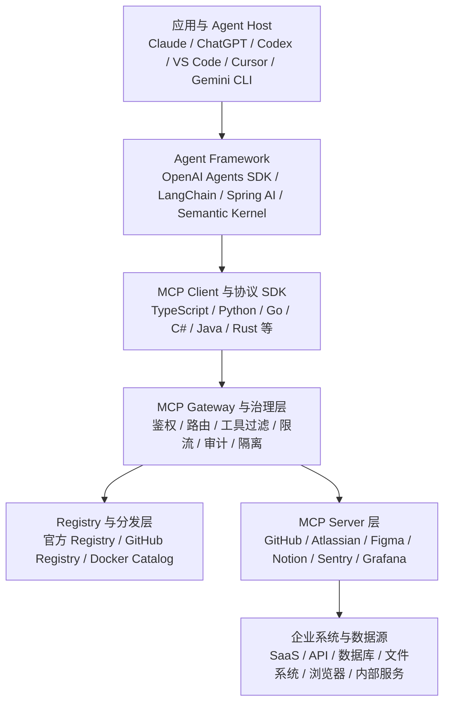
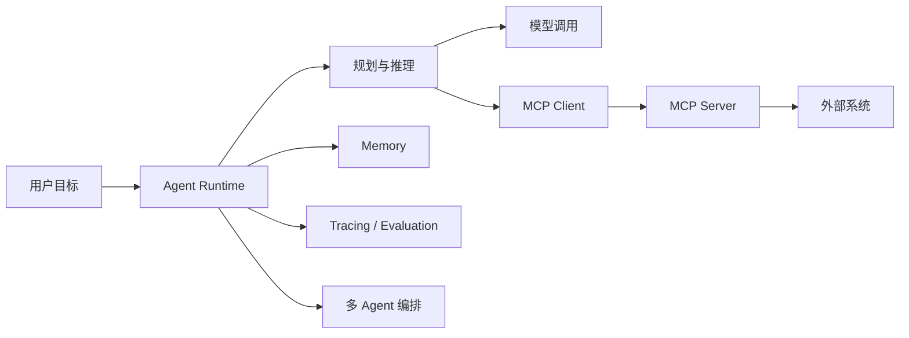
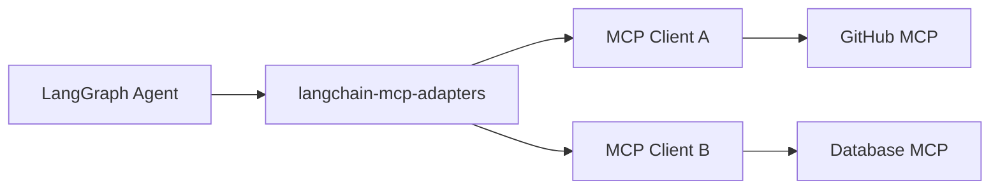
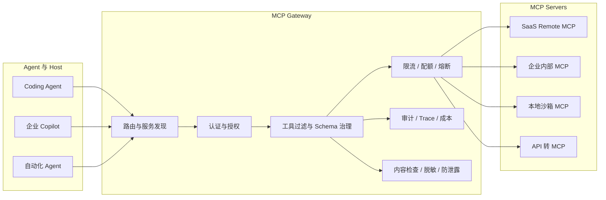
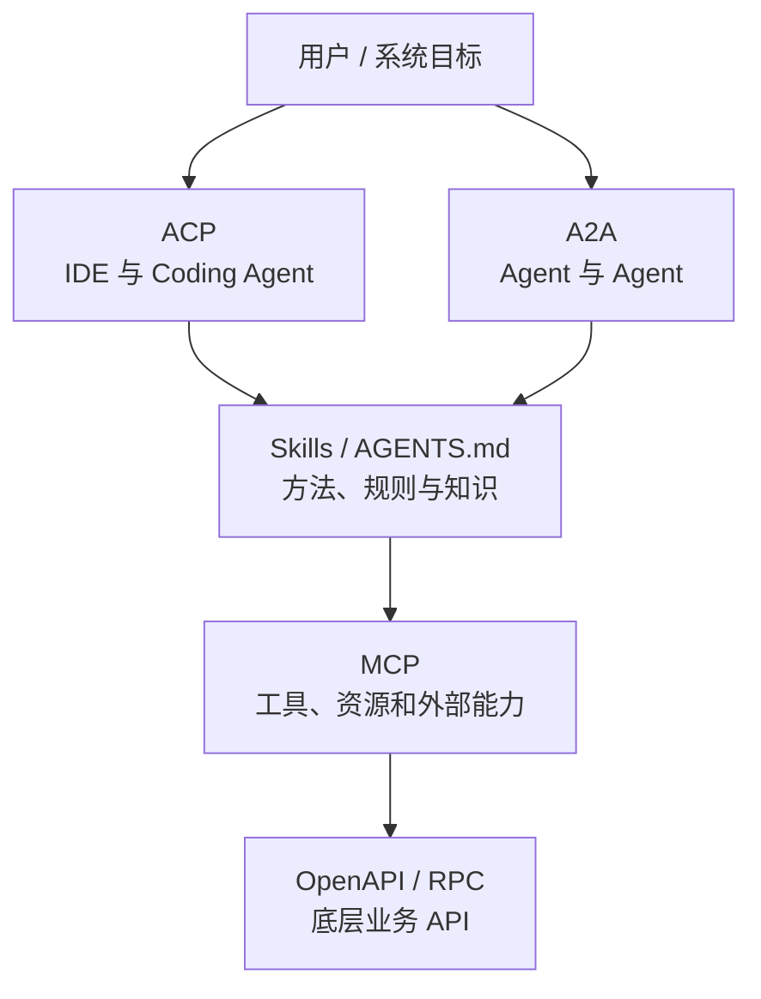
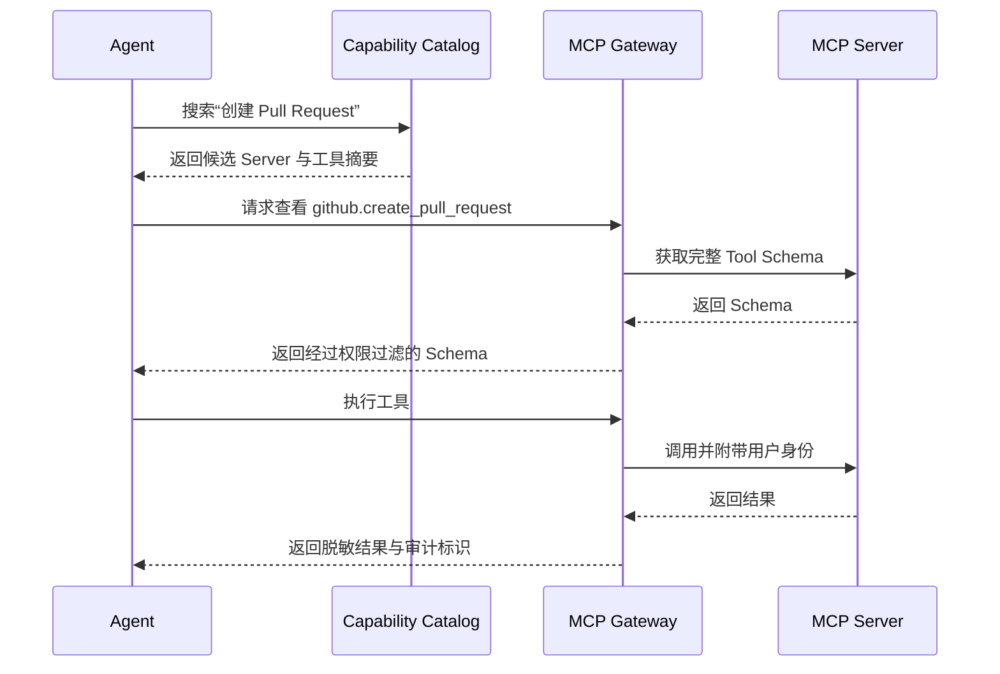
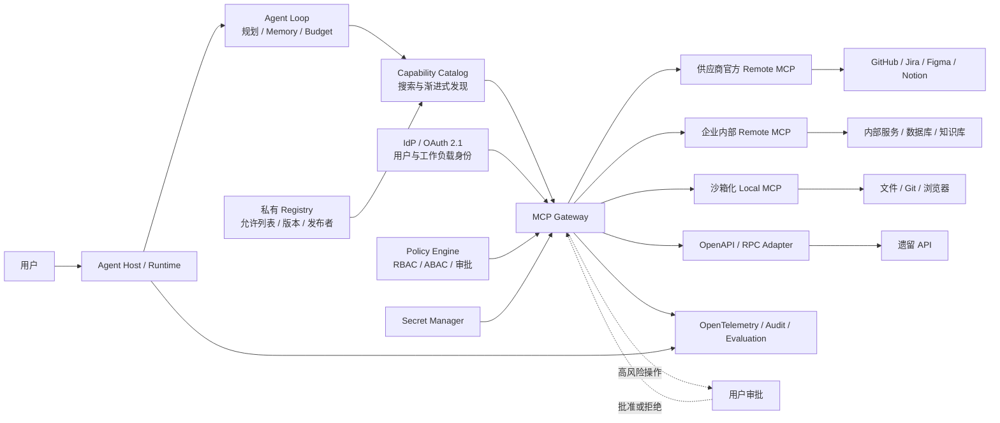
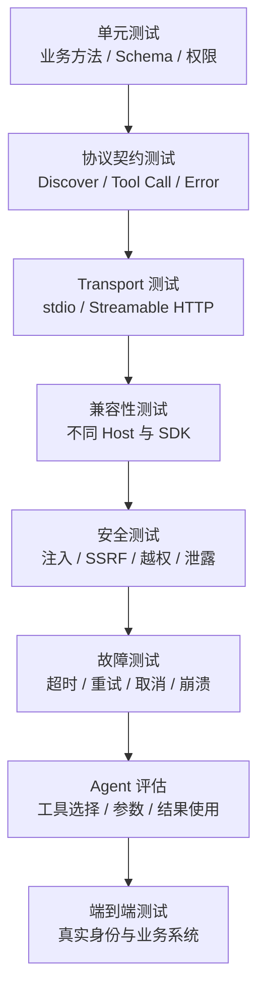

# 附录 R：主流 MCP 系统全景

> 定位：**MCP 生态赛道的全景调研报告**（全文收录，信息基准 2026-08-30，协议规范见 [C-03]、生态官方入口见 [C-42]）。与相邻内容的分工：第 8 章讲 MCP 协议本身的机制（三角色三原语三传输、2026-07-28 无状态化、描述投毒防御、与原生工具的取舍），本附录是整个生态的地图——协议演进动态、Host 与客户端、SDK 与开发框架、Server 生态、Registry/Marketplace、企业 Gateway、与其他协议的关系、安全风险全景与企业基线、工具数量与上下文膨胀治理、参考架构与选型、开发测试与可观测体系、成熟度判断。名单会过期，"协议机制 → 生态四层（Host/Server/Registry/Gateway）"的框架不过期；协议版本以 [C-03] 的 pin 纪律为准。

---

## R.1 结论先行

当前 MCP 生态已经形成七层结构：



从技术和产业趋势看，可以得到五个核心判断：

1. **MCP 已成为主流 Agent 的通用能力接入协议之一**，但它负责的是上下文和外部能力交换，不负责 Agent 的规划、推理、记忆和多 Agent 编排。
2. 企业生产环境的主流形态正在从“Host 直接连接大量 Server”转向 **Host → Gateway → MCP Server**。
3. 本地 `stdio` 仍适合开发工具和个人环境；面向企业与 SaaS 的能力正在转向 **Remote MCP + OAuth 2.1 + 集中治理**。
4. Registry 解决的是“发现和分发”，不是“安全可信”。软件签名、来源校验、权限审批、网络隔离和行为审计仍需单独建设。
5. MCP 下一阶段的竞争重点不再是“支持多少个工具”，而是 **渐进式工具发现、Agent 身份、异步任务、事件订阅、MCP Apps、Skills 分发和跨组织授权**。

参考：[MCP Architecture](https://modelcontextprotocol.io/docs/2026-07-28/learn/architecture)

---

## R.2 MCP 到底是什么

MCP，即 Model Context Protocol，是 Host、Client 与 Server 之间交换上下文和能力的开放协议。

典型角色如下：

| 角色 | 职责 | 常见产品 |
|---|---|---|
| MCP Host | 承载用户会话、模型、Agent Loop、权限交互和多个 MCP Client | Claude、ChatGPT、VS Code、Cursor、Gemini CLI |
| MCP Client | 负责和某一个 MCP Server 通信、发现能力、发起调用 | Host 内部客户端、Agent SDK |
| MCP Server | 对外暴露工具、资源、提示模板或扩展能力 | GitHub MCP、Figma MCP、内部数据库 MCP |
| Capability Provider | 真正执行业务操作的后端 | GitHub API、Jira、数据库、文件系统 |
| Gateway | 统一代理多个 Server，实施策略、鉴权、审计和路由 | AWS AgentCore Gateway、Azure APIM、Docker MCP Gateway |

在经典架构中，一个 Host 通常为每个 MCP Server 创建独立 Client。数据层采用 JSON-RPC 风格消息，传输层主要包括本地 `stdio` 和远程 Streamable HTTP。MCP 核心能力长期围绕工具、资源、提示模板和通知展开。

MCP 不等于 Agent Framework：



其中，规划、模型选择、上下文压缩、长期记忆、失败恢复、多 Agent 协作等仍属于 Agent Runtime；MCP 只标准化 Runtime 与外部能力之间的一部分边界。

参考：[MCP Architecture](https://modelcontextprotocol.io/docs/2026-07-28/learn/architecture)

---

## R.3 2026 年 MCP 协议发生了什么变化

当前主线规范版本为 **2026-07-28**。相较 2024—2025 年的 MCP，它已经不只是一次增量升级，而是一次面向大规模远程部署的架构调整。

参考：[MCP 2026-07-28 Release](https://blog.modelcontextprotocol.io/posts/2026-07-28/)

### R.3.1 从会话协议转向无状态请求

新版核心协议取消了对初始化握手和长期协议会话的强依赖：

- 不再依赖早期的 `initialize` / `initialized` 生命周期；
- 不再把 `Mcp-Session-Id` 作为核心协议前提；
- 每个请求应尽可能携带独立处理所需的信息；
- Server 状态应通过显式句柄或业务资源表达，而不是隐式绑定到连接。

这使 MCP 更容易部署在负载均衡器、Serverless、边缘网络和弹性容器环境中，也降低了连接迁移和实例故障时的状态恢复复杂度。

### R.3.2 引入统一能力发现

新版要求 Server 支持 `server/discover`，客户端可以按需获取 Server 能力，而不必一次性把所有工具定义塞入模型上下文。

这为以下能力奠定了基础：

- 按业务域检索工具；
- 延迟加载工具 Schema；
- 大规模 Server Catalog；
- Gateway 聚合数百乃至数千个工具；
- 根据用户权限动态过滤可见能力；
- 缓存工具和资源目录。

同时，协议增加了 `ttlMs`、`cacheScope` 等缓存提示，使工具目录和资源目录更适合 CDN、Gateway 和多级缓存。

### R.3.3 Server 主动回调转向可恢复请求

早期协议中的 Server 主动请求容易产生双向连接、路由和横向扩展问题。新版通过 **MCP Request-To-Request，MRTR** 思路，把需要补充输入、用户审批或异步恢复的流程表达为：

1. Server 返回 `input_required`；
2. Client 获取用户输入或授权；
3. Client 使用关联信息重新提交请求；
4. Server 恢复执行。

这比维持复杂的双向会话更适合 HTTP 基础设施。

### R.3.4 正式扩展机制

部分并非所有 Server 都需要的能力被移入正式 Extension 体系，例如：

- 异步 Tasks；
- MCP Apps；
- Enterprise Managed Authorization；
- 后续可能出现的事件、订阅和工作负载身份扩展。

这样可以保持核心协议精简，同时允许企业和特定 Host 协商更高级的功能。

### R.3.5 授权模型进一步强化

远程 MCP 的授权方向建立在 OAuth 2.1、受保护资源元数据、授权服务器发现和发行方校验之上。新版进一步推动 Client ID Metadata Documents，并弱化早期动态客户端注册模式，以降低错误注册、发行方混淆和凭证误用风险。

参考：[MCP Authorization](https://modelcontextprotocol.io/specification/2026-07-28/basic/authorization)

### R.3.6 旧能力进入弃用轨道

新版对部分旧机制启动了明确的弃用周期，包括旧式 HTTP+SSE 传输，以及部分早期客户端/服务端原语。规范强调弃用需要保留迁移窗口，而不是立即删除，以减少不同 Host、SDK 和 Server 之间的断层。

---

## R.4 主流 MCP Host 与客户端系统

### R.4.1 Anthropic 体系

#### Claude Desktop / Claude Code

Claude 是 MCP 最早、最完整的 Host 体系之一。Claude Code 可连接本地和远程 MCP Server，把代码仓库、Issue、数据库、设计工具和内部平台纳入编码工作流。

典型能力包括：

- 本地 `stdio` Server；
- Remote MCP；
- 项目级与用户级配置；
- 工具发现和调用；
- 基于用户交互的权限确认；
- 与 Coding Agent 工作流结合。

参考：[Claude Code MCP](https://docs.anthropic.com/en/docs/claude-code/mcp)

#### Anthropic Messages API MCP Connector

Anthropic 还提供 API 侧 MCP Connector，使应用可以直接配置远程 MCP Server，而不必自行实现完整 MCP Client。它支持多个 Server、OAuth、工具允许列表、拒绝列表以及按工具配置，目前相关能力仍处于 Beta 演进阶段。

参考：[Anthropic MCP Connector](https://docs.anthropic.com/en/docs/agents-and-tools/mcp-connector)

### R.4.2 OpenAI 体系

OpenAI 已将 MCP 扩展到多个产品面，包括 Responses API、Agents SDK、Codex 以及 ChatGPT Apps/Connectors 场景。Responses API 能够调用 Remote MCP Server，并可针对敏感工具设置显式审批。

OpenAI 体系的特点是：

- MCP 调用与模型 Responses 生命周期集成；
- 支持受控的自动批准或逐次批准；
- 支持 OpenAI 维护的 Connector；
- 推荐优先使用服务提供商官方托管的 MCP，而不是来源不明的中间代理；
- 通过 Secure MCP Tunnel 访问防火墙内或私有网络中的 MCP Server。

Secure MCP Tunnel 采用客户环境主动建立出站 HTTPS 连接的方式，使内部服务不必直接暴露到公网。

参考：[OpenAI Connectors and Remote MCP](https://developers.openai.com/api/docs/guides/tools-connectors-mcp)

### R.4.3 Microsoft 与 GitHub 体系

#### Visual Studio Code / GitHub Copilot

VS Code 已形成较完整的 MCP Host 能力：

- 工具、资源和提示模板；
- MCP Apps 交互界面；
- Server 信任提示；
- 工具执行确认；
- 企业集中策略；
- macOS 和 Linux 上的本地 Server 沙箱能力。

VS Code 官方同时明确提示：本地 MCP Server 本质上可能执行任意代码，因此安装和启用一个 MCP Server，应被视为安装本地软件，而不是简单添加一个 API。

参考：[VS Code MCP Servers](https://code.visualstudio.com/docs/agent-customization/mcp-servers)

#### GitHub MCP Server 与 GitHub MCP Registry

GitHub 提供官方 MCP Server，可访问仓库、Issue、Pull Request、Actions 等能力，并支持本地和远程部署。

GitHub 通过 Toolsets 对工具分组，避免将所有 GitHub 操作一次性暴露给 Agent。Toolset 越小，通常意味着：

- 上下文占用更低；
- 模型选错工具的概率更低；
- 权限面更小；
- 工具审计更清晰。

GitHub MCP Registry 则作为精选 MCP Server 目录公开预览，并提供面向 Agent 的运行时发现机制。企业还可以通过自定义 Registry 限制组织成员可安装的 MCP Server。

参考：[GitHub MCP Server](https://docs.github.com/en/copilot/how-tos/provide-context/use-mcp-in-your-ide/set-up-the-github-mcp-server)

### R.4.4 Google 体系

#### Gemini CLI

Gemini CLI 支持通过 `mcpServers` 配置多个 MCP Server，并可设置全局允许列表和排除列表。其 MCP 能力主要面向编码、本地开发和命令行 Agent 场景。

参考：[Gemini CLI MCP Server](https://geminicli.com/docs/tools/mcp-server/)

#### Google Cloud 与 Apigee

Google Cloud 提供托管 MCP Server 和企业 API 到 MCP 的集成能力；Apigee 可以将已有 OpenAPI API 转换成受治理的 MCP 工具，并复用 API Gateway 的身份、流量控制、分析和策略体系。

需要注意版本兼容性：截至当前，Google Cloud 托管 MCP 文档标注支持的是 **2025-11-25** 规范，而 MCP 最新主线已经进入 **2026-07-28**。企业选型时不能只检查“是否支持 MCP”，还需要检查支持的具体规范版本和扩展。

参考：[Google Cloud MCP Overview](https://docs.cloud.google.com/mcp/overview)

### R.4.5 独立 Coding Agent 与 IDE

主流 Coding Agent 基本都已提供不同程度的 MCP 支持：

| 系统 | MCP 定位 |
|---|---|
| Cursor | IDE 内部的工具、资源、提示模板和远程 Server 接入 |
| Windsurf | Coding Agent 外部工具集成 |
| Cline | VS Code 内自主 Agent，可配置和管理 MCP Server |
| Zed | 编辑器内 Context Server / MCP 接入 |
| Goose | 本地 Agent 的扩展和工具协议 |
| OpenCode | 终端 Coding Agent 的外部能力接入 |
| Continue | IDE Agent 与外部上下文、工具连接 |

其中 Cursor 已支持 `stdio`、SSE 和 Streamable HTTP 等多种连接形式；不同客户端对新版无状态协议、MCP Apps、OAuth、Tasks 和渐进式发现的支持程度仍不完全一致。

参考：[Cursor MCP](https://cursor.com/docs/mcp)

---

## R.5 MCP SDK 与开发框架全景

### R.5.1 官方 SDK

2026 年 MCP 官方重点维护的 Tier 1 SDK 包括：

- TypeScript；
- Python；
- Go；
- C#。

Rust SDK 处于 Beta 阶段。官方生态中还可以看到 Java、Kotlin、PHP、Ruby、Swift 等语言实现，但“存在 SDK”和“达到同等成熟度、规范同步速度及兼容性保障”并不是一回事。

选型建议：

| 场景 | 优先方案 |
|---|---|
| Node.js / Web 平台 | 官方 TypeScript SDK |
| Python Agent / AI 平台 | 官方 Python SDK 或 FastMCP |
| Go 基础设施 / Gateway | 官方 Go SDK |
| .NET 企业应用 | 官方 C# SDK |
| Java / Spring 企业平台 | Spring AI MCP |
| Rust 桌面端 / 系统工具 | 官方 Rust SDK 或自行封装协议层，但需关注 Beta 兼容性 |

参考：[MCP 2026-07-28 Release](https://blog.modelcontextprotocol.io/posts/2026-07-28/)

### R.5.2 FastMCP

FastMCP 是 Python 生态中影响较大的 MCP Server、Client 和 App 开发框架，提供：

- 装饰器式 Tool、Resource、Prompt 定义；
- 依赖注入；
- OAuth 与远程部署；
- 测试和开发工具；
- Proxy 和组合能力；
- MCP Apps；
- 新版无状态协议适配。

FastMCP 4 已开始面向 2026-07-28 规范演进，但相关新版能力仍需要关注预发布状态和兼容性说明。

参考：[FastMCP](https://gofastmcp.com/getting-started/welcome)

### R.5.3 LangChain MCP Adapters

LangChain 通过 `langchain-mcp-adapters` 将 MCP Server 转换为 LangChain Tool，并提供 `MultiServerMCPClient` 聚合多个 Server。它更适合已经使用 LangGraph 或 LangChain Agent Runtime 的系统。

其定位是 **MCP 适配层**，而不是 MCP Gateway：



参考：[LangChain MCP](https://docs.langchain.com/oss/python/langchain/mcp)

### R.5.4 Spring AI MCP

Spring AI 提供同步和异步 MCP Client/Server、Spring Boot Starter、注解式工具定义，以及 `stdio`、SSE、Streamable HTTP 等传输支持，适合 Java 企业服务和现有 Spring Security、Spring Cloud 体系。

参考：[Spring AI MCP](https://docs.spring.io/spring-ai/reference/api/mcp/mcp-overview.html)

### R.5.5 Semantic Kernel

Semantic Kernel 可以把本地或远程 MCP Server 导入为 Kernel Plugin，适合 .NET、Azure 和企业 Copilot 类应用。

参考：[Semantic Kernel MCP Plugins](https://learn.microsoft.com/en-us/semantic-kernel/concepts/plugins/adding-mcp-plugins)

### R.5.6 OpenAI Agents SDK

OpenAI Agents SDK 将 MCP Server 纳入 Agent 的工具体系，并与 Agent Loop、Tracing、Handoff 和模型调用集成。它适合使用 OpenAI 模型与 Responses API 构建后端 Agent，而不是单独承担 MCP Server 治理。

参考：[OpenAI Agents SDK MCP](https://openai.github.io/openai-agents-python/mcp/)

---

## R.6 主流 MCP Server 生态

MCP Server 可以按能力来源分为六类。

### R.6.1 开发与代码协作

| MCP Server | 核心能力 |
|---|---|
| GitHub MCP | 仓库、Issue、Pull Request、Actions、代码搜索 |
| Git MCP | 本地仓库读取、Diff、提交历史 |
| Filesystem MCP | 文件读写、目录遍历 |
| Playwright MCP | 浏览器自动化、页面交互和可访问性快照 |
| Sentry MCP | 错误、Issue、性能和项目数据 |
| Linear MCP | Issue 和项目管理 |

GitHub、Microsoft Playwright 和 Sentry 均提供官方或供应商维护的 MCP 实现。

### R.6.2 企业协作与知识库

| MCP Server | 核心能力 |
|---|---|
| Atlassian Rovo MCP | Jira、Confluence、Bitbucket |
| Notion MCP | 页面、数据库、内容检索和写入 |
| Slack MCP | 消息、频道、搜索和协作 |
| Microsoft 365 MCP | Outlook、Teams、SharePoint 等 |
| Google Workspace MCP | Gmail、Calendar、Drive、Docs 等 |

Atlassian Rovo MCP 是云托管 Remote MCP，使用 OAuth 2.1 并支持权限分组；Notion 已将重点转向官方托管 Remote MCP，而早期本地开源实现不再是主要维护方向。

参考：[Atlassian Rovo MCP](https://support.atlassian.com/atlassian-rovo-mcp-server/docs/getting-started-with-the-atlassian-remote-mcp-server/)

### R.6.3 设计与产品研发

Figma MCP 可把设计上下文提供给 Coding Agent，并支持将 Agent 生成的内容写入 Figma 画布。它代表了 MCP 从纯文本工具调用向可交互应用和双向创作延伸的方向。

参考：[Figma MCP Server](https://developers.figma.com/docs/figma-mcp-server/)

### R.6.4 可观测性和运维

| MCP Server | 能力 |
|---|---|
| Datadog MCP | 指标、日志、Trace、事件、监控数据 |
| Grafana MCP | Dashboard、Prometheus、Loki、Alert、Incident |
| Sentry MCP | 错误分析、性能问题、Release |
| Kubernetes MCP | 集群资源、Pod、日志和运维操作 |
| Cloud Provider MCP | 云资源、成本、配置和运维 |

Grafana 同时提供开源自托管 MCP 和 Grafana Cloud Remote MCP；Datadog 则把可观测数据和调查流程暴露给 Agent。

参考：[Datadog MCP Server](https://docs.datadoghq.com/mcp_server/)

### R.6.5 数据库和数据平台

典型 MCP Server 包括：

- PostgreSQL、MySQL、SQLite；
- Snowflake、BigQuery、Databricks；
- Elasticsearch、MongoDB、Redis；
- 向量数据库；
- BI 和数据目录平台。

这类 Server 风险较高。生产环境不应简单暴露一个“任意 SQL 执行工具”，而应采用：

- 只读身份；
- Schema 允许列表；
- 查询模板；
- 行数和执行时间限制；
- SQL AST 校验；
- 敏感字段脱敏；
- 写操作单独 Server；
- 用户级审计。

### R.6.6 官方参考 Server

官方参考仓库包含 Everything、Fetch、Filesystem、Git、Memory、Sequential Thinking、Time 等示例 Server，但官方明确将它们定位为参考和教学实现，而不是可直接用于生产环境的安全产品。

参考：[MCP Reference Servers](https://github.com/modelcontextprotocol/servers)

---

## R.7 Registry、Catalog 与 Marketplace

### R.7.1 官方 MCP Registry

官方 MCP Registry 当前仍处于 Preview 阶段，主要存放公开 MCP Server 的元数据。Registry 条目可以指向：

- npm；
- PyPI；
- Docker 镜像；
- 远程 MCP URL；
- 源代码和文档。

官方 Registry 当前不负责托管私有企业 Server，也不等同于代码安全扫描平台。它通过命名空间和发布来源提高可验证性，但实际包安全仍需要依赖包仓库、聚合平台和企业自己的供应链控制。

参考：[MCP Registry](https://modelcontextprotocol.io/registry/about)

### R.7.2 GitHub MCP Registry

GitHub MCP Registry 是精选型目录，更偏向开发者和 Coding Agent 生态，并支持 Agent 在运行时搜索适用 Server。

参考：[GitHub MCP Concepts](https://docs.github.com/en/copilot/concepts/context/mcp)

### R.7.3 Docker MCP Catalog 与 Toolkit

Docker MCP Catalog 和 Toolkit 提供容器化的 MCP Server 分发、配置和运行能力，Catalog 已收录数百个经过整理的 Server，并与 Docker Desktop、客户端配置和 MCP Gateway 联动。

其主要价值是：

- 容器隔离；
- 镜像版本管理；
- Server 生命周期管理；
- 凭证注入；
- 统一日志；
- 多客户端共享；
- 降低本地 `npx`、`uvx` 等方式直接执行第三方代码的风险。

Docker MCP Toolkit 及部分动态发现能力仍处于 Beta 或实验阶段。

参考：[Docker MCP Catalog and Toolkit](https://docs.docker.com/ai/mcp-catalog-and-toolkit/)

### R.7.4 社区目录

常见社区平台包括：

- Smithery；
- Glama；
- PulseMCP；
- 各类 GitHub Awesome MCP 列表。

它们适合搜索和发现，但不应被默认视为安全认证机构。企业引入时仍要回到源代码、发布者身份、依赖树、签名、SBOM 和运行权限进行审核。

参考：[Smithery Registry](https://smithery.ai/docs/concepts/registry_search_servers)

---

## R.8 企业 MCP Gateway 全景

Gateway 是 MCP 从个人工具走向企业生产系统的关键组件。



### R.8.1 AWS Bedrock AgentCore Gateway

AgentCore Gateway 可把 API、Lambda 和其他能力转换或聚合为 Agent 可调用的 MCP 工具，并提供索引、发现和与 AgentCore Runtime 的集成。它更接近 AWS Agent 平台中的托管 MCP 控制面。

参考：[AWS AgentCore Gateway](https://docs.aws.amazon.com/bedrock-agentcore/latest/devguide/gateway-target-MCPservers.html)

### R.8.2 Azure API Management 与 API Center

Azure API Management 可以：

- 将 REST API 操作暴露为 MCP Tools；
- 代理现有 MCP Server；
- 实施身份认证、限流、缓存、监控和策略；
- 与 Azure API Center 的私有 Registry 配合。

当前 Azure APIM 的 MCP 产品能力更偏重 Tools，对 Resources、Prompts 等完整协议面的支持需要逐项核对。

参考：[Azure API Management MCP](https://learn.microsoft.com/en-us/azure/api-management/mcp-server-overview)

### R.8.3 Google Apigee

Apigee 的方向是把现有 API 资产转换成受治理的 MCP 工具，并复用企业原有 API 管理能力：

- OAuth；
- 配额；
- 威胁防护；
- API 分析；
- 开发者门户；
- 生命周期管理。

这类方案适合已经拥有大量 OpenAPI 和 API Gateway 资产的企业。

参考：[Apigee MCP Support](https://cloud.google.com/blog/products/ai-machine-learning/mcp-support-for-apigee)

### R.8.4 Cloudflare

Cloudflare Workers 和 Agents SDK 支持构建及部署 Remote MCP Server。Cloudflare 还提供面向 MCP 的集中门户、身份策略、工具范围策略和审计能力，并强调 Remote MCP 相对于未经治理的本地 Server 更适合企业控制。

参考：[Cloudflare MCP](https://developers.cloudflare.com/agents/model-context-protocol/)

### R.8.5 Docker MCP Gateway

Docker MCP Gateway 是偏本地和开发平台方向的开源网关，重点解决：

- 多 Server 聚合；
- 容器隔离；
- 启停和生命周期；
- 凭证管理；
- 日志与 Trace；
- 与不同 MCP Host 对接。

它适合开发者工作站、企业桌面环境和内部 Coding Agent 平台。

参考：[Docker MCP Gateway](https://docs.docker.com/ai/mcp-catalog-and-toolkit/mcp-gateway/)

### R.8.6 API Gateway 厂商

传统 API Gateway 厂商也在扩展 MCP 管理能力：

| 产品 | 主要方向 |
|---|---|
| Kong MCP Gateway | 聚合端点、OAuth 2.1、工具级访问控制 |
| Tyk MCP Gateway | MCP 请求代理和 API 管理策略 |
| Gravitee AI Gateway | MCP Proxy、AI 流量策略和可观测性 |
| Solo agentgateway | 同时面向 MCP 和 A2A 的 Agent Gateway |

这说明 MCP Gateway 正在成为 API Gateway 的新一代工作负载类型，而不是完全独立于 API 管理体系的新孤岛。

参考：[Kong Internal MCP Gateway](https://developer.konghq.com/cookbooks/secure-internal-mcp-gateway/)

---

## R.9 MCP 与其他协议、技术的关系

| 技术 | 解决的问题 | 与 MCP 的关系 |
|---|---|---|
| Function Calling | 模型如何输出结构化工具调用 | MCP 可以把远端能力转换为模型可调用工具 |
| OpenAPI | 描述 HTTP API | API Gateway 可将 OpenAPI Operation 映射为 MCP Tool |
| RAG | 检索并构造模型上下文 | MCP 可提供检索工具或资源，但不定义召回和排序算法 |
| Agent Skills | 指令、流程、知识和任务方法 | Skill 描述“如何做”，MCP 提供“可调用什么” |
| A2A | Agent 与 Agent 之间的发现、通信和任务协作 | MCP 连接 Agent 与工具；A2A 连接 Agent 与 Agent |
| ACP | IDE、编辑器与 Coding Agent 之间的协议 | ACP 更偏 Agent 交互，MCP 更偏能力调用 |
| AGENTS.md | 仓库级 Agent 指令 | 属于静态规则和上下文，不是远程工具协议 |
| Plugin 系统 | 应用内扩展代码和 UI | Plugin 可包含 MCP Client、Server 或其他扩展 |
| Connector | 某个平台封装的外部服务连接 | Connector 可能以 MCP 为底层，也可能是平台私有实现 |

Azure APIM 和 Apigee 已经展示了 OpenAPI 到 MCP Tool 的产品化路径；A2A 1.0 则进一步明确了 Agent 间协议与 MCP 工具协议的互补关系。

可以将它们理解为：



---

## R.10 MCP 安全风险全景

MCP 的最大风险并不在 JSON-RPC 协议本身，而在于它把模型决策连接到了真实系统。

### R.10.1 Prompt Injection 与 Tool Output Injection

恶意内容可能隐藏在：

- 网页；
- Issue；
- 邮件；
- 文档；
- 数据库记录；
- MCP Tool 返回值；
- Resource 内容。

模型读取这些内容后，可能被诱导调用高权限工具。

**控制措施：**

- 把 Tool Output 视为不可信输入；
- 数据内容与系统指令分离；
- 不允许 Tool Output 自动提升权限；
- 写操作必须经过策略判断；
- 对高风险操作增加人工审批；
- 限制跨 Server 数据传递。

### R.10.2 过度授权

常见错误包括：

- 给 Agent 整个 GitHub 组织管理员权限；
- 使用共享数据库超级用户；
- 同一 Server 同时包含查询和删除能力；
- 为所有用户使用统一服务账号；
- 允许模型调用未使用的工具。

应采用按用户、按租户、按 Agent、按 Server 和按 Tool 的最小权限控制。

### R.10.3 本地 Server 任意代码执行

使用如下配置启动 MCP：

```json
{
  "command": "npx",
  "args": ["-y", "unknown-mcp-package"]
}
```

本质上等于在用户机器上执行第三方代码。它可能访问：

- 用户目录；
- SSH Key；
- 云凭证；
- Git Credential；
- 浏览器数据；
- 本地网络；
- 其他项目源代码。

VS Code 官方已明确提醒本地 MCP Server 具备执行任意代码的能力，并为部分平台提供沙箱机制。

参考：[VS Code MCP Servers](https://code.visualstudio.com/docs/agent-customization/mcp-servers)

### R.10.4 OAuth 与身份混淆

Remote MCP 常见风险包括：

- Token Passthrough；
- 错误使用其他服务的 Access Token；
- Authorization Server 发行方混淆；
- 多租户 Token 串用；
- Agent 代表用户执行操作时缺乏委托链；
- Server 用高权限服务账号绕过用户权限。

新版授权规范要求更严格地处理资源标识、授权服务器发现、发行方校验和客户端元数据。

参考：[MCP Authorization](https://modelcontextprotocol.io/specification/2026-07-28/basic/authorization)

### R.10.5 Registry 与供应链攻击

Registry 元数据可信，不代表运行包一定安全。可能出现：

- 名称仿冒；
- 包接管；
- 恶意依赖；
- 镜像标签漂移；
- Server 更新后新增危险工具；
- Tool Description 被篡改；
- 同版本不同内容；
- 已审核 Server 动态加载未审核插件。

官方 Registry 也明确把代码扫描和软件包安全交给下游包仓库、聚合平台和企业治理系统。

参考：[MCP Registry](https://modelcontextprotocol.io/registry/about)

### R.10.6 SSRF 与网络横向移动

能够获取 URL、访问 HTTP 或执行浏览器操作的 MCP Server，可能被利用访问：

- 云实例元数据；
- 内网管理后台；
- Kubernetes API；
- 本地回环服务；
- 其他租户地址；
- 未授权文件协议。

必须实施出站网络白名单、DNS 和 IP 复验、私网地址拦截、重定向次数限制和协议白名单。

---

## R.11 企业级 MCP 安全基线

建议至少落实以下控制面：

| 控制域 | 最低要求 |
|---|---|
| Server 来源 | 优先供应商官方 Remote MCP；第三方 Server 必须审核 |
| 身份 | 用户级 OAuth 或工作负载身份，不共享高权限 Token |
| 权限 | Server、Tool、Resource 和参数级允许列表 |
| 写操作 | 删除、发布、转账、外发、权限修改等必须审批 |
| 隔离 | 本地 Server 使用容器、沙箱或受限进程 |
| 网络 | 默认禁止任意出站，仅允许业务目标域名 |
| 凭证 | 由 Gateway 注入，不进入 Prompt、配置文件或 Tool Output |
| Schema | 参数长度、枚举、路径、URL、SQL 和文件类型校验 |
| 供应链 | 固定版本、签名、哈希、SBOM 和来源验证 |
| 审计 | 记录用户、Agent、Server、Tool、参数摘要、决策和结果 |
| 可观测 | Trace、延迟、错误、Token、调用成本、审批和策略命中 |
| 生命周期 | 新增工具或 Schema 变化需重新审批 |
| 数据治理 | 敏感字段脱敏，限制跨 Server 数据流动 |
| 应急 | Server Kill Switch、凭证撤销、租户隔离和审计回放 |

---

## R.12 工具数量与上下文膨胀问题

早期 MCP Host 通常在会话开始时加载所有工具 Schema。当接入几十个 Server、数百个工具后，会产生：

- 大量上下文占用；
- 工具名称冲突；
- 模型选择错误；
- 首次请求延迟；
- 权限暴露面过大；
- Schema 更新成本高；
- 每轮重复发送相同定义。

官方建议根据上下文窗口占用情况转向渐进式发现。文档给出的经验区间是，当工具定义占到上下文窗口约 **1%—5%** 时，应认真考虑 Catalog、Search、Inspect、Execute 模式，而不是预加载所有工具。

参考：[MCP Client Best Practices](https://modelcontextprotocol.io/docs/2026-07-28/develop/clients/client-best-practices)

推荐结构：



这类 **Catalog → Inspect → Execute** 模式将成为大型 MCP 平台的基础能力。

---

## R.13 推荐的企业 MCP 参考架构



这一架构中：

- **Registry** 管“哪些 Server 可以存在”；
- **Catalog** 管“Agent 现在应该看到哪些能力”；
- **Gateway** 管“这次调用是否允许”；
- **OAuth/IdP** 管“谁代表谁执行”；
- **Sandbox** 管“Server 即使恶意能影响什么”；
- **Observability** 管“发生了什么、为什么发生”；
- **Evaluation** 管“Agent 是否正确选择和使用了工具”。

---

## R.14 不同场景如何选型

| 场景 | 推荐组合 |
|---|---|
| 个人开发和试验 | Claude Code、Cursor、Cline + 少量本地 `stdio` Server + MCP Inspector |
| 团队 Coding Agent | VS Code、Claude Code、Cursor + GitHub/Figma/Sentry 官方 Remote MCP + 项目级允许列表 |
| Python Agent 后端 | 官方 Python SDK、FastMCP、OpenAI Agents SDK 或 LangChain MCP Adapters |
| Java 企业平台 | Spring AI MCP + Spring Security + 企业 Gateway |
| .NET / Azure | 官方 C# SDK 或 Semantic Kernel + Azure APIM/API Center |
| AWS Agent 平台 | Bedrock AgentCore Gateway + Runtime + 企业身份体系 |
| Google Cloud | Apigee 或托管 MCP，但需验证规范版本和扩展兼容性 |
| 多模型企业平台 | 中立 MCP Gateway + 私有 Registry + Progressive Discovery + OTel |
| 内网服务接入 OpenAI | Remote MCP + Secure MCP Tunnel |
| 高安全桌面环境 | Docker MCP Gateway/Toolkit + 容器隔离 + 版本锁定 |
| 数据分析 Agent | 只读数据库 MCP + 查询模板 + SQL AST 校验 + 结果限额 |

---

## R.15 开发、测试和可观测性体系

### R.15.1 MCP Inspector

官方 MCP Inspector 是最基础的开发和协议调试工具，支持 Web、CLI 和 TUI 形态，可用于：

- 连接测试；
- 工具列表检查；
- Tool Schema 验证；
- Resources 和 Prompts 调试；
- 请求参数构造；
- 返回内容检查；
- 协议兼容性排查。

Inspector 已面向旧协议和 2026-07-28 新协议时代演进。

参考：[MCP Inspector](https://modelcontextprotocol.io/docs/2026-07-28/tools/inspector)

### R.15.2 测试分层

一个生产级 MCP Server 至少需要以下测试：



MCP 官方路线图也把 SDK 一致性、Conformance Suite 和协议产物自动生成列为重点方向，说明跨 SDK、跨 Host 的一致性仍是正在建设的能力。

参考：[MCP Roadmap](https://modelcontextprotocol.io/development/roadmap)

### R.15.3 核心可观测指标

建议记录四类指标：

#### 协议与连接

- Server 连接成功率；
- Discover 延迟；
- Tool Schema 加载时间；
- Transport 错误率；
- 版本协商失败；
- OAuth 获取和刷新失败；
- Server 冷启动时间。

#### 工具执行

- Tool 调用次数；
- 成功率和错误率；
- P50/P95/P99 延迟；
- 超时和取消率；
- 重试次数；
- 参数校验失败；
- 返回数据大小；
- 用户审批率和拒绝率。

#### Agent 效果

- 工具选择准确率；
- 不必要调用率；
- 错误参数率；
- 工具调用后任务完成率；
- 平均工具调用步数；
- 工具结果利用率；
- 跨 Server 数据流转次数；
- 陷入循环率。

#### 安全与治理

- 未授权 Tool 调用；
- 敏感参数命中；
- 出站网络拦截；
- 越权访问；
- 未注册 Server；
- Server 版本漂移；
- Tool Schema 未审批变更；
- 高风险操作审批；
- 凭证访问和注入记录。

新版规范开始标准化 OpenTelemetry Trace Context，为跨 Host、Gateway、Server 和后端系统关联 Trace 奠定基础。

参考：[MCP Changelog](https://modelcontextprotocol.io/specification/2026-07-28/changelog)

---

## R.16 生态成熟度判断

### 已较成熟

- Tools、Resources、Prompts 等基础能力；
- 本地 `stdio`；
- Remote Streamable HTTP；
- 主流 Coding Agent 接入；
- TypeScript、Python、Go、C# SDK；
- 服务提供商官方 Remote MCP；
- OAuth 2.1 基础授权；
- 基本工具调用和人工审批。

### 正在生产化

- 企业 MCP Gateway；
- 私有 Registry；
- Tool 级策略；
- 集中凭证管理；
- 容器和沙箱隔离；
- OpenTelemetry；
- API 到 MCP 转换；
- 大规模 Catalog；
- 多租户 MCP Server；
- 跨客户端一致性测试。

### 仍在快速演进

- 2026-07-28 无状态核心的全生态兼容；
- 渐进式工具发现；
- Agent 身份和委托链；
- DPoP 与工作负载身份联合；
- 异步任务；
- Webhook、Trigger 和订阅；
- MCP Apps 跨 Host 互操作；
- Skills over MCP；
- Tool Result 结构标准化；
- 文件操作能力；
- SDK Conformance 和代码生成。

官方路线图在 2026 年 8 月仍将 Agentic Messaging、HTTP 原生传输统一、Agent Identity、渐进式发现、文件操作和 SDK 一致性列为后续重点。

参考：[MCP Roadmap](https://modelcontextprotocol.io/development/roadmap)

---

## R.17 MCP 未来发展方向

### R.17.1 从工具协议走向能力控制平面

未来 Host 不会直接记住每个 Server 的全部 Tool，而是向能力目录表达需求：

> “我需要一个可以读取当前仓库 CI 失败原因的能力。”

目录根据组织策略、用户身份、成本、地域和可用性返回合适工具。

### R.17.2 Agent 身份取代简单用户 Token

当前 OAuth 主要回答“用户是谁”，但企业还需要回答：

- 哪个 Agent 在操作；
- 使用哪个模型；
- 谁创建了这个 Agent；
- Agent 能代表用户做什么；
- 是否允许二次委托；
- 调用链经过了哪些 Agent；
- 权限是否可以随任务动态收缩。

因此 DPoP、Workload Identity Federation、Token Exchange 和 Agent 身份文档将成为重要方向。

参考：[MCP Roadmap](https://modelcontextprotocol.io/development/roadmap)

### R.17.3 同步调用转向异步任务和事件驱动

构建、部署、数据分析、代码扫描和长时间浏览器任务无法用单次同步 Tool Call 良好表达。MCP 将继续完善：

- Tasks；
- 状态查询；
- 结果恢复；
- 订阅；
- Trigger；
- Webhook；
- 断线后恢复。

### R.17.4 MCP Apps

MCP Apps 使 Server 不只返回文本或 JSON，还可以提供可交互 UI，例如：

- 地图；
- 表单；
- 图表；
- 审批面板；
- 配置器；
- 数据浏览器；
- 设计画布。

这使 MCP 开始接近一种面向 Agent Host 的微型应用协议。

参考：[MCP 2026-07-28 Release](https://blog.modelcontextprotocol.io/posts/2026-07-28/)

### R.17.5 Skills over MCP

Skill 和 MCP 的边界正在逐渐融合：

- Skill 描述任务方法和工作流；
- MCP Server 提供实时工具与数据；
- Registry 负责能力发现；
- Skills over MCP 可进一步负责技能包的发现、获取和更新。

相关工作组已经围绕 Skill 的发现、分发和互操作开展工作。

参考：[Skills over MCP Working Group](https://modelcontextprotocol.io/community/working-groups/skills-over-mcp)

---

## R.18 最终选型判断

对企业而言，MCP 不应被理解为“装几个 Server 的配置功能”，而应被视为 **Agent 访问企业能力的统一边界**。

一个成熟的 MCP 系统至少需要同时具备：

1. **协议兼容层**：适配不同版本、SDK 和传输；
2. **能力目录层**：Server、Tool、Resource、版本和所有者管理；
3. **渐进式发现层**：根据任务动态暴露少量能力；
4. **身份授权层**：用户身份、Agent 身份和委托关系；
5. **策略层**：工具、参数、数据和环境级控制；
6. **执行隔离层**：容器、沙箱、网络与文件系统权限；
7. **审批层**：对高风险操作实施 Human-in-the-loop；
8. **可观测层**：Trace、日志、指标、成本与完整审计；
9. **评估层**：评估模型是否选择了正确工具并正确使用结果；
10. **供应链层**：签名、SBOM、来源和版本不可变性。

因此，2026 年的推荐路线不是：

```text
Agent → 安装大量第三方 MCP Server
```

而是：

```text
Agent Host
   → 能力检索与渐进式发现
   → MCP Gateway
   → 身份、权限、审批与审计
   → 经过验证的官方或内部 MCP Server
   → 企业 API、SaaS、数据库和本地环境
```

MCP 已经基本确立了“Agent 与工具、数据之间通用协议”的行业位置。Anthropic 在 2025 年 12 月将 MCP 捐赠给 Linux Foundation 旗下的 Agentic AI Foundation，Anthropic、Block 和 OpenAI 作为联合创始成员，Google、Microsoft、AWS、Cloudflare 等参与支持，这进一步降低了协议被单一厂商控制的风险。

参考：[Anthropic Donates MCP and Establishes AAIF](https://www.anthropic.com/news/donating-the-model-context-protocol-and-establishing-of-the-agentic-ai-foundation)

真正尚未完全解决的问题，是围绕 MCP 之上的企业能力控制面：**Agent 身份、工具治理、动态发现、隔离执行、跨 Server 数据安全、可观测性以及可验证的软件供应链**。这些将决定 MCP 能否从“Agent 插件生态”真正升级为企业级 Agent 基础设施。

---

> **使用提示**：与其他附录的分工——A 讲模型机制、B 讲方法论、C 记来源、D 列产品、E 辨异同、F 索引图版、G 详解 OTel、H 上手 DeepEval、I 评测观测平台选型、J 上手 Mem0、K 详解记忆晋升机制、L 盘点 Coding Agent 赛道、M 盘点可观测赛道、N 盘点评估赛道、O 盘点 Memory 赛道、P 盘点自进化赛道、Q 盘点多 Agent 赛道、**R 盘点 MCP 生态**、S 盘点沙箱赛道、T 盘点 RAG 赛道、U 盘点 LLM Wiki 赛道、V 解析 Pi 源码、W 解析 Claude Code 源码、X 解析 Codex 源码、Y 解析 OpenCode 源码。对照阅读：MCP 是什么与协议变化（R.2–R.3）对第 8 章与 [C-03] 版本 pin、Host 盘点（R.4）对附录 D 与 J、安全风险与基线（R.10–R.11）对第 8 章 2.4 描述投毒与第 13 章、工具膨胀治理（R.12）对第 5/7 章（上下文税与动态工具集）、Gateway（R.8）对第 21 章网关治理、协议关系（R.9）对第 18 章 A2A、可观测（R.15）对第 14 章与附录 M。信息基准 2026-08-30（[C-42]），发行前按附录 C 清单复核。
