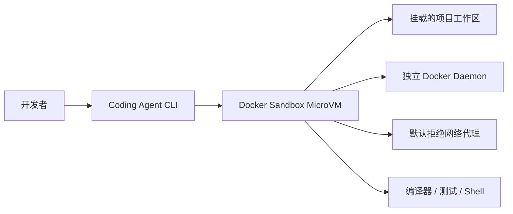
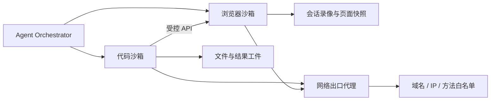
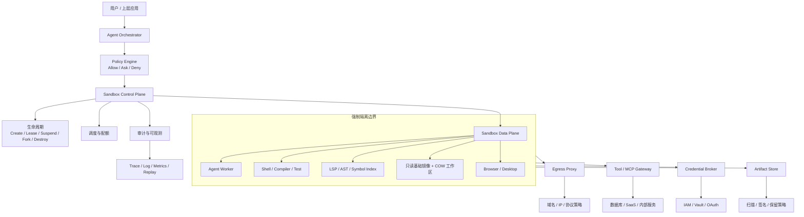
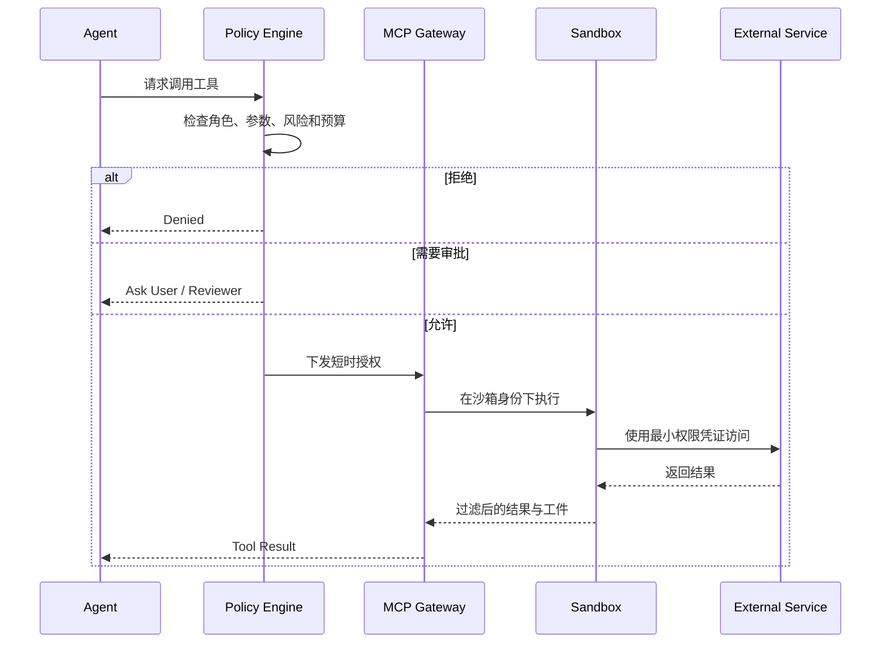
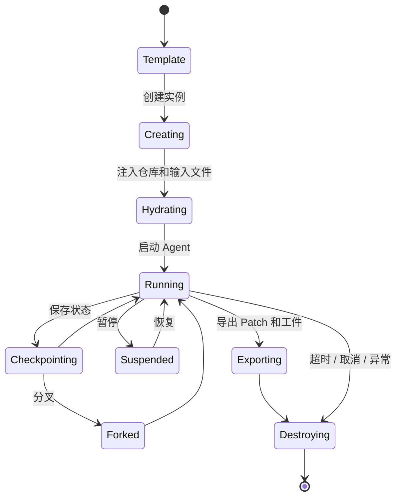
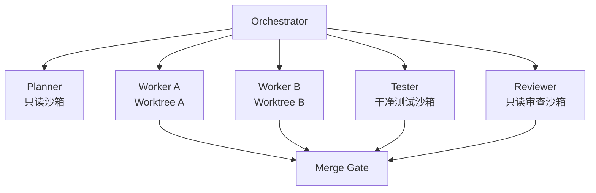
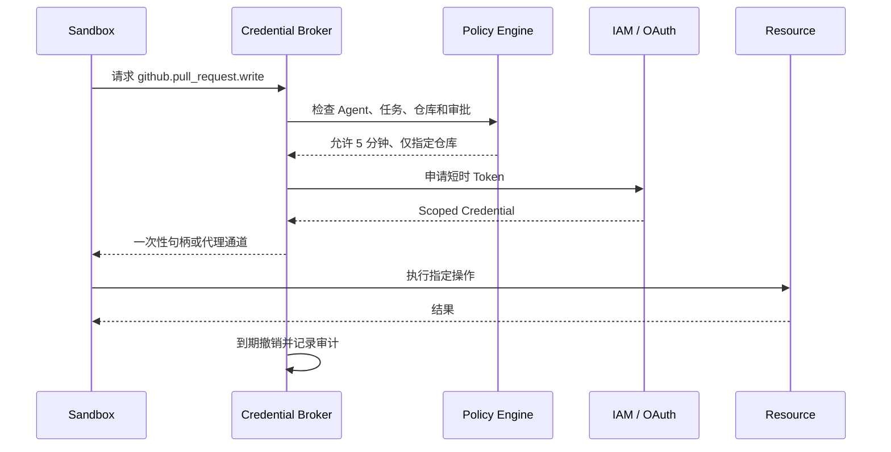

# 附录 S：主流 Agent 沙箱系统全景

> 定位：**Agent 沙箱赛道的全景调研报告**（全文收录，信息基准 2026-08-30，各产品官方入口见 [C-44]）。与相邻内容的分工：第 9 章讲沙箱的机制原理（三层沙箱各拦什么、副作用分级），第 23 章 2.6 讲 Coding 场景的风险面与审批特化，本附录是整个赛道的地图——"Computer as an API"形态收敛、全景分层、原生云沙箱与云厂商方案盘点、Coding Agent 各家沙箱对照、浏览器/桌面沙箱、K8s 自建控制平面、底层隔离技术比较（容器/microVM/gVisor 谱系）、参考架构、状态模型与多 Agent 模式、安全威胁矩阵与凭证设计、可观测指标、评测与选型。名单会过期，"隔离强度谱系 + 网络默认拒绝"的框架不过期。

---

## S.1 什么是 Agent 沙箱

完整的 Agent 沙箱并不等于 Docker，也不等于“执行命令前弹出确认框”。

| 概念 | 主要职责 | 是否构成安全边界 |
|---|---|---:|
| Agent Runtime | 维护模型循环、上下文、工具调用和任务状态 | 否 |
| Permission / Approval | 决定某个操作允许、拒绝还是询问用户 | 通常不是 |
| Sandbox | 从操作系统或虚拟化层限制文件、网络、进程和资源 | 是 |
| Tool Gateway | 代理 MCP、HTTP API、数据库和内部服务 | 取决于实现 |
| Credential Broker | 为单次操作签发短时、最小权限凭证 | 是 |
| Browser Sandbox | 隔离浏览器实例、Cookie、登录态和页面执行 | 仅限浏览器边界 |
| Workspace | Agent 当前操作的代码、数据和依赖环境 | 否 |

以 Codex CLI 和 Claude Code 为例，两者都明确区分了“审批策略”和“运行时沙箱”：审批决定 Agent 是否暂停询问，而沙箱决定操作即使被执行，也只能影响规定范围内的文件、网络和进程。Codex 在不同平台使用 Seatbelt、bubblewrap、seccomp、Landlock 或 Windows 原生隔离机制；Claude Code 则将权限规则与 Bash 及其子进程的操作系统级沙箱结合。

因此，真正可靠的安全模型应当是：

```text
允许执行某个命令
        ≠
允许该命令访问整台机器、全部网络和所有凭证
```

---

## S.2 Agent 沙箱全景分层

```mermaid
flowchart TB
    A["Agent 沙箱生态"] --> B["模型原生代码执行"]
    A --> C["Agent 原生云沙箱"]
    A --> D["Coding Agent 本地/云沙箱"]
    A --> E["浏览器与桌面沙箱"]
    A --> F["Kubernetes 沙箱控制平面"]
    A --> G["底层隔离技术"]

    B --> B1["OpenAI Code Interpreter"]
    B --> B2["Anthropic Code Execution"]
    B --> B3["Gemini Code Execution"]

    C --> C1["E2B"]
    C --> C2["Modal"]
    C --> C3["Daytona"]
    C --> C4["Runloop"]
    C --> C5["Vercel Sandbox"]
    C --> C6["CodeSandbox SDK"]
    C --> C7["Cloudflare Sandbox SDK"]

    D --> D1["Docker Sandboxes"]
    D --> D2["Codex CLI Sandbox"]
    D --> D3["Claude Code Sandbox"]
    D --> D4["Gemini CLI Sandbox"]
    D --> D5["GitHub Copilot Coding Agent"]
    D --> D6["OpenHands Runtime"]

    E --> E1["Browserbase"]
    E --> E2["Browser Use Cloud"]
    E --> E3["AWS AgentCore Browser"]
    E --> E4["Runloop Computer"]

    F --> F1["Kubernetes SIG Agent Sandbox"]
    F --> F2["OpenKruise Agents"]

    G --> G1["Linux Container"]
    G --> G2["OS Process Sandbox"]
    G --> G3["gVisor"]
    G --> G4["Firecracker MicroVM"]
    G --> G5["Kata Containers"]
    G --> G6["WebAssembly"]
```



这六层分别解决不同问题：

1. **模型原生代码执行**：开箱即用，但可定制性有限。
2. **Agent 原生云沙箱**：为开发者提供完整的远端计算机 API。
3. **Coding Agent 沙箱**：围绕代码仓库、终端、Git、LSP 和测试流程构建。
4. **浏览器沙箱**：隔离浏览器实例、登录态和自动化操作。
5. **Kubernetes 控制平面**：管理大规模、有状态、可暂停和可恢复的沙箱实例。
6. **底层隔离技术**：真正承担内核、系统调用和虚拟化安全边界。

---

## S.3 主流 Agent 原生云沙箱

### S.3.1 核心产品对比

| 系统 | 主要隔离形态 | 状态与生命周期 | 突出能力 | 适合场景 |
|---|---|---|---|---|
| **E2B** | Firecracker MicroVM | 长会话、模板化环境、文件和命令 API | Agent SDK 成熟、启动快、开源基础设施 | 通用 Agent、代码执行、数据分析、SaaS 集成 |
| **Modal Sandboxes** | gVisor 容器；另有完整 VM Sandbox | 容器会话、VM、内存快照能力 | 高并发、Python 生态、批处理和 GPU 平台结合 | 大规模并行执行、评测、RL、ML 工作负载 |
| **Daytona** | 独立内核、文件系统和网络栈；OCI/Docker 兼容 | 有状态工作区 | 文件、Git、命令、LSP、代码执行和计算机操作 | 长周期 Coding Agent、IDE、代码理解 |
| **Runloop Devboxes** | 专用 MicroVM 加容器边界 | 快照、暂停、恢复、持久和临时模式 | Devbox、网络策略、Agent Gateway、MCP Hub | 企业 Coding Agent、评测环境、长任务 |
| **Vercel Sandbox** | Firecracker MicroVM | 文件、命令、快照、分组隔离 | 与 Vercel/AI SDK/Serverless 集成紧密 | Web Agent、在线预览、生成式应用 |
| **CodeSandbox SDK** | MicroVM | 休眠、恢复、快照、Fork | 完整开发环境、快速恢复和环境分叉 | Coding Agent、在线 IDE、并行试验 |
| **Cloudflare Sandbox SDK** | Cloudflare Containers | 按 ID 管理状态，支持进程和服务 | 与 Workers、Durable Objects、边缘网络结合 | 边缘 Agent、Web 应用、Serverless 代码执行 |

### E2B

E2B 是 Agent 沙箱领域最具代表性的 API-first 产品之一。官方将其描述为基于 Firecracker MicroVM 的隔离环境，支持代码执行、文件管理、进程控制和长时间运行的会话，并提供开源基础设施实现。

它的主要优势是：

- API 简单，适合直接嵌入 Agent Loop；
- 环境模板可以预装语言、依赖和工具链；
- 每个任务拥有独立文件系统和计算环境；
- 适合 Python、JavaScript、Shell 和完整项目运行；
- 在 Agent 框架和 SaaS 产品中的集成度较高。

需要注意的是，E2B 更接近“托管的远程计算机”，而不是单纯函数执行平台。对于需要复杂网络、企业私有部署或强定制调度的场景，还需要评估其部署和控制面能力。

### Modal

Modal 的普通 Sandbox 以 gVisor 作为隔离基础，默认不允许入站访问，也不会自动获得其他 Modal 资源权限，并支持网络访问控制。Modal 还提供完整 VM Sandbox，使环境拥有真实 Linux 内核并能够在沙箱中运行 Docker；VM 和内存快照相关能力仍应结合产品当前发布阶段评估。

Modal 更适合：

- 数千到数万级并发 Agent 任务；
- Python 数据处理和模型评测；
- GPU、CPU 混合工作负载；
- 强调弹性而不是长期 IDE 工作区的场景。

### Daytona

Daytona 将沙箱定位为“可组合的完整计算机”，每个沙箱拥有独立内核、文件系统、网络栈以及可配置的 CPU、内存和磁盘，并提供文件、Git、命令执行和 LSP 接口。其开源实现采用 OCI/Docker 兼容方式，并提供 Python、TypeScript 和 JavaScript SDK。

Daytona 的差异化价值在于：

- 不只提供代码解释器，还提供完整开发工作区；
- LSP 可以直接运行在环境内部；
- Agent 看到的源码、依赖、构建产物和语言服务器保持一致；
- 更适合需要代码理解、跳转、诊断和重构的 Coding Agent。

### Runloop

Runloop 的核心对象是 Devbox。官方文档描述其采用 VM 级隔离，并支持有状态和无状态运行、快照、暂停、恢复、网络策略、Agent Gateway 和 MCP Hub。其安全说明进一步描述了专用 MicroVM 与容器边界的组合。

它特别适合：

- 长时间运行的代码任务；
- 软件工程评测；
- 一个基础环境分叉出大量试验环境；
- 对企业网络、凭证、MCP 和审计有统一控制需求的团队。

### Vercel Sandbox

Vercel Sandbox 使用 Firecracker MicroVM，为每个沙箱提供专用内核，并提供命令、文件和快照接口。其多 Agent 模式还支持通过分组管理共享或隔离关系。

它天然适合：

- Vercel 上的 AI 应用；
- 生成前端页面并启动预览服务；
- 在 Serverless 请求中创建临时执行环境；
- 多 Agent 并行生成和验证 Web 项目。

### CodeSandbox SDK

CodeSandbox SDK 将其成熟的云开发环境能力抽象为 MicroVM API，支持环境快照、休眠、恢复和 Fork。对于需要完整 IDE、开发服务器、端口预览以及大量并行实验的 Coding Agent，这种模式比简单代码解释器更合适。

### Cloudflare Sandbox SDK

Cloudflare Sandbox SDK 在 Cloudflare Containers 上运行隔离 Linux 环境，可以从 Worker 中执行命令、读写文件、管理后台进程和暴露服务。每个沙箱可通过唯一 ID 与 Durable Object 生命周期关联，也提供在 Workers 之外使用的桥接方式。

它更接近：

```text
Cloudflare Worker
        +
Durable Object 控制状态
        +
按需 Linux Container
        +
Cloudflare 全球网络
```

---

## S.4 云厂商和模型厂商沙箱

### S.4.1 模型原生代码解释器

| 系统 | 执行能力 | 网络与状态 | 适合场景 |
|---|---|---|---|
| OpenAI Code Interpreter | Python、文件处理、生成结果文件 | 托管隔离容器，具有生命周期和内存规格 | 表格分析、绘图、文档处理、数学计算 |
| Anthropic Code Execution | Python、Bash、文件操作 | 安全容器，默认无互联网，可复用环境 | Claude 工具调用、数据处理、程序化工具编排 |
| Gemini Code Execution | Python 代码执行和迭代 | 由模型平台管理 | Gemini 推理中的计算、验证和数据分析 |

OpenAI Responses API 的 Code Interpreter 使用托管的隔离容器执行 Python，容器可以关联输入文件、生成输出文件，并提供不同内存规格；容器具有到期和删除生命周期。

Anthropic 的 Code Execution 支持 Python、Bash 和文件操作，运行在安全沙箱容器中，默认不能访问互联网；新版本还支持复用容器状态和程序化工具调用。

Gemini 的代码执行工具允许模型生成和迭代执行 Python；Google 还在 Gemini Enterprise Agent Platform 中提供了面向 Agent 的隔离代码执行 API。

这类方案的优势是接入简单，但通常存在以下限制：

- 语言和运行时选择有限；
- 无法完全自定义系统镜像；
- 网络、系统服务和后台进程能力受限；
- 不适合作为完整 Coding Agent 工作区；
- 生命周期和资源策略由模型平台控制。

因此，它们更像 **模型的计算工具**，而不是通用 Agent 计算机。

### S.4.2 AWS、Azure、Google Cloud

### AWS Bedrock AgentCore

AgentCore Code Interpreter 提供容器化的 Python、JavaScript 和 TypeScript 执行环境，可配置沙箱网络或公网网络模式、IAM 执行角色、文件处理和审计。会话默认具有时间限制，并可扩展到最长约 8 小时。

AgentCore Browser 则为浏览器自动化提供独立容器，支持实时查看、会话回放和 CloudTrail 审计。

AWS 的整体形态是：

```text
AgentCore Runtime
├── Code Interpreter
├── Browser
├── Identity / IAM
├── Gateway
├── Observability
└── 企业网络集成
```

### Azure Container Apps Dynamic Sessions

Azure Dynamic Sessions 通过预热会话池提供毫秒级启动的隔离环境，既支持内置代码解释器，也支持自定义容器。代码解释器会话通过 Hyper-V 边界隔离，适用于执行 LLM 生成的脚本和不可信代码。

它的特点是：

- 与 Azure Container Apps 集成；
- 支持预热池和会话级资源控制；
- 企业可以使用自己的容器镜像；
- 适合已有 Azure 网络和身份体系的组织。

### Google Cloud

Google 同时存在两条路线：

1. **Gemini Enterprise Agent Platform Code Execution**：模型平台内置代码执行；
2. **GKE Agent Sandbox**：面向 Kubernetes 的隔离、有状态、单副本 Agent 工作负载。

GKE Agent Sandbox 明确面向不可信的 LLM 生成代码以及需要保持状态的 Agent 工作负载，更接近企业自建执行平面。

---

## S.5 Coding Agent 的沙箱方案

### S.5.1 Docker Sandboxes

Docker Sandboxes 专门面向编码 Agent。每个沙箱运行在独立 MicroVM 中，拥有自己的 Docker daemon、文件系统和网络环境，因此 Agent 可以在沙箱内部构建容器，而不需要直接访问宿主机 Docker Socket。官方还提供了面向 Codex、Claude Code、Copilot、Gemini 等 Agent 的集成方式。

典型结构：



与直接将宿主目录挂载进普通容器相比，它解决了两个重要问题：

- Agent 无需获得宿主机 Docker daemon 权限；
- Agent 构建或运行的恶意容器仍被限制在 MicroVM 内。

Docker Agent 沙箱模式还可以通过代理控制网络访问，并在沙箱生命周期内保留环境变更。

### S.5.2 Codex CLI

Codex CLI 的沙箱策略会分别限制：

- 工作区内外的读写；
- 网络访问；
- 操作系统调用；
- 是否需要用户批准。

其平台实现包括：

- macOS：Seatbelt；
- Linux/WSL：bubblewrap、seccomp，并可使用 Landlock；
- Windows：原生 Windows 沙箱机制。

这是一种低开销的本地进程级隔离，适合个人开发机，但安全强度和环境可复现性与专用 MicroVM 并不完全相同。

### S.5.3 Claude Code

Claude Code 同时提供：

- 工具权限与路径规则；
- Bash 命令的操作系统级沙箱；
- 对 Bash 子进程的继承限制；
- Web 任务的独立远程沙箱；
- 通过安全代理访问 Git 等服务。

Claude Code Web 中每个任务运行在隔离环境内，并受到文件系统和网络限制。

### S.5.4 Gemini CLI

Gemini CLI 支持通过 Docker 或配置项启用容器沙箱。它属于可选隔离：不开启沙箱时，Agent 命令直接运行在本地环境；开启后，文件、进程和依赖会受到容器边界限制。

### S.5.5 GitHub Copilot Coding Agent

GitHub Copilot Coding Agent 在由 GitHub Actions 驱动的临时开发环境中执行任务，适合从 Issue 创建分支、修改代码、运行测试并提交 Pull Request。GitHub 还区分了云端沙箱和本地 CLI 沙箱能力。

这种模式的特点是：

- 与仓库、Issue、PR 和 CI 深度绑定；
- 每个任务具有相对独立的临时执行环境；
- 交付结果通常是 Commit 或 Pull Request，而不是持久工作区。

### S.5.6 OpenHands Runtime

OpenHands 支持 Docker、Process 和 Remote 等运行模式。其中 Process 模式直接在宿主机进程中运行，官方明确说明它不提供隔离，可以访问宿主环境，因此只适合受信任的本地调试。生产环境应使用 Docker 或远程 Sandbox Server。

这也是判断开源 Agent 平台安全性的一个重要方法：

> 不能只看系统是否有一个名为 Runtime 或 Sandbox 的模块，还要确认默认模式是否真的建立了操作系统安全边界。

---

## S.6 浏览器和桌面沙箱

浏览器 Agent 面临的风险与代码 Agent 不完全相同：

- Cookie 和登录态泄露；
- 不同用户之间的浏览器 Profile 污染；
- 页面中的提示注入；
- 自动下载恶意文件；
- 浏览器访问企业内网；
- Agent 提交支付、删除数据或发送消息；
- CDP 调试接口被未授权访问。

### 主流系统

| 系统 | 主要能力 | 定位 |
|---|---|---|
| Browserbase | 云浏览器、会话管理、Live View、搜索和浏览器 Agent 运行时 | 通用浏览器基础设施 |
| Browser Use Cloud | 托管浏览器、Agent、Cookie、认证、持久会话、MCP | Browser Use 生态 |
| AWS AgentCore Browser | 隔离容器、Live View、会话回放、CloudTrail | AWS 企业 Agent |
| Runloop Computer | 带桌面和浏览器的远程计算机环境 | Computer Use、GUI 测试 |

Browserbase 提供云浏览器和浏览器 Agent 运行基础设施，并允许用户通过 Live View 观察或接管浏览器。

Browser Use Cloud 则将 Agent、浏览器、Cookie、认证状态和持久会话整合为托管平台，并提供 MCP 接口。

需要强调：

> 浏览器沙箱只说明浏览器会话被隔离，并不自动意味着 Agent 执行的 Python、Shell、下载文件或本地工具也被完整隔离。

高安全场景通常采用双沙箱：



---

## S.7 Kubernetes 与自建沙箱控制平面

### S.7.1 Kubernetes SIG Agent Sandbox

Kubernetes SIG Agent Sandbox 是面向 AI Agent 工作负载的开源 Kubernetes 项目，重点解决：

- 有状态、单实例沙箱；
- Sandbox CRD；
- 会话路由和认证；
- 暂停、恢复和生命周期管理；
- 强化学习和 Agent 评测集成；
- 大规模调度与资源管理。

2026 年的项目线已经进入 v1.0.0 阶段，并引入 v1beta1 API、路由器、会话认证以及与 Agent/RL 环境的集成。

需要理解的是：

```text
Kubernetes Agent Sandbox
        是
沙箱控制平面和工作负载抽象

而不是
底层安全隔离技术本身
```

其底层仍需要组合：

- gVisor RuntimeClass；
- Kata Containers；
- MicroVM Runtime；
- NetworkPolicy；
- Service Mesh 或出口代理；
- Secret Broker；
- 节点隔离和租户调度策略。

### S.7.2 OpenKruise Agents

OpenKruise Agents 提供面向 Agent 沙箱的控制器和 Sandbox Manager，支持：

- Pause；
- Resume；
- Checkpoint；
- Fork；
- 原地升级；
- E2B 协议接口；
- MCP API；
- 从一个快照快速创建多个派生沙箱。

其 Checkpoint 能力可以保存文件系统和内存状态，并以此分叉新的沙箱。

OpenKruise 暴露 E2B 风格接口，说明 E2B API 正在成为部分 Kubernetes 沙箱实现考虑兼容的接口层。不过这仍然只是生态趋势，不能把它称为正式的行业标准。

---

## S.8 底层隔离技术比较

### S.8.1 隔离强度不是简单的“容器还是虚拟机”

| 技术 | 内核模型 | 启动与密度 | 兼容性 | 典型用途 |
|---|---|---:|---:|---|
| 普通 Linux Container | 与宿主共享内核 | 极高 | 极高 | 可信内部任务、低风险执行 |
| OS Process Sandbox | 与宿主共享内核，限制系统调用和路径 | 极高 | 中到高 | 本地 Coding Agent |
| gVisor | 用户态内核拦截大量系统调用 | 高 | 中到高 | 多租户代码执行 |
| Firecracker MicroVM | 独立 Guest Kernel | 高 | 高 | Agent 云沙箱、Serverless |
| Kata Containers | VM 边界加 OCI/Kubernetes 接口 | 中 | 高 | 企业 Kubernetes 多租户 |
| 完整 VM | 独立操作系统 | 较低 | 最高 | Docker-in-Docker、复杂系统服务 |
| WebAssembly | Capability-based 沙箱 | 极高 | 较低 | 小型函数、插件、确定性执行 |

### 普通容器

普通容器使用 namespace、cgroup、capabilities、seccomp 和文件系统隔离，但仍共享宿主机内核。

它适用于：

- 企业内部可信代码；
- 固定镜像；
- 只运行受控工具；
- 不涉及恶意多租户的任务。

仅依赖一个默认 Docker 容器，不足以承载开放互联网中的任意 Agent 代码。尤其需要避免：

- 挂载 `/var/run/docker.sock`；
- privileged 容器；
- 挂载宿主根目录；
- 共享宿主网络；
- 注入长期云凭证；
- 不限制 PID、CPU、内存和磁盘。

### OS Process Sandbox

Codex 一类本地 Agent 使用 Seatbelt、bubblewrap、seccomp、Landlock 等系统能力，将进程限制在工作区和有限网络范围内。优点是启动快、开发体验好；缺点是不同平台能力不一致，并且仍与宿主共享内核。

### gVisor

gVisor 通过 `runsc` 与 Docker、Kubernetes 的 OCI 接口集成，并在用户空间实现大量 Linux 系统调用，从而减少不可信工作负载直接接触宿主内核的机会。代价是部分系统调用、I/O 密集型程序和特殊内核功能可能有兼容或性能开销。

### Firecracker MicroVM

Firecracker 提供轻量级虚拟机，每个 MicroVM 使用独立 Guest Kernel；其 Jailer 作为额外防御层限制 VMM 进程本身。E2B、Vercel Sandbox 等产品采用了这种路线。

它在以下维度之间取得了较好的平衡：

- VM 级内核隔离；
- 比传统 VM 更快的启动；
- 较高实例密度；
- 足够完整的 Linux 兼容性。

### Kata Containers

Kata Containers 将容器接口与硬件虚拟化结合，使每个 Pod 或工作负载运行在轻量 VM 边界内，同时保持 OCI 和 Kubernetes 使用方式。Kata 4.0 在 2026 年继续推进 Rust Runtime 以及 QEMU、Cloud Hypervisor、Dragonball 等虚拟化后端。

它适合私有云和 Kubernetes 企业平台，但运维复杂度通常高于直接使用托管 Agent 沙箱。

### WebAssembly

Wasmtime 等 WebAssembly Runtime 默认采用 Capability-based 模型：模块不能自行访问文件、网络或系统能力，必须由宿主显式导入。

它非常适合：

- Skill 插件；
- 规则计算；
- 小型代码工具；
- 可复现评测函数；
- 低延迟、高密度任务。

但不适合直接运行完整 Linux 软件栈、任意 npm/pip 包或复杂 Coding Agent。

---

## S.9 标准 Agent 沙箱参考架构



### 必须具备的控制层

| 层 | 必备能力 | 常见反模式 |
|---|---|---|
| 身份 | Tenant、User、Agent、Task、Sandbox 五级身份 | 所有任务共用一个系统用户 |
| 生命周期 | Create、Claim、Heartbeat、Suspend、Resume、Destroy | 任务结束但进程继续运行 |
| 文件系统 | 只读基础镜像、COW Overlay、路径白名单 | 直接挂载整个 Home 目录 |
| 网络 | 默认拒绝、出口代理、域名与私网限制 | 沙箱可访问任意公网和云元数据 |
| 凭证 | 短时令牌、操作级授权、按域注入 | 将长期 Token 写入环境变量 |
| 进程 | PID、CPU、内存、磁盘、时间限制 | 只限制总超时，不限制子进程 |
| 工具 | MCP 和 API 经过 Gateway 统一校验 | MCP Server 直接暴露宿主权限 |
| 状态 | 快照来源、租户、镜像和策略版本可追踪 | 不可信任务快照成为公共模板 |
| 输出 | 文件类型、大小、恶意内容扫描 | 自动打开 Agent 生成的可执行文件 |
| 审计 | 命令、文件、网络、凭证、审批完整记录 | 只记录模型对话，不记录真实执行 |

---

## S.10 MCP、Skill 与沙箱的关系

MCP、Skill 和 Tool Calling 都不能替代沙箱。

```text
MCP：定义 Agent 如何调用工具
Skill：定义 Agent 如何完成某类任务
Policy：决定 Agent 是否可以调用
Sandbox：限制调用真正执行后能够影响什么
```

例如，一个文件 MCP Server 即使只暴露 `read_file` 和 `write_file`：

- 如果运行在宿主机，它仍可能读取宿主机敏感文件；
- 如果路径校验存在符号链接漏洞，可能越过工作区；
- 如果 MCP Server 持有云凭证，Agent 仍可能间接窃取凭证；
- 如果 MCP Server 可以启动 Shell，它实际上已经是远程代码执行入口。

推荐架构是：



MCP Gateway 应当承担：

- Server 注册与版本治理；
- 工具级 allowlist；
- 参数 Schema 校验；
- URL、路径和 SQL 约束；
- 速率限制和费用预算；
- 凭证代理；
- 日志、Trace 和内容脱敏；
- 工具结果大小与内容限制。

---

## S.11 Agent 沙箱的状态模型

### S.11.1 四类状态形态

| 类型 | 生命周期 | 特点 | 适合 |
|---|---|---|---|
| 函数型沙箱 | 单次调用 | 每次从空环境启动 | 简单代码解释器 |
| 会话型沙箱 | 分钟到小时 | 保留变量、文件和进程 | 对话式数据分析 |
| 工作区型沙箱 | 小时到天 | 保留仓库、依赖、索引和服务 | Coding Agent |
| 可分叉沙箱 | 从 Checkpoint 派生 | 一份基础状态并行生成多个分支 | 评测、RL、多 Agent |

Runloop、CodeSandbox、Vercel 和 OpenKruise 等系统都在不同程度上支持快照、暂停、恢复或 Fork，说明状态管理正在成为 Agent 沙箱区别于传统 Serverless 函数的重要能力。

### S.11.2 标准生命周期



沙箱销毁不能只做“停止主进程”，还应处理：

- 子进程树；
- 后台服务；
- 网络连接；
- 临时卷；
- 短时凭证；
- 浏览器会话；
- 外部端口和隧道；
- 对象存储中的临时工件；
- 调度器中的 Lease；
- 失败任务遗留的孤儿实例。

---

## S.12 多 Agent 沙箱模式

### 模式一：所有 Agent 共用一个沙箱

```text
Planner + Coder + Tester + Reviewer
              ↓
         Shared Sandbox
```

优点是共享依赖和文件简单，缺点是：

- Agent 之间可能覆盖代码；
- 无法准确归属操作；
- 一个 Agent 可以读取另一个 Agent 的临时数据；
- 恶意或失控 Agent 的爆炸半径最大；
- 并发命令和端口容易冲突。

只适合低并发、受信任的内部协作。

### 模式二：每个 Agent 独立沙箱



这是安全性最高的默认模式：

- 每个 Worker 独立文件 Overlay；
- 每个 Worker 独立网络和凭证；
- 使用 Git Worktree 或独立分支；
- Reviewer 只读取 Diff 和测试报告；
- 最终合并由确定性的 Merge Gate 完成。

### 模式三：共享基础快照，运行时隔离

```text
                Base Snapshot
              /       |       \
       Worker A    Worker B    Tester
       Overlay A   Overlay B   Overlay C
```

这是性能和安全之间较好的平衡：

- 编译器、依赖、LSP 索引来自公共只读快照；
- 每个 Agent 拥有自己的写时复制层；
- 避免重复安装依赖；
- 仍然保持变更隔离；
- 可以并行比较不同方案。

Vercel 的 Sandbox Group、CodeSandbox 的 Fork、Runloop 的 Snapshot 以及 OpenKruise 的 Checkpoint/Fork，均体现了类似的协作或派生环境能力。

---

## S.13 Coding Agent 中的 LSP、AST 和索引应该放在哪里

对于 Coding Agent，沙箱不仅是 Shell 容器，还应承载完整的代码理解运行时：

```text
Sandbox
├── Repository
├── Git Worktree
├── Package Dependencies
├── Compiler / Build System
├── LSP Servers
├── Tree-sitter Parsers
├── AST Cache
├── Symbol Index
├── Repo Map
├── Test Runtime
└── Generated Artifacts
```

### 推荐原则

### LSP 运行在沙箱内部

这样能够确保 LSP 看到的：

- 依赖版本；
- 环境变量；
- 生成代码；
- 编译选项；
- 工作区文件；
- 构建产物；

与 Agent 实际执行测试时完全一致。Daytona 将 LSP 作为沙箱能力之一，就是这种完整工作区路线的代表。

### AST 和 Repo Map 可分层缓存

可以将状态分为：

| 状态 | 建议存储 |
|---|---|
| 基础语言语法索引 | 公共只读模板 |
| 依赖符号索引 | 按镜像或锁文件缓存 |
| 项目 Symbol Index | 项目级快照 |
| 当前未提交修改索引 | Agent 独立 Overlay |
| 会话 Repo Map | 任务状态存储 |
| 编译诊断 | 当前沙箱临时状态 |

### 不要让中心索引绕过租户隔离

中心化 Symbol Service 必须携带：

- `tenant_id`；
- `workspace_id`；
- `repository_id`；
- `commit_sha`；
- `branch/worktree_id`；
- `sandbox_id`；
- `policy_version`。

否则可能出现跨项目代码召回和敏感源码泄露。

---

## S.14 主要安全威胁与防护矩阵

| 威胁 | 典型来源 | 关键控制 |
|---|---|---|
| 宿主机逃逸 | 恶意代码、内核漏洞 | MicroVM、gVisor、Kata、及时补丁 |
| 跨租户读取 | 卷复用、缓存污染 | 租户级卷、加密、销毁校验 |
| 凭证窃取 | 环境变量、配置文件 | Credential Broker、短时令牌、按请求注入 |
| 数据外传 | HTTP、DNS、Webhook | 默认拒绝出口、代理、域名和 IP 策略 |
| SSRF 与内网扫描 | Agent 生成 URL | 禁止私网、云元数据和环回地址 |
| 恶意依赖 | npm/pip 安装脚本 | 镜像锁定、私有代理、签名和 SBOM |
| 破坏工作区 | `rm -rf`、Git 重写 | COW 文件系统、Worktree、Diff Review |
| Fork Bomb | 无限进程 | PID、CPU、内存、时间和线程配额 |
| 磁盘耗尽 | 日志、构建缓存 | 磁盘配额、文件数量限制 |
| 端口滥用 | 恶意服务、反向隧道 | 端口代理、入站默认关闭 |
| 快照投毒 | 在模板中植入后门 | 快照签名、来源和策略版本记录 |
| 浏览器身份泄露 | Cookie/Profile 复用 | 每租户独立 Profile、会话销毁 |
| 恶意输出 | HTML、Office、二进制工件 | 内容扫描、隔离预览、禁止自动执行 |
| Prompt Injection | 仓库、网页、文档 | 数据与指令分离、工具策略、最小权限 |

### 特别重要：网络默认拒绝

文件系统隔离只能防止直接读取宿主文件，却无法阻止：

- 将仓库源码上传到 Paste 服务；
- 请求攻击者控制的域名；
- 扫描企业内网；
- 访问云元数据服务；
- 下载新的恶意执行载荷；
- 通过 DNS 查询外传少量秘密。

因此安全默认值应为：

```yaml
network:
  inbound: deny
  outbound: deny
  allow:
    - registry.npmjs.org
    - pypi.org
    - github.com
  deny_private_ranges: true
  deny_metadata_endpoints: true
  dns_via_proxy: true
  log_requests: true
```

生产系统还应限制：

- HTTP 方法；
- 单次响应大小；
- 下载文件类型；
- 每分钟请求数；
- 总出口流量；
- 重定向次数；
- DNS 重绑定；
- WebSocket 和 CONNECT 隧道。

---

## S.15 凭证安全设计

最危险的实现方式是：

```bash
export AWS_ACCESS_KEY_ID=长期凭证
export GITHUB_TOKEN=组织级高权限令牌
export DATABASE_URL=生产数据库管理员连接串
```

正确方式是：



理想状态下，沙箱甚至不直接看到原始 Token，而是通过代理发出受限请求。

---

## S.16 沙箱可观测性指标

沙箱可观测性应覆盖五类指标。

### S.16.1 生命周期指标

- `sandbox_create_latency_p50/p95/p99`
- `sandbox_ready_latency`
- `snapshot_create_latency`
- `snapshot_restore_latency`
- `suspend_latency`
- `resume_latency`
- `destroy_latency`
- `orphan_sandbox_count`
- `cleanup_failure_rate`
- `warm_pool_hit_rate`

### S.16.2 执行指标

- 命令数量和失败率；
- 进程峰值；
- CPU、内存、磁盘和 I/O；
- stdout/stderr 字节数；
- 超时和强制终止次数；
- OOM、磁盘耗尽和 PID 限制事件；
- 构建与测试耗时。

### S.16.3 网络与安全指标

- 被拒绝的域名和 IP；
- 私网访问尝试；
- 云元数据访问尝试；
- 凭证签发和使用次数；
- 高风险命令数量；
- 工作区外写入尝试；
- 沙箱逃逸检测；
- 跨租户隔离测试成功率；
- 异常下载和上传流量。

### S.16.4 Agent 效果指标

- 任务成功率；
- 沙箱初始化失败对任务的影响；
- 工具调用失败率；
- 重试次数；
- 测试通过率；
- Patch 可应用率；
- 环境恢复后的任务一致性；
- 每个成功任务的沙箱成本。

### S.16.5 核心计算公式

```text
每成功任务成本
=（计算成本 + 存储成本 + 快照成本 + 网络成本）
 ÷ 成功任务数
```

```text
沙箱性能开销
= 沙箱内任务耗时 ÷ 原生环境任务耗时 - 1
```

```text
单位算力任务密度
= 成功任务数 ÷ vCPU 小时
```

```text
状态恢复成功率
= 可复现恢复的任务数 ÷ 恢复尝试总数
```

---

## S.17 如何评测一个 Agent 沙箱

建议采用以下权重，而不是只比较启动时间：

| 维度 | 建议权重 | 核心问题 |
|---|---:|---|
| 隔离安全 | 25% | 是否独立内核，能否抵御跨租户和宿主逃逸 |
| 网络与凭证 | 15% | 是否默认拒绝，是否支持短时授权 |
| 生命周期与状态 | 15% | 是否支持快照、恢复、Fork、TTL |
| 运行时兼容性 | 10% | 能否运行 Docker、系统服务、浏览器、LSP |
| 性能与弹性 | 10% | 冷启动、并发、调度和恢复速度 |
| 可观测性 | 10% | 是否完整记录命令、文件、网络和身份 |
| 开发体验 | 10% | SDK、模板、调试、日志、错误信息 |
| 成本与可移植性 | 5% | 长任务成本、出口费用、供应商锁定 |

### 必须进行的安全测试

测试样例至少包括：

```text
1. 尝试读取 /etc/shadow、SSH Key 和宿主 Home。
2. 尝试通过符号链接越过 Workspace。
3. 尝试访问 169.254.169.254 云元数据地址。
4. 尝试访问 localhost 和企业私网网段。
5. 创建 Fork Bomb 和无限子进程。
6. 写满磁盘和 inode。
7. 启动后台进程后结束主任务。
8. 从一个租户读取另一个租户的缓存和快照。
9. 在 Snapshot 中植入启动脚本。
10. 使用 DNS、HTTP Header 和重定向外传秘密。
11. 尝试访问宿主 Docker Socket。
12. 生成恶意 HTML、Office 宏和可执行工件。
13. 浏览器会话结束后恢复 Cookie。
14. 利用恶意仓库 README 对 Agent 进行 Prompt Injection。
15. 取消任务后检查端口、进程和凭证是否全部撤销。
```

---

## S.18 选型矩阵

| 场景 | 优先考察的方案 | 原因 |
|---|---|---|
| 对话式 Python、表格分析 | OpenAI、Anthropic、Gemini 原生代码执行 | 接入简单，无需管理环境 |
| 通用 Agent SaaS | E2B、Vercel Sandbox、Cloudflare Sandbox | API-first，容易嵌入 Web 产品 |
| 长时间 Coding Agent | Daytona、Runloop、CodeSandbox SDK | 完整工作区、状态、Git、快照 |
| 大规模并行评测与 RL | Modal、Runloop、Kubernetes Agent Sandbox | 高并发、快照、批量生命周期 |
| 本地编码 Agent | Codex/Claude 原生沙箱、Docker Sandboxes | 本地体验好，可控制宿主影响 |
| 需要 Docker-in-Docker | Docker Sandboxes、Modal VM、完整 VM | 不暴露宿主 Docker Socket |
| AWS 企业环境 | Bedrock AgentCore | IAM、CloudTrail、Browser、Code Interpreter |
| Azure 企业环境 | Dynamic Sessions | Hyper-V 隔离和 Container Apps 集成 |
| GCP/GKE 私有平台 | GKE Agent Sandbox | Kubernetes 原生、自建控制面 |
| 私有 Kubernetes | SIG Agent Sandbox/OpenKruise + gVisor/Kata | 可控数据面和部署位置 |
| 浏览器自动化 | Browserbase、Browser Use、AgentCore Browser | 浏览器状态、Live View、会话管理 |
| Skill 插件执行 | WebAssembly/Wasmtime | Capability-based、启动快、权限明确 |

---

## S.19 推荐的默认技术路线

### S.19.1 个人或本地 Coding Agent

```text
OS Process Sandbox
+ 工作区路径白名单
+ 默认关闭网络
+ Git Worktree
+ 命令审批
+ 凭证代理
```

需要运行 Docker 或不可信依赖时，升级为 Docker Sandboxes 或本地 MicroVM。

### S.19.2 面向互联网的 Agent SaaS

```text
Agent Orchestrator
+ Provider-neutral Sandbox Adapter
+ MicroVM 或 gVisor
+ 默认拒绝网络
+ Credential Broker
+ 快照与 Fork
+ 完整审计
```

可优先评估 E2B、Vercel、Runloop、Daytona、Modal 和 Cloudflare，再根据语言、云平台、状态和并发需求缩小范围。

### S.19.3 企业私有化平台

```text
Kubernetes
+ Agent Sandbox CRD
+ Kata Containers 或 gVisor RuntimeClass
+ 独立节点池
+ Egress Gateway
+ Vault / IAM Broker
+ Artifact Store
+ OpenTelemetry
+ Snapshot Registry
```

在高风险多租户场景，应优先使用具有独立内核边界的 MicroVM、Kata 或等效方案，而不是仅依赖默认容器。

---

## S.20 建议的供应商无关接口

为了避免被某个沙箱厂商绑定，Agent 平台可以定义统一 Port：

```typescript
export interface SandboxProvider {
  create(spec: SandboxCreateSpec): Promise<SandboxRef>;

  exec(
    sandboxId: string,
    command: CommandSpec,
    options?: ExecOptions,
  ): Promise<ExecHandle>;

  putFiles(
    sandboxId: string,
    files: SandboxFileInput[],
  ): Promise<void>;

  readFile(
    sandboxId: string,
    path: string,
  ): Promise<Uint8Array>;

  setNetworkPolicy(
    sandboxId: string,
    policy: NetworkPolicy,
  ): Promise<void>;

  issueCredential(
    sandboxId: string,
    request: CredentialRequest,
  ): Promise<CredentialHandle>;

  snapshot(
    sandboxId: string,
    options?: SnapshotOptions,
  ): Promise<SnapshotRef>;

  restore(
    snapshotId: string,
    options?: RestoreOptions,
  ): Promise<SandboxRef>;

  fork(
    sandboxId: string,
    count: number,
  ): Promise<SandboxRef[]>;

  suspend(sandboxId: string): Promise<void>;

  resume(sandboxId: string): Promise<void>;

  exportArtifacts(
    sandboxId: string,
    query: ArtifactQuery,
  ): Promise<ArtifactRef[]>;

  terminate(
    sandboxId: string,
    reason: TerminationReason,
  ): Promise<void>;
}
```

统一抽象至少应覆盖：

- Runtime 类型；
- CPU、内存、GPU 和磁盘；
- 镜像或模板；
- 工作区挂载；
- 网络策略；
- 密钥句柄；
- 端口暴露；
- 快照和恢复；
- 工件导出；
- TTL 和自动清理；
- Trace 上下文；
- 租户与任务身份。

不能只统一 `exec(command)`。否则网络、状态、凭证、浏览器、文件和生命周期仍然会深度绑定供应商。

---

## S.21 未来发展趋势

### 1. 从 Code Interpreter 走向完整 Computer API

Agent 不再只运行一段函数，而是需要：

- 完整仓库；
- IDE 与 LSP；
- 浏览器和桌面；
- 后台进程；
- 长任务；
- 可暂停和恢复的状态；
- 可分叉的试验环境。

这正是 Daytona、Runloop、CodeSandbox、Vercel 等系统的发展方向。

### 2. Stateful Sandbox 成为默认能力

传统 Serverless 强调无状态，而 Agent 需要持续积累：

- 已安装依赖；
- 编译缓存；
- 浏览器登录态；
- REPL 变量；
- LSP 索引；
- 中间工件；
- 长任务检查点。

快照、暂停、恢复和 Fork 将成为标准能力。

### 3. 沙箱成为 Agent 评测基础设施

SWE-bench、浏览器评测、RL 训练和多 Agent 对比实验都要求：

- 相同初始快照；
- 独立运行；
- 可复现网络和依赖；
- 确定性资源限制；
- 完整轨迹记录；
- 快速重置和批量分叉。

因此，沙箱不只是安全设施，也是评测可信度的一部分。

### 4. API 兼容层开始出现

OpenKruise 等项目已经提供 E2B 风格接口，Kubernetes SIG Agent Sandbox 则推动 CRD 和生命周期抽象。这表明未来可能同时出现：

```text
上层：E2B 风格 Agent SDK
中层：Kubernetes Agent Sandbox CRD
下层：Firecracker / gVisor / Kata / 云厂商 Runtime
```

但目前仍不存在被所有厂商共同接受的统一标准。

### 5. 权限决策和执行隔离将彻底分离

未来主流架构会更加明确地区分：

```text
Policy Decision Point
        ↓
Allow / Ask / Deny
        ↓
Policy Enforcement Point
        ↓
OS / VM / Network / Credential Boundary
```

LLM Reviewer 可以帮助判断命令风险，但不能成为唯一安全边界。

### 6. Secretless Sandbox

长期凭证不会再直接进入沙箱。沙箱将只获得：

- 一次性请求句柄；
- 数分钟有效的 Token；
- 仅限单个仓库、Bucket 或数据库表的权限；
- 由 Gateway 代为执行的受限操作。

### 7. 浏览器、代码和桌面环境融合

未来一个 Agent Sandbox 往往同时包含：

```text
Terminal
+ Browser
+ Desktop
+ Files
+ Git
+ LSP
+ MCP
+ Credential Broker
+ Session Replay
```

但这些能力仍应运行在可拆分的安全域中，避免浏览器提示注入直接获得 Shell 和生产凭证。

---

## S.22 核心结论

1. **Agent 沙箱不是 Docker 容器的同义词**。它是隔离运行时、权限、网络、凭证、状态、生命周期和审计的组合系统。

2. **模型原生 Code Interpreter 最易使用，但不是完整 Agent 工作区**。它更适合计算和数据处理。

3. **E2B、Modal、Daytona、Runloop、Vercel Sandbox、CodeSandbox SDK 和 Cloudflare Sandbox SDK**，构成了当前主流 Agent 原生沙箱产品层。

4. **Coding Agent 更需要“有状态计算机”而不是“无状态函数”**。Git、依赖、LSP、编译缓存、浏览器和后台服务都要求持久工作区。

5. **面向不可信公网代码的多租户系统，应优先选择 MicroVM、Kata 或 gVisor 等强化边界**，并同时实施默认拒绝网络和短时凭证。

6. **审批不是安全边界**。无论用户是否点击允许，运行时都必须继续限制文件、网络、进程和凭证。

7. **MCP 不是沙箱**。MCP 解决工具协议问题，Sandbox 解决执行后的影响范围问题。

8. **多 Agent 默认应一 Agent 一沙箱或一 Agent 一写时复制层**，避免共享工作区造成数据污染、竞争和权限扩大。

9. **Kubernetes SIG Agent Sandbox 和 OpenKruise Agents** 正在推动沙箱控制平面、CRD、Checkpoint 和 Fork 的标准化，但底层隔离仍要由 gVisor、Kata、MicroVM 等实现。

10. **没有单一绝对最优方案**：数据分析选择模型原生解释器，通用 SaaS 选择 Agent 原生云沙箱，复杂 Coding Agent 选择完整工作区，私有云选择 Kubernetes 控制面加强化 Runtime。

---

## 参考资料

- [E2B](https://e2b.dev/)
- [Modal Sandbox Networking](https://modal.com/docs/guide/sandbox-networking)
- [Daytona](https://www.daytona.io/)
- [Runloop Devboxes](https://docs.runloop.ai/docs/devboxes/overview)
- [Vercel Sandbox](https://vercel.com/docs/sandbox/concepts)
- [CodeSandbox](https://codesandbox.io/)
- [Cloudflare Sandbox SDK](https://developers.cloudflare.com/sandbox/)
- [OpenAI Code Interpreter](https://developers.openai.com/api/docs/guides/tools-code-interpreter)
- [Anthropic Code Execution](https://docs.anthropic.com/en/docs/agents-and-tools/tool-use/code-execution-tool)
- [Gemini Code Execution](https://docs.cloud.google.com/gemini-enterprise-agent-platform/models/tools/code-execution)
- [AWS Bedrock AgentCore Code Interpreter](https://docs.aws.amazon.com/bedrock-agentcore/latest/devguide/code-interpreter-tool.html)
- [AWS Bedrock AgentCore Browser](https://docs.aws.amazon.com/bedrock-agentcore/latest/devguide/browser-tool.html)
- [Azure Container Apps Dynamic Sessions](https://learn.microsoft.com/en-us/azure/container-apps/sessions)
- [GKE Agent Sandbox](https://docs.cloud.google.com/gemini-enterprise-agent-platform/scale/sandbox/code-execution-quickstart)
- [Docker Sandboxes](https://docs.docker.com/ai/sandboxes/)
- [Codex Sandbox](https://developers.openai.com/codex/sandboxing)
- [Claude Code Permissions](https://docs.anthropic.com/en/docs/claude-code/permissions)
- [Gemini CLI Sandbox](https://github.com/google-gemini/gemini-cli/blob/main/docs/cli/sandbox.md)
- [GitHub Copilot Coding Agent](https://docs.github.com/copilot/concepts/agents/cloud-agent/about-cloud-agent)
- [OpenHands Sandboxes](https://docs.openhands.dev/openhands/usage/sandboxes/overview)
- [Browserbase](https://docs.browserbase.com/welcome/introduction)
- [Browser Use Cloud](https://docs.browser-use.com/open-source/legacy/sandbox/quickstart)
- [Kubernetes SIG Agent Sandbox](https://github.com/kubernetes-sigs/agent-sandbox)
- [OpenKruise Agents](https://openkruise.io/kruiseagents/architecture)
- [gVisor](https://gvisor.dev/docs/)
- [Firecracker](https://firecracker-microvm.github.io/)
- [Kata Containers](https://katacontainers.io/)
- [Wasmtime Security](https://docs.wasmtime.dev/security.html)

---

> **使用提示**：与其他附录的分工——A 讲模型机制、B 讲方法论、C 记来源、D 列产品、E 辨异同、F 索引图版、G 详解 OTel、H 上手 DeepEval、I 评测观测平台选型、J 上手 Mem0、K 详解记忆晋升机制、L 盘点 Coding Agent 赛道、M 盘点可观测赛道、N 盘点评估赛道、O 盘点 Memory 赛道、P 盘点自进化赛道、Q 盘点多 Agent 赛道、R 盘点 MCP 生态、**S 盘点沙箱赛道**、T 盘点 RAG 赛道、U 盘点 LLM Wiki 赛道、V 解析 Pi 源码、W 解析 Claude Code 源码、X 解析 Codex 源码、Y 解析 OpenCode 源码。对照阅读：什么是 Agent 沙箱与分层（S.1–S.2）对第 9 章三层沙箱、Coding Agent 沙箱对照（S.5）对第 23 章 2.6 产品表与附录 V/W/X 源码、底层隔离比较（S.8）对第 9 章机制、MCP 与沙箱（S.10）对第 8 章与附录 R、多 Agent 沙箱模式（S.12）对第 17/19 章、安全威胁矩阵与凭证（S.14–S.15）对第 13 章与第 21 章凭证三形态、可观测指标（S.16）对第 14 章与附录 M。信息基准 2026-08-30（[C-44]），发行前按附录 C 清单复核。
