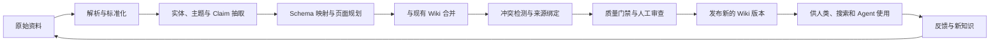
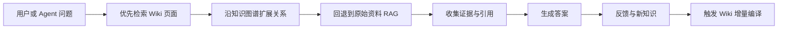
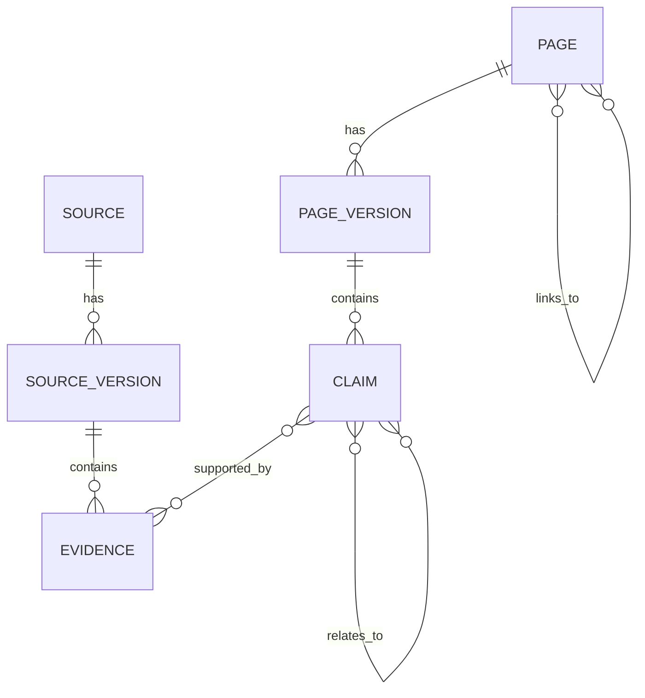
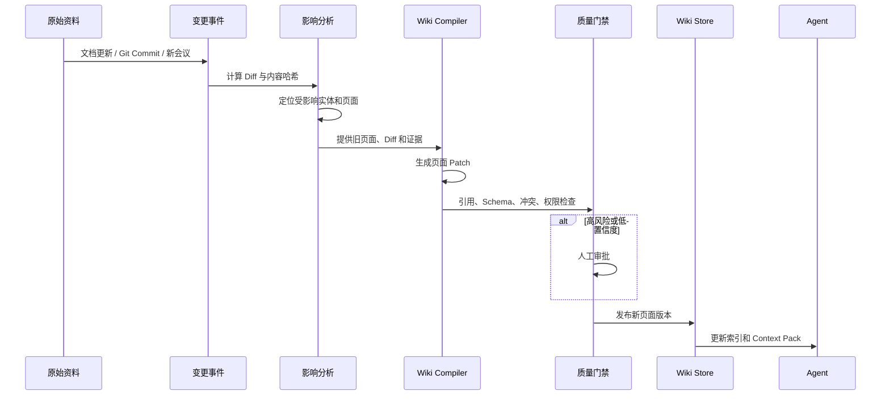
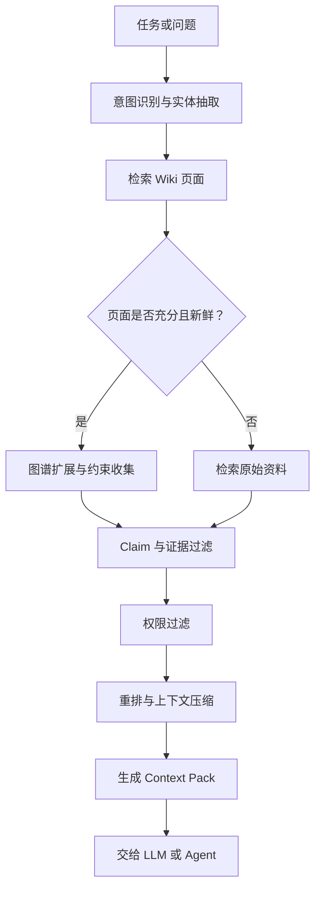
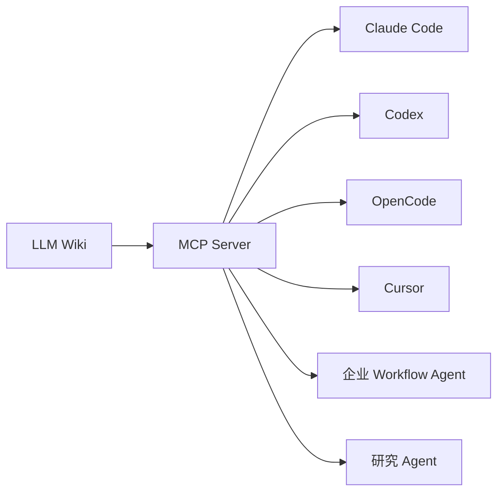
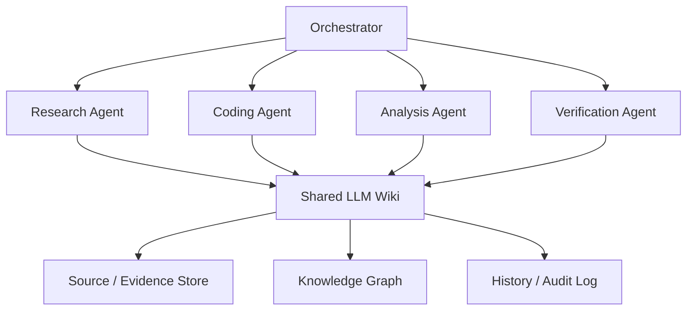

# 附录 T：主流 LLM Wiki 系统全景

> 定位：**LLM Wiki（知识编译系统）赛道的全景调研报告**（全文收录，信息基准 2026-08-31，各产品官方入口见 [C-47]）。这是一个与 RAG 相邻但立意不同的赛道：RAG 在查询时检索原文片段，LLM Wiki 在写入时把知识**编译**成结构化、可导航、面向 LLM 与人双读者的百科——本附录讲清这条辨析（Wiki vs RAG vs 知识图谱），再盘点四路生态：代码仓库型（DeepWiki/Code Wiki/AutoWiki——第 23 章 Repo Map 与项目知识文件的产品化放大）、持久知识编译型、企业知识 Wiki 与企业搜索（Notion AI/Glean/Rovo 等）、开源 RAG 与 Agent 知识平台；收尾于企业参考架构、核心机制详解、面向 Agent 的接口设计、选型与失败模式。注意与本书附录 A（LLM 基础 Wiki）无关——附录 A 是"关于 LLM 的词条书"，本附录讲的是"用 LLM 编译知识的系统"。名单会过期，"检索时增强 vs 写入时编译"的辨析框架不过期。

---

## T.1 核心结论

当前“LLM Wiki”并不是单一产品类别，而是六条正在汇合的技术路线：

1. **传统协作 Wiki + AI**：Notion AI、GitBook、Confluence/Rovo、Guru、Slite。
2. **企业知识搜索与知识 Agent**：Glean、Rovo、Microsoft 365 Copilot、Notion Enterprise Search。
3. **代码仓库 Wiki**：DeepWiki、Google Code Wiki、Factory AutoWiki、OpenWiki、OpenDeepWiki。
4. **个人研究 Notebook**：原 NotebookLM，后更名为 Gemini Notebook。
5. **持久化知识编译型 Wiki**：Karpathy LLM Wiki、`llm_wiki`、`llm-wiki-compiler` 等。
6. **RAG/Agent 知识平台向 Wiki 演进**：RAGFlow、Dify、Onyx、AnythingLLM、FastGPT、MaxKB。

其中，很多产品虽然被称为“AI Wiki”，本质仍然是：

> **原始文档 + 向量检索 + 查询时生成答案。**

严格意义上的 LLM Wiki 则是：

> **将原始资料持续编译成结构化、相互链接、带来源、可审查、可增量维护的长期知识资产。**

未来主流不会是“Wiki 替代 RAG”，而是以下能力的混合架构：

```text
原始资料库
+ RAG
+ Wiki 页面
+ 知识图谱
+ Agent / MCP
+ 权限治理
+ 持续评估
```

---

## T.2 什么是真正的 LLM Wiki

### T.2.1 广义定义

广义 LLM Wiki 是指利用大语言模型完成以下一种或多种能力的知识系统：

- 自动生成和修改页面；
- 对 Wiki 或企业文档进行自然语言问答；
- 自动建立页面关系、标签和目录；
- 从代码、会议、聊天和文档中抽取知识；
- 检测过期内容、冲突和知识缺口；
- 为 Agent 提供长期、结构化上下文。

Notion AI、GitBook AI、Rovo、Glean 等都属于广义 LLM Wiki 生态。

### T.2.2 狭义定义：知识编译型 Wiki

Andrej Karpathy 发布的 LLM Wiki idea file 给出了一种非常清晰的狭义定义：

- 原始资料保持不可变；
- LLM 不只在查询时检索资料；
- 新资料进入后，LLM 主动提取知识；
- 将知识合并到已有 Wiki 页面；
- 更新实体、主题、关系和结论；
- 记录冲突、证据和来源；
- Wiki 随着资料增加不断积累，而不是每次重新推理。

其核心三层结构是：

```text
Raw Sources：原始资料，事实源，不允许 LLM 修改
Schema：页面类型、目录规则、引用规则、维护工作流
Wiki：由 LLM 生成并持续维护的结构化知识
```

可以用一个简单问题判断某个系统是不是严格意义上的 LLM Wiki：

> **在没有用户提问时，系统是否依然会生成并维护一个长期存在的结构化知识产物？**

如果答案是否定的，它通常更接近 RAG 问答系统，而不是知识编译型 Wiki。

### T.2.3 LLM Wiki 的本质

从工程角度看，LLM Wiki 的本质不是“让 AI 写文档”，而是建立一条长期运行的知识编译流水线：



---

## T.3 LLM Wiki、RAG 与知识图谱的区别

| 维度 | 传统 RAG | 知识图谱 | LLM Wiki |
|---|---|---|---|
| 核心单位 | Chunk 文本块 | Entity、Relation | Page、Claim、Link、Evidence |
| 主要处理时机 | 查询时 | 入库时 | 主要在入库和变更时 |
| 输出是否长期保存 | 通常不保存 | 保存图结构 | 保存页面、结论和关系 |
| 跨文档综合 | 每次查询重新综合 | 依赖预定义关系 | 预先综合并持续修订 |
| 冲突管理 | 通常较弱 | 可表示冲突关系 | 可保留不同观点、时间和证据 |
| 人类浏览体验 | 搜索和聊天为主 | 图查询为主 | 页面、目录、反向链接和图谱 |
| 对 Agent 的价值 | 提供原始证据 | 提供关系导航 | 提供可直接消费的领域上下文 |
| 典型风险 | 召回不全、上下文碎片化 | 建模成本高 | 页面漂移、错误综合 |
| 适合场景 | 高频动态问答 | 强实体关系领域 | 长期研究、代码理解、企业知识 |

传统 RAG 会在每次提问时重新从碎片中拼装知识，而 LLM Wiki 会把综合结果编译成可累积的持久资产。

工程上更合理的方案通常是三者结合：



---

## T.4 主流 LLM Wiki 生态全景

```mermaid
flowchart TB
    ROOT["LLM Wiki 生态"]

    ROOT --> CODE["代码仓库 Wiki"]
    ROOT --> ENTERPRISE["企业知识 Wiki / 搜索"]
    ROOT --> RESEARCH["个人研究 Notebook"]
    ROOT --> COMPILE["持久知识编译器"]
    ROOT --> PLATFORM["RAG / Agent 构建平台"]
    ROOT --> DOCS["开发者文档平台"]

    CODE --> D1["DeepWiki"]
    CODE --> D2["Google Code Wiki"]
    CODE --> D3["Factory AutoWiki"]
    CODE --> D4["LangChain OpenWiki"]
    CODE --> D5["OpenDeepWiki / DeepWiki-Open"]
    CODE --> D6["CodeWiki / RepoAgent / Zread"]

    ENTERPRISE --> E1["Notion AI"]
    ENTERPRISE --> E2["Atlassian Rovo"]
    ENTERPRISE --> E3["Glean"]
    ENTERPRISE --> E4["Microsoft 365 Copilot + SharePoint"]
    ENTERPRISE --> E5["Guru / Slite"]

    RESEARCH --> N1["Gemini Notebook"]

    COMPILE --> C1["Karpathy LLM Wiki Pattern"]
    COMPILE --> C2["nashsu/llm_wiki"]
    COMPILE --> C3["llm-wiki-compiler"]
    COMPILE --> C4["nvk/llm-wiki"]

    PLATFORM --> P1["RAGFlow"]
    PLATFORM --> P2["Dify"]
    PLATFORM --> P3["Onyx"]
    PLATFORM --> P4["AnythingLLM"]
    PLATFORM --> P5["FastGPT / MaxKB"]

    DOCS --> G1["GitBook AI / GitBook Agent"]
```



### T.4.1 生态分类对比

| 类别 | 代表系统 | 核心知识单位 | 主要价值 |
|---|---|---|---|
| 代码仓库 Wiki | DeepWiki、OpenWiki、AutoWiki | Repo、Module、Symbol、Page | 自动理解和维护代码文档 |
| 企业知识入口 | Glean、Rovo、Microsoft 365 Copilot | 文档、人员、业务对象 | 统一搜索、权限感知和业务动作 |
| 协作 Wiki + AI | Notion AI、Guru、Slite | 页面、卡片、数据库 | 人机协作维护知识 |
| 个人研究 Notebook | Gemini Notebook | Notebook、Source、Artifact | 单课题、多模态研究 |
| 知识编译型 Wiki | `llm_wiki`、`llm-wiki-compiler` | Page、Claim、Evidence | 长期、结构化、可审查知识 |
| RAG/Agent 平台 | RAGFlow、Dify、FastGPT | Document、Chunk、Workflow | 搭建领域问答和 Agent 应用 |
| 开发者文档平台 | GitBook AI | 正式文档页面 | 发布、搜索和外部文档问答 |

---

## T.5 代码仓库型 LLM Wiki

这是目前最成熟、最容易看到 LLM Wiki 价值的一条路线。

代码天然具备：

- 文件和目录结构；
- Symbol、Class、Function 等实体；
- Import、Call、Inheritance 等关系；
- Commit、PR、Diff 等增量事件；
- 可验证的代码位置和行号。

因此，代码 Wiki 比普通企业知识库更容易形成稳定的结构化页面。

### T.5.1 DeepWiki

DeepWiki 由 Cognition/Devin 团队提供。它会自动索引代码仓库，并生成：

- 架构说明；
- 模块和符号文档；
- 架构图；
- 源代码链接；
- 代码库摘要；
- 面向仓库的问答。

DeepWiki 与 Ask Devin 的代码搜索结合，可以根据代码上下文回答问题；公共 GitHub 仓库可以直接生成 Wiki，私有仓库能力则与 Devin 平台结合。

DeepWiki 还提供 MCP 服务，主要暴露：

- `read_wiki_structure`
- `read_wiki_contents`
- `ask_question`

这意味着 Claude Code、Cursor、Codex 等 Agent 可以直接把 DeepWiki 当作外部代码知识源。

### 适用场景

- 快速理解公共开源项目；
- 新员工代码库入职；
- CodingAgent 获取仓库级上下文；
- 不想自行维护索引和生成流水线的团队。

### 主要限制

- SaaS 依赖；
- 私有代码治理依赖 Devin 体系；
- Wiki 的内部生成策略和评测机制不可完全控制。

---

### T.5.2 Google Code Wiki

Google Code Wiki 的目标是为代码仓库维护持续更新的结构化 Wiki。其能力包括：

- 分析完整代码仓库；
- 自动生成页面和目录；
- 页面链接到具体文件、类和函数；
- 生成架构图、类图和时序图；
- 内置基于 Gemini 的仓库问答；
- 代码变更后重新维护相关文档。

Google Code Wiki 的重要特征是：

> **Wiki 本身成为聊天系统的长期知识基础，而不仅是聊天结果的展示页面。**

### 适用场景

- Google/Gemini 技术体系；
- 公共仓库探索；
- 重视图形化代码理解的团队。

---

### T.5.3 Factory AutoWiki

Factory AutoWiki 会从 Droid CLI 分析仓库，生成结构化 Markdown Wiki，覆盖：

- 总体架构；
- 模块划分；
- API；
- 开发约定；
- 页面间交叉链接。

AutoWiki 支持在 Factory App 中查看、搜索、导出和浏览历史版本，也可以同步到 GitHub Wiki。

它的突出能力是 CI 集成：

- `/install-wiki` 生成 CI 配置；
- 默认分支发生 Push 时自动刷新；
- 文档版本与代码版本关联；
- 可通过路径过滤减少不必要的重建。

### 适用场景

- 已使用 Factory/Droid 的团队；
- 希望把文档维护纳入 SDLC；
- 需要版本化 Wiki 和 GitHub Wiki 同步的企业。

---

### T.5.4 LangChain OpenWiki

OpenWiki 是开源代码 Wiki Agent，主要能力包括：

- 在本地生成仓库 Wiki；
- 将 Wiki 引用写入 `AGENTS.md` 或 `CLAUDE.md`；
- 让 CodingAgent 按需读取 Wiki；
- 通过 Git Diff 判断代码变化；
- 利用 GitHub Action 定期更新相关页面；
- 支持多种开放和闭源模型；
- 可接入 LangSmith 做链路追踪。

这里有一个非常重要的设计：

> **不把整个 Wiki 塞进 `AGENTS.md`，而是在 Agent 指令文件中放置 Wiki 入口，由 Agent 按需检索。**

这比“超大 AGENTS.md”更节省上下文，也更容易维护。

### 适用场景

- Claude Code、Codex、OpenCode 等 CodingAgent；
- 希望本地生成 Markdown；
- 希望自行选择模型；
- 需要 Git Diff 增量维护的团队。

---

### T.5.5 OpenDeepWiki 与 DeepWiki-Open

### OpenDeepWiki

OpenDeepWiki 可以把以下内容转换为可检索知识库：

- Git 仓库；
- ZIP 包；
- 本地目录。

它同时提供结构化文档、聊天、嵌入和 MCP 能力，适合私有部署。

### DeepWiki-Open

DeepWiki-Open 支持 GitHub、GitLab 和 Bitbucket，能够生成：

- 仓库结构说明；
- 交互式 Wiki；
- 架构图；
- Codemap；
- 基于仓库内容的问答。

两者的主要价值不是功能绝对领先，而是：

- 可自建；
- 模型可替换；
- 数据边界可控制；
- 容易二次开发。

---

### T.5.6 CodeWiki、RepoAgent 与 Zread

### CodeWiki

CodeWiki 是面向仓库级文档生成的开源研究框架，重点解决跨文件、跨模块和系统级关系理解问题。其方法包括：

- 分层拆解；
- 递归 Agent 处理；
- 架构级综合；
- 文本、架构图、数据流和时序图联合生成；
- 仓库级文档评测基准。

### RepoAgent

RepoAgent 更早探索了仓库级文档的主动生成、维护和更新，强调代码演进后文档的持续同步。

### Zread

Zread 更偏向“代码阅读助手”，可以为仓库生成 Wiki 风格文档，并通过 Skill 让 Agent 使用其输出，而不必每次重新遍历整个仓库。

---

## T.6 持久知识编译型 LLM Wiki

这是最符合狭义 LLM Wiki 定义的一类。

### T.6.1 nashsu/llm_wiki

这是 Karpathy LLM Wiki 思路的桌面应用实现，采用：

```text
Raw Sources → Schema / Purpose → Wiki
```

其能力包括：

- 相互链接的 Markdown 页面；
- Obsidian 兼容；
- 原始资料目录监听；
- 向量和全文混合搜索；
- 知识图谱浏览；
- 两阶段摄取：先分析，再生成；
- 冲突和人工 Review；
- Mermaid 图；
- 本地 API 和 MCP；
- Agent Skills；
- 深度研究和网页资料摄取。

其中 `purpose.md` 用来定义：

- Wiki 为什么存在；
- 研究目标；
- 关键问题；
- 范围边界；
- 当前论点。

而 `schema.md` 定义：

- 页面类型；
- 字段；
- 命名；
- 引用；
- 关系规则。

这解决了一个重要问题：

> **Schema 负责“怎么组织”，Purpose 负责“为什么组织”。**

### 适用场景

- 个人第二大脑；
- 长期主题研究；
- 读书笔记；
- 个人经历与目标管理；
- 本地优先、Obsidian 风格知识管理。

---

### T.6.2 llm-wiki-compiler

`llm-wiki-compiler` 更接近一个真正的“知识编译器”，而不是单纯桌面笔记应用。

它把原始资料编译成：

- `concept`
- `entity`
- `comparison`
- `overview`

等类型化页面，并提供：

- 段落和 Claim 级来源；
- 文件及行范围引用；
- Schema 和生命周期 Profile；
- Hybrid Retrieval；
- BM25、向量和 Wiki Link 图扩展；
- Review Queue；
- Freshness 检测；
- `lint` 与 `eval`；
- MCP Server；
- JSON-LD、GraphML、`llms.txt` 等交换格式。

它与普通 RAG 的最大区别在于：

> **检索结果不是最终知识，而是编译 Wiki 时使用的证据材料。**

### 适用场景

- 研究和尽调；
- 法务、政策和标准知识库；
- 需要严格来源追踪的领域；
- Agent 长期上下文；
- 需要 CI、Lint 和质量门禁的知识工程。

---

### T.6.3 nvk/llm-wiki

这一实现更强调 Agent 工作流，包括：

- 并行多 Agent 研究；
- 资料采集；
- Wiki 编译；
- 审计；
- 查询；
- 项目和交付物生成；
- Claude Code、Codex、OpenCode 等 Agent 的使用；
- Obsidian 兼容。

它代表了一种趋势：

> **Wiki 不只是供人阅读的知识库，也可以成为 Agent 项目管理、研究和交付流程的长期状态层。**

---

### T.6.4 RAGFlow：从 RAG 向知识编译迈进

RAGFlow 最初是强调复杂文档解析和可追溯回答的 RAG 引擎。

其知识编译流水线逐步扩展为：

```text
Parser → Chunker → Compiler → Indexer
```

可以生成：

- Wiki；
- Graph；
- Tree；
- Page Index；
- Mind Map；
- Timeline；
- 可供 Agent 使用的 Skills。

RAGFlow 还能够检测知识库中文档的新增和删除，并提示用户更新知识产物。部分知识产物可能仍需要用户主动执行同步更新。

这是一个关键行业信号：

> **RAG 平台正在从“管理 Chunk”升级为“编译和管理知识产物”。**

---

## T.7 企业知识 Wiki 与企业搜索系统

这类系统通常不是严格的 LLM Wiki，而是：

```text
协作文档系统
+ 企业连接器
+ 权限感知搜索
+ RAG
+ 知识图谱
+ Agent 与业务动作
```

### T.7.1 Notion AI

Notion AI 的优势在于页面和数据库本身就是长期知识载体。主要能力包括：

- Workspace 页面搜索；
- Slack、Google Drive 等连接器；
- Enterprise Search；
- Research Mode；
- 会议记录；
- 页面和数据库创建、修改；
- 可定制的 Notion Agent；
- Agent 指令与 Skills。

Notion AI 更接近：

> **人类维护页面，AI 帮助查询、编辑、研究和执行。**

它还不是典型的“LLM 全自动编译 Wiki”，但在人机协作层面较成熟。

### 适用场景

- 中小团队协作文档；
- 产品、运营和市场知识；
- 页面、数据库和项目管理统一；
- 不要求私有化部署的团队。

---

### T.7.2 Atlassian Rovo

Rovo 建立在 Confluence、Jira 和 Atlassian Teamwork Graph 之上，包含：

- Rovo Search；
- Rovo Chat；
- Rovo Agents；
- 自定义 Agent；
- Subagent；
- 工具与 Skills；
- Deep Research；
- 第三方 SaaS 连接器；
- 对 Jira、Confluence 等系统的写操作。

Rovo Agent 可以限定知识范围：

- 全部组织知识；
- 指定 Confluence Space；
- 指定 Jira 内容；
- Google Drive 等外部来源；
- Web Search；
- 不使用组织知识。

### 适用场景

- Jira + Confluence 重度用户；
- 软件研发和 ITSM；
- 希望知识搜索直接驱动任务和工单操作的企业。

---

### T.7.3 Glean

Glean 的核心不是 Wiki 页面，而是企业级搜索索引与 Enterprise Knowledge Graph。

它会连接组织中的文档、讨论、附件、消息、人员和业务系统，并利用：

- 内容关系；
- 访问模式；
- 组织结构；
- 团队协作；
- 用户角色；
- 权限；
- 活动信号；

提高搜索和回答的相关性。

Glean 连接器可以支持索引、实时检索和混合访问，并让 Search、Chat、Assistant 和 Agents 共用统一、权限感知的知识视图。

Glean 还提供 MCP，将统一企业知识图谱暴露给外部 Agent。

### 适用场景

- 大型企业；
- 数据分散在大量 SaaS 系统；
- 强调权限继承和人员知识图谱；
- 更关心“找到组织知识”，而不是自动生成 Wiki 页面。

---

### T.7.4 Microsoft 365 Copilot + SharePoint

Microsoft 路线以 SharePoint、OneDrive、Teams、Microsoft Graph 和 Copilot Studio 为中心。

SharePoint 可以作为 Agent 知识源，并按当前用户身份执行查询，只返回用户原本有权限访问的内容。

Copilot Studio 可以接入：

- SharePoint；
- Power Platform；
- Dynamics 365；
- 网站；
- 外部系统；
- 上传文件；

用于支撑 Agent 的 Grounded Answer。

Copilot in SharePoint 进一步支持通过自然语言查询、创建和操作站点、页面、列表、文档库及 Office 文件。

### 适用场景

- Microsoft 365 企业；
- 强依赖 Entra ID、SharePoint 权限和 Office 文档；
- 需要成熟企业治理和审计。

---

### T.7.5 GitBook AI 与 GitBook Agent

GitBook 主要服务开发者文档和外部产品文档。

其 AI 能力包括：

- 根据文档站点内容回答问题；
- 连接外部知识源；
- 为读者提供 AI Assistant；
- AI Insights；
- MCP；
- 在 Slack、GitHub、Linear 等渠道接收问题或文档变更请求；
- 自动提出文档改进。

### 适用场景

- API 和 SDK 文档；
- 开源项目文档；
- 面向客户的产品知识中心；
- Docs-as-Code 工作流。

与 DeepWiki 的区别是：

- DeepWiki 从代码生成系统解释；
- GitBook 更侧重管理、发布和消费正式文档。

---

### T.7.6 Guru

Guru 已经从传统企业知识卡片系统演进为 Knowledge Agent 平台。

Knowledge Agent 能够：

- 跨 Google Drive、Slack、Confluence、Salesforce 等来源回答；
- 提供来源；
- 自动验证或取消验证内容；
- 定时运行知识任务；
- 生成和维护知识卡片；
- 通过 MCP 为外部 AI 工具提供知识。

Guru 的突出价值是知识质量治理：

- 内容 Verification；
- 自动 Verify/Unverify；
- Answer Analytics；
- Flagged Answer Review；
- 将高质量回答转成正式知识卡片。

因此，Guru 是企业产品中较接近以下形态的系统：

> **AI 自动维护，但由人类治理的知识 Wiki。**

---

### T.7.7 Slite

Slite 将自己定位为 Self-maintaining Knowledge Base。

其 Agent 可以：

- 搜索 Slite 文档；
- 连接 Slack、Notion、Google Drive、Jira 等来源；
- 给出细粒度引用；
- 继承用户权限；
- 识别未回答问题和知识缺口。

Slite 还提供文档 Verification：

- 已验证文档在 AI 检索中权重更高；
- 过期内容被降低优先级或排除；
- 验证可以设置到期时间。

### 适用场景

- 轻量企业 Wiki；
- 重视知识过期管理；
- 希望减少手工知识维护的团队。

---

## T.8 个人研究型：Gemini Notebook

Gemini Notebook 是以资料为中心的研究产品，支持基于用户提供的资料生成：

- 对话回答；
- 报告；
- Audio Overview；
- Video Overview；
- Mind Map；
- Source Discovery；
- 其他学习和研究产物。

它的优势是：

- 快速；
- 多模态；
- 来源约束清晰；
- 适合单个课题、课程或项目。

但它与严格 LLM Wiki 有明显差异：

| Gemini Notebook | 持久 LLM Wiki |
|---|---|
| Notebook/课题级 | 跨课题长期知识空间 |
| 主要从选定资料回答 | 主动改写和维护知识页面 |
| 生成研究产物 | 生成长期页面和知识关系 |
| 页面 Schema 较弱 | 支持领域 Schema 和页面类型 |
| 跨 Notebook 综合有限 | 强调持续累积和跨来源综合 |

因此，Gemini Notebook 更准确的定位是：

> **Source-grounded Research Notebook，而不是完整知识编译器。**

---

## T.9 开源 RAG 与 Agent 知识平台

这些系统大多不是开箱即用的 Wiki，但可以作为构建 LLM Wiki 的基础设施。

### T.9.1 Dify

Dify 提供：

- 知识库管理；
- 文档处理；
- Metadata；
- 多知识库检索；
- Rerank；
- Knowledge Retrieval 工作流节点；
- 外部知识库 API；
- Agent 和 Workflow 编排。

Dify 更适合构建：

- 企业问答；
- 客服；
- 工作流；
- 领域 Agent。

但默认知识单位仍以 Document 和 Chunk 为主，缺少完整的自动 Wiki 页面编译层。

---

### T.9.2 Onyx

Onyx 是开源企业搜索与 Agent 平台，支持：

- 多种企业连接器；
- 持续同步数据；
- Search 与 Chat；
- 自定义 Agent；
- Web Search；
- 自托管；
- 权限继承。

Onyx 更接近开源版的企业搜索和 Agent 入口，而不是页面型 Wiki。

---

### T.9.3 AnythingLLM

AnythingLLM 提供：

- Workspace；
- 本地或云端模型；
- 文档管理；
- RAG 与 Rerank；
- AI Agents；
- 网页访问；
- 文件操作；
- 桌面和移动端能力。

### 适用场景

- 个人和小团队；
- 本地模型；
- 快速搭建文档问答；
- 对基础设施要求较低的场景。

但其默认模型仍然是“工作区文档嵌入 + 查询时 RAG”。

---

### T.9.4 MaxKB

MaxKB 是面向企业的开源智能体平台，覆盖：

- RAG 知识库；
- Workflow；
- Agent；
- MCP；
- 本地模型和本地部署；
- 企业应用发布。

其知识库支持离线文档和 Web 站点，并提供分段、向量化、同步和权限管理。

适合中文企业私有化知识问答，但如果要形成严格 LLM Wiki，仍需增加：

- 页面规划；
- 关系维护；
- 冲突检测；
- 增量编译；
- Claim 级引用；
- Review 和质量门禁。

---

### T.9.5 FastGPT

FastGPT 强项包括：

- PDF、图片、表格和公式等复杂内容解析；
- 文档结构化为 Markdown；
- QA、多向量映射和多种检索策略；
- Workflow 与 Agent；
- 引用原文定位；
- 飞书、钉钉、语雀等国内知识源接入；
- 定时扫描和同步变化。

FastGPT 更适合作为国内企业知识 Agent 平台，而不是自动生成页面关系的 Wiki 编译器。

---

## T.10 推荐的企业级 LLM Wiki 架构

```mermaid
flowchart LR
    subgraph S["来源层"]
        S1["PDF / Word / 网页"]
        S2["Slack / 飞书 / 邮件"]
        S3["会议录音 / 视频"]
        S4["Git / PR / Issue"]
        S5["数据库 / API"]
    end

    subgraph I["采集与标准化层"]
        I1["Connector / Webhook / CDC"]
        I2["Parser / OCR / ASR"]
        I3["代码 AST / Symbol / LSP"]
        I4["ACL / Metadata / Version"]
        I5["去重与内容哈希"]
    end

    subgraph C["知识编译层"]
        C1["实体与主题抽取"]
        C2["Schema 映射"]
        C3["页面规划"]
        C4["已有页面检索"]
        C5["Claim 合并与冲突检测"]
        C6["引用与置信度绑定"]
        C7["页面补丁生成"]
    end

    subgraph K["持久知识层"]
        K1["Immutable Source Store"]
        K2["Wiki Page Store"]
        K3["Claim / Evidence Store"]
        K4["Knowledge Graph"]
        K5["BM25 / Vector Index"]
        K6["Version / Audit Log"]
    end

    subgraph Q["消费层"]
        Q1["Wiki 浏览器"]
        Q2["企业搜索"]
        Q3["Grounded Chat"]
        Q4["Deep Research"]
        Q5["CodingAgent"]
        Q6["MCP / API / Skills"]
    end

    subgraph G["治理与质量"]
        G1["Human Review"]
        G2["Freshness 检测"]
        G3["Wiki Lint"]
        G4["Eval"]
        G5["权限与脱敏"]
        G6["成本与可观测性"]
    end

    S --> I
    I --> C
    C --> K
    K --> Q
    Q --> G
    G --> C
```



### T.10.1 架构分层说明

| 层级 | 主要职责 | 典型技术 |
|---|---|---|
| 来源层 | 汇聚事实源和业务事件 | Connector、Webhook、CDC、Git |
| 标准化层 | 解析、清洗、切分、去重、权限映射 | Parser、OCR、ASR、AST、LSP |
| 知识编译层 | 将资料转换为页面、Claim 和关系 | LLM、规则引擎、Schema、Diff |
| 持久知识层 | 存储事实、页面、图谱、索引和版本 | Object Store、SQL、Vector DB、Graph DB |
| 消费层 | 为用户和 Agent 提供检索、问答与工具 | Search、Chat、MCP、REST、Skills |
| 治理层 | 保证正确性、新鲜度、安全性和成本 | Review、Eval、ACL、Tracing、Audit |

---

## T.11 核心机制详解

### T.11.1 原始资料与 Wiki 必须分离

原始资料是事实源，Wiki 是派生视图。

正确设计：

```text
原始资料：不可变、可审计
Wiki 页面：允许重新生成和修订
证据记录：连接页面 Claim 与原始资料
```

错误设计是让 LLM 直接修改或覆盖原始资料。一旦 Wiki 产生幻觉，就无法恢复真实来源。

### 推荐存储模型



---

### T.11.2 页面不是大段总结，而是类型化知识对象

页面应具有明确 Schema，例如：

```yaml
type: concept
title: Retrieval-Augmented Generation
status: reviewed
freshness: 2026-08-31
sources:
  - source-001
  - source-017
related:
  - Hybrid Search
  - Vector Database
  - Knowledge Compilation
```

常见页面类型包括：

- Entity；
- Concept；
- Event；
- Decision；
- Project；
- Person；
- System；
- Component；
- Comparison；
- Source Summary；
- Synthesis；
- Question；
- Experiment；
- Incident。

没有 Schema，Wiki 很快会变成大量风格不一致的 LLM 总结。

---

### T.11.3 使用 Claim 作为最小知识单元

页面只是一种展示结构，真正需要治理的是 Claim。

```text
Claim
├── 文本
├── 来源
├── 来源位置
├── 时间范围
├── 置信度
├── ACL
├── 支持证据
├── 反驳证据
└── 当前状态
```

这样才能处理：

- 同一事实的多个来源；
- 新旧政策冲突；
- 不同时间的不同结论；
- 不同权限级别的内容；
- 需要人工确认的不确定信息。

### Claim 状态示例

```text
draft
→ machine_verified
→ human_review_required
→ reviewed
→ published
→ stale
→ contradicted
→ retired
```

---

### T.11.4 增量维护优于全量重建

正确的更新流程应该是：



对于代码 Wiki，应基于：

- Commit；
- Diff；
- Symbol Dependency；
- Import Graph；
- Call Graph；

定位受影响页面，而不是每次重新扫描全部仓库。

---

### T.11.5 查询采用三级检索

### 第一级：Wiki 页面检索

先找到已经综合好的主题页面，获得低成本、高密度上下文。

### 第二级：图谱扩展

沿以下关系补充上下文：

- `depends_on`
- `implemented_by`
- `contradicts`
- `derived_from`
- `related_to`
- `owned_by`
- `changed_by`

### 第三级：原始资料回退

当 Wiki 页面证据不足、过期或用户要求精确引用时，再检索原始 Chunk。

最终形成：

```text
Wiki Summary
+ Related Pages
+ Raw Evidence
+ Citation Metadata
```

这比单纯向量 Top-K 更适合复杂 Agent。

### 推荐检索流程



---

### T.11.6 权限必须下沉到 Claim 和证据层

企业 LLM Wiki 最危险的问题是：

> **一个页面可能综合了多个不同权限来源。**

例如：

- 来源 A：全员可见；
- 来源 B：仅管理层可见；
- Wiki 页面同时使用了 A 和 B。

如果只在页面级控制权限，就可能造成泄露。

可选方案：

1. 按安全域分别编译 Wiki；
2. Claim 级附带 ACL，查询时动态过滤；
3. 页面只保存公共综合，敏感部分查询时拼装；
4. 禁止跨不兼容安全域生成共享结论；
5. 发布时计算页面的有效权限交集；
6. 将 ACL 变化纳入增量重编译事件。

---

### T.11.7 Wiki 必须有 Lint 与 Eval

建议至少监控以下指标：

| 维度 | 指标 |
|---|---|
| 来源覆盖 | Source Coverage、Ingest Success Rate |
| 引用质量 | Citation Coverage、Citation Precision |
| 内容正确性 | Claim Support Rate、Faithfulness |
| 页面健康 | Broken Link、Orphan Page、Duplicate Page |
| 新鲜度 | Freshness Lag、Stale Page Ratio |
| 冲突管理 | Unresolved Contradiction Count |
| 检索质量 | Recall@K、MRR、NDCG |
| Agent 效果 | Task Success Rate、Context Hit Rate |
| 权限安全 | ACL Leakage Rate |
| 成本 | Cost per Source、Cost per Updated Page |
| 人工负担 | Review Queue Size、Review Acceptance Rate |

### 质量门禁示例

```yaml
quality_gate:
  citation_coverage_min: 0.95
  claim_support_rate_min: 0.90
  broken_links_max: 0
  unresolved_critical_conflicts_max: 0
  acl_leakage_rate_max: 0
  stale_page_ratio_max: 0.05
```

---

### T.11.8 冲突检测与时间建模

同一知识在不同时间可能都正确：

```text
2025 年：系统默认使用模型 A
2026 年：系统默认使用模型 B
```

因此，冲突检测不能只比较文本语义，还必须考虑：

- 生效时间；
- 失效时间；
- 适用范围；
- 版本；
- 环境；
- 权威来源；
- 组织或业务域。

推荐将 Claim 表达为：

```yaml
claim:
  subject: default_model
  predicate: uses
  object: model_b
  valid_from: 2026-06-01
  valid_to: null
  scope: production
  confidence: 0.97
  source_authority: official_configuration
```

---

### T.11.9 人工审查不能成为吞吐瓶颈

所有内容都人工审批会失去自动化价值。建议按风险分级：

| 风险级别 | 典型内容 | 发布策略 |
|---|---|---|
| 低风险 | 标签、链接、目录、格式修复 | 自动发布 |
| 中风险 | 普通知识总结、模块说明 | 规则通过后自动发布，可抽样审查 |
| 高风险 | 架构决策、安全策略、财务和人事 | 强制人工审批 |
| 极高风险 | 法律结论、合规判定、生产执行指令 | 多人审批或禁止自动生成 |

---

## T.12 面向 Agent 的接口设计

不要让 Agent 每次加载整个 Wiki，而应提供标准化工具：

```text
list_wiki_topics
search_wiki
read_wiki_page
get_page_outline
get_related_pages
get_claim_evidence
get_source_excerpt
get_change_history
get_stale_pages
report_incorrect_claim
request_wiki_refresh
build_context_pack
```

其中最重要的是 `build_context_pack`：

```json
{
  "task": "修改用户认证刷新流程",
  "pages": [
    "authentication-overview",
    "token-refresh-flow",
    "session-storage"
  ],
  "symbols": [
    "AuthService.refreshToken",
    "SessionRepository.save"
  ],
  "constraints": [
    "不得修改公共 API",
    "需要兼容现有迁移"
  ],
  "evidence": [],
  "token_budget": 12000
}
```

### T.12.1 为什么需要 Context Pack

直接让 Agent 自行搜索全部知识库会产生：

- 检索路径不稳定；
- Token 浪费；
- 重复读取；
- 关键约束遗漏；
- 权限边界难以统一；
- 不同 Agent 得到的上下文不一致。

Context Pack 应由知识系统集中构建，包含：

- 任务摘要；
- 核心页面；
- 关键 Claim；
- 原始证据；
- 相关符号；
- 业务约束；
- 禁止事项；
- 新鲜度和置信度；
- Token Budget。

### T.12.2 MCP 在 LLM Wiki 中的作用

MCP 可以把 Wiki 能力暴露为统一工具，让不同 Agent 共用相同知识底座：



MCP 解决的是工具协议和上下文访问问题，但不会自动解决：

- 知识正确性；
- Schema 设计；
- 权限传播；
- 冲突管理；
- 增量更新；
- 质量评估。

---

## T.13 系统选型建议

| 使用场景 | 推荐系统 | 原因 |
|---|---|---|
| 快速理解公共 GitHub 仓库 | DeepWiki、Google Code Wiki | 零配置、页面和图形体验成熟 |
| 企业私有代码仓库 | AutoWiki、OpenWiki、OpenDeepWiki | 支持 CI、私有化或本地 Markdown |
| CodingAgent 长期代码上下文 | OpenWiki、llm-wiki-compiler、DeepWiki MCP | Agent 入口、增量更新、MCP |
| 个人长期研究 | `nashsu/llm_wiki`、`llm-wiki-compiler` | 持久页面、关系、引用、Review |
| 单个课题快速研究 | Gemini Notebook | 来源约束和多模态产物成熟 |
| Notion 团队 | Notion AI | 页面、数据库、搜索和 Agent 一体 |
| Jira/Confluence 企业 | Rovo | Atlassian 上下文和业务动作完整 |
| Microsoft 365 企业 | SharePoint + Copilot | 权限、身份和 Office 生态统一 |
| 多 SaaS 大型企业搜索 | Glean | 企业图谱、连接器和权限感知搜索 |
| 强调知识验证与维护 | Guru、Slite | Verification、知识缺口和质量流程 |
| 外部产品/API 文档 | GitBook AI | 发布、搜索、Assistant、MCP |
| 开源知识 Agent 平台 | RAGFlow、Dify、Onyx | 可自建、可二次开发 |
| 国内私有化知识问答 | FastGPT、MaxKB、RAGFlow | 中文生态、连接器和本地部署 |
| 从 RAG 升级为 Wiki | RAGFlow 或自建 Compiler | 已具备或可扩展 Wiki/Graph/Tree 编译能力 |

### T.13.1 按建设方式选择

### 直接采购 SaaS

适合：

- 希望快速上线；
- 不准备自建知识工程团队；
- 数据合规允许使用云服务；
- 连接器和权限治理优先。

典型选择：

- Glean；
- Rovo；
- Notion AI；
- Guru；
- Slite；
- DeepWiki。

### 开源私有化

适合：

- 数据不能离开企业；
- 需要自定义模型、索引和权限；
- 有平台研发能力；
- 希望与现有 Agent 平台深度集成。

典型选择：

- RAGFlow；
- OpenWiki；
- OpenDeepWiki；
- Dify；
- Onyx；
- FastGPT；
- MaxKB；
- `llm-wiki-compiler`。

### 自研知识编译平台

适合：

- 知识本身构成核心竞争力；
- 需要 Claim 级权限和来源；
- 需要领域 Schema；
- 需要复杂冲突、版本和审查流程；
- 需要把 Wiki 作为多个 Agent 的统一长期知识层。

---

## T.14 常见失败模式

### T.14.1 把向量数据库当 Wiki

向量数据库只解决“找到相似片段”，并不负责：

- 页面结构；
- 跨文档结论；
- 冲突；
- 版本；
- 关系；
- 内容责任人；
- 长期维护。

---

### T.14.2 让 LLM 无来源改写页面

必须要求 Claim 绑定来源，否则多轮维护后会出现“知识漂移”。

任何无法追溯到证据的事实性 Claim 都应：

- 降低置信度；
- 标记为推断；
- 进入 Review Queue；
- 或禁止发布。

---

### T.14.3 每次全量生成

大型知识库应使用：

- 内容哈希；
- Diff；
- 实体依赖；
- 页面依赖图；
- 增量 Patch；
- 事件驱动更新。

全量重建通常会造成：

- 成本高；
- 延迟长；
- 页面风格漂移；
- 历史审计困难；
- 不相关页面被意外修改。

---

### T.14.4 只生成页面，不维护页面

一次性的 AI 文档生成器不等于 LLM Wiki。真正难点是后续：

- 新增；
- 修改；
- 删除；
- 冲突；
- 过期；
- 回滚；
- 权限变化；
- 来源失效。

---

### T.14.5 把所有内容塞入 Agent Context

Wiki 的作用不是扩大 Prompt，而是帮助 Agent 精确选择上下文。

正确做法是：

```text
任务
→ 页面导航
→ 相关 Claim
→ 必要证据
→ Context Pack
→ Agent 执行
```

---

### T.14.6 忽略权限传播

企业 Wiki 必须将源系统权限带入：

- 文档；
- Chunk；
- Claim；
- 页面；
- 图关系；
- 检索结果；
- 最终答案。

---

### T.14.7 没有人工 Review 边界

以下内容不应默认自动发布：

- 法律和合规结论；
- 人事信息；
- 安全策略；
- 财务数据；
- 架构重大决策；
- 来源相互冲突的结论；
- 低置信度自动综合。

---

### T.14.8 只评估问答，不评估知识资产

RAG 系统通常只评估“答案是否正确”，但 LLM Wiki 还要评估：

- 页面是否完整；
- 引用是否准确；
- 关系是否正确；
- 页面是否重复；
- 知识是否过期；
- 页面是否可被 Agent 有效消费；
- 更新后是否破坏已有知识。

---

## T.15 未来趋势

### T.15.1 从 RAG 转向 Knowledge Compilation

知识平台正在从“Chunk 管理”演进为：

```text
资料解析
→ 知识抽取
→ 页面编译
→ 图谱构建
→ 生命周期管理
→ Agent 消费
```

RAG 不会消失，而会成为知识编译和证据回退的基础能力。

---

### T.15.2 从静态文档转向持续维护

代码 Wiki 已经明确采用：

- Git Diff；
- CI/CD；
- 默认分支事件；
- 路径影响分析；
- Symbol 依赖分析；

持续维护页面。

企业知识 Wiki 也会进一步采用：

- 文档变更事件；
- SaaS Webhook；
- 数据库 CDC；
- 会议结束事件；
- 工单状态变化；
- 权限变化事件。

---

### T.15.3 从人类阅读转向 Agent 消费

Wiki 会同时面向：

- 人类浏览；
- 搜索；
- Chat；
- CodingAgent；
- Workflow Agent；
- MCP 客户端；
- 自动化审计系统。

`AGENTS.md`、`CLAUDE.md` 不再存放全部知识，而是成为 Wiki 的导航入口。

---

### T.15.4 从知识页面转向可执行 Skills

未来链路会变成：

```text
Source
→ Knowledge
→ Wiki
→ Procedure
→ Skill
→ Agent Action
→ Execution Result
→ New Knowledge
```

当 Wiki 中积累了稳定的操作流程、决策规则和异常处理方式后，系统可以将其编译为：

- Agent Skill；
- Workflow；
- SOP；
- Policy；
- Tool Contract；
- 自动化检查规则。

---

### T.15.5 从单一向量检索转向混合上下文系统

主流架构将同时使用：

- BM25；
- Vector Search；
- Metadata Filter；
- Knowledge Graph；
- Page Hierarchy；
- Symbol Index；
- 时间过滤；
- 权限过滤；
- Agent 规划式检索；
- Query Rewrite；
- Rerank；
- Context Compression。

---

### T.15.6 从“答案正确”转向“知识资产健康”

系统不仅要评估一次回答，还要持续评估：

- 页面是否过期；
- 引用是否仍有效；
- 关系是否断裂；
- 结论是否冲突；
- 权限是否泄露；
- Wiki 是否真正提升 Agent 任务成功率；
- 自动更新是否引入知识退化。

---

### T.15.7 Wiki 将成为多 Agent 的共享长期状态层

在多 Agent 系统中，常见问题包括：

- Agent 之间重复研究；
- 上下文无法共享；
- 同一事实被多次推理；
- 不同 Agent 形成矛盾结论；
- 会话结束后知识丢失。

LLM Wiki 可以成为统一的共享层：



---

## T.16 最终判断

当前主流系统可以归纳为三大阵营。

### T.16.1 第一阵营：企业知识入口

代表：

- Notion AI；
- Rovo；
- Glean；
- Microsoft 365 Copilot；
- Guru；
- Slite。

核心价值是：

> **连接组织数据、继承权限、提供搜索、问答和业务动作。**

### T.16.2 第二阵营：代码仓库 Wiki

代表：

- DeepWiki；
- Google Code Wiki；
- Factory AutoWiki；
- OpenWiki；
- OpenDeepWiki。

核心价值是：

> **把代码仓库编译成结构化、持续更新、可供开发者和 CodingAgent 使用的系统说明。**

### T.16.3 第三阵营：知识编译型 LLM Wiki

代表：

- Karpathy LLM Wiki Pattern；
- `nashsu/llm_wiki`；
- `llm-wiki-compiler`；
- RAGFlow Knowledge Compilation。

核心价值是：

> **将分散资料持续编译为带结构、关系、证据、版本和 Review 状态的长期知识资产。**

真正值得建设的下一代 LLM Wiki，不应只是“给 Wiki 加一个聊天框”，而应具备：

```text
不可变原始资料
+ 类型化页面
+ Claim 级证据
+ 增量编译
+ 冲突管理
+ Wiki Link / Knowledge Graph
+ Hybrid Retrieval
+ ACL 权限传播
+ Human Review
+ Lint / Eval
+ MCP / Skills / Agent 接口
```

最终它会成为一种新的基础设施：

> **面向人类是 Wiki，面向搜索是索引，面向模型是 Context Store，面向 Agent 是长期知识与能力底座。**

---

## 参考资料

### LLM Wiki 与知识编译

- [Andrej Karpathy：LLM Wiki Idea](https://gist.github.com/karpathy/442a6bf555914893e9891c11519de94f)
- [nashsu/llm_wiki](https://github.com/nashsu/llm_wiki)
- [atomicstrata/llm-wiki-compiler](https://github.com/atomicstrata/llm-wiki-compiler)
- [nvk/llm-wiki](https://github.com/nvk/llm-wiki)

### 代码仓库 Wiki

- [DeepWiki Documentation](https://docs.devin.ai/work-with-devin/deepwiki)
- [DeepWiki MCP](https://docs.devin.ai/work-with-devin/deepwiki-mcp)
- [Google Developers Blog：Code Wiki](https://developers.googleblog.com/introducing-code-wiki-accelerating-your-code-understanding/)
- [Factory AutoWiki](https://docs.factory.ai/software-factory/wiki/overview)
- [Factory AutoWiki Auto Refresh](https://docs.factory.ai/software-factory/wiki/auto-refresh)
- [LangChain OpenWiki](https://www.langchain.com/blog/introducing-openwiki-an-open-source-agent-for-repo-documentation)
- [OpenDeepWiki](https://github.com/AIDotNet/OpenDeepWiki)
- [DeepWiki-Open](https://github.com/AsyncFuncAI/deepwiki-open)
- [CodeWiki](https://github.com/FSoft-AI4Code/CodeWiki)
- [RepoAgent](https://arxiv.org/abs/2402.16667)
- [Zread Skill](https://github.com/ZreadAI/zread-skill)

### 企业知识与协作平台

- [Notion AI Documentation](https://www.notion.so/help/notion-ai-faqs)
- [Atlassian Rovo Agents](https://support.atlassian.com/rovo/docs/agents/)
- [Rovo Knowledge Sources](https://support.atlassian.com/rovo/docs/knowledge-sources-for-agents/)
- [Glean Search](https://docs.glean.com/administration/search/about)
- [Glean Connectors](https://docs.glean.com/connectors/connectors-power-glean)
- [Glean MCP](https://docs.glean.com/administration/platform/mcp/about)
- [Microsoft Copilot Studio：SharePoint Knowledge](https://learn.microsoft.com/en-us/microsoft-copilot-studio/knowledge-add-sharepoint)
- [Microsoft Copilot Studio Knowledge](https://learn.microsoft.com/en-us/microsoft-copilot-studio/knowledge-copilot-studio)
- [Copilot in SharePoint](https://learn.microsoft.com/en-us/sharepoint/copilot-in-sharepoint-get-started)
- [GitBook AI Assistant](https://gitbook.com/docs/ai-for-your-readers/gitbook-ai-assistant)
- [Guru Knowledge Agents](https://help.getguru.com/docs/intro-to-knowledge-agents)
- [Slite Ask](https://slite.com/help/TaEqEKcObHnZ7m/Find-any-answer-instantly)
- [Slite Document Verification](https://slite.com/help/F9erHftuXmOHY0/Doc-Verification)

### 研究 Notebook 与 RAG/Agent 平台

- [Google：Gemini Notebook](https://blog.google/innovation-and-ai/products/gemini-notebook/notebooklm-gemini-notebook/)
- [Gemini Notebook Help](https://support.google.com/notebooklm/answer/16179536)
- [RAGFlow Documentation](https://ragflow.io/docs/)
- [RAGFlow Knowledge Compilation](https://ragflow.io/docs/knowledge_compilation/apply_knowledge_compilation_template)
- [Dify Knowledge Retrieval](https://docs.dify.ai/en/cloud/use-dify/nodes/knowledge-retrieval)
- [Onyx Connectors](https://docs.onyx.app/admins/connectors/overview)
- [AnythingLLM Documentation](https://docs.anythingllm.com/chatting-with-documents/introduction)
- [MaxKB Documentation](https://maxkb.cn/docs/v2/)
- [FastGPT Documentation](https://doc.fastgpt.io/)

---

> **使用提示**：与其他附录的分工——A 讲模型机制、B 讲方法论、C 记来源、D 列产品、E 辨异同、F 索引图版、G 详解 OTel、H 上手 DeepEval、I 评测观测平台选型、J 上手 Mem0、K 盘点 Coding Agent 赛道、L 盘点可观测赛道、M 盘点评估赛道、N 盘点 Memory 赛道、O 盘点自进化赛道、P 盘点多 Agent 赛道、Q 盘点 MCP 生态、R 盘点沙箱赛道、S 盘点 RAG 赛道、**T 盘点 LLM Wiki 赛道**、U 解析 Pi 源码、V 解析 Claude Code 源码、W 解析 Codex 源码、X 解析 OpenCode 源码。对照阅读：Wiki/RAG/知识图谱之辨（T.3）对第 11 章与附录 E.1/E.5、代码仓库型 Wiki（T.5）对第 23 章 Repo Map 与项目知识文件（DeepWiki 类即其托管放大版）、知识编译机制（T.11）对第 11 章 2.2 入库管线与附录 S、面向 Agent 的接口（T.12）对第 8 章 MCP 与第 11 章"检索即工具"、企业搜索（T.7）对第 21 章存量集成、失败模式（T.14）对附录 S 失败归因。信息基准 2026-08-31（[C-47]），发行前按附录 C 清单复核。
