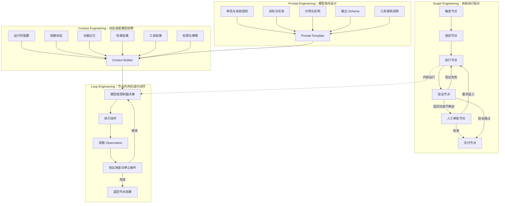
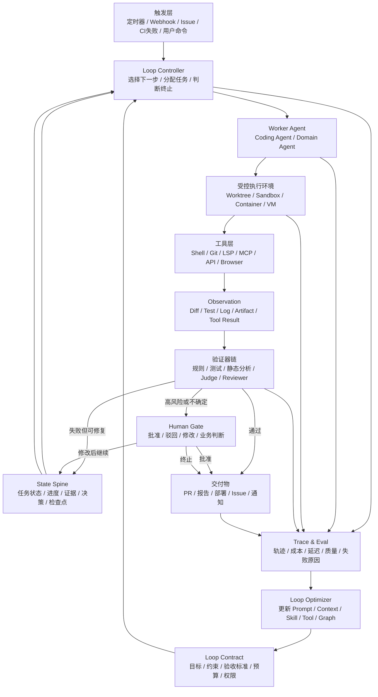
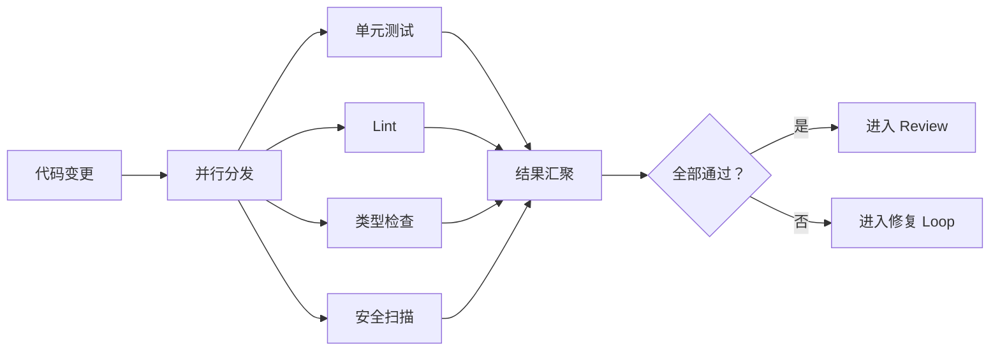
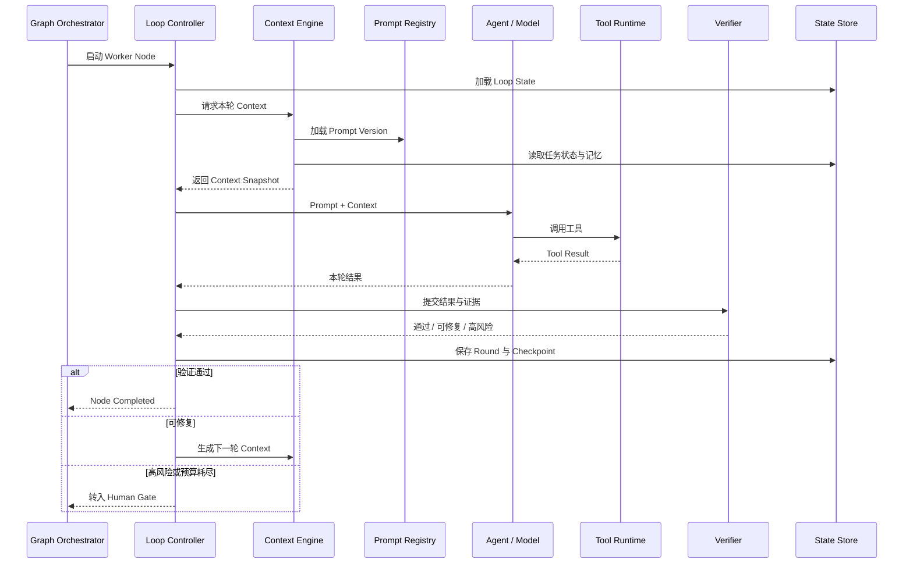
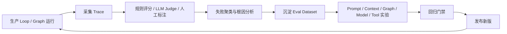
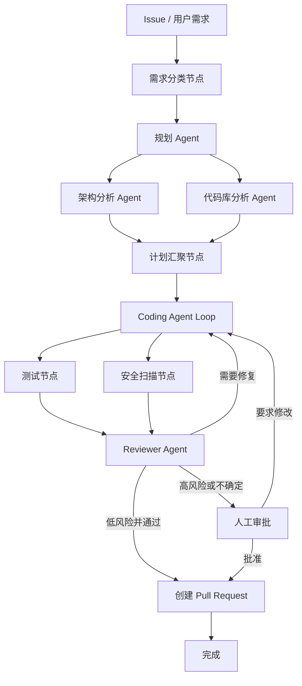
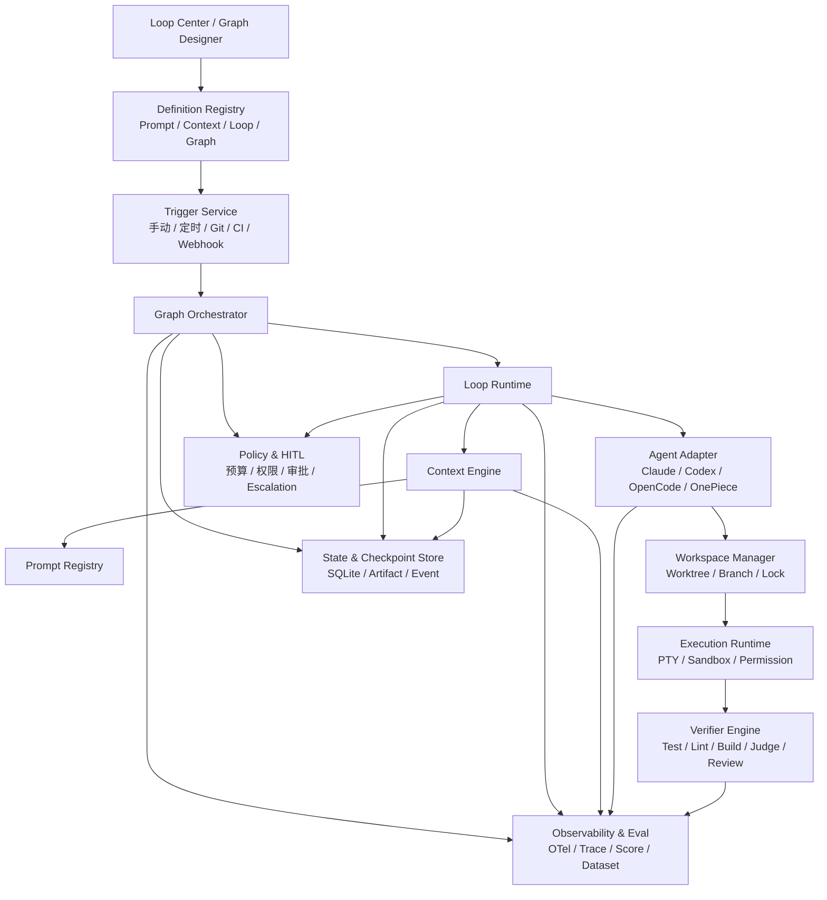

# 附录 V：主流 Loop Engineering 系统全景

> 定位：**四类 Engineering（Prompt/Context/Loop/Graph）的系统全景与主流系统盘点**（全文收录，信息基准 2026-09-01，各系统官方入口见 [C-49]）。与相邻内容的分工：附录 B 是四件方法论的词典速查，第 3 章是 Loop Engineering 的机制主体（附录 B.3 的落点）、第 5/6 章对 Context/Prompt、第 18 章对 Graph——本附录把四件拉通成一张系统全景：统一认知与分层架构、四件各自的职责边界/反模式/核心指标/工程流程、主流 Loop Engineering 系统盘点、Loop 与 Graph 模式库、生产级 Loop Contract、状态恢复与收敛、安全审批、可观测评测、成熟度六级（L0–L5）、选型建议、完整示例与实施路线图。名单会过期，"四件不是替代关系 + 有界 Loop Contract"的框架不过期。

---

### 摘要

Loop Engineering 不是某一个框架或产品，而是一套围绕 Agent 持续执行、反馈、验证、恢复、停止和优化的系统工程方法。它与 Prompt Engineering、Context Engineering、Graph Engineering 分别控制 Agent 系统的不同层面：

- **Prompt Engineering：控制模型指令，解决“怎么说”。**
- **Context Engineering：控制模型视野，解决“给它看什么”。**
- **Loop Engineering：控制迭代闭环，解决“如何持续做并正确停止”。**
- **Graph Engineering：控制系统拓扑，解决“多个节点、Agent 和工具如何连接、路由与协作”。**

完整的生产级 Agent 系统通常不是单一“聪明 Agent”，而是以下能力的组合：

```text
版本化 Prompt
+ 动态 Context
+ 有界 Loop
+ 显式 Graph
+ Durable State
+ Sandbox / Worktree
+ Verifier
+ Policy / Human Gate
+ Trace / Eval
```

本文覆盖：

1. 四类 Engineering 的定义、边界和协同关系；
2. 主流 Coding Agent、Agent 框架、Durable Runtime、低代码平台和评测系统；
3. 常见 Loop 模式、Graph 模式、成熟度分级和选型建议；
4. 生产级 Loop Contract、状态模型、治理与可观测性；
5. 面向 VaneHub AI 的平台化落地架构。

---

## V.1 统一认知：四类 Engineering

### V.1.1 核心定义

| 工程领域 | 核心问题 | 主要控制对象 | 主要产物 |
|---|---|---|---|
| **Prompt Engineering** | 这一轮应该如何向模型表达任务？ | 指令、角色、约束、示例、输出格式 | Prompt Template、Prompt Version |
| **Context Engineering** | 这一轮应该让模型看到什么？ | 历史、状态、记忆、检索结果、工具结果、权限 | Context Policy、Context Snapshot |
| **Loop Engineering** | 系统如何反复执行、验证、恢复并停止？ | 轮次、状态、验证、预算、停止条件 | Loop Contract、Loop Run、Checkpoint |
| **Graph Engineering** | 多个步骤、Agent、工具和验证器如何协作？ | 节点、边、路由、并行、汇聚、子图 | Graph Definition、Node Contract、Edge Policy |

可以用四句话记忆：

> **Prompt Engineering 决定怎么说。**  
> **Context Engineering 决定给它看什么。**  
> **Loop Engineering 决定如何持续做，直到正确停止。**  
> **Graph Engineering 决定多个 Agent、工具和流程如何组成完整系统。**

---

### V.1.2 四者不是替代关系

错误理解：

```text
Prompt Engineering
→ 被 Context Engineering 替代
→ 被 Loop Engineering 替代
→ 再被 Graph Engineering 替代
```

正确理解：

```text
Graph Engineering
负责整个系统的拓扑、路由、并行和协作

Loop Engineering
负责局部与全局的迭代、反馈、验证和停止

Context Engineering
负责每轮模型调用的信息选择、压缩、隔离和装配

Prompt Engineering
负责模型指令、目标、约束和输出契约
```

它们的包含与组合关系可以抽象为：

```text
Agentic System
=
Graph(
    Nodes[
        Loop(
            Model(
                Prompt,
                Context
            ),
            Tools,
            Verifier
        )
    ],
    Shared State,
    Routing Policy,
    Runtime Policy
)
```

关键关系：

- **Prompt 是 Context 的组成部分。**
- **Context 在每次模型调用前动态装配。**
- **Loop 由多次模型调用、工具调用、Observation 和验证组成。**
- **Graph 由确定性节点、模型节点、Agent Loop 节点和人工节点组成。**
- **一个 Graph 可以包含多个 Loop。**
- **一个 Graph Node 内部也可以运行完整 Agent Loop。**

---

### V.1.3 总体分层架构



---

### V.1.4 与 Agent、Harness、Runtime 的关系

| 层级 | 主要解决的问题 | 典型能力 |
|---|---|---|
| Prompt Engineering | 单次模型调用如何表达任务 | 指令、角色、示例、Schema |
| Context Engineering | 单次调用提供哪些动态信息 | RAG、Memory、Context Budget、Compaction |
| Agent Engineering | Agent 如何规划和调用工具 | ReAct、Tool Calling、Planner、Memory |
| Harness Engineering | Agent 在什么环境、权限和工具集里运行 | Sandbox、Hooks、Skills、Permissions、PTY |
| Loop Engineering | 多轮执行为何开始、如何验证和停止 | Trigger、Verifier、Budget、Checkpoint |
| Graph Engineering | 多节点、多 Agent 如何协作 | Node、Edge、Router、Fan-out/Fan-in |
| Durable Runtime | 长任务如何重试、恢复和等待 | Event History、Workflow、Timer、Signal |
| Factory Engineering | 多个 Graph 和 Loop 如何组成生产体系 | Registry、Scheduler、Policy、Eval、发布治理 |

可简化为：

```text
Agent Harness 解决“一次 Agent 怎么跑”
Loop Engineering 解决“为什么反复跑、跑到什么时候、失败后怎么办”
Graph Engineering 解决“多个 Agent 和步骤怎么组织”
Factory Engineering 解决“多个 Loop 如何形成持续生产系统”
```

---

## V.2 Prompt Engineering

### V.2.1 定义

Prompt Engineering 是围绕模型指令进行设计、实验、版本管理和评测的工程活动。它回答：

> **模型在当前调用中应该如何理解任务、遵守哪些规则，并以什么格式返回结果？**

一个 Prompt 不只是用户输入，还可能包含系统角色、任务目标、工具说明、示例、边界条件、输出结构和失败行为。

---

### V.2.2 Prompt 的典型组成

```text
Prompt
├── Role：模型扮演什么角色
├── Goal：本次调用要达成什么目标
├── Background：完成任务所需的静态背景
├── Constraints：禁止事项与约束
├── Procedure：建议执行步骤
├── Tools：工具描述与调用规则
├── Examples：正例、反例与边界案例
├── Output Contract：输出格式或 JSON Schema
├── Evaluation Rubric：质量判断标准
└── Failure Behavior：信息不足或失败时的处理方式
```

示例：

```markdown
# Role

你是代码审查 Agent，负责审查 Pull Request。

# Goal

识别会导致功能错误、安全问题、数据损坏或兼容性回归的问题。

# Constraints

- 不评论纯格式问题。
- 不基于未读取的代码作出结论。
- 每个问题必须提供文件、行号和证据。
- 不允许直接修改代码。

# Output Contract

{
  "approved": true,
  "findings": [
    {
      "severity": "high | medium | low",
      "file": "string",
      "line": 0,
      "evidence": "string",
      "recommendation": "string"
    }
  ]
}
```

---

### V.2.3 Prompt Engineering 的职责

1. **角色定义**：Planner、Worker、Reviewer、Security Auditor。
2. **目标定义**：明确当前调用的成功结果。
3. **指令分层**：区分系统规则、平台规则、用户任务和外部内容。
4. **输出约束**：JSON Schema、Markdown 模板、必填字段。
5. **示例设计**：Few-shot 正例、反例和边界案例。
6. **工具说明**：描述何时、为何、如何调用工具。
7. **失败行为**：信息不足、权限不足、工具失败时如何处理。
8. **模型适配**：不同模型和版本使用不同 Prompt。
9. **版本治理**：Prompt ID、版本、变更记录、灰度和回滚。
10. **评测闭环**：通过固定数据集验证 Prompt 改动是否有效。

---

### V.2.4 Prompt Engineering 不应承担的职责

以下规则不应只依赖自然语言 Prompt：

```text
最多重试三次
测试失败后重新修改代码
每小时自动运行一次
两个 Agent 并行分析
生产部署必须人工批准
应用重启后继续执行
禁止访问工作区外目录
```

它们分别属于：

- **重试、停止、预算**：Loop Engineering；
- **并行、路由、审批节点**：Graph Engineering；
- **状态恢复**：Durable Runtime / State Engineering；
- **文件、网络和命令限制**：Harness / Policy Engineering。

---

### V.2.5 典型反模式

### 反模式一：超级 Prompt

把工作流、状态、检索结果、业务规则和工具协议全部塞入一个超长 Prompt。

后果：

- 难以独立测试和复用；
- 静态规则与动态状态混杂；
- 修改局部内容可能影响全局行为；
- 无法定位失败来自 Prompt、Context 还是流程；
- Token 成本和注入攻击面扩大。

### 反模式二：用自然语言代替确定性策略

例如：

```text
请不要执行危险命令。
请尽量不要访问无关目录。
```

安全边界应由 Sandbox、权限系统、命令策略和人工审批强制执行，而不是依赖模型自律。

### 反模式三：用 Prompt 保存运行状态

例如：

```text
你已经完成第 7 个任务，请记住。
```

模型上下文不是可靠状态数据库。任务进度必须保存到结构化 State Store。

### 反模式四：无版本、无评测

Prompt 改动直接上线，没有固定测试集、模型版本、基线指标和回滚能力。

---

### V.2.6 核心指标

| 指标 | 含义 |
|---|---|
| Instruction Adherence | 模型是否遵守指令 |
| Output Validity | 输出是否符合 Schema |
| Task Accuracy | 单次任务是否正确 |
| Tool Selection Accuracy | 是否选择正确工具 |
| Refusal Correctness | 应拒绝时是否正确拒绝 |
| Prompt Stability | 多次运行是否稳定 |
| Token Cost | Prompt 输入成本 |
| Regression Rate | Prompt 或模型升级后的退化率 |

---

### V.2.7 标准工程流程

```text
定义成功标准
→ 编写 Prompt
→ 准备正例、反例与边界案例
→ 建立 Eval Dataset
→ 执行评测
→ 分析失败
→ 修改 Prompt
→ 灰度发布
→ 监控与回滚
```

---

## V.3 Context Engineering

### V.3.1 定义

Context Engineering 是在每次模型调用前，从多个信息源中选择、过滤、排序、压缩、隔离并装配上下文的工程活动。它回答：

> **当前这一轮，模型究竟应该看到哪些信息，不应该看到哪些信息？**

因此：

```text
Prompt Engineering ⊂ Context Engineering
```

Prompt 是 Context 的一部分，但完整 Context 还包括状态、记忆、检索结果、工具结果、运行配置和权限。

---

### V.3.2 Context Snapshot 的组成

```text
Context Snapshot
├── System Instructions
├── Current User Request
├── Conversation History
├── Runtime Context
│   ├── User ID
│   ├── Workspace
│   ├── Environment
│   └── Permission Scope
├── Short-term State
│   ├── Current Plan
│   ├── Completed Steps
│   ├── Pending Tasks
│   └── Recent Tool Results
├── Long-term Memory
│   ├── User Preferences
│   ├── Historical Decisions
│   ├── Project Conventions
│   └── Learned Knowledge
├── Retrieved Knowledge
│   ├── Documents
│   ├── Source Code
│   ├── Symbol Index
│   ├── Repository Map
│   └── Database Records
├── Available Tools
├── Policy and Trust Labels
└── Output Schema
```

可以把信息来源划分为：

- **Runtime Context**：当前运行时相对稳定的配置；
- **State**：会话或任务级短期状态；
- **Store**：跨会话长期记忆和知识；
- **Retrieval**：按当前任务动态召回的外部内容；
- **Tool Observation**：本轮或前几轮工具执行结果。

---

### V.3.3 Context Engineering 的核心操作

### 1. 选择

不同节点需要不同 Context：

```text
Planner 需要：
- 用户目标
- 需求文档
- Repo Map
- 架构约束

Worker 需要：
- 当前子任务
- 相关代码
- 修改边界
- 测试命令

Reviewer 需要：
- 原始验收标准
- Diff
- 测试报告
- 设计与安全约束
```

### 2. 检索

常见来源包括：

- 向量索引；
- 全文索引；
- Symbol Index；
- LSP；
- AST / Tree-sitter；
- Git History；
- Issue、PR、CI；
- 数据库和业务 API；
- 长期记忆库；
- 文档知识库。

### 3. 排序

常见排序维度：

- 与当前任务的相关性；
- 来源权威性；
- 数据新鲜度；
- 节点角色；
- Token 成本；
- 安全等级；
- 证据完整性。

### 4. 压缩

常见压缩手段：

- 对话摘要；
- 工具结果裁剪；
- 日志去噪；
- 代码结构摘要；
- Repository Map；
- 已完成任务归档；
- 多轮结果合并；
- 保留关键事实、决策与未解决问题。

### 5. 隔离

不同 Agent 不应共享完整上下文：

```text
研究 Agent：
- 只读文档和仓库
- 不拥有写代码权限
- 不接触生产 Secret

实现 Agent：
- 当前子任务
- 相关代码
- 工作区写权限

审查 Agent：
- 原始需求
- Diff
- 验证报告
- 不读取 Worker 的私有推理
```

### 6. 来源与信任管理

每条 Context Item 建议附带：

```yaml
source: github
authority: external_untrusted
retrieved_at: 2026-09-01T06:00:00Z
content_hash: sha256:...
scope: repository
sensitivity: internal
```

模型和平台必须区分：

- 系统与平台指令；
- 用户任务；
- 可信项目文档；
- 外部网页、邮件和 Issue；
- 可能包含 Prompt Injection 的不可信内容。

---

### V.3.4 Context Budget

上下文工程必须有显式预算，而不是依赖模型最大窗口：

```yaml
context_budget:
  total_tokens: 120000

  allocation:
    system_prompt: 8000
    task_definition: 6000
    repository_map: 12000
    retrieved_code: 45000
    conversation_history: 10000
    tool_results: 20000
    reserve_for_output: 19000
```

除了总预算，还应设置类别上限，防止日志、工具结果或聊天历史吞噬全部 Context。

---

### V.3.5 Context 生命周期

```mermaid
flowchart LR
    Need["分析节点信息需求"] --> Source["选择 Context Source"]
    Source --> Retrieve["检索与读取"]
    Retrieve --> Trust["标注来源与信任等级"]
    Trust --> Filter["权限过滤与去噪"]
    Filter --> Rank["排序"]
    Rank --> Compress["压缩与摘要"]
    Compress --> Budget["应用 Token Budget"]
    Budget --> Snapshot["生成 Context Snapshot"]
    Snapshot --> Invoke["调用模型"]
    Invoke --> Observe["记录使用效果"]
    Observe --> Improve["调整 Context Policy"]
    Improve --> Need
```



---

### V.3.6 典型反模式

### Context Stuffing

检索到什么就全部传入模型，导致：

- 相关信息被噪声淹没；
- 成本和延迟增加；
- 模型关注错误位置；
- Prompt Injection 暴露面扩大。

### 使用聊天记录替代结构化状态

聊天记录中包含大量推测、废弃方案和自然语言描述，不应替代：

- Task State；
- Checkpoint；
- Progress Record；
- Verification Evidence。

### 所有 Agent 共享完整 Context

会造成：

- Context 污染；
- 角色与职责模糊；
- 敏感数据越权；
- Worker 与 Reviewer 相互影响；
- 成本失控。

### 只做 RAG，不做 Context 治理

RAG 只是 Context Engineering 的子集。完整上下文工程还需处理：

- 状态装配；
- Memory；
- 工具选择；
- Context Budget；
- 压缩；
- 来源可信度；
- 生命周期与权限。

---

### V.3.7 核心指标

| 指标 | 含义 |
|---|---|
| Context Precision | 传入内容中真正相关内容的比例 |
| Context Recall | 必要信息是否被召回 |
| Context Utilization | 模型是否实际使用相关内容 |
| Stale Context Rate | 过期信息占比 |
| Context Conflict Rate | 不同来源相互矛盾的比例 |
| Token Efficiency | 单位 Token 对任务结果的贡献 |
| Retrieval Latency | 上下文装配延迟 |
| Provenance Coverage | 输出是否可追溯到来源 |
| Context Leakage | 是否向错误节点或 Agent 暴露信息 |

---

## V.4 Loop Engineering

### V.4.1 定义

Loop Engineering 关注如何让 Agent 或工作流经过多轮执行、观察、验证和修复后可靠收敛。它回答：

> **如何让系统反复执行而不失控，并在正确的条件下停止、恢复或升级给人类？**

一个完整 Loop 可以抽象为：

```text
Loop
= Trigger
+ Goal Contract
+ Controller
+ Worker
+ Tools / Sandbox
+ State Spine
+ Observation
+ Verifier
+ Progress Function
+ Stop Condition
+ Budget
+ Checkpoint
+ Human Escalation
+ Trace / Evaluation
```

---

### V.4.2 总体架构



该架构包含三个嵌套闭环：

1. **内层执行循环**：模型调用工具，读取结果，再决定下一步。
2. **中层验证循环**：Worker 产出结果，Verifier 检查，不通过则返工。
3. **外层优化循环**：分析大量运行轨迹，更新 Prompt、Context、Skill、Graph、工具和策略。

---

### V.4.3 Loop 的四个层级

### 1. 模型内部工具循环

```text
Model
→ Tool Call
→ Tool Result
→ Model
→ Final Answer
```

典型形态：ReAct、Function Calling、Tool Calling Agent。

### 2. 节点内部验证循环

```text
生成代码
→ 执行测试
→ 分析失败
→ 修改代码
→ 再次测试
```

通常运行在某个 Worker Node 内部。

### 3. 任务级外层循环

```text
加载任务状态
→ 启动一个 Agent Run
→ 保存工件
→ 独立验证
→ 决定是否再次启动 Agent
```

可以跨会话、跨进程、跨应用重启。

### 4. 系统优化循环

```text
采集生产 Trace
→ 聚类失败
→ 构建 Eval Dataset
→ 修改 Prompt / Context / Graph / Tool
→ 离线评测
→ 灰度发布
```

这类 Loop 改进的是 Agent Harness 与控制系统，而不是当前任务本身。

---

### V.4.4 六项核心正确性要求

### 1. 有界性

每个 Loop 必须有明确上限：

- 最大轮数；
- 最大 Token；
- 最大成本；
- 最大运行时间；
- 最大工具调用次数；
- 最大重试次数；
- 最大无进展轮数。

### 2. 收敛性

Loop 必须定义 Progress Function：

```text
测试失败数量是否下降
未完成任务数量是否减少
覆盖率是否提高
Verifier Score 是否上升
Issue Checklist 是否减少
高严重级问题是否消除
```

没有 Progress Function，系统无法区分：

- 正常迭代；
- 原地重复；
- 在两个方案之间振荡；
- 已经无法继续。

### 3. 可验证性

完成不能只由 Worker 自己声明。建议使用三层验证：

```text
确定性验证：
- Test
- Lint
- Build
- Type Check
- Security Scan
- Schema Validation

模型验证：
- Requirement Coverage
- Design Quality
- Semantic Consistency
- Reviewer Agent

人工验证：
- 产品判断
- 高风险审批
- 不可逆操作
```

### 4. 可恢复性

关键步骤应保存：

- 当前状态；
- 已完成任务；
- Workspace / Worktree；
- Commit 或 Patch；
- Tool Result；
- Verification Evidence；
- Budget Consumption；
- 下一步建议。

### 5. 幂等性

步骤重试不应导致：

- 重复创建 Issue；
- 重复发送邮件；
- 重复扣款；
- 重复部署；
- 重复提交相同变更。

### 6. 可治理性

Loop 必须受以下策略约束：

- 文件与网络权限；
- Secret Scope；
- 命令策略；
- 人工审批；
- 成本预算；
- 并发限制；
- 数据保留；
- 审计要求。

---

### V.4.5 Loop 不等于 `while true`

错误实现：

```python
while True:
    result = agent.run(task)

    if "DONE" in result:
        break
```

问题：

- Agent 可能错误声明完成；
- 没有外部 Verifier；
- 没有预算和超时；
- 没有无进展检测；
- 没有状态恢复；
- 没有幂等控制；
- 没有人工升级。

更可靠的逻辑应接近：

```text
while budget.available:
    state = load_checkpoint()
    action = controller.next(state)
    observation = worker.execute(action)
    evidence = verifier.verify(observation)
    state = reducer.apply(state, observation, evidence)

    if stop_policy.satisfied(state, evidence):
        complete(state)
        break

    if progress_policy.stalled(state):
        escalate(state)
        break

    save_checkpoint(state)
```

---

### V.4.6 Loop Engineering 指标

| 指标 | 含义 |
|---|---|
| Task Success Rate | 任务最终成功率 |
| Strict Verification Pass Rate | 通过全部门禁的比例 |
| Average Rounds | 平均迭代轮数 |
| Premature Stop Rate | 过早停止比例 |
| Infinite / Stalled Loop Rate | 卡住或无进展比例 |
| Recovery Success Rate | 崩溃后恢复成功率 |
| Human Escalation Rate | 升级给人工的比例 |
| Cost per Successful Run | 每次成功任务的成本 |
| Verification Yield | 每轮修复带来的验证收益 |
| Rework Rate | 验证后返工比例 |

---

## V.5 Graph Engineering

### V.5.1 定义与边界

Graph Engineering 指把 Agent 系统建模为显式执行图，并工程化设计：

- 节点；
- 边；
- 共享状态；
- 路由条件；
- 并发与汇聚；
- 循环边；
- Checkpoint；
- 失败边界；
- 子图与版本迁移。

这里的 Graph 主要指**执行图或任务图**，不等同于知识图谱。

| 类型 | 节点 | 边 | 目的 |
|---|---|---|---|
| 执行图 | Agent、工具、函数、人工节点 | 控制流、数据流、事件流 | 决定系统如何执行 |
| 任务依赖图 | Task、Work Item | 依赖关系 | 决定任务顺序和并行 |
| 知识图谱 | 实体、概念、事实 | 语义关系 | 组织与检索知识 |
| 调用图 | 服务、函数、Agent | 调用关系 | 分析系统依赖 |
| Trace Graph | Span、Run、Tool Call | 父子与因果关系 | 可观测性和根因分析 |

---

### V.5.2 Graph 基本原语

```text
Graph
├── Input Schema
├── Shared State
├── Nodes
│   ├── Deterministic Node
│   ├── LLM Node
│   ├── Agent Loop Node
│   ├── Tool Node
│   ├── Verifier Node
│   └── Human Node
├── Edges
│   ├── Sequential Edge
│   ├── Conditional Edge
│   ├── Parallel Edge
│   ├── Loop-back Edge
│   └── Error Edge
├── Reducers
├── Checkpoints
├── Subgraphs
└── Output Schema
```

核心概念：

- **State**：当前 Graph 的共享状态；
- **Node**：执行具体逻辑的单元；
- **Edge**：决定下一步运行哪个节点；
- **Reducer**：合并并行节点或增量状态；
- **Checkpoint**：保存可恢复的执行快照；
- **Subgraph**：可复用的局部流程。

---

### V.5.3 节点拆分原则

节点应在以下边界上拆分：

- 权限不同；
- Context 不同；
- 失败模式不同；
- 重试策略不同；
- 验证方式不同；
- 使用模型不同；
- 资源消耗不同；
- 审计要求不同。

不建议：

```text
一个 Agent 完成需求分析、编码、测试、审查和合并
```

建议：

```text
Requirement Analyzer
→ Planner
→ Implementation Agent
→ Test Runner
→ Security Scanner
→ Reviewer
→ Human Approval
→ Merge
```

---

### V.5.4 节点契约

每个节点应显式定义：

```yaml
node:
  id: implementation
  input_schema: ImplementationTask
  output_schema: ImplementationResult

  context_policy: implementation-context-v3
  prompt_ref: implementation-agent-v5
  permissions: workspace-write

  timeout: 45m
  retries: 2

  side_effects:
    - modify_workspace
    - create_commit
```

节点契约至少回答：

- 接收什么输入；
- 返回什么输出；
- 使用什么 Prompt；
- 使用什么 Context；
- 拥有什么权限；
- 能产生哪些副作用；
- 如何重试和超时；
- 如何验证结果。

---

### V.5.5 边语义

Edge 不应只是 A 到 B，还要说明跳转原因和传递数据：

```yaml
edge:
  from: verifier
  to: implementation

  when:
    verification_status: failed
    repairable: true

  payload:
    include:
      - findings
      - failed_tests
      - relevant_diff
```

常见边类型：

- 固定顺序边；
- 条件边；
- 错误边；
- 补偿边；
- 人工审批边；
- 循环返回边；
- 并行分发边；
- 汇聚边。

---

### V.5.6 状态所有权

建议明确字段所有者：

```text
Planner：
- execution_plan
- task_dependencies

Worker：
- workspace_changes
- implementation_notes

Verifier：
- verification_evidence
- verification_status

Policy Engine：
- approval_status
- budget_status

Controller：
- current_node
- run_status
```

这样可以避免多个并行节点任意覆盖同一字段。

---

### V.5.7 Fan-out / Fan-in



Fan-in 必须定义 Reducer，例如：

```text
all_pass
any_fail
majority_vote
weighted_score
highest_severity
first_success
first_failure
```

---

### V.5.8 循环边与子图

Graph 中的循环边必须具备：

- 最大循环次数；
- Progress Function；
- 状态更新规则；
- 预算；
- 失败退出路径；
- Escalation。

复杂系统应封装 Subgraph：

```text
Main Delivery Graph
├── Requirement Subgraph
├── Implementation Subgraph
├── Verification Subgraph
├── Review Subgraph
└── Release Subgraph
```

---

### V.5.9 Graph、DAG、Workflow、State Machine 的区别

### DAG

有向无环图，不允许回到之前节点。

适合：

- ETL；
- Batch；
- 构建系统；
- 固定数据流水线。

### Graph

允许：

- 条件分支；
- 循环；
- 并行；
- 子图；
- 动态路由；
- Human Gate。

### Workflow

Workflow 是更广泛概念，可以使用：

- 普通代码；
- 状态机；
- DAG；
- Graph；
- BPMN；
- Event-driven Architecture。

### State Machine

State Machine 关注：

```text
当前处于什么状态
什么事件导致状态迁移
```

Graph 关注：

```text
哪个节点执行
数据如何流动
下一步路由到哪里
```

生产系统通常组合二者：

```text
Graph：表达执行结构
State Machine：表达 Run 生命周期
```

---

### V.5.10 Loop Engineering 与 Graph Engineering 的区别

| 对比项 | Loop Engineering | Graph Engineering |
|---|---|---|
| 关注重点 | 迭代、反馈、验证、停止 | 拆分、连接、路由、并发、汇聚 |
| 基本结构 | Cycle | Node + Edge + State |
| 是否必须有环 | 是 | 否 |
| 是否可以是 DAG | 否 | 是 |
| 是否关注并行 | 次要 | 核心 |
| 是否关注 Fan-in | 通常较少 | 必须设计 |
| 状态范围 | 当前 Loop State | 全局状态与节点状态 |
| 失败处理 | Retry、Repair、Escalation | Error Edge、Fallback、Subgraph Recovery |
| 典型问题 | 如何跑到正确完成 | 整个系统如何组织 |

关系可概括为：

```text
Loop 是 Graph 中的一种循环结构
Graph 是组织多个 Loop 的更高层结构
```

---

### V.5.11 Graph Engineering 典型反模式

### 把流程图当执行图

一张 Mermaid 图不等于可执行 Graph。真正的 Graph 还需要：

- Schema；
- 路由条件；
- 状态；
- 错误边；
- Checkpoint；
- 版本；
- 可观测数据。

### 每个节点都是 Agent

以下节点更适合确定性实现：

- Schema Validation；
- 权限判断；
- 数值计算；
- Test Runner；
- Git 操作；
- Budget 检查；
- 状态迁移。

### 让 LLM 决定所有路由

以下路由应优先使用确定性条件：

```text
测试失败 → 修复节点
安全扫描失败 → 安全审查节点
预算耗尽 → 人工升级节点
生产部署 → 审批节点
```

### 隐式共享状态

多个 Agent 通过聊天内容推测彼此进度，会导致：

- 状态不一致；
- 并行冲突；
- 无法恢复；
- 无法审计。

### 无边界并行

必须考虑：

- Workspace 冲突；
- 模型限流；
- Token 成本；
- 汇聚策略；
- Backpressure；
- 关键路径延迟。

---

### V.5.12 Graph Engineering 指标

| 指标 | 含义 |
|---|---|
| Routing Accuracy | 是否路由到正确节点 |
| Node Success Rate | 各节点成功率 |
| Fan-in Conflict Rate | 并行结果合并冲突率 |
| Critical Path Latency | 关键路径耗时 |
| Graph Completion Rate | 整图完成率 |
| Recovery Rate | 节点或子图恢复成功率 |
| State Conflict Rate | 状态更新冲突比例 |
| Branch Distribution | 各分支被选择的比例 |
| Human Gate Rate | 进入人工节点的比例 |
| Graph Migration Failure Rate | Graph 版本迁移失败率 |

---

## V.6 四类 Engineering 的协同关系

### V.6.1 一次 Agent 执行的完整链路



---

### V.6.2 统一职责矩阵

| 配置或能力 | 主要归属 |
|---|---|
| `prompt_ref` | Prompt Engineering |
| `context_policy_ref` | Context Engineering |
| `max_rounds`、`stop_when` | Loop Engineering |
| `nodes`、`edges`、`parallel`、`fan-in` | Graph Engineering |
| `permissions`、Sandbox | Harness / Policy Engineering |
| `state_schema`、Checkpoint | State / Durable Runtime |
| Trace、Score、Dataset | Observability / Evaluation |
| Human Approval | Graph + Policy + Loop State |

---

### V.6.3 故障不能只从 Prompt 找原因

例如“Agent 没有完成任务”，可能来自：

- Prompt 目标不明确；
- Context 缺少关键代码；
- Loop 过早停止；
- Graph 将任务路由给错误 Agent；
- Sandbox 权限不足；
- Verifier 错误；
- Checkpoint 恢复到了旧状态；
- 预算策略过紧。

因此生产系统需要分层诊断，而不是不断增大 Prompt。

---

## V.7 主流 Loop Engineering 系统全景

主流生态可以分为五层：

```text
第一层：Coding Agent / Worker
Claude Code、OpenAI Codex、GitHub Copilot Coding Agent、
OpenHands、Ralph Pattern

第二层：Agent Runtime / Graph Controller
LangGraph、OpenAI Agents SDK、Google ADK、
Microsoft Agent Framework、Pydantic AI、
CrewAI、Strands Agents、Haystack

第三层：Durable Execution
Temporal、Restate、DBOS、Inngest、Prefect

第四层：低代码与业务集成
Dify、Flowise、n8n、Langflow

第五层：Trace、Eval 与持续优化
LangSmith、Langfuse、Braintrust、Phoenix、
MLflow、W&B Weave、OpenTelemetry
```

---

### V.7.1 第一类：原生 Coding Agent Loop

### Claude Code

适合定位：

- 本地 Coding Agent；
- 项目级 Skills 与 Hooks；
- Subagent 协作；
- Worktree 并行；
- 自动修复与验证闭环；
- 作为外部 Loop Controller 的 Worker。

优势：

- 代码、Shell、Git 和测试操作直接；
- Skills、Hooks、Subagent 组合自然；
- 适合 Maker–Checker、Test–Repair 和定时巡检。

边界：

- 企业级跨机器 Durable State；
- 全局预算和并发调度；
- 多 Loop 控制面；
- 跨产品统一治理通常需要外部平台。

### OpenAI Codex

适合定位：

- 本地和后台 Coding Agent；
- CLI 或非交互执行；
- 独立 Worktree；
- Sandbox 与 Approval Policy；
- 在 CI 或平台中作为 Worker。

典型 Loop：

```text
定时扫描 Issue
→ 创建 Worktree
→ Codex 分析和修改
→ 执行测试
→ Hooks 进行质量检查
→ 创建 PR 或进入人工审批
```

### GitHub Copilot Coding Agent

适合定位：

- GitHub 原生 Ticket-to-PR；
- Issue 自动实现；
- PR 评论驱动返工；
- CI 失败修复；
- 依赖和文档更新。

优势是与 Issue、Pull Request、Branch Protection、Review 流程紧密结合。

边界是跨 GitHub 之外的业务系统、桌面运行时、多 CLI 编排和自定义沙箱控制能力较弱。

### OpenHands

适合定位：

- 开源 Coding Agent Runtime；
- Docker / Kubernetes / 远程 Sandbox；
- 多租户 Agent 服务；
- 自动 Code Review；
- 自定义前端和平台控制面。

需要重点治理：

- Headless 自动批准模式；
- 容器和网络隔离；
- 凭据范围；
- 工具权限和审计。

### Ralph / Ralph Wiggum Pattern

典型流程：

```text
读取 PRD 与 progress 文件
→ 启动一个全新 Coding Agent 会话
→ 完成一部分任务
→ 运行测试
→ 提交代码并更新进度
→ 退出当前上下文
→ 启动下一个干净会话
→ 重复
```

优势：

- 简单；
- 模型无关；
- 通过 Fresh Context 避免单会话无限膨胀；
- 易于使用 Shell、Cron 或 CI 实现。

不足：

- 常见实现只是 Bash Loop；
- 缺少事务、强一致状态和并发控制；
- 容易信任过期进度文件；
- 容易重复尝试和错误停止。

Ralph 更适合作为最小 Loop 模式，而不是企业级最终架构。

---

### V.7.2 第二类：通用 Agent 与 Graph 框架

| 系统 | 核心定位 | Loop / Graph 能力重点 | 典型场景 |
|---|---|---|---|
| LangGraph | 有状态图运行时 | 循环图、Checkpoint、Interrupt、持久状态 | 复杂可控 Agent |
| OpenAI Agents SDK | 轻量 Agent Runtime | 内置循环、Handoff、Guardrail、Session、Tracing | 轻量单/多 Agent |
| Google ADK | Agent Workflow SDK | Sequential、Parallel、Loop、Graph、协作 | Google Cloud、多 Agent |
| Microsoft Agent Framework | 企业 Agent 与 Workflow | Checkpoint、HITL、类型化 Workflow | Azure、.NET、企业系统 |
| Pydantic AI | 类型安全 Agent SDK | Typed State、Graph、Durable Integration | Python 生产 Agent |
| CrewAI | Flow + Crew | 事件驱动、角色协作、条件和循环 | 业务自动化、多角色 |
| Strands Agents | 模型驱动 Agent SDK | Graph、Swarm、Workflow、A2A | AWS、多模型 Agent |
| Haystack | Agentic Pipeline | Agent Loop、Pipeline Loop、RAG、Hook | 检索、RAG、数据管道 |

### LangGraph

核心能力：

- State、Node、Edge；
- 显式循环和条件边；
- Checkpoint；
- Durable Execution；
- Human-in-the-loop Interrupt；
- Subgraph；
- 并行和流式执行；
- 确定性节点与 Agent 节点混合。

适合表示：

```text
Planner
→ Executor
→ Verifier
    ├── 通过 → Finish
    ├── 可修复 → Executor
    ├── 需要重规划 → Planner
    └── 高风险 → Human Approval
```

### OpenAI Agents SDK

核心能力：

- 内置 Agent Loop；
- Function Tools；
- Agents as Tools；
- Handoffs；
- Guardrails；
- Sessions；
- Human-in-the-loop；
- Tracing；
- MCP。

特点是轻量、代码优先。复杂 Graph、长期任务和强状态管理通常需配合外部 Durable Runtime。

### Google ADK

核心能力：

- Sequential、Parallel、Loop Agent；
- Graph-based Workflow；
- Dynamic Workflow；
- Collaborative Workflow；
- Human Input；
- 自定义 Agent 编排。

适合 Google 生态和多语言 Agent Workflow。Loop 必须有明确退出机制，避免无限循环。

### Microsoft Agent Framework

定位为微软企业 Agent 与 Workflow 的统一方向，强调：

- 单 Agent 与多 Agent；
- 显式 Workflow；
- Checkpoint；
- Human-in-the-loop；
- 类型化节点和状态；
- 企业遥测与 Azure 集成。

### Pydantic AI

特点：

- 类型安全输入输出；
- Pydantic 校验；
- Typed State；
- Graph 驱动；
- 与 Temporal、DBOS、Prefect、Restate 等 Durable Runtime 集成；
- 适合结构化数据和严格 Schema 场景。

### CrewAI

采用：

- **Flow**：状态、条件、事件、分支、循环；
- **Crew**：多个角色化 Agent 协作。

适合快速构建业务型多 Agent，但复杂事务、重放和跨语言 Worker 需评估底层运行时。

### Strands Agents

主要模式：

- **Graph**：显式节点和边；
- **Swarm**：Agent 自主 Handoff；
- **Workflow**：顺序、依赖和并行任务；
- Agents as Tools；
- Session；
- Hooks；
- MCP / A2A。

### Haystack

强项是 Agent Loop 与 RAG Pipeline 结合：

```text
检索
→ 生成
→ 验证
→ 重写查询
→ 重新检索
```

适合搜索、知识问答、数据处理和自校正 RAG。

---

### V.7.3 第三类：Durable Loop Runtime

Agent 框架通常负责“下一步做什么”，Durable Runtime 负责：

- 崩溃后恢复；
- 已完成步骤不重复；
- 步骤级重试；
- 等待人工数小时或数天；
- 持久 Timer 和 Event；
- 多 Worker 调度；
- 幂等、并发和超时。

| 系统 | 核心模型 | 主要特点 | 适合场景 |
|---|---|---|---|
| Temporal | Workflow + Activity + Event History | 确定性重放、Signal、Timer、成熟分布式运行时 | 关键长任务、大规模平台 |
| Restate | Durable Service / Workflow | 状态、并发协调、服务化 Agent | 分布式 Agent 服务 |
| DBOS | Postgres-backed Workflow | 库式接入、数据库检查点 | Python/TS 后端 |
| Inngest | Event-driven Durable Function | 事件、定时、并发、限流、Serverless | SaaS 后台 Agent |
| Prefect | Flow + Task | Python、数据与 ML 工作流 | Data / ML / Agent Pipeline |

### Temporal

适合：

- 数小时到数天的关键任务；
- 完整审计历史；
- Human Signal；
- Durable Timer；
- 大规模分布式 Worker。

代价：

- 运行时和运维复杂度较高；
- Workflow 代码需满足确定性约束；
- 必须正确划分 Workflow 与 Activity。

### Restate

适合：

- Durable Service；
- 持久模型调用和工具调用；
- 分布式 Agent、Human、MCP 服务协调；
- 空闲等待时释放计算资源。

### DBOS

特点：

- 基于 Postgres 持久化步骤输入输出；
- 进程重启后继续；
- 队列、并发、限流、优先级；
- 以库方式增加 Durable Execution。

### Inngest

适合：

- Event Trigger；
- Cron；
- Durable Step；
- Fan-out；
- 限流与并发；
- Serverless Agent 后台任务；
- Human-in-the-loop。

### Prefect

适合数据、ML 和 Agent Pipeline，强调 Python Flow、Task、Retry、Cache 和调度。

---

### V.7.4 第四类：低代码与可视化系统

### Dify

主要能力：

- 显式 Loop Node；
- 跨轮 Loop Variables；
- 表达式终止条件；
- 最大循环次数；
- Exit Loop；
- Human Input；
- Agent Node 内部工具循环。

适合：

- 内容反复优化；
- 报告生成与校验；
- RAG 自校正；
- 人工审核；
- 业务审批。

### Flowise Agentflow

主要能力：

- 可视化 Agent；
- 条件路由；
- Human-in-the-loop；
- Checkpoint；
- Agent as Tool；
- 等待人工输入时暂停。

适合原型和可视化编排，复杂事务和强版本治理通常需外接后端。

### n8n

优势是企业 SaaS 和业务系统连接：

- AI Agent；
- Agent 调用工具；
- Agent as Tool；
- 高风险工具调用人工批准；
- Fallback 到人工；
- CRM、邮件、工单、通知和审批。

不适合作为复杂 Coding Agent 的代码理解和沙箱运行时。

### Langflow

主要能力：

- 可视化 Agent；
- MCP；
- Flow API；
- 后台执行；
- A2A；
- 基础 Loop / Iteration 组件。

复杂返工闭环通常需要自定义组件或后端状态机。

---

### V.7.5 第五类：Trace、Eval 与持续优化

### LangSmith

适合：

- Agent Trace；
- 离线评测；
- 在线评测；
- LLM-as-a-Judge；
- 将生产问题转为测试案例；
- 与 LangGraph 集成。

### Langfuse

适合：

- 开源、自托管；
- Trace；
- Prompt Version；
- Dataset；
- Experiment；
- Manual Annotation；
- Code Evaluator；
- LLM Judge。

### Braintrust

强调：

- 生产 Trace；
- 在线异步评分；
- Dataset；
- Experiment；
- Scorer；
- Human Review；
- 真实失败转评测案例。

### Phoenix、MLflow、W&B Weave

共同覆盖：

- Agent Trace；
- Dataset 和 Experiment；
- OpenTelemetry；
- LLM Eval；
- Session、Turn、Step、Tool、Sub-agent 视角；
- 版本与生产监控。

### OpenTelemetry

适合作为框架中立的底层观测协议，统一采集：

- Loop Run；
- Graph Run；
- Node Run；
- Agent Turn；
- Model Call；
- Tool Call；
- Sub-agent；
- Verification；
- Human Approval；
- Token、Cost、Latency；
- Stop Reason；
- Retry 与 Failure。

---

## V.8 主流 Loop 与 Graph 模式

### V.8.1 主流 Loop 模式

| 模式 | 基本结构 | 典型停止条件 | 适用场景 |
|---|---|---|---|
| ReAct Loop | Reason → Act → Observe | 返回 Final、达到步数上限 | 工具调用 Agent |
| Generator–Critic | 生成 → 评价 → 修改 | 质量分达到阈值 | 内容、代码、方案 |
| Test–Repair | 修改 → 测试 → 修复 | 测试、Lint、构建通过 | Coding Agent |
| Plan–Execute–Replan | 规划 → 执行 → 更新规划 | 所有任务完成 | 长任务 |
| Controller–Worker | Controller 分配 → Worker 执行 | Controller 接受证据 | 多 Agent |
| Maker–Checker | 实现 Agent → 独立审查 Agent | Checker 批准 | 高质量交付 |
| Fresh-context Loop | 新会话 → 完成一部分 → 持久化 | Checklist 完成 | 长程编码 |
| Event-driven Loop | Event → Agent → Action | 事件处理完成 | CI、Issue、运营 |
| Human Approval Loop | Agent → 请求批准 → 继续 | 批准或拒绝 | 高风险操作 |
| Hill-climbing Loop | Trace → Eval → 修改 Harness | 新版本优于基线 | 持续优化 |

---

### V.8.2 主流 Graph 模式

### Sequential Pipeline

```text
Analyze → Plan → Implement → Verify → Deliver
```

适合步骤清晰、依赖固定的流程。

### Conditional Routing

```text
Classifier
├── Bug → Coding Agent
├── Question → RAG Agent
└── High Risk → Human
```

### Fan-out / Fan-in

```text
任务
→ 并行专家分析
→ 结果汇聚
→ 决策
```

### Supervisor–Specialist

```text
Supervisor
├── Research Agent
├── Coding Agent
├── Test Agent
└── Security Agent
```

### Debate / Review Graph

```text
Maker
→ Reviewer A
→ Reviewer B
→ Arbiter
```

### Hierarchical Graph

```text
Portfolio Graph
→ Project Graph
→ Task Subgraph
→ Agent Loop
```

### Event-driven Graph

节点由外部事件、Timer、Webhook 或消息队列触发。

### Compensation Graph

用于处理有副作用的步骤：

```text
部署失败
→ 回滚部署
→ 恢复配置
→ 通知人工
```

---

## V.9 生产级 Loop Contract

一个生产 Loop 不应只有 Prompt，而应有版本化 Contract：

```yaml
id: governed-scm-delivery
version: 1.0.0

trigger:
  type: issue_created
  filters:
    labels: [agent-ready]

goal:
  description: 完成 Issue 并创建通过全部门禁的 Pull Request

inputs:
  repository: required
  issue_id: required

controller:
  strategy: planner-worker-verifier
  max_rounds: 12

worker:
  agent: coding-agent
  isolation: git-worktree
  sandbox: workspace-write

state:
  backend: sqlite
  checkpoint_after:
    - planning
    - code_change
    - verification

verifiers:
  - requirements_coverage
  - unit_tests
  - lint
  - build
  - security_scan
  - diff_scope
  - reviewer_agent

stop_when:
  all_verifiers_pass: true

budgets:
  max_tokens: 500000
  max_cost_usd: 30
  max_duration_minutes: 180
  max_no_progress_rounds: 2

permissions:
  network: restricted
  secrets: scoped
  destructive_git: deny
  deploy_production: human_approval

escalation:
  on_budget_exhausted: human
  on_repeated_failure: human
  on_high_risk_action: human

artifacts:
  - plan
  - patch
  - test_report
  - pull_request

telemetry:
  traces: true
  evaluation: true
```

Contract 的价值：

- 从 Prompt 中提取控制逻辑；
- 可审核、可测试、可版本化；
- 支持跨 Agent 复用；
- 可进行预算和权限治理；
- 可比较不同模型、Prompt、Context 和 Worker；
- 可记录完整执行证据。

---

## V.10 状态、恢复、停止与收敛

### V.10.1 推荐状态机

```text
CREATED
READY
RUNNING
WAITING_AGENT
WAITING_TOOL
VERIFYING
WAITING_APPROVAL
PAUSED
BLOCKED
COMPLETED
FAILED
CANCELLED
```

状态迁移必须由确定性规则控制，不应仅由模型自然语言决定。

---

### V.10.2 Checkpoint 内容

```text
LoopCheckpoint
├── graph_version
├── loop_definition_version
├── current_node
├── current_round
├── structured_state
├── workspace_reference
├── commit_or_patch
├── completed_actions
├── pending_actions
├── verification_evidence
├── budget_usage
├── approval_state
├── context_snapshot_refs
└── resume_token
```

---

### V.10.3 Stop Condition

停止条件应分层：

### 成功停止

- 所有必要验证通过；
- 所有验收项完成；
- 交付物存在且可访问；
- 无阻断级风险；
- 必要人工审批完成。

### 失败停止

- 预算耗尽；
- 超过最大轮数；
- 连续多轮无进展；
- 不可恢复工具错误；
- 权限无法满足；
- 发现高风险冲突。

### 暂停

- 等待人工输入；
- 等待审批；
- 等待外部系统；
- 限流；
- 资源不足。

---

### V.10.4 无进展检测

可组合以下信号：

```text
相同工具调用重复出现
相同错误连续出现
Diff Hash 未变化
测试失败集合不变
Verifier Score 未提升
任务 Checklist 未减少
在两个状态间反复振荡
```

建议状态：

```yaml
progress:
  score: 0.42
  delta_last_round: 0.00
  no_progress_rounds: 2
  repeated_error_signature: test::auth::timeout
  oscillation_detected: false
```

---

### V.10.5 重试、修复与重规划的区别

- **Retry**：输入和策略基本不变，处理临时故障。
- **Repair**：根据验证反馈修改当前产物。
- **Replan**：当前方案失效，重新制定步骤或依赖。
- **Escalate**：系统无法安全或经济地继续，交给人工。
- **Fallback**：切换模型、工具、Agent 或执行路径。

---

## V.11 安全、权限与人工审批

### V.11.1 权限必须是确定性机制

安全不能只写在 Prompt 中。需要在以下层面强制：

- 文件系统；
- 网络；
- Shell 命令；
- Git 操作；
- Secret；
- MCP / API；
- 数据库；
- 部署环境；
- 用户身份；
- Agent 角色。

---

### V.11.2 最小权限模型

```yaml
permissions:
  filesystem:
    mode: workspace-write
    allowed_paths:
      - /workspace/repo
    denied_paths:
      - ~/.ssh
      - ~/.aws

  network:
    mode: allowlist
    hosts:
      - api.github.com

  shell:
    deny:
      - rm -rf /
      - git push --force
      - sudo

  secrets:
    scopes:
      - github:pull-request:create

  approvals:
    required_for:
      - production_deploy
      - destructive_git
      - external_message_send
```

---

### V.11.3 Human-in-the-loop 是一等状态

人工介入不是异常，而是显式节点和状态：

- `WAITING_APPROVAL`；
- `WAITING_INPUT`；
- `BLOCKED`；
- `CHANGES_REQUESTED`；
- `REJECTED`。

必须支持：

- 应用关闭后恢复；
- 审批超时；
- 审批人身份验证；
- 修改意见作为结构化反馈；
- 审批决策审计。

---

### V.11.4 Prompt Injection 防御

Prompt Injection 不能仅靠“告诉模型不要受骗”。需要组合：

1. Context 来源与信任等级；
2. 不可信内容与系统指令隔离；
3. 高风险工具不直接暴露给读取外部内容的 Agent；
4. 最小权限；
5. 数据流和工具流控制；
6. 高风险操作人工确认；
7. 对外部内容进行引用和证据追踪；
8. 输出到执行命令之间增加 Policy Gate。

---

## V.12 可观测性、评测与自我改进

### V.12.1 三层闭环



---

### V.12.2 推荐 Trace 层级

```text
Graph Run
└── Node Run
    └── Loop Run
        └── Round
            ├── Model Call
            ├── Tool Call
            ├── Context Build
            ├── Verification
            └── Human Interaction
```

---

### V.12.3 核心 Telemetry 字段

```text
graph.id
graph.version
graph.run_id
node.id
node.kind
loop.id
loop.version
loop.round
agent.adapter
model.provider
model.name
prompt.version
context.policy_version
context.tokens
tool.name
tool.duration
verification.status
verification.score
budget.tokens_used
budget.cost_used
stop.reason
error.type
retry.count
human.approval_status
```

---

### V.12.4 评测维度

| 维度 | 示例 |
|---|---|
| 任务结果 | 是否满足验收标准 |
| 轨迹质量 | 是否走了合理步骤 |
| 工具使用 | 是否调用正确工具 |
| 上下文 | 是否召回并使用关键证据 |
| 停止正确性 | 是否过早或过晚停止 |
| 安全 | 是否越权或触发高风险操作 |
| 成本 | Token、金额、时长 |
| 恢复 | 崩溃后能否继续 |
| Graph 路由 | 是否进入正确节点 |
| 人工体验 | 审批信息是否充分 |

---

### V.12.5 自我改进的安全边界

系统可以自动：

- 提出 Prompt 改进候选；
- 生成 Skill 更新草案；
- 调整 Context Policy 候选；
- 发现缺失 Verifier；
- 建议 Graph 路由优化；
- 生成 Eval Case。

但不应无门槛自动修改并发布生产控制逻辑。推荐流程：

```text
生成候选改动
→ 离线 Eval
→ 与基线比较
→ 安全与回归门禁
→ 人工审批
→ 灰度发布
→ 生产监控
→ 自动回滚
```

---

## V.13 成熟度分级

### L0：人工 Prompt

```text
人 → Agent → 人 → Agent
```

特点：

- 人类逐轮驱动；
- 无自动 Loop；
- 无持久状态；
- 无系统验证。

---

### L1：单会话 Agent Loop

```text
模型 → 工具 → Observation → 模型
```

具备工具调用，但通常缺乏外部验证和跨会话恢复。

---

### L2：验证闭环

```text
Worker → Verifier → Worker
```

具备：

- Test / Lint / Build；
- Checker；
- 自动返工；
- 有限预算。

这是生产系统的最低可用级别。

---

### L3：跨会话任务 Loop

具备：

- 外部状态；
- 定时或事件触发；
- Fresh Context；
- Worktree；
- 明确停止条件；
- 成本和时长限制。

---

### L4：Durable 多 Agent Graph

具备：

- Checkpoint；
- 崩溃恢复；
- 并行 Worker；
- Human-in-the-loop；
- 跨服务通信；
- 全局权限和预算；
- Graph 版本化。

---

### L5：自优化 Agent Factory

具备：

- 生产 Trace 分析；
- 失败聚类；
- 自动生成 Eval Dataset；
- Prompt、Context、Skill、Graph 候选优化；
- 自动回归门禁；
- 灰度与回滚；
- 多 Loop 全局调度和治理。

这里优化的是 Harness 与系统配置，不是允许 Agent 无限制修改自身。

---

## V.14 系统选型建议

### V.14.1 个人或小团队 Coding Loop

推荐：

```text
Claude Code 或 Codex
+ Git Worktree
+ Skills
+ Hooks
+ Test / Lint / Build
+ progress / state 文件
```

最低补充项：

- 最大轮数；
- 无进展检测；
- 成本限制；
- 独立验证；
- 人工升级。

---

### V.14.2 GitHub 原生研发闭环

推荐：

```text
GitHub Copilot Coding Agent
或 OpenHands Automation
+ GitHub Issue
+ Pull Request
+ CI
+ Branch Protection
+ Human Review
```

适合：

- Ticket-to-PR；
- PR Repair；
- 依赖升级；
- 文档更新；
- Code Review。

---

### V.14.3 自定义 Agent 产品

| 需求 | 优先评估 |
|---|---|
| 复杂 Graph、强状态控制 | LangGraph |
| 轻量 OpenAI Agent | OpenAI Agents SDK |
| 类型安全 Python | Pydantic AI |
| Google Cloud、多语言 | Google ADK |
| Azure / .NET 企业体系 | Microsoft Agent Framework |
| 角色化业务自动化 | CrewAI |
| AWS、多模型、多 Agent | Strands Agents |
| RAG 与数据处理 | Haystack |

---

### V.14.4 长时间、高价值、高风险任务

采用双层架构：

```text
Agent Framework
负责：规划、工具选择、语义决策

Durable Runtime
负责：检查点、重试、定时、恢复、并发、人工等待
```

典型组合：

```text
LangGraph + Temporal
OpenAI Agents SDK + Restate
Pydantic AI + DBOS
Google ADK + Temporal
Microsoft Agent Framework + Azure Runtime
```

---

### V.14.5 低代码业务 Loop

- 显式循环和人工输入：**Dify**
- 企业 SaaS 连接与审批：**n8n**
- 快速可视化多 Agent Flow：**Flowise**
- 开源可视化 Agent、MCP、A2A：**Langflow**

---

### V.14.6 选型原则

不要只比较“模型智能”，应比较：

1. 状态与恢复；
2. Loop 停止正确性；
3. Graph 控制能力；
4. Sandbox 与权限；
5. 证据和验证；
6. 可观测性；
7. 成本治理；
8. 人工介入；
9. 版本和迁移；
10. 与现有研发或业务系统集成能力。

---

## V.15 完整示例：Governed SCM Delivery

### V.15.1 执行图



---

### V.15.2 四类 Engineering 在示例中的位置

### Prompt Engineering

定义：

- Planner Prompt；
- Architecture Reviewer Prompt；
- Implementation Prompt；
- Security Reviewer Prompt；
- Final Reviewer Prompt。

### Context Engineering

节点分别获得：

```text
Planner：
需求、历史决策、Repo Map

Architecture Agent：
架构文档、模块依赖、ADR

Implementation Agent：
子任务、相关代码、测试命令、修改范围

Reviewer：
验收标准、Diff、测试结果、安全报告
```

### Loop Engineering

Implementation Node 内部：

```text
理解子任务
→ 修改代码
→ 执行局部测试
→ 分析失败
→ 继续修改
→ 满足节点停止条件
```

外层 Repair Loop：

```text
Implementation
→ Verification
→ Reviewer
→ Implementation
```

### Graph Engineering

负责：

- Architecture 与 Repo Analysis 并行；
- 结果汇聚；
- Test 与 Security 并行；
- Reviewer 失败后的返回路径；
- 高风险转人工；
- 节点权限和状态所有权。

---

### V.15.3 统一定义示例

```yaml
graph:
  id: governed-scm-delivery
  version: 3

  state_schema: ScmDeliveryState

  nodes:
    planner:
      kind: llm
      prompt_ref: scm-planner@4
      context_policy_ref: repo-planning-context@2
      output_schema: DeliveryPlan

    architecture_analysis:
      kind: agent
      adapter: onepiece
      prompt_ref: architecture-reviewer@3
      context_policy_ref: architecture-context@2
      permissions:
        filesystem: read-only

    repository_analysis:
      kind: agent
      adapter: codex
      context_policy_ref: repository-analysis-context@4
      permissions:
        filesystem: read-only

    implementation:
      kind: agent-loop
      adapter: claude-code

      prompt_ref: coding-worker@7
      context_policy_ref: implementation-context@5

      loop:
        max_rounds: 10
        max_no_progress_rounds: 2
        max_cost_usd: 20
        checkpoint_after_each_round: true

        stop_when:
          - local_tests_pass
          - task_checklist_complete

      permissions:
        filesystem: workspace-write
        network: restricted

    verification:
      kind: parallel-subgraph
      children:
        - unit_test
        - lint
        - type_check
        - security_scan

      reducer: all_required_checks_pass

    reviewer:
      kind: agent
      adapter: codex
      prompt_ref: final-reviewer@5
      context_policy_ref: review-context@3
      permissions:
        filesystem: read-only

  edges:
    - from: planner
      to:
        - architecture_analysis
        - repository_analysis
      mode: parallel

    - from:
        - architecture_analysis
        - repository_analysis
      to: implementation
      mode: fan-in

    - from: implementation
      to: verification

    - from: verification
      to: reviewer
      when: required_checks_pass

    - from: verification
      to: implementation
      when: repairable_failure

    - from: reviewer
      to: implementation
      when: changes_requested

    - from: reviewer
      to: human_approval
      when: high_risk

    - from: reviewer
      to: create_pull_request
      when: approved
```

---

## V.16 VaneHub AI 推荐架构

VaneHub AI 的定位是统一管理和编排 Claude Code、Codex、OpenCode、OnePiece 等 Coding Agent。最合适的方向不是绑定某个 Agent 框架，而是构建**框架中立的 Loop 与 Graph Control Plane**。

---

### V.16.1 总体架构



---

### V.16.2 核心设计原则

### 1. Controller 不直接依赖具体 CLI

统一通过 Agent Adapter 启动、继续、取消、恢复和读取事件。

### 2. 状态不保存在聊天上下文里

- SQLite 保存结构化状态；
- Git、文件和 Artifact 保存事实工件；
- 聊天只保存临时交互上下文。

### 3. Verifier 独立于 Worker

- Test、Lint、Build、Security 使用确定性工具；
- 需求覆盖和设计质量使用独立 Reviewer Agent；
- Worker 不能自己作为唯一验收者。

### 4. 每轮必须产生证据

保存：

- Diff；
- Commit；
- Test Report；
- Tool Result；
- Reviewer Finding；
- Trace；
- Stop Decision。

### 5. Loop 有独立预算与权限

包括：

- Token；
- 金额；
- 时长；
- 轮数；
- 无进展次数；
- 网络；
- 文件范围；
- 命令策略。

### 6. 人工介入是一等状态

支持：

- `WAITING_APPROVAL`；
- `WAITING_INPUT`；
- `BLOCKED`；
- 关闭应用后恢复。

### 7. 优化 Loop 不直接修改生产系统

Agent 可以提出 Prompt、Skill、Context、Verifier、Graph 和 Policy 修改，但必须经过 Eval 与审批。

---

### V.16.3 Prompt Registry

职责：

- Prompt Template；
- Prompt Version；
- Prompt Variable；
- Model Compatibility；
- Prompt Eval；
- 发布环境；
- 灰度与回滚。

建议领域模型：

```text
PromptDefinition
PromptVersion
PromptVariable
PromptBinding
PromptEvaluation
```

---

### V.16.4 Context Engine

职责：

- Context Policy；
- Memory；
- Retrieval；
- Repo Map；
- LSP / AST / Symbol Index；
- Tool Result Compaction；
- Context Budget；
- Provenance；
- Sensitive Data Filtering；
- Context Snapshot。

建议领域模型：

```text
ContextPolicy
ContextSource
ContextBudget
ContextSnapshot
ContextItem
ContextProvenance
CompactionPolicy
TrustLevel
```

---

### V.16.5 Loop Runtime

职责：

- Loop Definition；
- Loop Run；
- Round；
- Observation；
- Progress；
- Stop Decision；
- Budget；
- Retry；
- Checkpoint；
- Resume；
- Escalation。

建议领域模型：

```text
LoopDefinition
LoopRun
LoopRound
LoopBudget
LoopCheckpoint
ProgressEvidence
StopDecision
EscalationRequest
```

---

### V.16.6 Graph Orchestrator

职责：

- Graph Definition；
- Node Definition；
- Edge Definition；
- Node Executor；
- Edge Router；
- Fan-out；
- Fan-in；
- State Reducer；
- Subgraph；
- Graph Version；
- Graph Migration。

建议领域模型：

```text
GraphDefinition
GraphVersion
NodeDefinition
EdgeDefinition
GraphRun
NodeRun
EdgeTransition
StateReducer
SubgraphReference
```

---

### V.16.7 Agent Adapter

建议统一接口：

```rust
trait AgentAdapter {
    async fn start(
        &self,
        request: AgentStartRequest,
    ) -> Result<AgentSession>;

    async fn continue_session(
        &self,
        request: AgentContinueRequest,
    ) -> Result<AgentEventStream>;

    async fn cancel(
        &self,
        session_id: AgentSessionId,
    ) -> Result<()>;

    async fn restore(
        &self,
        checkpoint: AgentCheckpoint,
    ) -> Result<AgentSession>;
}
```

具体 Adapter：

```text
ClaudeCodeAdapter
CodexAdapter
OpenCodeAdapter
OnePieceAdapter
CustomAgentAdapter
```

价值：

```text
同一个 Graph
+ 同一个 Loop Contract
+ 不同 Agent Adapter
= 可比较、可替换、可治理的多 Agent 平台
```

---

### V.16.8 Verifier Engine

建议支持：

```text
Deterministic Verifier
├── Unit Test
├── Integration Test
├── Lint
├── Type Check
├── Build
├── Security Scan
├── Schema Validation
└── Diff Scope

Semantic Verifier
├── Requirement Coverage
├── Architecture Consistency
├── Documentation Quality
└── Reviewer Agent

Human Verifier
├── Product Approval
├── Security Approval
└── Release Approval
```

统一输出：

```yaml
verification:
  status: failed
  repairable: true
  score: 0.74

  findings:
    - severity: high
      code: TEST_FAILURE
      evidence_ref: artifact://test-report/123
      recommendation: 修复认证超时用例
```

---

### V.16.9 State Spine

建议采用：

```text
SQLite：结构化状态、索引、事务
Git：代码事实、版本、Diff
Artifact Store：日志、报告、截图、二进制
Event Log：状态迁移和审计
OpenTelemetry：跨模块 Trace
```

不建议把所有状态放在单一 `progress.md` 或会话文本中。

---

### V.16.10 Loop Center UI

建议核心视图：

1. **Loop Definition**：目标、预算、Verifier、权限、触发器。
2. **Graph Designer**：节点、边、分支、并行和子图。
3. **Run Timeline**：每轮动作、工具、模型、状态迁移。
4. **Evidence Panel**：Diff、测试报告、审查意见。
5. **Budget Panel**：Token、金额、时长、轮数。
6. **Human Gate Inbox**：待审批、待输入、阻塞任务。
7. **Checkpoint / Resume**：检查点、恢复和分叉。
8. **Eval Dashboard**：成功率、成本、停止质量、失败聚类。
9. **Agent Comparison**：同一 Loop 在不同 Adapter 上的结果。
10. **Version Diff**：Prompt、Context、Loop 和 Graph 版本差异。

---

## V.17 实施路线图

### Phase 1：单 Agent 有界 Loop

目标：

- LoopDefinition；
- LoopRun / LoopRound；
- 最大轮数、时间和取消；
- 状态持久化；
- Test / Lint Verifier；
- 手动启动和停止；
- 基础 Trace。

适合先支持：

```text
Claude Code / Codex
+ Worktree
+ Test–Repair
```

---

### Phase 2：跨会话恢复与人工节点

目标：

- Checkpoint；
- Resume；
- WAITING_APPROVAL；
- WAITING_INPUT；
- Artifact；
- 幂等键；
- 无进展检测；
- Budget Engine。

---

### Phase 3：Graph Orchestrator

目标：

- Node / Edge；
- Conditional Routing；
- Fan-out / Fan-in；
- Reducer；
- Subgraph；
- Graph Visualization；
- Node-level Permission；
- Error Edge。

---

### Phase 4：多 Agent 与 Durable Runtime

目标：

- Agent Adapter 标准化；
- 多 Worker 并发；
- 外部事件触发；
- Scheduler；
- 跨进程恢复；
- Durable Timer；
- 分布式 Worker；
- Backpressure。

---

### Phase 5：Eval 与持续优化

目标：

- Dataset；
- Experiment；
- 在线和离线 Score；
- Prompt / Context / Graph A/B；
- 失败聚类；
- 自动生成改进候选；
- 灰度、回滚和发布门禁。

---

## V.18 故障定位速查

| 故障表现 | 优先检查 |
|---|---|
| 输出格式经常错误 | Prompt Engineering |
| 模型不遵守角色 | Prompt Engineering |
| 已提供的信息没有被使用 | Context Engineering |
| 找不到相关代码 | Context Retrieval、Repo Map、LSP |
| Context 太长、成本太高 | Context Budget、Compaction |
| Agent 重复相同动作 | Loop Progress、No-progress Detection |
| Agent 过早宣布完成 | Stop Policy、Independent Verifier |
| 测试失败后不会修复 | Loop Edge、Repair Policy |
| 两个 Agent 修改同一文件冲突 | Graph 并行策略、Workspace Lock |
| Reviewer 没拿到 Diff | Graph Payload、Context Policy |
| 并行结果无法合并 | Fan-in Reducer |
| 高风险操作未审批 | Policy、Human Gate |
| 应用重启后任务丢失 | Checkpoint、Durable State |
| 重试造成重复副作用 | Idempotency |
| 外部网页诱导 Agent 调用高风险工具 | Context Trust、Tool Policy、Sandbox |
| 同一任务不同模型表现差异大 | Prompt / Context 适配、Agent Adapter |
| Run 成本失控 | Budget、Router、Context、Loop Bound |
| Graph 升级后旧任务无法恢复 | Graph Version、Migration、Compatibility |

---

## V.19 最终结论

### V.19.1 核心判断

Loop Engineering 的本质不是“让 Agent 多执行几轮”，而是把以下问题工程化：

1. 为什么开始；
2. 每轮获得什么状态；
3. 谁决定下一步；
4. 谁验证结果；
5. 什么条件下继续；
6. 什么条件下停止；
7. 失败后如何恢复；
8. 高风险操作由谁批准；
9. 运行数据如何反哺下一版系统。

---

### V.19.2 最可靠的当前架构

不推荐：

```text
给 Agent 一个目标
→ 让它一直运行
→ 直到它自己认为完成
```

推荐：

```text
确定性 Controller
+ 有界 Agent Worker
+ 动态 Context
+ 外部持久状态
+ 独立 Verifier
+ 显式 Graph
+ Sandbox / Worktree
+ 明确预算
+ Human Escalation
+ Trace / Eval
```

---

### V.19.3 行业竞争重点

未来竞争重点不会只是谁的 Coding Agent 更聪明，而是谁能够把多个 Agent 组织成：

- **可验证**；
- **可恢复**；
- **可治理**；
- **可观测**；
- **可替换**；
- **可持续改进**；

的闭环生产系统。

---

## 参考资料

> 以下链接来自本次会话中提到的官方文档或相关文章。产品能力和版本状态以访问时的官方说明为准。

### Prompt 与 Context

- OpenAI Prompt Engineering  
  https://developers.openai.com/api/docs/guides/prompt-engineering
- LangChain Context Engineering  
  https://docs.langchain.com/oss/python/langchain/context-engineering
- Anthropic Context Windows  
  https://docs.anthropic.com/en/docs/build-with-claude/context-windows
- OpenAI：Designing Agents to Resist Prompt Injection  
  https://openai.com/index/designing-agents-to-resist-prompt-injection/

### Loop、Graph 与 Agent Framework

- LangChain Agents  
  https://docs.langchain.com/oss/python/langchain/agents
- LangGraph Overview  
  https://docs.langchain.com/oss/python/langgraph/overview
- LangGraph Graph API  
  https://docs.langchain.com/oss/python/langgraph/graph-api
- LangGraph Persistence  
  https://docs.langchain.com/oss/python/langgraph/persistence
- OpenAI Agents SDK  
  https://openai.github.io/openai-agents-python/
- Google ADK  
  https://google.github.io/adk-docs/
- Microsoft Agent Framework  
  https://learn.microsoft.com/en-us/agent-framework/overview/
- Pydantic AI  
  https://ai.pydantic.dev/
- CrewAI  
  https://docs.crewai.com/
- Strands Agents  
  https://strandsagents.com/
- Haystack  
  https://docs.haystack.deepset.ai/

### Coding Agent

- Claude Code Documentation  
  https://docs.anthropic.com/en/docs/claude-code/
- OpenAI Codex Documentation  
  https://developers.openai.com/codex/
- GitHub Copilot Coding Agent  
  https://docs.github.com/en/copilot/concepts/agents/coding-agent/about-coding-agent
- OpenHands  
  https://docs.openhands.dev/
- Ralph Pattern Reference  
  https://github.com/snarktank/ralph

### Durable Runtime

- Temporal AI  
  https://docs.temporal.io/ai
- Restate AI Agents  
  https://docs.restate.dev/use-cases/ai-agents
- DBOS AI Quickstart  
  https://docs.dbos.dev/ai/ai-quickstart
- Inngest Durable Agents  
  https://www.inngest.com/docs/learn/durable-agents
- Prefect  
  https://docs.prefect.io/

### 低代码平台

- Dify Loop Node  
  https://docs.dify.ai/en/cloud/use-dify/nodes/loop
- Flowise Agentflow  
  https://docs.flowiseai.com/using-flowise/agentflowv2
- n8n Human-in-the-loop for AI Tools  
  https://docs.n8n.io/build/integrate-ai/ai-examples/human-in-the-loop-for-tools/
- Langflow Workflow API  
  https://docs.langflow.org/workflow-api

### 可观测性与评测

- LangSmith  
  https://docs.langchain.com/langsmith/
- Langfuse  
  https://langfuse.com/docs
- Braintrust  
  https://www.braintrust.dev/docs
- Arize Phoenix  
  https://arize.com/docs/phoenix
- MLflow  
  https://mlflow.org/docs/latest/
- W&B Weave  
  https://weave-docs.wandb.ai/
- OpenTelemetry  
  https://opentelemetry.io/

---

> **使用提示**：与其他附录的分工——A 讲模型机制、B 讲方法论、C 记来源、D 列产品、E 辨异同、F 索引图版、G 详解 OTel 与 Agent 观测、H 上手 DeepEval、I 评测观测平台选型、J 上手 Mem0、K 详解记忆晋升机制、L 盘点 Coding Agent 赛道、M 盘点可观测赛道、N 盘点评估赛道、O 盘点 Memory 赛道、P 盘点自进化赛道、Q 盘点多 Agent 赛道、R 盘点 MCP 生态、S 盘点沙箱赛道、T 盘点 RAG 赛道、U 盘点 LLM Wiki 赛道、**V 盘点 Loop Engineering 赛道**、W 解析 Pi 源码、X 解析 Claude Code 源码、Y 解析 Codex 源码、Z 解析 OpenCode 源码。对照阅读：四类 Engineering 统一认知（V.1）对附录 B.1–B.4 与附录 E.6、Prompt/Context（V.2–V.3）对第 5/6 章、Loop 主体（V.4 起）对第 3 章（有界性铁律见附录 E.4）、Graph 模式（V.8）对第 17/18 章、Loop Contract 与状态恢复（V.9–V.10）对第 3 章终止三层与第 12 章 checkpoint、安全审批（V.11）对第 13 章、可观测评测（V.12）对第 14/15 章、成熟度分级（V.13）对第 26 章三问框架。信息基准 2026-09-01（[C-49]），发行前按附录 C 清单复核。
