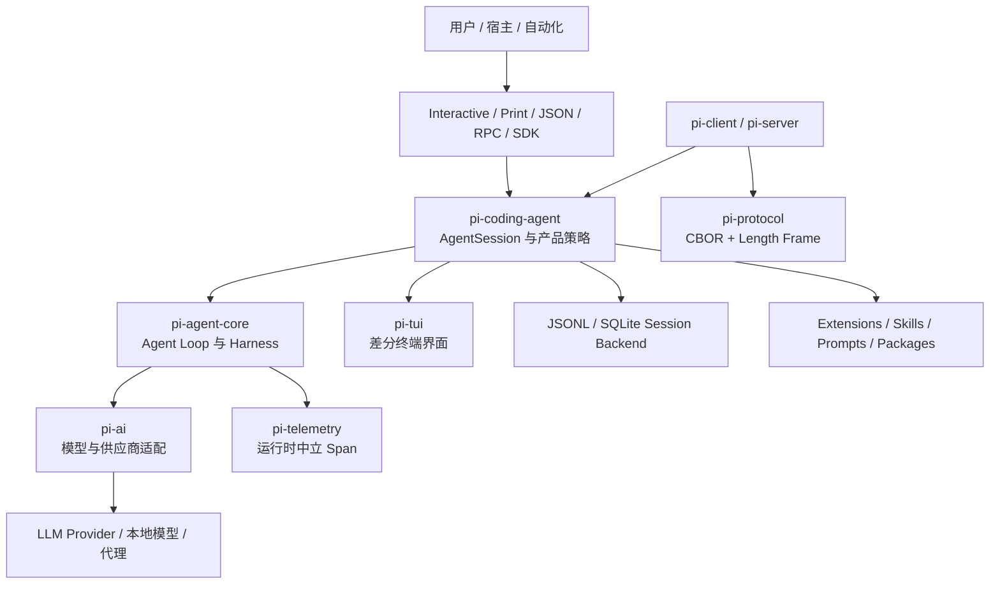
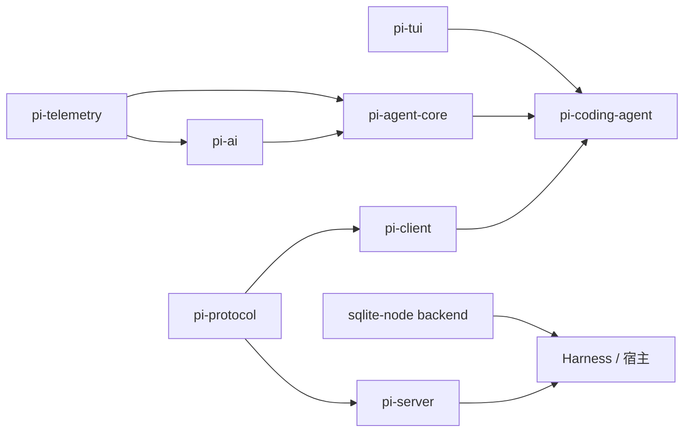
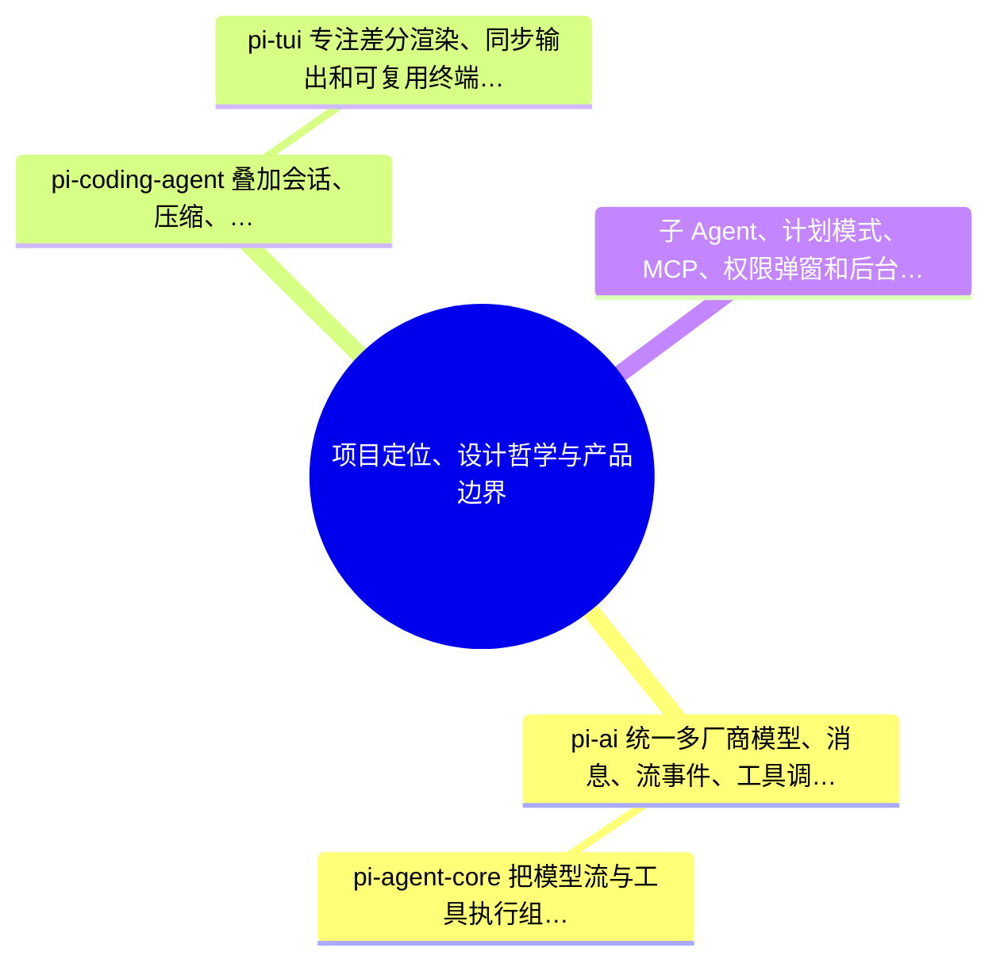
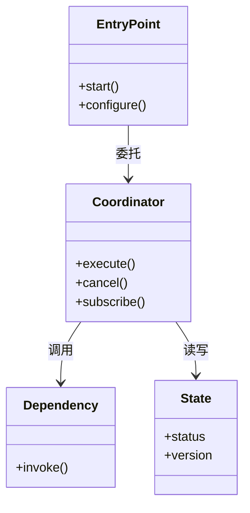
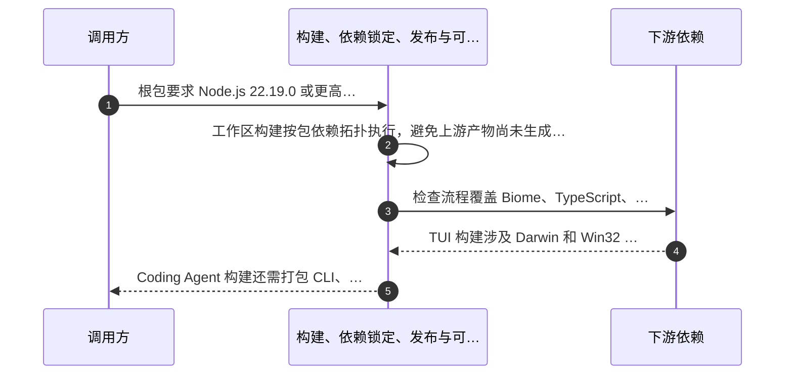
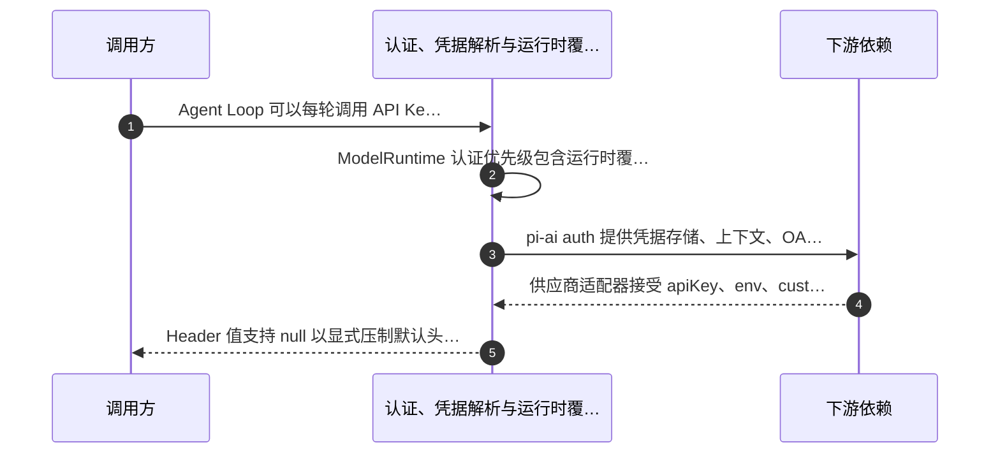

# 附录 W：Pi 源码架构全景解析

> 定位：**开源 Coding Agent「Pi」的整仓源码技术解析**（全文收录）。第六篇（第 23–25 章）讲 Coding Agent 的通用机制，本附录以一个真实开源实现为标本，逐层拆解多 Provider 隔离、Agent Loop 双层循环、会话树与上下文压缩、扩展系统、TUI 差分渲染、远程协议与遥测旁路等工程决策——是"机制篇"的源码级对照读物。分析对象锁定 `earendil-works/pi` 仓库 `main` 分支提交 `853a80d`（2026-08-29 生成，仓库入口见 [C-33]）；源码会演进，固定提交的分析不过期。内容为**源码事实、设计解释、工程建议三层分离**的社区分析，非项目官方文档。

---

### 文档摘要

Pi 是围绕大语言模型调用、Agent 执行循环和终端编码体验构建的 TypeScript Monorepo。它没有把“AI 编码产品”压成一个巨型 CLI，而是拆成多个可组合层：`pi-ai` 统一多供应商协议；`pi-agent-core` 提供不依赖终端的 Agent Loop 与 Harness；`pi-coding-agent` 组合会话、压缩、资源、信任、工具、扩展和运行模式；`pi-tui` 提供差分终端框架；`pi-telemetry`、`pi-protocol`、`pi-client`、`pi-server` 和 SQLite Session Backend 分别承担可观测性、远程契约、远程状态管理与持久化查询。

本文不是 README 的简单扩写。它以固定提交中的工作区结构、包清单、类型定义、核心控制流、协议、安全说明与测试边界为证据，逐层回答：多 Provider 差异如何隔离；Agent Loop 如何处理流式生成、工具、Steering、Follow-up、取消与终止；Coding Agent 如何加载受信任资源、恢复树形会话、自动压缩、执行扩展并跨模式复用；TUI 如何减少重绘；远程层为何采用严格 CBOR 和会话租约；Telemetry 为何必须旁路；SQLite 如何把全文索引保持为可重建派生能力。

### 阅读标记

- **【源码事实】**：由固定提交中的类型、控制流、清单或项目文档直接验证。
- **【设计解释】**：基于多个源码事实推导出的边界、控制权与权衡。
- **【工程建议】**：面向二次开发或未来演进，不代表维护者承诺。

### 总体架构图



### 包依赖主干




## W.1 分析基线、阅读方法与结论可信度

**本章结论**：本文以固定提交快照为事实边界，把包清单、类型定义、核心控制流、README 与安全说明交叉验证；源码事实、设计解释和工程建议严格分层。

### 1. 源码事实地图

| 序号 | 可验证事实 | 架构关注点 |
|---:|---|---|
| 1 | 分析基线固定为 main@853a80d26c90a14c1886f0ebb8ffaae133ca2185，避免分支继续演进造成路径和行为漂移 | 状态和恢复 |
| 2 | 阅读顺序从根工作区与包依赖开始，再进入 pi-ai、pi-agent-core、pi-coding-agent、TUI、远程协议、遥测和会话后端 | 安全与输入信任 |
| 3 | 核心结论至少由类型、实现控制流、包文档或测试契约中的一类证据直接支撑 | 事件及持久化顺序 |
| 4 | 实验性 Server 与 Client 单独标注成熟度，不把可运行原型描述成稳定公共服务 | 性能与跨平台 |
| 5 | 安全分析区分项目信任、工具授权和操作系统隔离，避免把输入加载防线解释为沙箱 | 控制权与分层 |
| 6 | 未来方向明确属于本文建议，不代表维护者承诺，也不改变当前源码的真实行为 | 可替换性与兼容 |

### 2. 关系图与控制流


### 3. 逐项源码解读

#### 3.1 分析基线固定为 main@853a80d26c90a14c1886f0ebb8ffa…

**【源码事实】** 分析基线固定为 main@853a80d26c90a14c1886f0ebb8ffaae133ca2185，避免分支继续演进造成路径和行为漂移。

**【设计解释】** 从并发角度看，系统同时追求吞吐与确定性：内部任务可以并行，但外部事件、结果数组、文件写入或会话条目仍要保持稳定顺序。慢任务、快速失败、用户取消和晚到回调都必须纳入同一状态机。

**运行推演。** 在高负载场景中，需要观测调用次数、持续时间、取消率、重试次数和容量截断次数。性能优化必须以不改变消息、事件与持久化顺序为前提；若确需改变顺序，应把它提升为显式协议并纳入版本管理。

#### 3.2 阅读顺序从根工作区与包依赖开始，再进入 pi-ai、pi-agent-core、pi…

**【源码事实】** 阅读顺序从根工作区与包依赖开始，再进入 pi-ai、pi-agent-core、pi-coding-agent、TUI、远程协议、遥测和会话后端。

**【设计解释】** 从长期维护看，这项设计把 Provider、终端、存储或扩展的变化限制在局部。公共类型一旦发布便形成生态依赖，因此新增字段、联合分支和默认行为都需要兼容测试、迁移说明与可诊断的拒绝路径。

**运行推演。** 正常路径中，这条事实与本章其他机制组成单向数据流；异常路径中，错误应被转换为可分类结果并沿同一事件通道返回。不要为异常分支维护另一套隐藏状态，否则日志、会话和界面会对同一次运行给出不同结论。

#### 3.3 核心结论至少由类型、实现控制流、包文档或测试契约中的一类证据直接支撑

**【源码事实】** 核心结论至少由类型、实现控制流、包文档或测试契约中的一类证据直接支撑。

**【设计解释】** 从职责分配看，这条事实把变化频率较高的实现留在适配或产品层，把需要跨宿主复用的语义留在核心层。收益是调用方不必了解所有下游差异；代价是中间层必须维护严格契约、穷尽分支和完整诊断，任何遗漏都会同时影响多个入口。

**运行推演。** 在高负载场景中，需要观测调用次数、持续时间、取消率、重试次数和容量截断次数。性能优化必须以不改变消息、事件与持久化顺序为前提；若确需改变顺序，应把它提升为显式协议并纳入版本管理。

#### 3.4 实验性 Server 与 Client 单独标注成熟度，不把可运行原型描述成稳定公共…

**【源码事实】** 实验性 Server 与 Client 单独标注成熟度，不把可运行原型描述成稳定公共服务。

**【设计解释】** 从运行顺序看，这不是静态名词，而是一次请求、工具批次、会话切换或资源加载中的真实控制点。代码审查应找到进入边界前的输入快照、边界中的副作用以及离开边界后的唯一终态，不能只验证最终字符串。

**运行推演。** 正常路径中，这条事实与本章其他机制组成单向数据流；异常路径中，错误应被转换为可分类结果并沿同一事件通道返回。不要为异常分支维护另一套隐藏状态，否则日志、会话和界面会对同一次运行给出不同结论。

#### 3.5 安全分析区分项目信任、工具授权和操作系统隔离，避免把输入加载防线解释为沙箱

**【源码事实】** 安全分析区分项目信任、工具授权和操作系统隔离，避免把输入加载防线解释为沙箱。

**【设计解释】** 从可恢复性看，该机制隐含了权威事实、瞬时事件与派生投影的区分。权威事实用于重放，瞬时事件用于体验，派生投影用于性能；三者混用会让进程内状态、磁盘记录和远程快照在恢复后互相矛盾。

**运行推演。** 在高负载场景中，需要观测调用次数、持续时间、取消率、重试次数和容量截断次数。性能优化必须以不改变消息、事件与持久化顺序为前提；若确需改变顺序，应把它提升为显式协议并纳入版本管理。

#### 3.6 未来方向明确属于本文建议，不代表维护者承诺，也不改变当前源码的真实行为

**【源码事实】** 未来方向明确属于本文建议，不代表维护者承诺，也不改变当前源码的真实行为。

**【设计解释】** 从安全角度看，允许加载、允许调用与真正隔离是三个不同问题。源码中的这条机制只解决其中一个维度，集成方仍需在工具政策、凭据管理、网络边界或操作系统容器层补足其余防线。

**运行推演。** 正常路径中，这条事实与本章其他机制组成单向数据流；异常路径中，错误应被转换为可分类结果并沿同一事件通道返回。不要为异常分支维护另一套隐藏状态，否则日志、会话和界面会对同一次运行给出不同结论。

### 4. 关键不变量

1. **源码链接全部固定到同一提交而不是可移动的 main** 一旦不变量被破坏，系统应显式失败并保留原始事实，而不是静默修补后继续。对会话、协议与文件变更而言，不可解释的自动修复往往比中止更危险。

2. **未直接验证的区域只描述公开契约和目录职责** 该不变量应同时出现在类型、运行时校验和跨层测试中。TypeScript 只能约束编译期代码，无法约束网络帧、JSONL、扩展、数据库或外部模型返回，因此边界处仍需显式验证。

3. **版本、命令与协议字段在升级后必须重新核验** 验证时至少覆盖新建、恢复、取消、失败重试、配置刷新与重复关闭。尤其要模拟异步回调已经排队、但所属会话或轮次已结束的晚到事件。

### 5. 失败模式、权衡与诊断

- **风险 1**：README 与实现可能短暂不同步，本文优先采用类型和控制流 升级时要把该风险纳入版本说明和迁移检查，尤其关注已有会话、扩展、远程客户端、用户设置和自动化脚本的兼容性。
- **风险 2**：超长文档容易让结论与证据分离，因此每章保留源码入口 排障先确认输入来源、活动会话或轮次标识、有效配置与取消状态，再检查下游错误。最终 UI 文案可能已经过兼容层或扩展改写，不能单独作为根因证据。
- **风险 3**：可扩展性不等于默认实现，尤其是 MCP、子 Agent、计划模式和权限确认 治理上应设置容量、时间与重试上限，并把触发上限记录为结构化事件。静默截断、无限重试或后台继续运行都会让用户失去对系统状态的判断。

### 6. 实施与测试审查清单

- [ ] 正常路径能否从输入追踪到最终事件、持久化记录与用户可见结果。围绕“分析基线、阅读方法与结论可信度”至少建立一个确定性单元测试和一个跨层集成测试。
- [ ] 取消、超时、供应商错误、工具失败与宿主关闭是否进入不同且唯一的终态。围绕“分析基线、阅读方法与结论可信度”至少建立一个确定性单元测试和一个跨层集成测试。
- [ ] 并行执行、重复回调与晚到事件是否不会打乱外部顺序或写入旧会话。围绕“分析基线、阅读方法与结论可信度”至少建立一个确定性单元测试和一个跨层集成测试。
- [ ] 容量限制、输出截断、上下文压缩或协议帧上限是否产生显式诊断。围绕“分析基线、阅读方法与结论可信度”至少建立一个确定性单元测试和一个跨层集成测试。
- [ ] 项目未信任、离线、缺失凭据与平台能力不足时是否安全降级。围绕“分析基线、阅读方法与结论可信度”至少建立一个确定性单元测试和一个跨层集成测试。
- [ ] 公共类型、会话格式、扩展事件和协议联合变化时是否有兼容或迁移测试。围绕“分析基线、阅读方法与结论可信度”至少建立一个确定性单元测试和一个跨层集成测试。

### 7. 源码入口

- [`README.md`](https://github.com/earendil-works/pi/blob/853a80d26c90a14c1886f0ebb8ffaae133ca2185/README.md)
- [`package.json`](https://github.com/earendil-works/pi/blob/853a80d26c90a14c1886f0ebb8ffaae133ca2185/package.json)
- [`packages/`](https://github.com/earendil-works/pi/tree/853a80d26c90a14c1886f0ebb8ffaae133ca2185/packages)

---

## W.2 项目定位、设计哲学与产品边界

**本章结论**：Pi 不是把所有工作流内建的重型 IDE Agent，而是一组可组合构件：统一模型层、通用 Agent Loop、可扩展编码 Harness、差分终端 UI，以及远程会话和持久化基础设施。

### 1. 源码事实地图

| 序号 | 可验证事实 | 架构关注点 |
|---:|---|---|
| 1 | pi-ai 统一多厂商模型、消息、流事件、工具调用、推理内容和使用量 | 安全与输入信任 |
| 2 | pi-agent-core 把模型流与工具执行组织为可嵌入状态机，不绑定终端或编码场景 | 事件及持久化顺序 |
| 3 | pi-coding-agent 叠加会话、压缩、资源、信任、工具、扩展和多种运行模式 | 性能与跨平台 |
| 4 | pi-tui 专注差分渲染、同步输出和可复用终端组件，不拥有 Agent 业务状态 | 控制权与分层 |
| 5 | 子 Agent、计划模式、MCP、权限弹窗和后台 Bash 并非默认核心能力，而可由扩展或宿主实现 | 可替换性与兼容 |
| 6 | Interactive、Print、JSON、RPC 与 SDK 共享同一核心会话语义 | 状态和恢复 |

### 2. 关系图与控制流




### 3. 关键机制展开


### 4. 逐项源码解读

#### 4.1 pi-ai 统一多厂商模型、消息、流事件、工具调用、推理内容和使用量

**【源码事实】** pi-ai 统一多厂商模型、消息、流事件、工具调用、推理内容和使用量。

**【设计解释】** 从运行顺序看，这不是静态名词，而是一次请求、工具批次、会话切换或资源加载中的真实控制点。代码审查应找到进入边界前的输入快照、边界中的副作用以及离开边界后的唯一终态，不能只验证最终字符串。

**运行推演。** 实际执行时，上层先提供输入和当前会话快照，协调层完成规范化与校验，再把最小必要信息交给下游。下游增量或结果返回后先被转换为统一领域对象，随后才进入事件、持久化或 UI。若中途失败，恢复动作必须以已确认边界为准，不能猜测补写状态。

#### 4.2 pi-agent-core 把模型流与工具执行组织为可嵌入状态机，不绑定终端或编码场…

**【源码事实】** pi-agent-core 把模型流与工具执行组织为可嵌入状态机，不绑定终端或编码场景。

**【设计解释】** 从可恢复性看，该机制隐含了权威事实、瞬时事件与派生投影的区分。权威事实用于重放，瞬时事件用于体验，派生投影用于性能；三者混用会让进程内状态、磁盘记录和远程快照在恢复后互相矛盾。

**运行推演。** 在多模式复用时，终端、RPC、Print 与 SDK 只负责适配输入输出，不应各自重新实现该机制。差异被约束在边缘层后，同一会话经不同入口恢复，仍应得到相同模型选择、工具结果、停止原因和可审计历史。

#### 4.3 pi-coding-agent 叠加会话、压缩、资源、信任、工具、扩展和多种运行模式

**【源码事实】** pi-coding-agent 叠加会话、压缩、资源、信任、工具、扩展和多种运行模式。

**【设计解释】** 从安全角度看，允许加载、允许调用与真正隔离是三个不同问题。源码中的这条机制只解决其中一个维度，集成方仍需在工具政策、凭据管理、网络边界或操作系统容器层补足其余防线。

**运行推演。** 实际执行时，上层先提供输入和当前会话快照，协调层完成规范化与校验，再把最小必要信息交给下游。下游增量或结果返回后先被转换为统一领域对象，随后才进入事件、持久化或 UI。若中途失败，恢复动作必须以已确认边界为准，不能猜测补写状态。

#### 4.4 pi-tui 专注差分渲染、同步输出和可复用终端组件，不拥有 Agent 业务状态

**【源码事实】** pi-tui 专注差分渲染、同步输出和可复用终端组件，不拥有 Agent 业务状态。

**【设计解释】** 从并发角度看，系统同时追求吞吐与确定性：内部任务可以并行，但外部事件、结果数组、文件写入或会话条目仍要保持稳定顺序。慢任务、快速失败、用户取消和晚到回调都必须纳入同一状态机。

**运行推演。** 在多模式复用时，终端、RPC、Print 与 SDK 只负责适配输入输出，不应各自重新实现该机制。差异被约束在边缘层后，同一会话经不同入口恢复，仍应得到相同模型选择、工具结果、停止原因和可审计历史。

#### 4.5 子 Agent、计划模式、MCP、权限弹窗和后台 Bash 并非默认核心能力，而可由…

**【源码事实】** 子 Agent、计划模式、MCP、权限弹窗和后台 Bash 并非默认核心能力，而可由扩展或宿主实现。

**【设计解释】** 从长期维护看，这项设计把 Provider、终端、存储或扩展的变化限制在局部。公共类型一旦发布便形成生态依赖，因此新增字段、联合分支和默认行为都需要兼容测试、迁移说明与可诊断的拒绝路径。

**运行推演。** 实际执行时，上层先提供输入和当前会话快照，协调层完成规范化与校验，再把最小必要信息交给下游。下游增量或结果返回后先被转换为统一领域对象，随后才进入事件、持久化或 UI。若中途失败，恢复动作必须以已确认边界为准，不能猜测补写状态。

#### 4.6 Interactive、Print、JSON、RPC 与 SDK 共享同一核心会话语…

**【源码事实】** Interactive、Print、JSON、RPC 与 SDK 共享同一核心会话语义。

**【设计解释】** 从职责分配看，这条事实把变化频率较高的实现留在适配或产品层，把需要跨宿主复用的语义留在核心层。收益是调用方不必了解所有下游差异；代价是中间层必须维护严格契约、穷尽分支和完整诊断，任何遗漏都会同时影响多个入口。

**运行推演。** 在多模式复用时，终端、RPC、Print 与 SDK 只负责适配输入输出，不应各自重新实现该机制。差异被约束在边缘层后，同一会话经不同入口恢复，仍应得到相同模型选择、工具结果、停止原因和可审计历史。

### 5. 关键不变量

1. **核心层只拥有执行语义，产品策略留给上层或扩展** 该不变量应同时出现在类型、运行时校验和跨层测试中。TypeScript 只能约束编译期代码，无法约束网络帧、JSONL、扩展、数据库或外部模型返回，因此边界处仍需显式验证。

2. **扩展能力不能被误认为安全边界** 验证时至少覆盖新建、恢复、取消、失败重试、配置刷新与重复关闭。尤其要模拟异步回调已经排队、但所属会话或轮次已结束的晚到事件。

3. **所有入口复用 AgentSession，避免行为分叉** 一旦不变量被破坏，系统应显式失败并保留原始事实，而不是静默修补后继续。对会话、协议与文件变更而言，不可解释的自动修复往往比中止更危险。

### 6. 失败模式、权衡与诊断

- **风险 1**：极简内核会把治理和审批责任转给集成方 治理上应设置容量、时间与重试上限，并把触发上限记录为结构化事件。静默截断、无限重试或后台继续运行都会让用户失去对系统状态的判断。
- **风险 2**：错误扩展可能破坏会话一致性或泄露本机信息 测试应通过故障注入制造慢响应、重复回调、部分帧、磁盘失败和终端变化，验证清理路径与正常路径具有同样完整的状态收束。
- **风险 3**：多厂商统一接口必须长期维护兼容矩阵 升级时要把该风险纳入版本说明和迁移检查，尤其关注已有会话、扩展、远程客户端、用户设置和自动化脚本的兼容性。

### 7. 实施与测试审查清单

- [ ] 正常路径能否从输入追踪到最终事件、持久化记录与用户可见结果。围绕“项目定位、设计哲学与产品边界”至少建立一个确定性单元测试和一个跨层集成测试。
- [ ] 取消、超时、供应商错误、工具失败与宿主关闭是否进入不同且唯一的终态。围绕“项目定位、设计哲学与产品边界”至少建立一个确定性单元测试和一个跨层集成测试。
- [ ] 并行执行、重复回调与晚到事件是否不会打乱外部顺序或写入旧会话。围绕“项目定位、设计哲学与产品边界”至少建立一个确定性单元测试和一个跨层集成测试。
- [ ] 容量限制、输出截断、上下文压缩或协议帧上限是否产生显式诊断。围绕“项目定位、设计哲学与产品边界”至少建立一个确定性单元测试和一个跨层集成测试。
- [ ] 项目未信任、离线、缺失凭据与平台能力不足时是否安全降级。围绕“项目定位、设计哲学与产品边界”至少建立一个确定性单元测试和一个跨层集成测试。
- [ ] 公共类型、会话格式、扩展事件和协议联合变化时是否有兼容或迁移测试。围绕“项目定位、设计哲学与产品边界”至少建立一个确定性单元测试和一个跨层集成测试。

### 8. 源码入口

- [`README.md`](https://github.com/earendil-works/pi/blob/853a80d26c90a14c1886f0ebb8ffaae133ca2185/README.md)
- [`packages/agent/README.md`](https://github.com/earendil-works/pi/blob/853a80d26c90a14c1886f0ebb8ffaae133ca2185/packages/agent/README.md)
- [`packages/coding-agent/README.md`](https://github.com/earendil-works/pi/blob/853a80d26c90a14c1886f0ebb8ffaae133ca2185/packages/coding-agent/README.md)
- [`packages/tui/README.md`](https://github.com/earendil-works/pi/blob/853a80d26c90a14c1886f0ebb8ffaae133ca2185/packages/tui/README.md)

---

## W.3 Monorepo 分层、包依赖与控制权分配

**本章结论**：根工作区的构建顺序本身就是架构图：TUI、Telemetry 与 AI 位于基础层，Agent Core 依赖 AI，Coding Agent 负责聚合；Protocol、Client、Server 与 SQLite Backend 横向补充远程和存储能力。

### 1. 源码事实地图

| 序号 | 可验证事实 | 架构关注点 |
|---:|---|---|
| 1 | 工作区覆盖 packages 下核心包、session-backends 以及带独立依赖的扩展示例 | 事件及持久化顺序 |
| 2 | 构建顺序显式排列 tui、telemetry、ai、agent、sqlite-node、protocol、client、server、coding-agent | 性能与跨平台 |
| 3 | pi-ai 根入口保持无副作用，具体 API 和 Provider Factory 通过子路径导出 | 控制权与分层 |
| 4 | pi-agent-core 不依赖 Coding Agent，因此可在非编码产品中复用 Loop 与 Harness | 可替换性与兼容 |
| 5 | 协议、客户端和服务端拆成三个包，使传输、状态同步和宿主实现独立演进 | 状态和恢复 |
| 6 | SQLite 会话后端是可选适配器而非核心硬编码存储 | 安全与输入信任 |

### 2. 关系图与控制流




### 3. 关键机制展开


### 4. 逐项源码解读

#### 4.1 工作区覆盖 packages 下核心包、session-backends 以及带独立…

**【源码事实】** 工作区覆盖 packages 下核心包、session-backends 以及带独立依赖的扩展示例。

**【设计解释】** 从并发角度看，系统同时追求吞吐与确定性：内部任务可以并行，但外部事件、结果数组、文件写入或会话条目仍要保持稳定顺序。慢任务、快速失败、用户取消和晚到回调都必须纳入同一状态机。

**运行推演。** 正常路径中，这条事实与本章其他机制组成单向数据流；异常路径中，错误应被转换为可分类结果并沿同一事件通道返回。不要为异常分支维护另一套隐藏状态，否则日志、会话和界面会对同一次运行给出不同结论。

#### 4.2 构建顺序显式排列 tui、telemetry、ai、agent、sqlite-nod…

**【源码事实】** 构建顺序显式排列 tui、telemetry、ai、agent、sqlite-node、protocol、client、server、coding-agent。

**【设计解释】** 从长期维护看，这项设计把 Provider、终端、存储或扩展的变化限制在局部。公共类型一旦发布便形成生态依赖，因此新增字段、联合分支和默认行为都需要兼容测试、迁移说明与可诊断的拒绝路径。

**运行推演。** 在高负载场景中，需要观测调用次数、持续时间、取消率、重试次数和容量截断次数。性能优化必须以不改变消息、事件与持久化顺序为前提；若确需改变顺序，应把它提升为显式协议并纳入版本管理。

#### 4.3 pi-ai 根入口保持无副作用，具体 API 和 Provider Factory …

**【源码事实】** pi-ai 根入口保持无副作用，具体 API 和 Provider Factory 通过子路径导出。

**【设计解释】** 从职责分配看，这条事实把变化频率较高的实现留在适配或产品层，把需要跨宿主复用的语义留在核心层。收益是调用方不必了解所有下游差异；代价是中间层必须维护严格契约、穷尽分支和完整诊断，任何遗漏都会同时影响多个入口。

**运行推演。** 正常路径中，这条事实与本章其他机制组成单向数据流；异常路径中，错误应被转换为可分类结果并沿同一事件通道返回。不要为异常分支维护另一套隐藏状态，否则日志、会话和界面会对同一次运行给出不同结论。

#### 4.4 pi-agent-core 不依赖 Coding Agent，因此可在非编码产品中复…

**【源码事实】** pi-agent-core 不依赖 Coding Agent，因此可在非编码产品中复用 Loop 与 Harness。

**【设计解释】** 从运行顺序看，这不是静态名词，而是一次请求、工具批次、会话切换或资源加载中的真实控制点。代码审查应找到进入边界前的输入快照、边界中的副作用以及离开边界后的唯一终态，不能只验证最终字符串。

**运行推演。** 在高负载场景中，需要观测调用次数、持续时间、取消率、重试次数和容量截断次数。性能优化必须以不改变消息、事件与持久化顺序为前提；若确需改变顺序，应把它提升为显式协议并纳入版本管理。

#### 4.5 协议、客户端和服务端拆成三个包，使传输、状态同步和宿主实现独立演进

**【源码事实】** 协议、客户端和服务端拆成三个包，使传输、状态同步和宿主实现独立演进。

**【设计解释】** 从可恢复性看，该机制隐含了权威事实、瞬时事件与派生投影的区分。权威事实用于重放，瞬时事件用于体验，派生投影用于性能；三者混用会让进程内状态、磁盘记录和远程快照在恢复后互相矛盾。

**运行推演。** 正常路径中，这条事实与本章其他机制组成单向数据流；异常路径中，错误应被转换为可分类结果并沿同一事件通道返回。不要为异常分支维护另一套隐藏状态，否则日志、会话和界面会对同一次运行给出不同结论。

#### 4.6 SQLite 会话后端是可选适配器而非核心硬编码存储

**【源码事实】** SQLite 会话后端是可选适配器而非核心硬编码存储。

**【设计解释】** 从安全角度看，允许加载、允许调用与真正隔离是三个不同问题。源码中的这条机制只解决其中一个维度，集成方仍需在工具政策、凭据管理、网络边界或操作系统容器层补足其余防线。

**运行推演。** 在高负载场景中，需要观测调用次数、持续时间、取消率、重试次数和容量截断次数。性能优化必须以不改变消息、事件与持久化顺序为前提；若确需改变顺序，应把它提升为显式协议并纳入版本管理。

### 5. 关键不变量

1. **下层包不能反向依赖上层产品包** 验证时至少覆盖新建、恢复、取消、失败重试、配置刷新与重复关闭。尤其要模拟异步回调已经排队、但所属会话或轮次已结束的晚到事件。

2. **公共类型从拥有语义的包导出** 一旦不变量被破坏，系统应显式失败并保留原始事实，而不是静默修补后继续。对会话、协议与文件变更而言，不可解释的自动修复往往比中止更危险。

3. **浏览器入口不能隐式加载 Node 专属模块** 该不变量应同时出现在类型、运行时校验和跨层测试中。TypeScript 只能约束编译期代码，无法约束网络帧、JSONL、扩展、数据库或外部模型返回，因此边界处仍需显式验证。

### 6. 失败模式、权衡与诊断

- **风险 1**：Monorepo 可能隐藏不必要的跨包耦合 升级时要把该风险纳入版本说明和迁移检查，尤其关注已有会话、扩展、远程客户端、用户设置和自动化脚本的兼容性。
- **风险 2**：同版本发布会放大单包变更影响面 排障先确认输入来源、活动会话或轮次标识、有效配置与取消状态，再检查下游错误。最终 UI 文案可能已经过兼容层或扩展改写，不能单独作为根因证据。
- **风险 3**：子路径导出若无契约测试会在不同打包器中漂移 治理上应设置容量、时间与重试上限，并把触发上限记录为结构化事件。静默截断、无限重试或后台继续运行都会让用户失去对系统状态的判断。

### 7. 实施与测试审查清单

- [ ] 正常路径能否从输入追踪到最终事件、持久化记录与用户可见结果。围绕“Monorepo 分层、包依赖与…”至少建立一个确定性单元测试和一个跨层集成测试。
- [ ] 取消、超时、供应商错误、工具失败与宿主关闭是否进入不同且唯一的终态。围绕“Monorepo 分层、包依赖与…”至少建立一个确定性单元测试和一个跨层集成测试。
- [ ] 并行执行、重复回调与晚到事件是否不会打乱外部顺序或写入旧会话。围绕“Monorepo 分层、包依赖与…”至少建立一个确定性单元测试和一个跨层集成测试。
- [ ] 容量限制、输出截断、上下文压缩或协议帧上限是否产生显式诊断。围绕“Monorepo 分层、包依赖与…”至少建立一个确定性单元测试和一个跨层集成测试。
- [ ] 项目未信任、离线、缺失凭据与平台能力不足时是否安全降级。围绕“Monorepo 分层、包依赖与…”至少建立一个确定性单元测试和一个跨层集成测试。
- [ ] 公共类型、会话格式、扩展事件和协议联合变化时是否有兼容或迁移测试。围绕“Monorepo 分层、包依赖与…”至少建立一个确定性单元测试和一个跨层集成测试。

### 8. 源码入口

- [`package.json`](https://github.com/earendil-works/pi/blob/853a80d26c90a14c1886f0ebb8ffaae133ca2185/package.json)
- [`packages/ai/package.json`](https://github.com/earendil-works/pi/blob/853a80d26c90a14c1886f0ebb8ffaae133ca2185/packages/ai/package.json)
- [`packages/agent/package.json`](https://github.com/earendil-works/pi/blob/853a80d26c90a14c1886f0ebb8ffaae133ca2185/packages/agent/package.json)
- [`packages/coding-agent/package.json`](https://github.com/earendil-works/pi/blob/853a80d26c90a14c1886f0ebb8ffaae133ca2185/packages/coding-agent/package.json)
- [`packages/protocol/package.json`](https://github.com/earendil-works/pi/blob/853a80d26c90a14c1886f0ebb8ffaae133ca2185/packages/protocol/package.json)

---

## W.4 构建、依赖锁定、发布与可复现性

**本章结论**：项目把供应链可复现性视为运行正确性的一部分：Node 有明确下限，依赖强调精确锁定，构建按拓扑顺序执行，检查脚本覆盖格式、类型、导入、锁文件和发布物。

### 1. 源码事实地图

| 序号 | 可验证事实 | 架构关注点 |
|---:|---|---|
| 1 | 根包要求 Node.js 22.19.0 或更高版本，统一现代 ESM 与运行时假设 | 性能与跨平台 |
| 2 | 工作区构建按包依赖拓扑执行，避免上游产物尚未生成时编译消费者 | 控制权与分层 |
| 3 | 检查流程覆盖 Biome、TypeScript、精确依赖、锁文件、导入规则与发布内容 | 可替换性与兼容 |
| 4 | TUI 构建涉及 Darwin 和 Win32 原生组件，发布要覆盖平台产物与回退路径 | 状态和恢复 |
| 5 | Coding Agent 构建还需打包 CLI、复制文档资源并形成可分发入口 | 安全与输入信任 |
| 6 | 模型目录允许在离线构建时复用已有数据，降低构建对即时网络的依赖 | 事件及持久化顺序 |

### 2. 关系图与控制流




### 3. 逐项源码解读

#### 3.1 根包要求 Node.js 22.19.0 或更高版本，统一现代 ESM 与运行时假设

**【源码事实】** 根包要求 Node.js 22.19.0 或更高版本，统一现代 ESM 与运行时假设。

**【设计解释】** 从运行顺序看，这不是静态名词，而是一次请求、工具批次、会话切换或资源加载中的真实控制点。代码审查应找到进入边界前的输入快照、边界中的副作用以及离开边界后的唯一终态，不能只验证最终字符串。

**运行推演。** 在多模式复用时，终端、RPC、Print 与 SDK 只负责适配输入输出，不应各自重新实现该机制。差异被约束在边缘层后，同一会话经不同入口恢复，仍应得到相同模型选择、工具结果、停止原因和可审计历史。

#### 3.2 工作区构建按包依赖拓扑执行，避免上游产物尚未生成时编译消费者

**【源码事实】** 工作区构建按包依赖拓扑执行，避免上游产物尚未生成时编译消费者。

**【设计解释】** 从可恢复性看，该机制隐含了权威事实、瞬时事件与派生投影的区分。权威事实用于重放，瞬时事件用于体验，派生投影用于性能；三者混用会让进程内状态、磁盘记录和远程快照在恢复后互相矛盾。

**运行推演。** 实际执行时，上层先提供输入和当前会话快照，协调层完成规范化与校验，再把最小必要信息交给下游。下游增量或结果返回后先被转换为统一领域对象，随后才进入事件、持久化或 UI。若中途失败，恢复动作必须以已确认边界为准，不能猜测补写状态。

#### 3.3 检查流程覆盖 Biome、TypeScript、精确依赖、锁文件、导入规则与发布内容

**【源码事实】** 检查流程覆盖 Biome、TypeScript、精确依赖、锁文件、导入规则与发布内容。

**【设计解释】** 从安全角度看，允许加载、允许调用与真正隔离是三个不同问题。源码中的这条机制只解决其中一个维度，集成方仍需在工具政策、凭据管理、网络边界或操作系统容器层补足其余防线。

**运行推演。** 在多模式复用时，终端、RPC、Print 与 SDK 只负责适配输入输出，不应各自重新实现该机制。差异被约束在边缘层后，同一会话经不同入口恢复，仍应得到相同模型选择、工具结果、停止原因和可审计历史。

#### 3.4 TUI 构建涉及 Darwin 和 Win32 原生组件，发布要覆盖平台产物与回退路…

**【源码事实】** TUI 构建涉及 Darwin 和 Win32 原生组件，发布要覆盖平台产物与回退路径。

**【设计解释】** 从并发角度看，系统同时追求吞吐与确定性：内部任务可以并行，但外部事件、结果数组、文件写入或会话条目仍要保持稳定顺序。慢任务、快速失败、用户取消和晚到回调都必须纳入同一状态机。

**运行推演。** 实际执行时，上层先提供输入和当前会话快照，协调层完成规范化与校验，再把最小必要信息交给下游。下游增量或结果返回后先被转换为统一领域对象，随后才进入事件、持久化或 UI。若中途失败，恢复动作必须以已确认边界为准，不能猜测补写状态。

#### 3.5 Coding Agent 构建还需打包 CLI、复制文档资源并形成可分发入口

**【源码事实】** Coding Agent 构建还需打包 CLI、复制文档资源并形成可分发入口。

**【设计解释】** 从长期维护看，这项设计把 Provider、终端、存储或扩展的变化限制在局部。公共类型一旦发布便形成生态依赖，因此新增字段、联合分支和默认行为都需要兼容测试、迁移说明与可诊断的拒绝路径。

**运行推演。** 在多模式复用时，终端、RPC、Print 与 SDK 只负责适配输入输出，不应各自重新实现该机制。差异被约束在边缘层后，同一会话经不同入口恢复，仍应得到相同模型选择、工具结果、停止原因和可审计历史。

#### 3.6 模型目录允许在离线构建时复用已有数据，降低构建对即时网络的依赖

**【源码事实】** 模型目录允许在离线构建时复用已有数据，降低构建对即时网络的依赖。

**【设计解释】** 从职责分配看，这条事实把变化频率较高的实现留在适配或产品层，把需要跨宿主复用的语义留在核心层。收益是调用方不必了解所有下游差异；代价是中间层必须维护严格契约、穷尽分支和完整诊断，任何遗漏都会同时影响多个入口。

**运行推演。** 实际执行时，上层先提供输入和当前会话快照，协调层完成规范化与校验，再把最小必要信息交给下游。下游增量或结果返回后先被转换为统一领域对象，随后才进入事件、持久化或 UI。若中途失败，恢复动作必须以已确认边界为准，不能猜测补写状态。

### 4. 关键不变量

1. **发布物只包含声明文件和可解析导出** 一旦不变量被破坏，系统应显式失败并保留原始事实，而不是静默修补后继续。对会话、协议与文件变更而言，不可解释的自动修复往往比中止更危险。

2. **锁文件、包版本与内部依赖版本一致** 该不变量应同时出现在类型、运行时校验和跨层测试中。TypeScript 只能约束编译期代码，无法约束网络帧、JSONL、扩展、数据库或外部模型返回，因此边界处仍需显式验证。

3. **原生产物缺失时给出明确诊断** 验证时至少覆盖新建、恢复、取消、失败重试、配置刷新与重复关闭。尤其要模拟异步回调已经排队、但所属会话或轮次已结束的晚到事件。

### 5. 失败模式、权衡与诊断

- **风险 1**：精确锁定减少漂移但增加升级维护成本 治理上应设置容量、时间与重试上限，并把触发上限记录为结构化事件。静默截断、无限重试或后台继续运行都会让用户失去对系统状态的判断。
- **风险 2**：原生终端组件扩大平台测试矩阵 测试应通过故障注入制造慢响应、重复回调、部分帧、磁盘失败和终端变化，验证清理路径与正常路径具有同样完整的状态收束。
- **风险 3**：陈旧模型数据会让可见能力与供应商实际状态不一致 升级时要把该风险纳入版本说明和迁移检查，尤其关注已有会话、扩展、远程客户端、用户设置和自动化脚本的兼容性。

### 6. 实施与测试审查清单

- [ ] 正常路径能否从输入追踪到最终事件、持久化记录与用户可见结果。围绕“构建、依赖锁定、发布与可复现性”至少建立一个确定性单元测试和一个跨层集成测试。
- [ ] 取消、超时、供应商错误、工具失败与宿主关闭是否进入不同且唯一的终态。围绕“构建、依赖锁定、发布与可复现性”至少建立一个确定性单元测试和一个跨层集成测试。
- [ ] 并行执行、重复回调与晚到事件是否不会打乱外部顺序或写入旧会话。围绕“构建、依赖锁定、发布与可复现性”至少建立一个确定性单元测试和一个跨层集成测试。
- [ ] 容量限制、输出截断、上下文压缩或协议帧上限是否产生显式诊断。围绕“构建、依赖锁定、发布与可复现性”至少建立一个确定性单元测试和一个跨层集成测试。
- [ ] 项目未信任、离线、缺失凭据与平台能力不足时是否安全降级。围绕“构建、依赖锁定、发布与可复现性”至少建立一个确定性单元测试和一个跨层集成测试。
- [ ] 公共类型、会话格式、扩展事件和协议联合变化时是否有兼容或迁移测试。围绕“构建、依赖锁定、发布与可复现性”至少建立一个确定性单元测试和一个跨层集成测试。

### 7. 源码入口

- [`package.json`](https://github.com/earendil-works/pi/blob/853a80d26c90a14c1886f0ebb8ffaae133ca2185/package.json)
- [`packages/tui/package.json`](https://github.com/earendil-works/pi/blob/853a80d26c90a14c1886f0ebb8ffaae133ca2185/packages/tui/package.json)
- [`packages/coding-agent/package.json`](https://github.com/earendil-works/pi/blob/853a80d26c90a14c1886f0ebb8ffaae133ca2185/packages/coding-agent/package.json)
- [`packages/ai/package.json`](https://github.com/earendil-works/pi/blob/853a80d26c90a14c1886f0ebb8ffaae133ca2185/packages/ai/package.json)
- [`scripts/`](https://github.com/earendil-works/pi/tree/853a80d26c90a14c1886f0ebb8ffaae133ca2185/scripts)

---

## W.5 统一领域对象：消息、内容块、工具、用量与停止原因

**本章结论**：跨供应商和跨运行模式复用的基础是一组稳定领域对象：UserMessage、AssistantMessage、ToolResultMessage、内容块、ToolCall、Usage 与 StopReason 共同形成可持久化、可流式更新的语言。

### 1. 源码事实地图

| 序号 | 可验证事实 | 架构关注点 |
|---:|---|---|
| 1 | 用户、助手和工具结果消息组成统一 AgentMessage，上层自定义消息可经 convertToLlm 转换或过滤 | 控制权与分层 |
| 2 | 助手内容支持文本、思考、图像和工具调用，思考块可保存签名或脱敏数据 | 可替换性与兼容 |
| 3 | 工具以 TypeBox Schema 描述参数，并可携带 JSON Schema 或 Grammar 约束采样能力 | 状态和恢复 |
| 4 | Usage 同时记录输入、输出、缓存读写、推理 Token 与成本 | 安全与输入信任 |
| 5 | StopReason 区分 stop、length、toolUse、error、aborted、deferred 与流式 pending | 事件及持久化顺序 |
| 6 | ToolResultMessage 可标记错误、追加动态工具名并携带用量信息 | 性能与跨平台 |

### 2. 关系图与控制流


### 3. 逐项源码解读

#### 3.1 用户、助手和工具结果消息组成统一 AgentMessage，上层自定义消息可经 co…

**【源码事实】** 用户、助手和工具结果消息组成统一 AgentMessage，上层自定义消息可经 convertToLlm 转换或过滤。

**【设计解释】** 从并发角度看，系统同时追求吞吐与确定性：内部任务可以并行，但外部事件、结果数组、文件写入或会话条目仍要保持稳定顺序。慢任务、快速失败、用户取消和晚到回调都必须纳入同一状态机。

**运行推演。** 在高负载场景中，需要观测调用次数、持续时间、取消率、重试次数和容量截断次数。性能优化必须以不改变消息、事件与持久化顺序为前提；若确需改变顺序，应把它提升为显式协议并纳入版本管理。

#### 3.2 助手内容支持文本、思考、图像和工具调用，思考块可保存签名或脱敏数据

**【源码事实】** 助手内容支持文本、思考、图像和工具调用，思考块可保存签名或脱敏数据。

**【设计解释】** 从长期维护看，这项设计把 Provider、终端、存储或扩展的变化限制在局部。公共类型一旦发布便形成生态依赖，因此新增字段、联合分支和默认行为都需要兼容测试、迁移说明与可诊断的拒绝路径。

**运行推演。** 正常路径中，这条事实与本章其他机制组成单向数据流；异常路径中，错误应被转换为可分类结果并沿同一事件通道返回。不要为异常分支维护另一套隐藏状态，否则日志、会话和界面会对同一次运行给出不同结论。

#### 3.3 工具以 TypeBox Schema 描述参数，并可携带 JSON Schema 或…

**【源码事实】** 工具以 TypeBox Schema 描述参数，并可携带 JSON Schema 或 Grammar 约束采样能力。

**【设计解释】** 从职责分配看，这条事实把变化频率较高的实现留在适配或产品层，把需要跨宿主复用的语义留在核心层。收益是调用方不必了解所有下游差异；代价是中间层必须维护严格契约、穷尽分支和完整诊断，任何遗漏都会同时影响多个入口。

**运行推演。** 在高负载场景中，需要观测调用次数、持续时间、取消率、重试次数和容量截断次数。性能优化必须以不改变消息、事件与持久化顺序为前提；若确需改变顺序，应把它提升为显式协议并纳入版本管理。

#### 3.4 Usage 同时记录输入、输出、缓存读写、推理 Token 与成本

**【源码事实】** Usage 同时记录输入、输出、缓存读写、推理 Token 与成本。

**【设计解释】** 从运行顺序看，这不是静态名词，而是一次请求、工具批次、会话切换或资源加载中的真实控制点。代码审查应找到进入边界前的输入快照、边界中的副作用以及离开边界后的唯一终态，不能只验证最终字符串。

**运行推演。** 正常路径中，这条事实与本章其他机制组成单向数据流；异常路径中，错误应被转换为可分类结果并沿同一事件通道返回。不要为异常分支维护另一套隐藏状态，否则日志、会话和界面会对同一次运行给出不同结论。

#### 3.5 StopReason 区分 stop、length、toolUse、error、ab…

**【源码事实】** StopReason 区分 stop、length、toolUse、error、aborted、deferred 与流式 pending。

**【设计解释】** 从可恢复性看，该机制隐含了权威事实、瞬时事件与派生投影的区分。权威事实用于重放，瞬时事件用于体验，派生投影用于性能；三者混用会让进程内状态、磁盘记录和远程快照在恢复后互相矛盾。

**运行推演。** 在高负载场景中，需要观测调用次数、持续时间、取消率、重试次数和容量截断次数。性能优化必须以不改变消息、事件与持久化顺序为前提；若确需改变顺序，应把它提升为显式协议并纳入版本管理。

#### 3.6 ToolResultMessage 可标记错误、追加动态工具名并携带用量信息

**【源码事实】** ToolResultMessage 可标记错误、追加动态工具名并携带用量信息。

**【设计解释】** 从安全角度看，允许加载、允许调用与真正隔离是三个不同问题。源码中的这条机制只解决其中一个维度，集成方仍需在工具政策、凭据管理、网络边界或操作系统容器层补足其余防线。

**运行推演。** 正常路径中，这条事实与本章其他机制组成单向数据流；异常路径中，错误应被转换为可分类结果并沿同一事件通道返回。不要为异常分支维护另一套隐藏状态，否则日志、会话和界面会对同一次运行给出不同结论。

### 4. 关键不变量

1. **持久化消息不能保留 pending 终态** 该不变量应同时出现在类型、运行时校验和跨层测试中。TypeScript 只能约束编译期代码，无法约束网络帧、JSONL、扩展、数据库或外部模型返回，因此边界处仍需显式验证。

2. **工具调用 ID 在请求、结果和后续上下文中稳定对应** 验证时至少覆盖新建、恢复、取消、失败重试、配置刷新与重复关闭。尤其要模拟异步回调已经排队、但所属会话或轮次已结束的晚到事件。

3. **兼容转换不得丢失影响后续推理的语义** 一旦不变量被破坏，系统应显式失败并保留原始事实，而不是静默修补后继续。对会话、协议与文件变更而言，不可解释的自动修复往往比中止更危险。

### 5. 失败模式、权衡与诊断

- **风险 1**：最小公分母类型会掩盖厂商独有能力 升级时要把该风险纳入版本说明和迁移检查，尤其关注已有会话、扩展、远程客户端、用户设置和自动化脚本的兼容性。
- **风险 2**：Token 或成本估算错误会影响压缩和预算 排障先确认输入来源、活动会话或轮次标识、有效配置与取消状态，再检查下游错误。最终 UI 文案可能已经过兼容层或扩展改写，不能单独作为根因证据。
- **风险 3**：自定义 UI 消息转换错误会污染模型上下文 治理上应设置容量、时间与重试上限，并把触发上限记录为结构化事件。静默截断、无限重试或后台继续运行都会让用户失去对系统状态的判断。

### 6. 实施与测试审查清单

- [ ] 正常路径能否从输入追踪到最终事件、持久化记录与用户可见结果。围绕“统一领域对象：消息、内容块、工具…”至少建立一个确定性单元测试和一个跨层集成测试。
- [ ] 取消、超时、供应商错误、工具失败与宿主关闭是否进入不同且唯一的终态。围绕“统一领域对象：消息、内容块、工具…”至少建立一个确定性单元测试和一个跨层集成测试。
- [ ] 并行执行、重复回调与晚到事件是否不会打乱外部顺序或写入旧会话。围绕“统一领域对象：消息、内容块、工具…”至少建立一个确定性单元测试和一个跨层集成测试。
- [ ] 容量限制、输出截断、上下文压缩或协议帧上限是否产生显式诊断。围绕“统一领域对象：消息、内容块、工具…”至少建立一个确定性单元测试和一个跨层集成测试。
- [ ] 项目未信任、离线、缺失凭据与平台能力不足时是否安全降级。围绕“统一领域对象：消息、内容块、工具…”至少建立一个确定性单元测试和一个跨层集成测试。
- [ ] 公共类型、会话格式、扩展事件和协议联合变化时是否有兼容或迁移测试。围绕“统一领域对象：消息、内容块、工具…”至少建立一个确定性单元测试和一个跨层集成测试。

### 7. 源码入口

- [`packages/ai/src/types.ts`](https://github.com/earendil-works/pi/blob/853a80d26c90a14c1886f0ebb8ffaae133ca2185/packages/ai/src/types.ts)
- [`packages/agent/src/types.ts`](https://github.com/earendil-works/pi/blob/853a80d26c90a14c1886f0ebb8ffaae133ca2185/packages/agent/src/types.ts)
- [`packages/coding-agent/src/core/messages.ts`](https://github.com/earendil-works/pi/blob/853a80d26c90a14c1886f0ebb8ffaae133ca2185/packages/coding-agent/src/core/messages.ts)

---

## W.6 pi-ai 核心边界与无副作用入口

**本章结论**：pi-ai 把供应商 SDK 留在适配层，把模型与消息语义留在核心层，并通过无副作用根入口控制浏览器体积和初始化行为。

### 1. 源码事实地图

| 序号 | 可验证事实 | 架构关注点 |
|---:|---|---|
| 1 | 根 index.ts 只重导出核心类型、模型工具、认证抽象、事件流和通用工具，不自动注册全局厂商 | 可替换性与兼容 |
| 2 | 具体 API、Provider Factory、兼容工具和 OAuth 实现通过显式子路径引入 | 状态和恢复 |
| 3 | ProviderStreams 统一暴露 stream 与 streamSimple，并允许延迟工具获取和取消 | 安全与输入信任 |
| 4 | StreamFunction 返回事件流并把运行错误编码为事件，而不是在调用入口直接抛出 | 事件及持久化顺序 |
| 5 | Model 携带 provider、api、baseUrl、上下文窗口、最大输出、成本和兼容能力 | 性能与跨平台 |
| 6 | sessionId、cacheRetention、transport 与 metadata 从核心接口向适配器传播 | 控制权与分层 |

### 2. 关系图与控制流


### 3. 逐项源码解读

#### 3.1 根 index.ts 只重导出核心类型、模型工具、认证抽象、事件流和通用工具，不自动…

**【源码事实】** 根 index.ts 只重导出核心类型、模型工具、认证抽象、事件流和通用工具，不自动注册全局厂商。

**【设计解释】** 从运行顺序看，这不是静态名词，而是一次请求、工具批次、会话切换或资源加载中的真实控制点。代码审查应找到进入边界前的输入快照、边界中的副作用以及离开边界后的唯一终态，不能只验证最终字符串。

**运行推演。** 实际执行时，上层先提供输入和当前会话快照，协调层完成规范化与校验，再把最小必要信息交给下游。下游增量或结果返回后先被转换为统一领域对象，随后才进入事件、持久化或 UI。若中途失败，恢复动作必须以已确认边界为准，不能猜测补写状态。

#### 3.2 具体 API、Provider Factory、兼容工具和 OAuth 实现通过显式…

**【源码事实】** 具体 API、Provider Factory、兼容工具和 OAuth 实现通过显式子路径引入。

**【设计解释】** 从可恢复性看，该机制隐含了权威事实、瞬时事件与派生投影的区分。权威事实用于重放，瞬时事件用于体验，派生投影用于性能；三者混用会让进程内状态、磁盘记录和远程快照在恢复后互相矛盾。

**运行推演。** 在多模式复用时，终端、RPC、Print 与 SDK 只负责适配输入输出，不应各自重新实现该机制。差异被约束在边缘层后，同一会话经不同入口恢复，仍应得到相同模型选择、工具结果、停止原因和可审计历史。

#### 3.3 ProviderStreams 统一暴露 stream 与 streamSimple…

**【源码事实】** ProviderStreams 统一暴露 stream 与 streamSimple，并允许延迟工具获取和取消。

**【设计解释】** 从安全角度看，允许加载、允许调用与真正隔离是三个不同问题。源码中的这条机制只解决其中一个维度，集成方仍需在工具政策、凭据管理、网络边界或操作系统容器层补足其余防线。

**运行推演。** 实际执行时，上层先提供输入和当前会话快照，协调层完成规范化与校验，再把最小必要信息交给下游。下游增量或结果返回后先被转换为统一领域对象，随后才进入事件、持久化或 UI。若中途失败，恢复动作必须以已确认边界为准，不能猜测补写状态。

#### 3.4 StreamFunction 返回事件流并把运行错误编码为事件，而不是在调用入口直接…

**【源码事实】** StreamFunction 返回事件流并把运行错误编码为事件，而不是在调用入口直接抛出。

**【设计解释】** 从并发角度看，系统同时追求吞吐与确定性：内部任务可以并行，但外部事件、结果数组、文件写入或会话条目仍要保持稳定顺序。慢任务、快速失败、用户取消和晚到回调都必须纳入同一状态机。

**运行推演。** 在多模式复用时，终端、RPC、Print 与 SDK 只负责适配输入输出，不应各自重新实现该机制。差异被约束在边缘层后，同一会话经不同入口恢复，仍应得到相同模型选择、工具结果、停止原因和可审计历史。

#### 3.5 Model 携带 provider、api、baseUrl、上下文窗口、最大输出、成…

**【源码事实】** Model 携带 provider、api、baseUrl、上下文窗口、最大输出、成本和兼容能力。

**【设计解释】** 从长期维护看，这项设计把 Provider、终端、存储或扩展的变化限制在局部。公共类型一旦发布便形成生态依赖，因此新增字段、联合分支和默认行为都需要兼容测试、迁移说明与可诊断的拒绝路径。

**运行推演。** 实际执行时，上层先提供输入和当前会话快照，协调层完成规范化与校验，再把最小必要信息交给下游。下游增量或结果返回后先被转换为统一领域对象，随后才进入事件、持久化或 UI。若中途失败，恢复动作必须以已确认边界为准，不能猜测补写状态。

#### 3.6 sessionId、cacheRetention、transport 与 metad…

**【源码事实】** sessionId、cacheRetention、transport 与 metadata 从核心接口向适配器传播。

**【设计解释】** 从职责分配看，这条事实把变化频率较高的实现留在适配或产品层，把需要跨宿主复用的语义留在核心层。收益是调用方不必了解所有下游差异；代价是中间层必须维护严格契约、穷尽分支和完整诊断，任何遗漏都会同时影响多个入口。

**运行推演。** 在多模式复用时，终端、RPC、Print 与 SDK 只负责适配输入输出，不应各自重新实现该机制。差异被约束在边缘层后，同一会话经不同入口恢复，仍应得到相同模型选择、工具结果、停止原因和可审计历史。

### 4. 关键不变量

1. **导入核心入口不能发起网络或读取凭据** 验证时至少覆盖新建、恢复、取消、失败重试、配置刷新与重复关闭。尤其要模拟异步回调已经排队、但所属会话或轮次已结束的晚到事件。

2. **所有供应商适配器输出统一事件和最终消息** 一旦不变量被破坏，系统应显式失败并保留原始事实，而不是静默修补后继续。对会话、协议与文件变更而言，不可解释的自动修复往往比中止更危险。

3. **可选能力只能在 compat 声明支持时启用** 该不变量应同时出现在类型、运行时校验和跨层测试中。TypeScript 只能约束编译期代码，无法约束网络帧、JSONL、扩展、数据库或外部模型返回，因此边界处仍需显式验证。

### 5. 失败模式、权衡与诊断

- **风险 1**：exports 配置错误会破坏 Tree Shaking 治理上应设置容量、时间与重试上限，并把触发上限记录为结构化事件。静默截断、无限重试或后台继续运行都会让用户失去对系统状态的判断。
- **风险 2**：适配器取消和超时语义不一致会污染上层 测试应通过故障注入制造慢响应、重复回调、部分帧、磁盘失败和终端变化，验证清理路径与正常路径具有同样完整的状态收束。
- **风险 3**：模型元数据缓存与运行时覆盖必须区分 升级时要把该风险纳入版本说明和迁移检查，尤其关注已有会话、扩展、远程客户端、用户设置和自动化脚本的兼容性。

### 6. 实施与测试审查清单

- [ ] 正常路径能否从输入追踪到最终事件、持久化记录与用户可见结果。围绕“pi-ai 核心边界与无副作用入…”至少建立一个确定性单元测试和一个跨层集成测试。
- [ ] 取消、超时、供应商错误、工具失败与宿主关闭是否进入不同且唯一的终态。围绕“pi-ai 核心边界与无副作用入…”至少建立一个确定性单元测试和一个跨层集成测试。
- [ ] 并行执行、重复回调与晚到事件是否不会打乱外部顺序或写入旧会话。围绕“pi-ai 核心边界与无副作用入…”至少建立一个确定性单元测试和一个跨层集成测试。
- [ ] 容量限制、输出截断、上下文压缩或协议帧上限是否产生显式诊断。围绕“pi-ai 核心边界与无副作用入…”至少建立一个确定性单元测试和一个跨层集成测试。
- [ ] 项目未信任、离线、缺失凭据与平台能力不足时是否安全降级。围绕“pi-ai 核心边界与无副作用入…”至少建立一个确定性单元测试和一个跨层集成测试。
- [ ] 公共类型、会话格式、扩展事件和协议联合变化时是否有兼容或迁移测试。围绕“pi-ai 核心边界与无副作用入…”至少建立一个确定性单元测试和一个跨层集成测试。

### 7. 源码入口

- [`packages/ai/src/index.ts`](https://github.com/earendil-works/pi/blob/853a80d26c90a14c1886f0ebb8ffaae133ca2185/packages/ai/src/index.ts)
- [`packages/ai/src/types.ts`](https://github.com/earendil-works/pi/blob/853a80d26c90a14c1886f0ebb8ffaae133ca2185/packages/ai/src/types.ts)
- [`packages/ai/src/models.ts`](https://github.com/earendil-works/pi/blob/853a80d26c90a14c1886f0ebb8ffaae133ca2185/packages/ai/src/models.ts)
- [`packages/ai/src/model-catalog.ts`](https://github.com/earendil-works/pi/blob/853a80d26c90a14c1886f0ebb8ffaae133ca2185/packages/ai/src/model-catalog.ts)

---

## W.7 Provider 工厂、模型目录与兼容能力矩阵

**本章结论**：Provider 并非简单名称到 URL 的映射，而是模型集合、认证来源、API 适配器、默认参数和兼容标志的组合；工厂与目录分离让大量供应商差异不泄露给 Agent Loop。

### 1. 源码事实地图

| 序号 | 可验证事实 | 架构关注点 |
|---:|---|---|
| 1 | 供应商覆盖 Anthropic、OpenAI、Azure、Bedrock、Google、Vertex、Mistral、DeepSeek、Groq、OpenRouter、GitHub Copilot 等协议族 | 状态和恢复 |
| 2 | 同一供应商可包含区域、订阅计划或 API 变体，工厂负责构造一致 Provider 定义 | 安全与输入信任 |
| 3 | 模型目录被扁平化为可检索 Model 列表，调用方不必理解供应商嵌套结构 | 事件及持久化顺序 |
| 4 | compat 标志描述 developer role、reasoning、strict tools、cache control、session affinity 和 deferred tools | 性能与跨平台 |
| 5 | ModelRegistry 可组合内置目录、缓存、远程目录和用户模型，ModelResolver 决定最终选择 | 控制权与分层 |
| 6 | 模型数据刷新与离线模式分离，使无网络环境仍可使用已知目录 | 可替换性与兼容 |

### 2. 关系图与控制流


### 3. 逐项源码解读

#### 3.1 供应商覆盖 Anthropic、OpenAI、Azure、Bedrock、Googl…

**【源码事实】** 供应商覆盖 Anthropic、OpenAI、Azure、Bedrock、Google、Vertex、Mistral、DeepSeek、Groq、OpenRouter、GitHub Copilot 等协议族。

**【设计解释】** 从并发角度看，系统同时追求吞吐与确定性：内部任务可以并行，但外部事件、结果数组、文件写入或会话条目仍要保持稳定顺序。慢任务、快速失败、用户取消和晚到回调都必须纳入同一状态机。

**运行推演。** 正常路径中，这条事实与本章其他机制组成单向数据流；异常路径中，错误应被转换为可分类结果并沿同一事件通道返回。不要为异常分支维护另一套隐藏状态，否则日志、会话和界面会对同一次运行给出不同结论。

#### 3.2 同一供应商可包含区域、订阅计划或 API 变体，工厂负责构造一致 Provider …

**【源码事实】** 同一供应商可包含区域、订阅计划或 API 变体，工厂负责构造一致 Provider 定义。

**【设计解释】** 从长期维护看，这项设计把 Provider、终端、存储或扩展的变化限制在局部。公共类型一旦发布便形成生态依赖，因此新增字段、联合分支和默认行为都需要兼容测试、迁移说明与可诊断的拒绝路径。

**运行推演。** 在高负载场景中，需要观测调用次数、持续时间、取消率、重试次数和容量截断次数。性能优化必须以不改变消息、事件与持久化顺序为前提；若确需改变顺序，应把它提升为显式协议并纳入版本管理。

#### 3.3 模型目录被扁平化为可检索 Model 列表，调用方不必理解供应商嵌套结构

**【源码事实】** 模型目录被扁平化为可检索 Model 列表，调用方不必理解供应商嵌套结构。

**【设计解释】** 从职责分配看，这条事实把变化频率较高的实现留在适配或产品层，把需要跨宿主复用的语义留在核心层。收益是调用方不必了解所有下游差异；代价是中间层必须维护严格契约、穷尽分支和完整诊断，任何遗漏都会同时影响多个入口。

**运行推演。** 正常路径中，这条事实与本章其他机制组成单向数据流；异常路径中，错误应被转换为可分类结果并沿同一事件通道返回。不要为异常分支维护另一套隐藏状态，否则日志、会话和界面会对同一次运行给出不同结论。

#### 3.4 compat 标志描述 developer role、reasoning、stric…

**【源码事实】** compat 标志描述 developer role、reasoning、strict tools、cache control、session affinity 和 deferred tools。

**【设计解释】** 从运行顺序看，这不是静态名词，而是一次请求、工具批次、会话切换或资源加载中的真实控制点。代码审查应找到进入边界前的输入快照、边界中的副作用以及离开边界后的唯一终态，不能只验证最终字符串。

**运行推演。** 在高负载场景中，需要观测调用次数、持续时间、取消率、重试次数和容量截断次数。性能优化必须以不改变消息、事件与持久化顺序为前提；若确需改变顺序，应把它提升为显式协议并纳入版本管理。

#### 3.5 ModelRegistry 可组合内置目录、缓存、远程目录和用户模型，ModelRe…

**【源码事实】** ModelRegistry 可组合内置目录、缓存、远程目录和用户模型，ModelResolver 决定最终选择。

**【设计解释】** 从可恢复性看，该机制隐含了权威事实、瞬时事件与派生投影的区分。权威事实用于重放，瞬时事件用于体验，派生投影用于性能；三者混用会让进程内状态、磁盘记录和远程快照在恢复后互相矛盾。

**运行推演。** 正常路径中，这条事实与本章其他机制组成单向数据流；异常路径中，错误应被转换为可分类结果并沿同一事件通道返回。不要为异常分支维护另一套隐藏状态，否则日志、会话和界面会对同一次运行给出不同结论。

#### 3.6 模型数据刷新与离线模式分离，使无网络环境仍可使用已知目录

**【源码事实】** 模型数据刷新与离线模式分离，使无网络环境仍可使用已知目录。

**【设计解释】** 从安全角度看，允许加载、允许调用与真正隔离是三个不同问题。源码中的这条机制只解决其中一个维度，集成方仍需在工具政策、凭据管理、网络边界或操作系统容器层补足其余防线。

**运行推演。** 在高负载场景中，需要观测调用次数、持续时间、取消率、重试次数和容量截断次数。性能优化必须以不改变消息、事件与持久化顺序为前提；若确需改变顺序，应把它提升为显式协议并纳入版本管理。

### 4. 关键不变量

1. **模型 ID 与 Provider ID 组合能稳定定位适配器** 一旦不变量被破坏，系统应显式失败并保留原始事实，而不是静默修补后继续。对会话、协议与文件变更而言，不可解释的自动修复往往比中止更危险。

2. **目录刷新不能覆盖显式用户配置或运行时注入** 该不变量应同时出现在类型、运行时校验和跨层测试中。TypeScript 只能约束编译期代码，无法约束网络帧、JSONL、扩展、数据库或外部模型返回，因此边界处仍需显式验证。

3. **不支持的能力必须拒绝或安全降级** 验证时至少覆盖新建、恢复、取消、失败重试、配置刷新与重复关闭。尤其要模拟异步回调已经排队、但所属会话或轮次已结束的晚到事件。

### 5. 失败模式、权衡与诊断

- **风险 1**：供应商变化会让静态目录过期 升级时要把该风险纳入版本说明和迁移检查，尤其关注已有会话、扩展、远程客户端、用户设置和自动化脚本的兼容性。
- **风险 2**：OpenAI-compatible 不等于工具和推理语义完全兼容 排障先确认输入来源、活动会话或轮次标识、有效配置与取消状态，再检查下游错误。最终 UI 文案可能已经过兼容层或扩展改写，不能单独作为根因证据。
- **风险 3**：同名区域模型会造成选择歧义 治理上应设置容量、时间与重试上限，并把触发上限记录为结构化事件。静默截断、无限重试或后台继续运行都会让用户失去对系统状态的判断。

### 6. 实施与测试审查清单

- [ ] 正常路径能否从输入追踪到最终事件、持久化记录与用户可见结果。围绕“Provider 工厂、模型目录…”至少建立一个确定性单元测试和一个跨层集成测试。
- [ ] 取消、超时、供应商错误、工具失败与宿主关闭是否进入不同且唯一的终态。围绕“Provider 工厂、模型目录…”至少建立一个确定性单元测试和一个跨层集成测试。
- [ ] 并行执行、重复回调与晚到事件是否不会打乱外部顺序或写入旧会话。围绕“Provider 工厂、模型目录…”至少建立一个确定性单元测试和一个跨层集成测试。
- [ ] 容量限制、输出截断、上下文压缩或协议帧上限是否产生显式诊断。围绕“Provider 工厂、模型目录…”至少建立一个确定性单元测试和一个跨层集成测试。
- [ ] 项目未信任、离线、缺失凭据与平台能力不足时是否安全降级。围绕“Provider 工厂、模型目录…”至少建立一个确定性单元测试和一个跨层集成测试。
- [ ] 公共类型、会话格式、扩展事件和协议联合变化时是否有兼容或迁移测试。围绕“Provider 工厂、模型目录…”至少建立一个确定性单元测试和一个跨层集成测试。

### 7. 源码入口

- [`packages/ai/src/providers/`](https://github.com/earendil-works/pi/tree/853a80d26c90a14c1886f0ebb8ffaae133ca2185/packages/ai/src/providers)
- [`packages/ai/src/model-catalog.ts`](https://github.com/earendil-works/pi/blob/853a80d26c90a14c1886f0ebb8ffaae133ca2185/packages/ai/src/model-catalog.ts)
- [`packages/coding-agent/src/core/model-registry.ts`](https://github.com/earendil-works/pi/blob/853a80d26c90a14c1886f0ebb8ffaae133ca2185/packages/coding-agent/src/core/model-registry.ts)
- [`packages/coding-agent/src/core/model-resolver.ts`](https://github.com/earendil-works/pi/blob/853a80d26c90a14c1886f0ebb8ffaae133ca2185/packages/coding-agent/src/core/model-resolver.ts)

---

## W.8 认证、凭据解析与运行时覆盖

**本章结论**：凭据解析是每轮请求前的动态决策，而不是进程启动时永久冻结；运行时覆盖、持久化认证、环境变量和后备解析器按优先级组合。

### 1. 源码事实地图

| 序号 | 可验证事实 | 架构关注点 |
|---:|---|---|
| 1 | Agent Loop 可以每轮调用 API Key Resolver，支持刷新令牌和会话期凭据变化 | 安全与输入信任 |
| 2 | ModelRuntime 认证优先级包含运行时覆盖、AuthStorage、环境变量和可选后备解析器 | 事件及持久化顺序 |
| 3 | pi-ai auth 提供凭据存储、上下文、OAuth 辅助和统一 resolve 类型 | 性能与跨平台 |
| 4 | 供应商适配器接受 apiKey、env、custom fetch 与 headers，允许宿主注入网络策略 | 控制权与分层 |
| 5 | Header 值支持 null 以显式压制默认头，便于代理和企业网关兼容 | 可替换性与兼容 |
| 6 | Coding Agent 将 OAuth 失效转换为可操作的重新登录指导 | 状态和恢复 |

### 2. 关系图与控制流




### 3. 逐项源码解读

#### 3.1 Agent Loop 可以每轮调用 API Key Resolver，支持刷新令牌和…

**【源码事实】** Agent Loop 可以每轮调用 API Key Resolver，支持刷新令牌和会话期凭据变化。

**【设计解释】** 从运行顺序看，这不是静态名词，而是一次请求、工具批次、会话切换或资源加载中的真实控制点。代码审查应找到进入边界前的输入快照、边界中的副作用以及离开边界后的唯一终态，不能只验证最终字符串。

**运行推演。** 在多模式复用时，终端、RPC、Print 与 SDK 只负责适配输入输出，不应各自重新实现该机制。差异被约束在边缘层后，同一会话经不同入口恢复，仍应得到相同模型选择、工具结果、停止原因和可审计历史。

#### 3.2 ModelRuntime 认证优先级包含运行时覆盖、AuthStorage、环境变量…

**【源码事实】** ModelRuntime 认证优先级包含运行时覆盖、AuthStorage、环境变量和可选后备解析器。

**【设计解释】** 从可恢复性看，该机制隐含了权威事实、瞬时事件与派生投影的区分。权威事实用于重放，瞬时事件用于体验，派生投影用于性能；三者混用会让进程内状态、磁盘记录和远程快照在恢复后互相矛盾。

**运行推演。** 实际执行时，上层先提供输入和当前会话快照，协调层完成规范化与校验，再把最小必要信息交给下游。下游增量或结果返回后先被转换为统一领域对象，随后才进入事件、持久化或 UI。若中途失败，恢复动作必须以已确认边界为准，不能猜测补写状态。

#### 3.3 pi-ai auth 提供凭据存储、上下文、OAuth 辅助和统一 resolve …

**【源码事实】** pi-ai auth 提供凭据存储、上下文、OAuth 辅助和统一 resolve 类型。

**【设计解释】** 从安全角度看，允许加载、允许调用与真正隔离是三个不同问题。源码中的这条机制只解决其中一个维度，集成方仍需在工具政策、凭据管理、网络边界或操作系统容器层补足其余防线。

**运行推演。** 在多模式复用时，终端、RPC、Print 与 SDK 只负责适配输入输出，不应各自重新实现该机制。差异被约束在边缘层后，同一会话经不同入口恢复，仍应得到相同模型选择、工具结果、停止原因和可审计历史。

#### 3.4 供应商适配器接受 apiKey、env、custom fetch 与 headers…

**【源码事实】** 供应商适配器接受 apiKey、env、custom fetch 与 headers，允许宿主注入网络策略。

**【设计解释】** 从并发角度看，系统同时追求吞吐与确定性：内部任务可以并行，但外部事件、结果数组、文件写入或会话条目仍要保持稳定顺序。慢任务、快速失败、用户取消和晚到回调都必须纳入同一状态机。

**运行推演。** 实际执行时，上层先提供输入和当前会话快照，协调层完成规范化与校验，再把最小必要信息交给下游。下游增量或结果返回后先被转换为统一领域对象，随后才进入事件、持久化或 UI。若中途失败，恢复动作必须以已确认边界为准，不能猜测补写状态。

#### 3.5 Header 值支持 null 以显式压制默认头，便于代理和企业网关兼容

**【源码事实】** Header 值支持 null 以显式压制默认头，便于代理和企业网关兼容。

**【设计解释】** 从长期维护看，这项设计把 Provider、终端、存储或扩展的变化限制在局部。公共类型一旦发布便形成生态依赖，因此新增字段、联合分支和默认行为都需要兼容测试、迁移说明与可诊断的拒绝路径。

**运行推演。** 在多模式复用时，终端、RPC、Print 与 SDK 只负责适配输入输出，不应各自重新实现该机制。差异被约束在边缘层后，同一会话经不同入口恢复，仍应得到相同模型选择、工具结果、停止原因和可审计历史。

#### 3.6 Coding Agent 将 OAuth 失效转换为可操作的重新登录指导

**【源码事实】** Coding Agent 将 OAuth 失效转换为可操作的重新登录指导。

**【设计解释】** 从职责分配看，这条事实把变化频率较高的实现留在适配或产品层，把需要跨宿主复用的语义留在核心层。收益是调用方不必了解所有下游差异；代价是中间层必须维护严格契约、穷尽分支和完整诊断，任何遗漏都会同时影响多个入口。

**运行推演。** 实际执行时，上层先提供输入和当前会话快照，协调层完成规范化与校验，再把最小必要信息交给下游。下游增量或结果返回后先被转换为统一领域对象，随后才进入事件、持久化或 UI。若中途失败，恢复动作必须以已确认边界为准，不能猜测补写状态。

### 4. 关键不变量

1. **密钥不得进入会话、遥测或导出文件** 该不变量应同时出现在类型、运行时校验和跨层测试中。TypeScript 只能约束编译期代码，无法约束网络帧、JSONL、扩展、数据库或外部模型返回，因此边界处仍需显式验证。

2. **刷新凭据只影响后续请求** 验证时至少覆盖新建、恢复、取消、失败重试、配置刷新与重复关闭。尤其要模拟异步回调已经排队、但所属会话或轮次已结束的晚到事件。

3. **显式用户覆盖高于自动环境发现** 一旦不变量被破坏，系统应显式失败并保留原始事实，而不是静默修补后继续。对会话、协议与文件变更而言，不可解释的自动修复往往比中止更危险。

### 5. 失败模式、权衡与诊断

- **风险 1**：多凭据来源会造成优先级难解释 治理上应设置容量、时间与重试上限，并把触发上限记录为结构化事件。静默截断、无限重试或后台继续运行都会让用户失去对系统状态的判断。
- **风险 2**：OAuth 并发刷新可能覆盖有效令牌 测试应通过故障注入制造慢响应、重复回调、部分帧、磁盘失败和终端变化，验证清理路径与正常路径具有同样完整的状态收束。
- **风险 3**：自定义 fetch 可能绕开默认 TLS 或脱敏 升级时要把该风险纳入版本说明和迁移检查，尤其关注已有会话、扩展、远程客户端、用户设置和自动化脚本的兼容性。

### 6. 实施与测试审查清单

- [ ] 正常路径能否从输入追踪到最终事件、持久化记录与用户可见结果。围绕“认证、凭据解析与运行时覆盖”至少建立一个确定性单元测试和一个跨层集成测试。
- [ ] 取消、超时、供应商错误、工具失败与宿主关闭是否进入不同且唯一的终态。围绕“认证、凭据解析与运行时覆盖”至少建立一个确定性单元测试和一个跨层集成测试。
- [ ] 并行执行、重复回调与晚到事件是否不会打乱外部顺序或写入旧会话。围绕“认证、凭据解析与运行时覆盖”至少建立一个确定性单元测试和一个跨层集成测试。
- [ ] 容量限制、输出截断、上下文压缩或协议帧上限是否产生显式诊断。围绕“认证、凭据解析与运行时覆盖”至少建立一个确定性单元测试和一个跨层集成测试。
- [ ] 项目未信任、离线、缺失凭据与平台能力不足时是否安全降级。围绕“认证、凭据解析与运行时覆盖”至少建立一个确定性单元测试和一个跨层集成测试。
- [ ] 公共类型、会话格式、扩展事件和协议联合变化时是否有兼容或迁移测试。围绕“认证、凭据解析与运行时覆盖”至少建立一个确定性单元测试和一个跨层集成测试。

### 7. 源码入口

- [`packages/ai/src/auth/`](https://github.com/earendil-works/pi/tree/853a80d26c90a14c1886f0ebb8ffaae133ca2185/packages/ai/src/auth)
- [`packages/ai/src/types.ts`](https://github.com/earendil-works/pi/blob/853a80d26c90a14c1886f0ebb8ffaae133ca2185/packages/ai/src/types.ts)
- [`packages/coding-agent/src/core/auth-storage.ts`](https://github.com/earendil-works/pi/blob/853a80d26c90a14c1886f0ebb8ffaae133ca2185/packages/coding-agent/src/core/auth-storage.ts)
- [`packages/coding-agent/src/core/runtime-credentials.ts`](https://github.com/earendil-works/pi/blob/853a80d26c90a14c1886f0ebb8ffaae133ca2185/packages/coding-agent/src/core/runtime-credentials.ts)
- [`packages/coding-agent/src/core/model-runtime.ts`](https://github.com/earendil-works/pi/blob/853a80d26c90a14c1886f0ebb8ffaae133ca2185/packages/coding-agent/src/core/model-runtime.ts)

---

## W.9 供应商协议适配与消息转换

**本章结论**：不同 LLM API 对角色、工具结果、思考签名、图像、缓存控制和续写规则要求不同；Pi 把转换集中到 API 适配层，并由兼容配置驱动。

### 1. 源码事实地图

| 序号 | 可验证事实 | 架构关注点 |
|---:|---|---|
| 1 | API 目录分别实现 Anthropic Messages、OpenAI Responses、OpenAI Completions、Codex Responses、Bedrock Converse、Google、Vertex 与 Mistral | 事件及持久化顺序 |
| 2 | transform messages 将统一消息投影为厂商请求，同时保留工具调用 ID 和必要思考签名 | 性能与跨平台 |
| 3 | developer role、system 消息落点与 strict tool 字段由兼容能力决定 | 控制权与分层 |
| 4 | 图像需经过 MIME、尺寸和供应商输入格式转换，不支持图像的模型要被拦截或降级 | 可替换性与兼容 |
| 5 | 缓存控制与长缓存能力不能跨协议机械复制，而由适配器生成特定标记 | 状态和恢复 |
| 6 | 供应商返回流被重组为统一 AssistantMessage，额外元数据只通过扩展字段或诊断保留 | 安全与输入信任 |

### 2. 关系图与控制流

```mermaid
flowchart LR
  START["供应商协议适配与消息转换入口"]
  N1["API 目录分别实现 Anthropic Messages、…"]
  START -->|"推进"| N1
  N2["transform messages 将统一消息投影为厂商请…"]
  N1 -->|"推进"| N2
  N3["developer role、system 消息落点与 st…"]
  N2 -->|"推进"| N3
  N4["图像需经过 MIME、尺寸和供应商输入格式转换，不支持图像的…"]
  N3 -->|"推进"| N4
  N5["缓存控制与长缓存能力不能跨协议机械复制，而由适配器生成特定标…"]
  N4 -->|"推进"| N5
  N6["供应商返回流被重组为统一 AssistantMessage，…"]
  N5 -->|"推进"| N6
  N6 -->|"形成"| END["稳定输出与可观测结果"]
```

```mermaid
sequenceDiagram
  autonumber
  participant C as 调用方
  participant M as 供应商协议适配与消息转换
  participant D as 下游依赖
  C->>M: API 目录分别实现 Anthropic Mes…
  M->>M: transform messages 将统一消息…
  M->>D: developer role、system 消息…
  D-->>M: 图像需经过 MIME、尺寸和供应商输入格式转换，…
  M-->>C: 缓存控制与长缓存能力不能跨协议机械复制，而由适配…
```

### 3. 逐项源码解读

#### 3.1 API 目录分别实现 Anthropic Messages、OpenAI Respo…

**【源码事实】** API 目录分别实现 Anthropic Messages、OpenAI Responses、OpenAI Completions、Codex Responses、Bedrock Converse、Google、Vertex 与 Mistral。

**【设计解释】** 从并发角度看，系统同时追求吞吐与确定性：内部任务可以并行，但外部事件、结果数组、文件写入或会话条目仍要保持稳定顺序。慢任务、快速失败、用户取消和晚到回调都必须纳入同一状态机。

**运行推演。** 在高负载场景中，需要观测调用次数、持续时间、取消率、重试次数和容量截断次数。性能优化必须以不改变消息、事件与持久化顺序为前提；若确需改变顺序，应把它提升为显式协议并纳入版本管理。

#### 3.2 transform messages 将统一消息投影为厂商请求，同时保留工具调用 I…

**【源码事实】** transform messages 将统一消息投影为厂商请求，同时保留工具调用 ID 和必要思考签名。

**【设计解释】** 从长期维护看，这项设计把 Provider、终端、存储或扩展的变化限制在局部。公共类型一旦发布便形成生态依赖，因此新增字段、联合分支和默认行为都需要兼容测试、迁移说明与可诊断的拒绝路径。

**运行推演。** 正常路径中，这条事实与本章其他机制组成单向数据流；异常路径中，错误应被转换为可分类结果并沿同一事件通道返回。不要为异常分支维护另一套隐藏状态，否则日志、会话和界面会对同一次运行给出不同结论。

#### 3.3 developer role、system 消息落点与 strict tool 字段…

**【源码事实】** developer role、system 消息落点与 strict tool 字段由兼容能力决定。

**【设计解释】** 从职责分配看，这条事实把变化频率较高的实现留在适配或产品层，把需要跨宿主复用的语义留在核心层。收益是调用方不必了解所有下游差异；代价是中间层必须维护严格契约、穷尽分支和完整诊断，任何遗漏都会同时影响多个入口。

**运行推演。** 在高负载场景中，需要观测调用次数、持续时间、取消率、重试次数和容量截断次数。性能优化必须以不改变消息、事件与持久化顺序为前提；若确需改变顺序，应把它提升为显式协议并纳入版本管理。

#### 3.4 图像需经过 MIME、尺寸和供应商输入格式转换，不支持图像的模型要被拦截或降级

**【源码事实】** 图像需经过 MIME、尺寸和供应商输入格式转换，不支持图像的模型要被拦截或降级。

**【设计解释】** 从运行顺序看，这不是静态名词，而是一次请求、工具批次、会话切换或资源加载中的真实控制点。代码审查应找到进入边界前的输入快照、边界中的副作用以及离开边界后的唯一终态，不能只验证最终字符串。

**运行推演。** 正常路径中，这条事实与本章其他机制组成单向数据流；异常路径中，错误应被转换为可分类结果并沿同一事件通道返回。不要为异常分支维护另一套隐藏状态，否则日志、会话和界面会对同一次运行给出不同结论。

#### 3.5 缓存控制与长缓存能力不能跨协议机械复制，而由适配器生成特定标记

**【源码事实】** 缓存控制与长缓存能力不能跨协议机械复制，而由适配器生成特定标记。

**【设计解释】** 从可恢复性看，该机制隐含了权威事实、瞬时事件与派生投影的区分。权威事实用于重放，瞬时事件用于体验，派生投影用于性能；三者混用会让进程内状态、磁盘记录和远程快照在恢复后互相矛盾。

**运行推演。** 在高负载场景中，需要观测调用次数、持续时间、取消率、重试次数和容量截断次数。性能优化必须以不改变消息、事件与持久化顺序为前提；若确需改变顺序，应把它提升为显式协议并纳入版本管理。

#### 3.6 供应商返回流被重组为统一 AssistantMessage，额外元数据只通过扩展字段…

**【源码事实】** 供应商返回流被重组为统一 AssistantMessage，额外元数据只通过扩展字段或诊断保留。

**【设计解释】** 从安全角度看，允许加载、允许调用与真正隔离是三个不同问题。源码中的这条机制只解决其中一个维度，集成方仍需在工具政策、凭据管理、网络边界或操作系统容器层补足其余防线。

**运行推演。** 正常路径中，这条事实与本章其他机制组成单向数据流；异常路径中，错误应被转换为可分类结果并沿同一事件通道返回。不要为异常分支维护另一套隐藏状态，否则日志、会话和界面会对同一次运行给出不同结论。

### 4. 关键不变量

1. **转换前后工具调用语义和顺序一致** 验证时至少覆盖新建、恢复、取消、失败重试、配置刷新与重复关闭。尤其要模拟异步回调已经排队、但所属会话或轮次已结束的晚到事件。

2. **供应商私有字段不能泄漏到其他协议** 一旦不变量被破坏，系统应显式失败并保留原始事实，而不是静默修补后继续。对会话、协议与文件变更而言，不可解释的自动修复往往比中止更危险。

3. **错误正文必须限制大小并清理敏感信息** 该不变量应同时出现在类型、运行时校验和跨层测试中。TypeScript 只能约束编译期代码，无法约束网络帧、JSONL、扩展、数据库或外部模型返回，因此边界处仍需显式验证。

### 5. 失败模式、权衡与诊断

- **风险 1**：跨模型切换时旧思考签名可能不兼容 升级时要把该风险纳入版本说明和迁移检查，尤其关注已有会话、扩展、远程客户端、用户设置和自动化脚本的兼容性。
- **风险 2**：供应商并行工具语义可能不同 排障先确认输入来源、活动会话或轮次标识、有效配置与取消状态，再检查下游错误。最终 UI 文案可能已经过兼容层或扩展改写，不能单独作为根因证据。
- **风险 3**：SDK 升级可能改变默认字段 治理上应设置容量、时间与重试上限，并把触发上限记录为结构化事件。静默截断、无限重试或后台继续运行都会让用户失去对系统状态的判断。

### 6. 实施与测试审查清单

- [ ] 正常路径能否从输入追踪到最终事件、持久化记录与用户可见结果。围绕“供应商协议适配与消息转换”至少建立一个确定性单元测试和一个跨层集成测试。
- [ ] 取消、超时、供应商错误、工具失败与宿主关闭是否进入不同且唯一的终态。围绕“供应商协议适配与消息转换”至少建立一个确定性单元测试和一个跨层集成测试。
- [ ] 并行执行、重复回调与晚到事件是否不会打乱外部顺序或写入旧会话。围绕“供应商协议适配与消息转换”至少建立一个确定性单元测试和一个跨层集成测试。
- [ ] 容量限制、输出截断、上下文压缩或协议帧上限是否产生显式诊断。围绕“供应商协议适配与消息转换”至少建立一个确定性单元测试和一个跨层集成测试。
- [ ] 项目未信任、离线、缺失凭据与平台能力不足时是否安全降级。围绕“供应商协议适配与消息转换”至少建立一个确定性单元测试和一个跨层集成测试。
- [ ] 公共类型、会话格式、扩展事件和协议联合变化时是否有兼容或迁移测试。围绕“供应商协议适配与消息转换”至少建立一个确定性单元测试和一个跨层集成测试。

### 7. 源码入口

- [`packages/ai/src/api/`](https://github.com/earendil-works/pi/tree/853a80d26c90a14c1886f0ebb8ffaae133ca2185/packages/ai/src/api)
- [`packages/ai/src/compat/`](https://github.com/earendil-works/pi/tree/853a80d26c90a14c1886f0ebb8ffaae133ca2185/packages/ai/src/compat)
- [`packages/ai/src/types.ts`](https://github.com/earendil-works/pi/blob/853a80d26c90a14c1886f0ebb8ffaae133ca2185/packages/ai/src/types.ts)
- [`packages/ai/README.md`](https://github.com/earendil-works/pi/blob/853a80d26c90a14c1886f0ebb8ffaae133ca2185/packages/ai/README.md)

---

## W.10 流式事件、增量内容、推理与延迟工具

**本章结论**：流式调用被建模为显式事件协议，而不是不断拼接字符串；开始、文本增量、思考增量、工具调用增量、完成和错误共同驱动 Agent、TUI 与机器接口。

### 1. 源码事实地图

| 序号 | 可验证事实 | 架构关注点 |
|---:|---|---|
| 1 | Assistant 流从 start 进入文本、思考或工具调用增量，最终以 done 或 error 收束 | 性能与跨平台 |
| 2 | 部分 JSON 解析只服务工具参数预览，完成并通过 Schema 校验后才允许执行 | 控制权与分层 |
| 3 | 推理级别覆盖 minimal、low、medium、high、xhigh 与 max，并映射模型特定预算 | 可替换性与兼容 |
| 4 | deferred 表示工具或结果尚未完整取得，ProviderStreams 可暴露获取和取消接口 | 状态和恢复 |
| 5 | sessionId 与 WebSocket transport 支持会话亲和和连接复用，但受 compat 约束 | 安全与输入信任 |
| 6 | UI 可消费流式增量，持久化层只记录稳定最终消息 | 事件及持久化顺序 |

### 2. 关系图与控制流

```mermaid
flowchart LR
  START["流式事件、增量内容、推理与延迟工具入口"]
  N1["Assistant 流从 start 进入文本、思考或工具调…"]
  START -->|"推进"| N1
  N2["部分 JSON 解析只服务工具参数预览，完成并通过 Sche…"]
  N1 -->|"推进"| N2
  N3["推理级别覆盖 minimal、low、medium、high…"]
  N2 -->|"推进"| N3
  N4["deferred 表示工具或结果尚未完整取得，Provide…"]
  N3 -->|"推进"| N4
  N5["sessionId 与 WebSocket transpor…"]
  N4 -->|"推进"| N5
  N6["UI 可消费流式增量，持久化层只记录稳定最终消息"]
  N5 -->|"推进"| N6
  N6 -->|"形成"| END["稳定输出与可观测结果"]
```

```mermaid
stateDiagram-v2
  [*] --> S1
  S1: Assistant 流从 start 进入文本、…
  S2: 部分 JSON 解析只服务工具参数预览，完成并通…
  S3: 推理级别覆盖 minimal、low、mediu…
  S4: deferred 表示工具或结果尚未完整取得，P…
  S5: 稳定结束或显式失败
  S1 --> S2: sessionId 与 WebSocket tr…
  S2 --> S3: 校验通过
  S2 --> S5: 校验失败
  S3 --> S4: 处理完成
  S3 --> S5: 取消或异常
  S4 --> [*]
  S5 --> [*]
```

### 3. 逐项源码解读

#### 3.1 Assistant 流从 start 进入文本、思考或工具调用增量，最终以 done…

**【源码事实】** Assistant 流从 start 进入文本、思考或工具调用增量，最终以 done 或 error 收束。

**【设计解释】** 从运行顺序看，这不是静态名词，而是一次请求、工具批次、会话切换或资源加载中的真实控制点。代码审查应找到进入边界前的输入快照、边界中的副作用以及离开边界后的唯一终态，不能只验证最终字符串。

**运行推演。** 实际执行时，上层先提供输入和当前会话快照，协调层完成规范化与校验，再把最小必要信息交给下游。下游增量或结果返回后先被转换为统一领域对象，随后才进入事件、持久化或 UI。若中途失败，恢复动作必须以已确认边界为准，不能猜测补写状态。

#### 3.2 部分 JSON 解析只服务工具参数预览，完成并通过 Schema 校验后才允许执行

**【源码事实】** 部分 JSON 解析只服务工具参数预览，完成并通过 Schema 校验后才允许执行。

**【设计解释】** 从可恢复性看，该机制隐含了权威事实、瞬时事件与派生投影的区分。权威事实用于重放，瞬时事件用于体验，派生投影用于性能；三者混用会让进程内状态、磁盘记录和远程快照在恢复后互相矛盾。

**运行推演。** 在多模式复用时，终端、RPC、Print 与 SDK 只负责适配输入输出，不应各自重新实现该机制。差异被约束在边缘层后，同一会话经不同入口恢复，仍应得到相同模型选择、工具结果、停止原因和可审计历史。

#### 3.3 推理级别覆盖 minimal、low、medium、high、xhigh 与 max…

**【源码事实】** 推理级别覆盖 minimal、low、medium、high、xhigh 与 max，并映射模型特定预算。

**【设计解释】** 从安全角度看，允许加载、允许调用与真正隔离是三个不同问题。源码中的这条机制只解决其中一个维度，集成方仍需在工具政策、凭据管理、网络边界或操作系统容器层补足其余防线。

**运行推演。** 实际执行时，上层先提供输入和当前会话快照，协调层完成规范化与校验，再把最小必要信息交给下游。下游增量或结果返回后先被转换为统一领域对象，随后才进入事件、持久化或 UI。若中途失败，恢复动作必须以已确认边界为准，不能猜测补写状态。

#### 3.4 deferred 表示工具或结果尚未完整取得，ProviderStreams 可暴露…

**【源码事实】** deferred 表示工具或结果尚未完整取得，ProviderStreams 可暴露获取和取消接口。

**【设计解释】** 从并发角度看，系统同时追求吞吐与确定性：内部任务可以并行，但外部事件、结果数组、文件写入或会话条目仍要保持稳定顺序。慢任务、快速失败、用户取消和晚到回调都必须纳入同一状态机。

**运行推演。** 在多模式复用时，终端、RPC、Print 与 SDK 只负责适配输入输出，不应各自重新实现该机制。差异被约束在边缘层后，同一会话经不同入口恢复，仍应得到相同模型选择、工具结果、停止原因和可审计历史。

#### 3.5 sessionId 与 WebSocket transport 支持会话亲和和连接复…

**【源码事实】** sessionId 与 WebSocket transport 支持会话亲和和连接复用，但受 compat 约束。

**【设计解释】** 从长期维护看，这项设计把 Provider、终端、存储或扩展的变化限制在局部。公共类型一旦发布便形成生态依赖，因此新增字段、联合分支和默认行为都需要兼容测试、迁移说明与可诊断的拒绝路径。

**运行推演。** 实际执行时，上层先提供输入和当前会话快照，协调层完成规范化与校验，再把最小必要信息交给下游。下游增量或结果返回后先被转换为统一领域对象，随后才进入事件、持久化或 UI。若中途失败，恢复动作必须以已确认边界为准，不能猜测补写状态。

#### 3.6 UI 可消费流式增量，持久化层只记录稳定最终消息

**【源码事实】** UI 可消费流式增量，持久化层只记录稳定最终消息。

**【设计解释】** 从职责分配看，这条事实把变化频率较高的实现留在适配或产品层，把需要跨宿主复用的语义留在核心层。收益是调用方不必了解所有下游差异；代价是中间层必须维护严格契约、穷尽分支和完整诊断，任何遗漏都会同时影响多个入口。

**运行推演。** 在多模式复用时，终端、RPC、Print 与 SDK 只负责适配输入输出，不应各自重新实现该机制。差异被约束在边缘层后，同一会话经不同入口恢复，仍应得到相同模型选择、工具结果、停止原因和可审计历史。

### 4. 关键不变量

1. **每个流只产生一个终态** 一旦不变量被破坏，系统应显式失败并保留原始事实，而不是静默修补后继续。对会话、协议与文件变更而言，不可解释的自动修复往往比中止更危险。

2. **取消后不再把晚到增量写入当前消息** 该不变量应同时出现在类型、运行时校验和跨层测试中。TypeScript 只能约束编译期代码，无法约束网络帧、JSONL、扩展、数据库或外部模型返回，因此边界处仍需显式验证。

3. **工具参数预览与可执行状态严格分离** 验证时至少覆盖新建、恢复、取消、失败重试、配置刷新与重复关闭。尤其要模拟异步回调已经排队、但所属会话或轮次已结束的晚到事件。

### 5. 失败模式、权衡与诊断

- **风险 1**：供应商会发送不完整或重复增量 治理上应设置容量、时间与重试上限，并把触发上限记录为结构化事件。静默截断、无限重试或后台继续运行都会让用户失去对系统状态的判断。
- **风险 2**：WebSocket 复用引入连接失效和缓存污染 测试应通过故障注入制造慢响应、重复回调、部分帧、磁盘失败和终端变化，验证清理路径与正常路径具有同样完整的状态收束。
- **风险 3**：思考内容可能含受限或签名数据 升级时要把该风险纳入版本说明和迁移检查，尤其关注已有会话、扩展、远程客户端、用户设置和自动化脚本的兼容性。

### 6. 实施与测试审查清单

- [ ] 正常路径能否从输入追踪到最终事件、持久化记录与用户可见结果。围绕“流式事件、增量内容、推理与延迟工…”至少建立一个确定性单元测试和一个跨层集成测试。
- [ ] 取消、超时、供应商错误、工具失败与宿主关闭是否进入不同且唯一的终态。围绕“流式事件、增量内容、推理与延迟工…”至少建立一个确定性单元测试和一个跨层集成测试。
- [ ] 并行执行、重复回调与晚到事件是否不会打乱外部顺序或写入旧会话。围绕“流式事件、增量内容、推理与延迟工…”至少建立一个确定性单元测试和一个跨层集成测试。
- [ ] 容量限制、输出截断、上下文压缩或协议帧上限是否产生显式诊断。围绕“流式事件、增量内容、推理与延迟工…”至少建立一个确定性单元测试和一个跨层集成测试。
- [ ] 项目未信任、离线、缺失凭据与平台能力不足时是否安全降级。围绕“流式事件、增量内容、推理与延迟工…”至少建立一个确定性单元测试和一个跨层集成测试。
- [ ] 公共类型、会话格式、扩展事件和协议联合变化时是否有兼容或迁移测试。围绕“流式事件、增量内容、推理与延迟工…”至少建立一个确定性单元测试和一个跨层集成测试。

### 7. 源码入口

- [`packages/ai/src/types.ts`](https://github.com/earendil-works/pi/blob/853a80d26c90a14c1886f0ebb8ffaae133ca2185/packages/ai/src/types.ts)
- [`packages/ai/src/utils/event-stream.ts`](https://github.com/earendil-works/pi/blob/853a80d26c90a14c1886f0ebb8ffaae133ca2185/packages/ai/src/utils/event-stream.ts)
- [`packages/ai/src/utils/parse-partial-json.ts`](https://github.com/earendil-works/pi/blob/853a80d26c90a14c1886f0ebb8ffaae133ca2185/packages/ai/src/utils/parse-partial-json.ts)
- [`packages/ai/src/api/`](https://github.com/earendil-works/pi/tree/853a80d26c90a14c1886f0ebb8ffaae133ca2185/packages/ai/src/api)

---

## W.11 错误分类、重试、超时、上下文溢出与取消

**本章结论**：可靠性不是对所有异常一律重试；Pi 分离供应商重试、通用重试、超时、AbortSignal、上下文溢出识别和错误正文诊断，使上层区分可恢复失败、用户取消与结构性错误。

### 1. 源码事实地图

| 序号 | 可验证事实 | 架构关注点 |
|---:|---|---|
| 1 | ProviderRequestOptions 明确 maxRetries、maxRetryDelay、timeout 与 signal | 控制权与分层 |
| 2 | provider-retry 与通用 retry 分别处理供应商 HTTP 语义和普通异步操作 | 可替换性与兼容 |
| 3 | AbortSignal 组合工具让用户取消传播到模型请求与工具执行 | 状态和恢复 |
| 4 | overflow 工具归一化上下文窗口超限，为自动压缩提供统一信号 | 安全与输入信任 |
| 5 | error-body 对错误响应做受限读取和诊断格式化，避免无限正文占用内存 | 事件及持久化顺序 |
| 6 | StreamFunction 将运行错误编码到事件流，Agent Loop 沿同一状态通路完成清理 | 性能与跨平台 |

### 2. 关系图与控制流

```mermaid
flowchart LR
  START["错误分类、重试、超时、上下文溢出与取消入口"]
  N1["ProviderRequestOptions 明确 maxR…"]
  START -->|"推进"| N1
  N2["provider-retry 与通用 retry 分别处理供…"]
  N1 -->|"推进"| N2
  N3["AbortSignal 组合工具让用户取消传播到模型请求与工…"]
  N2 -->|"推进"| N3
  N4["overflow 工具归一化上下文窗口超限，为自动压缩提供统…"]
  N3 -->|"推进"| N4
  N5["error-body 对错误响应做受限读取和诊断格式化，避免…"]
  N4 -->|"推进"| N5
  N6["StreamFunction 将运行错误编码到事件流，Age…"]
  N5 -->|"推进"| N6
  N6 -->|"形成"| END["稳定输出与可观测结果"]
```

```mermaid
stateDiagram-v2
  [*] --> S1
  S1: ProviderRequestOptions 明…
  S2: provider-retry 与通用 retry…
  S3: AbortSignal 组合工具让用户取消传播到…
  S4: overflow 工具归一化上下文窗口超限，为自…
  S5: 稳定结束或显式失败
  S1 --> S2: error-body 对错误响应做受限读取和诊断…
  S2 --> S3: 校验通过
  S2 --> S5: 校验失败
  S3 --> S4: 处理完成
  S3 --> S5: 取消或异常
  S4 --> [*]
  S5 --> [*]
```

### 3. 逐项源码解读

#### 3.1 ProviderRequestOptions 明确 maxRetries、maxRe…

**【源码事实】** ProviderRequestOptions 明确 maxRetries、maxRetryDelay、timeout 与 signal。

**【设计解释】** 从并发角度看，系统同时追求吞吐与确定性：内部任务可以并行，但外部事件、结果数组、文件写入或会话条目仍要保持稳定顺序。慢任务、快速失败、用户取消和晚到回调都必须纳入同一状态机。

**运行推演。** 正常路径中，这条事实与本章其他机制组成单向数据流；异常路径中，错误应被转换为可分类结果并沿同一事件通道返回。不要为异常分支维护另一套隐藏状态，否则日志、会话和界面会对同一次运行给出不同结论。

#### 3.2 provider-retry 与通用 retry 分别处理供应商 HTTP 语义和普…

**【源码事实】** provider-retry 与通用 retry 分别处理供应商 HTTP 语义和普通异步操作。

**【设计解释】** 从长期维护看，这项设计把 Provider、终端、存储或扩展的变化限制在局部。公共类型一旦发布便形成生态依赖，因此新增字段、联合分支和默认行为都需要兼容测试、迁移说明与可诊断的拒绝路径。

**运行推演。** 在高负载场景中，需要观测调用次数、持续时间、取消率、重试次数和容量截断次数。性能优化必须以不改变消息、事件与持久化顺序为前提；若确需改变顺序，应把它提升为显式协议并纳入版本管理。

#### 3.3 AbortSignal 组合工具让用户取消传播到模型请求与工具执行

**【源码事实】** AbortSignal 组合工具让用户取消传播到模型请求与工具执行。

**【设计解释】** 从职责分配看，这条事实把变化频率较高的实现留在适配或产品层，把需要跨宿主复用的语义留在核心层。收益是调用方不必了解所有下游差异；代价是中间层必须维护严格契约、穷尽分支和完整诊断，任何遗漏都会同时影响多个入口。

**运行推演。** 正常路径中，这条事实与本章其他机制组成单向数据流；异常路径中，错误应被转换为可分类结果并沿同一事件通道返回。不要为异常分支维护另一套隐藏状态，否则日志、会话和界面会对同一次运行给出不同结论。

#### 3.4 overflow 工具归一化上下文窗口超限，为自动压缩提供统一信号

**【源码事实】** overflow 工具归一化上下文窗口超限，为自动压缩提供统一信号。

**【设计解释】** 从运行顺序看，这不是静态名词，而是一次请求、工具批次、会话切换或资源加载中的真实控制点。代码审查应找到进入边界前的输入快照、边界中的副作用以及离开边界后的唯一终态，不能只验证最终字符串。

**运行推演。** 在高负载场景中，需要观测调用次数、持续时间、取消率、重试次数和容量截断次数。性能优化必须以不改变消息、事件与持久化顺序为前提；若确需改变顺序，应把它提升为显式协议并纳入版本管理。

#### 3.5 error-body 对错误响应做受限读取和诊断格式化，避免无限正文占用内存

**【源码事实】** error-body 对错误响应做受限读取和诊断格式化，避免无限正文占用内存。

**【设计解释】** 从可恢复性看，该机制隐含了权威事实、瞬时事件与派生投影的区分。权威事实用于重放，瞬时事件用于体验，派生投影用于性能；三者混用会让进程内状态、磁盘记录和远程快照在恢复后互相矛盾。

**运行推演。** 正常路径中，这条事实与本章其他机制组成单向数据流；异常路径中，错误应被转换为可分类结果并沿同一事件通道返回。不要为异常分支维护另一套隐藏状态，否则日志、会话和界面会对同一次运行给出不同结论。

#### 3.6 StreamFunction 将运行错误编码到事件流，Agent Loop 沿同一状…

**【源码事实】** StreamFunction 将运行错误编码到事件流，Agent Loop 沿同一状态通路完成清理。

**【设计解释】** 从安全角度看，允许加载、允许调用与真正隔离是三个不同问题。源码中的这条机制只解决其中一个维度，集成方仍需在工具政策、凭据管理、网络边界或操作系统容器层补足其余防线。

**运行推演。** 在高负载场景中，需要观测调用次数、持续时间、取消率、重试次数和容量截断次数。性能优化必须以不改变消息、事件与持久化顺序为前提；若确需改变顺序，应把它提升为显式协议并纳入版本管理。

### 4. 关键不变量

1. **aborted 与 error 在状态、遥测和提示中可区分** 该不变量应同时出现在类型、运行时校验和跨层测试中。TypeScript 只能约束编译期代码，无法约束网络帧、JSONL、扩展、数据库或外部模型返回，因此边界处仍需显式验证。

2. **幂等性未知的请求不能盲目重放** 验证时至少覆盖新建、恢复、取消、失败重试、配置刷新与重复关闭。尤其要模拟异步回调已经排队、但所属会话或轮次已结束的晚到事件。

3. **取消后不能遗留向旧会话写数据的后台任务** 一旦不变量被破坏，系统应显式失败并保留原始事实，而不是静默修补后继续。对会话、协议与文件变更而言，不可解释的自动修复往往比中止更危险。

### 5. 失败模式、权衡与诊断

- **风险 1**：过度重试会放大费用和延迟 升级时要把该风险纳入版本说明和迁移检查，尤其关注已有会话、扩展、远程客户端、用户设置和自动化脚本的兼容性。
- **风险 2**：供应商对限流和上下文错误状态码不同 排障先确认输入来源、活动会话或轮次标识、有效配置与取消状态，再检查下游错误。最终 UI 文案可能已经过兼容层或扩展改写，不能单独作为根因证据。
- **风险 3**：错误正文可能包含提示或上游敏感信息 治理上应设置容量、时间与重试上限，并把触发上限记录为结构化事件。静默截断、无限重试或后台继续运行都会让用户失去对系统状态的判断。

### 6. 实施与测试审查清单

- [ ] 正常路径能否从输入追踪到最终事件、持久化记录与用户可见结果。围绕“错误分类、重试、超时、上下文溢出…”至少建立一个确定性单元测试和一个跨层集成测试。
- [ ] 取消、超时、供应商错误、工具失败与宿主关闭是否进入不同且唯一的终态。围绕“错误分类、重试、超时、上下文溢出…”至少建立一个确定性单元测试和一个跨层集成测试。
- [ ] 并行执行、重复回调与晚到事件是否不会打乱外部顺序或写入旧会话。围绕“错误分类、重试、超时、上下文溢出…”至少建立一个确定性单元测试和一个跨层集成测试。
- [ ] 容量限制、输出截断、上下文压缩或协议帧上限是否产生显式诊断。围绕“错误分类、重试、超时、上下文溢出…”至少建立一个确定性单元测试和一个跨层集成测试。
- [ ] 项目未信任、离线、缺失凭据与平台能力不足时是否安全降级。围绕“错误分类、重试、超时、上下文溢出…”至少建立一个确定性单元测试和一个跨层集成测试。
- [ ] 公共类型、会话格式、扩展事件和协议联合变化时是否有兼容或迁移测试。围绕“错误分类、重试、超时、上下文溢出…”至少建立一个确定性单元测试和一个跨层集成测试。

### 7. 源码入口

- [`packages/ai/src/utils/retry.ts`](https://github.com/earendil-works/pi/blob/853a80d26c90a14c1886f0ebb8ffaae133ca2185/packages/ai/src/utils/retry.ts)
- [`packages/ai/src/utils/provider-retry.ts`](https://github.com/earendil-works/pi/blob/853a80d26c90a14c1886f0ebb8ffaae133ca2185/packages/ai/src/utils/provider-retry.ts)
- [`packages/ai/src/utils/abort-signals.ts`](https://github.com/earendil-works/pi/blob/853a80d26c90a14c1886f0ebb8ffaae133ca2185/packages/ai/src/utils/abort-signals.ts)
- [`packages/ai/src/utils/overflow.ts`](https://github.com/earendil-works/pi/blob/853a80d26c90a14c1886f0ebb8ffaae133ca2185/packages/ai/src/utils/overflow.ts)
- [`packages/ai/src/utils/error-body.ts`](https://github.com/earendil-works/pi/blob/853a80d26c90a14c1886f0ebb8ffaae133ca2185/packages/ai/src/utils/error-body.ts)

---

## W.12 Agent Loop 双层循环与单轮状态机

**本章结论**：Agent Loop 把外层 follow-up 与内层 tool/steering 分开：内层保证当前任务闭环，外层只在稳定轮次结束后消费后续请求。

### 1. 源码事实地图

| 序号 | 可验证事实 | 架构关注点 |
|---:|---|---|
| 1 | agentLoop 接受新用户消息，agentLoopContinue 可在已有上下文上继续 | 可替换性与兼容 |
| 2 | 外层循环消费 follow-up，内层循环处理模型工具调用和 pending steering | 状态和恢复 |
| 3 | 每轮开始前 prepareNextTurn 可替换上下文、模型或推理级别 | 安全与输入信任 |
| 4 | steering 在下一次 Assistant 请求前注入，follow-up 在当前任务稳定后启动新外层轮次 | 事件及持久化顺序 |
| 5 | 模型流经过 transformContext、convertToLlm、凭据解析和 stream function | 性能与跨平台 |
| 6 | shouldStopAfterTurn 与终止工具结果提供受控停机点 | 控制权与分层 |

### 2. 关系图与控制流

```mermaid
flowchart LR
  START["Agent Loop 双层循环与单轮状态机入口"]
  N1["agentLoop 接受新用户消息，agentLoopCon…"]
  START -->|"推进"| N1
  N2["外层循环消费 follow-up，内层循环处理模型工具调用和…"]
  N1 -->|"推进"| N2
  N3["每轮开始前 prepareNextTurn 可替换上下文、模…"]
  N2 -->|"推进"| N3
  N4["steering 在下一次 Assistant 请求前注入，…"]
  N3 -->|"推进"| N4
  N5["模型流经过 transformContext、convert…"]
  N4 -->|"推进"| N5
  N6["shouldStopAfterTurn 与终止工具结果提供受…"]
  N5 -->|"推进"| N6
  N6 -->|"形成"| END["稳定输出与可观测结果"]
```

```mermaid
sequenceDiagram
  autonumber
  participant C as 调用方
  participant M as Agent Loop 双…
  participant D as 下游依赖
  C->>M: agentLoop 接受新用户消息，agentL…
  M->>M: 外层循环消费 follow-up，内层循环处理模…
  M->>D: 每轮开始前 prepareNextTurn 可替…
  D-->>M: steering 在下一次 Assistant …
  M-->>C: 模型流经过 transformContext、c…
```

### 3. 关键机制展开

```mermaid
flowchart TD
  U["新用户消息"] --> OUTER{"外层是否还有 follow-up"}
  OUTER --> PREP["prepareNextTurn<br/>刷新上下文/模型/思考"]
  PREP --> STEER["注入 pending steering"]
  STEER --> STREAM["模型流式生成"]
  STREAM --> STOP{"停止原因"}
  STOP -->|"toolUse"| VALIDATE["准备参数与 Schema 校验"]
  VALIDATE --> HOOK1["beforeToolCall"]
  HOOK1 --> EXEC["顺序或并行执行工具"]
  EXEC --> HOOK2["afterToolCall"]
  HOOK2 --> INNER{"仍有工具或 steering"}
  INNER -->|"是"| PREP
  INNER -->|"否"| OUTER
  STOP -->|"stop/error/aborted"| OUTER
  OUTER -->|"无"| DONE["稳定结束"]
```

### 4. 逐项源码解读

#### 4.1 agentLoop 接受新用户消息，agentLoopContinue 可在已有上下…

**【源码事实】** agentLoop 接受新用户消息，agentLoopContinue 可在已有上下文上继续。

**【设计解释】** 从运行顺序看，这不是静态名词，而是一次请求、工具批次、会话切换或资源加载中的真实控制点。代码审查应找到进入边界前的输入快照、边界中的副作用以及离开边界后的唯一终态，不能只验证最终字符串。

**运行推演。** 在多模式复用时，终端、RPC、Print 与 SDK 只负责适配输入输出，不应各自重新实现该机制。差异被约束在边缘层后，同一会话经不同入口恢复，仍应得到相同模型选择、工具结果、停止原因和可审计历史。

#### 4.2 外层循环消费 follow-up，内层循环处理模型工具调用和 pending ste…

**【源码事实】** 外层循环消费 follow-up，内层循环处理模型工具调用和 pending steering。

**【设计解释】** 从可恢复性看，该机制隐含了权威事实、瞬时事件与派生投影的区分。权威事实用于重放，瞬时事件用于体验，派生投影用于性能；三者混用会让进程内状态、磁盘记录和远程快照在恢复后互相矛盾。

**运行推演。** 实际执行时，上层先提供输入和当前会话快照，协调层完成规范化与校验，再把最小必要信息交给下游。下游增量或结果返回后先被转换为统一领域对象，随后才进入事件、持久化或 UI。若中途失败，恢复动作必须以已确认边界为准，不能猜测补写状态。

#### 4.3 每轮开始前 prepareNextTurn 可替换上下文、模型或推理级别

**【源码事实】** 每轮开始前 prepareNextTurn 可替换上下文、模型或推理级别。

**【设计解释】** 从安全角度看，允许加载、允许调用与真正隔离是三个不同问题。源码中的这条机制只解决其中一个维度，集成方仍需在工具政策、凭据管理、网络边界或操作系统容器层补足其余防线。

**运行推演。** 在多模式复用时，终端、RPC、Print 与 SDK 只负责适配输入输出，不应各自重新实现该机制。差异被约束在边缘层后，同一会话经不同入口恢复，仍应得到相同模型选择、工具结果、停止原因和可审计历史。

#### 4.4 steering 在下一次 Assistant 请求前注入，follow-up 在当…

**【源码事实】** steering 在下一次 Assistant 请求前注入，follow-up 在当前任务稳定后启动新外层轮次。

**【设计解释】** 从并发角度看，系统同时追求吞吐与确定性：内部任务可以并行，但外部事件、结果数组、文件写入或会话条目仍要保持稳定顺序。慢任务、快速失败、用户取消和晚到回调都必须纳入同一状态机。

**运行推演。** 实际执行时，上层先提供输入和当前会话快照，协调层完成规范化与校验，再把最小必要信息交给下游。下游增量或结果返回后先被转换为统一领域对象，随后才进入事件、持久化或 UI。若中途失败，恢复动作必须以已确认边界为准，不能猜测补写状态。

#### 4.5 模型流经过 transformContext、convertToLlm、凭据解析和 …

**【源码事实】** 模型流经过 transformContext、convertToLlm、凭据解析和 stream function。

**【设计解释】** 从长期维护看，这项设计把 Provider、终端、存储或扩展的变化限制在局部。公共类型一旦发布便形成生态依赖，因此新增字段、联合分支和默认行为都需要兼容测试、迁移说明与可诊断的拒绝路径。

**运行推演。** 在多模式复用时，终端、RPC、Print 与 SDK 只负责适配输入输出，不应各自重新实现该机制。差异被约束在边缘层后，同一会话经不同入口恢复，仍应得到相同模型选择、工具结果、停止原因和可审计历史。

#### 4.6 shouldStopAfterTurn 与终止工具结果提供受控停机点

**【源码事实】** shouldStopAfterTurn 与终止工具结果提供受控停机点。

**【设计解释】** 从职责分配看，这条事实把变化频率较高的实现留在适配或产品层，把需要跨宿主复用的语义留在核心层。收益是调用方不必了解所有下游差异；代价是中间层必须维护严格契约、穷尽分支和完整诊断，任何遗漏都会同时影响多个入口。

**运行推演。** 实际执行时，上层先提供输入和当前会话快照，协调层完成规范化与校验，再把最小必要信息交给下游。下游增量或结果返回后先被转换为统一领域对象，随后才进入事件、持久化或 UI。若中途失败，恢复动作必须以已确认边界为准，不能猜测补写状态。

### 5. 关键不变量

1. **内层结束时没有未处理的当前批次工具调用** 验证时至少覆盖新建、恢复、取消、失败重试、配置刷新与重复关闭。尤其要模拟异步回调已经排队、但所属会话或轮次已结束的晚到事件。

2. **steering 和 follow-up 队列顺序不因并行工具重排** 一旦不变量被破坏，系统应显式失败并保留原始事实，而不是静默修补后继续。对会话、协议与文件变更而言，不可解释的自动修复往往比中止更危险。

3. **每轮配置以 prepareNextTurn 后快照为准** 该不变量应同时出现在类型、运行时校验和跨层测试中。TypeScript 只能约束编译期代码，无法约束网络帧、JSONL、扩展、数据库或外部模型返回，因此边界处仍需显式验证。

### 6. 失败模式、权衡与诊断

- **风险 1**：混淆 follow-up 与 steering 会过早改变当前任务 治理上应设置容量、时间与重试上限，并把触发上限记录为结构化事件。静默截断、无限重试或后台继续运行都会让用户失去对系统状态的判断。
- **风险 2**：错误上下文替换会丢失未持久化工具结果 测试应通过故障注入制造慢响应、重复回调、部分帧、磁盘失败和终端变化，验证清理路径与正常路径具有同样完整的状态收束。
- **风险 3**：无限循环需要取消、预算或终止策略约束 升级时要把该风险纳入版本说明和迁移检查，尤其关注已有会话、扩展、远程客户端、用户设置和自动化脚本的兼容性。

### 7. 实施与测试审查清单

- [ ] 正常路径能否从输入追踪到最终事件、持久化记录与用户可见结果。围绕“Agent Loop 双层循环与…”至少建立一个确定性单元测试和一个跨层集成测试。
- [ ] 取消、超时、供应商错误、工具失败与宿主关闭是否进入不同且唯一的终态。围绕“Agent Loop 双层循环与…”至少建立一个确定性单元测试和一个跨层集成测试。
- [ ] 并行执行、重复回调与晚到事件是否不会打乱外部顺序或写入旧会话。围绕“Agent Loop 双层循环与…”至少建立一个确定性单元测试和一个跨层集成测试。
- [ ] 容量限制、输出截断、上下文压缩或协议帧上限是否产生显式诊断。围绕“Agent Loop 双层循环与…”至少建立一个确定性单元测试和一个跨层集成测试。
- [ ] 项目未信任、离线、缺失凭据与平台能力不足时是否安全降级。围绕“Agent Loop 双层循环与…”至少建立一个确定性单元测试和一个跨层集成测试。
- [ ] 公共类型、会话格式、扩展事件和协议联合变化时是否有兼容或迁移测试。围绕“Agent Loop 双层循环与…”至少建立一个确定性单元测试和一个跨层集成测试。

### 8. 源码入口

- [`packages/agent/src/agent-loop.ts`](https://github.com/earendil-works/pi/blob/853a80d26c90a14c1886f0ebb8ffaae133ca2185/packages/agent/src/agent-loop.ts)
- [`packages/agent/src/agent.ts`](https://github.com/earendil-works/pi/blob/853a80d26c90a14c1886f0ebb8ffaae133ca2185/packages/agent/src/agent.ts)
- [`packages/agent/src/types.ts`](https://github.com/earendil-works/pi/blob/853a80d26c90a14c1886f0ebb8ffaae133ca2185/packages/agent/src/types.ts)

---

## W.13 工具调用：Schema 校验、钩子、并行、顺序与终止

**本章结论**：工具系统把模型建议执行转换为宿主可控制的副作用：先准备与校验参数，再经过 beforeToolCall，随后按批次策略执行并报告进度，最后由 afterToolCall 生成最终结果。

### 1. 源码事实地图

| 序号 | 可验证事实 | 架构关注点 |
|---:|---|---|
| 1 | 工具参数先经过 prepareArguments，再使用 TypeBox 运行时校验，失败返回结构化工具错误 | 状态和恢复 |
| 2 | beforeToolCall 可阻止调用、返回替代结果或要求终止，为政策扩展提供入口 | 安全与输入信任 |
| 3 | 工具既可声明顺序执行，也可参加并行批次，批次模式与 executionMode 共同决定调度 | 事件及持久化顺序 |
| 4 | 并行 Promise 完成顺序不确定，但最终工具结果按原调用顺序稳定排列 | 性能与跨平台 |
| 5 | execute 接收 AbortSignal 与进度回调，长任务可持续更新 UI 并响应取消 | 控制权与分层 |
| 6 | 只有批次中所有最终结果均 terminate=true 时才整体终止 | 可替换性与兼容 |

### 2. 关系图与控制流

```mermaid
flowchart LR
  START["工具调用：Schema 校验、钩子、并行、顺序与…入口"]
  N1["工具参数先经过 prepareArguments，再使用 T…"]
  START -->|"推进"| N1
  N2["beforeToolCall 可阻止调用、返回替代结果或要求…"]
  N1 -->|"推进"| N2
  N3["工具既可声明顺序执行，也可参加并行批次，批次模式与 exec…"]
  N2 -->|"推进"| N3
  N4["并行 Promise 完成顺序不确定，但最终工具结果按原调用…"]
  N3 -->|"推进"| N4
  N5["execute 接收 AbortSignal 与进度回调，长…"]
  N4 -->|"推进"| N5
  N6["只有批次中所有最终结果均 terminate=true 时才…"]
  N5 -->|"推进"| N6
  N6 -->|"形成"| END["稳定输出与可观测结果"]
```

```mermaid
sequenceDiagram
  autonumber
  participant C as 调用方
  participant M as 工具调用：Schema …
  participant D as 下游依赖
  C->>M: 工具参数先经过 prepareArguments…
  M->>M: beforeToolCall 可阻止调用、返回替…
  M->>D: 工具既可声明顺序执行，也可参加并行批次，批次模式…
  D-->>M: 并行 Promise 完成顺序不确定，但最终工具…
  M-->>C: execute 接收 AbortSignal 与…
```

### 3. 关键机制展开

```mermaid
sequenceDiagram
  autonumber
  participant L as Agent Loop
  participant V as 参数校验器
  participant H as 扩展钩子
  participant T as 工具
  participant S as AgentSession
  L->>V: prepareArguments + TypeBox validate
  alt 参数非法
    V-->>L: 结构化错误结果
  else 参数有效
    L->>H: beforeToolCall
    alt 被阻止
      H-->>L: 替代结果 / terminate
    else 允许
      L->>T: execute(args, signal, progress)
      T-->>S: progress 事件
      T-->>L: 原始结果
      L->>H: afterToolCall
      H-->>L: 最终结果
    end
  end
```

### 4. 逐项源码解读

#### 4.1 工具参数先经过 prepareArguments，再使用 TypeBox 运行时校验…

**【源码事实】** 工具参数先经过 prepareArguments，再使用 TypeBox 运行时校验，失败返回结构化工具错误。

**【设计解释】** 从并发角度看，系统同时追求吞吐与确定性：内部任务可以并行，但外部事件、结果数组、文件写入或会话条目仍要保持稳定顺序。慢任务、快速失败、用户取消和晚到回调都必须纳入同一状态机。

**运行推演。** 在高负载场景中，需要观测调用次数、持续时间、取消率、重试次数和容量截断次数。性能优化必须以不改变消息、事件与持久化顺序为前提；若确需改变顺序，应把它提升为显式协议并纳入版本管理。

#### 4.2 beforeToolCall 可阻止调用、返回替代结果或要求终止，为政策扩展提供入口

**【源码事实】** beforeToolCall 可阻止调用、返回替代结果或要求终止，为政策扩展提供入口。

**【设计解释】** 从长期维护看，这项设计把 Provider、终端、存储或扩展的变化限制在局部。公共类型一旦发布便形成生态依赖，因此新增字段、联合分支和默认行为都需要兼容测试、迁移说明与可诊断的拒绝路径。

**运行推演。** 正常路径中，这条事实与本章其他机制组成单向数据流；异常路径中，错误应被转换为可分类结果并沿同一事件通道返回。不要为异常分支维护另一套隐藏状态，否则日志、会话和界面会对同一次运行给出不同结论。

#### 4.3 工具既可声明顺序执行，也可参加并行批次，批次模式与 executionMode 共同…

**【源码事实】** 工具既可声明顺序执行，也可参加并行批次，批次模式与 executionMode 共同决定调度。

**【设计解释】** 从职责分配看，这条事实把变化频率较高的实现留在适配或产品层，把需要跨宿主复用的语义留在核心层。收益是调用方不必了解所有下游差异；代价是中间层必须维护严格契约、穷尽分支和完整诊断，任何遗漏都会同时影响多个入口。

**运行推演。** 在高负载场景中，需要观测调用次数、持续时间、取消率、重试次数和容量截断次数。性能优化必须以不改变消息、事件与持久化顺序为前提；若确需改变顺序，应把它提升为显式协议并纳入版本管理。

#### 4.4 并行 Promise 完成顺序不确定，但最终工具结果按原调用顺序稳定排列

**【源码事实】** 并行 Promise 完成顺序不确定，但最终工具结果按原调用顺序稳定排列。

**【设计解释】** 从运行顺序看，这不是静态名词，而是一次请求、工具批次、会话切换或资源加载中的真实控制点。代码审查应找到进入边界前的输入快照、边界中的副作用以及离开边界后的唯一终态，不能只验证最终字符串。

**运行推演。** 正常路径中，这条事实与本章其他机制组成单向数据流；异常路径中，错误应被转换为可分类结果并沿同一事件通道返回。不要为异常分支维护另一套隐藏状态，否则日志、会话和界面会对同一次运行给出不同结论。

#### 4.5 execute 接收 AbortSignal 与进度回调，长任务可持续更新 UI 并…

**【源码事实】** execute 接收 AbortSignal 与进度回调，长任务可持续更新 UI 并响应取消。

**【设计解释】** 从可恢复性看，该机制隐含了权威事实、瞬时事件与派生投影的区分。权威事实用于重放，瞬时事件用于体验，派生投影用于性能；三者混用会让进程内状态、磁盘记录和远程快照在恢复后互相矛盾。

**运行推演。** 在高负载场景中，需要观测调用次数、持续时间、取消率、重试次数和容量截断次数。性能优化必须以不改变消息、事件与持久化顺序为前提；若确需改变顺序，应把它提升为显式协议并纳入版本管理。

#### 4.6 只有批次中所有最终结果均 terminate=true 时才整体终止

**【源码事实】** 只有批次中所有最终结果均 terminate=true 时才整体终止。

**【设计解释】** 从安全角度看，允许加载、允许调用与真正隔离是三个不同问题。源码中的这条机制只解决其中一个维度，集成方仍需在工具政策、凭据管理、网络边界或操作系统容器层补足其余防线。

**运行推演。** 正常路径中，这条事实与本章其他机制组成单向数据流；异常路径中，错误应被转换为可分类结果并沿同一事件通道返回。不要为异常分支维护另一套隐藏状态，否则日志、会话和界面会对同一次运行给出不同结论。

### 5. 关键不变量

1. **副作用工具必须在校验和 beforeToolCall 后执行** 一旦不变量被破坏，系统应显式失败并保留原始事实，而不是静默修补后继续。对会话、协议与文件变更而言，不可解释的自动修复往往比中止更危险。

2. **同一工具调用 ID 只对应一个最终结果** 该不变量应同时出现在类型、运行时校验和跨层测试中。TypeScript 只能约束编译期代码，无法约束网络帧、JSONL、扩展、数据库或外部模型返回，因此边界处仍需显式验证。

3. **afterToolCall 能看到可归因原始结果** 验证时至少覆盖新建、恢复、取消、失败重试、配置刷新与重复关闭。尤其要模拟异步回调已经排队、但所属会话或轮次已结束的晚到事件。

### 6. 失败模式、权衡与诊断

- **风险 1**：并行文件写入会产生路径竞争 升级时要把该风险纳入版本说明和迁移检查，尤其关注已有会话、扩展、远程客户端、用户设置和自动化脚本的兼容性。
- **风险 2**：钩子异常会扩大失败面 排障先确认输入来源、活动会话或轮次标识、有效配置与取消状态，再检查下游错误。最终 UI 文案可能已经过兼容层或扩展改写，不能单独作为根因证据。
- **风险 3**：length 截断时工具参数可能不完整，必须禁止执行 治理上应设置容量、时间与重试上限，并把触发上限记录为结构化事件。静默截断、无限重试或后台继续运行都会让用户失去对系统状态的判断。

### 7. 实施与测试审查清单

- [ ] 正常路径能否从输入追踪到最终事件、持久化记录与用户可见结果。围绕“工具调用：Schema 校验、钩…”至少建立一个确定性单元测试和一个跨层集成测试。
- [ ] 取消、超时、供应商错误、工具失败与宿主关闭是否进入不同且唯一的终态。围绕“工具调用：Schema 校验、钩…”至少建立一个确定性单元测试和一个跨层集成测试。
- [ ] 并行执行、重复回调与晚到事件是否不会打乱外部顺序或写入旧会话。围绕“工具调用：Schema 校验、钩…”至少建立一个确定性单元测试和一个跨层集成测试。
- [ ] 容量限制、输出截断、上下文压缩或协议帧上限是否产生显式诊断。围绕“工具调用：Schema 校验、钩…”至少建立一个确定性单元测试和一个跨层集成测试。
- [ ] 项目未信任、离线、缺失凭据与平台能力不足时是否安全降级。围绕“工具调用：Schema 校验、钩…”至少建立一个确定性单元测试和一个跨层集成测试。
- [ ] 公共类型、会话格式、扩展事件和协议联合变化时是否有兼容或迁移测试。围绕“工具调用：Schema 校验、钩…”至少建立一个确定性单元测试和一个跨层集成测试。

### 8. 源码入口

- [`packages/agent/src/agent-loop.ts`](https://github.com/earendil-works/pi/blob/853a80d26c90a14c1886f0ebb8ffaae133ca2185/packages/agent/src/agent-loop.ts)
- [`packages/agent/src/types.ts`](https://github.com/earendil-works/pi/blob/853a80d26c90a14c1886f0ebb8ffaae133ca2185/packages/agent/src/types.ts)
- [`packages/coding-agent/src/core/extensions/`](https://github.com/earendil-works/pi/tree/853a80d26c90a14c1886f0ebb8ffaae133ca2185/packages/coding-agent/src/core/extensions)
- [`packages/coding-agent/src/core/tools/file-mutation-queue.ts`](https://github.com/earendil-works/pi/blob/853a80d26c90a14c1886f0ebb8ffaae133ca2185/packages/coding-agent/src/core/tools/file-mutation-queue.ts)

---

## W.14 Steering、Follow-up、消息队列与交互控制

**本章结论**：用户可能在生成和工具执行期间继续输入；Pi 用 steering 调整当前任务，用 follow-up 排队下一任务，并提供 one-at-a-time 与 all 两种消费模式。

### 1. 源码事实地图

| 序号 | 可验证事实 | 架构关注点 |
|---:|---|---|
| 1 | Agent 持有 pending steering 与 follow-up 队列，交互层将不同快捷键映射到不同语义 | 安全与输入信任 |
| 2 | steering 在下一次模型请求前进入上下文，可影响尚未完成的当前任务 | 事件及持久化顺序 |
| 3 | follow-up 只在当前内层循环稳定后消费，适合排队独立请求 | 性能与跨平台 |
| 4 | 队列变化通过 AgentSessionEvent 暴露，TUI 不需读取内部数组 | 控制权与分层 |
| 5 | clear_queue 和 abort 在 RPC 与交互模式均有明确命令 | 可替换性与兼容 |
| 6 | 队列模式决定一次消费一个消息还是合并全部消息 | 状态和恢复 |

### 2. 关系图与控制流

```mermaid
flowchart LR
  START["Steering、Follow-up、消息队列与…入口"]
  N1["Agent 持有 pending steering 与 fo…"]
  START -->|"推进"| N1
  N2["steering 在下一次模型请求前进入上下文，可影响尚未完…"]
  N1 -->|"推进"| N2
  N3["follow-up 只在当前内层循环稳定后消费，适合排队独立…"]
  N2 -->|"推进"| N3
  N4["队列变化通过 AgentSessionEvent 暴露，TU…"]
  N3 -->|"推进"| N4
  N5["clear_queue 和 abort 在 RPC 与交互模…"]
  N4 -->|"推进"| N5
  N6["队列模式决定一次消费一个消息还是合并全部消息"]
  N5 -->|"推进"| N6
  N6 -->|"形成"| END["稳定输出与可观测结果"]
```

```mermaid
stateDiagram-v2
  [*] --> S1
  S1: Agent 持有 pending steerin…
  S2: steering 在下一次模型请求前进入上下文，…
  S3: follow-up 只在当前内层循环稳定后消费，…
  S4: 队列变化通过 AgentSessionEvent…
  S5: 稳定结束或显式失败
  S1 --> S2: clear_queue 和 abort 在 RP…
  S2 --> S3: 校验通过
  S2 --> S5: 校验失败
  S3 --> S4: 处理完成
  S3 --> S5: 取消或异常
  S4 --> [*]
  S5 --> [*]
```

### 3. 逐项源码解读

#### 3.1 Agent 持有 pending steering 与 follow-up 队列，交…

**【源码事实】** Agent 持有 pending steering 与 follow-up 队列，交互层将不同快捷键映射到不同语义。

**【设计解释】** 从运行顺序看，这不是静态名词，而是一次请求、工具批次、会话切换或资源加载中的真实控制点。代码审查应找到进入边界前的输入快照、边界中的副作用以及离开边界后的唯一终态，不能只验证最终字符串。

**运行推演。** 实际执行时，上层先提供输入和当前会话快照，协调层完成规范化与校验，再把最小必要信息交给下游。下游增量或结果返回后先被转换为统一领域对象，随后才进入事件、持久化或 UI。若中途失败，恢复动作必须以已确认边界为准，不能猜测补写状态。

#### 3.2 steering 在下一次模型请求前进入上下文，可影响尚未完成的当前任务

**【源码事实】** steering 在下一次模型请求前进入上下文，可影响尚未完成的当前任务。

**【设计解释】** 从可恢复性看，该机制隐含了权威事实、瞬时事件与派生投影的区分。权威事实用于重放，瞬时事件用于体验，派生投影用于性能；三者混用会让进程内状态、磁盘记录和远程快照在恢复后互相矛盾。

**运行推演。** 在多模式复用时，终端、RPC、Print 与 SDK 只负责适配输入输出，不应各自重新实现该机制。差异被约束在边缘层后，同一会话经不同入口恢复，仍应得到相同模型选择、工具结果、停止原因和可审计历史。

#### 3.3 follow-up 只在当前内层循环稳定后消费，适合排队独立请求

**【源码事实】** follow-up 只在当前内层循环稳定后消费，适合排队独立请求。

**【设计解释】** 从安全角度看，允许加载、允许调用与真正隔离是三个不同问题。源码中的这条机制只解决其中一个维度，集成方仍需在工具政策、凭据管理、网络边界或操作系统容器层补足其余防线。

**运行推演。** 实际执行时，上层先提供输入和当前会话快照，协调层完成规范化与校验，再把最小必要信息交给下游。下游增量或结果返回后先被转换为统一领域对象，随后才进入事件、持久化或 UI。若中途失败，恢复动作必须以已确认边界为准，不能猜测补写状态。

#### 3.4 队列变化通过 AgentSessionEvent 暴露，TUI 不需读取内部数组

**【源码事实】** 队列变化通过 AgentSessionEvent 暴露，TUI 不需读取内部数组。

**【设计解释】** 从并发角度看，系统同时追求吞吐与确定性：内部任务可以并行，但外部事件、结果数组、文件写入或会话条目仍要保持稳定顺序。慢任务、快速失败、用户取消和晚到回调都必须纳入同一状态机。

**运行推演。** 在多模式复用时，终端、RPC、Print 与 SDK 只负责适配输入输出，不应各自重新实现该机制。差异被约束在边缘层后，同一会话经不同入口恢复，仍应得到相同模型选择、工具结果、停止原因和可审计历史。

#### 3.5 clear_queue 和 abort 在 RPC 与交互模式均有明确命令

**【源码事实】** clear_queue 和 abort 在 RPC 与交互模式均有明确命令。

**【设计解释】** 从长期维护看，这项设计把 Provider、终端、存储或扩展的变化限制在局部。公共类型一旦发布便形成生态依赖，因此新增字段、联合分支和默认行为都需要兼容测试、迁移说明与可诊断的拒绝路径。

**运行推演。** 实际执行时，上层先提供输入和当前会话快照，协调层完成规范化与校验，再把最小必要信息交给下游。下游增量或结果返回后先被转换为统一领域对象，随后才进入事件、持久化或 UI。若中途失败，恢复动作必须以已确认边界为准，不能猜测补写状态。

#### 3.6 队列模式决定一次消费一个消息还是合并全部消息

**【源码事实】** 队列模式决定一次消费一个消息还是合并全部消息。

**【设计解释】** 从职责分配看，这条事实把变化频率较高的实现留在适配或产品层，把需要跨宿主复用的语义留在核心层。收益是调用方不必了解所有下游差异；代价是中间层必须维护严格契约、穷尽分支和完整诊断，任何遗漏都会同时影响多个入口。

**运行推演。** 在多模式复用时，终端、RPC、Print 与 SDK 只负责适配输入输出，不应各自重新实现该机制。差异被约束在边缘层后，同一会话经不同入口恢复，仍应得到相同模型选择、工具结果、停止原因和可审计历史。

### 4. 关键不变量

1. **消息从队列消费后必须进入事件或持久化路径** 该不变量应同时出现在类型、运行时校验和跨层测试中。TypeScript 只能约束编译期代码，无法约束网络帧、JSONL、扩展、数据库或外部模型返回，因此边界处仍需显式验证。

2. **取消当前生成默认不丢弃 follow-up** 验证时至少覆盖新建、恢复、取消、失败重试、配置刷新与重复关闭。尤其要模拟异步回调已经排队、但所属会话或轮次已结束的晚到事件。

3. **所有入口共享相同队列语义** 一旦不变量被破坏，系统应显式失败并保留原始事实，而不是静默修补后继续。对会话、协议与文件变更而言，不可解释的自动修复往往比中止更危险。

### 5. 失败模式、权衡与诊断

- **风险 1**：大量 steering 会造成上下文振荡 治理上应设置容量、时间与重试上限，并把触发上限记录为结构化事件。静默截断、无限重试或后台继续运行都会让用户失去对系统状态的判断。
- **风险 2**：批量合并 follow-up 会改变消息边界 测试应通过故障注入制造慢响应、重复回调、部分帧、磁盘失败和终端变化，验证清理路径与正常路径具有同样完整的状态收束。
- **风险 3**：中止与清空队列竞态会产生晚到事件 升级时要把该风险纳入版本说明和迁移检查，尤其关注已有会话、扩展、远程客户端、用户设置和自动化脚本的兼容性。

### 6. 实施与测试审查清单

- [ ] 正常路径能否从输入追踪到最终事件、持久化记录与用户可见结果。围绕“Steering、Follow-…”至少建立一个确定性单元测试和一个跨层集成测试。
- [ ] 取消、超时、供应商错误、工具失败与宿主关闭是否进入不同且唯一的终态。围绕“Steering、Follow-…”至少建立一个确定性单元测试和一个跨层集成测试。
- [ ] 并行执行、重复回调与晚到事件是否不会打乱外部顺序或写入旧会话。围绕“Steering、Follow-…”至少建立一个确定性单元测试和一个跨层集成测试。
- [ ] 容量限制、输出截断、上下文压缩或协议帧上限是否产生显式诊断。围绕“Steering、Follow-…”至少建立一个确定性单元测试和一个跨层集成测试。
- [ ] 项目未信任、离线、缺失凭据与平台能力不足时是否安全降级。围绕“Steering、Follow-…”至少建立一个确定性单元测试和一个跨层集成测试。
- [ ] 公共类型、会话格式、扩展事件和协议联合变化时是否有兼容或迁移测试。围绕“Steering、Follow-…”至少建立一个确定性单元测试和一个跨层集成测试。

### 7. 源码入口

- [`packages/agent/src/agent.ts`](https://github.com/earendil-works/pi/blob/853a80d26c90a14c1886f0ebb8ffaae133ca2185/packages/agent/src/agent.ts)
- [`packages/agent/src/agent-loop.ts`](https://github.com/earendil-works/pi/blob/853a80d26c90a14c1886f0ebb8ffaae133ca2185/packages/agent/src/agent-loop.ts)
- [`packages/coding-agent/docs/usage.md`](https://github.com/earendil-works/pi/blob/853a80d26c90a14c1886f0ebb8ffaae133ca2185/packages/coding-agent/docs/usage.md)
- [`packages/coding-agent/docs/rpc.md`](https://github.com/earendil-works/pi/blob/853a80d26c90a14c1886f0ebb8ffaae133ca2185/packages/coding-agent/docs/rpc.md)

---

## W.15 Agent 类、状态封装与宿主可替换点

**本章结论**：Agent 是 Loop 的有状态门面：维护消息、模型、思考级别、工具、队列、监听器和预算，并把上下文转换、流函数、密钥解析、请求响应及工具钩子作为注入点。

### 1. 源码事实地图

| 序号 | 可验证事实 | 架构关注点 |
|---:|---|---|
| 1 | AgentState 聚合执行状态，订阅者通过事件观察变化而不是轮询内部字段 | 事件及持久化顺序 |
| 2 | convertToLlm 把宿主自定义消息转为模型消息，并约定不应抛异常 | 性能与跨平台 |
| 3 | transformContext 可在请求前调整上下文，但不等同于修改持久历史 | 控制权与分层 |
| 4 | streamFunction 可替换为测试流、本地模型或远程代理，使 Loop 不绑定 Provider | 可替换性与兼容 |
| 5 | request/response 与 before/after tool hooks 提供可观测、政策和结果改写入口 | 状态和恢复 |
| 6 | sessionId、预算、并行模式和 transport 可由宿主配置 | 安全与输入信任 |

### 2. 关系图与控制流

```mermaid
flowchart LR
  START["Agent 类、状态封装与宿主可替换点入口"]
  N1["AgentState 聚合执行状态，订阅者通过事件观察变化而…"]
  START -->|"推进"| N1
  N2["convertToLlm 把宿主自定义消息转为模型消息，并约…"]
  N1 -->|"推进"| N2
  N3["transformContext 可在请求前调整上下文，但不…"]
  N2 -->|"推进"| N3
  N4["streamFunction 可替换为测试流、本地模型或远程…"]
  N3 -->|"推进"| N4
  N5["request/response 与 before/afte…"]
  N4 -->|"推进"| N5
  N6["sessionId、预算、并行模式和 transport 可…"]
  N5 -->|"推进"| N6
  N6 -->|"形成"| END["稳定输出与可观测结果"]
```

```mermaid
classDiagram
  class EntryPoint {
    +start()
    +configure()
  }
  class Coordinator {
    +execute()
    +cancel()
    +subscribe()
  }
  class Dependency {
    +invoke()
  }
  class State {
    +status
    +version
  }
  EntryPoint --> Coordinator : 委托
  Coordinator --> Dependency : 调用
  Coordinator --> State : 读写
```

### 3. 逐项源码解读

#### 3.1 AgentState 聚合执行状态，订阅者通过事件观察变化而不是轮询内部字段

**【源码事实】** AgentState 聚合执行状态，订阅者通过事件观察变化而不是轮询内部字段。

**【设计解释】** 从并发角度看，系统同时追求吞吐与确定性：内部任务可以并行，但外部事件、结果数组、文件写入或会话条目仍要保持稳定顺序。慢任务、快速失败、用户取消和晚到回调都必须纳入同一状态机。

**运行推演。** 正常路径中，这条事实与本章其他机制组成单向数据流；异常路径中，错误应被转换为可分类结果并沿同一事件通道返回。不要为异常分支维护另一套隐藏状态，否则日志、会话和界面会对同一次运行给出不同结论。

#### 3.2 convertToLlm 把宿主自定义消息转为模型消息，并约定不应抛异常

**【源码事实】** convertToLlm 把宿主自定义消息转为模型消息，并约定不应抛异常。

**【设计解释】** 从长期维护看，这项设计把 Provider、终端、存储或扩展的变化限制在局部。公共类型一旦发布便形成生态依赖，因此新增字段、联合分支和默认行为都需要兼容测试、迁移说明与可诊断的拒绝路径。

**运行推演。** 在高负载场景中，需要观测调用次数、持续时间、取消率、重试次数和容量截断次数。性能优化必须以不改变消息、事件与持久化顺序为前提；若确需改变顺序，应把它提升为显式协议并纳入版本管理。

#### 3.3 transformContext 可在请求前调整上下文，但不等同于修改持久历史

**【源码事实】** transformContext 可在请求前调整上下文，但不等同于修改持久历史。

**【设计解释】** 从职责分配看，这条事实把变化频率较高的实现留在适配或产品层，把需要跨宿主复用的语义留在核心层。收益是调用方不必了解所有下游差异；代价是中间层必须维护严格契约、穷尽分支和完整诊断，任何遗漏都会同时影响多个入口。

**运行推演。** 正常路径中，这条事实与本章其他机制组成单向数据流；异常路径中，错误应被转换为可分类结果并沿同一事件通道返回。不要为异常分支维护另一套隐藏状态，否则日志、会话和界面会对同一次运行给出不同结论。

#### 3.4 streamFunction 可替换为测试流、本地模型或远程代理，使 Loop 不绑…

**【源码事实】** streamFunction 可替换为测试流、本地模型或远程代理，使 Loop 不绑定 Provider。

**【设计解释】** 从运行顺序看，这不是静态名词，而是一次请求、工具批次、会话切换或资源加载中的真实控制点。代码审查应找到进入边界前的输入快照、边界中的副作用以及离开边界后的唯一终态，不能只验证最终字符串。

**运行推演。** 在高负载场景中，需要观测调用次数、持续时间、取消率、重试次数和容量截断次数。性能优化必须以不改变消息、事件与持久化顺序为前提；若确需改变顺序，应把它提升为显式协议并纳入版本管理。

#### 3.5 request/response 与 before/after tool hooks…

**【源码事实】** request/response 与 before/after tool hooks 提供可观测、政策和结果改写入口。

**【设计解释】** 从可恢复性看，该机制隐含了权威事实、瞬时事件与派生投影的区分。权威事实用于重放，瞬时事件用于体验，派生投影用于性能；三者混用会让进程内状态、磁盘记录和远程快照在恢复后互相矛盾。

**运行推演。** 正常路径中，这条事实与本章其他机制组成单向数据流；异常路径中，错误应被转换为可分类结果并沿同一事件通道返回。不要为异常分支维护另一套隐藏状态，否则日志、会话和界面会对同一次运行给出不同结论。

#### 3.6 sessionId、预算、并行模式和 transport 可由宿主配置

**【源码事实】** sessionId、预算、并行模式和 transport 可由宿主配置。

**【设计解释】** 从安全角度看，允许加载、允许调用与真正隔离是三个不同问题。源码中的这条机制只解决其中一个维度，集成方仍需在工具政策、凭据管理、网络边界或操作系统容器层补足其余防线。

**运行推演。** 在高负载场景中，需要观测调用次数、持续时间、取消率、重试次数和容量截断次数。性能优化必须以不改变消息、事件与持久化顺序为前提；若确需改变顺序，应把它提升为显式协议并纳入版本管理。

### 4. 关键不变量

1. **状态变更伴随可追踪事件** 验证时至少覆盖新建、恢复、取消、失败重试、配置刷新与重复关闭。尤其要模拟异步回调已经排队、但所属会话或轮次已结束的晚到事件。

2. **转换钩子不得产生非法消息序列** 一旦不变量被破坏，系统应显式失败并保留原始事实，而不是静默修补后继续。对会话、协议与文件变更而言，不可解释的自动修复往往比中止更危险。

3. **替换 streamFunction 后仍遵循统一终态契约** 该不变量应同时出现在类型、运行时校验和跨层测试中。TypeScript 只能约束编译期代码，无法约束网络帧、JSONL、扩展、数据库或外部模型返回，因此边界处仍需显式验证。

### 5. 失败模式、权衡与诊断

- **风险 1**：注入点过多会增加组合复杂度 升级时要把该风险纳入版本说明和迁移检查，尤其关注已有会话、扩展、远程客户端、用户设置和自动化脚本的兼容性。
- **风险 2**：宿主钩子可读取敏感上下文 排障先确认输入来源、活动会话或轮次标识、有效配置与取消状态，再检查下游错误。最终 UI 文案可能已经过兼容层或扩展改写，不能单独作为根因证据。
- **风险 3**：只限制模型 Token 无法约束工具时间和循环次数 治理上应设置容量、时间与重试上限，并把触发上限记录为结构化事件。静默截断、无限重试或后台继续运行都会让用户失去对系统状态的判断。

### 6. 实施与测试审查清单

- [ ] 正常路径能否从输入追踪到最终事件、持久化记录与用户可见结果。围绕“Agent 类、状态封装与宿主可…”至少建立一个确定性单元测试和一个跨层集成测试。
- [ ] 取消、超时、供应商错误、工具失败与宿主关闭是否进入不同且唯一的终态。围绕“Agent 类、状态封装与宿主可…”至少建立一个确定性单元测试和一个跨层集成测试。
- [ ] 并行执行、重复回调与晚到事件是否不会打乱外部顺序或写入旧会话。围绕“Agent 类、状态封装与宿主可…”至少建立一个确定性单元测试和一个跨层集成测试。
- [ ] 容量限制、输出截断、上下文压缩或协议帧上限是否产生显式诊断。围绕“Agent 类、状态封装与宿主可…”至少建立一个确定性单元测试和一个跨层集成测试。
- [ ] 项目未信任、离线、缺失凭据与平台能力不足时是否安全降级。围绕“Agent 类、状态封装与宿主可…”至少建立一个确定性单元测试和一个跨层集成测试。
- [ ] 公共类型、会话格式、扩展事件和协议联合变化时是否有兼容或迁移测试。围绕“Agent 类、状态封装与宿主可…”至少建立一个确定性单元测试和一个跨层集成测试。

### 7. 源码入口

- [`packages/agent/src/agent.ts`](https://github.com/earendil-works/pi/blob/853a80d26c90a14c1886f0ebb8ffaae133ca2185/packages/agent/src/agent.ts)
- [`packages/agent/src/types.ts`](https://github.com/earendil-works/pi/blob/853a80d26c90a14c1886f0ebb8ffaae133ca2185/packages/agent/src/types.ts)
- [`packages/agent/src/stream-fn.ts`](https://github.com/earendil-works/pi/blob/853a80d26c90a14c1886f0ebb8ffaae133ca2185/packages/agent/src/stream-fn.ts)
- [`packages/agent/src/proxy.ts`](https://github.com/earendil-works/pi/blob/853a80d26c90a14c1886f0ebb8ffaae133ca2185/packages/agent/src/proxy.ts)

---

## W.16 Agent Harness：从通用循环到可恢复任务运行时

**本章结论**：Harness 在 Agent Loop 上补齐环境、系统提示、会话、工具、技能、压缩、结果归约和遥测，让通用 Agent 承担长任务而不必引入 Coding Agent 的全部产品逻辑。

### 1. 源码事实地图

| 序号 | 可验证事实 | 架构关注点 |
|---:|---|---|
| 1 | agent-harness.ts 组合环境、消息、工具、会话和运行选项，形成可执行 Harness | 性能与跨平台 |
| 2 | reducer 将离散事件归约为稳定状态与最终结果，便于外部宿主消费 | 控制权与分层 |
| 3 | session 子模块提供内存与 JSONL 会话，并定义 Context、State 和 Session | 可替换性与兼容 |
| 4 | compaction 与 branch-summarization 提供不依赖终端的上下文缩减 | 状态和恢复 |
| 5 | skills 与 prompt-templates 作为可加载资源进入系统提示或任务上下文 | 安全与输入信任 |
| 6 | telemetry 子模块定义 pi.harness 和 pi.session 业务语义 | 事件及持久化顺序 |

### 2. 关系图与控制流

```mermaid
flowchart LR
  START["Agent Harness：从通用循环到可恢复任…入口"]
  N1["agent-harness.ts 组合环境、消息、工具、会话…"]
  START -->|"推进"| N1
  N2["reducer 将离散事件归约为稳定状态与最终结果，便于外部…"]
  N1 -->|"推进"| N2
  N3["session 子模块提供内存与 JSONL 会话，并定义 …"]
  N2 -->|"推进"| N3
  N4["compaction 与 branch-summarizat…"]
  N3 -->|"推进"| N4
  N5["skills 与 prompt-templates 作为可加…"]
  N4 -->|"推进"| N5
  N6["telemetry 子模块定义 pi.harness 和 p…"]
  N5 -->|"推进"| N6
  N6 -->|"形成"| END["稳定输出与可观测结果"]
```

```mermaid
flowchart LR
  START["Agent Harness：从通用循环到可恢复任…入口"]
  N1["agent-harness.ts 组合环境、消息、工具、会话…"]
  START -->|"推进"| N1
  N2["reducer 将离散事件归约为稳定状态与最终结果，便于外部…"]
  N1 -->|"推进"| N2
  N3["session 子模块提供内存与 JSONL 会话，并定义 …"]
  N2 -->|"推进"| N3
  N4["compaction 与 branch-summarizat…"]
  N3 -->|"推进"| N4
  N5["skills 与 prompt-templates 作为可加…"]
  N4 -->|"推进"| N5
  N6["telemetry 子模块定义 pi.harness 和 p…"]
  N5 -->|"推进"| N6
  N6 -->|"形成"| END["稳定输出与可观测结果"]
```

### 3. 逐项源码解读

#### 3.1 agent-harness.ts 组合环境、消息、工具、会话和运行选项，形成可执行 …

**【源码事实】** agent-harness.ts 组合环境、消息、工具、会话和运行选项，形成可执行 Harness。

**【设计解释】** 从运行顺序看，这不是静态名词，而是一次请求、工具批次、会话切换或资源加载中的真实控制点。代码审查应找到进入边界前的输入快照、边界中的副作用以及离开边界后的唯一终态，不能只验证最终字符串。

**运行推演。** 在多模式复用时，终端、RPC、Print 与 SDK 只负责适配输入输出，不应各自重新实现该机制。差异被约束在边缘层后，同一会话经不同入口恢复，仍应得到相同模型选择、工具结果、停止原因和可审计历史。

#### 3.2 reducer 将离散事件归约为稳定状态与最终结果，便于外部宿主消费

**【源码事实】** reducer 将离散事件归约为稳定状态与最终结果，便于外部宿主消费。

**【设计解释】** 从可恢复性看，该机制隐含了权威事实、瞬时事件与派生投影的区分。权威事实用于重放，瞬时事件用于体验，派生投影用于性能；三者混用会让进程内状态、磁盘记录和远程快照在恢复后互相矛盾。

**运行推演。** 实际执行时，上层先提供输入和当前会话快照，协调层完成规范化与校验，再把最小必要信息交给下游。下游增量或结果返回后先被转换为统一领域对象，随后才进入事件、持久化或 UI。若中途失败，恢复动作必须以已确认边界为准，不能猜测补写状态。

#### 3.3 session 子模块提供内存与 JSONL 会话，并定义 Context、Stat…

**【源码事实】** session 子模块提供内存与 JSONL 会话，并定义 Context、State 和 Session。

**【设计解释】** 从安全角度看，允许加载、允许调用与真正隔离是三个不同问题。源码中的这条机制只解决其中一个维度，集成方仍需在工具政策、凭据管理、网络边界或操作系统容器层补足其余防线。

**运行推演。** 在多模式复用时，终端、RPC、Print 与 SDK 只负责适配输入输出，不应各自重新实现该机制。差异被约束在边缘层后，同一会话经不同入口恢复，仍应得到相同模型选择、工具结果、停止原因和可审计历史。

#### 3.4 compaction 与 branch-summarization 提供不依赖终端的…

**【源码事实】** compaction 与 branch-summarization 提供不依赖终端的上下文缩减。

**【设计解释】** 从并发角度看，系统同时追求吞吐与确定性：内部任务可以并行，但外部事件、结果数组、文件写入或会话条目仍要保持稳定顺序。慢任务、快速失败、用户取消和晚到回调都必须纳入同一状态机。

**运行推演。** 实际执行时，上层先提供输入和当前会话快照，协调层完成规范化与校验，再把最小必要信息交给下游。下游增量或结果返回后先被转换为统一领域对象，随后才进入事件、持久化或 UI。若中途失败，恢复动作必须以已确认边界为准，不能猜测补写状态。

#### 3.5 skills 与 prompt-templates 作为可加载资源进入系统提示或任务…

**【源码事实】** skills 与 prompt-templates 作为可加载资源进入系统提示或任务上下文。

**【设计解释】** 从长期维护看，这项设计把 Provider、终端、存储或扩展的变化限制在局部。公共类型一旦发布便形成生态依赖，因此新增字段、联合分支和默认行为都需要兼容测试、迁移说明与可诊断的拒绝路径。

**运行推演。** 在多模式复用时，终端、RPC、Print 与 SDK 只负责适配输入输出，不应各自重新实现该机制。差异被约束在边缘层后，同一会话经不同入口恢复，仍应得到相同模型选择、工具结果、停止原因和可审计历史。

#### 3.6 telemetry 子模块定义 pi.harness 和 pi.session 业务…

**【源码事实】** telemetry 子模块定义 pi.harness 和 pi.session 业务语义。

**【设计解释】** 从职责分配看，这条事实把变化频率较高的实现留在适配或产品层，把需要跨宿主复用的语义留在核心层。收益是调用方不必了解所有下游差异；代价是中间层必须维护严格契约、穷尽分支和完整诊断，任何遗漏都会同时影响多个入口。

**运行推演。** 实际执行时，上层先提供输入和当前会话快照，协调层完成规范化与校验，再把最小必要信息交给下游。下游增量或结果返回后先被转换为统一领域对象，随后才进入事件、持久化或 UI。若中途失败，恢复动作必须以已确认边界为准，不能猜测补写状态。

### 4. 关键不变量

1. **Harness 结果可从事件归约重建** 一旦不变量被破坏，系统应显式失败并保留原始事实，而不是静默修补后继续。对会话、协议与文件变更而言，不可解释的自动修复往往比中止更危险。

2. **持久化后端不得改变 Loop 语义** 该不变量应同时出现在类型、运行时校验和跨层测试中。TypeScript 只能约束编译期代码，无法约束网络帧、JSONL、扩展、数据库或外部模型返回，因此边界处仍需显式验证。

3. **压缩后保持工具调用和结果成对** 验证时至少覆盖新建、恢复、取消、失败重试、配置刷新与重复关闭。尤其要模拟异步回调已经排队、但所属会话或轮次已结束的晚到事件。

### 5. 失败模式、权衡与诊断

- **风险 1**：Harness 与 Coding Agent 的会话桥接可能漂移 治理上应设置容量、时间与重试上限，并把触发上限记录为结构化事件。静默截断、无限重试或后台继续运行都会让用户失去对系统状态的判断。
- **风险 2**：归约器遗漏新事件会静默缺状态 测试应通过故障注入制造慢响应、重复回调、部分帧、磁盘失败和终端变化，验证清理路径与正常路径具有同样完整的状态收束。
- **风险 3**：技能内容属于输入而非权限 升级时要把该风险纳入版本说明和迁移检查，尤其关注已有会话、扩展、远程客户端、用户设置和自动化脚本的兼容性。

### 6. 实施与测试审查清单

- [ ] 正常路径能否从输入追踪到最终事件、持久化记录与用户可见结果。围绕“Agent Harness：从通…”至少建立一个确定性单元测试和一个跨层集成测试。
- [ ] 取消、超时、供应商错误、工具失败与宿主关闭是否进入不同且唯一的终态。围绕“Agent Harness：从通…”至少建立一个确定性单元测试和一个跨层集成测试。
- [ ] 并行执行、重复回调与晚到事件是否不会打乱外部顺序或写入旧会话。围绕“Agent Harness：从通…”至少建立一个确定性单元测试和一个跨层集成测试。
- [ ] 容量限制、输出截断、上下文压缩或协议帧上限是否产生显式诊断。围绕“Agent Harness：从通…”至少建立一个确定性单元测试和一个跨层集成测试。
- [ ] 项目未信任、离线、缺失凭据与平台能力不足时是否安全降级。围绕“Agent Harness：从通…”至少建立一个确定性单元测试和一个跨层集成测试。
- [ ] 公共类型、会话格式、扩展事件和协议联合变化时是否有兼容或迁移测试。围绕“Agent Harness：从通…”至少建立一个确定性单元测试和一个跨层集成测试。

### 7. 源码入口

- [`packages/agent/src/harness/agent-harness.ts`](https://github.com/earendil-works/pi/blob/853a80d26c90a14c1886f0ebb8ffaae133ca2185/packages/agent/src/harness/agent-harness.ts)
- [`packages/agent/src/harness/reducer.ts`](https://github.com/earendil-works/pi/blob/853a80d26c90a14c1886f0ebb8ffaae133ca2185/packages/agent/src/harness/reducer.ts)
- [`packages/agent/src/harness/session/`](https://github.com/earendil-works/pi/tree/853a80d26c90a14c1886f0ebb8ffaae133ca2185/packages/agent/src/harness/session)
- [`packages/agent/src/harness/compaction/`](https://github.com/earendil-works/pi/tree/853a80d26c90a14c1886f0ebb8ffaae133ca2185/packages/agent/src/harness/compaction)
- [`packages/agent/src/harness/telemetry.ts`](https://github.com/earendil-works/pi/blob/853a80d26c90a14c1886f0ebb8ffaae133ca2185/packages/agent/src/harness/telemetry.ts)

---

## W.17 通用会话、JSONL 后端与内存后端

**本章结论**：通用会话层把执行状态从进程对象中剥离：内存后端适合测试和短任务，JSONL 适合审计持久化；Context 是历史投影，不是原始日志的同义词。

### 1. 源码事实地图

| 序号 | 可验证事实 | 架构关注点 |
|---:|---|---|
| 1 | session.ts 定义生命周期，state.ts 表达可恢复状态，context.ts 构建模型可见上下文 | 控制权与分层 |
| 2 | memory.ts 提供无磁盘后端，适合 SDK 快速启动和单元测试 | 可替换性与兼容 |
| 3 | jsonl.ts 追加保存会话变化，并配套测试辅助验证重放与损坏处理 | 状态和恢复 |
| 4 | 会话后端是 Harness 依赖，SQLite 作为独立工作区提供另一适配器 | 安全与输入信任 |
| 5 | 历史记录、活动分支、上下文快照和最终结果具有不同生命周期 | 事件及持久化顺序 |
| 6 | 后端需要支持中断恢复，并保证重复读取不会产生副作用 | 性能与跨平台 |

### 2. 关系图与控制流

```mermaid
flowchart LR
  START["通用会话、JSONL 后端与内存后端入口"]
  N1["session.ts 定义生命周期，state.ts 表达可…"]
  START -->|"推进"| N1
  N2["memory.ts 提供无磁盘后端，适合 SDK 快速启动和…"]
  N1 -->|"推进"| N2
  N3["jsonl.ts 追加保存会话变化，并配套测试辅助验证重放与…"]
  N2 -->|"推进"| N3
  N4["会话后端是 Harness 依赖，SQLite 作为独立工作…"]
  N3 -->|"推进"| N4
  N5["历史记录、活动分支、上下文快照和最终结果具有不同生命周期"]
  N4 -->|"推进"| N5
  N6["后端需要支持中断恢复，并保证重复读取不会产生副作用"]
  N5 -->|"推进"| N6
  N6 -->|"形成"| END["稳定输出与可观测结果"]
```

```mermaid
erDiagram
  ROOT ||--o{ RECORD : 包含
  RECORD ||--o{ CHILD : 派生
  RECORD }o--|| STATE : 投影为
  STATE ||--o{ EVENT : 产生
  ROOT { string id string version }
  RECORD { string id string parentId string type }
  STATE { string status string cursor }
  EVENT { string kind string timestamp }
```

### 3. 逐项源码解读

#### 3.1 session.ts 定义生命周期，state.ts 表达可恢复状态，context…

**【源码事实】** session.ts 定义生命周期，state.ts 表达可恢复状态，context.ts 构建模型可见上下文。

**【设计解释】** 从并发角度看，系统同时追求吞吐与确定性：内部任务可以并行，但外部事件、结果数组、文件写入或会话条目仍要保持稳定顺序。慢任务、快速失败、用户取消和晚到回调都必须纳入同一状态机。

**运行推演。** 在高负载场景中，需要观测调用次数、持续时间、取消率、重试次数和容量截断次数。性能优化必须以不改变消息、事件与持久化顺序为前提；若确需改变顺序，应把它提升为显式协议并纳入版本管理。

#### 3.2 memory.ts 提供无磁盘后端，适合 SDK 快速启动和单元测试

**【源码事实】** memory.ts 提供无磁盘后端，适合 SDK 快速启动和单元测试。

**【设计解释】** 从长期维护看，这项设计把 Provider、终端、存储或扩展的变化限制在局部。公共类型一旦发布便形成生态依赖，因此新增字段、联合分支和默认行为都需要兼容测试、迁移说明与可诊断的拒绝路径。

**运行推演。** 正常路径中，这条事实与本章其他机制组成单向数据流；异常路径中，错误应被转换为可分类结果并沿同一事件通道返回。不要为异常分支维护另一套隐藏状态，否则日志、会话和界面会对同一次运行给出不同结论。

#### 3.3 jsonl.ts 追加保存会话变化，并配套测试辅助验证重放与损坏处理

**【源码事实】** jsonl.ts 追加保存会话变化，并配套测试辅助验证重放与损坏处理。

**【设计解释】** 从职责分配看，这条事实把变化频率较高的实现留在适配或产品层，把需要跨宿主复用的语义留在核心层。收益是调用方不必了解所有下游差异；代价是中间层必须维护严格契约、穷尽分支和完整诊断，任何遗漏都会同时影响多个入口。

**运行推演。** 在高负载场景中，需要观测调用次数、持续时间、取消率、重试次数和容量截断次数。性能优化必须以不改变消息、事件与持久化顺序为前提；若确需改变顺序，应把它提升为显式协议并纳入版本管理。

#### 3.4 会话后端是 Harness 依赖，SQLite 作为独立工作区提供另一适配器

**【源码事实】** 会话后端是 Harness 依赖，SQLite 作为独立工作区提供另一适配器。

**【设计解释】** 从运行顺序看，这不是静态名词，而是一次请求、工具批次、会话切换或资源加载中的真实控制点。代码审查应找到进入边界前的输入快照、边界中的副作用以及离开边界后的唯一终态，不能只验证最终字符串。

**运行推演。** 正常路径中，这条事实与本章其他机制组成单向数据流；异常路径中，错误应被转换为可分类结果并沿同一事件通道返回。不要为异常分支维护另一套隐藏状态，否则日志、会话和界面会对同一次运行给出不同结论。

#### 3.5 历史记录、活动分支、上下文快照和最终结果具有不同生命周期

**【源码事实】** 历史记录、活动分支、上下文快照和最终结果具有不同生命周期。

**【设计解释】** 从可恢复性看，该机制隐含了权威事实、瞬时事件与派生投影的区分。权威事实用于重放，瞬时事件用于体验，派生投影用于性能；三者混用会让进程内状态、磁盘记录和远程快照在恢复后互相矛盾。

**运行推演。** 在高负载场景中，需要观测调用次数、持续时间、取消率、重试次数和容量截断次数。性能优化必须以不改变消息、事件与持久化顺序为前提；若确需改变顺序，应把它提升为显式协议并纳入版本管理。

#### 3.6 后端需要支持中断恢复，并保证重复读取不会产生副作用

**【源码事实】** 后端需要支持中断恢复，并保证重复读取不会产生副作用。

**【设计解释】** 从安全角度看，允许加载、允许调用与真正隔离是三个不同问题。源码中的这条机制只解决其中一个维度，集成方仍需在工具政策、凭据管理、网络边界或操作系统容器层补足其余防线。

**运行推演。** 正常路径中，这条事实与本章其他机制组成单向数据流；异常路径中，错误应被转换为可分类结果并沿同一事件通道返回。不要为异常分支维护另一套隐藏状态，否则日志、会话和界面会对同一次运行给出不同结论。

### 4. 关键不变量

1. **确认持久化的记录不因压缩被删除** 该不变量应同时出现在类型、运行时校验和跨层测试中。TypeScript 只能约束编译期代码，无法约束网络帧、JSONL、扩展、数据库或外部模型返回，因此边界处仍需显式验证。

2. **Context 是可重算投影，记录是审计事实** 验证时至少覆盖新建、恢复、取消、失败重试、配置刷新与重复关闭。尤其要模拟异步回调已经排队、但所属会话或轮次已结束的晚到事件。

3. **后端错误不能伪装成成功结束** 一旦不变量被破坏，系统应显式失败并保留原始事实，而不是静默修补后继续。对会话、协议与文件变更而言，不可解释的自动修复往往比中止更危险。

### 5. 失败模式、权衡与诊断

- **风险 1**：JSONL 随机查询与并发写入有限 升级时要把该风险纳入版本说明和迁移检查，尤其关注已有会话、扩展、远程客户端、用户设置和自动化脚本的兼容性。
- **风险 2**：内存后端不提供崩溃恢复 排障先确认输入来源、活动会话或轮次标识、有效配置与取消状态，再检查下游错误。最终 UI 文案可能已经过兼容层或扩展改写，不能单独作为根因证据。
- **风险 3**：损坏修复必须保留原始文件 治理上应设置容量、时间与重试上限，并把触发上限记录为结构化事件。静默截断、无限重试或后台继续运行都会让用户失去对系统状态的判断。

### 6. 实施与测试审查清单

- [ ] 正常路径能否从输入追踪到最终事件、持久化记录与用户可见结果。围绕“通用会话、JSONL 后端与内存…”至少建立一个确定性单元测试和一个跨层集成测试。
- [ ] 取消、超时、供应商错误、工具失败与宿主关闭是否进入不同且唯一的终态。围绕“通用会话、JSONL 后端与内存…”至少建立一个确定性单元测试和一个跨层集成测试。
- [ ] 并行执行、重复回调与晚到事件是否不会打乱外部顺序或写入旧会话。围绕“通用会话、JSONL 后端与内存…”至少建立一个确定性单元测试和一个跨层集成测试。
- [ ] 容量限制、输出截断、上下文压缩或协议帧上限是否产生显式诊断。围绕“通用会话、JSONL 后端与内存…”至少建立一个确定性单元测试和一个跨层集成测试。
- [ ] 项目未信任、离线、缺失凭据与平台能力不足时是否安全降级。围绕“通用会话、JSONL 后端与内存…”至少建立一个确定性单元测试和一个跨层集成测试。
- [ ] 公共类型、会话格式、扩展事件和协议联合变化时是否有兼容或迁移测试。围绕“通用会话、JSONL 后端与内存…”至少建立一个确定性单元测试和一个跨层集成测试。

### 7. 源码入口

- [`packages/agent/src/harness/session/session.ts`](https://github.com/earendil-works/pi/blob/853a80d26c90a14c1886f0ebb8ffaae133ca2185/packages/agent/src/harness/session/session.ts)
- [`packages/agent/src/harness/session/jsonl.ts`](https://github.com/earendil-works/pi/blob/853a80d26c90a14c1886f0ebb8ffaae133ca2185/packages/agent/src/harness/session/jsonl.ts)
- [`packages/agent/src/harness/session/memory.ts`](https://github.com/earendil-works/pi/blob/853a80d26c90a14c1886f0ebb8ffaae133ca2185/packages/agent/src/harness/session/memory.ts)
- [`packages/agent/src/harness/session/context.ts`](https://github.com/earendil-works/pi/blob/853a80d26c90a14c1886f0ebb8ffaae133ca2185/packages/agent/src/harness/session/context.ts)
- [`packages/session-backends/sqlite-node/README.md`](https://github.com/earendil-works/pi/blob/853a80d26c90a14c1886f0ebb8ffaae133ca2185/packages/session-backends/sqlite-node/README.md)

---

## W.18 搜索与扫描：从文件系统到可控候选集

**本章结论**：搜索模块的价值不仅是递归目录，而是集中处理忽略规则、路径边界、容量限制和稳定排序，为技能、上下文文件与编码工具提供一致候选集。

### 1. 源码事实地图

| 序号 | 可验证事实 | 架构关注点 |
|---:|---|---|
| 1 | search/scanning.ts 提供通用扫描原语，避免上层重复实现目录递归 | 可替换性与兼容 |
| 2 | ignore 规则减少构建产物或秘密文件进入上下文 | 状态和恢复 |
| 3 | 扫描结果采用稳定顺序，保证测试、缓存键和提示内容可复现 | 安全与输入信任 |
| 4 | 调用方可设置数量、深度或路径范围，避免大型仓库无界展开 | 事件及持久化顺序 |
| 5 | 工作树与祖先目录发现区分项目根、当前目录和用户级资源 | 性能与跨平台 |
| 6 | 不可读目录形成诊断而不是终止整个资源加载 | 控制权与分层 |

### 2. 关系图与控制流

```mermaid
flowchart LR
  START["搜索与扫描：从文件系统到可控候选集入口"]
  N1["search/scanning.ts 提供通用扫描原语，避免…"]
  START -->|"推进"| N1
  N2["ignore 规则减少构建产物或秘密文件进入上下文"]
  N1 -->|"推进"| N2
  N3["扫描结果采用稳定顺序，保证测试、缓存键和提示内容可复现"]
  N2 -->|"推进"| N3
  N4["调用方可设置数量、深度或路径范围，避免大型仓库无界展开"]
  N3 -->|"推进"| N4
  N5["工作树与祖先目录发现区分项目根、当前目录和用户级资源"]
  N4 -->|"推进"| N5
  N6["不可读目录形成诊断而不是终止整个资源加载"]
  N5 -->|"推进"| N6
  N6 -->|"形成"| END["稳定输出与可观测结果"]
```

```mermaid
flowchart LR
  START["搜索与扫描：从文件系统到可控候选集入口"]
  N1["search/scanning.ts 提供通用扫描原语，避免…"]
  START -->|"推进"| N1
  N2["ignore 规则减少构建产物或秘密文件进入上下文"]
  N1 -->|"推进"| N2
  N3["扫描结果采用稳定顺序，保证测试、缓存键和提示内容可复现"]
  N2 -->|"推进"| N3
  N4["调用方可设置数量、深度或路径范围，避免大型仓库无界展开"]
  N3 -->|"推进"| N4
  N5["工作树与祖先目录发现区分项目根、当前目录和用户级资源"]
  N4 -->|"推进"| N5
  N6["不可读目录形成诊断而不是终止整个资源加载"]
  N5 -->|"推进"| N6
  N6 -->|"形成"| END["稳定输出与可观测结果"]
```

### 3. 逐项源码解读

#### 3.1 search/scanning.ts 提供通用扫描原语，避免上层重复实现目录递归

**【源码事实】** search/scanning.ts 提供通用扫描原语，避免上层重复实现目录递归。

**【设计解释】** 从运行顺序看，这不是静态名词，而是一次请求、工具批次、会话切换或资源加载中的真实控制点。代码审查应找到进入边界前的输入快照、边界中的副作用以及离开边界后的唯一终态，不能只验证最终字符串。

**运行推演。** 实际执行时，上层先提供输入和当前会话快照，协调层完成规范化与校验，再把最小必要信息交给下游。下游增量或结果返回后先被转换为统一领域对象，随后才进入事件、持久化或 UI。若中途失败，恢复动作必须以已确认边界为准，不能猜测补写状态。

#### 3.2 ignore 规则减少构建产物或秘密文件进入上下文

**【源码事实】** ignore 规则减少构建产物或秘密文件进入上下文。

**【设计解释】** 从可恢复性看，该机制隐含了权威事实、瞬时事件与派生投影的区分。权威事实用于重放，瞬时事件用于体验，派生投影用于性能；三者混用会让进程内状态、磁盘记录和远程快照在恢复后互相矛盾。

**运行推演。** 在多模式复用时，终端、RPC、Print 与 SDK 只负责适配输入输出，不应各自重新实现该机制。差异被约束在边缘层后，同一会话经不同入口恢复，仍应得到相同模型选择、工具结果、停止原因和可审计历史。

#### 3.3 扫描结果采用稳定顺序，保证测试、缓存键和提示内容可复现

**【源码事实】** 扫描结果采用稳定顺序，保证测试、缓存键和提示内容可复现。

**【设计解释】** 从安全角度看，允许加载、允许调用与真正隔离是三个不同问题。源码中的这条机制只解决其中一个维度，集成方仍需在工具政策、凭据管理、网络边界或操作系统容器层补足其余防线。

**运行推演。** 实际执行时，上层先提供输入和当前会话快照，协调层完成规范化与校验，再把最小必要信息交给下游。下游增量或结果返回后先被转换为统一领域对象，随后才进入事件、持久化或 UI。若中途失败，恢复动作必须以已确认边界为准，不能猜测补写状态。

#### 3.4 调用方可设置数量、深度或路径范围，避免大型仓库无界展开

**【源码事实】** 调用方可设置数量、深度或路径范围，避免大型仓库无界展开。

**【设计解释】** 从并发角度看，系统同时追求吞吐与确定性：内部任务可以并行，但外部事件、结果数组、文件写入或会话条目仍要保持稳定顺序。慢任务、快速失败、用户取消和晚到回调都必须纳入同一状态机。

**运行推演。** 在多模式复用时，终端、RPC、Print 与 SDK 只负责适配输入输出，不应各自重新实现该机制。差异被约束在边缘层后，同一会话经不同入口恢复，仍应得到相同模型选择、工具结果、停止原因和可审计历史。

#### 3.5 工作树与祖先目录发现区分项目根、当前目录和用户级资源

**【源码事实】** 工作树与祖先目录发现区分项目根、当前目录和用户级资源。

**【设计解释】** 从长期维护看，这项设计把 Provider、终端、存储或扩展的变化限制在局部。公共类型一旦发布便形成生态依赖，因此新增字段、联合分支和默认行为都需要兼容测试、迁移说明与可诊断的拒绝路径。

**运行推演。** 实际执行时，上层先提供输入和当前会话快照，协调层完成规范化与校验，再把最小必要信息交给下游。下游增量或结果返回后先被转换为统一领域对象，随后才进入事件、持久化或 UI。若中途失败，恢复动作必须以已确认边界为准，不能猜测补写状态。

#### 3.6 不可读目录形成诊断而不是终止整个资源加载

**【源码事实】** 不可读目录形成诊断而不是终止整个资源加载。

**【设计解释】** 从职责分配看，这条事实把变化频率较高的实现留在适配或产品层，把需要跨宿主复用的语义留在核心层。收益是调用方不必了解所有下游差异；代价是中间层必须维护严格契约、穷尽分支和完整诊断，任何遗漏都会同时影响多个入口。

**运行推演。** 在多模式复用时，终端、RPC、Print 与 SDK 只负责适配输入输出，不应各自重新实现该机制。差异被约束在边缘层后，同一会话经不同入口恢复，仍应得到相同模型选择、工具结果、停止原因和可审计历史。

### 4. 关键不变量

1. **扫描不越过调用方声明的安全根** 验证时至少覆盖新建、恢复、取消、失败重试、配置刷新与重复关闭。尤其要模拟异步回调已经排队、但所属会话或轮次已结束的晚到事件。

2. **符号链接与规范路径采用统一策略** 一旦不变量被破坏，系统应显式失败并保留原始事实，而不是静默修补后继续。对会话、协议与文件变更而言，不可解释的自动修复往往比中止更危险。

3. **忽略规则优先级在调用方间一致** 该不变量应同时出现在类型、运行时校验和跨层测试中。TypeScript 只能约束编译期代码，无法约束网络帧、JSONL、扩展、数据库或外部模型返回，因此边界处仍需显式验证。

### 5. 失败模式、权衡与诊断

- **风险 1**：大型仓库和生成目录造成启动延迟 治理上应设置容量、时间与重试上限，并把触发上限记录为结构化事件。静默截断、无限重试或后台继续运行都会让用户失去对系统状态的判断。
- **风险 2**：符号链接循环可能绕过朴素限制 测试应通过故障注入制造慢响应、重复回调、部分帧、磁盘失败和终端变化，验证清理路径与正常路径具有同样完整的状态收束。
- **风险 3**：忽略过宽漏上下文，过窄增加敏感信息风险 升级时要把该风险纳入版本说明和迁移检查，尤其关注已有会话、扩展、远程客户端、用户设置和自动化脚本的兼容性。

### 6. 实施与测试审查清单

- [ ] 正常路径能否从输入追踪到最终事件、持久化记录与用户可见结果。围绕“搜索与扫描：从文件系统到可控候选…”至少建立一个确定性单元测试和一个跨层集成测试。
- [ ] 取消、超时、供应商错误、工具失败与宿主关闭是否进入不同且唯一的终态。围绕“搜索与扫描：从文件系统到可控候选…”至少建立一个确定性单元测试和一个跨层集成测试。
- [ ] 并行执行、重复回调与晚到事件是否不会打乱外部顺序或写入旧会话。围绕“搜索与扫描：从文件系统到可控候选…”至少建立一个确定性单元测试和一个跨层集成测试。
- [ ] 容量限制、输出截断、上下文压缩或协议帧上限是否产生显式诊断。围绕“搜索与扫描：从文件系统到可控候选…”至少建立一个确定性单元测试和一个跨层集成测试。
- [ ] 项目未信任、离线、缺失凭据与平台能力不足时是否安全降级。围绕“搜索与扫描：从文件系统到可控候选…”至少建立一个确定性单元测试和一个跨层集成测试。
- [ ] 公共类型、会话格式、扩展事件和协议联合变化时是否有兼容或迁移测试。围绕“搜索与扫描：从文件系统到可控候选…”至少建立一个确定性单元测试和一个跨层集成测试。

### 7. 源码入口

- [`packages/agent/src/search/scanning.ts`](https://github.com/earendil-works/pi/blob/853a80d26c90a14c1886f0ebb8ffaae133ca2185/packages/agent/src/search/scanning.ts)
- [`packages/agent/src/search/index.ts`](https://github.com/earendil-works/pi/blob/853a80d26c90a14c1886f0ebb8ffaae133ca2185/packages/agent/src/search/index.ts)
- [`packages/coding-agent/src/core/resource-loader.ts`](https://github.com/earendil-works/pi/blob/853a80d26c90a14c1886f0ebb8ffaae133ca2185/packages/coding-agent/src/core/resource-loader.ts)
- [`packages/coding-agent/src/core/skills.ts`](https://github.com/earendil-works/pi/blob/853a80d26c90a14c1886f0ebb8ffaae133ca2185/packages/coding-agent/src/core/skills.ts)

---

## W.19 Coding Agent 启动、CLI 解析与多模式路由

**本章结论**：CLI 启动链将参数、环境、迁移、配置、资源、模型运行时和运行模式按明确顺序组合；Interactive、Print、JSON 与 RPC 是共享 AgentSession 的边缘适配器。

### 1. 源码事实地图

| 序号 | 可验证事实 | 架构关注点 |
|---:|---|---|
| 1 | cli.ts 负责入口和选项解析，main.ts 构造核心服务并选择运行模式 | 状态和恢复 |
| 2 | config.ts 聚合路径、环境和默认值，migrations.ts 在业务读取前完成升级 | 安全与输入信任 |
| 3 | interactive 构造 TUI，print 一次性输出，JSON 发机器事件，RPC 消费严格 JSONL 命令 | 事件及持久化顺序 |
| 4 | rpc-entry.ts 提供独立进程或嵌入宿主使用的 RPC 子路径 | 性能与跨平台 |
| 5 | 启动期间 ResourceLoader 处理信任，ModelRuntime 处理目录与凭据，SessionManager 恢复或新建 | 控制权与分层 |
| 6 | CLI 工具、模型、思考、会话与资源选项最终投影为同一会话配置 | 可替换性与兼容 |

### 2. 关系图与控制流

```mermaid
flowchart LR
  START["Coding Agent 启动、CLI 解析与多…入口"]
  N1["cli.ts 负责入口和选项解析，main.ts 构造核心服…"]
  START -->|"推进"| N1
  N2["config.ts 聚合路径、环境和默认值，migratio…"]
  N1 -->|"推进"| N2
  N3["interactive 构造 TUI，print 一次性输出…"]
  N2 -->|"推进"| N3
  N4["rpc-entry.ts 提供独立进程或嵌入宿主使用的 RP…"]
  N3 -->|"推进"| N4
  N5["启动期间 ResourceLoader 处理信任，Model…"]
  N4 -->|"推进"| N5
  N6["CLI 工具、模型、思考、会话与资源选项最终投影为同一会话配…"]
  N5 -->|"推进"| N6
  N6 -->|"形成"| END["稳定输出与可观测结果"]
```

```mermaid
sequenceDiagram
  autonumber
  participant C as 调用方
  participant M as Coding Agent…
  participant D as 下游依赖
  C->>M: cli.ts 负责入口和选项解析，main.ts…
  M->>M: config.ts 聚合路径、环境和默认值，mi…
  M->>D: interactive 构造 TUI，print…
  D-->>M: rpc-entry.ts 提供独立进程或嵌入宿主…
  M-->>C: 启动期间 ResourceLoader 处理信任…
```

### 3. 逐项源码解读

#### 3.1 cli.ts 负责入口和选项解析，main.ts 构造核心服务并选择运行模式

**【源码事实】** cli.ts 负责入口和选项解析，main.ts 构造核心服务并选择运行模式。

**【设计解释】** 从并发角度看，系统同时追求吞吐与确定性：内部任务可以并行，但外部事件、结果数组、文件写入或会话条目仍要保持稳定顺序。慢任务、快速失败、用户取消和晚到回调都必须纳入同一状态机。

**运行推演。** 正常路径中，这条事实与本章其他机制组成单向数据流；异常路径中，错误应被转换为可分类结果并沿同一事件通道返回。不要为异常分支维护另一套隐藏状态，否则日志、会话和界面会对同一次运行给出不同结论。

#### 3.2 config.ts 聚合路径、环境和默认值，migrations.ts 在业务读取前…

**【源码事实】** config.ts 聚合路径、环境和默认值，migrations.ts 在业务读取前完成升级。

**【设计解释】** 从长期维护看，这项设计把 Provider、终端、存储或扩展的变化限制在局部。公共类型一旦发布便形成生态依赖，因此新增字段、联合分支和默认行为都需要兼容测试、迁移说明与可诊断的拒绝路径。

**运行推演。** 在高负载场景中，需要观测调用次数、持续时间、取消率、重试次数和容量截断次数。性能优化必须以不改变消息、事件与持久化顺序为前提；若确需改变顺序，应把它提升为显式协议并纳入版本管理。

#### 3.3 interactive 构造 TUI，print 一次性输出，JSON 发机器事件，…

**【源码事实】** interactive 构造 TUI，print 一次性输出，JSON 发机器事件，RPC 消费严格 JSONL 命令。

**【设计解释】** 从职责分配看，这条事实把变化频率较高的实现留在适配或产品层，把需要跨宿主复用的语义留在核心层。收益是调用方不必了解所有下游差异；代价是中间层必须维护严格契约、穷尽分支和完整诊断，任何遗漏都会同时影响多个入口。

**运行推演。** 正常路径中，这条事实与本章其他机制组成单向数据流；异常路径中，错误应被转换为可分类结果并沿同一事件通道返回。不要为异常分支维护另一套隐藏状态，否则日志、会话和界面会对同一次运行给出不同结论。

#### 3.4 rpc-entry.ts 提供独立进程或嵌入宿主使用的 RPC 子路径

**【源码事实】** rpc-entry.ts 提供独立进程或嵌入宿主使用的 RPC 子路径。

**【设计解释】** 从运行顺序看，这不是静态名词，而是一次请求、工具批次、会话切换或资源加载中的真实控制点。代码审查应找到进入边界前的输入快照、边界中的副作用以及离开边界后的唯一终态，不能只验证最终字符串。

**运行推演。** 在高负载场景中，需要观测调用次数、持续时间、取消率、重试次数和容量截断次数。性能优化必须以不改变消息、事件与持久化顺序为前提；若确需改变顺序，应把它提升为显式协议并纳入版本管理。

#### 3.5 启动期间 ResourceLoader 处理信任，ModelRuntime 处理目录…

**【源码事实】** 启动期间 ResourceLoader 处理信任，ModelRuntime 处理目录与凭据，SessionManager 恢复或新建。

**【设计解释】** 从可恢复性看，该机制隐含了权威事实、瞬时事件与派生投影的区分。权威事实用于重放，瞬时事件用于体验，派生投影用于性能；三者混用会让进程内状态、磁盘记录和远程快照在恢复后互相矛盾。

**运行推演。** 正常路径中，这条事实与本章其他机制组成单向数据流；异常路径中，错误应被转换为可分类结果并沿同一事件通道返回。不要为异常分支维护另一套隐藏状态，否则日志、会话和界面会对同一次运行给出不同结论。

#### 3.6 CLI 工具、模型、思考、会话与资源选项最终投影为同一会话配置

**【源码事实】** CLI 工具、模型、思考、会话与资源选项最终投影为同一会话配置。

**【设计解释】** 从安全角度看，允许加载、允许调用与真正隔离是三个不同问题。源码中的这条机制只解决其中一个维度，集成方仍需在工具政策、凭据管理、网络边界或操作系统容器层补足其余防线。

**运行推演。** 在高负载场景中，需要观测调用次数、持续时间、取消率、重试次数和容量截断次数。性能优化必须以不改变消息、事件与持久化顺序为前提；若确需改变顺序，应把它提升为显式协议并纳入版本管理。

### 4. 关键不变量

1. **迁移先于旧格式对象的业务消费** 一旦不变量被破坏，系统应显式失败并保留原始事实，而不是静默修补后继续。对会话、协议与文件变更而言，不可解释的自动修复往往比中止更危险。

2. **不同模式保持相同模型和工具语义** 该不变量应同时出现在类型、运行时校验和跨层测试中。TypeScript 只能约束编译期代码，无法约束网络帧、JSONL、扩展、数据库或外部模型返回，因此边界处仍需显式验证。

3. **机器 stdout 不混入人类日志** 验证时至少覆盖新建、恢复、取消、失败重试、配置刷新与重复关闭。尤其要模拟异步回调已经排队、但所属会话或轮次已结束的晚到事件。

### 5. 失败模式、权衡与诊断

- **风险 1**：多源配置合并会造成优先级歧义 升级时要把该风险纳入版本说明和迁移检查，尤其关注已有会话、扩展、远程客户端、用户设置和自动化脚本的兼容性。
- **风险 2**：非交互模式不能等待交互恢复 排障先确认输入来源、活动会话或轮次标识、有效配置与取消状态，再检查下游错误。最终 UI 文案可能已经过兼容层或扩展改写，不能单独作为根因证据。
- **风险 3**：启动加载扩展必须服从信任顺序 治理上应设置容量、时间与重试上限，并把触发上限记录为结构化事件。静默截断、无限重试或后台继续运行都会让用户失去对系统状态的判断。

### 6. 实施与测试审查清单

- [ ] 正常路径能否从输入追踪到最终事件、持久化记录与用户可见结果。围绕“Coding Agent 启动、…”至少建立一个确定性单元测试和一个跨层集成测试。
- [ ] 取消、超时、供应商错误、工具失败与宿主关闭是否进入不同且唯一的终态。围绕“Coding Agent 启动、…”至少建立一个确定性单元测试和一个跨层集成测试。
- [ ] 并行执行、重复回调与晚到事件是否不会打乱外部顺序或写入旧会话。围绕“Coding Agent 启动、…”至少建立一个确定性单元测试和一个跨层集成测试。
- [ ] 容量限制、输出截断、上下文压缩或协议帧上限是否产生显式诊断。围绕“Coding Agent 启动、…”至少建立一个确定性单元测试和一个跨层集成测试。
- [ ] 项目未信任、离线、缺失凭据与平台能力不足时是否安全降级。围绕“Coding Agent 启动、…”至少建立一个确定性单元测试和一个跨层集成测试。
- [ ] 公共类型、会话格式、扩展事件和协议联合变化时是否有兼容或迁移测试。围绕“Coding Agent 启动、…”至少建立一个确定性单元测试和一个跨层集成测试。

### 7. 源码入口

- [`packages/coding-agent/src/cli.ts`](https://github.com/earendil-works/pi/blob/853a80d26c90a14c1886f0ebb8ffaae133ca2185/packages/coding-agent/src/cli.ts)
- [`packages/coding-agent/src/main.ts`](https://github.com/earendil-works/pi/blob/853a80d26c90a14c1886f0ebb8ffaae133ca2185/packages/coding-agent/src/main.ts)
- [`packages/coding-agent/src/config.ts`](https://github.com/earendil-works/pi/blob/853a80d26c90a14c1886f0ebb8ffaae133ca2185/packages/coding-agent/src/config.ts)
- [`packages/coding-agent/src/migrations.ts`](https://github.com/earendil-works/pi/blob/853a80d26c90a14c1886f0ebb8ffaae133ca2185/packages/coding-agent/src/migrations.ts)
- [`packages/coding-agent/src/modes/`](https://github.com/earendil-works/pi/tree/853a80d26c90a14c1886f0ebb8ffaae133ca2185/packages/coding-agent/src/modes)

---

## W.20 AgentSession：产品运行时的核心协调器

**本章结论**：AgentSession 是 Coding Agent 的业务协调中心：订阅 Agent 事件、持久化消息、桥接扩展、刷新模型与系统提示、触发压缩、管理队列和重试，并向各种模式暴露稳定事件。

### 1. 源码事实地图

| 序号 | 可验证事实 | 架构关注点 |
|---:|---|---|
| 1 | 构造阶段接收 Agent、SessionManager、SettingsManager、ResourceLoader、ModelRuntime、工具过滤与扩展引用 | 安全与输入信任 |
| 2 | AgentSession 将消息、工具更新、队列、压缩、重试和 Bash 更新映射为产品级事件 | 事件及持久化顺序 |
| 3 | beforeToolCall 与 afterToolCall 转发给 Extension Runner，扩展处理后再规范化图像结果 | 性能与跨平台 |
| 4 | prepareNextTurn 在轮次边界检查压缩并刷新系统提示、工具、模型和思考级别 | 控制权与分层 |
| 5 | 每轮认证经 ModelRuntime 动态解析，OAuth 失败转换为可执行登录指导 | 可替换性与兼容 |
| 6 | Interactive、Print、RPC 与 SDK 围绕同一 AgentSession API | 状态和恢复 |

### 2. 关系图与控制流

```mermaid
flowchart LR
  START["AgentSession：产品运行时的核心协调器入口"]
  N1["构造阶段接收 Agent、SessionManager、Se…"]
  START -->|"推进"| N1
  N2["AgentSession 将消息、工具更新、队列、压缩、重试…"]
  N1 -->|"推进"| N2
  N3["beforeToolCall 与 afterToolCall…"]
  N2 -->|"推进"| N3
  N4["prepareNextTurn 在轮次边界检查压缩并刷新系统…"]
  N3 -->|"推进"| N4
  N5["每轮认证经 ModelRuntime 动态解析，OAuth …"]
  N4 -->|"推进"| N5
  N6["Interactive、Print、RPC 与 SDK 围绕…"]
  N5 -->|"推进"| N6
  N6 -->|"形成"| END["稳定输出与可观测结果"]
```

```mermaid
classDiagram
  class EntryPoint {
    +start()
    +configure()
  }
  class Coordinator {
    +execute()
    +cancel()
    +subscribe()
  }
  class Dependency {
    +invoke()
  }
  class State {
    +status
    +version
  }
  EntryPoint --> Coordinator : 委托
  Coordinator --> Dependency : 调用
  Coordinator --> State : 读写
```

### 3. 逐项源码解读

#### 3.1 构造阶段接收 Agent、SessionManager、SettingsManage…

**【源码事实】** 构造阶段接收 Agent、SessionManager、SettingsManager、ResourceLoader、ModelRuntime、工具过滤与扩展引用。

**【设计解释】** 从运行顺序看，这不是静态名词，而是一次请求、工具批次、会话切换或资源加载中的真实控制点。代码审查应找到进入边界前的输入快照、边界中的副作用以及离开边界后的唯一终态，不能只验证最终字符串。

**运行推演。** 在多模式复用时，终端、RPC、Print 与 SDK 只负责适配输入输出，不应各自重新实现该机制。差异被约束在边缘层后，同一会话经不同入口恢复，仍应得到相同模型选择、工具结果、停止原因和可审计历史。

#### 3.2 AgentSession 将消息、工具更新、队列、压缩、重试和 Bash 更新映射为…

**【源码事实】** AgentSession 将消息、工具更新、队列、压缩、重试和 Bash 更新映射为产品级事件。

**【设计解释】** 从可恢复性看，该机制隐含了权威事实、瞬时事件与派生投影的区分。权威事实用于重放，瞬时事件用于体验，派生投影用于性能；三者混用会让进程内状态、磁盘记录和远程快照在恢复后互相矛盾。

**运行推演。** 实际执行时，上层先提供输入和当前会话快照，协调层完成规范化与校验，再把最小必要信息交给下游。下游增量或结果返回后先被转换为统一领域对象，随后才进入事件、持久化或 UI。若中途失败，恢复动作必须以已确认边界为准，不能猜测补写状态。

#### 3.3 beforeToolCall 与 afterToolCall 转发给 Extensi…

**【源码事实】** beforeToolCall 与 afterToolCall 转发给 Extension Runner，扩展处理后再规范化图像结果。

**【设计解释】** 从安全角度看，允许加载、允许调用与真正隔离是三个不同问题。源码中的这条机制只解决其中一个维度，集成方仍需在工具政策、凭据管理、网络边界或操作系统容器层补足其余防线。

**运行推演。** 在多模式复用时，终端、RPC、Print 与 SDK 只负责适配输入输出，不应各自重新实现该机制。差异被约束在边缘层后，同一会话经不同入口恢复，仍应得到相同模型选择、工具结果、停止原因和可审计历史。

#### 3.4 prepareNextTurn 在轮次边界检查压缩并刷新系统提示、工具、模型和思考级…

**【源码事实】** prepareNextTurn 在轮次边界检查压缩并刷新系统提示、工具、模型和思考级别。

**【设计解释】** 从并发角度看，系统同时追求吞吐与确定性：内部任务可以并行，但外部事件、结果数组、文件写入或会话条目仍要保持稳定顺序。慢任务、快速失败、用户取消和晚到回调都必须纳入同一状态机。

**运行推演。** 实际执行时，上层先提供输入和当前会话快照，协调层完成规范化与校验，再把最小必要信息交给下游。下游增量或结果返回后先被转换为统一领域对象，随后才进入事件、持久化或 UI。若中途失败，恢复动作必须以已确认边界为准，不能猜测补写状态。

#### 3.5 每轮认证经 ModelRuntime 动态解析，OAuth 失败转换为可执行登录指导

**【源码事实】** 每轮认证经 ModelRuntime 动态解析，OAuth 失败转换为可执行登录指导。

**【设计解释】** 从长期维护看，这项设计把 Provider、终端、存储或扩展的变化限制在局部。公共类型一旦发布便形成生态依赖，因此新增字段、联合分支和默认行为都需要兼容测试、迁移说明与可诊断的拒绝路径。

**运行推演。** 在多模式复用时，终端、RPC、Print 与 SDK 只负责适配输入输出，不应各自重新实现该机制。差异被约束在边缘层后，同一会话经不同入口恢复，仍应得到相同模型选择、工具结果、停止原因和可审计历史。

#### 3.6 Interactive、Print、RPC 与 SDK 围绕同一 AgentSess…

**【源码事实】** Interactive、Print、RPC 与 SDK 围绕同一 AgentSession API。

**【设计解释】** 从职责分配看，这条事实把变化频率较高的实现留在适配或产品层，把需要跨宿主复用的语义留在核心层。收益是调用方不必了解所有下游差异；代价是中间层必须维护严格契约、穷尽分支和完整诊断，任何遗漏都会同时影响多个入口。

**运行推演。** 实际执行时，上层先提供输入和当前会话快照，协调层完成规范化与校验，再把最小必要信息交给下游。下游增量或结果返回后先被转换为统一领域对象，随后才进入事件、持久化或 UI。若中途失败，恢复动作必须以已确认边界为准，不能猜测补写状态。

### 4. 关键不变量

1. **Agent 事件、持久化和对外事件保持可解释顺序** 该不变量应同时出现在类型、运行时校验和跨层测试中。TypeScript 只能约束编译期代码，无法约束网络帧、JSONL、扩展、数据库或外部模型返回，因此边界处仍需显式验证。

2. **压缩后下一轮只使用新上下文** 验证时至少覆盖新建、恢复、取消、失败重试、配置刷新与重复关闭。尤其要模拟异步回调已经排队、但所属会话或轮次已结束的晚到事件。

3. **扩展改写结果仍满足消息规范** 一旦不变量被破坏，系统应显式失败并保留原始事实，而不是静默修补后继续。对会话、协议与文件变更而言，不可解释的自动修复往往比中止更危险。

### 5. 失败模式、权衡与诊断

- **风险 1**：协调器职责过多增加修改风险 治理上应设置容量、时间与重试上限，并把触发上限记录为结构化事件。静默截断、无限重试或后台继续运行都会让用户失去对系统状态的判断。
- **风险 2**：事件监听器异常可能中断持久化 测试应通过故障注入制造慢响应、重复回调、部分帧、磁盘失败和终端变化，验证清理路径与正常路径具有同样完整的状态收束。
- **风险 3**：每轮动态刷新可能产生隐藏性能成本 升级时要把该风险纳入版本说明和迁移检查，尤其关注已有会话、扩展、远程客户端、用户设置和自动化脚本的兼容性。

### 6. 实施与测试审查清单

- [ ] 正常路径能否从输入追踪到最终事件、持久化记录与用户可见结果。围绕“AgentSession：产品运…”至少建立一个确定性单元测试和一个跨层集成测试。
- [ ] 取消、超时、供应商错误、工具失败与宿主关闭是否进入不同且唯一的终态。围绕“AgentSession：产品运…”至少建立一个确定性单元测试和一个跨层集成测试。
- [ ] 并行执行、重复回调与晚到事件是否不会打乱外部顺序或写入旧会话。围绕“AgentSession：产品运…”至少建立一个确定性单元测试和一个跨层集成测试。
- [ ] 容量限制、输出截断、上下文压缩或协议帧上限是否产生显式诊断。围绕“AgentSession：产品运…”至少建立一个确定性单元测试和一个跨层集成测试。
- [ ] 项目未信任、离线、缺失凭据与平台能力不足时是否安全降级。围绕“AgentSession：产品运…”至少建立一个确定性单元测试和一个跨层集成测试。
- [ ] 公共类型、会话格式、扩展事件和协议联合变化时是否有兼容或迁移测试。围绕“AgentSession：产品运…”至少建立一个确定性单元测试和一个跨层集成测试。

### 7. 源码入口

- [`packages/coding-agent/src/core/agent-session.ts`](https://github.com/earendil-works/pi/blob/853a80d26c90a14c1886f0ebb8ffaae133ca2185/packages/coding-agent/src/core/agent-session.ts)
- [`packages/coding-agent/src/core/agent-session-runtime.ts`](https://github.com/earendil-works/pi/blob/853a80d26c90a14c1886f0ebb8ffaae133ca2185/packages/coding-agent/src/core/agent-session-runtime.ts)
- [`packages/coding-agent/src/core/agent-session-services.ts`](https://github.com/earendil-works/pi/blob/853a80d26c90a14c1886f0ebb8ffaae133ca2185/packages/coding-agent/src/core/agent-session-services.ts)

---

## W.21 Runtime 与 Services：会话替换和宿主注入边界

**本章结论**：Runtime 与 Services 表达运行环境、可替换服务和会话切换，使 SDK、RPC、测试和自定义宿主共享相同生命周期，而不直接拼接 AgentSession 的全部依赖。

### 1. 源码事实地图

| 序号 | 可验证事实 | 架构关注点 |
|---:|---|---|
| 1 | agent-session-runtime.ts 管理当前会话实例、事件连接和替换过程 | 事件及持久化顺序 |
| 2 | agent-session-services.ts 聚合创建或切换会话所需服务，减少构造参数扩散 | 性能与跨平台 |
| 3 | SDK 可使用 SessionManager.inMemory，也可注入持久化后端 | 控制权与分层 |
| 4 | 替换运行时先稳定旧会话并解绑监听器，再建立新会话，防止事件串线 | 可替换性与兼容 |
| 5 | 资源、模型与认证服务拥有独立缓存和生命周期，不必随每次会话全部重建 | 状态和恢复 |
| 6 | 该层可承载远程或多会话宿主，但当前 Protocol 仍是独立实验子系统 | 安全与输入信任 |

### 2. 关系图与控制流

```mermaid
flowchart LR
  START["Runtime 与 Services：会话替换和…入口"]
  N1["agent-session-runtime.ts 管理当前会…"]
  START -->|"推进"| N1
  N2["agent-session-services.ts 聚合创建…"]
  N1 -->|"推进"| N2
  N3["SDK 可使用 SessionManager.inMemor…"]
  N2 -->|"推进"| N3
  N4["替换运行时先稳定旧会话并解绑监听器，再建立新会话，防止事件串…"]
  N3 -->|"推进"| N4
  N5["资源、模型与认证服务拥有独立缓存和生命周期，不必随每次会话全…"]
  N4 -->|"推进"| N5
  N6["该层可承载远程或多会话宿主，但当前 Protocol 仍是独…"]
  N5 -->|"推进"| N6
  N6 -->|"形成"| END["稳定输出与可观测结果"]
```

```mermaid
classDiagram
  class EntryPoint {
    +start()
    +configure()
  }
  class Coordinator {
    +execute()
    +cancel()
    +subscribe()
  }
  class Dependency {
    +invoke()
  }
  class State {
    +status
    +version
  }
  EntryPoint --> Coordinator : 委托
  Coordinator --> Dependency : 调用
  Coordinator --> State : 读写
```

### 3. 逐项源码解读

#### 3.1 agent-session-runtime.ts 管理当前会话实例、事件连接和替换过…

**【源码事实】** agent-session-runtime.ts 管理当前会话实例、事件连接和替换过程。

**【设计解释】** 从并发角度看，系统同时追求吞吐与确定性：内部任务可以并行，但外部事件、结果数组、文件写入或会话条目仍要保持稳定顺序。慢任务、快速失败、用户取消和晚到回调都必须纳入同一状态机。

**运行推演。** 在高负载场景中，需要观测调用次数、持续时间、取消率、重试次数和容量截断次数。性能优化必须以不改变消息、事件与持久化顺序为前提；若确需改变顺序，应把它提升为显式协议并纳入版本管理。

#### 3.2 agent-session-services.ts 聚合创建或切换会话所需服务，减少…

**【源码事实】** agent-session-services.ts 聚合创建或切换会话所需服务，减少构造参数扩散。

**【设计解释】** 从长期维护看，这项设计把 Provider、终端、存储或扩展的变化限制在局部。公共类型一旦发布便形成生态依赖，因此新增字段、联合分支和默认行为都需要兼容测试、迁移说明与可诊断的拒绝路径。

**运行推演。** 正常路径中，这条事实与本章其他机制组成单向数据流；异常路径中，错误应被转换为可分类结果并沿同一事件通道返回。不要为异常分支维护另一套隐藏状态，否则日志、会话和界面会对同一次运行给出不同结论。

#### 3.3 SDK 可使用 SessionManager.inMemory，也可注入持久化后端

**【源码事实】** SDK 可使用 SessionManager.inMemory，也可注入持久化后端。

**【设计解释】** 从职责分配看，这条事实把变化频率较高的实现留在适配或产品层，把需要跨宿主复用的语义留在核心层。收益是调用方不必了解所有下游差异；代价是中间层必须维护严格契约、穷尽分支和完整诊断，任何遗漏都会同时影响多个入口。

**运行推演。** 在高负载场景中，需要观测调用次数、持续时间、取消率、重试次数和容量截断次数。性能优化必须以不改变消息、事件与持久化顺序为前提；若确需改变顺序，应把它提升为显式协议并纳入版本管理。

#### 3.4 替换运行时先稳定旧会话并解绑监听器，再建立新会话，防止事件串线

**【源码事实】** 替换运行时先稳定旧会话并解绑监听器，再建立新会话，防止事件串线。

**【设计解释】** 从运行顺序看，这不是静态名词，而是一次请求、工具批次、会话切换或资源加载中的真实控制点。代码审查应找到进入边界前的输入快照、边界中的副作用以及离开边界后的唯一终态，不能只验证最终字符串。

**运行推演。** 正常路径中，这条事实与本章其他机制组成单向数据流；异常路径中，错误应被转换为可分类结果并沿同一事件通道返回。不要为异常分支维护另一套隐藏状态，否则日志、会话和界面会对同一次运行给出不同结论。

#### 3.5 资源、模型与认证服务拥有独立缓存和生命周期，不必随每次会话全部重建

**【源码事实】** 资源、模型与认证服务拥有独立缓存和生命周期，不必随每次会话全部重建。

**【设计解释】** 从可恢复性看，该机制隐含了权威事实、瞬时事件与派生投影的区分。权威事实用于重放，瞬时事件用于体验，派生投影用于性能；三者混用会让进程内状态、磁盘记录和远程快照在恢复后互相矛盾。

**运行推演。** 在高负载场景中，需要观测调用次数、持续时间、取消率、重试次数和容量截断次数。性能优化必须以不改变消息、事件与持久化顺序为前提；若确需改变顺序，应把它提升为显式协议并纳入版本管理。

#### 3.6 该层可承载远程或多会话宿主，但当前 Protocol 仍是独立实验子系统

**【源码事实】** 该层可承载远程或多会话宿主，但当前 Protocol 仍是独立实验子系统。

**【设计解释】** 从安全角度看，允许加载、允许调用与真正隔离是三个不同问题。源码中的这条机制只解决其中一个维度，集成方仍需在工具政策、凭据管理、网络边界或操作系统容器层补足其余防线。

**运行推演。** 正常路径中，这条事实与本章其他机制组成单向数据流；异常路径中，错误应被转换为可分类结果并沿同一事件通道返回。不要为异常分支维护另一套隐藏状态，否则日志、会话和界面会对同一次运行给出不同结论。

### 4. 关键不变量

1. **任意时刻只暴露一个明确活动会话** 验证时至少覆盖新建、恢复、取消、失败重试、配置刷新与重复关闭。尤其要模拟异步回调已经排队、但所属会话或轮次已结束的晚到事件。

2. **旧会话关闭后不得向新 Runtime 发布事件** 一旦不变量被破坏，系统应显式失败并保留原始事实，而不是静默修补后继续。对会话、协议与文件变更而言，不可解释的自动修复往往比中止更危险。

3. **注入服务遵守默认实现的同一契约** 该不变量应同时出现在类型、运行时校验和跨层测试中。TypeScript 只能约束编译期代码，无法约束网络帧、JSONL、扩展、数据库或外部模型返回，因此边界处仍需显式验证。

### 5. 失败模式、权衡与诊断

- **风险 1**：切换时仍有活动工具需定义取消策略 升级时要把该风险纳入版本说明和迁移检查，尤其关注已有会话、扩展、远程客户端、用户设置和自动化脚本的兼容性。
- **风险 2**：跨会话缓存可能泄漏项目资源或凭据 排障先确认输入来源、活动会话或轮次标识、有效配置与取消状态，再检查下游错误。最终 UI 文案可能已经过兼容层或扩展改写，不能单独作为根因证据。
- **风险 3**：过度简化测试替身会漏掉异步清理 治理上应设置容量、时间与重试上限，并把触发上限记录为结构化事件。静默截断、无限重试或后台继续运行都会让用户失去对系统状态的判断。

### 6. 实施与测试审查清单

- [ ] 正常路径能否从输入追踪到最终事件、持久化记录与用户可见结果。围绕“Runtime 与 Servic…”至少建立一个确定性单元测试和一个跨层集成测试。
- [ ] 取消、超时、供应商错误、工具失败与宿主关闭是否进入不同且唯一的终态。围绕“Runtime 与 Servic…”至少建立一个确定性单元测试和一个跨层集成测试。
- [ ] 并行执行、重复回调与晚到事件是否不会打乱外部顺序或写入旧会话。围绕“Runtime 与 Servic…”至少建立一个确定性单元测试和一个跨层集成测试。
- [ ] 容量限制、输出截断、上下文压缩或协议帧上限是否产生显式诊断。围绕“Runtime 与 Servic…”至少建立一个确定性单元测试和一个跨层集成测试。
- [ ] 项目未信任、离线、缺失凭据与平台能力不足时是否安全降级。围绕“Runtime 与 Servic…”至少建立一个确定性单元测试和一个跨层集成测试。
- [ ] 公共类型、会话格式、扩展事件和协议联合变化时是否有兼容或迁移测试。围绕“Runtime 与 Servic…”至少建立一个确定性单元测试和一个跨层集成测试。

### 7. 源码入口

- [`packages/coding-agent/src/core/agent-session-runtime.ts`](https://github.com/earendil-works/pi/blob/853a80d26c90a14c1886f0ebb8ffaae133ca2185/packages/coding-agent/src/core/agent-session-runtime.ts)
- [`packages/coding-agent/src/core/agent-session-services.ts`](https://github.com/earendil-works/pi/blob/853a80d26c90a14c1886f0ebb8ffaae133ca2185/packages/coding-agent/src/core/agent-session-services.ts)
- [`packages/coding-agent/docs/sdk.md`](https://github.com/earendil-works/pi/blob/853a80d26c90a14c1886f0ebb8ffaae133ca2185/packages/coding-agent/docs/sdk.md)

---

## W.22 会话格式：JSONL 树、分支、Fork、Clone 与上下文投影

**本章结论**：Coding Agent 会话不是线性聊天记录，而是追加式树：每个条目拥有 id 与 parentId，活动叶节点决定当前分支；Fork、Clone、Tree 切换与压缩都围绕这棵树工作。

### 1. 源码事实地图

| 序号 | 可验证事实 | 架构关注点 |
|---:|---|---|
| 1 | 当前会话格式版本为 3，版本 1 线性历史和版本 2 树结构可在加载时迁移 | 性能与跨平台 |
| 2 | 条目联合包括 message、thinking_level_change、model_change、compaction、branch_summary、custom、custom_message、label 与 session_info | 控制权与分层 |
| 3 | CustomEntry 不进入模型上下文，CustomMessageEntry 可作为受控自定义消息参与上下文 | 可替换性与兼容 |
| 4 | 活动分支由叶节点沿 parentId 回溯，原始 JSONL 仍保留其他分支 | 状态和恢复 |
| 5 | fork 在历史节点建新分支，clone 创建独立会话文件，tree 在原文件内移动活动分支 | 安全与输入信任 |
| 6 | 上下文构建应用条目语义，而不是简单拼接所有行 | 事件及持久化顺序 |

### 2. 关系图与控制流

```mermaid
flowchart LR
  START["会话格式：JSONL 树、分支、Fork、Clo…入口"]
  N1["当前会话格式版本为 3，版本 1 线性历史和版本 2 树结构…"]
  START -->|"推进"| N1
  N2["条目联合包括 message、thinking_level_…"]
  N1 -->|"推进"| N2
  N3["CustomEntry 不进入模型上下文，CustomMes…"]
  N2 -->|"推进"| N3
  N4["活动分支由叶节点沿 parentId 回溯，原始 JSONL…"]
  N3 -->|"推进"| N4
  N5["fork 在历史节点建新分支，clone 创建独立会话文件，…"]
  N4 -->|"推进"| N5
  N6["上下文构建应用条目语义，而不是简单拼接所有行"]
  N5 -->|"推进"| N6
  N6 -->|"形成"| END["稳定输出与可观测结果"]
```

```mermaid
erDiagram
  ROOT ||--o{ RECORD : 包含
  RECORD ||--o{ CHILD : 派生
  RECORD }o--|| STATE : 投影为
  STATE ||--o{ EVENT : 产生
  ROOT { string id string version }
  RECORD { string id string parentId string type }
  STATE { string status string cursor }
  EVENT { string kind string timestamp }
```

### 3. 关键机制展开

```mermaid
gitGraph
  commit id: "header/root"
  commit id: "user-1"
  commit id: "assistant-1"
  branch experiment
  checkout experiment
  commit id: "model-change"
  commit id: "branch-message"
  checkout main
  commit id: "compaction-checkpoint"
  commit id: "user-2"
```

### 4. 逐项源码解读

#### 4.1 当前会话格式版本为 3，版本 1 线性历史和版本 2 树结构可在加载时迁移

**【源码事实】** 当前会话格式版本为 3，版本 1 线性历史和版本 2 树结构可在加载时迁移。

**【设计解释】** 从运行顺序看，这不是静态名词，而是一次请求、工具批次、会话切换或资源加载中的真实控制点。代码审查应找到进入边界前的输入快照、边界中的副作用以及离开边界后的唯一终态，不能只验证最终字符串。

**运行推演。** 实际执行时，上层先提供输入和当前会话快照，协调层完成规范化与校验，再把最小必要信息交给下游。下游增量或结果返回后先被转换为统一领域对象，随后才进入事件、持久化或 UI。若中途失败，恢复动作必须以已确认边界为准，不能猜测补写状态。

#### 4.2 条目联合包括 message、thinking_level_change、model…

**【源码事实】** 条目联合包括 message、thinking_level_change、model_change、compaction、branch_summary、custom、custom_message、label 与 session_info。

**【设计解释】** 从可恢复性看，该机制隐含了权威事实、瞬时事件与派生投影的区分。权威事实用于重放，瞬时事件用于体验，派生投影用于性能；三者混用会让进程内状态、磁盘记录和远程快照在恢复后互相矛盾。

**运行推演。** 在多模式复用时，终端、RPC、Print 与 SDK 只负责适配输入输出，不应各自重新实现该机制。差异被约束在边缘层后，同一会话经不同入口恢复，仍应得到相同模型选择、工具结果、停止原因和可审计历史。

#### 4.3 CustomEntry 不进入模型上下文，CustomMessageEntry 可作…

**【源码事实】** CustomEntry 不进入模型上下文，CustomMessageEntry 可作为受控自定义消息参与上下文。

**【设计解释】** 从安全角度看，允许加载、允许调用与真正隔离是三个不同问题。源码中的这条机制只解决其中一个维度，集成方仍需在工具政策、凭据管理、网络边界或操作系统容器层补足其余防线。

**运行推演。** 实际执行时，上层先提供输入和当前会话快照，协调层完成规范化与校验，再把最小必要信息交给下游。下游增量或结果返回后先被转换为统一领域对象，随后才进入事件、持久化或 UI。若中途失败，恢复动作必须以已确认边界为准，不能猜测补写状态。

#### 4.4 活动分支由叶节点沿 parentId 回溯，原始 JSONL 仍保留其他分支

**【源码事实】** 活动分支由叶节点沿 parentId 回溯，原始 JSONL 仍保留其他分支。

**【设计解释】** 从并发角度看，系统同时追求吞吐与确定性：内部任务可以并行，但外部事件、结果数组、文件写入或会话条目仍要保持稳定顺序。慢任务、快速失败、用户取消和晚到回调都必须纳入同一状态机。

**运行推演。** 在多模式复用时，终端、RPC、Print 与 SDK 只负责适配输入输出，不应各自重新实现该机制。差异被约束在边缘层后，同一会话经不同入口恢复，仍应得到相同模型选择、工具结果、停止原因和可审计历史。

#### 4.5 fork 在历史节点建新分支，clone 创建独立会话文件，tree 在原文件内移动…

**【源码事实】** fork 在历史节点建新分支，clone 创建独立会话文件，tree 在原文件内移动活动分支。

**【设计解释】** 从长期维护看，这项设计把 Provider、终端、存储或扩展的变化限制在局部。公共类型一旦发布便形成生态依赖，因此新增字段、联合分支和默认行为都需要兼容测试、迁移说明与可诊断的拒绝路径。

**运行推演。** 实际执行时，上层先提供输入和当前会话快照，协调层完成规范化与校验，再把最小必要信息交给下游。下游增量或结果返回后先被转换为统一领域对象，随后才进入事件、持久化或 UI。若中途失败，恢复动作必须以已确认边界为准，不能猜测补写状态。

#### 4.6 上下文构建应用条目语义，而不是简单拼接所有行

**【源码事实】** 上下文构建应用条目语义，而不是简单拼接所有行。

**【设计解释】** 从职责分配看，这条事实把变化频率较高的实现留在适配或产品层，把需要跨宿主复用的语义留在核心层。收益是调用方不必了解所有下游差异；代价是中间层必须维护严格契约、穷尽分支和完整诊断，任何遗漏都会同时影响多个入口。

**运行推演。** 在多模式复用时，终端、RPC、Print 与 SDK 只负责适配输入输出，不应各自重新实现该机制。差异被约束在边缘层后，同一会话经不同入口恢复，仍应得到相同模型选择、工具结果、停止原因和可审计历史。

### 5. 关键不变量

1. **条目 ID 唯一且 parentId 引用合法祖先** 一旦不变量被破坏，系统应显式失败并保留原始事实，而不是静默修补后继续。对会话、协议与文件变更而言，不可解释的自动修复往往比中止更危险。

2. **追加条目不能修改历史分支** 该不变量应同时出现在类型、运行时校验和跨层测试中。TypeScript 只能约束编译期代码，无法约束网络帧、JSONL、扩展、数据库或外部模型返回，因此边界处仍需显式验证。

3. **任何投影说明自己基于哪个活动叶节点** 验证时至少覆盖新建、恢复、取消、失败重试、配置刷新与重复关闭。尤其要模拟异步回调已经排队、但所属会话或轮次已结束的晚到事件。

### 6. 失败模式、权衡与诊断

- **风险 1**：手工编辑 JSONL 会造成断链或重复 ID 治理上应设置容量、时间与重试上限，并把触发上限记录为结构化事件。静默截断、无限重试或后台继续运行都会让用户失去对系统状态的判断。
- **风险 2**：UI 必须区分切分支与新会话 测试应通过故障注入制造慢响应、重复回调、部分帧、磁盘失败和终端变化，验证清理路径与正常路径具有同样完整的状态收束。
- **风险 3**：扩展可能依赖旧 CustomEntry 结构 升级时要把该风险纳入版本说明和迁移检查，尤其关注已有会话、扩展、远程客户端、用户设置和自动化脚本的兼容性。

### 7. 实施与测试审查清单

- [ ] 正常路径能否从输入追踪到最终事件、持久化记录与用户可见结果。围绕“会话格式：JSONL 树、分支、…”至少建立一个确定性单元测试和一个跨层集成测试。
- [ ] 取消、超时、供应商错误、工具失败与宿主关闭是否进入不同且唯一的终态。围绕“会话格式：JSONL 树、分支、…”至少建立一个确定性单元测试和一个跨层集成测试。
- [ ] 并行执行、重复回调与晚到事件是否不会打乱外部顺序或写入旧会话。围绕“会话格式：JSONL 树、分支、…”至少建立一个确定性单元测试和一个跨层集成测试。
- [ ] 容量限制、输出截断、上下文压缩或协议帧上限是否产生显式诊断。围绕“会话格式：JSONL 树、分支、…”至少建立一个确定性单元测试和一个跨层集成测试。
- [ ] 项目未信任、离线、缺失凭据与平台能力不足时是否安全降级。围绕“会话格式：JSONL 树、分支、…”至少建立一个确定性单元测试和一个跨层集成测试。
- [ ] 公共类型、会话格式、扩展事件和协议联合变化时是否有兼容或迁移测试。围绕“会话格式：JSONL 树、分支、…”至少建立一个确定性单元测试和一个跨层集成测试。

### 8. 源码入口

- [`packages/coding-agent/src/core/session-manager.ts`](https://github.com/earendil-works/pi/blob/853a80d26c90a14c1886f0ebb8ffaae133ca2185/packages/coding-agent/src/core/session-manager.ts)
- [`packages/coding-agent/docs/session-format.md`](https://github.com/earendil-works/pi/blob/853a80d26c90a14c1886f0ebb8ffaae133ca2185/packages/coding-agent/docs/session-format.md)
- [`packages/coding-agent/docs/sessions.md`](https://github.com/earendil-works/pi/blob/853a80d26c90a14c1886f0ebb8ffaae133ca2185/packages/coding-agent/docs/sessions.md)

---

## W.23 上下文压缩、保留尾部与分支摘要

**本章结论**：压缩不是删除历史，而是在当前分支增加摘要检查点；系统在窗口接近上限时选择切点、保留近期消息、摘要旧内容并重建上下文，完整 JSONL 仍可审计和再次分支。

### 1. 源码事实地图

| 序号 | 可验证事实 | 架构关注点 |
|---:|---|---|
| 1 | 自动触发条件为 contextTokens 大于 contextWindow 减 reserveTokens，默认预留 16384 Token | 控制权与分层 |
| 2 | 默认保留近期约 20000 Token，切点必须维持工具调用与结果结构完整 | 可替换性与兼容 |
| 3 | 摘要请求使用新路由标识，并在支持时关闭提示缓存写入 | 状态和恢复 |
| 4 | retainedTail 让压缩条目携带自包含尾部，firstKeptEntryId 保留兼容用途 | 安全与输入信任 |
| 5 | 自动检查发生在工具完成后、新用户提示前和低层运行结束后的关键边界 | 事件及持久化顺序 |
| 6 | 分支摘要从非活动分支提取信息而不改变主分支历史 | 性能与跨平台 |

### 2. 关系图与控制流

```mermaid
flowchart LR
  START["上下文压缩、保留尾部与分支摘要入口"]
  N1["自动触发条件为 contextTokens 大于 conte…"]
  START -->|"推进"| N1
  N2["默认保留近期约 20000 Token，切点必须维持工具调用…"]
  N1 -->|"推进"| N2
  N3["摘要请求使用新路由标识，并在支持时关闭提示缓存写入"]
  N2 -->|"推进"| N3
  N4["retainedTail 让压缩条目携带自包含尾部，firs…"]
  N3 -->|"推进"| N4
  N5["自动检查发生在工具完成后、新用户提示前和低层运行结束后的关键…"]
  N4 -->|"推进"| N5
  N6["分支摘要从非活动分支提取信息而不改变主分支历史"]
  N5 -->|"推进"| N6
  N6 -->|"形成"| END["稳定输出与可观测结果"]
```

```mermaid
sequenceDiagram
  autonumber
  participant C as 调用方
  participant M as 上下文压缩、保留尾部与分…
  participant D as 下游依赖
  C->>M: 自动触发条件为 contextTokens 大于…
  M->>M: 默认保留近期约 20000 Token，切点必须…
  M->>D: 摘要请求使用新路由标识，并在支持时关闭提示缓存写…
  D-->>M: retainedTail 让压缩条目携带自包含尾…
  M-->>C: 自动检查发生在工具完成后、新用户提示前和低层运行…
```

### 3. 关键机制展开

```mermaid
flowchart TD
  C["当前分支上下文"] --> TOK["估算 contextTokens"]
  TOK --> CHECK{"超过 window - reserve?"}
  CHECK -->|"否"| KEEP["保持原上下文"]
  CHECK -->|"是"| CUT["选择安全切点<br/>保持工具调用成对"]
  CUT --> OLD["待摘要旧内容"]
  CUT --> TAIL["retainedTail 近期内容"]
  OLD --> SUM["一次性摘要请求"]
  SUM --> ENTRY["追加 compaction 条目"]
  TAIL --> ENTRY
  ENTRY --> REBUILD["重建当前模型上下文"]
```

### 4. 逐项源码解读

#### 4.1 自动触发条件为 contextTokens 大于 contextWindow 减 r…

**【源码事实】** 自动触发条件为 contextTokens 大于 contextWindow 减 reserveTokens，默认预留 16384 Token。

**【设计解释】** 从并发角度看，系统同时追求吞吐与确定性：内部任务可以并行，但外部事件、结果数组、文件写入或会话条目仍要保持稳定顺序。慢任务、快速失败、用户取消和晚到回调都必须纳入同一状态机。

**运行推演。** 正常路径中，这条事实与本章其他机制组成单向数据流；异常路径中，错误应被转换为可分类结果并沿同一事件通道返回。不要为异常分支维护另一套隐藏状态，否则日志、会话和界面会对同一次运行给出不同结论。

#### 4.2 默认保留近期约 20000 Token，切点必须维持工具调用与结果结构完整

**【源码事实】** 默认保留近期约 20000 Token，切点必须维持工具调用与结果结构完整。

**【设计解释】** 从长期维护看，这项设计把 Provider、终端、存储或扩展的变化限制在局部。公共类型一旦发布便形成生态依赖，因此新增字段、联合分支和默认行为都需要兼容测试、迁移说明与可诊断的拒绝路径。

**运行推演。** 在高负载场景中，需要观测调用次数、持续时间、取消率、重试次数和容量截断次数。性能优化必须以不改变消息、事件与持久化顺序为前提；若确需改变顺序，应把它提升为显式协议并纳入版本管理。

#### 4.3 摘要请求使用新路由标识，并在支持时关闭提示缓存写入

**【源码事实】** 摘要请求使用新路由标识，并在支持时关闭提示缓存写入。

**【设计解释】** 从职责分配看，这条事实把变化频率较高的实现留在适配或产品层，把需要跨宿主复用的语义留在核心层。收益是调用方不必了解所有下游差异；代价是中间层必须维护严格契约、穷尽分支和完整诊断，任何遗漏都会同时影响多个入口。

**运行推演。** 正常路径中，这条事实与本章其他机制组成单向数据流；异常路径中，错误应被转换为可分类结果并沿同一事件通道返回。不要为异常分支维护另一套隐藏状态，否则日志、会话和界面会对同一次运行给出不同结论。

#### 4.4 retainedTail 让压缩条目携带自包含尾部，firstKeptEntryId…

**【源码事实】** retainedTail 让压缩条目携带自包含尾部，firstKeptEntryId 保留兼容用途。

**【设计解释】** 从运行顺序看，这不是静态名词，而是一次请求、工具批次、会话切换或资源加载中的真实控制点。代码审查应找到进入边界前的输入快照、边界中的副作用以及离开边界后的唯一终态，不能只验证最终字符串。

**运行推演。** 在高负载场景中，需要观测调用次数、持续时间、取消率、重试次数和容量截断次数。性能优化必须以不改变消息、事件与持久化顺序为前提；若确需改变顺序，应把它提升为显式协议并纳入版本管理。

#### 4.5 自动检查发生在工具完成后、新用户提示前和低层运行结束后的关键边界

**【源码事实】** 自动检查发生在工具完成后、新用户提示前和低层运行结束后的关键边界。

**【设计解释】** 从可恢复性看，该机制隐含了权威事实、瞬时事件与派生投影的区分。权威事实用于重放，瞬时事件用于体验，派生投影用于性能；三者混用会让进程内状态、磁盘记录和远程快照在恢复后互相矛盾。

**运行推演。** 正常路径中，这条事实与本章其他机制组成单向数据流；异常路径中，错误应被转换为可分类结果并沿同一事件通道返回。不要为异常分支维护另一套隐藏状态，否则日志、会话和界面会对同一次运行给出不同结论。

#### 4.6 分支摘要从非活动分支提取信息而不改变主分支历史

**【源码事实】** 分支摘要从非活动分支提取信息而不改变主分支历史。

**【设计解释】** 从安全角度看，允许加载、允许调用与真正隔离是三个不同问题。源码中的这条机制只解决其中一个维度，集成方仍需在工具政策、凭据管理、网络边界或操作系统容器层补足其余防线。

**运行推演。** 在高负载场景中，需要观测调用次数、持续时间、取消率、重试次数和容量截断次数。性能优化必须以不改变消息、事件与持久化顺序为前提；若确需改变顺序，应把它提升为显式协议并纳入版本管理。

### 5. 关键不变量

1. **压缩只改变未来投影，不删除历史** 该不变量应同时出现在类型、运行时校验和跨层测试中。TypeScript 只能约束编译期代码，无法约束网络帧、JSONL、扩展、数据库或外部模型返回，因此边界处仍需显式验证。

2. **摘要与保留尾部覆盖完整且不冲突** 验证时至少覆盖新建、恢复、取消、失败重试、配置刷新与重复关闭。尤其要模拟异步回调已经排队、但所属会话或轮次已结束的晚到事件。

3. **重试或模型切换不重复追加检查点** 一旦不变量被破坏，系统应显式失败并保留原始事实，而不是静默修补后继续。对会话、协议与文件变更而言，不可解释的自动修复往往比中止更危险。

### 6. 失败模式、权衡与诊断

- **风险 1**：摘要有损且遗漏会在后续放大 升级时要把该风险纳入版本说明和迁移检查，尤其关注已有会话、扩展、远程客户端、用户设置和自动化脚本的兼容性。
- **风险 2**：Token 估算误差可能导致触发过晚 排障先确认输入来源、活动会话或轮次标识、有效配置与取消状态，再检查下游错误。最终 UI 文案可能已经过兼容层或扩展改写，不能单独作为根因证据。
- **风险 3**：摘要失败必须保留原上下文 治理上应设置容量、时间与重试上限，并把触发上限记录为结构化事件。静默截断、无限重试或后台继续运行都会让用户失去对系统状态的判断。

### 7. 实施与测试审查清单

- [ ] 正常路径能否从输入追踪到最终事件、持久化记录与用户可见结果。围绕“上下文压缩、保留尾部与分支摘要”至少建立一个确定性单元测试和一个跨层集成测试。
- [ ] 取消、超时、供应商错误、工具失败与宿主关闭是否进入不同且唯一的终态。围绕“上下文压缩、保留尾部与分支摘要”至少建立一个确定性单元测试和一个跨层集成测试。
- [ ] 并行执行、重复回调与晚到事件是否不会打乱外部顺序或写入旧会话。围绕“上下文压缩、保留尾部与分支摘要”至少建立一个确定性单元测试和一个跨层集成测试。
- [ ] 容量限制、输出截断、上下文压缩或协议帧上限是否产生显式诊断。围绕“上下文压缩、保留尾部与分支摘要”至少建立一个确定性单元测试和一个跨层集成测试。
- [ ] 项目未信任、离线、缺失凭据与平台能力不足时是否安全降级。围绕“上下文压缩、保留尾部与分支摘要”至少建立一个确定性单元测试和一个跨层集成测试。
- [ ] 公共类型、会话格式、扩展事件和协议联合变化时是否有兼容或迁移测试。围绕“上下文压缩、保留尾部与分支摘要”至少建立一个确定性单元测试和一个跨层集成测试。

### 8. 源码入口

- [`packages/coding-agent/src/core/compaction/`](https://github.com/earendil-works/pi/tree/853a80d26c90a14c1886f0ebb8ffaae133ca2185/packages/coding-agent/src/core/compaction)
- [`packages/agent/src/harness/compaction/`](https://github.com/earendil-works/pi/tree/853a80d26c90a14c1886f0ebb8ffaae133ca2185/packages/agent/src/harness/compaction)
- [`packages/coding-agent/docs/compaction.md`](https://github.com/earendil-works/pi/blob/853a80d26c90a14c1886f0ebb8ffaae133ca2185/packages/coding-agent/docs/compaction.md)
- [`packages/coding-agent/docs/session-format.md`](https://github.com/earendil-works/pi/blob/853a80d26c90a14c1886f0ebb8ffaae133ca2185/packages/coding-agent/docs/session-format.md)

---

## W.24 设置、配置合并、诊断与迁移

**本章结论**：设置系统面对用户级、项目级、CLI 与环境变量多层来源；正确实现不仅是合并对象，还要记录来源、信任条件、解析错误、迁移版本和最终有效值。

### 1. 源码事实地图

| 序号 | 可验证事实 | 架构关注点 |
|---:|---|---|
| 1 | SettingsManager 加载、合并和保存设置，settings-diagnostics 记录非法值和来源问题 | 可替换性与兼容 |
| 2 | 项目 settings.json 属于受信任资源，未信任项目不能借此改变运行策略 | 状态和恢复 |
| 3 | CLI 显式参数通常覆盖配置文件，而运行时凭据拥有独立优先级 | 安全与输入信任 |
| 4 | migrations.ts 在业务解析前处理历史配置和会话格式演进 | 事件及持久化顺序 |
| 5 | resolve-config-value 集中处理环境插值或配置引用，便于统一错误与脱敏 | 性能与跨平台 |
| 6 | 设置变更可在下一轮通过 prepareNextTurn 刷新，不必重启进程 | 控制权与分层 |

### 2. 关系图与控制流

```mermaid
flowchart LR
  START["设置、配置合并、诊断与迁移入口"]
  N1["SettingsManager 加载、合并和保存设置，set…"]
  START -->|"推进"| N1
  N2["项目 settings.json 属于受信任资源，未信任项目…"]
  N1 -->|"推进"| N2
  N3["CLI 显式参数通常覆盖配置文件，而运行时凭据拥有独立优先级"]
  N2 -->|"推进"| N3
  N4["migrations.ts 在业务解析前处理历史配置和会话格…"]
  N3 -->|"推进"| N4
  N5["resolve-config-value 集中处理环境插值或…"]
  N4 -->|"推进"| N5
  N6["设置变更可在下一轮通过 prepareNextTurn 刷新…"]
  N5 -->|"推进"| N6
  N6 -->|"形成"| END["稳定输出与可观测结果"]
```

```mermaid
flowchart LR
  START["设置、配置合并、诊断与迁移入口"]
  N1["SettingsManager 加载、合并和保存设置，set…"]
  START -->|"推进"| N1
  N2["项目 settings.json 属于受信任资源，未信任项目…"]
  N1 -->|"推进"| N2
  N3["CLI 显式参数通常覆盖配置文件，而运行时凭据拥有独立优先级"]
  N2 -->|"推进"| N3
  N4["migrations.ts 在业务解析前处理历史配置和会话格…"]
  N3 -->|"推进"| N4
  N5["resolve-config-value 集中处理环境插值或…"]
  N4 -->|"推进"| N5
  N6["设置变更可在下一轮通过 prepareNextTurn 刷新…"]
  N5 -->|"推进"| N6
  N6 -->|"形成"| END["稳定输出与可观测结果"]
```

### 3. 逐项源码解读

#### 3.1 SettingsManager 加载、合并和保存设置，settings-diagno…

**【源码事实】** SettingsManager 加载、合并和保存设置，settings-diagnostics 记录非法值和来源问题。

**【设计解释】** 从运行顺序看，这不是静态名词，而是一次请求、工具批次、会话切换或资源加载中的真实控制点。代码审查应找到进入边界前的输入快照、边界中的副作用以及离开边界后的唯一终态，不能只验证最终字符串。

**运行推演。** 在多模式复用时，终端、RPC、Print 与 SDK 只负责适配输入输出，不应各自重新实现该机制。差异被约束在边缘层后，同一会话经不同入口恢复，仍应得到相同模型选择、工具结果、停止原因和可审计历史。

#### 3.2 项目 settings.json 属于受信任资源，未信任项目不能借此改变运行策略

**【源码事实】** 项目 settings.json 属于受信任资源，未信任项目不能借此改变运行策略。

**【设计解释】** 从可恢复性看，该机制隐含了权威事实、瞬时事件与派生投影的区分。权威事实用于重放，瞬时事件用于体验，派生投影用于性能；三者混用会让进程内状态、磁盘记录和远程快照在恢复后互相矛盾。

**运行推演。** 实际执行时，上层先提供输入和当前会话快照，协调层完成规范化与校验，再把最小必要信息交给下游。下游增量或结果返回后先被转换为统一领域对象，随后才进入事件、持久化或 UI。若中途失败，恢复动作必须以已确认边界为准，不能猜测补写状态。

#### 3.3 CLI 显式参数通常覆盖配置文件，而运行时凭据拥有独立优先级

**【源码事实】** CLI 显式参数通常覆盖配置文件，而运行时凭据拥有独立优先级。

**【设计解释】** 从安全角度看，允许加载、允许调用与真正隔离是三个不同问题。源码中的这条机制只解决其中一个维度，集成方仍需在工具政策、凭据管理、网络边界或操作系统容器层补足其余防线。

**运行推演。** 在多模式复用时，终端、RPC、Print 与 SDK 只负责适配输入输出，不应各自重新实现该机制。差异被约束在边缘层后，同一会话经不同入口恢复，仍应得到相同模型选择、工具结果、停止原因和可审计历史。

#### 3.4 migrations.ts 在业务解析前处理历史配置和会话格式演进

**【源码事实】** migrations.ts 在业务解析前处理历史配置和会话格式演进。

**【设计解释】** 从并发角度看，系统同时追求吞吐与确定性：内部任务可以并行，但外部事件、结果数组、文件写入或会话条目仍要保持稳定顺序。慢任务、快速失败、用户取消和晚到回调都必须纳入同一状态机。

**运行推演。** 实际执行时，上层先提供输入和当前会话快照，协调层完成规范化与校验，再把最小必要信息交给下游。下游增量或结果返回后先被转换为统一领域对象，随后才进入事件、持久化或 UI。若中途失败，恢复动作必须以已确认边界为准，不能猜测补写状态。

#### 3.5 resolve-config-value 集中处理环境插值或配置引用，便于统一错误与…

**【源码事实】** resolve-config-value 集中处理环境插值或配置引用，便于统一错误与脱敏。

**【设计解释】** 从长期维护看，这项设计把 Provider、终端、存储或扩展的变化限制在局部。公共类型一旦发布便形成生态依赖，因此新增字段、联合分支和默认行为都需要兼容测试、迁移说明与可诊断的拒绝路径。

**运行推演。** 在多模式复用时，终端、RPC、Print 与 SDK 只负责适配输入输出，不应各自重新实现该机制。差异被约束在边缘层后，同一会话经不同入口恢复，仍应得到相同模型选择、工具结果、停止原因和可审计历史。

#### 3.6 设置变更可在下一轮通过 prepareNextTurn 刷新，不必重启进程

**【源码事实】** 设置变更可在下一轮通过 prepareNextTurn 刷新，不必重启进程。

**【设计解释】** 从职责分配看，这条事实把变化频率较高的实现留在适配或产品层，把需要跨宿主复用的语义留在核心层。收益是调用方不必了解所有下游差异；代价是中间层必须维护严格契约、穷尽分支和完整诊断，任何遗漏都会同时影响多个入口。

**运行推演。** 实际执行时，上层先提供输入和当前会话快照，协调层完成规范化与校验，再把最小必要信息交给下游。下游增量或结果返回后先被转换为统一领域对象，随后才进入事件、持久化或 UI。若中途失败，恢复动作必须以已确认边界为准，不能猜测补写状态。

### 4. 关键不变量

1. **每个有效值可追溯来源和覆盖链** 验证时至少覆盖新建、恢复、取消、失败重试、配置刷新与重复关闭。尤其要模拟异步回调已经排队、但所属会话或轮次已结束的晚到事件。

2. **未信任项目设置不影响启动** 一旦不变量被破坏，系统应显式失败并保留原始事实，而不是静默修补后继续。对会话、协议与文件变更而言，不可解释的自动修复往往比中止更危险。

3. **迁移写回具备失败保护和诊断备份** 该不变量应同时出现在类型、运行时校验和跨层测试中。TypeScript 只能约束编译期代码，无法约束网络帧、JSONL、扩展、数据库或外部模型返回，因此边界处仍需显式验证。

### 5. 失败模式、权衡与诊断

- **风险 1**：热刷新会导致轮次内工具集不一致 治理上应设置容量、时间与重试上限，并把触发上限记录为结构化事件。静默截断、无限重试或后台继续运行都会让用户失去对系统状态的判断。
- **风险 2**：环境插值可能把秘密写入诊断 测试应通过故障注入制造慢响应、重复回调、部分帧、磁盘失败和终端变化，验证清理路径与正常路径具有同样完整的状态收束。
- **风险 3**：未知字段策略过宽或过严都有代价 升级时要把该风险纳入版本说明和迁移检查，尤其关注已有会话、扩展、远程客户端、用户设置和自动化脚本的兼容性。

### 6. 实施与测试审查清单

- [ ] 正常路径能否从输入追踪到最终事件、持久化记录与用户可见结果。围绕“设置、配置合并、诊断与迁移”至少建立一个确定性单元测试和一个跨层集成测试。
- [ ] 取消、超时、供应商错误、工具失败与宿主关闭是否进入不同且唯一的终态。围绕“设置、配置合并、诊断与迁移”至少建立一个确定性单元测试和一个跨层集成测试。
- [ ] 并行执行、重复回调与晚到事件是否不会打乱外部顺序或写入旧会话。围绕“设置、配置合并、诊断与迁移”至少建立一个确定性单元测试和一个跨层集成测试。
- [ ] 容量限制、输出截断、上下文压缩或协议帧上限是否产生显式诊断。围绕“设置、配置合并、诊断与迁移”至少建立一个确定性单元测试和一个跨层集成测试。
- [ ] 项目未信任、离线、缺失凭据与平台能力不足时是否安全降级。围绕“设置、配置合并、诊断与迁移”至少建立一个确定性单元测试和一个跨层集成测试。
- [ ] 公共类型、会话格式、扩展事件和协议联合变化时是否有兼容或迁移测试。围绕“设置、配置合并、诊断与迁移”至少建立一个确定性单元测试和一个跨层集成测试。

### 7. 源码入口

- [`packages/coding-agent/src/core/settings-manager.ts`](https://github.com/earendil-works/pi/blob/853a80d26c90a14c1886f0ebb8ffaae133ca2185/packages/coding-agent/src/core/settings-manager.ts)
- [`packages/coding-agent/src/core/settings-diagnostics.ts`](https://github.com/earendil-works/pi/blob/853a80d26c90a14c1886f0ebb8ffaae133ca2185/packages/coding-agent/src/core/settings-diagnostics.ts)
- [`packages/coding-agent/src/core/resolve-config-value.ts`](https://github.com/earendil-works/pi/blob/853a80d26c90a14c1886f0ebb8ffaae133ca2185/packages/coding-agent/src/core/resolve-config-value.ts)
- [`packages/coding-agent/src/migrations.ts`](https://github.com/earendil-works/pi/blob/853a80d26c90a14c1886f0ebb8ffaae133ca2185/packages/coding-agent/src/migrations.ts)
- [`packages/coding-agent/docs/settings.md`](https://github.com/earendil-works/pi/blob/853a80d26c90a14c1886f0ebb8ffaae133ca2185/packages/coding-agent/docs/settings.md)

---

## W.25 项目信任与两阶段资源加载

**本章结论**：项目信任解决是否加载仓库控制的输入与代码，而不是工具权限；ResourceLoader 先加载非项目扩展并完成信任决策，再按结果加载项目设置、扩展、技能、提示和主题。

### 1. 源码事实地图

| 序号 | 可验证事实 | 架构关注点 |
|---:|---|---|
| 1 | 受控资源包括 settings.json、extensions、skills、prompts、themes、SYSTEM.md 与 APPEND_SYSTEM.md | 状态和恢复 |
| 2 | 启动先将 projectTrusted 设为 false，只加载全局资源和 CLI 显式非项目扩展 | 安全与输入信任 |
| 3 | 非项目扩展可处理 project_trust，首个明确 yes/no 决策生效，随后执行重载 | 事件及持久化顺序 |
| 4 | TrustManager 使用规范路径和最近父目录决策，支持当前项目、父目录、会话期信任或拒绝 | 性能与跨平台 |
| 5 | trust.json 经校验、排序和 proper-lockfile 同步写入，降低多进程覆盖 | 控制权与分层 |
| 6 | 祖先目录 .agents/skills 的发现同样受项目信任控制 | 可替换性与兼容 |

### 2. 关系图与控制流

```mermaid
flowchart LR
  START["项目信任与两阶段资源加载入口"]
  N1["受控资源包括 settings.json、extension…"]
  START -->|"推进"| N1
  N2["启动先将 projectTrusted 设为 false，只…"]
  N1 -->|"推进"| N2
  N3["非项目扩展可处理 project_trust，首个明确 ye…"]
  N2 -->|"推进"| N3
  N4["TrustManager 使用规范路径和最近父目录决策，支持…"]
  N3 -->|"推进"| N4
  N5["trust.json 经校验、排序和 proper-lock…"]
  N4 -->|"推进"| N5
  N6["祖先目录 .agents/skills 的发现同样受项目信任…"]
  N5 -->|"推进"| N6
  N6 -->|"形成"| END["稳定输出与可观测结果"]
```

```mermaid
sequenceDiagram
  autonumber
  participant C as 调用方
  participant M as 项目信任与两阶段资源加载
  participant D as 下游依赖
  C->>M: 受控资源包括 settings.json、ext…
  M->>M: 启动先将 projectTrusted 设为 f…
  M->>D: 非项目扩展可处理 project_trust，首…
  D-->>M: TrustManager 使用规范路径和最近父目…
  M-->>C: trust.json 经校验、排序和 prope…
```

### 3. 关键机制展开

```mermaid
sequenceDiagram
  autonumber
  participant CLI as 启动器
  participant RL as ResourceLoader
  participant GE as 全局/CLI 扩展
  participant TM as TrustManager
  participant PR as 项目资源
  CLI->>RL: bootstrap(projectTrusted=false)
  RL->>GE: 加载非项目扩展
  GE->>TM: project_trust 决策
  TM-->>RL: trust / session-only / deny
  alt 已信任
    RL->>PR: 加载 settings/extensions/skills/prompts/themes
  else 未信任
    RL-->>CLI: 仅返回全局资源与诊断
  end
```

### 4. 逐项源码解读

#### 4.1 受控资源包括 settings.json、extensions、skills、pro…

**【源码事实】** 受控资源包括 settings.json、extensions、skills、prompts、themes、SYSTEM.md 与 APPEND_SYSTEM.md。

**【设计解释】** 从并发角度看，系统同时追求吞吐与确定性：内部任务可以并行，但外部事件、结果数组、文件写入或会话条目仍要保持稳定顺序。慢任务、快速失败、用户取消和晚到回调都必须纳入同一状态机。

**运行推演。** 在高负载场景中，需要观测调用次数、持续时间、取消率、重试次数和容量截断次数。性能优化必须以不改变消息、事件与持久化顺序为前提；若确需改变顺序，应把它提升为显式协议并纳入版本管理。

#### 4.2 启动先将 projectTrusted 设为 false，只加载全局资源和 CLI …

**【源码事实】** 启动先将 projectTrusted 设为 false，只加载全局资源和 CLI 显式非项目扩展。

**【设计解释】** 从长期维护看，这项设计把 Provider、终端、存储或扩展的变化限制在局部。公共类型一旦发布便形成生态依赖，因此新增字段、联合分支和默认行为都需要兼容测试、迁移说明与可诊断的拒绝路径。

**运行推演。** 正常路径中，这条事实与本章其他机制组成单向数据流；异常路径中，错误应被转换为可分类结果并沿同一事件通道返回。不要为异常分支维护另一套隐藏状态，否则日志、会话和界面会对同一次运行给出不同结论。

#### 4.3 非项目扩展可处理 project_trust，首个明确 yes/no 决策生效，随后…

**【源码事实】** 非项目扩展可处理 project_trust，首个明确 yes/no 决策生效，随后执行重载。

**【设计解释】** 从职责分配看，这条事实把变化频率较高的实现留在适配或产品层，把需要跨宿主复用的语义留在核心层。收益是调用方不必了解所有下游差异；代价是中间层必须维护严格契约、穷尽分支和完整诊断，任何遗漏都会同时影响多个入口。

**运行推演。** 在高负载场景中，需要观测调用次数、持续时间、取消率、重试次数和容量截断次数。性能优化必须以不改变消息、事件与持久化顺序为前提；若确需改变顺序，应把它提升为显式协议并纳入版本管理。

#### 4.4 TrustManager 使用规范路径和最近父目录决策，支持当前项目、父目录、会话期…

**【源码事实】** TrustManager 使用规范路径和最近父目录决策，支持当前项目、父目录、会话期信任或拒绝。

**【设计解释】** 从运行顺序看，这不是静态名词，而是一次请求、工具批次、会话切换或资源加载中的真实控制点。代码审查应找到进入边界前的输入快照、边界中的副作用以及离开边界后的唯一终态，不能只验证最终字符串。

**运行推演。** 正常路径中，这条事实与本章其他机制组成单向数据流；异常路径中，错误应被转换为可分类结果并沿同一事件通道返回。不要为异常分支维护另一套隐藏状态，否则日志、会话和界面会对同一次运行给出不同结论。

#### 4.5 trust.json 经校验、排序和 proper-lockfile 同步写入，降低…

**【源码事实】** trust.json 经校验、排序和 proper-lockfile 同步写入，降低多进程覆盖。

**【设计解释】** 从可恢复性看，该机制隐含了权威事实、瞬时事件与派生投影的区分。权威事实用于重放，瞬时事件用于体验，派生投影用于性能；三者混用会让进程内状态、磁盘记录和远程快照在恢复后互相矛盾。

**运行推演。** 在高负载场景中，需要观测调用次数、持续时间、取消率、重试次数和容量截断次数。性能优化必须以不改变消息、事件与持久化顺序为前提；若确需改变顺序，应把它提升为显式协议并纳入版本管理。

#### 4.6 祖先目录 .agents/skills 的发现同样受项目信任控制

**【源码事实】** 祖先目录 .agents/skills 的发现同样受项目信任控制。

**【设计解释】** 从安全角度看，允许加载、允许调用与真正隔离是三个不同问题。源码中的这条机制只解决其中一个维度，集成方仍需在工具政策、凭据管理、网络边界或操作系统容器层补足其余防线。

**运行推演。** 正常路径中，这条事实与本章其他机制组成单向数据流；异常路径中，错误应被转换为可分类结果并沿同一事件通道返回。不要为异常分支维护另一套隐藏状态，否则日志、会话和界面会对同一次运行给出不同结论。

### 5. 关键不变量

1. **项目代码在信任决定前不得执行** 一旦不变量被破坏，系统应显式失败并保留原始事实，而不是静默修补后继续。对会话、协议与文件变更而言，不可解释的自动修复往往比中止更危险。

2. **读写信任决策使用同一规范路径** 该不变量应同时出现在类型、运行时校验和跨层测试中。TypeScript 只能约束编译期代码，无法约束网络帧、JSONL、扩展、数据库或外部模型返回，因此边界处仍需显式验证。

3. **拒绝项目后不能通过旁路加载项目资源** 验证时至少覆盖新建、恢复、取消、失败重试、配置刷新与重复关闭。尤其要模拟异步回调已经排队、但所属会话或轮次已结束的晚到事件。

### 6. 失败模式、权衡与诊断

- **风险 1**：信任父目录扩大影响范围 升级时要把该风险纳入版本说明和迁移检查，尤其关注已有会话、扩展、远程客户端、用户设置和自动化脚本的兼容性。
- **风险 2**：本机同用户进程仍可修改 trust.json 排障先确认输入来源、活动会话或轮次标识、有效配置与取消状态，再检查下游错误。最终 UI 文案可能已经过兼容层或扩展改写，不能单独作为根因证据。
- **风险 3**：用户可能误把不信任项目理解为禁用 Bash 治理上应设置容量、时间与重试上限，并把触发上限记录为结构化事件。静默截断、无限重试或后台继续运行都会让用户失去对系统状态的判断。

### 7. 实施与测试审查清单

- [ ] 正常路径能否从输入追踪到最终事件、持久化记录与用户可见结果。围绕“项目信任与两阶段资源加载”至少建立一个确定性单元测试和一个跨层集成测试。
- [ ] 取消、超时、供应商错误、工具失败与宿主关闭是否进入不同且唯一的终态。围绕“项目信任与两阶段资源加载”至少建立一个确定性单元测试和一个跨层集成测试。
- [ ] 并行执行、重复回调与晚到事件是否不会打乱外部顺序或写入旧会话。围绕“项目信任与两阶段资源加载”至少建立一个确定性单元测试和一个跨层集成测试。
- [ ] 容量限制、输出截断、上下文压缩或协议帧上限是否产生显式诊断。围绕“项目信任与两阶段资源加载”至少建立一个确定性单元测试和一个跨层集成测试。
- [ ] 项目未信任、离线、缺失凭据与平台能力不足时是否安全降级。围绕“项目信任与两阶段资源加载”至少建立一个确定性单元测试和一个跨层集成测试。
- [ ] 公共类型、会话格式、扩展事件和协议联合变化时是否有兼容或迁移测试。围绕“项目信任与两阶段资源加载”至少建立一个确定性单元测试和一个跨层集成测试。

### 8. 源码入口

- [`packages/coding-agent/src/core/project-trust.ts`](https://github.com/earendil-works/pi/blob/853a80d26c90a14c1886f0ebb8ffaae133ca2185/packages/coding-agent/src/core/project-trust.ts)
- [`packages/coding-agent/src/core/trust-manager.ts`](https://github.com/earendil-works/pi/blob/853a80d26c90a14c1886f0ebb8ffaae133ca2185/packages/coding-agent/src/core/trust-manager.ts)
- [`packages/coding-agent/src/core/resource-loader.ts`](https://github.com/earendil-works/pi/blob/853a80d26c90a14c1886f0ebb8ffaae133ca2185/packages/coding-agent/src/core/resource-loader.ts)
- [`packages/coding-agent/docs/security.md`](https://github.com/earendil-works/pi/blob/853a80d26c90a14c1886f0ebb8ffaae133ca2185/packages/coding-agent/docs/security.md)

---

## W.26 上下文文件、系统提示、Prompt Template、Skill 与 Theme

**本章结论**：资源系统把多个可编辑表面统一成有来源、有优先级、可诊断的加载结果：上下文文件提供项目说明，系统文件修改系统提示，模板提供可复用输入，Skill 描述能力，Theme 只控制呈现。

### 1. 源码事实地图

| 序号 | 可验证事实 | 架构关注点 |
|---:|---|---|
| 1 | 上下文候选包括 AGENTS.override.md、AGENTS.md、大小写变体和 CLAUDE.md | 安全与输入信任 |
| 2 | SYSTEM.md 可替换基础系统提示，APPEND_SYSTEM.md 追加内容，二者受项目信任控制 | 事件及持久化顺序 |
| 3 | Prompt Template 可映射为斜杠命令或复用任务文本，并保留来源信息 | 性能与跨平台 |
| 4 | Skill 由扫描发现，内容进入提示与能力描述，但不扩大操作系统权限 | 控制权与分层 |
| 5 | Theme 影响 TUI 渲染，不应改变模型上下文或工具策略 | 可替换性与兼容 |
| 6 | ResourceLoader 提供 extend 与 reload，使宿主可增加来源并在安全边界重载 | 状态和恢复 |

### 2. 关系图与控制流

```mermaid
flowchart LR
  START["上下文文件、系统提示、Prompt Templa…入口"]
  N1["上下文候选包括 AGENTS.override.md、AGE…"]
  START -->|"推进"| N1
  N2["SYSTEM.md 可替换基础系统提示，APPEND_SYS…"]
  N1 -->|"推进"| N2
  N3["Prompt Template 可映射为斜杠命令或复用任务文…"]
  N2 -->|"推进"| N3
  N4["Skill 由扫描发现，内容进入提示与能力描述，但不扩大操作…"]
  N3 -->|"推进"| N4
  N5["Theme 影响 TUI 渲染，不应改变模型上下文或工具策略"]
  N4 -->|"推进"| N5
  N6["ResourceLoader 提供 extend 与 rel…"]
  N5 -->|"推进"| N6
  N6 -->|"形成"| END["稳定输出与可观测结果"]
```

```mermaid
flowchart LR
  START["上下文文件、系统提示、Prompt Templa…入口"]
  N1["上下文候选包括 AGENTS.override.md、AGE…"]
  START -->|"推进"| N1
  N2["SYSTEM.md 可替换基础系统提示，APPEND_SYS…"]
  N1 -->|"推进"| N2
  N3["Prompt Template 可映射为斜杠命令或复用任务文…"]
  N2 -->|"推进"| N3
  N4["Skill 由扫描发现，内容进入提示与能力描述，但不扩大操作…"]
  N3 -->|"推进"| N4
  N5["Theme 影响 TUI 渲染，不应改变模型上下文或工具策略"]
  N4 -->|"推进"| N5
  N6["ResourceLoader 提供 extend 与 rel…"]
  N5 -->|"推进"| N6
  N6 -->|"形成"| END["稳定输出与可观测结果"]
```

### 3. 逐项源码解读

#### 3.1 上下文候选包括 AGENTS.override.md、AGENTS.md、大小写变体…

**【源码事实】** 上下文候选包括 AGENTS.override.md、AGENTS.md、大小写变体和 CLAUDE.md。

**【设计解释】** 从运行顺序看，这不是静态名词，而是一次请求、工具批次、会话切换或资源加载中的真实控制点。代码审查应找到进入边界前的输入快照、边界中的副作用以及离开边界后的唯一终态，不能只验证最终字符串。

**运行推演。** 实际执行时，上层先提供输入和当前会话快照，协调层完成规范化与校验，再把最小必要信息交给下游。下游增量或结果返回后先被转换为统一领域对象，随后才进入事件、持久化或 UI。若中途失败，恢复动作必须以已确认边界为准，不能猜测补写状态。

#### 3.2 SYSTEM.md 可替换基础系统提示，APPEND_SYSTEM.md 追加内容，…

**【源码事实】** SYSTEM.md 可替换基础系统提示，APPEND_SYSTEM.md 追加内容，二者受项目信任控制。

**【设计解释】** 从可恢复性看，该机制隐含了权威事实、瞬时事件与派生投影的区分。权威事实用于重放，瞬时事件用于体验，派生投影用于性能；三者混用会让进程内状态、磁盘记录和远程快照在恢复后互相矛盾。

**运行推演。** 在多模式复用时，终端、RPC、Print 与 SDK 只负责适配输入输出，不应各自重新实现该机制。差异被约束在边缘层后，同一会话经不同入口恢复，仍应得到相同模型选择、工具结果、停止原因和可审计历史。

#### 3.3 Prompt Template 可映射为斜杠命令或复用任务文本，并保留来源信息

**【源码事实】** Prompt Template 可映射为斜杠命令或复用任务文本，并保留来源信息。

**【设计解释】** 从安全角度看，允许加载、允许调用与真正隔离是三个不同问题。源码中的这条机制只解决其中一个维度，集成方仍需在工具政策、凭据管理、网络边界或操作系统容器层补足其余防线。

**运行推演。** 实际执行时，上层先提供输入和当前会话快照，协调层完成规范化与校验，再把最小必要信息交给下游。下游增量或结果返回后先被转换为统一领域对象，随后才进入事件、持久化或 UI。若中途失败，恢复动作必须以已确认边界为准，不能猜测补写状态。

#### 3.4 Skill 由扫描发现，内容进入提示与能力描述，但不扩大操作系统权限

**【源码事实】** Skill 由扫描发现，内容进入提示与能力描述，但不扩大操作系统权限。

**【设计解释】** 从并发角度看，系统同时追求吞吐与确定性：内部任务可以并行，但外部事件、结果数组、文件写入或会话条目仍要保持稳定顺序。慢任务、快速失败、用户取消和晚到回调都必须纳入同一状态机。

**运行推演。** 在多模式复用时，终端、RPC、Print 与 SDK 只负责适配输入输出，不应各自重新实现该机制。差异被约束在边缘层后，同一会话经不同入口恢复，仍应得到相同模型选择、工具结果、停止原因和可审计历史。

#### 3.5 Theme 影响 TUI 渲染，不应改变模型上下文或工具策略

**【源码事实】** Theme 影响 TUI 渲染，不应改变模型上下文或工具策略。

**【设计解释】** 从长期维护看，这项设计把 Provider、终端、存储或扩展的变化限制在局部。公共类型一旦发布便形成生态依赖，因此新增字段、联合分支和默认行为都需要兼容测试、迁移说明与可诊断的拒绝路径。

**运行推演。** 实际执行时，上层先提供输入和当前会话快照，协调层完成规范化与校验，再把最小必要信息交给下游。下游增量或结果返回后先被转换为统一领域对象，随后才进入事件、持久化或 UI。若中途失败，恢复动作必须以已确认边界为准，不能猜测补写状态。

#### 3.6 ResourceLoader 提供 extend 与 reload，使宿主可增加来源…

**【源码事实】** ResourceLoader 提供 extend 与 reload，使宿主可增加来源并在安全边界重载。

**【设计解释】** 从职责分配看，这条事实把变化频率较高的实现留在适配或产品层，把需要跨宿主复用的语义留在核心层。收益是调用方不必了解所有下游差异；代价是中间层必须维护严格契约、穷尽分支和完整诊断，任何遗漏都会同时影响多个入口。

**运行推演。** 在多模式复用时，终端、RPC、Print 与 SDK 只负责适配输入输出，不应各自重新实现该机制。差异被约束在边缘层后，同一会话经不同入口恢复，仍应得到相同模型选择、工具结果、停止原因和可审计历史。

### 4. 关键不变量

1. **每个资源保留来源路径和冲突规则** 该不变量应同时出现在类型、运行时校验和跨层测试中。TypeScript 只能约束编译期代码，无法约束网络帧、JSONL、扩展、数据库或外部模型返回，因此边界处仍需显式验证。

2. **纯显示资源不进入模型控制平面** 验证时至少覆盖新建、恢复、取消、失败重试、配置刷新与重复关闭。尤其要模拟异步回调已经排队、但所属会话或轮次已结束的晚到事件。

3. **项目资源只在信任后加载** 一旦不变量被破坏，系统应显式失败并保留原始事实，而不是静默修补后继续。对会话、协议与文件变更而言，不可解释的自动修复往往比中止更危险。

### 5. 失败模式、权衡与诊断

- **风险 1**：上下文文件可能包含提示注入 治理上应设置容量、时间与重试上限，并把触发上限记录为结构化事件。静默截断、无限重试或后台继续运行都会让用户失去对系统状态的判断。
- **风险 2**：多层系统提示可能冲突或超长 测试应通过故障注入制造慢响应、重复回调、部分帧、磁盘失败和终端变化，验证清理路径与正常路径具有同样完整的状态收束。
- **风险 3**：Skill 数量过大会增加启动和 Token 成本 升级时要把该风险纳入版本说明和迁移检查，尤其关注已有会话、扩展、远程客户端、用户设置和自动化脚本的兼容性。

### 6. 实施与测试审查清单

- [ ] 正常路径能否从输入追踪到最终事件、持久化记录与用户可见结果。围绕“上下文文件、系统提示、Promp…”至少建立一个确定性单元测试和一个跨层集成测试。
- [ ] 取消、超时、供应商错误、工具失败与宿主关闭是否进入不同且唯一的终态。围绕“上下文文件、系统提示、Promp…”至少建立一个确定性单元测试和一个跨层集成测试。
- [ ] 并行执行、重复回调与晚到事件是否不会打乱外部顺序或写入旧会话。围绕“上下文文件、系统提示、Promp…”至少建立一个确定性单元测试和一个跨层集成测试。
- [ ] 容量限制、输出截断、上下文压缩或协议帧上限是否产生显式诊断。围绕“上下文文件、系统提示、Promp…”至少建立一个确定性单元测试和一个跨层集成测试。
- [ ] 项目未信任、离线、缺失凭据与平台能力不足时是否安全降级。围绕“上下文文件、系统提示、Promp…”至少建立一个确定性单元测试和一个跨层集成测试。
- [ ] 公共类型、会话格式、扩展事件和协议联合变化时是否有兼容或迁移测试。围绕“上下文文件、系统提示、Promp…”至少建立一个确定性单元测试和一个跨层集成测试。

### 7. 源码入口

- [`packages/coding-agent/src/core/resource-loader.ts`](https://github.com/earendil-works/pi/blob/853a80d26c90a14c1886f0ebb8ffaae133ca2185/packages/coding-agent/src/core/resource-loader.ts)
- [`packages/coding-agent/src/core/system-prompt.ts`](https://github.com/earendil-works/pi/blob/853a80d26c90a14c1886f0ebb8ffaae133ca2185/packages/coding-agent/src/core/system-prompt.ts)
- [`packages/coding-agent/src/core/prompt-templates.ts`](https://github.com/earendil-works/pi/blob/853a80d26c90a14c1886f0ebb8ffaae133ca2185/packages/coding-agent/src/core/prompt-templates.ts)
- [`packages/coding-agent/src/core/skills.ts`](https://github.com/earendil-works/pi/blob/853a80d26c90a14c1886f0ebb8ffaae133ca2185/packages/coding-agent/src/core/skills.ts)
- [`packages/coding-agent/docs/skills.md`](https://github.com/earendil-works/pi/blob/853a80d26c90a14c1886f0ebb8ffaae133ca2185/packages/coding-agent/docs/skills.md)

---

## W.27 扩展系统：生命周期、事件总线、工具与 UI 注入

**本章结论**：扩展是 Pi 的主要产品化机制；TypeScript 工厂经 jiti 加载，可注册工具、命令、快捷键、事件钩子、状态、渲染器与 UI，生命周期从 project_trust 延伸到 session_shutdown。

### 1. 源码事实地图

| 序号 | 可验证事实 | 架构关注点 |
|---:|---|---|
| 1 | 扩展工厂可同步或异步返回，所有工厂在启动事件前等待完成 | 事件及持久化顺序 |
| 2 | 工厂阶段不应启动长期资源，推荐在 session_start 创建并在幂等 shutdown 清理 | 性能与跨平台 |
| 3 | 事件覆盖 resources_discover、input、before_agent_start、turn、context、provider、tool、compact、model 与会话切换 | 控制权与分层 |
| 4 | beforeToolCall 可阻止工具，afterToolCall 可改写结果，context 和 system prompt 钩子可调整下一轮输入 | 可替换性与兼容 |
| 5 | 扩展可注册工具、命令、热键、消息渲染器和 UI，也可实现子 Agent、权限确认与 MCP 桥接 | 状态和恢复 |
| 6 | 项目扩展只在信任后加载，全局扩展可参与信任决策，但二者都拥有主进程权限 | 安全与输入信任 |

### 2. 关系图与控制流

```mermaid
flowchart LR
  START["扩展系统：生命周期、事件总线、工具与 UI 注入入口"]
  N1["扩展工厂可同步或异步返回，所有工厂在启动事件前等待完成"]
  START -->|"推进"| N1
  N2["工厂阶段不应启动长期资源，推荐在 session_start…"]
  N1 -->|"推进"| N2
  N3["事件覆盖 resources_discover、input、…"]
  N2 -->|"推进"| N3
  N4["beforeToolCall 可阻止工具，afterTool…"]
  N3 -->|"推进"| N4
  N5["扩展可注册工具、命令、热键、消息渲染器和 UI，也可实现子 …"]
  N4 -->|"推进"| N5
  N6["项目扩展只在信任后加载，全局扩展可参与信任决策，但二者都拥有…"]
  N5 -->|"推进"| N6
  N6 -->|"形成"| END["稳定输出与可观测结果"]
```

```mermaid
sequenceDiagram
  autonumber
  participant C as 调用方
  participant M as 扩展系统：生命周期、事件…
  participant D as 下游依赖
  C->>M: 扩展工厂可同步或异步返回，所有工厂在启动事件前等…
  M->>M: 工厂阶段不应启动长期资源，推荐在 session…
  M->>D: 事件覆盖 resources_discover、…
  D-->>M: beforeToolCall 可阻止工具，aft…
  M-->>C: 扩展可注册工具、命令、热键、消息渲染器和 UI，…
```

### 3. 逐项源码解读

#### 3.1 扩展工厂可同步或异步返回，所有工厂在启动事件前等待完成

**【源码事实】** 扩展工厂可同步或异步返回，所有工厂在启动事件前等待完成。

**【设计解释】** 从并发角度看，系统同时追求吞吐与确定性：内部任务可以并行，但外部事件、结果数组、文件写入或会话条目仍要保持稳定顺序。慢任务、快速失败、用户取消和晚到回调都必须纳入同一状态机。

**运行推演。** 正常路径中，这条事实与本章其他机制组成单向数据流；异常路径中，错误应被转换为可分类结果并沿同一事件通道返回。不要为异常分支维护另一套隐藏状态，否则日志、会话和界面会对同一次运行给出不同结论。

#### 3.2 工厂阶段不应启动长期资源，推荐在 session_start 创建并在幂等 shut…

**【源码事实】** 工厂阶段不应启动长期资源，推荐在 session_start 创建并在幂等 shutdown 清理。

**【设计解释】** 从长期维护看，这项设计把 Provider、终端、存储或扩展的变化限制在局部。公共类型一旦发布便形成生态依赖，因此新增字段、联合分支和默认行为都需要兼容测试、迁移说明与可诊断的拒绝路径。

**运行推演。** 在高负载场景中，需要观测调用次数、持续时间、取消率、重试次数和容量截断次数。性能优化必须以不改变消息、事件与持久化顺序为前提；若确需改变顺序，应把它提升为显式协议并纳入版本管理。

#### 3.3 事件覆盖 resources_discover、input、before_agent…

**【源码事实】** 事件覆盖 resources_discover、input、before_agent_start、turn、context、provider、tool、compact、model 与会话切换。

**【设计解释】** 从职责分配看，这条事实把变化频率较高的实现留在适配或产品层，把需要跨宿主复用的语义留在核心层。收益是调用方不必了解所有下游差异；代价是中间层必须维护严格契约、穷尽分支和完整诊断，任何遗漏都会同时影响多个入口。

**运行推演。** 正常路径中，这条事实与本章其他机制组成单向数据流；异常路径中，错误应被转换为可分类结果并沿同一事件通道返回。不要为异常分支维护另一套隐藏状态，否则日志、会话和界面会对同一次运行给出不同结论。

#### 3.4 beforeToolCall 可阻止工具，afterToolCall 可改写结果，c…

**【源码事实】** beforeToolCall 可阻止工具，afterToolCall 可改写结果，context 和 system prompt 钩子可调整下一轮输入。

**【设计解释】** 从运行顺序看，这不是静态名词，而是一次请求、工具批次、会话切换或资源加载中的真实控制点。代码审查应找到进入边界前的输入快照、边界中的副作用以及离开边界后的唯一终态，不能只验证最终字符串。

**运行推演。** 在高负载场景中，需要观测调用次数、持续时间、取消率、重试次数和容量截断次数。性能优化必须以不改变消息、事件与持久化顺序为前提；若确需改变顺序，应把它提升为显式协议并纳入版本管理。

#### 3.5 扩展可注册工具、命令、热键、消息渲染器和 UI，也可实现子 Agent、权限确认与 …

**【源码事实】** 扩展可注册工具、命令、热键、消息渲染器和 UI，也可实现子 Agent、权限确认与 MCP 桥接。

**【设计解释】** 从可恢复性看，该机制隐含了权威事实、瞬时事件与派生投影的区分。权威事实用于重放，瞬时事件用于体验，派生投影用于性能；三者混用会让进程内状态、磁盘记录和远程快照在恢复后互相矛盾。

**运行推演。** 正常路径中，这条事实与本章其他机制组成单向数据流；异常路径中，错误应被转换为可分类结果并沿同一事件通道返回。不要为异常分支维护另一套隐藏状态，否则日志、会话和界面会对同一次运行给出不同结论。

#### 3.6 项目扩展只在信任后加载，全局扩展可参与信任决策，但二者都拥有主进程权限

**【源码事实】** 项目扩展只在信任后加载，全局扩展可参与信任决策，但二者都拥有主进程权限。

**【设计解释】** 从安全角度看，允许加载、允许调用与真正隔离是三个不同问题。源码中的这条机制只解决其中一个维度，集成方仍需在工具政策、凭据管理、网络边界或操作系统容器层补足其余防线。

**运行推演。** 在高负载场景中，需要观测调用次数、持续时间、取消率、重试次数和容量截断次数。性能优化必须以不改变消息、事件与持久化顺序为前提；若确需改变顺序，应把它提升为显式协议并纳入版本管理。

### 4. 关键不变量

1. **并行和顺序工具下事件顺序都有明确语义** 验证时至少覆盖新建、恢复、取消、失败重试、配置刷新与重复关闭。尤其要模拟异步回调已经排队、但所属会话或轮次已结束的晚到事件。

2. **shutdown 可重复且不泄漏资源** 一旦不变量被破坏，系统应显式失败并保留原始事实，而不是静默修补后继续。对会话、协议与文件变更而言，不可解释的自动修复往往比中止更危险。

3. **扩展状态与会话分支和恢复协调** 该不变量应同时出现在类型、运行时校验和跨层测试中。TypeScript 只能约束编译期代码，无法约束网络帧、JSONL、扩展、数据库或外部模型返回，因此边界处仍需显式验证。

### 5. 失败模式、权衡与诊断

- **风险 1**：扩展拥有完整系统权限 升级时要把该风险纳入版本说明和迁移检查，尤其关注已有会话、扩展、远程客户端、用户设置和自动化脚本的兼容性。
- **风险 2**：多个扩展改写同一上下文会产生次序依赖 排障先确认输入来源、活动会话或轮次标识、有效配置与取消状态，再检查下游错误。最终 UI 文案可能已经过兼容层或扩展改写，不能单独作为根因证据。
- **风险 3**：事件 API 演进会影响生态兼容 治理上应设置容量、时间与重试上限，并把触发上限记录为结构化事件。静默截断、无限重试或后台继续运行都会让用户失去对系统状态的判断。

### 6. 实施与测试审查清单

- [ ] 正常路径能否从输入追踪到最终事件、持久化记录与用户可见结果。围绕“扩展系统：生命周期、事件总线、工…”至少建立一个确定性单元测试和一个跨层集成测试。
- [ ] 取消、超时、供应商错误、工具失败与宿主关闭是否进入不同且唯一的终态。围绕“扩展系统：生命周期、事件总线、工…”至少建立一个确定性单元测试和一个跨层集成测试。
- [ ] 并行执行、重复回调与晚到事件是否不会打乱外部顺序或写入旧会话。围绕“扩展系统：生命周期、事件总线、工…”至少建立一个确定性单元测试和一个跨层集成测试。
- [ ] 容量限制、输出截断、上下文压缩或协议帧上限是否产生显式诊断。围绕“扩展系统：生命周期、事件总线、工…”至少建立一个确定性单元测试和一个跨层集成测试。
- [ ] 项目未信任、离线、缺失凭据与平台能力不足时是否安全降级。围绕“扩展系统：生命周期、事件总线、工…”至少建立一个确定性单元测试和一个跨层集成测试。
- [ ] 公共类型、会话格式、扩展事件和协议联合变化时是否有兼容或迁移测试。围绕“扩展系统：生命周期、事件总线、工…”至少建立一个确定性单元测试和一个跨层集成测试。

### 7. 源码入口

- [`packages/coding-agent/src/core/extensions/`](https://github.com/earendil-works/pi/tree/853a80d26c90a14c1886f0ebb8ffaae133ca2185/packages/coding-agent/src/core/extensions)
- [`packages/coding-agent/docs/extensions.md`](https://github.com/earendil-works/pi/blob/853a80d26c90a14c1886f0ebb8ffaae133ca2185/packages/coding-agent/docs/extensions.md)
- [`packages/coding-agent/src/core/event-bus.ts`](https://github.com/earendil-works/pi/blob/853a80d26c90a14c1886f0ebb8ffaae133ca2185/packages/coding-agent/src/core/event-bus.ts)

---

## W.28 模型运行时、注册表、解析器与远程目录

**本章结论**：ModelRuntime 把有哪些模型、选哪个模型、凭据从哪里来和何时刷新分开；目录可以来自内置数据、缓存、远程源和用户定义，并由离线模式与刷新节流控制稳定性。

### 1. 源码事实地图

| 序号 | 可验证事实 | 架构关注点 |
|---:|---|---|
| 1 | ModelRegistry 汇集模型与 Provider，ModelResolver 根据 ID、别名、范围和兼容能力确定 Model | 性能与跨平台 |
| 2 | ModelsStore 保存目录或用户数据，RemoteCatalogProvider 提供可选网络刷新 | 控制权与分层 |
| 3 | ModelRuntime 缓存目录并采用约四小时刷新节流，PI_OFFLINE 禁止目录网络访问 | 可替换性与兼容 |
| 4 | runtime credentials 与 AuthStorage 分离，允许会话临时密钥不落盘 | 状态和恢复 |
| 5 | 模型切换记录进入会话条目，恢复时不只依赖默认设置 | 安全与输入信任 |
| 6 | ProviderComposer 与 attribution 将自定义端点、来源和显示元数据组合到最终模型 | 事件及持久化顺序 |

### 2. 关系图与控制流

```mermaid
flowchart LR
  START["模型运行时、注册表、解析器与远程目录入口"]
  N1["ModelRegistry 汇集模型与 Provider，M…"]
  START -->|"推进"| N1
  N2["ModelsStore 保存目录或用户数据，RemoteCa…"]
  N1 -->|"推进"| N2
  N3["ModelRuntime 缓存目录并采用约四小时刷新节流，P…"]
  N2 -->|"推进"| N3
  N4["runtime credentials 与 AuthStor…"]
  N3 -->|"推进"| N4
  N5["模型切换记录进入会话条目，恢复时不只依赖默认设置"]
  N4 -->|"推进"| N5
  N6["ProviderComposer 与 attribution…"]
  N5 -->|"推进"| N6
  N6 -->|"形成"| END["稳定输出与可观测结果"]
```

```mermaid
flowchart LR
  START["模型运行时、注册表、解析器与远程目录入口"]
  N1["ModelRegistry 汇集模型与 Provider，M…"]
  START -->|"推进"| N1
  N2["ModelsStore 保存目录或用户数据，RemoteCa…"]
  N1 -->|"推进"| N2
  N3["ModelRuntime 缓存目录并采用约四小时刷新节流，P…"]
  N2 -->|"推进"| N3
  N4["runtime credentials 与 AuthStor…"]
  N3 -->|"推进"| N4
  N5["模型切换记录进入会话条目，恢复时不只依赖默认设置"]
  N4 -->|"推进"| N5
  N6["ProviderComposer 与 attribution…"]
  N5 -->|"推进"| N6
  N6 -->|"形成"| END["稳定输出与可观测结果"]
```

### 3. 逐项源码解读

#### 3.1 ModelRegistry 汇集模型与 Provider，ModelResolver…

**【源码事实】** ModelRegistry 汇集模型与 Provider，ModelResolver 根据 ID、别名、范围和兼容能力确定 Model。

**【设计解释】** 从运行顺序看，这不是静态名词，而是一次请求、工具批次、会话切换或资源加载中的真实控制点。代码审查应找到进入边界前的输入快照、边界中的副作用以及离开边界后的唯一终态，不能只验证最终字符串。

**运行推演。** 在多模式复用时，终端、RPC、Print 与 SDK 只负责适配输入输出，不应各自重新实现该机制。差异被约束在边缘层后，同一会话经不同入口恢复，仍应得到相同模型选择、工具结果、停止原因和可审计历史。

#### 3.2 ModelsStore 保存目录或用户数据，RemoteCatalogProvide…

**【源码事实】** ModelsStore 保存目录或用户数据，RemoteCatalogProvider 提供可选网络刷新。

**【设计解释】** 从可恢复性看，该机制隐含了权威事实、瞬时事件与派生投影的区分。权威事实用于重放，瞬时事件用于体验，派生投影用于性能；三者混用会让进程内状态、磁盘记录和远程快照在恢复后互相矛盾。

**运行推演。** 实际执行时，上层先提供输入和当前会话快照，协调层完成规范化与校验，再把最小必要信息交给下游。下游增量或结果返回后先被转换为统一领域对象，随后才进入事件、持久化或 UI。若中途失败，恢复动作必须以已确认边界为准，不能猜测补写状态。

#### 3.3 ModelRuntime 缓存目录并采用约四小时刷新节流，PI_OFFLINE 禁止…

**【源码事实】** ModelRuntime 缓存目录并采用约四小时刷新节流，PI_OFFLINE 禁止目录网络访问。

**【设计解释】** 从安全角度看，允许加载、允许调用与真正隔离是三个不同问题。源码中的这条机制只解决其中一个维度，集成方仍需在工具政策、凭据管理、网络边界或操作系统容器层补足其余防线。

**运行推演。** 在多模式复用时，终端、RPC、Print 与 SDK 只负责适配输入输出，不应各自重新实现该机制。差异被约束在边缘层后，同一会话经不同入口恢复，仍应得到相同模型选择、工具结果、停止原因和可审计历史。

#### 3.4 runtime credentials 与 AuthStorage 分离，允许会话临…

**【源码事实】** runtime credentials 与 AuthStorage 分离，允许会话临时密钥不落盘。

**【设计解释】** 从并发角度看，系统同时追求吞吐与确定性：内部任务可以并行，但外部事件、结果数组、文件写入或会话条目仍要保持稳定顺序。慢任务、快速失败、用户取消和晚到回调都必须纳入同一状态机。

**运行推演。** 实际执行时，上层先提供输入和当前会话快照，协调层完成规范化与校验，再把最小必要信息交给下游。下游增量或结果返回后先被转换为统一领域对象，随后才进入事件、持久化或 UI。若中途失败，恢复动作必须以已确认边界为准，不能猜测补写状态。

#### 3.5 模型切换记录进入会话条目，恢复时不只依赖默认设置

**【源码事实】** 模型切换记录进入会话条目，恢复时不只依赖默认设置。

**【设计解释】** 从长期维护看，这项设计把 Provider、终端、存储或扩展的变化限制在局部。公共类型一旦发布便形成生态依赖，因此新增字段、联合分支和默认行为都需要兼容测试、迁移说明与可诊断的拒绝路径。

**运行推演。** 在多模式复用时，终端、RPC、Print 与 SDK 只负责适配输入输出，不应各自重新实现该机制。差异被约束在边缘层后，同一会话经不同入口恢复，仍应得到相同模型选择、工具结果、停止原因和可审计历史。

#### 3.6 ProviderComposer 与 attribution 将自定义端点、来源和显…

**【源码事实】** ProviderComposer 与 attribution 将自定义端点、来源和显示元数据组合到最终模型。

**【设计解释】** 从职责分配看，这条事实把变化频率较高的实现留在适配或产品层，把需要跨宿主复用的语义留在核心层。收益是调用方不必了解所有下游差异；代价是中间层必须维护严格契约、穷尽分支和完整诊断，任何遗漏都会同时影响多个入口。

**运行推演。** 实际执行时，上层先提供输入和当前会话快照，协调层完成规范化与校验，再把最小必要信息交给下游。下游增量或结果返回后先被转换为统一领域对象，随后才进入事件、持久化或 UI。若中途失败，恢复动作必须以已确认边界为准，不能猜测补写状态。

### 4. 关键不变量

1. **离线模式不发起目录网络请求** 一旦不变量被破坏，系统应显式失败并保留原始事实，而不是静默修补后继续。对会话、协议与文件变更而言，不可解释的自动修复往往比中止更危险。

2. **解析结果含明确 provider、api 与能力** 该不变量应同时出现在类型、运行时校验和跨层测试中。TypeScript 只能约束编译期代码，无法约束网络帧、JSONL、扩展、数据库或外部模型返回，因此边界处仍需显式验证。

3. **恢复尊重历史模型变更并允许显式覆盖** 验证时至少覆盖新建、恢复、取消、失败重试、配置刷新与重复关闭。尤其要模拟异步回调已经排队、但所属会话或轮次已结束的晚到事件。

### 5. 失败模式、权衡与诊断

- **风险 1**：远程目录被篡改可能导向错误端点 治理上应设置容量、时间与重试上限，并把触发上限记录为结构化事件。静默截断、无限重试或后台继续运行都会让用户失去对系统状态的判断。
- **风险 2**：缓存时长影响新鲜度和稳定性 测试应通过故障注入制造慢响应、重复回调、部分帧、磁盘失败和终端变化，验证清理路径与正常路径具有同样完整的状态收束。
- **风险 3**：别名不稳定会破坏自动化 升级时要把该风险纳入版本说明和迁移检查，尤其关注已有会话、扩展、远程客户端、用户设置和自动化脚本的兼容性。

### 6. 实施与测试审查清单

- [ ] 正常路径能否从输入追踪到最终事件、持久化记录与用户可见结果。围绕“模型运行时、注册表、解析器与远程…”至少建立一个确定性单元测试和一个跨层集成测试。
- [ ] 取消、超时、供应商错误、工具失败与宿主关闭是否进入不同且唯一的终态。围绕“模型运行时、注册表、解析器与远程…”至少建立一个确定性单元测试和一个跨层集成测试。
- [ ] 并行执行、重复回调与晚到事件是否不会打乱外部顺序或写入旧会话。围绕“模型运行时、注册表、解析器与远程…”至少建立一个确定性单元测试和一个跨层集成测试。
- [ ] 容量限制、输出截断、上下文压缩或协议帧上限是否产生显式诊断。围绕“模型运行时、注册表、解析器与远程…”至少建立一个确定性单元测试和一个跨层集成测试。
- [ ] 项目未信任、离线、缺失凭据与平台能力不足时是否安全降级。围绕“模型运行时、注册表、解析器与远程…”至少建立一个确定性单元测试和一个跨层集成测试。
- [ ] 公共类型、会话格式、扩展事件和协议联合变化时是否有兼容或迁移测试。围绕“模型运行时、注册表、解析器与远程…”至少建立一个确定性单元测试和一个跨层集成测试。

### 7. 源码入口

- [`packages/coding-agent/src/core/model-runtime.ts`](https://github.com/earendil-works/pi/blob/853a80d26c90a14c1886f0ebb8ffaae133ca2185/packages/coding-agent/src/core/model-runtime.ts)
- [`packages/coding-agent/src/core/model-registry.ts`](https://github.com/earendil-works/pi/blob/853a80d26c90a14c1886f0ebb8ffaae133ca2185/packages/coding-agent/src/core/model-registry.ts)
- [`packages/coding-agent/src/core/model-resolver.ts`](https://github.com/earendil-works/pi/blob/853a80d26c90a14c1886f0ebb8ffaae133ca2185/packages/coding-agent/src/core/model-resolver.ts)
- [`packages/coding-agent/src/core/models-store.ts`](https://github.com/earendil-works/pi/blob/853a80d26c90a14c1886f0ebb8ffaae133ca2185/packages/coding-agent/src/core/models-store.ts)
- [`packages/coding-agent/src/core/remote-catalog-provider.ts`](https://github.com/earendil-works/pi/blob/853a80d26c90a14c1886f0ebb8ffaae133ca2185/packages/coding-agent/src/core/remote-catalog-provider.ts)

---

## W.29 内置文件工具、路径策略与变更串行化

**本章结论**：read、write、edit、grep、find 与 ls 的难点在路径规范化、输出上限、编码和并发写入；Coding Agent 用共享路径工具、输出累加器与文件变更队列集中处理。

### 1. 源码事实地图

| 序号 | 可验证事实 | 架构关注点 |
|---:|---|---|
| 1 | read 受行数和输出限制约束，对图像等特殊内容返回结构化结果 | 控制权与分层 |
| 2 | write 与 edit 通过 file-mutation-queue 避免并行调用交错修改同一路径 | 可替换性与兼容 |
| 3 | edit 使用精确匹配语义并返回可审查差异，不静默覆盖 | 状态和恢复 |
| 4 | grep、find 和 ls 负责候选发现，路径工具统一 cwd、绝对路径和显示路径 | 安全与输入信任 |
| 5 | output-accumulator 与 truncate 控制大输出，保护上下文窗口 | 事件及持久化顺序 |
| 6 | tool-definition-wrapper 将产品工具适配到 Agent Core 的统一 Tool 接口 | 性能与跨平台 |

### 2. 关系图与控制流

```mermaid
flowchart LR
  START["内置文件工具、路径策略与变更串行化入口"]
  N1["read 受行数和输出限制约束，对图像等特殊内容返回结构化结…"]
  START -->|"推进"| N1
  N2["write 与 edit 通过 file-mutation-…"]
  N1 -->|"推进"| N2
  N3["edit 使用精确匹配语义并返回可审查差异，不静默覆盖"]
  N2 -->|"推进"| N3
  N4["grep、find 和 ls 负责候选发现，路径工具统一 c…"]
  N3 -->|"推进"| N4
  N5["output-accumulator 与 truncate …"]
  N4 -->|"推进"| N5
  N6["tool-definition-wrapper 将产品工具适…"]
  N5 -->|"推进"| N6
  N6 -->|"形成"| END["稳定输出与可观测结果"]
```

```mermaid
sequenceDiagram
  autonumber
  participant C as 调用方
  participant M as 内置文件工具、路径策略与…
  participant D as 下游依赖
  C->>M: read 受行数和输出限制约束，对图像等特殊内容…
  M->>M: write 与 edit 通过 file-mut…
  M->>D: edit 使用精确匹配语义并返回可审查差异，不静…
  D-->>M: grep、find 和 ls 负责候选发现，路径…
  M-->>C: output-accumulator 与 tru…
```

### 3. 逐项源码解读

#### 3.1 read 受行数和输出限制约束，对图像等特殊内容返回结构化结果

**【源码事实】** read 受行数和输出限制约束，对图像等特殊内容返回结构化结果。

**【设计解释】** 从并发角度看，系统同时追求吞吐与确定性：内部任务可以并行，但外部事件、结果数组、文件写入或会话条目仍要保持稳定顺序。慢任务、快速失败、用户取消和晚到回调都必须纳入同一状态机。

**运行推演。** 在高负载场景中，需要观测调用次数、持续时间、取消率、重试次数和容量截断次数。性能优化必须以不改变消息、事件与持久化顺序为前提；若确需改变顺序，应把它提升为显式协议并纳入版本管理。

#### 3.2 write 与 edit 通过 file-mutation-queue 避免并行调用…

**【源码事实】** write 与 edit 通过 file-mutation-queue 避免并行调用交错修改同一路径。

**【设计解释】** 从长期维护看，这项设计把 Provider、终端、存储或扩展的变化限制在局部。公共类型一旦发布便形成生态依赖，因此新增字段、联合分支和默认行为都需要兼容测试、迁移说明与可诊断的拒绝路径。

**运行推演。** 正常路径中，这条事实与本章其他机制组成单向数据流；异常路径中，错误应被转换为可分类结果并沿同一事件通道返回。不要为异常分支维护另一套隐藏状态，否则日志、会话和界面会对同一次运行给出不同结论。

#### 3.3 edit 使用精确匹配语义并返回可审查差异，不静默覆盖

**【源码事实】** edit 使用精确匹配语义并返回可审查差异，不静默覆盖。

**【设计解释】** 从职责分配看，这条事实把变化频率较高的实现留在适配或产品层，把需要跨宿主复用的语义留在核心层。收益是调用方不必了解所有下游差异；代价是中间层必须维护严格契约、穷尽分支和完整诊断，任何遗漏都会同时影响多个入口。

**运行推演。** 在高负载场景中，需要观测调用次数、持续时间、取消率、重试次数和容量截断次数。性能优化必须以不改变消息、事件与持久化顺序为前提；若确需改变顺序，应把它提升为显式协议并纳入版本管理。

#### 3.4 grep、find 和 ls 负责候选发现，路径工具统一 cwd、绝对路径和显示路径

**【源码事实】** grep、find 和 ls 负责候选发现，路径工具统一 cwd、绝对路径和显示路径。

**【设计解释】** 从运行顺序看，这不是静态名词，而是一次请求、工具批次、会话切换或资源加载中的真实控制点。代码审查应找到进入边界前的输入快照、边界中的副作用以及离开边界后的唯一终态，不能只验证最终字符串。

**运行推演。** 正常路径中，这条事实与本章其他机制组成单向数据流；异常路径中，错误应被转换为可分类结果并沿同一事件通道返回。不要为异常分支维护另一套隐藏状态，否则日志、会话和界面会对同一次运行给出不同结论。

#### 3.5 output-accumulator 与 truncate 控制大输出，保护上下文窗…

**【源码事实】** output-accumulator 与 truncate 控制大输出，保护上下文窗口。

**【设计解释】** 从可恢复性看，该机制隐含了权威事实、瞬时事件与派生投影的区分。权威事实用于重放，瞬时事件用于体验，派生投影用于性能；三者混用会让进程内状态、磁盘记录和远程快照在恢复后互相矛盾。

**运行推演。** 在高负载场景中，需要观测调用次数、持续时间、取消率、重试次数和容量截断次数。性能优化必须以不改变消息、事件与持久化顺序为前提；若确需改变顺序，应把它提升为显式协议并纳入版本管理。

#### 3.6 tool-definition-wrapper 将产品工具适配到 Agent Cor…

**【源码事实】** tool-definition-wrapper 将产品工具适配到 Agent Core 的统一 Tool 接口。

**【设计解释】** 从安全角度看，允许加载、允许调用与真正隔离是三个不同问题。源码中的这条机制只解决其中一个维度，集成方仍需在工具政策、凭据管理、网络边界或操作系统容器层补足其余防线。

**运行推演。** 正常路径中，这条事实与本章其他机制组成单向数据流；异常路径中，错误应被转换为可分类结果并沿同一事件通道返回。不要为异常分支维护另一套隐藏状态，否则日志、会话和界面会对同一次运行给出不同结论。

### 4. 关键不变量

1. **副作用前再次检查规范路径** 该不变量应同时出现在类型、运行时校验和跨层测试中。TypeScript 只能约束编译期代码，无法约束网络帧、JSONL、扩展、数据库或外部模型返回，因此边界处仍需显式验证。

2. **同一路径变更具有确定顺序** 验证时至少覆盖新建、恢复、取消、失败重试、配置刷新与重复关闭。尤其要模拟异步回调已经排队、但所属会话或轮次已结束的晚到事件。

3. **截断结果明确标记** 一旦不变量被破坏，系统应显式失败并保留原始事实，而不是静默修补后继续。对会话、协议与文件变更而言，不可解释的自动修复往往比中止更危险。

### 5. 失败模式、权衡与诊断

- **风险 1**：符号链接和大小写文件系统会绕过朴素边界 升级时要把该风险纳入版本说明和迁移检查，尤其关注已有会话、扩展、远程客户端、用户设置和自动化脚本的兼容性。
- **风险 2**：外部修改会让精确 edit 冲突 排障先确认输入来源、活动会话或轮次标识、有效配置与取消状态，再检查下游错误。最终 UI 文案可能已经过兼容层或扩展改写，不能单独作为根因证据。
- **风险 3**：搜索结果过多会造成上下文压力 治理上应设置容量、时间与重试上限，并把触发上限记录为结构化事件。静默截断、无限重试或后台继续运行都会让用户失去对系统状态的判断。

### 6. 实施与测试审查清单

- [ ] 正常路径能否从输入追踪到最终事件、持久化记录与用户可见结果。围绕“内置文件工具、路径策略与变更串行…”至少建立一个确定性单元测试和一个跨层集成测试。
- [ ] 取消、超时、供应商错误、工具失败与宿主关闭是否进入不同且唯一的终态。围绕“内置文件工具、路径策略与变更串行…”至少建立一个确定性单元测试和一个跨层集成测试。
- [ ] 并行执行、重复回调与晚到事件是否不会打乱外部顺序或写入旧会话。围绕“内置文件工具、路径策略与变更串行…”至少建立一个确定性单元测试和一个跨层集成测试。
- [ ] 容量限制、输出截断、上下文压缩或协议帧上限是否产生显式诊断。围绕“内置文件工具、路径策略与变更串行…”至少建立一个确定性单元测试和一个跨层集成测试。
- [ ] 项目未信任、离线、缺失凭据与平台能力不足时是否安全降级。围绕“内置文件工具、路径策略与变更串行…”至少建立一个确定性单元测试和一个跨层集成测试。
- [ ] 公共类型、会话格式、扩展事件和协议联合变化时是否有兼容或迁移测试。围绕“内置文件工具、路径策略与变更串行…”至少建立一个确定性单元测试和一个跨层集成测试。

### 7. 源码入口

- [`packages/coding-agent/src/core/tools/read.ts`](https://github.com/earendil-works/pi/blob/853a80d26c90a14c1886f0ebb8ffaae133ca2185/packages/coding-agent/src/core/tools/read.ts)
- [`packages/coding-agent/src/core/tools/write.ts`](https://github.com/earendil-works/pi/blob/853a80d26c90a14c1886f0ebb8ffaae133ca2185/packages/coding-agent/src/core/tools/write.ts)
- [`packages/coding-agent/src/core/tools/edit.ts`](https://github.com/earendil-works/pi/blob/853a80d26c90a14c1886f0ebb8ffaae133ca2185/packages/coding-agent/src/core/tools/edit.ts)
- [`packages/coding-agent/src/core/tools/grep.ts`](https://github.com/earendil-works/pi/blob/853a80d26c90a14c1886f0ebb8ffaae133ca2185/packages/coding-agent/src/core/tools/grep.ts)
- [`packages/coding-agent/src/core/tools/find.ts`](https://github.com/earendil-works/pi/blob/853a80d26c90a14c1886f0ebb8ffaae133ca2185/packages/coding-agent/src/core/tools/find.ts)
- [`packages/coding-agent/src/core/tools/file-mutation-queue.ts`](https://github.com/earendil-works/pi/blob/853a80d26c90a14c1886f0ebb8ffaae133ca2185/packages/coding-agent/src/core/tools/file-mutation-queue.ts)

---

## W.30 Bash、PowerShell、进程取消与输出保护

**本章结论**：Shell 工具是高风险高价值能力；实现需要跨平台执行、流式收集 stdout/stderr、限制内存和上下文、传播取消，并在进程树终止后生成可解释结果。

### 1. 源码事实地图

| 序号 | 可验证事实 | 架构关注点 |
|---:|---|---|
| 1 | bash 与 powershell 按平台和配置选择执行路径，BashExecutor 封装进程生命周期 | 可替换性与兼容 |
| 2 | exec.ts 与 cross-spawn 等能力处理参数、环境、cwd 和跨平台信号差异 | 状态和恢复 |
| 3 | output-accumulator 在运行期间累计并截断输出，AgentSessionEvent 可发 Bash 更新 | 安全与输入信任 |
| 4 | output-guard 对超量输出施加保护，最终结果标记截断、退出码和错误 | 事件及持久化顺序 |
| 5 | AbortSignal 从用户取消沿 Loop 传播到工具，执行器负责终止子进程及后代 | 性能与跨平台 |
| 6 | shell aliases 与环境文档区分交互配置和非交互命令 | 控制权与分层 |

### 2. 关系图与控制流

```mermaid
flowchart LR
  START["Bash、PowerShell、进程取消与输出保…入口"]
  N1["bash 与 powershell 按平台和配置选择执行路径…"]
  START -->|"推进"| N1
  N2["exec.ts 与 cross-spawn 等能力处理参数、…"]
  N1 -->|"推进"| N2
  N3["output-accumulator 在运行期间累计并截断输…"]
  N2 -->|"推进"| N3
  N4["output-guard 对超量输出施加保护，最终结果标记截…"]
  N3 -->|"推进"| N4
  N5["AbortSignal 从用户取消沿 Loop 传播到工具，…"]
  N4 -->|"推进"| N5
  N6["shell aliases 与环境文档区分交互配置和非交互命…"]
  N5 -->|"推进"| N6
  N6 -->|"形成"| END["稳定输出与可观测结果"]
```

```mermaid
stateDiagram-v2
  [*] --> S1
  S1: bash 与 powershell 按平台和配置…
  S2: exec.ts 与 cross-spawn 等能…
  S3: output-accumulator 在运行期间…
  S4: output-guard 对超量输出施加保护，最…
  S5: 稳定结束或显式失败
  S1 --> S2: AbortSignal 从用户取消沿 Loop …
  S2 --> S3: 校验通过
  S2 --> S5: 校验失败
  S3 --> S4: 处理完成
  S3 --> S5: 取消或异常
  S4 --> [*]
  S5 --> [*]
```

### 3. 逐项源码解读

#### 3.1 bash 与 powershell 按平台和配置选择执行路径，BashExecuto…

**【源码事实】** bash 与 powershell 按平台和配置选择执行路径，BashExecutor 封装进程生命周期。

**【设计解释】** 从运行顺序看，这不是静态名词，而是一次请求、工具批次、会话切换或资源加载中的真实控制点。代码审查应找到进入边界前的输入快照、边界中的副作用以及离开边界后的唯一终态，不能只验证最终字符串。

**运行推演。** 实际执行时，上层先提供输入和当前会话快照，协调层完成规范化与校验，再把最小必要信息交给下游。下游增量或结果返回后先被转换为统一领域对象，随后才进入事件、持久化或 UI。若中途失败，恢复动作必须以已确认边界为准，不能猜测补写状态。

#### 3.2 exec.ts 与 cross-spawn 等能力处理参数、环境、cwd 和跨平台信…

**【源码事实】** exec.ts 与 cross-spawn 等能力处理参数、环境、cwd 和跨平台信号差异。

**【设计解释】** 从可恢复性看，该机制隐含了权威事实、瞬时事件与派生投影的区分。权威事实用于重放，瞬时事件用于体验，派生投影用于性能；三者混用会让进程内状态、磁盘记录和远程快照在恢复后互相矛盾。

**运行推演。** 在多模式复用时，终端、RPC、Print 与 SDK 只负责适配输入输出，不应各自重新实现该机制。差异被约束在边缘层后，同一会话经不同入口恢复，仍应得到相同模型选择、工具结果、停止原因和可审计历史。

#### 3.3 output-accumulator 在运行期间累计并截断输出，AgentSessi…

**【源码事实】** output-accumulator 在运行期间累计并截断输出，AgentSessionEvent 可发 Bash 更新。

**【设计解释】** 从安全角度看，允许加载、允许调用与真正隔离是三个不同问题。源码中的这条机制只解决其中一个维度，集成方仍需在工具政策、凭据管理、网络边界或操作系统容器层补足其余防线。

**运行推演。** 实际执行时，上层先提供输入和当前会话快照，协调层完成规范化与校验，再把最小必要信息交给下游。下游增量或结果返回后先被转换为统一领域对象，随后才进入事件、持久化或 UI。若中途失败，恢复动作必须以已确认边界为准，不能猜测补写状态。

#### 3.4 output-guard 对超量输出施加保护，最终结果标记截断、退出码和错误

**【源码事实】** output-guard 对超量输出施加保护，最终结果标记截断、退出码和错误。

**【设计解释】** 从并发角度看，系统同时追求吞吐与确定性：内部任务可以并行，但外部事件、结果数组、文件写入或会话条目仍要保持稳定顺序。慢任务、快速失败、用户取消和晚到回调都必须纳入同一状态机。

**运行推演。** 在多模式复用时，终端、RPC、Print 与 SDK 只负责适配输入输出，不应各自重新实现该机制。差异被约束在边缘层后，同一会话经不同入口恢复，仍应得到相同模型选择、工具结果、停止原因和可审计历史。

#### 3.5 AbortSignal 从用户取消沿 Loop 传播到工具，执行器负责终止子进程及后…

**【源码事实】** AbortSignal 从用户取消沿 Loop 传播到工具，执行器负责终止子进程及后代。

**【设计解释】** 从长期维护看，这项设计把 Provider、终端、存储或扩展的变化限制在局部。公共类型一旦发布便形成生态依赖，因此新增字段、联合分支和默认行为都需要兼容测试、迁移说明与可诊断的拒绝路径。

**运行推演。** 实际执行时，上层先提供输入和当前会话快照，协调层完成规范化与校验，再把最小必要信息交给下游。下游增量或结果返回后先被转换为统一领域对象，随后才进入事件、持久化或 UI。若中途失败，恢复动作必须以已确认边界为准，不能猜测补写状态。

#### 3.6 shell aliases 与环境文档区分交互配置和非交互命令

**【源码事实】** shell aliases 与环境文档区分交互配置和非交互命令。

**【设计解释】** 从职责分配看，这条事实把变化频率较高的实现留在适配或产品层，把需要跨宿主复用的语义留在核心层。收益是调用方不必了解所有下游差异；代价是中间层必须维护严格契约、穷尽分支和完整诊断，任何遗漏都会同时影响多个入口。

**运行推演。** 在多模式复用时，终端、RPC、Print 与 SDK 只负责适配输入输出，不应各自重新实现该机制。差异被约束在边缘层后，同一会话经不同入口恢复，仍应得到相同模型选择、工具结果、停止原因和可审计历史。

### 4. 关键不变量

1. **取消后不接受该进程晚到输出** 验证时至少覆盖新建、恢复、取消、失败重试、配置刷新与重复关闭。尤其要模拟异步回调已经排队、但所属会话或轮次已结束的晚到事件。

2. **退出码、信号、启动失败和取消可区分** 一旦不变量被破坏，系统应显式失败并保留原始事实，而不是静默修补后继续。对会话、协议与文件变更而言，不可解释的自动修复往往比中止更危险。

3. **输出限制向模型明确说明** 该不变量应同时出现在类型、运行时校验和跨层测试中。TypeScript 只能约束编译期代码，无法约束网络帧、JSONL、扩展、数据库或外部模型返回，因此边界处仍需显式验证。

### 5. 失败模式、权衡与诊断

- **风险 1**：项目信任不限制 Shell 权限 治理上应设置容量、时间与重试上限，并把触发上限记录为结构化事件。静默截断、无限重试或后台继续运行都会让用户失去对系统状态的判断。
- **风险 2**：Windows 与 POSIX 进程树语义不同 测试应通过故障注入制造慢响应、重复回调、部分帧、磁盘失败和终端变化，验证清理路径与正常路径具有同样完整的状态收束。
- **风险 3**：转义序列和秘密环境变量会污染 UI 或日志 升级时要把该风险纳入版本说明和迁移检查，尤其关注已有会话、扩展、远程客户端、用户设置和自动化脚本的兼容性。

### 6. 实施与测试审查清单

- [ ] 正常路径能否从输入追踪到最终事件、持久化记录与用户可见结果。围绕“Bash、PowerShell、…”至少建立一个确定性单元测试和一个跨层集成测试。
- [ ] 取消、超时、供应商错误、工具失败与宿主关闭是否进入不同且唯一的终态。围绕“Bash、PowerShell、…”至少建立一个确定性单元测试和一个跨层集成测试。
- [ ] 并行执行、重复回调与晚到事件是否不会打乱外部顺序或写入旧会话。围绕“Bash、PowerShell、…”至少建立一个确定性单元测试和一个跨层集成测试。
- [ ] 容量限制、输出截断、上下文压缩或协议帧上限是否产生显式诊断。围绕“Bash、PowerShell、…”至少建立一个确定性单元测试和一个跨层集成测试。
- [ ] 项目未信任、离线、缺失凭据与平台能力不足时是否安全降级。围绕“Bash、PowerShell、…”至少建立一个确定性单元测试和一个跨层集成测试。
- [ ] 公共类型、会话格式、扩展事件和协议联合变化时是否有兼容或迁移测试。围绕“Bash、PowerShell、…”至少建立一个确定性单元测试和一个跨层集成测试。

### 7. 源码入口

- [`packages/coding-agent/src/core/tools/bash.ts`](https://github.com/earendil-works/pi/blob/853a80d26c90a14c1886f0ebb8ffaae133ca2185/packages/coding-agent/src/core/tools/bash.ts)
- [`packages/coding-agent/src/core/tools/powershell.ts`](https://github.com/earendil-works/pi/blob/853a80d26c90a14c1886f0ebb8ffaae133ca2185/packages/coding-agent/src/core/tools/powershell.ts)
- [`packages/coding-agent/src/core/bash-executor.ts`](https://github.com/earendil-works/pi/blob/853a80d26c90a14c1886f0ebb8ffaae133ca2185/packages/coding-agent/src/core/bash-executor.ts)
- [`packages/coding-agent/src/core/exec.ts`](https://github.com/earendil-works/pi/blob/853a80d26c90a14c1886f0ebb8ffaae133ca2185/packages/coding-agent/src/core/exec.ts)
- [`packages/coding-agent/src/core/output-guard.ts`](https://github.com/earendil-works/pi/blob/853a80d26c90a14c1886f0ebb8ffaae133ca2185/packages/coding-agent/src/core/output-guard.ts)

---

## W.31 TUI 差分渲染、同步输出与双屏模式

**本章结论**：pi-tui 把终端视为有状态渲染设备：组件产出行数组，渲染器只更新变化行，并使用同步输出降低撕裂；Main Screen 保留终端滚动历史，Alt Screen 拥有固定视口。

### 1. 源码事实地图

| 序号 | 可验证事实 | 架构关注点 |
|---:|---|---|
| 1 | 组件 render(width) 返回不超过宽度的行，渲染边界要求每行重置样式 | 状态和恢复 |
| 2 | 差分算法比较前后帧，只重绘变化行或区域，减少闪烁和远程终端 I/O | 安全与输入信任 |
| 3 | CSI 2026 同步更新在支持终端上把一组写入作为单帧呈现 | 事件及持久化顺序 |
| 4 | TuiMainScreen 保留原终端滚动缓冲，适合普通 CLI 使用习惯 | 性能与跨平台 |
| 5 | TuiAltScreen 使用备用屏幕和固定视口，退出时恢复主缓冲并可打印最终文档 | 控制权与分层 |
| 6 | 两种屏幕共享核心 TUI 接口，按设置切换而不复制组件树 | 可替换性与兼容 |

### 2. 关系图与控制流

```mermaid
flowchart LR
  START["TUI 差分渲染、同步输出与双屏模式入口"]
  N1["组件 render(width) 返回不超过宽度的行，渲染边…"]
  START -->|"推进"| N1
  N2["差分算法比较前后帧，只重绘变化行或区域，减少闪烁和远程终端 …"]
  N1 -->|"推进"| N2
  N3["CSI 2026 同步更新在支持终端上把一组写入作为单帧呈现"]
  N2 -->|"推进"| N3
  N4["TuiMainScreen 保留原终端滚动缓冲，适合普通 C…"]
  N3 -->|"推进"| N4
  N5["TuiAltScreen 使用备用屏幕和固定视口，退出时恢复…"]
  N4 -->|"推进"| N5
  N6["两种屏幕共享核心 TUI 接口，按设置切换而不复制组件树"]
  N5 -->|"推进"| N6
  N6 -->|"形成"| END["稳定输出与可观测结果"]
```

```mermaid
sequenceDiagram
  autonumber
  participant C as 调用方
  participant M as TUI 差分渲染、同步输…
  participant D as 下游依赖
  C->>M: 组件 render(width) 返回不超过宽度…
  M->>M: 差分算法比较前后帧，只重绘变化行或区域，减少闪烁…
  M->>D: CSI 2026 同步更新在支持终端上把一组写入…
  D-->>M: TuiMainScreen 保留原终端滚动缓冲，…
  M-->>C: TuiAltScreen 使用备用屏幕和固定视口…
```

### 3. 关键机制展开

```mermaid
flowchart TD
  STATE["AgentSession 状态与事件"] --> TREE["组件树 render(width)"]
  TREE --> LINES["带 ANSI 的行数组"]
  LINES --> DIFF["与上一帧逐行比较"]
  DIFF --> SYNC["CSI 2026 同步输出"]
  SYNC --> TERM["终端屏幕"]
  TERM --> INPUT["键盘 / 粘贴 / 鼠标 / IME"]
  INPUT --> FOCUS["焦点与覆盖层路由"]
  FOCUS --> STATE
```

### 4. 逐项源码解读

#### 4.1 组件 render(width) 返回不超过宽度的行，渲染边界要求每行重置样式

**【源码事实】** 组件 render(width) 返回不超过宽度的行，渲染边界要求每行重置样式。

**【设计解释】** 从并发角度看，系统同时追求吞吐与确定性：内部任务可以并行，但外部事件、结果数组、文件写入或会话条目仍要保持稳定顺序。慢任务、快速失败、用户取消和晚到回调都必须纳入同一状态机。

**运行推演。** 正常路径中，这条事实与本章其他机制组成单向数据流；异常路径中，错误应被转换为可分类结果并沿同一事件通道返回。不要为异常分支维护另一套隐藏状态，否则日志、会话和界面会对同一次运行给出不同结论。

#### 4.2 差分算法比较前后帧，只重绘变化行或区域，减少闪烁和远程终端 I/O

**【源码事实】** 差分算法比较前后帧，只重绘变化行或区域，减少闪烁和远程终端 I/O。

**【设计解释】** 从长期维护看，这项设计把 Provider、终端、存储或扩展的变化限制在局部。公共类型一旦发布便形成生态依赖，因此新增字段、联合分支和默认行为都需要兼容测试、迁移说明与可诊断的拒绝路径。

**运行推演。** 在高负载场景中，需要观测调用次数、持续时间、取消率、重试次数和容量截断次数。性能优化必须以不改变消息、事件与持久化顺序为前提；若确需改变顺序，应把它提升为显式协议并纳入版本管理。

#### 4.3 CSI 2026 同步更新在支持终端上把一组写入作为单帧呈现

**【源码事实】** CSI 2026 同步更新在支持终端上把一组写入作为单帧呈现。

**【设计解释】** 从职责分配看，这条事实把变化频率较高的实现留在适配或产品层，把需要跨宿主复用的语义留在核心层。收益是调用方不必了解所有下游差异；代价是中间层必须维护严格契约、穷尽分支和完整诊断，任何遗漏都会同时影响多个入口。

**运行推演。** 正常路径中，这条事实与本章其他机制组成单向数据流；异常路径中，错误应被转换为可分类结果并沿同一事件通道返回。不要为异常分支维护另一套隐藏状态，否则日志、会话和界面会对同一次运行给出不同结论。

#### 4.4 TuiMainScreen 保留原终端滚动缓冲，适合普通 CLI 使用习惯

**【源码事实】** TuiMainScreen 保留原终端滚动缓冲，适合普通 CLI 使用习惯。

**【设计解释】** 从运行顺序看，这不是静态名词，而是一次请求、工具批次、会话切换或资源加载中的真实控制点。代码审查应找到进入边界前的输入快照、边界中的副作用以及离开边界后的唯一终态，不能只验证最终字符串。

**运行推演。** 在高负载场景中，需要观测调用次数、持续时间、取消率、重试次数和容量截断次数。性能优化必须以不改变消息、事件与持久化顺序为前提；若确需改变顺序，应把它提升为显式协议并纳入版本管理。

#### 4.5 TuiAltScreen 使用备用屏幕和固定视口，退出时恢复主缓冲并可打印最终文档

**【源码事实】** TuiAltScreen 使用备用屏幕和固定视口，退出时恢复主缓冲并可打印最终文档。

**【设计解释】** 从可恢复性看，该机制隐含了权威事实、瞬时事件与派生投影的区分。权威事实用于重放，瞬时事件用于体验，派生投影用于性能；三者混用会让进程内状态、磁盘记录和远程快照在恢复后互相矛盾。

**运行推演。** 正常路径中，这条事实与本章其他机制组成单向数据流；异常路径中，错误应被转换为可分类结果并沿同一事件通道返回。不要为异常分支维护另一套隐藏状态，否则日志、会话和界面会对同一次运行给出不同结论。

#### 4.6 两种屏幕共享核心 TUI 接口，按设置切换而不复制组件树

**【源码事实】** 两种屏幕共享核心 TUI 接口，按设置切换而不复制组件树。

**【设计解释】** 从安全角度看，允许加载、允许调用与真正隔离是三个不同问题。源码中的这条机制只解决其中一个维度，集成方仍需在工具政策、凭据管理、网络边界或操作系统容器层补足其余防线。

**运行推演。** 在高负载场景中，需要观测调用次数、持续时间、取消率、重试次数和容量截断次数。性能优化必须以不改变消息、事件与持久化顺序为前提；若确需改变顺序，应把它提升为显式协议并纳入版本管理。

### 5. 关键不变量

1. **每行不超过终端可用列宽** 一旦不变量被破坏，系统应显式失败并保留原始事实，而不是静默修补后继续。对会话、协议与文件变更而言，不可解释的自动修复往往比中止更危险。

2. **尺寸变化触发布局与全帧重算** 该不变量应同时出现在类型、运行时校验和跨层测试中。TypeScript 只能约束编译期代码，无法约束网络帧、JSONL、扩展、数据库或外部模型返回，因此边界处仍需显式验证。

3. **退出或异常时恢复光标和终端模式** 验证时至少覆盖新建、恢复、取消、失败重试、配置刷新与重复关闭。尤其要模拟异步回调已经排队、但所属会话或轮次已结束的晚到事件。

### 6. 失败模式、权衡与诊断

- **风险 1**：Unicode 宽度与组合字符会让字符串长度失真 升级时要把该风险纳入版本说明和迁移检查，尤其关注已有会话、扩展、远程客户端、用户设置和自动化脚本的兼容性。
- **风险 2**：部分终端不支持同步更新 排障先确认输入来源、活动会话或轮次标识、有效配置与取消状态，再检查下游错误。最终 UI 文案可能已经过兼容层或扩展改写，不能单独作为根因证据。
- **风险 3**：大量 Markdown 或图像渲染仍会占 CPU 治理上应设置容量、时间与重试上限，并把触发上限记录为结构化事件。静默截断、无限重试或后台继续运行都会让用户失去对系统状态的判断。

### 7. 实施与测试审查清单

- [ ] 正常路径能否从输入追踪到最终事件、持久化记录与用户可见结果。围绕“TUI 差分渲染、同步输出与双屏…”至少建立一个确定性单元测试和一个跨层集成测试。
- [ ] 取消、超时、供应商错误、工具失败与宿主关闭是否进入不同且唯一的终态。围绕“TUI 差分渲染、同步输出与双屏…”至少建立一个确定性单元测试和一个跨层集成测试。
- [ ] 并行执行、重复回调与晚到事件是否不会打乱外部顺序或写入旧会话。围绕“TUI 差分渲染、同步输出与双屏…”至少建立一个确定性单元测试和一个跨层集成测试。
- [ ] 容量限制、输出截断、上下文压缩或协议帧上限是否产生显式诊断。围绕“TUI 差分渲染、同步输出与双屏…”至少建立一个确定性单元测试和一个跨层集成测试。
- [ ] 项目未信任、离线、缺失凭据与平台能力不足时是否安全降级。围绕“TUI 差分渲染、同步输出与双屏…”至少建立一个确定性单元测试和一个跨层集成测试。
- [ ] 公共类型、会话格式、扩展事件和协议联合变化时是否有兼容或迁移测试。围绕“TUI 差分渲染、同步输出与双屏…”至少建立一个确定性单元测试和一个跨层集成测试。

### 8. 源码入口

- [`packages/tui/README.md`](https://github.com/earendil-works/pi/blob/853a80d26c90a14c1886f0ebb8ffaae133ca2185/packages/tui/README.md)
- [`packages/tui/src/tui-main-screen.ts`](https://github.com/earendil-works/pi/blob/853a80d26c90a14c1886f0ebb8ffaae133ca2185/packages/tui/src/tui-main-screen.ts)
- [`packages/tui/src/tui-alt-screen.ts`](https://github.com/earendil-works/pi/blob/853a80d26c90a14c1886f0ebb8ffaae133ca2185/packages/tui/src/tui-alt-screen.ts)
- [`packages/tui/src/terminal.ts`](https://github.com/earendil-works/pi/blob/853a80d26c90a14c1886f0ebb8ffaae133ca2185/packages/tui/src/terminal.ts)

---

## W.32 TUI 布局、滚动、输入、编辑器、IME 与图像

**本章结论**：TUI 包含类 Flex 布局、滚动视图、覆盖层、焦点解析、Markdown、编辑器、自动补全、撤销、词导航、括号粘贴与终端图像协议，形成完整终端应用框架。

### 1. 源码事实地图

| 序号 | 可验证事实 | 架构关注点 |
|---:|---|---|
| 1 | VStack、HStack 与 ScrollView 支持 grow、shrink、basis、min/max、可见性和滚动链 | 安全与输入信任 |
| 2 | Overlay 支持锚点、位置、边距、尺寸与焦点，使弹窗无需破坏主布局 | 事件及持久化顺序 |
| 3 | Editor 组合 keybindings、word navigation、undo、autocomplete 与外部编辑器入口 | 性能与跨平台 |
| 4 | Bracketed Paste 区分批量粘贴与逐键输入，避免大段文本触发快捷键 | 控制权与分层 |
| 5 | Focusable 组件通过 CURSOR_MARKER 与硬件光标协作，支持输入法候选定位 | 可替换性与兼容 |
| 6 | Kitty 与 iTerm2 图像协议允许展示图片，能力不足时需要文本或附件回退 | 状态和恢复 |

### 2. 关系图与控制流

```mermaid
flowchart LR
  START["TUI 布局、滚动、输入、编辑器、IME 与图像入口"]
  N1["VStack、HStack 与 ScrollView 支持 …"]
  START -->|"推进"| N1
  N2["Overlay 支持锚点、位置、边距、尺寸与焦点，使弹窗无需…"]
  N1 -->|"推进"| N2
  N3["Editor 组合 keybindings、word nav…"]
  N2 -->|"推进"| N3
  N4["Bracketed Paste 区分批量粘贴与逐键输入，避免…"]
  N3 -->|"推进"| N4
  N5["Focusable 组件通过 CURSOR_MARKER 与…"]
  N4 -->|"推进"| N5
  N6["Kitty 与 iTerm2 图像协议允许展示图片，能力不足…"]
  N5 -->|"推进"| N6
  N6 -->|"形成"| END["稳定输出与可观测结果"]
```

```mermaid
classDiagram
  class EntryPoint {
    +start()
    +configure()
  }
  class Coordinator {
    +execute()
    +cancel()
    +subscribe()
  }
  class Dependency {
    +invoke()
  }
  class State {
    +status
    +version
  }
  EntryPoint --> Coordinator : 委托
  Coordinator --> Dependency : 调用
  Coordinator --> State : 读写
```

### 3. 逐项源码解读

#### 3.1 VStack、HStack 与 ScrollView 支持 grow、shrink、…

**【源码事实】** VStack、HStack 与 ScrollView 支持 grow、shrink、basis、min/max、可见性和滚动链。

**【设计解释】** 从运行顺序看，这不是静态名词，而是一次请求、工具批次、会话切换或资源加载中的真实控制点。代码审查应找到进入边界前的输入快照、边界中的副作用以及离开边界后的唯一终态，不能只验证最终字符串。

**运行推演。** 在多模式复用时，终端、RPC、Print 与 SDK 只负责适配输入输出，不应各自重新实现该机制。差异被约束在边缘层后，同一会话经不同入口恢复，仍应得到相同模型选择、工具结果、停止原因和可审计历史。

#### 3.2 Overlay 支持锚点、位置、边距、尺寸与焦点，使弹窗无需破坏主布局

**【源码事实】** Overlay 支持锚点、位置、边距、尺寸与焦点，使弹窗无需破坏主布局。

**【设计解释】** 从可恢复性看，该机制隐含了权威事实、瞬时事件与派生投影的区分。权威事实用于重放，瞬时事件用于体验，派生投影用于性能；三者混用会让进程内状态、磁盘记录和远程快照在恢复后互相矛盾。

**运行推演。** 实际执行时，上层先提供输入和当前会话快照，协调层完成规范化与校验，再把最小必要信息交给下游。下游增量或结果返回后先被转换为统一领域对象，随后才进入事件、持久化或 UI。若中途失败，恢复动作必须以已确认边界为准，不能猜测补写状态。

#### 3.3 Editor 组合 keybindings、word navigation、undo…

**【源码事实】** Editor 组合 keybindings、word navigation、undo、autocomplete 与外部编辑器入口。

**【设计解释】** 从安全角度看，允许加载、允许调用与真正隔离是三个不同问题。源码中的这条机制只解决其中一个维度，集成方仍需在工具政策、凭据管理、网络边界或操作系统容器层补足其余防线。

**运行推演。** 在多模式复用时，终端、RPC、Print 与 SDK 只负责适配输入输出，不应各自重新实现该机制。差异被约束在边缘层后，同一会话经不同入口恢复，仍应得到相同模型选择、工具结果、停止原因和可审计历史。

#### 3.4 Bracketed Paste 区分批量粘贴与逐键输入，避免大段文本触发快捷键

**【源码事实】** Bracketed Paste 区分批量粘贴与逐键输入，避免大段文本触发快捷键。

**【设计解释】** 从并发角度看，系统同时追求吞吐与确定性：内部任务可以并行，但外部事件、结果数组、文件写入或会话条目仍要保持稳定顺序。慢任务、快速失败、用户取消和晚到回调都必须纳入同一状态机。

**运行推演。** 实际执行时，上层先提供输入和当前会话快照，协调层完成规范化与校验，再把最小必要信息交给下游。下游增量或结果返回后先被转换为统一领域对象，随后才进入事件、持久化或 UI。若中途失败，恢复动作必须以已确认边界为准，不能猜测补写状态。

#### 3.5 Focusable 组件通过 CURSOR_MARKER 与硬件光标协作，支持输入法…

**【源码事实】** Focusable 组件通过 CURSOR_MARKER 与硬件光标协作，支持输入法候选定位。

**【设计解释】** 从长期维护看，这项设计把 Provider、终端、存储或扩展的变化限制在局部。公共类型一旦发布便形成生态依赖，因此新增字段、联合分支和默认行为都需要兼容测试、迁移说明与可诊断的拒绝路径。

**运行推演。** 在多模式复用时，终端、RPC、Print 与 SDK 只负责适配输入输出，不应各自重新实现该机制。差异被约束在边缘层后，同一会话经不同入口恢复，仍应得到相同模型选择、工具结果、停止原因和可审计历史。

#### 3.6 Kitty 与 iTerm2 图像协议允许展示图片，能力不足时需要文本或附件回退

**【源码事实】** Kitty 与 iTerm2 图像协议允许展示图片，能力不足时需要文本或附件回退。

**【设计解释】** 从职责分配看，这条事实把变化频率较高的实现留在适配或产品层，把需要跨宿主复用的语义留在核心层。收益是调用方不必了解所有下游差异；代价是中间层必须维护严格契约、穷尽分支和完整诊断，任何遗漏都会同时影响多个入口。

**运行推演。** 实际执行时，上层先提供输入和当前会话快照，协调层完成规范化与校验，再把最小必要信息交给下游。下游增量或结果返回后先被转换为统一领域对象，随后才进入事件、持久化或 UI。若中途失败，恢复动作必须以已确认边界为准，不能猜测补写状态。

### 4. 关键不变量

1. **焦点组件唯一且覆盖层关闭后正确恢复** 该不变量应同时出现在类型、运行时校验和跨层测试中。TypeScript 只能约束编译期代码，无法约束网络帧、JSONL、扩展、数据库或外部模型返回，因此边界处仍需显式验证。

2. **布局不产生负宽度或越界** 验证时至少覆盖新建、恢复、取消、失败重试、配置刷新与重复关闭。尤其要模拟异步回调已经排队、但所属会话或轮次已结束的晚到事件。

3. **粘贴内容按文本处理而不执行控制序列** 一旦不变量被破坏，系统应显式失败并保留原始事实，而不是静默修补后继续。对会话、协议与文件变更而言，不可解释的自动修复往往比中止更危险。

### 5. 失败模式、权衡与诊断

- **风险 1**：不同终端键码和 Alt 组合存在歧义 治理上应设置容量、时间与重试上限，并把触发上限记录为结构化事件。静默截断、无限重试或后台继续运行都会让用户失去对系统状态的判断。
- **风险 2**：图像协议增加输出与状态复杂度 测试应通过故障注入制造慢响应、重复回调、部分帧、磁盘失败和终端变化，验证清理路径与正常路径具有同样完整的状态收束。
- **风险 3**：IME 光标失配会严重影响中文输入 升级时要把该风险纳入版本说明和迁移检查，尤其关注已有会话、扩展、远程客户端、用户设置和自动化脚本的兼容性。

### 6. 实施与测试审查清单

- [ ] 正常路径能否从输入追踪到最终事件、持久化记录与用户可见结果。围绕“TUI 布局、滚动、输入、编辑器…”至少建立一个确定性单元测试和一个跨层集成测试。
- [ ] 取消、超时、供应商错误、工具失败与宿主关闭是否进入不同且唯一的终态。围绕“TUI 布局、滚动、输入、编辑器…”至少建立一个确定性单元测试和一个跨层集成测试。
- [ ] 并行执行、重复回调与晚到事件是否不会打乱外部顺序或写入旧会话。围绕“TUI 布局、滚动、输入、编辑器…”至少建立一个确定性单元测试和一个跨层集成测试。
- [ ] 容量限制、输出截断、上下文压缩或协议帧上限是否产生显式诊断。围绕“TUI 布局、滚动、输入、编辑器…”至少建立一个确定性单元测试和一个跨层集成测试。
- [ ] 项目未信任、离线、缺失凭据与平台能力不足时是否安全降级。围绕“TUI 布局、滚动、输入、编辑器…”至少建立一个确定性单元测试和一个跨层集成测试。
- [ ] 公共类型、会话格式、扩展事件和协议联合变化时是否有兼容或迁移测试。围绕“TUI 布局、滚动、输入、编辑器…”至少建立一个确定性单元测试和一个跨层集成测试。

### 7. 源码入口

- [`packages/tui/src/layout.ts`](https://github.com/earendil-works/pi/blob/853a80d26c90a14c1886f0ebb8ffaae133ca2185/packages/tui/src/layout.ts)
- [`packages/tui/src/editor-component.ts`](https://github.com/earendil-works/pi/blob/853a80d26c90a14c1886f0ebb8ffaae133ca2185/packages/tui/src/editor-component.ts)
- [`packages/tui/src/keybindings.ts`](https://github.com/earendil-works/pi/blob/853a80d26c90a14c1886f0ebb8ffaae133ca2185/packages/tui/src/keybindings.ts)
- [`packages/tui/src/autocomplete.ts`](https://github.com/earendil-works/pi/blob/853a80d26c90a14c1886f0ebb8ffaae133ca2185/packages/tui/src/autocomplete.ts)
- [`packages/tui/README.md`](https://github.com/earendil-works/pi/blob/853a80d26c90a14c1886f0ebb8ffaae133ca2185/packages/tui/README.md)

---

## W.33 交互模式、命令体系、消息呈现与用户工作流

**本章结论**：交互模式把 AgentSession 事件映射为终端工作流：头部显示上下文，消息区渲染文本、思考与工具，编辑器接受文件引用和命令，底部显示模型、Token 与状态。

### 1. 源码事实地图

| 序号 | 可验证事实 | 架构关注点 |
|---:|---|---|
| 1 | 界面由 header、message area、editor 与 footer 组成，流式事件增量更新消息和工具进度 | 事件及持久化顺序 |
| 2 | 编辑器支持文件引用、补全、多行、外部编辑器、剪贴板和 Shell 快捷输入 | 性能与跨平台 |
| 3 | 命令覆盖 login、model、thinking、settings、resume、tree、trust、fork、clone、compact、export、import 和 share | 控制权与分层 |
| 4 | Enter 可提交或 steering，Alt+Enter 排 follow-up，Escape 取消当前运行 | 可替换性与兼容 |
| 5 | 工具输出可折叠、截断或使用扩展渲染器，避免原始数据淹没对话 | 状态和恢复 |
| 6 | footer 通过 FooterDataProvider 获取模型、上下文、成本与运行状态 | 安全与输入信任 |

### 2. 关系图与控制流

```mermaid
flowchart LR
  START["交互模式、命令体系、消息呈现与用户工作流入口"]
  N1["界面由 header、message area、editor…"]
  START -->|"推进"| N1
  N2["编辑器支持文件引用、补全、多行、外部编辑器、剪贴板和 She…"]
  N1 -->|"推进"| N2
  N3["命令覆盖 login、model、thinking、sett…"]
  N2 -->|"推进"| N3
  N4["Enter 可提交或 steering，Alt+Enter …"]
  N3 -->|"推进"| N4
  N5["工具输出可折叠、截断或使用扩展渲染器，避免原始数据淹没对话"]
  N4 -->|"推进"| N5
  N6["footer 通过 FooterDataProvider 获…"]
  N5 -->|"推进"| N6
  N6 -->|"形成"| END["稳定输出与可观测结果"]
```

```mermaid
stateDiagram-v2
  [*] --> S1
  S1: 界面由 header、message area、…
  S2: 编辑器支持文件引用、补全、多行、外部编辑器、剪贴…
  S3: 命令覆盖 login、model、thinkin…
  S4: Enter 可提交或 steering，Alt+…
  S5: 稳定结束或显式失败
  S1 --> S2: 工具输出可折叠、截断或使用扩展渲染器，避免原始数…
  S2 --> S3: 校验通过
  S2 --> S5: 校验失败
  S3 --> S4: 处理完成
  S3 --> S5: 取消或异常
  S4 --> [*]
  S5 --> [*]
```

### 3. 逐项源码解读

#### 3.1 界面由 header、message area、editor 与 footer 组成…

**【源码事实】** 界面由 header、message area、editor 与 footer 组成，流式事件增量更新消息和工具进度。

**【设计解释】** 从并发角度看，系统同时追求吞吐与确定性：内部任务可以并行，但外部事件、结果数组、文件写入或会话条目仍要保持稳定顺序。慢任务、快速失败、用户取消和晚到回调都必须纳入同一状态机。

**运行推演。** 在高负载场景中，需要观测调用次数、持续时间、取消率、重试次数和容量截断次数。性能优化必须以不改变消息、事件与持久化顺序为前提；若确需改变顺序，应把它提升为显式协议并纳入版本管理。

#### 3.2 编辑器支持文件引用、补全、多行、外部编辑器、剪贴板和 Shell 快捷输入

**【源码事实】** 编辑器支持文件引用、补全、多行、外部编辑器、剪贴板和 Shell 快捷输入。

**【设计解释】** 从长期维护看，这项设计把 Provider、终端、存储或扩展的变化限制在局部。公共类型一旦发布便形成生态依赖，因此新增字段、联合分支和默认行为都需要兼容测试、迁移说明与可诊断的拒绝路径。

**运行推演。** 正常路径中，这条事实与本章其他机制组成单向数据流；异常路径中，错误应被转换为可分类结果并沿同一事件通道返回。不要为异常分支维护另一套隐藏状态，否则日志、会话和界面会对同一次运行给出不同结论。

#### 3.3 命令覆盖 login、model、thinking、settings、resume、…

**【源码事实】** 命令覆盖 login、model、thinking、settings、resume、tree、trust、fork、clone、compact、export、import 和 share。

**【设计解释】** 从职责分配看，这条事实把变化频率较高的实现留在适配或产品层，把需要跨宿主复用的语义留在核心层。收益是调用方不必了解所有下游差异；代价是中间层必须维护严格契约、穷尽分支和完整诊断，任何遗漏都会同时影响多个入口。

**运行推演。** 在高负载场景中，需要观测调用次数、持续时间、取消率、重试次数和容量截断次数。性能优化必须以不改变消息、事件与持久化顺序为前提；若确需改变顺序，应把它提升为显式协议并纳入版本管理。

#### 3.4 Enter 可提交或 steering，Alt+Enter 排 follow-up，…

**【源码事实】** Enter 可提交或 steering，Alt+Enter 排 follow-up，Escape 取消当前运行。

**【设计解释】** 从运行顺序看，这不是静态名词，而是一次请求、工具批次、会话切换或资源加载中的真实控制点。代码审查应找到进入边界前的输入快照、边界中的副作用以及离开边界后的唯一终态，不能只验证最终字符串。

**运行推演。** 正常路径中，这条事实与本章其他机制组成单向数据流；异常路径中，错误应被转换为可分类结果并沿同一事件通道返回。不要为异常分支维护另一套隐藏状态，否则日志、会话和界面会对同一次运行给出不同结论。

#### 3.5 工具输出可折叠、截断或使用扩展渲染器，避免原始数据淹没对话

**【源码事实】** 工具输出可折叠、截断或使用扩展渲染器，避免原始数据淹没对话。

**【设计解释】** 从可恢复性看，该机制隐含了权威事实、瞬时事件与派生投影的区分。权威事实用于重放，瞬时事件用于体验，派生投影用于性能；三者混用会让进程内状态、磁盘记录和远程快照在恢复后互相矛盾。

**运行推演。** 在高负载场景中，需要观测调用次数、持续时间、取消率、重试次数和容量截断次数。性能优化必须以不改变消息、事件与持久化顺序为前提；若确需改变顺序，应把它提升为显式协议并纳入版本管理。

#### 3.6 footer 通过 FooterDataProvider 获取模型、上下文、成本与运…

**【源码事实】** footer 通过 FooterDataProvider 获取模型、上下文、成本与运行状态。

**【设计解释】** 从安全角度看，允许加载、允许调用与真正隔离是三个不同问题。源码中的这条机制只解决其中一个维度，集成方仍需在工具政策、凭据管理、网络边界或操作系统容器层补足其余防线。

**运行推演。** 正常路径中，这条事实与本章其他机制组成单向数据流；异常路径中，错误应被转换为可分类结果并沿同一事件通道返回。不要为异常分支维护另一套隐藏状态，否则日志、会话和界面会对同一次运行给出不同结论。

### 4. 关键不变量

1. **命令与普通提示明确区分** 验证时至少覆盖新建、恢复、取消、失败重试、配置刷新与重复关闭。尤其要模拟异步回调已经排队、但所属会话或轮次已结束的晚到事件。

2. **活动分支、模型和思考显示与会话一致** 一旦不变量被破坏，系统应显式失败并保留原始事实，而不是静默修补后继续。对会话、协议与文件变更而言，不可解释的自动修复往往比中止更危险。

3. **取消、错误和完成使用不同终态** 该不变量应同时出现在类型、运行时校验和跨层测试中。TypeScript 只能约束编译期代码，无法约束网络帧、JSONL、扩展、数据库或外部模型返回，因此边界处仍需显式验证。

### 5. 失败模式、权衡与诊断

- **风险 1**：命令增多会降低可发现性 升级时要把该风险纳入版本说明和迁移检查，尤其关注已有会话、扩展、远程客户端、用户设置和自动化脚本的兼容性。
- **风险 2**：输出折叠可能隐藏关键错误 排障先确认输入来源、活动会话或轮次标识、有效配置与取消状态，再检查下游错误。最终 UI 文案可能已经过兼容层或扩展改写，不能单独作为根因证据。
- **风险 3**：窄终端布局必须保持可用 治理上应设置容量、时间与重试上限，并把触发上限记录为结构化事件。静默截断、无限重试或后台继续运行都会让用户失去对系统状态的判断。

### 6. 实施与测试审查清单

- [ ] 正常路径能否从输入追踪到最终事件、持久化记录与用户可见结果。围绕“交互模式、命令体系、消息呈现与用…”至少建立一个确定性单元测试和一个跨层集成测试。
- [ ] 取消、超时、供应商错误、工具失败与宿主关闭是否进入不同且唯一的终态。围绕“交互模式、命令体系、消息呈现与用…”至少建立一个确定性单元测试和一个跨层集成测试。
- [ ] 并行执行、重复回调与晚到事件是否不会打乱外部顺序或写入旧会话。围绕“交互模式、命令体系、消息呈现与用…”至少建立一个确定性单元测试和一个跨层集成测试。
- [ ] 容量限制、输出截断、上下文压缩或协议帧上限是否产生显式诊断。围绕“交互模式、命令体系、消息呈现与用…”至少建立一个确定性单元测试和一个跨层集成测试。
- [ ] 项目未信任、离线、缺失凭据与平台能力不足时是否安全降级。围绕“交互模式、命令体系、消息呈现与用…”至少建立一个确定性单元测试和一个跨层集成测试。
- [ ] 公共类型、会话格式、扩展事件和协议联合变化时是否有兼容或迁移测试。围绕“交互模式、命令体系、消息呈现与用…”至少建立一个确定性单元测试和一个跨层集成测试。

### 7. 源码入口

- [`packages/coding-agent/src/modes/interactive/`](https://github.com/earendil-works/pi/tree/853a80d26c90a14c1886f0ebb8ffaae133ca2185/packages/coding-agent/src/modes/interactive)
- [`packages/coding-agent/docs/usage.md`](https://github.com/earendil-works/pi/blob/853a80d26c90a14c1886f0ebb8ffaae133ca2185/packages/coding-agent/docs/usage.md)
- [`packages/coding-agent/src/core/slash-commands.ts`](https://github.com/earendil-works/pi/blob/853a80d26c90a14c1886f0ebb8ffaae133ca2185/packages/coding-agent/src/core/slash-commands.ts)
- [`packages/coding-agent/src/core/footer-data-provider.ts`](https://github.com/earendil-works/pi/blob/853a80d26c90a14c1886f0ebb8ffaae133ca2185/packages/coding-agent/src/core/footer-data-provider.ts)

---

## W.34 Print、JSON、RPC 与 SDK 嵌入模式

**本章结论**：非交互模式把同一会话能力暴露给脚本和宿主：Print 面向一次性人类输出，JSON 面向事件消费，RPC 控制长期进程，SDK 在同一 Node 进程中直接组合服务。

### 1. 源码事实地图

| 序号 | 可验证事实 | 架构关注点 |
|---:|---|---|
| 1 | print-mode 运行一次请求并输出最终内容，适合 Shell 管道 | 性能与跨平台 |
| 2 | JSON 事件模式输出结构化生命周期事件，消费者可构建自有 UI 或日志 | 控制权与分层 |
| 3 | RPC 从 stdin 读取严格 LF 分隔 JSONL，在 stdout 输出响应与异步事件 | 可替换性与兼容 |
| 4 | 实现不采用会把 U+2028/U+2029 当分隔符的通用 readline，只接受 LF 并剥离尾随 CR | 状态和恢复 |
| 5 | prompt 响应只表示命令已接受，后续模型或工具失败经事件到达 | 安全与输入信任 |
| 6 | SDK createAgentSession 可注入内存或持久化 SessionManager、ModelRuntime 与 ResourceLoader | 事件及持久化顺序 |

### 2. 关系图与控制流

```mermaid
flowchart LR
  START["Print、JSON、RPC 与 SDK 嵌入模…入口"]
  N1["print-mode 运行一次请求并输出最终内容，适合 Sh…"]
  START -->|"推进"| N1
  N2["JSON 事件模式输出结构化生命周期事件，消费者可构建自有 …"]
  N1 -->|"推进"| N2
  N3["RPC 从 stdin 读取严格 LF 分隔 JSONL，在…"]
  N2 -->|"推进"| N3
  N4["实现不采用会把 U+2028/U+2029 当分隔符的通用 …"]
  N3 -->|"推进"| N4
  N5["prompt 响应只表示命令已接受，后续模型或工具失败经事件…"]
  N4 -->|"推进"| N5
  N6["SDK createAgentSession 可注入内存或持…"]
  N5 -->|"推进"| N6
  N6 -->|"形成"| END["稳定输出与可观测结果"]
```

```mermaid
sequenceDiagram
  autonumber
  participant C as 调用方
  participant M as Print、JSON、R…
  participant D as 下游依赖
  C->>M: print-mode 运行一次请求并输出最终内容…
  M->>M: JSON 事件模式输出结构化生命周期事件，消费者…
  M->>D: RPC 从 stdin 读取严格 LF 分隔 J…
  D-->>M: 实现不采用会把 U+2028/U+2029 当分…
  M-->>C: prompt 响应只表示命令已接受，后续模型或工…
```

### 3. 逐项源码解读

#### 3.1 print-mode 运行一次请求并输出最终内容，适合 Shell 管道

**【源码事实】** print-mode 运行一次请求并输出最终内容，适合 Shell 管道。

**【设计解释】** 从运行顺序看，这不是静态名词，而是一次请求、工具批次、会话切换或资源加载中的真实控制点。代码审查应找到进入边界前的输入快照、边界中的副作用以及离开边界后的唯一终态，不能只验证最终字符串。

**运行推演。** 实际执行时，上层先提供输入和当前会话快照，协调层完成规范化与校验，再把最小必要信息交给下游。下游增量或结果返回后先被转换为统一领域对象，随后才进入事件、持久化或 UI。若中途失败，恢复动作必须以已确认边界为准，不能猜测补写状态。

#### 3.2 JSON 事件模式输出结构化生命周期事件，消费者可构建自有 UI 或日志

**【源码事实】** JSON 事件模式输出结构化生命周期事件，消费者可构建自有 UI 或日志。

**【设计解释】** 从可恢复性看，该机制隐含了权威事实、瞬时事件与派生投影的区分。权威事实用于重放，瞬时事件用于体验，派生投影用于性能；三者混用会让进程内状态、磁盘记录和远程快照在恢复后互相矛盾。

**运行推演。** 在多模式复用时，终端、RPC、Print 与 SDK 只负责适配输入输出，不应各自重新实现该机制。差异被约束在边缘层后，同一会话经不同入口恢复，仍应得到相同模型选择、工具结果、停止原因和可审计历史。

#### 3.3 RPC 从 stdin 读取严格 LF 分隔 JSONL，在 stdout 输出响应…

**【源码事实】** RPC 从 stdin 读取严格 LF 分隔 JSONL，在 stdout 输出响应与异步事件。

**【设计解释】** 从安全角度看，允许加载、允许调用与真正隔离是三个不同问题。源码中的这条机制只解决其中一个维度，集成方仍需在工具政策、凭据管理、网络边界或操作系统容器层补足其余防线。

**运行推演。** 实际执行时，上层先提供输入和当前会话快照，协调层完成规范化与校验，再把最小必要信息交给下游。下游增量或结果返回后先被转换为统一领域对象，随后才进入事件、持久化或 UI。若中途失败，恢复动作必须以已确认边界为准，不能猜测补写状态。

#### 3.4 实现不采用会把 U+2028/U+2029 当分隔符的通用 readline，只接受…

**【源码事实】** 实现不采用会把 U+2028/U+2029 当分隔符的通用 readline，只接受 LF 并剥离尾随 CR。

**【设计解释】** 从并发角度看，系统同时追求吞吐与确定性：内部任务可以并行，但外部事件、结果数组、文件写入或会话条目仍要保持稳定顺序。慢任务、快速失败、用户取消和晚到回调都必须纳入同一状态机。

**运行推演。** 在多模式复用时，终端、RPC、Print 与 SDK 只负责适配输入输出，不应各自重新实现该机制。差异被约束在边缘层后，同一会话经不同入口恢复，仍应得到相同模型选择、工具结果、停止原因和可审计历史。

#### 3.5 prompt 响应只表示命令已接受，后续模型或工具失败经事件到达

**【源码事实】** prompt 响应只表示命令已接受，后续模型或工具失败经事件到达。

**【设计解释】** 从长期维护看，这项设计把 Provider、终端、存储或扩展的变化限制在局部。公共类型一旦发布便形成生态依赖，因此新增字段、联合分支和默认行为都需要兼容测试、迁移说明与可诊断的拒绝路径。

**运行推演。** 实际执行时，上层先提供输入和当前会话快照，协调层完成规范化与校验，再把最小必要信息交给下游。下游增量或结果返回后先被转换为统一领域对象，随后才进入事件、持久化或 UI。若中途失败，恢复动作必须以已确认边界为准，不能猜测补写状态。

#### 3.6 SDK createAgentSession 可注入内存或持久化 SessionMa…

**【源码事实】** SDK createAgentSession 可注入内存或持久化 SessionManager、ModelRuntime 与 ResourceLoader。

**【设计解释】** 从职责分配看，这条事实把变化频率较高的实现留在适配或产品层，把需要跨宿主复用的语义留在核心层。收益是调用方不必了解所有下游差异；代价是中间层必须维护严格契约、穷尽分支和完整诊断，任何遗漏都会同时影响多个入口。

**运行推演。** 在多模式复用时，终端、RPC、Print 与 SDK 只负责适配输入输出，不应各自重新实现该机制。差异被约束在边缘层后，同一会话经不同入口恢复，仍应得到相同模型选择、工具结果、停止原因和可审计历史。

### 4. 关键不变量

1. **机器 stdout 不出现未封装日志** 一旦不变量被破坏，系统应显式失败并保留原始事实，而不是静默修补后继续。对会话、协议与文件变更而言，不可解释的自动修复往往比中止更危险。

2. **RPC 请求 ID 与响应严格关联** 该不变量应同时出现在类型、运行时校验和跨层测试中。TypeScript 只能约束编译期代码，无法约束网络帧、JSONL、扩展、数据库或外部模型返回，因此边界处仍需显式验证。

3. **所有模式对 steering、follow-up、abort 和 clear_queue 语义一致** 验证时至少覆盖新建、恢复、取消、失败重试、配置刷新与重复关闭。尤其要模拟异步回调已经排队、但所属会话或轮次已结束的晚到事件。

### 5. 失败模式、权衡与诊断

- **风险 1**：RPC 默认无自动重连 治理上应设置容量、时间与重试上限，并把触发上限记录为结构化事件。静默截断、无限重试或后台继续运行都会让用户失去对系统状态的判断。
- **风险 2**：调用方必须持续消费异步事件 测试应通过故障注入制造慢响应、重复回调、部分帧、磁盘失败和终端变化，验证清理路径与正常路径具有同样完整的状态收束。
- **风险 3**：SDK 同进程执行扩展，隔离责任由宿主承担 升级时要把该风险纳入版本说明和迁移检查，尤其关注已有会话、扩展、远程客户端、用户设置和自动化脚本的兼容性。

### 6. 实施与测试审查清单

- [ ] 正常路径能否从输入追踪到最终事件、持久化记录与用户可见结果。围绕“Print、JSON、RPC 与…”至少建立一个确定性单元测试和一个跨层集成测试。
- [ ] 取消、超时、供应商错误、工具失败与宿主关闭是否进入不同且唯一的终态。围绕“Print、JSON、RPC 与…”至少建立一个确定性单元测试和一个跨层集成测试。
- [ ] 并行执行、重复回调与晚到事件是否不会打乱外部顺序或写入旧会话。围绕“Print、JSON、RPC 与…”至少建立一个确定性单元测试和一个跨层集成测试。
- [ ] 容量限制、输出截断、上下文压缩或协议帧上限是否产生显式诊断。围绕“Print、JSON、RPC 与…”至少建立一个确定性单元测试和一个跨层集成测试。
- [ ] 项目未信任、离线、缺失凭据与平台能力不足时是否安全降级。围绕“Print、JSON、RPC 与…”至少建立一个确定性单元测试和一个跨层集成测试。
- [ ] 公共类型、会话格式、扩展事件和协议联合变化时是否有兼容或迁移测试。围绕“Print、JSON、RPC 与…”至少建立一个确定性单元测试和一个跨层集成测试。

### 7. 源码入口

- [`packages/coding-agent/src/modes/print-mode.ts`](https://github.com/earendil-works/pi/blob/853a80d26c90a14c1886f0ebb8ffaae133ca2185/packages/coding-agent/src/modes/print-mode.ts)
- [`packages/coding-agent/src/modes/json-event.ts`](https://github.com/earendil-works/pi/blob/853a80d26c90a14c1886f0ebb8ffaae133ca2185/packages/coding-agent/src/modes/json-event.ts)
- [`packages/coding-agent/src/modes/rpc/`](https://github.com/earendil-works/pi/tree/853a80d26c90a14c1886f0ebb8ffaae133ca2185/packages/coding-agent/src/modes/rpc)
- [`packages/coding-agent/docs/rpc.md`](https://github.com/earendil-works/pi/blob/853a80d26c90a14c1886f0ebb8ffaae133ca2185/packages/coding-agent/docs/rpc.md)
- [`packages/coding-agent/docs/sdk.md`](https://github.com/earendil-works/pi/blob/853a80d26c90a14c1886f0ebb8ffaae133ca2185/packages/coding-agent/docs/sdk.md)

---

## W.35 远程协议：严格 CBOR、长度帧与运行时 Schema

**本章结论**：pi-protocol 为远程会话定义传输无关二进制契约：消息按严格确定性 CBOR 子集编码，再加四字节大端长度前缀；Schema 验证命令、响应、事件、快照和附件。

### 1. 源码事实地图

| 序号 | 可验证事实 | 架构关注点 |
|---:|---|---|
| 1 | framing.ts 使用四字节大端长度前缀，解码器在分配与解析前检查最大帧 | 控制权与分层 |
| 2 | codec.ts 只接受协议允许的严格 CBOR 子集，减少多实现歧义 | 可替换性与兼容 |
| 3 | schemas.ts 为命令、响应、事件、快照、附件和错误定义运行时结构 | 状态和恢复 |
| 4 | 协议包不绑定 Unix Socket、TCP、WebSocket 或 QUIC，传输由 Client 与 Server 适配 | 安全与输入信任 |
| 5 | 快照表达权威可恢复状态，进度事件仅表达瞬时提示 | 事件及持久化顺序 |
| 6 | 版本字段和穷尽联合为演进提供显式失败点，未知变体应拒绝 | 性能与跨平台 |

### 2. 关系图与控制流

```mermaid
flowchart LR
  START["远程协议：严格 CBOR、长度帧与运行时 Sch…入口"]
  N1["framing.ts 使用四字节大端长度前缀，解码器在分配与…"]
  START -->|"推进"| N1
  N2["codec.ts 只接受协议允许的严格 CBOR 子集，减少…"]
  N1 -->|"推进"| N2
  N3["schemas.ts 为命令、响应、事件、快照、附件和错误定…"]
  N2 -->|"推进"| N3
  N4["协议包不绑定 Unix Socket、TCP、WebSock…"]
  N3 -->|"推进"| N4
  N5["快照表达权威可恢复状态，进度事件仅表达瞬时提示"]
  N4 -->|"推进"| N5
  N6["版本字段和穷尽联合为演进提供显式失败点，未知变体应拒绝"]
  N5 -->|"推进"| N6
  N6 -->|"形成"| END["稳定输出与可观测结果"]
```

```mermaid
sequenceDiagram
  autonumber
  participant C as 调用方
  participant M as 远程协议：严格 CBOR…
  participant D as 下游依赖
  C->>M: framing.ts 使用四字节大端长度前缀，解…
  M->>M: codec.ts 只接受协议允许的严格 CBOR…
  M->>D: schemas.ts 为命令、响应、事件、快照、…
  D-->>M: 协议包不绑定 Unix Socket、TCP、W…
  M-->>C: 快照表达权威可恢复状态，进度事件仅表达瞬时提示
```

### 3. 关键机制展开

```mermaid
flowchart LR
  DTO["命令 / 响应 / 事件 / 快照"] --> SCHEMA["运行时 Schema 校验"]
  SCHEMA --> CBOR["严格确定性 CBOR"]
  CBOR --> LEN["4 字节大端长度前缀"]
  LEN --> BYTES["任意可靠字节传输"]
  BYTES --> DLEN["长度与最大帧校验"]
  DLEN --> DCBOR["CBOR 解码"]
  DCBOR --> DSCHEMA["Schema 验证"]
  DSCHEMA --> DISPATCH["业务分派"]
```

### 4. 逐项源码解读

#### 4.1 framing.ts 使用四字节大端长度前缀，解码器在分配与解析前检查最大帧

**【源码事实】** framing.ts 使用四字节大端长度前缀，解码器在分配与解析前检查最大帧。

**【设计解释】** 从并发角度看，系统同时追求吞吐与确定性：内部任务可以并行，但外部事件、结果数组、文件写入或会话条目仍要保持稳定顺序。慢任务、快速失败、用户取消和晚到回调都必须纳入同一状态机。

**运行推演。** 正常路径中，这条事实与本章其他机制组成单向数据流；异常路径中，错误应被转换为可分类结果并沿同一事件通道返回。不要为异常分支维护另一套隐藏状态，否则日志、会话和界面会对同一次运行给出不同结论。

#### 4.2 codec.ts 只接受协议允许的严格 CBOR 子集，减少多实现歧义

**【源码事实】** codec.ts 只接受协议允许的严格 CBOR 子集，减少多实现歧义。

**【设计解释】** 从长期维护看，这项设计把 Provider、终端、存储或扩展的变化限制在局部。公共类型一旦发布便形成生态依赖，因此新增字段、联合分支和默认行为都需要兼容测试、迁移说明与可诊断的拒绝路径。

**运行推演。** 在高负载场景中，需要观测调用次数、持续时间、取消率、重试次数和容量截断次数。性能优化必须以不改变消息、事件与持久化顺序为前提；若确需改变顺序，应把它提升为显式协议并纳入版本管理。

#### 4.3 schemas.ts 为命令、响应、事件、快照、附件和错误定义运行时结构

**【源码事实】** schemas.ts 为命令、响应、事件、快照、附件和错误定义运行时结构。

**【设计解释】** 从职责分配看，这条事实把变化频率较高的实现留在适配或产品层，把需要跨宿主复用的语义留在核心层。收益是调用方不必了解所有下游差异；代价是中间层必须维护严格契约、穷尽分支和完整诊断，任何遗漏都会同时影响多个入口。

**运行推演。** 正常路径中，这条事实与本章其他机制组成单向数据流；异常路径中，错误应被转换为可分类结果并沿同一事件通道返回。不要为异常分支维护另一套隐藏状态，否则日志、会话和界面会对同一次运行给出不同结论。

#### 4.4 协议包不绑定 Unix Socket、TCP、WebSocket 或 QUIC，传输…

**【源码事实】** 协议包不绑定 Unix Socket、TCP、WebSocket 或 QUIC，传输由 Client 与 Server 适配。

**【设计解释】** 从运行顺序看，这不是静态名词，而是一次请求、工具批次、会话切换或资源加载中的真实控制点。代码审查应找到进入边界前的输入快照、边界中的副作用以及离开边界后的唯一终态，不能只验证最终字符串。

**运行推演。** 在高负载场景中，需要观测调用次数、持续时间、取消率、重试次数和容量截断次数。性能优化必须以不改变消息、事件与持久化顺序为前提；若确需改变顺序，应把它提升为显式协议并纳入版本管理。

#### 4.5 快照表达权威可恢复状态，进度事件仅表达瞬时提示

**【源码事实】** 快照表达权威可恢复状态，进度事件仅表达瞬时提示。

**【设计解释】** 从可恢复性看，该机制隐含了权威事实、瞬时事件与派生投影的区分。权威事实用于重放，瞬时事件用于体验，派生投影用于性能；三者混用会让进程内状态、磁盘记录和远程快照在恢复后互相矛盾。

**运行推演。** 正常路径中，这条事实与本章其他机制组成单向数据流；异常路径中，错误应被转换为可分类结果并沿同一事件通道返回。不要为异常分支维护另一套隐藏状态，否则日志、会话和界面会对同一次运行给出不同结论。

#### 4.6 版本字段和穷尽联合为演进提供显式失败点，未知变体应拒绝

**【源码事实】** 版本字段和穷尽联合为演进提供显式失败点，未知变体应拒绝。

**【设计解释】** 从安全角度看，允许加载、允许调用与真正隔离是三个不同问题。源码中的这条机制只解决其中一个维度，集成方仍需在工具政策、凭据管理、网络边界或操作系统容器层补足其余防线。

**运行推演。** 在高负载场景中，需要观测调用次数、持续时间、取消率、重试次数和容量截断次数。性能优化必须以不改变消息、事件与持久化顺序为前提；若确需改变顺序，应把它提升为显式协议并纳入版本管理。

### 5. 关键不变量

1. **业务分派前完成帧长、CBOR 和 Schema 三层校验** 该不变量应同时出现在类型、运行时校验和跨层测试中。TypeScript 只能约束编译期代码，无法约束网络帧、JSONL、扩展、数据库或外部模型返回，因此边界处仍需显式验证。

2. **相同逻辑消息具有确定编码** 验证时至少覆盖新建、恢复、取消、失败重试、配置刷新与重复关闭。尤其要模拟异步回调已经排队、但所属会话或轮次已结束的晚到事件。

3. **所有网络输入按不可信数据处理** 一旦不变量被破坏，系统应显式失败并保留原始事实，而不是静默修补后继续。对会话、协议与文件变更而言，不可解释的自动修复往往比中止更危险。

### 6. 失败模式、权衡与诊断

- **风险 1**：大帧或深嵌套造成资源消耗 升级时要把该风险纳入版本说明和迁移检查，尤其关注已有会话、扩展、远程客户端、用户设置和自动化脚本的兼容性。
- **风险 2**：其他语言客户端必须遵循严格子集 排障先确认输入来源、活动会话或轮次标识、有效配置与取消状态，再检查下游错误。最终 UI 文案可能已经过兼容层或扩展改写，不能单独作为根因证据。
- **风险 3**：缺少能力协商会迫使两端同步升级 治理上应设置容量、时间与重试上限，并把触发上限记录为结构化事件。静默截断、无限重试或后台继续运行都会让用户失去对系统状态的判断。

### 7. 实施与测试审查清单

- [ ] 正常路径能否从输入追踪到最终事件、持久化记录与用户可见结果。围绕“远程协议：严格 CBOR、长度帧…”至少建立一个确定性单元测试和一个跨层集成测试。
- [ ] 取消、超时、供应商错误、工具失败与宿主关闭是否进入不同且唯一的终态。围绕“远程协议：严格 CBOR、长度帧…”至少建立一个确定性单元测试和一个跨层集成测试。
- [ ] 并行执行、重复回调与晚到事件是否不会打乱外部顺序或写入旧会话。围绕“远程协议：严格 CBOR、长度帧…”至少建立一个确定性单元测试和一个跨层集成测试。
- [ ] 容量限制、输出截断、上下文压缩或协议帧上限是否产生显式诊断。围绕“远程协议：严格 CBOR、长度帧…”至少建立一个确定性单元测试和一个跨层集成测试。
- [ ] 项目未信任、离线、缺失凭据与平台能力不足时是否安全降级。围绕“远程协议：严格 CBOR、长度帧…”至少建立一个确定性单元测试和一个跨层集成测试。
- [ ] 公共类型、会话格式、扩展事件和协议联合变化时是否有兼容或迁移测试。围绕“远程协议：严格 CBOR、长度帧…”至少建立一个确定性单元测试和一个跨层集成测试。

### 8. 源码入口

- [`packages/protocol/src/framing.ts`](https://github.com/earendil-works/pi/blob/853a80d26c90a14c1886f0ebb8ffaae133ca2185/packages/protocol/src/framing.ts)
- [`packages/protocol/src/codec.ts`](https://github.com/earendil-works/pi/blob/853a80d26c90a14c1886f0ebb8ffaae133ca2185/packages/protocol/src/codec.ts)
- [`packages/protocol/src/schemas.ts`](https://github.com/earendil-works/pi/blob/853a80d26c90a14c1886f0ebb8ffaae133ca2185/packages/protocol/src/schemas.ts)
- [`packages/protocol/README.md`](https://github.com/earendil-works/pi/blob/853a80d26c90a14c1886f0ebb8ffaae133ca2185/packages/protocol/README.md)

---

## W.36 远程 Client、Server、会话租约与快照同步

**本章结论**：远程层采用一条连接承载多个会话句柄的模型；Client 用请求 ID 关联响应，以 SessionLease 管理独占或共享所有权，Server 只接收已完成传输层认证的连接。

### 1. 源码事实地图

| 序号 | 可验证事实 | 架构关注点 |
|---:|---|---|
| 1 | Client 根入口运行时中立，不导入 Node 专属模块，Unix 传输通过独立子路径提供 | 可替换性与兼容 |
| 2 | 单连接可打开多个会话，请求按 ID 关联，事件按会话路由，默认不自动重连 | 状态和恢复 |
| 3 | SessionLease 区分 exclusive 与 shared，最后租约释放时发送 detach，并支持重复 dispose | 安全与输入信任 |
| 4 | 客户端只依据服务端快照修改权威状态，进度事件不做乐观状态变更 | 事件及持久化顺序 |
| 5 | PiServerService 由宿主实现 listSessions、listModels、createSession 与 openSession，Server 不是独立 CLI | 性能与跨平台 |
| 6 | Unix Listener 依赖文件权限认证，其他传输必须在交给 Server 前完成认证 | 控制权与分层 |

### 2. 关系图与控制流

```mermaid
flowchart LR
  START["远程 Client、Server、会话租约与快照…入口"]
  N1["Client 根入口运行时中立，不导入 Node 专属模块，…"]
  START -->|"推进"| N1
  N2["单连接可打开多个会话，请求按 ID 关联，事件按会话路由，默…"]
  N1 -->|"推进"| N2
  N3["SessionLease 区分 exclusive 与 sh…"]
  N2 -->|"推进"| N3
  N4["客户端只依据服务端快照修改权威状态，进度事件不做乐观状态变更"]
  N3 -->|"推进"| N4
  N5["PiServerService 由宿主实现 listSess…"]
  N4 -->|"推进"| N5
  N6["Unix Listener 依赖文件权限认证，其他传输必须在…"]
  N5 -->|"推进"| N6
  N6 -->|"形成"| END["稳定输出与可观测结果"]
```

```mermaid
sequenceDiagram
  autonumber
  participant C as 调用方
  participant M as 远程 Client、Se…
  participant D as 下游依赖
  C->>M: Client 根入口运行时中立，不导入 Node…
  M->>M: 单连接可打开多个会话，请求按 ID 关联，事件按…
  M->>D: SessionLease 区分 exclusiv…
  D-->>M: 客户端只依据服务端快照修改权威状态，进度事件不做…
  M-->>C: PiServerService 由宿主实现 li…
```

### 3. 关键机制展开

```mermaid
sequenceDiagram
  autonumber
  participant App as 宿主应用
  participant Client as Pi Client
  participant Transport as 认证传输
  participant Server as Pi Server
  participant Session as 宿主 Session
  App->>Client: openSession(shared/exclusive)
  Client->>Transport: framed CBOR + requestId
  Transport->>Server: 已认证字节流
  Server->>Session: open / attach
  Session-->>Server: authoritative snapshot
  Server-->>Client: response + snapshot events
  Client-->>App: SessionHandle / Lease
  App->>Client: dispose lease
  Client->>Server: 最后租约时 detach
```

### 4. 逐项源码解读

#### 4.1 Client 根入口运行时中立，不导入 Node 专属模块，Unix 传输通过独立子…

**【源码事实】** Client 根入口运行时中立，不导入 Node 专属模块，Unix 传输通过独立子路径提供。

**【设计解释】** 从运行顺序看，这不是静态名词，而是一次请求、工具批次、会话切换或资源加载中的真实控制点。代码审查应找到进入边界前的输入快照、边界中的副作用以及离开边界后的唯一终态，不能只验证最终字符串。

**运行推演。** 在多模式复用时，终端、RPC、Print 与 SDK 只负责适配输入输出，不应各自重新实现该机制。差异被约束在边缘层后，同一会话经不同入口恢复，仍应得到相同模型选择、工具结果、停止原因和可审计历史。

#### 4.2 单连接可打开多个会话，请求按 ID 关联，事件按会话路由，默认不自动重连

**【源码事实】** 单连接可打开多个会话，请求按 ID 关联，事件按会话路由，默认不自动重连。

**【设计解释】** 从可恢复性看，该机制隐含了权威事实、瞬时事件与派生投影的区分。权威事实用于重放，瞬时事件用于体验，派生投影用于性能；三者混用会让进程内状态、磁盘记录和远程快照在恢复后互相矛盾。

**运行推演。** 实际执行时，上层先提供输入和当前会话快照，协调层完成规范化与校验，再把最小必要信息交给下游。下游增量或结果返回后先被转换为统一领域对象，随后才进入事件、持久化或 UI。若中途失败，恢复动作必须以已确认边界为准，不能猜测补写状态。

#### 4.3 SessionLease 区分 exclusive 与 shared，最后租约释放时…

**【源码事实】** SessionLease 区分 exclusive 与 shared，最后租约释放时发送 detach，并支持重复 dispose。

**【设计解释】** 从安全角度看，允许加载、允许调用与真正隔离是三个不同问题。源码中的这条机制只解决其中一个维度，集成方仍需在工具政策、凭据管理、网络边界或操作系统容器层补足其余防线。

**运行推演。** 在多模式复用时，终端、RPC、Print 与 SDK 只负责适配输入输出，不应各自重新实现该机制。差异被约束在边缘层后，同一会话经不同入口恢复，仍应得到相同模型选择、工具结果、停止原因和可审计历史。

#### 4.4 客户端只依据服务端快照修改权威状态，进度事件不做乐观状态变更

**【源码事实】** 客户端只依据服务端快照修改权威状态，进度事件不做乐观状态变更。

**【设计解释】** 从并发角度看，系统同时追求吞吐与确定性：内部任务可以并行，但外部事件、结果数组、文件写入或会话条目仍要保持稳定顺序。慢任务、快速失败、用户取消和晚到回调都必须纳入同一状态机。

**运行推演。** 实际执行时，上层先提供输入和当前会话快照，协调层完成规范化与校验，再把最小必要信息交给下游。下游增量或结果返回后先被转换为统一领域对象，随后才进入事件、持久化或 UI。若中途失败，恢复动作必须以已确认边界为准，不能猜测补写状态。

#### 4.5 PiServerService 由宿主实现 listSessions、listMod…

**【源码事实】** PiServerService 由宿主实现 listSessions、listModels、createSession 与 openSession，Server 不是独立 CLI。

**【设计解释】** 从长期维护看，这项设计把 Provider、终端、存储或扩展的变化限制在局部。公共类型一旦发布便形成生态依赖，因此新增字段、联合分支和默认行为都需要兼容测试、迁移说明与可诊断的拒绝路径。

**运行推演。** 在多模式复用时，终端、RPC、Print 与 SDK 只负责适配输入输出，不应各自重新实现该机制。差异被约束在边缘层后，同一会话经不同入口恢复，仍应得到相同模型选择、工具结果、停止原因和可审计历史。

#### 4.6 Unix Listener 依赖文件权限认证，其他传输必须在交给 Server 前完…

**【源码事实】** Unix Listener 依赖文件权限认证，其他传输必须在交给 Server 前完成认证。

**【设计解释】** 从职责分配看，这条事实把变化频率较高的实现留在适配或产品层，把需要跨宿主复用的语义留在核心层。收益是调用方不必了解所有下游差异；代价是中间层必须维护严格契约、穷尽分支和完整诊断，任何遗漏都会同时影响多个入口。

**运行推演。** 实际执行时，上层先提供输入和当前会话快照，协调层完成规范化与校验，再把最小必要信息交给下游。下游增量或结果返回后先被转换为统一领域对象，随后才进入事件、持久化或 UI。若中途失败，恢复动作必须以已确认边界为准，不能猜测补写状态。

### 5. 关键不变量

1. **未认证连接不能进入协议分派** 验证时至少覆盖新建、恢复、取消、失败重试、配置刷新与重复关闭。尤其要模拟异步回调已经排队、但所属会话或轮次已结束的晚到事件。

2. **客户端以最近成功快照为权威** 一旦不变量被破坏，系统应显式失败并保留原始事实，而不是静默修补后继续。对会话、协议与文件变更而言，不可解释的自动修复往往比中止更危险。

3. **最终租约和连接关闭能清理附着状态** 该不变量应同时出现在类型、运行时校验和跨层测试中。TypeScript 只能约束编译期代码，无法约束网络帧、JSONL、扩展、数据库或外部模型返回，因此边界处仍需显式验证。

### 6. 失败模式、权衡与诊断

- **风险 1**：无自动重连要求宿主设计幂等恢复 治理上应设置容量、时间与重试上限，并把触发上限记录为结构化事件。静默截断、无限重试或后台继续运行都会让用户失去对系统状态的判断。
- **风险 2**：共享租约可能发出冲突命令 测试应通过故障注入制造慢响应、重复回调、部分帧、磁盘失败和终端变化，验证清理路径与正常路径具有同样完整的状态收束。
- **风险 3**：网络传输必须另加 TLS、认证和授权 升级时要把该风险纳入版本说明和迁移检查，尤其关注已有会话、扩展、远程客户端、用户设置和自动化脚本的兼容性。

### 7. 实施与测试审查清单

- [ ] 正常路径能否从输入追踪到最终事件、持久化记录与用户可见结果。围绕“远程 Client、Server…”至少建立一个确定性单元测试和一个跨层集成测试。
- [ ] 取消、超时、供应商错误、工具失败与宿主关闭是否进入不同且唯一的终态。围绕“远程 Client、Server…”至少建立一个确定性单元测试和一个跨层集成测试。
- [ ] 并行执行、重复回调与晚到事件是否不会打乱外部顺序或写入旧会话。围绕“远程 Client、Server…”至少建立一个确定性单元测试和一个跨层集成测试。
- [ ] 容量限制、输出截断、上下文压缩或协议帧上限是否产生显式诊断。围绕“远程 Client、Server…”至少建立一个确定性单元测试和一个跨层集成测试。
- [ ] 项目未信任、离线、缺失凭据与平台能力不足时是否安全降级。围绕“远程 Client、Server…”至少建立一个确定性单元测试和一个跨层集成测试。
- [ ] 公共类型、会话格式、扩展事件和协议联合变化时是否有兼容或迁移测试。围绕“远程 Client、Server…”至少建立一个确定性单元测试和一个跨层集成测试。

### 8. 源码入口

- [`packages/client/src/client.ts`](https://github.com/earendil-works/pi/blob/853a80d26c90a14c1886f0ebb8ffaae133ca2185/packages/client/src/client.ts)
- [`packages/client/src/session-handle.ts`](https://github.com/earendil-works/pi/blob/853a80d26c90a14c1886f0ebb8ffaae133ca2185/packages/client/src/session-handle.ts)
- [`packages/client/src/state.ts`](https://github.com/earendil-works/pi/blob/853a80d26c90a14c1886f0ebb8ffaae133ca2185/packages/client/src/state.ts)
- [`packages/server/src/server.ts`](https://github.com/earendil-works/pi/blob/853a80d26c90a14c1886f0ebb8ffaae133ca2185/packages/server/src/server.ts)
- [`packages/server/src/sessions.ts`](https://github.com/earendil-works/pi/blob/853a80d26c90a14c1886f0ebb8ffaae133ca2185/packages/server/src/sessions.ts)
- [`packages/server/README.md`](https://github.com/earendil-works/pi/blob/853a80d26c90a14c1886f0ebb8ffaae133ca2185/packages/server/README.md)

---

## W.37 Telemetry：Span 生命周期、类型化 Schema 与隐私边界

**本章结论**：pi-telemetry 提供运行时中立 Context 与 Span 契约，业务包拥有自己的语义 Schema；回调拥有结算权且同步结算一次，适配器后端故障不能改变 Agent 业务结果。

### 1. 源码事实地图

| 序号 | 可验证事实 | 架构关注点 |
|---:|---|---|
| 1 | 通用包定义 context、span、adapter、no-op、in-memory 和 conformance 测试，不内置 Agent 业务字段 | 状态和恢复 |
| 2 | Span 通过回调完成结算，公共 API 不暴露任意 end，避免多次结束 | 安全与输入信任 |
| 3 | 适配器回调必须同步且只调用一次，结算后写入失效，状态遵循最后写入 | 事件及持久化顺序 |
| 4 | 后端异常被抑制，记录失败不能改变模型、工具或会话结果 | 性能与跨平台 |
| 5 | Agent 包定义 pi.ai、pi.harness、pi.session 类型化 Schema，字段与事件在编译期校验 | 控制权与分层 |
| 6 | 遥测避免记录提示、输出、工具参数和凭据，属性保持低基数和可序列化 | 可替换性与兼容 |

### 2. 关系图与控制流

```mermaid
flowchart LR
  START["Telemetry：Span 生命周期、类型化 …入口"]
  N1["通用包定义 context、span、adapter、no-…"]
  START -->|"推进"| N1
  N2["Span 通过回调完成结算，公共 API 不暴露任意 end…"]
  N1 -->|"推进"| N2
  N3["适配器回调必须同步且只调用一次，结算后写入失效，状态遵循最后…"]
  N2 -->|"推进"| N3
  N4["后端异常被抑制，记录失败不能改变模型、工具或会话结果"]
  N3 -->|"推进"| N4
  N5["Agent 包定义 pi.ai、pi.harness、pi.…"]
  N4 -->|"推进"| N5
  N6["遥测避免记录提示、输出、工具参数和凭据，属性保持低基数和可序…"]
  N5 -->|"推进"| N6
  N6 -->|"形成"| END["稳定输出与可观测结果"]
```

```mermaid
sequenceDiagram
  autonumber
  participant C as 调用方
  participant M as Telemetry：Sp…
  participant D as 下游依赖
  C->>M: 通用包定义 context、span、adapt…
  M->>M: Span 通过回调完成结算，公共 API 不暴露…
  M->>D: 适配器回调必须同步且只调用一次，结算后写入失效，…
  D-->>M: 后端异常被抑制，记录失败不能改变模型、工具或会话…
  M-->>C: Agent 包定义 pi.ai、pi.harne…
```

### 3. 关键机制展开

```mermaid
sequenceDiagram
  autonumber
  participant B as 业务代码
  participant C as Telemetry Context
  participant A as Adapter
  participant Backend as 追踪后端
  B->>C: startSpan(name, attrs, callback)
  C->>A: 创建并同步交付 Span
  A-->>B: callback(span) 仅一次
  B->>B: 更新属性、事件与状态
  B->>C: 回调返回或抛出
  C->>A: 结算 Span
  A->>Backend: 尽力写入
  Backend--xA: 后端失败被抑制
  A-->>B: 不改变业务结果
```

### 4. 逐项源码解读

#### 4.1 通用包定义 context、span、adapter、no-op、in-memory…

**【源码事实】** 通用包定义 context、span、adapter、no-op、in-memory 和 conformance 测试，不内置 Agent 业务字段。

**【设计解释】** 从并发角度看，系统同时追求吞吐与确定性：内部任务可以并行，但外部事件、结果数组、文件写入或会话条目仍要保持稳定顺序。慢任务、快速失败、用户取消和晚到回调都必须纳入同一状态机。

**运行推演。** 在高负载场景中，需要观测调用次数、持续时间、取消率、重试次数和容量截断次数。性能优化必须以不改变消息、事件与持久化顺序为前提；若确需改变顺序，应把它提升为显式协议并纳入版本管理。

#### 4.2 Span 通过回调完成结算，公共 API 不暴露任意 end，避免多次结束

**【源码事实】** Span 通过回调完成结算，公共 API 不暴露任意 end，避免多次结束。

**【设计解释】** 从长期维护看，这项设计把 Provider、终端、存储或扩展的变化限制在局部。公共类型一旦发布便形成生态依赖，因此新增字段、联合分支和默认行为都需要兼容测试、迁移说明与可诊断的拒绝路径。

**运行推演。** 正常路径中，这条事实与本章其他机制组成单向数据流；异常路径中，错误应被转换为可分类结果并沿同一事件通道返回。不要为异常分支维护另一套隐藏状态，否则日志、会话和界面会对同一次运行给出不同结论。

#### 4.3 适配器回调必须同步且只调用一次，结算后写入失效，状态遵循最后写入

**【源码事实】** 适配器回调必须同步且只调用一次，结算后写入失效，状态遵循最后写入。

**【设计解释】** 从职责分配看，这条事实把变化频率较高的实现留在适配或产品层，把需要跨宿主复用的语义留在核心层。收益是调用方不必了解所有下游差异；代价是中间层必须维护严格契约、穷尽分支和完整诊断，任何遗漏都会同时影响多个入口。

**运行推演。** 在高负载场景中，需要观测调用次数、持续时间、取消率、重试次数和容量截断次数。性能优化必须以不改变消息、事件与持久化顺序为前提；若确需改变顺序，应把它提升为显式协议并纳入版本管理。

#### 4.4 后端异常被抑制，记录失败不能改变模型、工具或会话结果

**【源码事实】** 后端异常被抑制，记录失败不能改变模型、工具或会话结果。

**【设计解释】** 从运行顺序看，这不是静态名词，而是一次请求、工具批次、会话切换或资源加载中的真实控制点。代码审查应找到进入边界前的输入快照、边界中的副作用以及离开边界后的唯一终态，不能只验证最终字符串。

**运行推演。** 正常路径中，这条事实与本章其他机制组成单向数据流；异常路径中，错误应被转换为可分类结果并沿同一事件通道返回。不要为异常分支维护另一套隐藏状态，否则日志、会话和界面会对同一次运行给出不同结论。

#### 4.5 Agent 包定义 pi.ai、pi.harness、pi.session 类型化 …

**【源码事实】** Agent 包定义 pi.ai、pi.harness、pi.session 类型化 Schema，字段与事件在编译期校验。

**【设计解释】** 从可恢复性看，该机制隐含了权威事实、瞬时事件与派生投影的区分。权威事实用于重放，瞬时事件用于体验，派生投影用于性能；三者混用会让进程内状态、磁盘记录和远程快照在恢复后互相矛盾。

**运行推演。** 在高负载场景中，需要观测调用次数、持续时间、取消率、重试次数和容量截断次数。性能优化必须以不改变消息、事件与持久化顺序为前提；若确需改变顺序，应把它提升为显式协议并纳入版本管理。

#### 4.6 遥测避免记录提示、输出、工具参数和凭据，属性保持低基数和可序列化

**【源码事实】** 遥测避免记录提示、输出、工具参数和凭据，属性保持低基数和可序列化。

**【设计解释】** 从安全角度看，允许加载、允许调用与真正隔离是三个不同问题。源码中的这条机制只解决其中一个维度，集成方仍需在工具政策、凭据管理、网络边界或操作系统容器层补足其余防线。

**运行推演。** 正常路径中，这条事实与本章其他机制组成单向数据流；异常路径中，错误应被转换为可分类结果并沿同一事件通道返回。不要为异常分支维护另一套隐藏状态，否则日志、会话和界面会对同一次运行给出不同结论。

### 5. 关键不变量

1. **遥测永远旁路而不控制业务** 一旦不变量被破坏，系统应显式失败并保留原始事实，而不是静默修补后继续。对会话、协议与文件变更而言，不可解释的自动修复往往比中止更危险。

2. **Span 只结算一次且上下文身份稳定** 该不变量应同时出现在类型、运行时校验和跨层测试中。TypeScript 只能约束编译期代码，无法约束网络帧、JSONL、扩展、数据库或外部模型返回，因此边界处仍需显式验证。

3. **Schema 字段变化经过兼容审查** 验证时至少覆盖新建、恢复、取消、失败重试、配置刷新与重复关闭。尤其要模拟异步回调已经排队、但所属会话或轮次已结束的晚到事件。

### 6. 失败模式、权衡与诊断

- **风险 1**：高基数字段放大成本和隐私风险 升级时要把该风险纳入版本说明和迁移检查，尤其关注已有会话、扩展、远程客户端、用户设置和自动化脚本的兼容性。
- **风险 2**：无 AsyncLocalStorage 要求显式传播 Context 排障先确认输入来源、活动会话或轮次标识、有效配置与取消状态，再检查下游错误。最终 UI 文案可能已经过兼容层或扩展改写，不能单独作为根因证据。
- **风险 3**：确定性内存适配器不能等同生产后端 治理上应设置容量、时间与重试上限，并把触发上限记录为结构化事件。静默截断、无限重试或后台继续运行都会让用户失去对系统状态的判断。

### 7. 实施与测试审查清单

- [ ] 正常路径能否从输入追踪到最终事件、持久化记录与用户可见结果。围绕“Telemetry：Span 生…”至少建立一个确定性单元测试和一个跨层集成测试。
- [ ] 取消、超时、供应商错误、工具失败与宿主关闭是否进入不同且唯一的终态。围绕“Telemetry：Span 生…”至少建立一个确定性单元测试和一个跨层集成测试。
- [ ] 并行执行、重复回调与晚到事件是否不会打乱外部顺序或写入旧会话。围绕“Telemetry：Span 生…”至少建立一个确定性单元测试和一个跨层集成测试。
- [ ] 容量限制、输出截断、上下文压缩或协议帧上限是否产生显式诊断。围绕“Telemetry：Span 生…”至少建立一个确定性单元测试和一个跨层集成测试。
- [ ] 项目未信任、离线、缺失凭据与平台能力不足时是否安全降级。围绕“Telemetry：Span 生…”至少建立一个确定性单元测试和一个跨层集成测试。
- [ ] 公共类型、会话格式、扩展事件和协议联合变化时是否有兼容或迁移测试。围绕“Telemetry：Span 生…”至少建立一个确定性单元测试和一个跨层集成测试。

### 8. 源码入口

- [`packages/telemetry/README.md`](https://github.com/earendil-works/pi/blob/853a80d26c90a14c1886f0ebb8ffaae133ca2185/packages/telemetry/README.md)
- [`packages/telemetry/src/`](https://github.com/earendil-works/pi/tree/853a80d26c90a14c1886f0ebb8ffaae133ca2185/packages/telemetry/src)
- [`packages/agent/src/harness/telemetry.ts`](https://github.com/earendil-works/pi/blob/853a80d26c90a14c1886f0ebb8ffaae133ca2185/packages/agent/src/harness/telemetry.ts)

---

## W.38 SQLite Session Backend、迁移与可选 FTS 搜索

**本章结论**：sqlite-node 把会话仓储实现为 Node 原生 SQLite 适配器：共享连接延迟打开，迁移维护 Schema，物化投影服务高频查询，FTS 在首次有效搜索时惰性创建并由触发器同步。

### 1. 源码事实地图

| 序号 | 可验证事实 | 架构关注点 |
|---:|---|---|
| 1 | 包使用 node:sqlite，通过独立工作区避免所有核心消费者强制引入 Node 数据库 | 安全与输入信任 |
| 2 | 连接按需创建并共享，仓储负责会话写入、读取、列表和状态投影 | 事件及持久化顺序 |
| 3 | 迁移按版本执行，发布必须验证从历史数据库升级而不仅是空库 | 性能与跨平台 |
| 4 | 搜索服务与仓储分离，空白查询不建 FTS，首次非空搜索建表并初始 rebuild | 控制权与分层 |
| 5 | FTS 触发器在后续写入时同步索引，避免每次搜索全量重建 | 可替换性与兼容 |
| 6 | 物化视图用于高频列表，原始会话记录仍是权威数据 | 状态和恢复 |

### 2. 关系图与控制流

```mermaid
flowchart LR
  START["SQLite Session Backend、迁…入口"]
  N1["包使用 node:sqlite，通过独立工作区避免所有核心消…"]
  START -->|"推进"| N1
  N2["连接按需创建并共享，仓储负责会话写入、读取、列表和状态投影"]
  N1 -->|"推进"| N2
  N3["迁移按版本执行，发布必须验证从历史数据库升级而不仅是空库"]
  N2 -->|"推进"| N3
  N4["搜索服务与仓储分离，空白查询不建 FTS，首次非空搜索建表并…"]
  N3 -->|"推进"| N4
  N5["FTS 触发器在后续写入时同步索引，避免每次搜索全量重建"]
  N4 -->|"推进"| N5
  N6["物化视图用于高频列表，原始会话记录仍是权威数据"]
  N5 -->|"推进"| N6
  N6 -->|"形成"| END["稳定输出与可观测结果"]
```

```mermaid
erDiagram
  ROOT ||--o{ RECORD : 包含
  RECORD ||--o{ CHILD : 派生
  RECORD }o--|| STATE : 投影为
  STATE ||--o{ EVENT : 产生
  ROOT { string id string version }
  RECORD { string id string parentId string type }
  STATE { string status string cursor }
  EVENT { string kind string timestamp }
```

### 3. 逐项源码解读

#### 3.1 包使用 node:sqlite，通过独立工作区避免所有核心消费者强制引入 Node …

**【源码事实】** 包使用 node:sqlite，通过独立工作区避免所有核心消费者强制引入 Node 数据库。

**【设计解释】** 从运行顺序看，这不是静态名词，而是一次请求、工具批次、会话切换或资源加载中的真实控制点。代码审查应找到进入边界前的输入快照、边界中的副作用以及离开边界后的唯一终态，不能只验证最终字符串。

**运行推演。** 实际执行时，上层先提供输入和当前会话快照，协调层完成规范化与校验，再把最小必要信息交给下游。下游增量或结果返回后先被转换为统一领域对象，随后才进入事件、持久化或 UI。若中途失败，恢复动作必须以已确认边界为准，不能猜测补写状态。

#### 3.2 连接按需创建并共享，仓储负责会话写入、读取、列表和状态投影

**【源码事实】** 连接按需创建并共享，仓储负责会话写入、读取、列表和状态投影。

**【设计解释】** 从可恢复性看，该机制隐含了权威事实、瞬时事件与派生投影的区分。权威事实用于重放，瞬时事件用于体验，派生投影用于性能；三者混用会让进程内状态、磁盘记录和远程快照在恢复后互相矛盾。

**运行推演。** 在多模式复用时，终端、RPC、Print 与 SDK 只负责适配输入输出，不应各自重新实现该机制。差异被约束在边缘层后，同一会话经不同入口恢复，仍应得到相同模型选择、工具结果、停止原因和可审计历史。

#### 3.3 迁移按版本执行，发布必须验证从历史数据库升级而不仅是空库

**【源码事实】** 迁移按版本执行，发布必须验证从历史数据库升级而不仅是空库。

**【设计解释】** 从安全角度看，允许加载、允许调用与真正隔离是三个不同问题。源码中的这条机制只解决其中一个维度，集成方仍需在工具政策、凭据管理、网络边界或操作系统容器层补足其余防线。

**运行推演。** 实际执行时，上层先提供输入和当前会话快照，协调层完成规范化与校验，再把最小必要信息交给下游。下游增量或结果返回后先被转换为统一领域对象，随后才进入事件、持久化或 UI。若中途失败，恢复动作必须以已确认边界为准，不能猜测补写状态。

#### 3.4 搜索服务与仓储分离，空白查询不建 FTS，首次非空搜索建表并初始 rebuild

**【源码事实】** 搜索服务与仓储分离，空白查询不建 FTS，首次非空搜索建表并初始 rebuild。

**【设计解释】** 从并发角度看，系统同时追求吞吐与确定性：内部任务可以并行，但外部事件、结果数组、文件写入或会话条目仍要保持稳定顺序。慢任务、快速失败、用户取消和晚到回调都必须纳入同一状态机。

**运行推演。** 在多模式复用时，终端、RPC、Print 与 SDK 只负责适配输入输出，不应各自重新实现该机制。差异被约束在边缘层后，同一会话经不同入口恢复，仍应得到相同模型选择、工具结果、停止原因和可审计历史。

#### 3.5 FTS 触发器在后续写入时同步索引，避免每次搜索全量重建

**【源码事实】** FTS 触发器在后续写入时同步索引，避免每次搜索全量重建。

**【设计解释】** 从长期维护看，这项设计把 Provider、终端、存储或扩展的变化限制在局部。公共类型一旦发布便形成生态依赖，因此新增字段、联合分支和默认行为都需要兼容测试、迁移说明与可诊断的拒绝路径。

**运行推演。** 实际执行时，上层先提供输入和当前会话快照，协调层完成规范化与校验，再把最小必要信息交给下游。下游增量或结果返回后先被转换为统一领域对象，随后才进入事件、持久化或 UI。若中途失败，恢复动作必须以已确认边界为准，不能猜测补写状态。

#### 3.6 物化视图用于高频列表，原始会话记录仍是权威数据

**【源码事实】** 物化视图用于高频列表，原始会话记录仍是权威数据。

**【设计解释】** 从职责分配看，这条事实把变化频率较高的实现留在适配或产品层，把需要跨宿主复用的语义留在核心层。收益是调用方不必了解所有下游差异；代价是中间层必须维护严格契约、穷尽分支和完整诊断，任何遗漏都会同时影响多个入口。

**运行推演。** 在多模式复用时，终端、RPC、Print 与 SDK 只负责适配输入输出，不应各自重新实现该机制。差异被约束在边缘层后，同一会话经不同入口恢复，仍应得到相同模型选择、工具结果、停止原因和可审计历史。

### 4. 关键不变量

1. **Schema 版本单调推进且迁移可检测重复** 该不变量应同时出现在类型、运行时校验和跨层测试中。TypeScript 只能约束编译期代码，无法约束网络帧、JSONL、扩展、数据库或外部模型返回，因此边界处仍需显式验证。

2. **FTS 可从权威表重建** 验证时至少覆盖新建、恢复、取消、失败重试、配置刷新与重复关闭。尤其要模拟异步回调已经排队、但所属会话或轮次已结束的晚到事件。

3. **关闭时不留下未提交事务** 一旦不变量被破坏，系统应显式失败并保留原始事实，而不是静默修补后继续。对会话、协议与文件变更而言，不可解释的自动修复往往比中止更危险。

### 5. 失败模式、权衡与诊断

- **风险 1**：多进程并发需要锁和 busy timeout 治理上应设置容量、时间与重试上限，并把触发上限记录为结构化事件。静默截断、无限重试或后台继续运行都会让用户失去对系统状态的判断。
- **风险 2**：中英文混合 tokenizer 需评测 测试应通过故障注入制造慢响应、重复回调、部分帧、磁盘失败和终端变化，验证清理路径与正常路径具有同样完整的状态收束。
- **风险 3**：迁移失败必须保留可恢复副本 升级时要把该风险纳入版本说明和迁移检查，尤其关注已有会话、扩展、远程客户端、用户设置和自动化脚本的兼容性。

### 6. 实施与测试审查清单

- [ ] 正常路径能否从输入追踪到最终事件、持久化记录与用户可见结果。围绕“SQLite Session B…”至少建立一个确定性单元测试和一个跨层集成测试。
- [ ] 取消、超时、供应商错误、工具失败与宿主关闭是否进入不同且唯一的终态。围绕“SQLite Session B…”至少建立一个确定性单元测试和一个跨层集成测试。
- [ ] 并行执行、重复回调与晚到事件是否不会打乱外部顺序或写入旧会话。围绕“SQLite Session B…”至少建立一个确定性单元测试和一个跨层集成测试。
- [ ] 容量限制、输出截断、上下文压缩或协议帧上限是否产生显式诊断。围绕“SQLite Session B…”至少建立一个确定性单元测试和一个跨层集成测试。
- [ ] 项目未信任、离线、缺失凭据与平台能力不足时是否安全降级。围绕“SQLite Session B…”至少建立一个确定性单元测试和一个跨层集成测试。
- [ ] 公共类型、会话格式、扩展事件和协议联合变化时是否有兼容或迁移测试。围绕“SQLite Session B…”至少建立一个确定性单元测试和一个跨层集成测试。

### 7. 源码入口

- [`packages/session-backends/sqlite-node/README.md`](https://github.com/earendil-works/pi/blob/853a80d26c90a14c1886f0ebb8ffaae133ca2185/packages/session-backends/sqlite-node/README.md)
- [`packages/session-backends/sqlite-node/src/index.ts`](https://github.com/earendil-works/pi/blob/853a80d26c90a14c1886f0ebb8ffaae133ca2185/packages/session-backends/sqlite-node/src/index.ts)
- [`packages/session-backends/sqlite-node/src/sqlite/`](https://github.com/earendil-works/pi/tree/853a80d26c90a14c1886f0ebb8ffaae133ca2185/packages/session-backends/sqlite-node/src/sqlite)

---

## W.39 测试、Evals、契约验证与质量门禁

**本章结论**：项目正确性跨越类型、协议、终端、并发和多供应商行为，单一单元测试不足；质量体系应覆盖纯函数、状态机、适配器契约、录制流、CLI 端到端、协议互操作和模型评测。

### 1. 源码事实地图

| 序号 | 可验证事实 | 架构关注点 |
|---:|---|---|
| 1 | Telemetry 提供 adapter conformance suite，约束同步结算和非抛错契约 | 事件及持久化顺序 |
| 2 | Agent Harness 的内存会话与测试流函数支持确定性验证循环、工具和重试 | 性能与跨平台 |
| 3 | Protocol 需要帧边界、恶意长度、非法 CBOR、未知联合和往返编码测试 | 控制权与分层 |
| 4 | TUI 需要 Unicode 宽度、尺寸变化、差分帧、备用屏恢复和真实终端烟雾测试 | 可替换性与兼容 |
| 5 | SQLite 需要空库、跨版本迁移、FTS 惰性创建、触发器同步与损坏恢复测试 | 状态和恢复 |
| 6 | packages/evals 可承载真实模型行为评测，与离线单测互补 | 安全与输入信任 |

### 2. 关系图与控制流

```mermaid
flowchart LR
  START["测试、Evals、契约验证与质量门禁入口"]
  N1["Telemetry 提供 adapter conforman…"]
  START -->|"推进"| N1
  N2["Agent Harness 的内存会话与测试流函数支持确定性…"]
  N1 -->|"推进"| N2
  N3["Protocol 需要帧边界、恶意长度、非法 CBOR、未知…"]
  N2 -->|"推进"| N3
  N4["TUI 需要 Unicode 宽度、尺寸变化、差分帧、备用屏…"]
  N3 -->|"推进"| N4
  N5["SQLite 需要空库、跨版本迁移、FTS 惰性创建、触发器…"]
  N4 -->|"推进"| N5
  N6["packages/evals 可承载真实模型行为评测，与离线…"]
  N5 -->|"推进"| N6
  N6 -->|"形成"| END["稳定输出与可观测结果"]
```

```mermaid
flowchart LR
  START["测试、Evals、契约验证与质量门禁入口"]
  N1["Telemetry 提供 adapter conforman…"]
  START -->|"推进"| N1
  N2["Agent Harness 的内存会话与测试流函数支持确定性…"]
  N1 -->|"推进"| N2
  N3["Protocol 需要帧边界、恶意长度、非法 CBOR、未知…"]
  N2 -->|"推进"| N3
  N4["TUI 需要 Unicode 宽度、尺寸变化、差分帧、备用屏…"]
  N3 -->|"推进"| N4
  N5["SQLite 需要空库、跨版本迁移、FTS 惰性创建、触发器…"]
  N4 -->|"推进"| N5
  N6["packages/evals 可承载真实模型行为评测，与离线…"]
  N5 -->|"推进"| N6
  N6 -->|"形成"| END["稳定输出与可观测结果"]
```

### 3. 逐项源码解读

#### 3.1 Telemetry 提供 adapter conformance suite，约束同…

**【源码事实】** Telemetry 提供 adapter conformance suite，约束同步结算和非抛错契约。

**【设计解释】** 从并发角度看，系统同时追求吞吐与确定性：内部任务可以并行，但外部事件、结果数组、文件写入或会话条目仍要保持稳定顺序。慢任务、快速失败、用户取消和晚到回调都必须纳入同一状态机。

**运行推演。** 正常路径中，这条事实与本章其他机制组成单向数据流；异常路径中，错误应被转换为可分类结果并沿同一事件通道返回。不要为异常分支维护另一套隐藏状态，否则日志、会话和界面会对同一次运行给出不同结论。

#### 3.2 Agent Harness 的内存会话与测试流函数支持确定性验证循环、工具和重试

**【源码事实】** Agent Harness 的内存会话与测试流函数支持确定性验证循环、工具和重试。

**【设计解释】** 从长期维护看，这项设计把 Provider、终端、存储或扩展的变化限制在局部。公共类型一旦发布便形成生态依赖，因此新增字段、联合分支和默认行为都需要兼容测试、迁移说明与可诊断的拒绝路径。

**运行推演。** 在高负载场景中，需要观测调用次数、持续时间、取消率、重试次数和容量截断次数。性能优化必须以不改变消息、事件与持久化顺序为前提；若确需改变顺序，应把它提升为显式协议并纳入版本管理。

#### 3.3 Protocol 需要帧边界、恶意长度、非法 CBOR、未知联合和往返编码测试

**【源码事实】** Protocol 需要帧边界、恶意长度、非法 CBOR、未知联合和往返编码测试。

**【设计解释】** 从职责分配看，这条事实把变化频率较高的实现留在适配或产品层，把需要跨宿主复用的语义留在核心层。收益是调用方不必了解所有下游差异；代价是中间层必须维护严格契约、穷尽分支和完整诊断，任何遗漏都会同时影响多个入口。

**运行推演。** 正常路径中，这条事实与本章其他机制组成单向数据流；异常路径中，错误应被转换为可分类结果并沿同一事件通道返回。不要为异常分支维护另一套隐藏状态，否则日志、会话和界面会对同一次运行给出不同结论。

#### 3.4 TUI 需要 Unicode 宽度、尺寸变化、差分帧、备用屏恢复和真实终端烟雾测试

**【源码事实】** TUI 需要 Unicode 宽度、尺寸变化、差分帧、备用屏恢复和真实终端烟雾测试。

**【设计解释】** 从运行顺序看，这不是静态名词，而是一次请求、工具批次、会话切换或资源加载中的真实控制点。代码审查应找到进入边界前的输入快照、边界中的副作用以及离开边界后的唯一终态，不能只验证最终字符串。

**运行推演。** 在高负载场景中，需要观测调用次数、持续时间、取消率、重试次数和容量截断次数。性能优化必须以不改变消息、事件与持久化顺序为前提；若确需改变顺序，应把它提升为显式协议并纳入版本管理。

#### 3.5 SQLite 需要空库、跨版本迁移、FTS 惰性创建、触发器同步与损坏恢复测试

**【源码事实】** SQLite 需要空库、跨版本迁移、FTS 惰性创建、触发器同步与损坏恢复测试。

**【设计解释】** 从可恢复性看，该机制隐含了权威事实、瞬时事件与派生投影的区分。权威事实用于重放，瞬时事件用于体验，派生投影用于性能；三者混用会让进程内状态、磁盘记录和远程快照在恢复后互相矛盾。

**运行推演。** 正常路径中，这条事实与本章其他机制组成单向数据流；异常路径中，错误应被转换为可分类结果并沿同一事件通道返回。不要为异常分支维护另一套隐藏状态，否则日志、会话和界面会对同一次运行给出不同结论。

#### 3.6 packages/evals 可承载真实模型行为评测，与离线单测互补

**【源码事实】** packages/evals 可承载真实模型行为评测，与离线单测互补。

**【设计解释】** 从安全角度看，允许加载、允许调用与真正隔离是三个不同问题。源码中的这条机制只解决其中一个维度，集成方仍需在工具政策、凭据管理、网络边界或操作系统容器层补足其余防线。

**运行推演。** 在高负载场景中，需要观测调用次数、持续时间、取消率、重试次数和容量截断次数。性能优化必须以不改变消息、事件与持久化顺序为前提；若确需改变顺序，应把它提升为显式协议并纳入版本管理。

### 4. 关键不变量

1. **所有外部适配器通过公共契约测试** 验证时至少覆盖新建、恢复、取消、失败重试、配置刷新与重复关闭。尤其要模拟异步回调已经排队、但所属会话或轮次已结束的晚到事件。

2. **默认测试不依赖真实密钥和网络** 一旦不变量被破坏，系统应显式失败并保留原始事实，而不是静默修补后继续。对会话、协议与文件变更而言，不可解释的自动修复往往比中止更危险。

3. **端到端失败可定位包、模式和阶段** 该不变量应同时出现在类型、运行时校验和跨层测试中。TypeScript 只能约束编译期代码，无法约束网络帧、JSONL、扩展、数据库或外部模型返回，因此边界处仍需显式验证。

### 5. 失败模式、权衡与诊断

- **风险 1**：快照测试可能固化错误 UI 升级时要把该风险纳入版本说明和迁移检查，尤其关注已有会话、扩展、远程客户端、用户设置和自动化脚本的兼容性。
- **风险 2**：真实模型 Evals 有成本和非确定性 排障先确认输入来源、活动会话或轮次标识、有效配置与取消状态，再检查下游错误。最终 UI 文案可能已经过兼容层或扩展改写，不能单独作为根因证据。
- **风险 3**：并发和取消缺陷需要随机化与故障注入 治理上应设置容量、时间与重试上限，并把触发上限记录为结构化事件。静默截断、无限重试或后台继续运行都会让用户失去对系统状态的判断。

### 6. 实施与测试审查清单

- [ ] 正常路径能否从输入追踪到最终事件、持久化记录与用户可见结果。围绕“测试、Evals、契约验证与质量…”至少建立一个确定性单元测试和一个跨层集成测试。
- [ ] 取消、超时、供应商错误、工具失败与宿主关闭是否进入不同且唯一的终态。围绕“测试、Evals、契约验证与质量…”至少建立一个确定性单元测试和一个跨层集成测试。
- [ ] 并行执行、重复回调与晚到事件是否不会打乱外部顺序或写入旧会话。围绕“测试、Evals、契约验证与质量…”至少建立一个确定性单元测试和一个跨层集成测试。
- [ ] 容量限制、输出截断、上下文压缩或协议帧上限是否产生显式诊断。围绕“测试、Evals、契约验证与质量…”至少建立一个确定性单元测试和一个跨层集成测试。
- [ ] 项目未信任、离线、缺失凭据与平台能力不足时是否安全降级。围绕“测试、Evals、契约验证与质量…”至少建立一个确定性单元测试和一个跨层集成测试。
- [ ] 公共类型、会话格式、扩展事件和协议联合变化时是否有兼容或迁移测试。围绕“测试、Evals、契约验证与质量…”至少建立一个确定性单元测试和一个跨层集成测试。

### 7. 源码入口

- [`packages/evals/`](https://github.com/earendil-works/pi/tree/853a80d26c90a14c1886f0ebb8ffaae133ca2185/packages/evals)
- [`packages/telemetry/src/`](https://github.com/earendil-works/pi/tree/853a80d26c90a14c1886f0ebb8ffaae133ca2185/packages/telemetry/src)
- [`packages/agent/src/harness/testing/`](https://github.com/earendil-works/pi/tree/853a80d26c90a14c1886f0ebb8ffaae133ca2185/packages/agent/src/harness/testing)
- [`packages/protocol/src/`](https://github.com/earendil-works/pi/tree/853a80d26c90a14c1886f0ebb8ffaae133ca2185/packages/protocol/src)
- [`packages/session-backends/sqlite-node/`](https://github.com/earendil-works/pi/tree/853a80d26c90a14c1886f0ebb8ffaae133ca2185/packages/session-backends/sqlite-node)

---

## W.40 安全模型、提示注入、扩展供应链与真正隔离

**本章结论**：Pi 以当前操作系统用户权限执行，项目信任只控制仓库资源加载，并不构成 Shell、文件或网络沙箱；处理不可信仓库和扩展必须依赖容器、虚拟机、受限用户或系统策略。

### 1. 源码事实地图

| 序号 | 可验证事实 | 架构关注点 |
|---:|---|---|
| 1 | 默认工具和扩展拥有当前用户可访问的文件、进程与网络权限，没有内置逐命令授权弹窗 | 性能与跨平台 |
| 2 | 项目信任防止未确认仓库自动加载资源，但信任后仍存在提示注入 | 控制权与分层 |
| 3 | 本机可写配置处于同一用户信任边界，恶意本机进程可修改资源和凭据文件 | 可替换性与兼容 |
| 4 | 扩展和 Pi Package 可执行任意代码，安装来源、固定版本与审查至关重要 | 状态和恢复 |
| 5 | 远程协议把对端输入视为不可信，传输认证与加密由 Listener 或宿主承担 | 安全与输入信任 |
| 6 | 文档建议使用 Gondolin、Docker、OpenShell 等外部隔离形成真实边界 | 事件及持久化顺序 |

### 2. 关系图与控制流

```mermaid
flowchart LR
  START["安全模型、提示注入、扩展供应链与真正隔离入口"]
  N1["默认工具和扩展拥有当前用户可访问的文件、进程与网络权限，没有…"]
  START -->|"推进"| N1
  N2["项目信任防止未确认仓库自动加载资源，但信任后仍存在提示注入"]
  N1 -->|"推进"| N2
  N3["本机可写配置处于同一用户信任边界，恶意本机进程可修改资源和凭…"]
  N2 -->|"推进"| N3
  N4["扩展和 Pi Package 可执行任意代码，安装来源、固定…"]
  N3 -->|"推进"| N4
  N5["远程协议把对端输入视为不可信，传输认证与加密由 Listen…"]
  N4 -->|"推进"| N5
  N6["文档建议使用 Gondolin、Docker、OpenShe…"]
  N5 -->|"推进"| N6
  N6 -->|"形成"| END["稳定输出与可观测结果"]
```

```mermaid
mindmap
  root((安全模型、提示注入、扩展供应链与…))
    默认工具和扩展拥有当前用户可访问的文件、进程与网…
      项目信任防止未确认仓库自动加载资源，但信任后仍存…
    本机可写配置处于同一用户信任边界，恶意本机进程可…
      扩展和 Pi Package 可执行任意代码，安…
    远程协议把对端输入视为不可信，传输认证与加密由 …
```

### 3. 关键机制展开

```mermaid
flowchart TB
  Repo["仓库内容"] --> Trust{"项目是否信任"}
  Trust -->|"否"| Global["仅全局资源"]
  Trust -->|"是"| Project["加载项目设置/扩展/技能/提示"]
  Global --> Process["Pi 进程"]
  Project --> Process
  Process --> FS["当前用户文件权限"]
  Process --> Shell["当前用户进程权限"]
  Process --> Net["当前用户网络权限"]
  Sandbox["容器 / VM / 受限用户"] -. "真正安全边界" .-> Process
```

### 4. 逐项源码解读

#### 4.1 默认工具和扩展拥有当前用户可访问的文件、进程与网络权限，没有内置逐命令授权弹窗

**【源码事实】** 默认工具和扩展拥有当前用户可访问的文件、进程与网络权限，没有内置逐命令授权弹窗。

**【设计解释】** 从运行顺序看，这不是静态名词，而是一次请求、工具批次、会话切换或资源加载中的真实控制点。代码审查应找到进入边界前的输入快照、边界中的副作用以及离开边界后的唯一终态，不能只验证最终字符串。

**运行推演。** 在多模式复用时，终端、RPC、Print 与 SDK 只负责适配输入输出，不应各自重新实现该机制。差异被约束在边缘层后，同一会话经不同入口恢复，仍应得到相同模型选择、工具结果、停止原因和可审计历史。

#### 4.2 项目信任防止未确认仓库自动加载资源，但信任后仍存在提示注入

**【源码事实】** 项目信任防止未确认仓库自动加载资源，但信任后仍存在提示注入。

**【设计解释】** 从可恢复性看，该机制隐含了权威事实、瞬时事件与派生投影的区分。权威事实用于重放，瞬时事件用于体验，派生投影用于性能；三者混用会让进程内状态、磁盘记录和远程快照在恢复后互相矛盾。

**运行推演。** 实际执行时，上层先提供输入和当前会话快照，协调层完成规范化与校验，再把最小必要信息交给下游。下游增量或结果返回后先被转换为统一领域对象，随后才进入事件、持久化或 UI。若中途失败，恢复动作必须以已确认边界为准，不能猜测补写状态。

#### 4.3 本机可写配置处于同一用户信任边界，恶意本机进程可修改资源和凭据文件

**【源码事实】** 本机可写配置处于同一用户信任边界，恶意本机进程可修改资源和凭据文件。

**【设计解释】** 从安全角度看，允许加载、允许调用与真正隔离是三个不同问题。源码中的这条机制只解决其中一个维度，集成方仍需在工具政策、凭据管理、网络边界或操作系统容器层补足其余防线。

**运行推演。** 在多模式复用时，终端、RPC、Print 与 SDK 只负责适配输入输出，不应各自重新实现该机制。差异被约束在边缘层后，同一会话经不同入口恢复，仍应得到相同模型选择、工具结果、停止原因和可审计历史。

#### 4.4 扩展和 Pi Package 可执行任意代码，安装来源、固定版本与审查至关重要

**【源码事实】** 扩展和 Pi Package 可执行任意代码，安装来源、固定版本与审查至关重要。

**【设计解释】** 从并发角度看，系统同时追求吞吐与确定性：内部任务可以并行，但外部事件、结果数组、文件写入或会话条目仍要保持稳定顺序。慢任务、快速失败、用户取消和晚到回调都必须纳入同一状态机。

**运行推演。** 实际执行时，上层先提供输入和当前会话快照，协调层完成规范化与校验，再把最小必要信息交给下游。下游增量或结果返回后先被转换为统一领域对象，随后才进入事件、持久化或 UI。若中途失败，恢复动作必须以已确认边界为准，不能猜测补写状态。

#### 4.5 远程协议把对端输入视为不可信，传输认证与加密由 Listener 或宿主承担

**【源码事实】** 远程协议把对端输入视为不可信，传输认证与加密由 Listener 或宿主承担。

**【设计解释】** 从长期维护看，这项设计把 Provider、终端、存储或扩展的变化限制在局部。公共类型一旦发布便形成生态依赖，因此新增字段、联合分支和默认行为都需要兼容测试、迁移说明与可诊断的拒绝路径。

**运行推演。** 在多模式复用时，终端、RPC、Print 与 SDK 只负责适配输入输出，不应各自重新实现该机制。差异被约束在边缘层后，同一会话经不同入口恢复，仍应得到相同模型选择、工具结果、停止原因和可审计历史。

#### 4.6 文档建议使用 Gondolin、Docker、OpenShell 等外部隔离形成真实…

**【源码事实】** 文档建议使用 Gondolin、Docker、OpenShell 等外部隔离形成真实边界。

**【设计解释】** 从职责分配看，这条事实把变化频率较高的实现留在适配或产品层，把需要跨宿主复用的语义留在核心层。收益是调用方不必了解所有下游差异；代价是中间层必须维护严格契约、穷尽分支和完整诊断，任何遗漏都会同时影响多个入口。

**运行推演。** 实际执行时，上层先提供输入和当前会话快照，协调层完成规范化与校验，再把最小必要信息交给下游。下游增量或结果返回后先被转换为统一领域对象，随后才进入事件、持久化或 UI。若中途失败，恢复动作必须以已确认边界为准，不能猜测补写状态。

### 5. 关键不变量

1. **安全说明不得把项目信任描述为沙箱** 一旦不变量被破坏，系统应显式失败并保留原始事实，而不是静默修补后继续。对会话、协议与文件变更而言，不可解释的自动修复往往比中止更危险。

2. **秘密不进入提示、导出、错误正文或遥测** 该不变量应同时出现在类型、运行时校验和跨层测试中。TypeScript 只能约束编译期代码，无法约束网络帧、JSONL、扩展、数据库或外部模型返回，因此边界处仍需显式验证。

3. **不可信扩展不在可信主进程直接执行** 验证时至少覆盖新建、恢复、取消、失败重试、配置刷新与重复关闭。尤其要模拟异步回调已经排队、但所属会话或轮次已结束的晚到事件。

### 6. 失败模式、权衡与诊断

- **风险 1**：模型会从仓库和构建输出接收恶意指令 治理上应设置容量、时间与重试上限，并把触发上限记录为结构化事件。静默截断、无限重试或后台继续运行都会让用户失去对系统状态的判断。
- **风险 2**：Shell 可执行不可逆操作 测试应通过故障注入制造慢响应、重复回调、部分帧、磁盘失败和终端变化，验证清理路径与正常路径具有同样完整的状态收束。
- **风险 3**：无认证远程 Server 会暴露本机 Agent 能力 升级时要把该风险纳入版本说明和迁移检查，尤其关注已有会话、扩展、远程客户端、用户设置和自动化脚本的兼容性。

### 7. 实施与测试审查清单

- [ ] 正常路径能否从输入追踪到最终事件、持久化记录与用户可见结果。围绕“安全模型、提示注入、扩展供应链与…”至少建立一个确定性单元测试和一个跨层集成测试。
- [ ] 取消、超时、供应商错误、工具失败与宿主关闭是否进入不同且唯一的终态。围绕“安全模型、提示注入、扩展供应链与…”至少建立一个确定性单元测试和一个跨层集成测试。
- [ ] 并行执行、重复回调与晚到事件是否不会打乱外部顺序或写入旧会话。围绕“安全模型、提示注入、扩展供应链与…”至少建立一个确定性单元测试和一个跨层集成测试。
- [ ] 容量限制、输出截断、上下文压缩或协议帧上限是否产生显式诊断。围绕“安全模型、提示注入、扩展供应链与…”至少建立一个确定性单元测试和一个跨层集成测试。
- [ ] 项目未信任、离线、缺失凭据与平台能力不足时是否安全降级。围绕“安全模型、提示注入、扩展供应链与…”至少建立一个确定性单元测试和一个跨层集成测试。
- [ ] 公共类型、会话格式、扩展事件和协议联合变化时是否有兼容或迁移测试。围绕“安全模型、提示注入、扩展供应链与…”至少建立一个确定性单元测试和一个跨层集成测试。

### 8. 源码入口

- [`packages/coding-agent/docs/security.md`](https://github.com/earendil-works/pi/blob/853a80d26c90a14c1886f0ebb8ffaae133ca2185/packages/coding-agent/docs/security.md)
- [`packages/coding-agent/docs/containerization.md`](https://github.com/earendil-works/pi/blob/853a80d26c90a14c1886f0ebb8ffaae133ca2185/packages/coding-agent/docs/containerization.md)
- [`packages/coding-agent/docs/extensions.md`](https://github.com/earendil-works/pi/blob/853a80d26c90a14c1886f0ebb8ffaae133ca2185/packages/coding-agent/docs/extensions.md)
- [`README.md`](https://github.com/earendil-works/pi/blob/853a80d26c90a14c1886f0ebb8ffaae133ca2185/README.md)

---

## W.41 性能、并发、缓存与容量规划

**本章结论**：性能热点分布在模型流、目录扫描、TUI 重绘、工具输出、会话投影、FTS 和远程帧；项目通过并行工具、差分渲染、目录缓存、惰性创建、截断和物化投影降低成本。

### 1. 源码事实地图

| 序号 | 可验证事实 | 架构关注点 |
|---:|---|---|
| 1 | 工具批次可并行并保持结果顺序，提高独立读取与搜索吞吐 | 控制权与分层 |
| 2 | 文件变更队列只串行化冲突写入，避免用全局锁牺牲全部并发 | 可替换性与兼容 |
| 3 | TUI 只更新变化行并使用同步输出，降低大消息区终端 I/O | 状态和恢复 |
| 4 | ModelRuntime 缓存目录并节流远程刷新，扫描遵循 ignore 和范围限制 | 安全与输入信任 |
| 5 | 工具输出与错误正文按容量截断，保护内存和上下文窗口 | 事件及持久化顺序 |
| 6 | SQLite FTS 与物化投影把高频查询从全量 JSONL 扫描转向索引 | 性能与跨平台 |

### 2. 关系图与控制流

```mermaid
flowchart LR
  START["性能、并发、缓存与容量规划入口"]
  N1["工具批次可并行并保持结果顺序，提高独立读取与搜索吞吐"]
  START -->|"推进"| N1
  N2["文件变更队列只串行化冲突写入，避免用全局锁牺牲全部并发"]
  N1 -->|"推进"| N2
  N3["TUI 只更新变化行并使用同步输出，降低大消息区终端 I/O"]
  N2 -->|"推进"| N3
  N4["ModelRuntime 缓存目录并节流远程刷新，扫描遵循 …"]
  N3 -->|"推进"| N4
  N5["工具输出与错误正文按容量截断，保护内存和上下文窗口"]
  N4 -->|"推进"| N5
  N6["SQLite FTS 与物化投影把高频查询从全量 JSONL…"]
  N5 -->|"推进"| N6
  N6 -->|"形成"| END["稳定输出与可观测结果"]
```

```mermaid
flowchart LR
  START["性能、并发、缓存与容量规划入口"]
  N1["工具批次可并行并保持结果顺序，提高独立读取与搜索吞吐"]
  START -->|"推进"| N1
  N2["文件变更队列只串行化冲突写入，避免用全局锁牺牲全部并发"]
  N1 -->|"推进"| N2
  N3["TUI 只更新变化行并使用同步输出，降低大消息区终端 I/O"]
  N2 -->|"推进"| N3
  N4["ModelRuntime 缓存目录并节流远程刷新，扫描遵循 …"]
  N3 -->|"推进"| N4
  N5["工具输出与错误正文按容量截断，保护内存和上下文窗口"]
  N4 -->|"推进"| N5
  N6["SQLite FTS 与物化投影把高频查询从全量 JSONL…"]
  N5 -->|"推进"| N6
  N6 -->|"形成"| END["稳定输出与可观测结果"]
```

### 3. 逐项源码解读

#### 3.1 工具批次可并行并保持结果顺序，提高独立读取与搜索吞吐

**【源码事实】** 工具批次可并行并保持结果顺序，提高独立读取与搜索吞吐。

**【设计解释】** 从并发角度看，系统同时追求吞吐与确定性：内部任务可以并行，但外部事件、结果数组、文件写入或会话条目仍要保持稳定顺序。慢任务、快速失败、用户取消和晚到回调都必须纳入同一状态机。

**运行推演。** 在高负载场景中，需要观测调用次数、持续时间、取消率、重试次数和容量截断次数。性能优化必须以不改变消息、事件与持久化顺序为前提；若确需改变顺序，应把它提升为显式协议并纳入版本管理。

#### 3.2 文件变更队列只串行化冲突写入，避免用全局锁牺牲全部并发

**【源码事实】** 文件变更队列只串行化冲突写入，避免用全局锁牺牲全部并发。

**【设计解释】** 从长期维护看，这项设计把 Provider、终端、存储或扩展的变化限制在局部。公共类型一旦发布便形成生态依赖，因此新增字段、联合分支和默认行为都需要兼容测试、迁移说明与可诊断的拒绝路径。

**运行推演。** 正常路径中，这条事实与本章其他机制组成单向数据流；异常路径中，错误应被转换为可分类结果并沿同一事件通道返回。不要为异常分支维护另一套隐藏状态，否则日志、会话和界面会对同一次运行给出不同结论。

#### 3.3 TUI 只更新变化行并使用同步输出，降低大消息区终端 I/O

**【源码事实】** TUI 只更新变化行并使用同步输出，降低大消息区终端 I/O。

**【设计解释】** 从职责分配看，这条事实把变化频率较高的实现留在适配或产品层，把需要跨宿主复用的语义留在核心层。收益是调用方不必了解所有下游差异；代价是中间层必须维护严格契约、穷尽分支和完整诊断，任何遗漏都会同时影响多个入口。

**运行推演。** 在高负载场景中，需要观测调用次数、持续时间、取消率、重试次数和容量截断次数。性能优化必须以不改变消息、事件与持久化顺序为前提；若确需改变顺序，应把它提升为显式协议并纳入版本管理。

#### 3.4 ModelRuntime 缓存目录并节流远程刷新，扫描遵循 ignore 和范围限制

**【源码事实】** ModelRuntime 缓存目录并节流远程刷新，扫描遵循 ignore 和范围限制。

**【设计解释】** 从运行顺序看，这不是静态名词，而是一次请求、工具批次、会话切换或资源加载中的真实控制点。代码审查应找到进入边界前的输入快照、边界中的副作用以及离开边界后的唯一终态，不能只验证最终字符串。

**运行推演。** 正常路径中，这条事实与本章其他机制组成单向数据流；异常路径中，错误应被转换为可分类结果并沿同一事件通道返回。不要为异常分支维护另一套隐藏状态，否则日志、会话和界面会对同一次运行给出不同结论。

#### 3.5 工具输出与错误正文按容量截断，保护内存和上下文窗口

**【源码事实】** 工具输出与错误正文按容量截断，保护内存和上下文窗口。

**【设计解释】** 从可恢复性看，该机制隐含了权威事实、瞬时事件与派生投影的区分。权威事实用于重放，瞬时事件用于体验，派生投影用于性能；三者混用会让进程内状态、磁盘记录和远程快照在恢复后互相矛盾。

**运行推演。** 在高负载场景中，需要观测调用次数、持续时间、取消率、重试次数和容量截断次数。性能优化必须以不改变消息、事件与持久化顺序为前提；若确需改变顺序，应把它提升为显式协议并纳入版本管理。

#### 3.6 SQLite FTS 与物化投影把高频查询从全量 JSONL 扫描转向索引

**【源码事实】** SQLite FTS 与物化投影把高频查询从全量 JSONL 扫描转向索引。

**【设计解释】** 从安全角度看，允许加载、允许调用与真正隔离是三个不同问题。源码中的这条机制只解决其中一个维度，集成方仍需在工具政策、凭据管理、网络边界或操作系统容器层补足其余防线。

**运行推演。** 正常路径中，这条事实与本章其他机制组成单向数据流；异常路径中，错误应被转换为可分类结果并沿同一事件通道返回。不要为异常分支维护另一套隐藏状态，否则日志、会话和界面会对同一次运行给出不同结论。

### 4. 关键不变量

1. **缓存键包含模型、项目、配置和资源版本** 该不变量应同时出现在类型、运行时校验和跨层测试中。TypeScript 只能约束编译期代码，无法约束网络帧、JSONL、扩展、数据库或外部模型返回，因此边界处仍需显式验证。

2. **并行优化不改变外部事件和结果顺序** 验证时至少覆盖新建、恢复、取消、失败重试、配置刷新与重复关闭。尤其要模拟异步回调已经排队、但所属会话或轮次已结束的晚到事件。

3. **触发容量限制时显式报告** 一旦不变量被破坏，系统应显式失败并保留原始事实，而不是静默修补后继续。对会话、协议与文件变更而言，不可解释的自动修复往往比中止更危险。

### 5. 失败模式、权衡与诊断

- **风险 1**：每轮动态刷新可能成为大项目延迟 升级时要把该风险纳入版本说明和迁移检查，尤其关注已有会话、扩展、远程客户端、用户设置和自动化脚本的兼容性。
- **风险 2**：并行调用放大限流与本机资源峰值 排障先确认输入来源、活动会话或轮次标识、有效配置与取消状态，再检查下游错误。最终 UI 文案可能已经过兼容层或扩展改写，不能单独作为根因证据。
- **风险 3**：长会话树重放需要增量索引 治理上应设置容量、时间与重试上限，并把触发上限记录为结构化事件。静默截断、无限重试或后台继续运行都会让用户失去对系统状态的判断。

### 6. 实施与测试审查清单

- [ ] 正常路径能否从输入追踪到最终事件、持久化记录与用户可见结果。围绕“性能、并发、缓存与容量规划”至少建立一个确定性单元测试和一个跨层集成测试。
- [ ] 取消、超时、供应商错误、工具失败与宿主关闭是否进入不同且唯一的终态。围绕“性能、并发、缓存与容量规划”至少建立一个确定性单元测试和一个跨层集成测试。
- [ ] 并行执行、重复回调与晚到事件是否不会打乱外部顺序或写入旧会话。围绕“性能、并发、缓存与容量规划”至少建立一个确定性单元测试和一个跨层集成测试。
- [ ] 容量限制、输出截断、上下文压缩或协议帧上限是否产生显式诊断。围绕“性能、并发、缓存与容量规划”至少建立一个确定性单元测试和一个跨层集成测试。
- [ ] 项目未信任、离线、缺失凭据与平台能力不足时是否安全降级。围绕“性能、并发、缓存与容量规划”至少建立一个确定性单元测试和一个跨层集成测试。
- [ ] 公共类型、会话格式、扩展事件和协议联合变化时是否有兼容或迁移测试。围绕“性能、并发、缓存与容量规划”至少建立一个确定性单元测试和一个跨层集成测试。

### 7. 源码入口

- [`packages/agent/src/agent-loop.ts`](https://github.com/earendil-works/pi/blob/853a80d26c90a14c1886f0ebb8ffaae133ca2185/packages/agent/src/agent-loop.ts)
- [`packages/tui/README.md`](https://github.com/earendil-works/pi/blob/853a80d26c90a14c1886f0ebb8ffaae133ca2185/packages/tui/README.md)
- [`packages/coding-agent/src/core/model-runtime.ts`](https://github.com/earendil-works/pi/blob/853a80d26c90a14c1886f0ebb8ffaae133ca2185/packages/coding-agent/src/core/model-runtime.ts)
- [`packages/coding-agent/src/core/tools/output-accumulator.ts`](https://github.com/earendil-works/pi/blob/853a80d26c90a14c1886f0ebb8ffaae133ca2185/packages/coding-agent/src/core/tools/output-accumulator.ts)
- [`packages/session-backends/sqlite-node/README.md`](https://github.com/earendil-works/pi/blob/853a80d26c90a14c1886f0ebb8ffaae133ca2185/packages/session-backends/sqlite-node/README.md)

---

## W.42 部署、容器化、跨平台运行与故障诊断

**本章结论**：部署形态从本机 CLI 延伸到容器、SDK 宿主和远程 Server；稳定运行需要显式管理 Node、终端能力、凭据挂载、会话目录、代理、Shell 差异、离线目录和扩展生命周期。

### 1. 源码事实地图

| 序号 | 可验证事实 | 架构关注点 |
|---:|---|---|
| 1 | 本机 CLI 依赖 Node 22.19+、可用终端和平台 Shell，Windows 文档单独处理路径与 PowerShell | 可替换性与兼容 |
| 2 | 容器只应挂载必要工作区和凭据，使用非 root 用户并限制网络、进程与文件系统 | 状态和恢复 |
| 3 | PI_OFFLINE 只阻止模型目录刷新，实际模型调用仍取决于所选 Provider | 安全与输入信任 |
| 4 | 诊断覆盖设置、模型解析、认证、扩展加载、会话迁移、工具退出和协议错误 | 事件及持久化顺序 |
| 5 | 远程 Server 是库，宿主需提供认证 Listener、Session Service、监督和日志 | 性能与跨平台 |
| 6 | TUI 异常退出要恢复终端，自动化可用 JSON、RPC 或 Print 避免终端依赖 | 控制权与分层 |

### 2. 关系图与控制流

```mermaid
flowchart LR
  START["部署、容器化、跨平台运行与故障诊断入口"]
  N1["本机 CLI 依赖 Node 22.19+、可用终端和平台 …"]
  START -->|"推进"| N1
  N2["容器只应挂载必要工作区和凭据，使用非 root 用户并限制网…"]
  N1 -->|"推进"| N2
  N3["PI_OFFLINE 只阻止模型目录刷新，实际模型调用仍取决…"]
  N2 -->|"推进"| N3
  N4["诊断覆盖设置、模型解析、认证、扩展加载、会话迁移、工具退出和…"]
  N3 -->|"推进"| N4
  N5["远程 Server 是库，宿主需提供认证 Listener、…"]
  N4 -->|"推进"| N5
  N6["TUI 异常退出要恢复终端，自动化可用 JSON、RPC 或…"]
  N5 -->|"推进"| N6
  N6 -->|"形成"| END["稳定输出与可观测结果"]
```

```mermaid
sequenceDiagram
  autonumber
  participant C as 调用方
  participant M as 部署、容器化、跨平台运行…
  participant D as 下游依赖
  C->>M: 本机 CLI 依赖 Node 22.19+、可用…
  M->>M: 容器只应挂载必要工作区和凭据，使用非 root …
  M->>D: PI_OFFLINE 只阻止模型目录刷新，实际模…
  D-->>M: 诊断覆盖设置、模型解析、认证、扩展加载、会话迁移…
  M-->>C: 远程 Server 是库，宿主需提供认证 Lis…
```

### 3. 逐项源码解读

#### 3.1 本机 CLI 依赖 Node 22.19+、可用终端和平台 Shell，Window…

**【源码事实】** 本机 CLI 依赖 Node 22.19+、可用终端和平台 Shell，Windows 文档单独处理路径与 PowerShell。

**【设计解释】** 从运行顺序看，这不是静态名词，而是一次请求、工具批次、会话切换或资源加载中的真实控制点。代码审查应找到进入边界前的输入快照、边界中的副作用以及离开边界后的唯一终态，不能只验证最终字符串。

**运行推演。** 实际执行时，上层先提供输入和当前会话快照，协调层完成规范化与校验，再把最小必要信息交给下游。下游增量或结果返回后先被转换为统一领域对象，随后才进入事件、持久化或 UI。若中途失败，恢复动作必须以已确认边界为准，不能猜测补写状态。

#### 3.2 容器只应挂载必要工作区和凭据，使用非 root 用户并限制网络、进程与文件系统

**【源码事实】** 容器只应挂载必要工作区和凭据，使用非 root 用户并限制网络、进程与文件系统。

**【设计解释】** 从可恢复性看，该机制隐含了权威事实、瞬时事件与派生投影的区分。权威事实用于重放，瞬时事件用于体验，派生投影用于性能；三者混用会让进程内状态、磁盘记录和远程快照在恢复后互相矛盾。

**运行推演。** 在多模式复用时，终端、RPC、Print 与 SDK 只负责适配输入输出，不应各自重新实现该机制。差异被约束在边缘层后，同一会话经不同入口恢复，仍应得到相同模型选择、工具结果、停止原因和可审计历史。

#### 3.3 PI_OFFLINE 只阻止模型目录刷新，实际模型调用仍取决于所选 Provider

**【源码事实】** PI_OFFLINE 只阻止模型目录刷新，实际模型调用仍取决于所选 Provider。

**【设计解释】** 从安全角度看，允许加载、允许调用与真正隔离是三个不同问题。源码中的这条机制只解决其中一个维度，集成方仍需在工具政策、凭据管理、网络边界或操作系统容器层补足其余防线。

**运行推演。** 实际执行时，上层先提供输入和当前会话快照，协调层完成规范化与校验，再把最小必要信息交给下游。下游增量或结果返回后先被转换为统一领域对象，随后才进入事件、持久化或 UI。若中途失败，恢复动作必须以已确认边界为准，不能猜测补写状态。

#### 3.4 诊断覆盖设置、模型解析、认证、扩展加载、会话迁移、工具退出和协议错误

**【源码事实】** 诊断覆盖设置、模型解析、认证、扩展加载、会话迁移、工具退出和协议错误。

**【设计解释】** 从并发角度看，系统同时追求吞吐与确定性：内部任务可以并行，但外部事件、结果数组、文件写入或会话条目仍要保持稳定顺序。慢任务、快速失败、用户取消和晚到回调都必须纳入同一状态机。

**运行推演。** 在多模式复用时，终端、RPC、Print 与 SDK 只负责适配输入输出，不应各自重新实现该机制。差异被约束在边缘层后，同一会话经不同入口恢复，仍应得到相同模型选择、工具结果、停止原因和可审计历史。

#### 3.5 远程 Server 是库，宿主需提供认证 Listener、Session Serv…

**【源码事实】** 远程 Server 是库，宿主需提供认证 Listener、Session Service、监督和日志。

**【设计解释】** 从长期维护看，这项设计把 Provider、终端、存储或扩展的变化限制在局部。公共类型一旦发布便形成生态依赖，因此新增字段、联合分支和默认行为都需要兼容测试、迁移说明与可诊断的拒绝路径。

**运行推演。** 实际执行时，上层先提供输入和当前会话快照，协调层完成规范化与校验，再把最小必要信息交给下游。下游增量或结果返回后先被转换为统一领域对象，随后才进入事件、持久化或 UI。若中途失败，恢复动作必须以已确认边界为准，不能猜测补写状态。

#### 3.6 TUI 异常退出要恢复终端，自动化可用 JSON、RPC 或 Print 避免终端依…

**【源码事实】** TUI 异常退出要恢复终端，自动化可用 JSON、RPC 或 Print 避免终端依赖。

**【设计解释】** 从职责分配看，这条事实把变化频率较高的实现留在适配或产品层，把需要跨宿主复用的语义留在核心层。收益是调用方不必了解所有下游差异；代价是中间层必须维护严格契约、穷尽分支和完整诊断，任何遗漏都会同时影响多个入口。

**运行推演。** 在多模式复用时，终端、RPC、Print 与 SDK 只负责适配输入输出，不应各自重新实现该机制。差异被约束在边缘层后，同一会话经不同入口恢复，仍应得到相同模型选择、工具结果、停止原因和可审计历史。

### 4. 关键不变量

1. **部署文档明确持久化和备份路径** 验证时至少覆盖新建、恢复、取消、失败重试、配置刷新与重复关闭。尤其要模拟异步回调已经排队、但所属会话或轮次已结束的晚到事件。

2. **容器权限不超过任务需要** 一旦不变量被破坏，系统应显式失败并保留原始事实，而不是静默修补后继续。对会话、协议与文件变更而言，不可解释的自动修复往往比中止更危险。

3. **诊断可操作但不泄露秘密** 该不变量应同时出现在类型、运行时校验和跨层测试中。TypeScript 只能约束编译期代码，无法约束网络帧、JSONL、扩展、数据库或外部模型返回，因此边界处仍需显式验证。

### 5. 失败模式、权衡与诊断

- **风险 1**：挂载 Docker Socket 会使隔离失效 治理上应设置容量、时间与重试上限，并把触发上限记录为结构化事件。静默截断、无限重试或后台继续运行都会让用户失去对系统状态的判断。
- **风险 2**：代理和企业 CA 不一致表现为认证错误 测试应通过故障注入制造慢响应、重复回调、部分帧、磁盘失败和终端变化，验证清理路径与正常路径具有同样完整的状态收束。
- **风险 3**：跨平台命令不能假设 POSIX 语义 升级时要把该风险纳入版本说明和迁移检查，尤其关注已有会话、扩展、远程客户端、用户设置和自动化脚本的兼容性。

### 6. 实施与测试审查清单

- [ ] 正常路径能否从输入追踪到最终事件、持久化记录与用户可见结果。围绕“部署、容器化、跨平台运行与故障诊…”至少建立一个确定性单元测试和一个跨层集成测试。
- [ ] 取消、超时、供应商错误、工具失败与宿主关闭是否进入不同且唯一的终态。围绕“部署、容器化、跨平台运行与故障诊…”至少建立一个确定性单元测试和一个跨层集成测试。
- [ ] 并行执行、重复回调与晚到事件是否不会打乱外部顺序或写入旧会话。围绕“部署、容器化、跨平台运行与故障诊…”至少建立一个确定性单元测试和一个跨层集成测试。
- [ ] 容量限制、输出截断、上下文压缩或协议帧上限是否产生显式诊断。围绕“部署、容器化、跨平台运行与故障诊…”至少建立一个确定性单元测试和一个跨层集成测试。
- [ ] 项目未信任、离线、缺失凭据与平台能力不足时是否安全降级。围绕“部署、容器化、跨平台运行与故障诊…”至少建立一个确定性单元测试和一个跨层集成测试。
- [ ] 公共类型、会话格式、扩展事件和协议联合变化时是否有兼容或迁移测试。围绕“部署、容器化、跨平台运行与故障诊…”至少建立一个确定性单元测试和一个跨层集成测试。

### 7. 源码入口

- [`packages/coding-agent/docs/containerization.md`](https://github.com/earendil-works/pi/blob/853a80d26c90a14c1886f0ebb8ffaae133ca2185/packages/coding-agent/docs/containerization.md)
- [`packages/coding-agent/docs/windows.md`](https://github.com/earendil-works/pi/blob/853a80d26c90a14c1886f0ebb8ffaae133ca2185/packages/coding-agent/docs/windows.md)
- [`packages/coding-agent/docs/environment-variables.md`](https://github.com/earendil-works/pi/blob/853a80d26c90a14c1886f0ebb8ffaae133ca2185/packages/coding-agent/docs/environment-variables.md)
- [`packages/server/README.md`](https://github.com/earendil-works/pi/blob/853a80d26c90a14c1886f0ebb8ffaae133ca2185/packages/server/README.md)

---

## W.43 可扩展方案：MCP、子 Agent、权限层与企业集成

**本章结论**：项目没有内建这些高层工作流，但现有接口足以在不修改 Loop 的情况下实现：扩展注册工具和命令，beforeToolCall 执行政策，SDK 创建子会话，RPC/Protocol 接入控制面，Telemetry 输出指标。

### 1. 源码事实地图

| 序号 | 可验证事实 | 架构关注点 |
|---:|---|---|
| 1 | MCP 适配器可把远程工具 Schema 转为 AgentTool，并在扩展生命周期管理连接与刷新 | 状态和恢复 |
| 2 | 子 Agent 可由扩展或 SDK 创建独立 AgentSession，父 Agent 通过受限工具提交任务并接收摘要 | 安全与输入信任 |
| 3 | 权限层可在 beforeToolCall 根据工具、规范路径、命令、会话与风险返回允许、阻止或确认 | 事件及持久化顺序 |
| 4 | 企业模型网关可通过自定义 Provider、custom fetch、headers 与 runtime credential 注入 | 性能与跨平台 |
| 5 | 审计平台可消费 JSON/RPC 事件与 Telemetry Span，但应避免敏感正文 | 控制权与分层 |
| 6 | 远程控制面可基于 Protocol 管理会话租约，仍需认证、授权和租户隔离 | 可替换性与兼容 |

### 2. 关系图与控制流

```mermaid
flowchart LR
  START["可扩展方案：MCP、子 Agent、权限层与企业…入口"]
  N1["MCP 适配器可把远程工具 Schema 转为 AgentT…"]
  START -->|"推进"| N1
  N2["子 Agent 可由扩展或 SDK 创建独立 AgentSe…"]
  N1 -->|"推进"| N2
  N3["权限层可在 beforeToolCall 根据工具、规范路径…"]
  N2 -->|"推进"| N3
  N4["企业模型网关可通过自定义 Provider、custom f…"]
  N3 -->|"推进"| N4
  N5["审计平台可消费 JSON/RPC 事件与 Telemetry…"]
  N4 -->|"推进"| N5
  N6["远程控制面可基于 Protocol 管理会话租约，仍需认证、…"]
  N5 -->|"推进"| N6
  N6 -->|"形成"| END["稳定输出与可观测结果"]
```

```mermaid
classDiagram
  class EntryPoint {
    +start()
    +configure()
  }
  class Coordinator {
    +execute()
    +cancel()
    +subscribe()
  }
  class Dependency {
    +invoke()
  }
  class State {
    +status
    +version
  }
  EntryPoint --> Coordinator : 委托
  Coordinator --> Dependency : 调用
  Coordinator --> State : 读写
```

### 3. 逐项源码解读

#### 3.1 MCP 适配器可把远程工具 Schema 转为 AgentTool，并在扩展生命周期…

**【源码事实】** MCP 适配器可把远程工具 Schema 转为 AgentTool，并在扩展生命周期管理连接与刷新。

**【设计解释】** 从并发角度看，系统同时追求吞吐与确定性：内部任务可以并行，但外部事件、结果数组、文件写入或会话条目仍要保持稳定顺序。慢任务、快速失败、用户取消和晚到回调都必须纳入同一状态机。

**运行推演。** 正常路径中，这条事实与本章其他机制组成单向数据流；异常路径中，错误应被转换为可分类结果并沿同一事件通道返回。不要为异常分支维护另一套隐藏状态，否则日志、会话和界面会对同一次运行给出不同结论。

#### 3.2 子 Agent 可由扩展或 SDK 创建独立 AgentSession，父 Agen…

**【源码事实】** 子 Agent 可由扩展或 SDK 创建独立 AgentSession，父 Agent 通过受限工具提交任务并接收摘要。

**【设计解释】** 从长期维护看，这项设计把 Provider、终端、存储或扩展的变化限制在局部。公共类型一旦发布便形成生态依赖，因此新增字段、联合分支和默认行为都需要兼容测试、迁移说明与可诊断的拒绝路径。

**运行推演。** 在高负载场景中，需要观测调用次数、持续时间、取消率、重试次数和容量截断次数。性能优化必须以不改变消息、事件与持久化顺序为前提；若确需改变顺序，应把它提升为显式协议并纳入版本管理。

#### 3.3 权限层可在 beforeToolCall 根据工具、规范路径、命令、会话与风险返回允…

**【源码事实】** 权限层可在 beforeToolCall 根据工具、规范路径、命令、会话与风险返回允许、阻止或确认。

**【设计解释】** 从职责分配看，这条事实把变化频率较高的实现留在适配或产品层，把需要跨宿主复用的语义留在核心层。收益是调用方不必了解所有下游差异；代价是中间层必须维护严格契约、穷尽分支和完整诊断，任何遗漏都会同时影响多个入口。

**运行推演。** 正常路径中，这条事实与本章其他机制组成单向数据流；异常路径中，错误应被转换为可分类结果并沿同一事件通道返回。不要为异常分支维护另一套隐藏状态，否则日志、会话和界面会对同一次运行给出不同结论。

#### 3.4 企业模型网关可通过自定义 Provider、custom fetch、headers…

**【源码事实】** 企业模型网关可通过自定义 Provider、custom fetch、headers 与 runtime credential 注入。

**【设计解释】** 从运行顺序看，这不是静态名词，而是一次请求、工具批次、会话切换或资源加载中的真实控制点。代码审查应找到进入边界前的输入快照、边界中的副作用以及离开边界后的唯一终态，不能只验证最终字符串。

**运行推演。** 在高负载场景中，需要观测调用次数、持续时间、取消率、重试次数和容量截断次数。性能优化必须以不改变消息、事件与持久化顺序为前提；若确需改变顺序，应把它提升为显式协议并纳入版本管理。

#### 3.5 审计平台可消费 JSON/RPC 事件与 Telemetry Span，但应避免敏感…

**【源码事实】** 审计平台可消费 JSON/RPC 事件与 Telemetry Span，但应避免敏感正文。

**【设计解释】** 从可恢复性看，该机制隐含了权威事实、瞬时事件与派生投影的区分。权威事实用于重放，瞬时事件用于体验，派生投影用于性能；三者混用会让进程内状态、磁盘记录和远程快照在恢复后互相矛盾。

**运行推演。** 正常路径中，这条事实与本章其他机制组成单向数据流；异常路径中，错误应被转换为可分类结果并沿同一事件通道返回。不要为异常分支维护另一套隐藏状态，否则日志、会话和界面会对同一次运行给出不同结论。

#### 3.6 远程控制面可基于 Protocol 管理会话租约，仍需认证、授权和租户隔离

**【源码事实】** 远程控制面可基于 Protocol 管理会话租约，仍需认证、授权和租户隔离。

**【设计解释】** 从安全角度看，允许加载、允许调用与真正隔离是三个不同问题。源码中的这条机制只解决其中一个维度，集成方仍需在工具政策、凭据管理、网络边界或操作系统容器层补足其余防线。

**运行推演。** 在高负载场景中，需要观测调用次数、持续时间、取消率、重试次数和容量截断次数。性能优化必须以不改变消息、事件与持久化顺序为前提；若确需改变顺序，应把它提升为显式协议并纳入版本管理。

### 4. 关键不变量

1. **扩展工具仍遵守校验、取消和结果终态** 一旦不变量被破坏，系统应显式失败并保留原始事实，而不是静默修补后继续。对会话、协议与文件变更而言，不可解释的自动修复往往比中止更危险。

2. **父子 Agent 的预算、权限和上下文独立** 该不变量应同时出现在类型、运行时校验和跨层测试中。TypeScript 只能约束编译期代码，无法约束网络帧、JSONL、扩展、数据库或外部模型返回，因此边界处仍需显式验证。

3. **网关和审计不改变核心成功语义** 验证时至少覆盖新建、恢复、取消、失败重试、配置刷新与重复关闭。尤其要模拟异步回调已经排队、但所属会话或轮次已结束的晚到事件。

### 5. 失败模式、权衡与诊断

- **风险 1**：MCP Server 同样是不可信远程服务 升级时要把该风险纳入版本说明和迁移检查，尤其关注已有会话、扩展、远程客户端、用户设置和自动化脚本的兼容性。
- **风险 2**：子 Agent 并发会放大成本和副作用 排障先确认输入来源、活动会话或轮次标识、有效配置与取消状态，再检查下游错误。最终 UI 文案可能已经过兼容层或扩展改写，不能单独作为根因证据。
- **风险 3**：只审查原始命令文本会被路径或 Shell 展开绕过 治理上应设置容量、时间与重试上限，并把触发上限记录为结构化事件。静默截断、无限重试或后台继续运行都会让用户失去对系统状态的判断。

### 6. 实施与测试审查清单

- [ ] 正常路径能否从输入追踪到最终事件、持久化记录与用户可见结果。围绕“可扩展方案：MCP、子 Agen…”至少建立一个确定性单元测试和一个跨层集成测试。
- [ ] 取消、超时、供应商错误、工具失败与宿主关闭是否进入不同且唯一的终态。围绕“可扩展方案：MCP、子 Agen…”至少建立一个确定性单元测试和一个跨层集成测试。
- [ ] 并行执行、重复回调与晚到事件是否不会打乱外部顺序或写入旧会话。围绕“可扩展方案：MCP、子 Agen…”至少建立一个确定性单元测试和一个跨层集成测试。
- [ ] 容量限制、输出截断、上下文压缩或协议帧上限是否产生显式诊断。围绕“可扩展方案：MCP、子 Agen…”至少建立一个确定性单元测试和一个跨层集成测试。
- [ ] 项目未信任、离线、缺失凭据与平台能力不足时是否安全降级。围绕“可扩展方案：MCP、子 Agen…”至少建立一个确定性单元测试和一个跨层集成测试。
- [ ] 公共类型、会话格式、扩展事件和协议联合变化时是否有兼容或迁移测试。围绕“可扩展方案：MCP、子 Agen…”至少建立一个确定性单元测试和一个跨层集成测试。

### 7. 源码入口

- [`packages/coding-agent/docs/extensions.md`](https://github.com/earendil-works/pi/blob/853a80d26c90a14c1886f0ebb8ffaae133ca2185/packages/coding-agent/docs/extensions.md)
- [`packages/coding-agent/docs/sdk.md`](https://github.com/earendil-works/pi/blob/853a80d26c90a14c1886f0ebb8ffaae133ca2185/packages/coding-agent/docs/sdk.md)
- [`packages/agent/src/types.ts`](https://github.com/earendil-works/pi/blob/853a80d26c90a14c1886f0ebb8ffaae133ca2185/packages/agent/src/types.ts)
- [`packages/protocol/README.md`](https://github.com/earendil-works/pi/blob/853a80d26c90a14c1886f0ebb8ffaae133ca2185/packages/protocol/README.md)
- [`packages/telemetry/README.md`](https://github.com/earendil-works/pi/blob/853a80d26c90a14c1886f0ebb8ffaae133ca2185/packages/telemetry/README.md)

---

## W.44 架构权衡、代码热点与演进路线

**本章结论**：Pi 的优势是领域边界清楚、核心可替换、模式复用和扩展能力强；主要压力集中在大型 AgentSession、Provider 兼容矩阵、扩展治理、远程协议成熟度和多后端一致性，演进应优先巩固契约。

### 1. 源码事实地图

| 序号 | 可验证事实 | 架构关注点 |
|---:|---|---|
| 1 | AgentSession 可在不改公共 API 的前提下拆出队列、持久化、模型刷新和扩展调度组件 | 安全与输入信任 |
| 2 | Provider 数量增长要求生成式兼容测试、录制响应和统一错误分类 | 事件及持久化顺序 |
| 3 | 扩展生态需要来源元数据、锁定、权限声明和兼容版本 | 性能与跨平台 |
| 4 | Protocol、Client、Server 基础清晰但仍实验，应优先补能力协商、重连和多租户授权 | 控制权与分层 |
| 5 | JSONL 与 SQLite 后端应共享行为契约和迁移测试 | 可替换性与兼容 |
| 6 | TUI、RPC 与 SDK 共用 AgentSession，应以跨模式一致性测试持续保护 | 状态和恢复 |

### 2. 关系图与控制流

```mermaid
flowchart LR
  START["架构权衡、代码热点与演进路线入口"]
  N1["AgentSession 可在不改公共 API 的前提下拆出…"]
  START -->|"推进"| N1
  N2["Provider 数量增长要求生成式兼容测试、录制响应和统一…"]
  N1 -->|"推进"| N2
  N3["扩展生态需要来源元数据、锁定、权限声明和兼容版本"]
  N2 -->|"推进"| N3
  N4["Protocol、Client、Server 基础清晰但仍实…"]
  N3 -->|"推进"| N4
  N5["JSONL 与 SQLite 后端应共享行为契约和迁移测试"]
  N4 -->|"推进"| N5
  N6["TUI、RPC 与 SDK 共用 AgentSession，…"]
  N5 -->|"推进"| N6
  N6 -->|"形成"| END["稳定输出与可观测结果"]
```

```mermaid
mindmap
  root((架构权衡、代码热点与演进路线))
    AgentSession 可在不改公共 API …
      Provider 数量增长要求生成式兼容测试、录…
    扩展生态需要来源元数据、锁定、权限声明和兼容版本
      Protocol、Client、Server 基…
    JSONL 与 SQLite 后端应共享行为契约…
```

### 3. 逐项源码解读

#### 3.1 AgentSession 可在不改公共 API 的前提下拆出队列、持久化、模型刷新和…

**【源码事实】** AgentSession 可在不改公共 API 的前提下拆出队列、持久化、模型刷新和扩展调度组件。

**【设计解释】** 从运行顺序看，这不是静态名词，而是一次请求、工具批次、会话切换或资源加载中的真实控制点。代码审查应找到进入边界前的输入快照、边界中的副作用以及离开边界后的唯一终态，不能只验证最终字符串。

**运行推演。** 在多模式复用时，终端、RPC、Print 与 SDK 只负责适配输入输出，不应各自重新实现该机制。差异被约束在边缘层后，同一会话经不同入口恢复，仍应得到相同模型选择、工具结果、停止原因和可审计历史。

#### 3.2 Provider 数量增长要求生成式兼容测试、录制响应和统一错误分类

**【源码事实】** Provider 数量增长要求生成式兼容测试、录制响应和统一错误分类。

**【设计解释】** 从可恢复性看，该机制隐含了权威事实、瞬时事件与派生投影的区分。权威事实用于重放，瞬时事件用于体验，派生投影用于性能；三者混用会让进程内状态、磁盘记录和远程快照在恢复后互相矛盾。

**运行推演。** 实际执行时，上层先提供输入和当前会话快照，协调层完成规范化与校验，再把最小必要信息交给下游。下游增量或结果返回后先被转换为统一领域对象，随后才进入事件、持久化或 UI。若中途失败，恢复动作必须以已确认边界为准，不能猜测补写状态。

#### 3.3 扩展生态需要来源元数据、锁定、权限声明和兼容版本

**【源码事实】** 扩展生态需要来源元数据、锁定、权限声明和兼容版本。

**【设计解释】** 从安全角度看，允许加载、允许调用与真正隔离是三个不同问题。源码中的这条机制只解决其中一个维度，集成方仍需在工具政策、凭据管理、网络边界或操作系统容器层补足其余防线。

**运行推演。** 在多模式复用时，终端、RPC、Print 与 SDK 只负责适配输入输出，不应各自重新实现该机制。差异被约束在边缘层后，同一会话经不同入口恢复，仍应得到相同模型选择、工具结果、停止原因和可审计历史。

#### 3.4 Protocol、Client、Server 基础清晰但仍实验，应优先补能力协商、重…

**【源码事实】** Protocol、Client、Server 基础清晰但仍实验，应优先补能力协商、重连和多租户授权。

**【设计解释】** 从并发角度看，系统同时追求吞吐与确定性：内部任务可以并行，但外部事件、结果数组、文件写入或会话条目仍要保持稳定顺序。慢任务、快速失败、用户取消和晚到回调都必须纳入同一状态机。

**运行推演。** 实际执行时，上层先提供输入和当前会话快照，协调层完成规范化与校验，再把最小必要信息交给下游。下游增量或结果返回后先被转换为统一领域对象，随后才进入事件、持久化或 UI。若中途失败，恢复动作必须以已确认边界为准，不能猜测补写状态。

#### 3.5 JSONL 与 SQLite 后端应共享行为契约和迁移测试

**【源码事实】** JSONL 与 SQLite 后端应共享行为契约和迁移测试。

**【设计解释】** 从长期维护看，这项设计把 Provider、终端、存储或扩展的变化限制在局部。公共类型一旦发布便形成生态依赖，因此新增字段、联合分支和默认行为都需要兼容测试、迁移说明与可诊断的拒绝路径。

**运行推演。** 在多模式复用时，终端、RPC、Print 与 SDK 只负责适配输入输出，不应各自重新实现该机制。差异被约束在边缘层后，同一会话经不同入口恢复，仍应得到相同模型选择、工具结果、停止原因和可审计历史。

#### 3.6 TUI、RPC 与 SDK 共用 AgentSession，应以跨模式一致性测试持续…

**【源码事实】** TUI、RPC 与 SDK 共用 AgentSession，应以跨模式一致性测试持续保护。

**【设计解释】** 从职责分配看，这条事实把变化频率较高的实现留在适配或产品层，把需要跨宿主复用的语义留在核心层。收益是调用方不必了解所有下游差异；代价是中间层必须维护严格契约、穷尽分支和完整诊断，任何遗漏都会同时影响多个入口。

**运行推演。** 实际执行时，上层先提供输入和当前会话快照，协调层完成规范化与校验，再把最小必要信息交给下游。下游增量或结果返回后先被转换为统一领域对象，随后才进入事件、持久化或 UI。若中途失败，恢复动作必须以已确认边界为准，不能猜测补写状态。

### 4. 关键不变量

1. **路线图不破坏会话和扩展恢复** 该不变量应同时出现在类型、运行时校验和跨层测试中。TypeScript 只能约束编译期代码，无法约束网络帧、JSONL、扩展、数据库或外部模型返回，因此边界处仍需显式验证。

2. **新能力先作为组合层验证** 验证时至少覆盖新建、恢复、取消、失败重试、配置刷新与重复关闭。尤其要模拟异步回调已经排队、但所属会话或轮次已结束的晚到事件。

3. **性能优化保留事件顺序和审计解释** 一旦不变量被破坏，系统应显式失败并保留原始事实，而不是静默修补后继续。对会话、协议与文件变更而言，不可解释的自动修复往往比中止更危险。

### 5. 失败模式、权衡与诊断

- **风险 1**：过早稳定实验远程 API 会冻结不成熟选择 治理上应设置容量、时间与重试上限，并把触发上限记录为结构化事件。静默截断、无限重试或后台继续运行都会让用户失去对系统状态的判断。
- **风险 2**：向内核堆功能会削弱极简优势 测试应通过故障注入制造慢响应、重复回调、部分帧、磁盘失败和终端变化，验证清理路径与正常路径具有同样完整的状态收束。
- **风险 3**：缺少兼容矩阵会让升级风险不可见 升级时要把该风险纳入版本说明和迁移检查，尤其关注已有会话、扩展、远程客户端、用户设置和自动化脚本的兼容性。

### 6. 实施与测试审查清单

- [ ] 正常路径能否从输入追踪到最终事件、持久化记录与用户可见结果。围绕“架构权衡、代码热点与演进路线”至少建立一个确定性单元测试和一个跨层集成测试。
- [ ] 取消、超时、供应商错误、工具失败与宿主关闭是否进入不同且唯一的终态。围绕“架构权衡、代码热点与演进路线”至少建立一个确定性单元测试和一个跨层集成测试。
- [ ] 并行执行、重复回调与晚到事件是否不会打乱外部顺序或写入旧会话。围绕“架构权衡、代码热点与演进路线”至少建立一个确定性单元测试和一个跨层集成测试。
- [ ] 容量限制、输出截断、上下文压缩或协议帧上限是否产生显式诊断。围绕“架构权衡、代码热点与演进路线”至少建立一个确定性单元测试和一个跨层集成测试。
- [ ] 项目未信任、离线、缺失凭据与平台能力不足时是否安全降级。围绕“架构权衡、代码热点与演进路线”至少建立一个确定性单元测试和一个跨层集成测试。
- [ ] 公共类型、会话格式、扩展事件和协议联合变化时是否有兼容或迁移测试。围绕“架构权衡、代码热点与演进路线”至少建立一个确定性单元测试和一个跨层集成测试。

### 7. 源码入口

- [`packages/coding-agent/src/core/agent-session.ts`](https://github.com/earendil-works/pi/blob/853a80d26c90a14c1886f0ebb8ffaae133ca2185/packages/coding-agent/src/core/agent-session.ts)
- [`packages/ai/src/providers/`](https://github.com/earendil-works/pi/tree/853a80d26c90a14c1886f0ebb8ffaae133ca2185/packages/ai/src/providers)
- [`packages/coding-agent/docs/extensions.md`](https://github.com/earendil-works/pi/blob/853a80d26c90a14c1886f0ebb8ffaae133ca2185/packages/coding-agent/docs/extensions.md)
- [`packages/protocol/README.md`](https://github.com/earendil-works/pi/blob/853a80d26c90a14c1886f0ebb8ffaae133ca2185/packages/protocol/README.md)
- [`packages/server/README.md`](https://github.com/earendil-works/pi/blob/853a80d26c90a14c1886f0ebb8ffaae133ca2185/packages/server/README.md)

---

## W.45 文件级源码导读卡片

本附录不是普通文件清单，而是阅读顺序指南。每张卡片说明关键入口的定位、输入输出、状态边界、失败模式和维护关注点。路径全部固定到本文分析提交；目录级入口表示职责由多个文件共同承担，避免把未直接验证的实现细节强行归给单个文件。


### F01. `package.json` —— 工作区总控与构建拓扑

**定位。** [`package.json`](https://github.com/earendil-works/pi/blob/853a80d26c90a14c1886f0ebb8ffaae133ca2185/package.json) 是“工作区总控与构建拓扑”的主要阅读入口。它与相邻模块共同承担三项职责：声明 npm workspaces 与 Node 版本下限；串联 build、check、test 和发布检查；用构建顺序表达包依赖。阅读时不能只看导出名称，还要追踪创建阶段得到的依赖、运行阶段拥有的状态，以及关闭阶段是否释放监听器、连接、进程、事务或文件锁。

**输入与输出。** 输入通常来自上层协调器、配置解析、会话恢复、扩展或外部协议；输出可能是领域对象、事件流、工具结果、持久记录或 UI 状态。审查重点是输入是否在副作用前完成规范化与校验，输出是否具有唯一终态，错误是否仍经公共契约返回。对本入口而言，应把“状态所有权与事件边界”作为首要断点并向上下游追踪。

**关键语义。** 第一，声明 npm workspaces 与 Node 版本下限，所以调用方不应绕过此处直接访问下层实现；第二，串联 build、check、test 和发布检查，测试应验证事件顺序与状态快照而非只验证最终文本；第三，用构建顺序表达包依赖，这通常也是边界条件和兼容问题最集中的区域。修改公共类型或默认行为时，应检查 Coding Agent、RPC、SDK、远程协议、扩展与会话恢复是否依赖现状。

**失败与并发。** 至少注入一次同步失败、一次异步失败、一次用户取消和一次晚到回调。涉及写入、连接、子进程或扩展时，还要验证重复关闭和部分初始化。若内部并行而外部要求稳定顺序，代码必须显式重排并由测试固定，不能依赖 JavaScript 调度偶然性。

**维护建议。** 保持单向依赖，避免为便利反向导入产品层。新增选项优先使用显式字段和运行时校验，避免隐式全局变量。诊断包含模块、阶段和非敏感标识，同时限制正文大小。发布前使用固定会话或录制事件回归正常、失败、取消和恢复路径。


### F02. `README.md` —— 项目入口与产品哲学

**定位。** [`README.md`](https://github.com/earendil-works/pi/blob/853a80d26c90a14c1886f0ebb8ffaae133ca2185/README.md) 是“项目入口与产品哲学”的主要阅读入口。它与相邻模块共同承担三项职责：解释核心包定位和使用方式；强调极简 Harness 与扩展优先；给出安全和容器化边界。阅读时不能只看导出名称，还要追踪创建阶段得到的依赖、运行阶段拥有的状态，以及关闭阶段是否释放监听器、连接、进程、事务或文件锁。

**输入与输出。** 输入通常来自上层协调器、配置解析、会话恢复、扩展或外部协议；输出可能是领域对象、事件流、工具结果、持久记录或 UI 状态。审查重点是输入是否在副作用前完成规范化与校验，输出是否具有唯一终态，错误是否仍经公共契约返回。对本入口而言，应把“失败、取消和资源清理”作为首要断点并向上下游追踪。

**关键语义。** 第一，解释核心包定位和使用方式，所以调用方不应绕过此处直接访问下层实现；第二，强调极简 Harness 与扩展优先，测试应验证事件顺序与状态快照而非只验证最终文本；第三，给出安全和容器化边界，这通常也是边界条件和兼容问题最集中的区域。修改公共类型或默认行为时，应检查 Coding Agent、RPC、SDK、远程协议、扩展与会话恢复是否依赖现状。

**失败与并发。** 至少注入一次同步失败、一次异步失败、一次用户取消和一次晚到回调。涉及写入、连接、子进程或扩展时，还要验证重复关闭和部分初始化。若内部并行而外部要求稳定顺序，代码必须显式重排并由测试固定，不能依赖 JavaScript 调度偶然性。

**维护建议。** 保持单向依赖，避免为便利反向导入产品层。新增选项优先使用显式字段和运行时校验，避免隐式全局变量。诊断包含模块、阶段和非敏感标识，同时限制正文大小。发布前使用固定会话或录制事件回归正常、失败、取消和恢复路径。


### F03. `packages/ai/src/index.ts` —— pi-ai 无副作用公共入口

**定位。** [`packages/ai/src/index.ts`](https://github.com/earendil-works/pi/blob/853a80d26c90a14c1886f0ebb8ffaae133ca2185/packages/ai/src/index.ts) 是“pi-ai 无副作用公共入口”的主要阅读入口。它与相邻模块共同承担三项职责：重导出核心模型、消息与认证类型；避免隐式注册 Provider；支持浏览器和 Tree Shaking。阅读时不能只看导出名称，还要追踪创建阶段得到的依赖、运行阶段拥有的状态，以及关闭阶段是否释放监听器、连接、进程、事务或文件锁。

**输入与输出。** 输入通常来自上层协调器、配置解析、会话恢复、扩展或外部协议；输出可能是领域对象、事件流、工具结果、持久记录或 UI 状态。审查重点是输入是否在副作用前完成规范化与校验，输出是否具有唯一终态，错误是否仍经公共契约返回。对本入口而言，应把“跨平台与运行时兼容”作为首要断点并向上下游追踪。

**关键语义。** 第一，重导出核心模型、消息与认证类型，所以调用方不应绕过此处直接访问下层实现；第二，避免隐式注册 Provider，测试应验证事件顺序与状态快照而非只验证最终文本；第三，支持浏览器和 Tree Shaking，这通常也是边界条件和兼容问题最集中的区域。修改公共类型或默认行为时，应检查 Coding Agent、RPC、SDK、远程协议、扩展与会话恢复是否依赖现状。

**失败与并发。** 至少注入一次同步失败、一次异步失败、一次用户取消和一次晚到回调。涉及写入、连接、子进程或扩展时，还要验证重复关闭和部分初始化。若内部并行而外部要求稳定顺序，代码必须显式重排并由测试固定，不能依赖 JavaScript 调度偶然性。

**维护建议。** 保持单向依赖，避免为便利反向导入产品层。新增选项优先使用显式字段和运行时校验，避免隐式全局变量。诊断包含模块、阶段和非敏感标识，同时限制正文大小。发布前使用固定会话或录制事件回归正常、失败、取消和恢复路径。


### F04. `packages/ai/src/types.ts` —— 统一 LLM 领域模型

**定位。** [`packages/ai/src/types.ts`](https://github.com/earendil-works/pi/blob/853a80d26c90a14c1886f0ebb8ffaae133ca2185/packages/ai/src/types.ts) 是“统一 LLM 领域模型”的主要阅读入口。它与相邻模块共同承担三项职责：定义 Model、Message、Content、Usage 与 StopReason；定义 StreamFunction 和 ProviderStreams；承载兼容能力与请求选项。阅读时不能只看导出名称，还要追踪创建阶段得到的依赖、运行阶段拥有的状态，以及关闭阶段是否释放监听器、连接、进程、事务或文件锁。

**输入与输出。** 输入通常来自上层协调器、配置解析、会话恢复、扩展或外部协议；输出可能是领域对象、事件流、工具结果、持久记录或 UI 状态。审查重点是输入是否在副作用前完成规范化与校验，输出是否具有唯一终态，错误是否仍经公共契约返回。对本入口而言，应把“持久化、恢复和审计”作为首要断点并向上下游追踪。

**关键语义。** 第一，定义 Model、Message、Content、Usage 与 StopReason，所以调用方不应绕过此处直接访问下层实现；第二，定义 StreamFunction 和 ProviderStreams，测试应验证事件顺序与状态快照而非只验证最终文本；第三，承载兼容能力与请求选项，这通常也是边界条件和兼容问题最集中的区域。修改公共类型或默认行为时，应检查 Coding Agent、RPC、SDK、远程协议、扩展与会话恢复是否依赖现状。

**失败与并发。** 至少注入一次同步失败、一次异步失败、一次用户取消和一次晚到回调。涉及写入、连接、子进程或扩展时，还要验证重复关闭和部分初始化。若内部并行而外部要求稳定顺序，代码必须显式重排并由测试固定，不能依赖 JavaScript 调度偶然性。

**维护建议。** 保持单向依赖，避免为便利反向导入产品层。新增选项优先使用显式字段和运行时校验，避免隐式全局变量。诊断包含模块、阶段和非敏感标识，同时限制正文大小。发布前使用固定会话或录制事件回归正常、失败、取消和恢复路径。


### F05. `packages/ai/src/models.ts` —— 模型检索与辅助函数

**定位。** [`packages/ai/src/models.ts`](https://github.com/earendil-works/pi/blob/853a80d26c90a14c1886f0ebb8ffaae133ca2185/packages/ai/src/models.ts) 是“模型检索与辅助函数”的主要阅读入口。它与相邻模块共同承担三项职责：围绕模型目录提供稳定访问；隔离调用方与原始目录结构；配合模型存储和目录刷新。阅读时不能只看导出名称，还要追踪创建阶段得到的依赖、运行阶段拥有的状态，以及关闭阶段是否释放监听器、连接、进程、事务或文件锁。

**输入与输出。** 输入通常来自上层协调器、配置解析、会话恢复、扩展或外部协议；输出可能是领域对象、事件流、工具结果、持久记录或 UI 状态。审查重点是输入是否在副作用前完成规范化与校验，输出是否具有唯一终态，错误是否仍经公共契约返回。对本入口而言，应把“安全输入与容量限制”作为首要断点并向上下游追踪。

**关键语义。** 第一，围绕模型目录提供稳定访问，所以调用方不应绕过此处直接访问下层实现；第二，隔离调用方与原始目录结构，测试应验证事件顺序与状态快照而非只验证最终文本；第三，配合模型存储和目录刷新，这通常也是边界条件和兼容问题最集中的区域。修改公共类型或默认行为时，应检查 Coding Agent、RPC、SDK、远程协议、扩展与会话恢复是否依赖现状。

**失败与并发。** 至少注入一次同步失败、一次异步失败、一次用户取消和一次晚到回调。涉及写入、连接、子进程或扩展时，还要验证重复关闭和部分初始化。若内部并行而外部要求稳定顺序，代码必须显式重排并由测试固定，不能依赖 JavaScript 调度偶然性。

**维护建议。** 保持单向依赖，避免为便利反向导入产品层。新增选项优先使用显式字段和运行时校验，避免隐式全局变量。诊断包含模块、阶段和非敏感标识，同时限制正文大小。发布前使用固定会话或录制事件回归正常、失败、取消和恢复路径。


### F06. `packages/ai/src/model-catalog.ts` —— 模型目录扁平化

**定位。** [`packages/ai/src/model-catalog.ts`](https://github.com/earendil-works/pi/blob/853a80d26c90a14c1886f0ebb8ffaae133ca2185/packages/ai/src/model-catalog.ts) 是“模型目录扁平化”的主要阅读入口。它与相邻模块共同承担三项职责：把嵌套 Provider 目录转为 Model 列表；维持类型约束；为解析器和 UI 提供检索基础。阅读时不能只看导出名称，还要追踪创建阶段得到的依赖、运行阶段拥有的状态，以及关闭阶段是否释放监听器、连接、进程、事务或文件锁。

**输入与输出。** 输入通常来自上层协调器、配置解析、会话恢复、扩展或外部协议；输出可能是领域对象、事件流、工具结果、持久记录或 UI 状态。审查重点是输入是否在副作用前完成规范化与校验，输出是否具有唯一终态，错误是否仍经公共契约返回。对本入口而言，应把“控制流入口和依赖方向”作为首要断点并向上下游追踪。

**关键语义。** 第一，把嵌套 Provider 目录转为 Model 列表，所以调用方不应绕过此处直接访问下层实现；第二，维持类型约束，测试应验证事件顺序与状态快照而非只验证最终文本；第三，为解析器和 UI 提供检索基础，这通常也是边界条件和兼容问题最集中的区域。修改公共类型或默认行为时，应检查 Coding Agent、RPC、SDK、远程协议、扩展与会话恢复是否依赖现状。

**失败与并发。** 至少注入一次同步失败、一次异步失败、一次用户取消和一次晚到回调。涉及写入、连接、子进程或扩展时，还要验证重复关闭和部分初始化。若内部并行而外部要求稳定顺序，代码必须显式重排并由测试固定，不能依赖 JavaScript 调度偶然性。

**维护建议。** 保持单向依赖，避免为便利反向导入产品层。新增选项优先使用显式字段和运行时校验，避免隐式全局变量。诊断包含模块、阶段和非敏感标识，同时限制正文大小。发布前使用固定会话或录制事件回归正常、失败、取消和恢复路径。


### F07. `packages/ai/src/models-store.ts` —— 模型数据存储

**定位。** [`packages/ai/src/models-store.ts`](https://github.com/earendil-works/pi/blob/853a80d26c90a14c1886f0ebb8ffaae133ca2185/packages/ai/src/models-store.ts) 是“模型数据存储”的主要阅读入口。它与相邻模块共同承担三项职责：保存模型目录或缓存；支持离线复用；为刷新与用户覆盖提供边界。阅读时不能只看导出名称，还要追踪创建阶段得到的依赖、运行阶段拥有的状态，以及关闭阶段是否释放监听器、连接、进程、事务或文件锁。

**输入与输出。** 输入通常来自上层协调器、配置解析、会话恢复、扩展或外部协议；输出可能是领域对象、事件流、工具结果、持久记录或 UI 状态。审查重点是输入是否在副作用前完成规范化与校验，输出是否具有唯一终态，错误是否仍经公共契约返回。对本入口而言，应把“状态所有权与事件边界”作为首要断点并向上下游追踪。

**关键语义。** 第一，保存模型目录或缓存，所以调用方不应绕过此处直接访问下层实现；第二，支持离线复用，测试应验证事件顺序与状态快照而非只验证最终文本；第三，为刷新与用户覆盖提供边界，这通常也是边界条件和兼容问题最集中的区域。修改公共类型或默认行为时，应检查 Coding Agent、RPC、SDK、远程协议、扩展与会话恢复是否依赖现状。

**失败与并发。** 至少注入一次同步失败、一次异步失败、一次用户取消和一次晚到回调。涉及写入、连接、子进程或扩展时，还要验证重复关闭和部分初始化。若内部并行而外部要求稳定顺序，代码必须显式重排并由测试固定，不能依赖 JavaScript 调度偶然性。

**维护建议。** 保持单向依赖，避免为便利反向导入产品层。新增选项优先使用显式字段和运行时校验，避免隐式全局变量。诊断包含模块、阶段和非敏感标识，同时限制正文大小。发布前使用固定会话或录制事件回归正常、失败、取消和恢复路径。


### F08. `packages/ai/src/auth/credential-store.ts` —— 凭据存储抽象

**定位。** [`packages/ai/src/auth/credential-store.ts`](https://github.com/earendil-works/pi/blob/853a80d26c90a14c1886f0ebb8ffaae133ca2185/packages/ai/src/auth/credential-store.ts) 是“凭据存储抽象”的主要阅读入口。它与相邻模块共同承担三项职责：隔离凭据持久化与供应商调用；支持读取、写入和删除；避免秘密进入普通设置。阅读时不能只看导出名称，还要追踪创建阶段得到的依赖、运行阶段拥有的状态，以及关闭阶段是否释放监听器、连接、进程、事务或文件锁。

**输入与输出。** 输入通常来自上层协调器、配置解析、会话恢复、扩展或外部协议；输出可能是领域对象、事件流、工具结果、持久记录或 UI 状态。审查重点是输入是否在副作用前完成规范化与校验，输出是否具有唯一终态，错误是否仍经公共契约返回。对本入口而言，应把“失败、取消和资源清理”作为首要断点并向上下游追踪。

**关键语义。** 第一，隔离凭据持久化与供应商调用，所以调用方不应绕过此处直接访问下层实现；第二，支持读取、写入和删除，测试应验证事件顺序与状态快照而非只验证最终文本；第三，避免秘密进入普通设置，这通常也是边界条件和兼容问题最集中的区域。修改公共类型或默认行为时，应检查 Coding Agent、RPC、SDK、远程协议、扩展与会话恢复是否依赖现状。

**失败与并发。** 至少注入一次同步失败、一次异步失败、一次用户取消和一次晚到回调。涉及写入、连接、子进程或扩展时，还要验证重复关闭和部分初始化。若内部并行而外部要求稳定顺序，代码必须显式重排并由测试固定，不能依赖 JavaScript 调度偶然性。

**维护建议。** 保持单向依赖，避免为便利反向导入产品层。新增选项优先使用显式字段和运行时校验，避免隐式全局变量。诊断包含模块、阶段和非敏感标识，同时限制正文大小。发布前使用固定会话或录制事件回归正常、失败、取消和恢复路径。


### F09. `packages/ai/src/auth/resolve.ts` —— 认证解析

**定位。** [`packages/ai/src/auth/resolve.ts`](https://github.com/earendil-works/pi/blob/853a80d26c90a14c1886f0ebb8ffaae133ca2185/packages/ai/src/auth/resolve.ts) 是“认证解析”的主要阅读入口。它与相邻模块共同承担三项职责：组合上下文、存储与环境来源；输出 Provider 可用凭据；集中缺失与失败诊断。阅读时不能只看导出名称，还要追踪创建阶段得到的依赖、运行阶段拥有的状态，以及关闭阶段是否释放监听器、连接、进程、事务或文件锁。

**输入与输出。** 输入通常来自上层协调器、配置解析、会话恢复、扩展或外部协议；输出可能是领域对象、事件流、工具结果、持久记录或 UI 状态。审查重点是输入是否在副作用前完成规范化与校验，输出是否具有唯一终态，错误是否仍经公共契约返回。对本入口而言，应把“跨平台与运行时兼容”作为首要断点并向上下游追踪。

**关键语义。** 第一，组合上下文、存储与环境来源，所以调用方不应绕过此处直接访问下层实现；第二，输出 Provider 可用凭据，测试应验证事件顺序与状态快照而非只验证最终文本；第三，集中缺失与失败诊断，这通常也是边界条件和兼容问题最集中的区域。修改公共类型或默认行为时，应检查 Coding Agent、RPC、SDK、远程协议、扩展与会话恢复是否依赖现状。

**失败与并发。** 至少注入一次同步失败、一次异步失败、一次用户取消和一次晚到回调。涉及写入、连接、子进程或扩展时，还要验证重复关闭和部分初始化。若内部并行而外部要求稳定顺序，代码必须显式重排并由测试固定，不能依赖 JavaScript 调度偶然性。

**维护建议。** 保持单向依赖，避免为便利反向导入产品层。新增选项优先使用显式字段和运行时校验，避免隐式全局变量。诊断包含模块、阶段和非敏感标识，同时限制正文大小。发布前使用固定会话或录制事件回归正常、失败、取消和恢复路径。


### F10. `packages/ai/src/utils/event-stream.ts` —— 流式事件容器

**定位。** [`packages/ai/src/utils/event-stream.ts`](https://github.com/earendil-works/pi/blob/853a80d26c90a14c1886f0ebb8ffaae133ca2185/packages/ai/src/utils/event-stream.ts) 是“流式事件容器”的主要阅读入口。它与相邻模块共同承担三项职责：承载增量事件和最终结果；统一完成、错误与取消终态；供 Agent Loop 与测试消费。阅读时不能只看导出名称，还要追踪创建阶段得到的依赖、运行阶段拥有的状态，以及关闭阶段是否释放监听器、连接、进程、事务或文件锁。

**输入与输出。** 输入通常来自上层协调器、配置解析、会话恢复、扩展或外部协议；输出可能是领域对象、事件流、工具结果、持久记录或 UI 状态。审查重点是输入是否在副作用前完成规范化与校验，输出是否具有唯一终态，错误是否仍经公共契约返回。对本入口而言，应把“持久化、恢复和审计”作为首要断点并向上下游追踪。

**关键语义。** 第一，承载增量事件和最终结果，所以调用方不应绕过此处直接访问下层实现；第二，统一完成、错误与取消终态，测试应验证事件顺序与状态快照而非只验证最终文本；第三，供 Agent Loop 与测试消费，这通常也是边界条件和兼容问题最集中的区域。修改公共类型或默认行为时，应检查 Coding Agent、RPC、SDK、远程协议、扩展与会话恢复是否依赖现状。

**失败与并发。** 至少注入一次同步失败、一次异步失败、一次用户取消和一次晚到回调。涉及写入、连接、子进程或扩展时，还要验证重复关闭和部分初始化。若内部并行而外部要求稳定顺序，代码必须显式重排并由测试固定，不能依赖 JavaScript 调度偶然性。

**维护建议。** 保持单向依赖，避免为便利反向导入产品层。新增选项优先使用显式字段和运行时校验，避免隐式全局变量。诊断包含模块、阶段和非敏感标识，同时限制正文大小。发布前使用固定会话或录制事件回归正常、失败、取消和恢复路径。


### F11. `packages/ai/src/utils/retry.ts` —— 通用重试原语

**定位。** [`packages/ai/src/utils/retry.ts`](https://github.com/earendil-works/pi/blob/853a80d26c90a14c1886f0ebb8ffaae133ca2185/packages/ai/src/utils/retry.ts) 是“通用重试原语”的主要阅读入口。它与相邻模块共同承担三项职责：实现次数和延迟预算；响应 AbortSignal；避免上层重复退避逻辑。阅读时不能只看导出名称，还要追踪创建阶段得到的依赖、运行阶段拥有的状态，以及关闭阶段是否释放监听器、连接、进程、事务或文件锁。

**输入与输出。** 输入通常来自上层协调器、配置解析、会话恢复、扩展或外部协议；输出可能是领域对象、事件流、工具结果、持久记录或 UI 状态。审查重点是输入是否在副作用前完成规范化与校验，输出是否具有唯一终态，错误是否仍经公共契约返回。对本入口而言，应把“安全输入与容量限制”作为首要断点并向上下游追踪。

**关键语义。** 第一，实现次数和延迟预算，所以调用方不应绕过此处直接访问下层实现；第二，响应 AbortSignal，测试应验证事件顺序与状态快照而非只验证最终文本；第三，避免上层重复退避逻辑，这通常也是边界条件和兼容问题最集中的区域。修改公共类型或默认行为时，应检查 Coding Agent、RPC、SDK、远程协议、扩展与会话恢复是否依赖现状。

**失败与并发。** 至少注入一次同步失败、一次异步失败、一次用户取消和一次晚到回调。涉及写入、连接、子进程或扩展时，还要验证重复关闭和部分初始化。若内部并行而外部要求稳定顺序，代码必须显式重排并由测试固定，不能依赖 JavaScript 调度偶然性。

**维护建议。** 保持单向依赖，避免为便利反向导入产品层。新增选项优先使用显式字段和运行时校验，避免隐式全局变量。诊断包含模块、阶段和非敏感标识，同时限制正文大小。发布前使用固定会话或录制事件回归正常、失败、取消和恢复路径。


### F12. `packages/ai/src/utils/provider-retry.ts` —— 供应商感知重试

**定位。** [`packages/ai/src/utils/provider-retry.ts`](https://github.com/earendil-works/pi/blob/853a80d26c90a14c1886f0ebb8ffaae133ca2185/packages/ai/src/utils/provider-retry.ts) 是“供应商感知重试”的主要阅读入口。它与相邻模块共同承担三项职责：判断 Provider 错误可重试性；处理限流与服务错误；保留费用和幂等边界。阅读时不能只看导出名称，还要追踪创建阶段得到的依赖、运行阶段拥有的状态，以及关闭阶段是否释放监听器、连接、进程、事务或文件锁。

**输入与输出。** 输入通常来自上层协调器、配置解析、会话恢复、扩展或外部协议；输出可能是领域对象、事件流、工具结果、持久记录或 UI 状态。审查重点是输入是否在副作用前完成规范化与校验，输出是否具有唯一终态，错误是否仍经公共契约返回。对本入口而言，应把“控制流入口和依赖方向”作为首要断点并向上下游追踪。

**关键语义。** 第一，判断 Provider 错误可重试性，所以调用方不应绕过此处直接访问下层实现；第二，处理限流与服务错误，测试应验证事件顺序与状态快照而非只验证最终文本；第三，保留费用和幂等边界，这通常也是边界条件和兼容问题最集中的区域。修改公共类型或默认行为时，应检查 Coding Agent、RPC、SDK、远程协议、扩展与会话恢复是否依赖现状。

**失败与并发。** 至少注入一次同步失败、一次异步失败、一次用户取消和一次晚到回调。涉及写入、连接、子进程或扩展时，还要验证重复关闭和部分初始化。若内部并行而外部要求稳定顺序，代码必须显式重排并由测试固定，不能依赖 JavaScript 调度偶然性。

**维护建议。** 保持单向依赖，避免为便利反向导入产品层。新增选项优先使用显式字段和运行时校验，避免隐式全局变量。诊断包含模块、阶段和非敏感标识，同时限制正文大小。发布前使用固定会话或录制事件回归正常、失败、取消和恢复路径。


### F13. `packages/ai/src/utils/abort-signals.ts` —— 取消信号组合

**定位。** [`packages/ai/src/utils/abort-signals.ts`](https://github.com/earendil-works/pi/blob/853a80d26c90a14c1886f0ebb8ffaae133ca2185/packages/ai/src/utils/abort-signals.ts) 是“取消信号组合”的主要阅读入口。它与相邻模块共同承担三项职责：组合多个 AbortSignal；传播取消到网络和工具；处理已取消输入的同步状态。阅读时不能只看导出名称，还要追踪创建阶段得到的依赖、运行阶段拥有的状态，以及关闭阶段是否释放监听器、连接、进程、事务或文件锁。

**输入与输出。** 输入通常来自上层协调器、配置解析、会话恢复、扩展或外部协议；输出可能是领域对象、事件流、工具结果、持久记录或 UI 状态。审查重点是输入是否在副作用前完成规范化与校验，输出是否具有唯一终态，错误是否仍经公共契约返回。对本入口而言，应把“状态所有权与事件边界”作为首要断点并向上下游追踪。

**关键语义。** 第一，组合多个 AbortSignal，所以调用方不应绕过此处直接访问下层实现；第二，传播取消到网络和工具，测试应验证事件顺序与状态快照而非只验证最终文本；第三，处理已取消输入的同步状态，这通常也是边界条件和兼容问题最集中的区域。修改公共类型或默认行为时，应检查 Coding Agent、RPC、SDK、远程协议、扩展与会话恢复是否依赖现状。

**失败与并发。** 至少注入一次同步失败、一次异步失败、一次用户取消和一次晚到回调。涉及写入、连接、子进程或扩展时，还要验证重复关闭和部分初始化。若内部并行而外部要求稳定顺序，代码必须显式重排并由测试固定，不能依赖 JavaScript 调度偶然性。

**维护建议。** 保持单向依赖，避免为便利反向导入产品层。新增选项优先使用显式字段和运行时校验，避免隐式全局变量。诊断包含模块、阶段和非敏感标识，同时限制正文大小。发布前使用固定会话或录制事件回归正常、失败、取消和恢复路径。


### F14. `packages/ai/src/utils/overflow.ts` —— 上下文溢出识别

**定位。** [`packages/ai/src/utils/overflow.ts`](https://github.com/earendil-works/pi/blob/853a80d26c90a14c1886f0ebb8ffaae133ca2185/packages/ai/src/utils/overflow.ts) 是“上下文溢出识别”的主要阅读入口。它与相邻模块共同承担三项职责：归一化供应商超限错误；支持自动压缩触发；区分结构失败和普通网络错。阅读时不能只看导出名称，还要追踪创建阶段得到的依赖、运行阶段拥有的状态，以及关闭阶段是否释放监听器、连接、进程、事务或文件锁。

**输入与输出。** 输入通常来自上层协调器、配置解析、会话恢复、扩展或外部协议；输出可能是领域对象、事件流、工具结果、持久记录或 UI 状态。审查重点是输入是否在副作用前完成规范化与校验，输出是否具有唯一终态，错误是否仍经公共契约返回。对本入口而言，应把“失败、取消和资源清理”作为首要断点并向上下游追踪。

**关键语义。** 第一，归一化供应商超限错误，所以调用方不应绕过此处直接访问下层实现；第二，支持自动压缩触发，测试应验证事件顺序与状态快照而非只验证最终文本；第三，区分结构失败和普通网络错，这通常也是边界条件和兼容问题最集中的区域。修改公共类型或默认行为时，应检查 Coding Agent、RPC、SDK、远程协议、扩展与会话恢复是否依赖现状。

**失败与并发。** 至少注入一次同步失败、一次异步失败、一次用户取消和一次晚到回调。涉及写入、连接、子进程或扩展时，还要验证重复关闭和部分初始化。若内部并行而外部要求稳定顺序，代码必须显式重排并由测试固定，不能依赖 JavaScript 调度偶然性。

**维护建议。** 保持单向依赖，避免为便利反向导入产品层。新增选项优先使用显式字段和运行时校验，避免隐式全局变量。诊断包含模块、阶段和非敏感标识，同时限制正文大小。发布前使用固定会话或录制事件回归正常、失败、取消和恢复路径。


### F15. `packages/ai/src/utils/parse-partial-json.ts` —— 工具参数增量解析

**定位。** [`packages/ai/src/utils/parse-partial-json.ts`](https://github.com/earendil-works/pi/blob/853a80d26c90a14c1886f0ebb8ffaae133ca2185/packages/ai/src/utils/parse-partial-json.ts) 是“工具参数增量解析”的主要阅读入口。它与相邻模块共同承担三项职责：解析流式不完整 JSON；只服务预览和 UI；最终执行仍依赖完整校验。阅读时不能只看导出名称，还要追踪创建阶段得到的依赖、运行阶段拥有的状态，以及关闭阶段是否释放监听器、连接、进程、事务或文件锁。

**输入与输出。** 输入通常来自上层协调器、配置解析、会话恢复、扩展或外部协议；输出可能是领域对象、事件流、工具结果、持久记录或 UI 状态。审查重点是输入是否在副作用前完成规范化与校验，输出是否具有唯一终态，错误是否仍经公共契约返回。对本入口而言，应把“跨平台与运行时兼容”作为首要断点并向上下游追踪。

**关键语义。** 第一，解析流式不完整 JSON，所以调用方不应绕过此处直接访问下层实现；第二，只服务预览和 UI，测试应验证事件顺序与状态快照而非只验证最终文本；第三，最终执行仍依赖完整校验，这通常也是边界条件和兼容问题最集中的区域。修改公共类型或默认行为时，应检查 Coding Agent、RPC、SDK、远程协议、扩展与会话恢复是否依赖现状。

**失败与并发。** 至少注入一次同步失败、一次异步失败、一次用户取消和一次晚到回调。涉及写入、连接、子进程或扩展时，还要验证重复关闭和部分初始化。若内部并行而外部要求稳定顺序，代码必须显式重排并由测试固定，不能依赖 JavaScript 调度偶然性。

**维护建议。** 保持单向依赖，避免为便利反向导入产品层。新增选项优先使用显式字段和运行时校验，避免隐式全局变量。诊断包含模块、阶段和非敏感标识，同时限制正文大小。发布前使用固定会话或录制事件回归正常、失败、取消和恢复路径。


### F16. `packages/ai/src/api/anthropic-messages.ts` —— Anthropic Messages 适配器

**定位。** [`packages/ai/src/api/anthropic-messages.ts`](https://github.com/earendil-works/pi/blob/853a80d26c90a14c1886f0ebb8ffaae133ca2185/packages/ai/src/api/anthropic-messages.ts) 是“Anthropic Messages 适配器”的主要阅读入口。它与相邻模块共同承担三项职责：转换统一消息与工具；处理思考签名和缓存；输出统一流事件。阅读时不能只看导出名称，还要追踪创建阶段得到的依赖、运行阶段拥有的状态，以及关闭阶段是否释放监听器、连接、进程、事务或文件锁。

**输入与输出。** 输入通常来自上层协调器、配置解析、会话恢复、扩展或外部协议；输出可能是领域对象、事件流、工具结果、持久记录或 UI 状态。审查重点是输入是否在副作用前完成规范化与校验，输出是否具有唯一终态，错误是否仍经公共契约返回。对本入口而言，应把“持久化、恢复和审计”作为首要断点并向上下游追踪。

**关键语义。** 第一，转换统一消息与工具，所以调用方不应绕过此处直接访问下层实现；第二，处理思考签名和缓存，测试应验证事件顺序与状态快照而非只验证最终文本；第三，输出统一流事件，这通常也是边界条件和兼容问题最集中的区域。修改公共类型或默认行为时，应检查 Coding Agent、RPC、SDK、远程协议、扩展与会话恢复是否依赖现状。

**失败与并发。** 至少注入一次同步失败、一次异步失败、一次用户取消和一次晚到回调。涉及写入、连接、子进程或扩展时，还要验证重复关闭和部分初始化。若内部并行而外部要求稳定顺序，代码必须显式重排并由测试固定，不能依赖 JavaScript 调度偶然性。

**维护建议。** 保持单向依赖，避免为便利反向导入产品层。新增选项优先使用显式字段和运行时校验，避免隐式全局变量。诊断包含模块、阶段和非敏感标识，同时限制正文大小。发布前使用固定会话或录制事件回归正常、失败、取消和恢复路径。


### F17. `packages/ai/src/api/openai-responses.ts` —— OpenAI Responses 适配器

**定位。** [`packages/ai/src/api/openai-responses.ts`](https://github.com/earendil-works/pi/blob/853a80d26c90a14c1886f0ebb8ffaae133ca2185/packages/ai/src/api/openai-responses.ts) 是“OpenAI Responses 适配器”的主要阅读入口。它与相邻模块共同承担三项职责：映射 Responses 输入输出；处理工具和推理事件；统一 usage 与停止原因。阅读时不能只看导出名称，还要追踪创建阶段得到的依赖、运行阶段拥有的状态，以及关闭阶段是否释放监听器、连接、进程、事务或文件锁。

**输入与输出。** 输入通常来自上层协调器、配置解析、会话恢复、扩展或外部协议；输出可能是领域对象、事件流、工具结果、持久记录或 UI 状态。审查重点是输入是否在副作用前完成规范化与校验，输出是否具有唯一终态，错误是否仍经公共契约返回。对本入口而言，应把“安全输入与容量限制”作为首要断点并向上下游追踪。

**关键语义。** 第一，映射 Responses 输入输出，所以调用方不应绕过此处直接访问下层实现；第二，处理工具和推理事件，测试应验证事件顺序与状态快照而非只验证最终文本；第三，统一 usage 与停止原因，这通常也是边界条件和兼容问题最集中的区域。修改公共类型或默认行为时，应检查 Coding Agent、RPC、SDK、远程协议、扩展与会话恢复是否依赖现状。

**失败与并发。** 至少注入一次同步失败、一次异步失败、一次用户取消和一次晚到回调。涉及写入、连接、子进程或扩展时，还要验证重复关闭和部分初始化。若内部并行而外部要求稳定顺序，代码必须显式重排并由测试固定，不能依赖 JavaScript 调度偶然性。

**维护建议。** 保持单向依赖，避免为便利反向导入产品层。新增选项优先使用显式字段和运行时校验，避免隐式全局变量。诊断包含模块、阶段和非敏感标识，同时限制正文大小。发布前使用固定会话或录制事件回归正常、失败、取消和恢复路径。


### F18. `packages/ai/src/api/openai-completions.ts` —— OpenAI Completions 适配器

**定位。** [`packages/ai/src/api/openai-completions.ts`](https://github.com/earendil-works/pi/blob/853a80d26c90a14c1886f0ebb8ffaae133ca2185/packages/ai/src/api/openai-completions.ts) 是“OpenAI Completions 适配器”的主要阅读入口。它与相邻模块共同承担三项职责：支持广泛兼容端点；按 compat 调整角色与工具；处理 delta 与错误。阅读时不能只看导出名称，还要追踪创建阶段得到的依赖、运行阶段拥有的状态，以及关闭阶段是否释放监听器、连接、进程、事务或文件锁。

**输入与输出。** 输入通常来自上层协调器、配置解析、会话恢复、扩展或外部协议；输出可能是领域对象、事件流、工具结果、持久记录或 UI 状态。审查重点是输入是否在副作用前完成规范化与校验，输出是否具有唯一终态，错误是否仍经公共契约返回。对本入口而言，应把“控制流入口和依赖方向”作为首要断点并向上下游追踪。

**关键语义。** 第一，支持广泛兼容端点，所以调用方不应绕过此处直接访问下层实现；第二，按 compat 调整角色与工具，测试应验证事件顺序与状态快照而非只验证最终文本；第三，处理 delta 与错误，这通常也是边界条件和兼容问题最集中的区域。修改公共类型或默认行为时，应检查 Coding Agent、RPC、SDK、远程协议、扩展与会话恢复是否依赖现状。

**失败与并发。** 至少注入一次同步失败、一次异步失败、一次用户取消和一次晚到回调。涉及写入、连接、子进程或扩展时，还要验证重复关闭和部分初始化。若内部并行而外部要求稳定顺序，代码必须显式重排并由测试固定，不能依赖 JavaScript 调度偶然性。

**维护建议。** 保持单向依赖，避免为便利反向导入产品层。新增选项优先使用显式字段和运行时校验，避免隐式全局变量。诊断包含模块、阶段和非敏感标识，同时限制正文大小。发布前使用固定会话或录制事件回归正常、失败、取消和恢复路径。


### F19. `packages/ai/src/api/google-generative-ai.ts` —— Google Generative AI 适配器

**定位。** [`packages/ai/src/api/google-generative-ai.ts`](https://github.com/earendil-works/pi/blob/853a80d26c90a14c1886f0ebb8ffaae133ca2185/packages/ai/src/api/google-generative-ai.ts) 是“Google Generative AI 适配器”的主要阅读入口。它与相邻模块共同承担三项职责：转换角色、内容与工具声明；处理供应商流式事件；映射 Token 与停止原因。阅读时不能只看导出名称，还要追踪创建阶段得到的依赖、运行阶段拥有的状态，以及关闭阶段是否释放监听器、连接、进程、事务或文件锁。

**输入与输出。** 输入通常来自上层协调器、配置解析、会话恢复、扩展或外部协议；输出可能是领域对象、事件流、工具结果、持久记录或 UI 状态。审查重点是输入是否在副作用前完成规范化与校验，输出是否具有唯一终态，错误是否仍经公共契约返回。对本入口而言，应把“状态所有权与事件边界”作为首要断点并向上下游追踪。

**关键语义。** 第一，转换角色、内容与工具声明，所以调用方不应绕过此处直接访问下层实现；第二，处理供应商流式事件，测试应验证事件顺序与状态快照而非只验证最终文本；第三，映射 Token 与停止原因，这通常也是边界条件和兼容问题最集中的区域。修改公共类型或默认行为时，应检查 Coding Agent、RPC、SDK、远程协议、扩展与会话恢复是否依赖现状。

**失败与并发。** 至少注入一次同步失败、一次异步失败、一次用户取消和一次晚到回调。涉及写入、连接、子进程或扩展时，还要验证重复关闭和部分初始化。若内部并行而外部要求稳定顺序，代码必须显式重排并由测试固定，不能依赖 JavaScript 调度偶然性。

**维护建议。** 保持单向依赖，避免为便利反向导入产品层。新增选项优先使用显式字段和运行时校验，避免隐式全局变量。诊断包含模块、阶段和非敏感标识，同时限制正文大小。发布前使用固定会话或录制事件回归正常、失败、取消和恢复路径。


### F20. `packages/ai/src/api/bedrock-converse-stream.ts` —— Bedrock Converse Stream 适配器

**定位。** [`packages/ai/src/api/bedrock-converse-stream.ts`](https://github.com/earendil-works/pi/blob/853a80d26c90a14c1886f0ebb8ffaae133ca2185/packages/ai/src/api/bedrock-converse-stream.ts) 是“Bedrock Converse Stream 适配器”的主要阅读入口。它与相邻模块共同承担三项职责：通过 AWS SDK 调用 Bedrock；处理区域与凭据环境；归一化 Converse 事件。阅读时不能只看导出名称，还要追踪创建阶段得到的依赖、运行阶段拥有的状态，以及关闭阶段是否释放监听器、连接、进程、事务或文件锁。

**输入与输出。** 输入通常来自上层协调器、配置解析、会话恢复、扩展或外部协议；输出可能是领域对象、事件流、工具结果、持久记录或 UI 状态。审查重点是输入是否在副作用前完成规范化与校验，输出是否具有唯一终态，错误是否仍经公共契约返回。对本入口而言，应把“失败、取消和资源清理”作为首要断点并向上下游追踪。

**关键语义。** 第一，通过 AWS SDK 调用 Bedrock，所以调用方不应绕过此处直接访问下层实现；第二，处理区域与凭据环境，测试应验证事件顺序与状态快照而非只验证最终文本；第三，归一化 Converse 事件，这通常也是边界条件和兼容问题最集中的区域。修改公共类型或默认行为时，应检查 Coding Agent、RPC、SDK、远程协议、扩展与会话恢复是否依赖现状。

**失败与并发。** 至少注入一次同步失败、一次异步失败、一次用户取消和一次晚到回调。涉及写入、连接、子进程或扩展时，还要验证重复关闭和部分初始化。若内部并行而外部要求稳定顺序，代码必须显式重排并由测试固定，不能依赖 JavaScript 调度偶然性。

**维护建议。** 保持单向依赖，避免为便利反向导入产品层。新增选项优先使用显式字段和运行时校验，避免隐式全局变量。诊断包含模块、阶段和非敏感标识，同时限制正文大小。发布前使用固定会话或录制事件回归正常、失败、取消和恢复路径。


### F21. `packages/agent/src/types.ts` —— Agent 核心契约

**定位。** [`packages/agent/src/types.ts`](https://github.com/earendil-works/pi/blob/853a80d26c90a14c1886f0ebb8ffaae133ca2185/packages/agent/src/types.ts) 是“Agent 核心契约”的主要阅读入口。它与相邻模块共同承担三项职责：定义 AgentMessage 与 AgentTool；定义工具钩子和轮次更新；约束转换与终止语义。阅读时不能只看导出名称，还要追踪创建阶段得到的依赖、运行阶段拥有的状态，以及关闭阶段是否释放监听器、连接、进程、事务或文件锁。

**输入与输出。** 输入通常来自上层协调器、配置解析、会话恢复、扩展或外部协议；输出可能是领域对象、事件流、工具结果、持久记录或 UI 状态。审查重点是输入是否在副作用前完成规范化与校验，输出是否具有唯一终态，错误是否仍经公共契约返回。对本入口而言，应把“跨平台与运行时兼容”作为首要断点并向上下游追踪。

**关键语义。** 第一，定义 AgentMessage 与 AgentTool，所以调用方不应绕过此处直接访问下层实现；第二，定义工具钩子和轮次更新，测试应验证事件顺序与状态快照而非只验证最终文本；第三，约束转换与终止语义，这通常也是边界条件和兼容问题最集中的区域。修改公共类型或默认行为时，应检查 Coding Agent、RPC、SDK、远程协议、扩展与会话恢复是否依赖现状。

**失败与并发。** 至少注入一次同步失败、一次异步失败、一次用户取消和一次晚到回调。涉及写入、连接、子进程或扩展时，还要验证重复关闭和部分初始化。若内部并行而外部要求稳定顺序，代码必须显式重排并由测试固定，不能依赖 JavaScript 调度偶然性。

**维护建议。** 保持单向依赖，避免为便利反向导入产品层。新增选项优先使用显式字段和运行时校验，避免隐式全局变量。诊断包含模块、阶段和非敏感标识，同时限制正文大小。发布前使用固定会话或录制事件回归正常、失败、取消和恢复路径。


### F22. `packages/agent/src/agent-loop.ts` —— 双层 Agent 执行循环

**定位。** [`packages/agent/src/agent-loop.ts`](https://github.com/earendil-works/pi/blob/853a80d26c90a14c1886f0ebb8ffaae133ca2185/packages/agent/src/agent-loop.ts) 是“双层 Agent 执行循环”的主要阅读入口。它与相邻模块共同承担三项职责：编排模型流、工具批次和消息队列；处理 length、error 与 aborted；支持每轮动态刷新。阅读时不能只看导出名称，还要追踪创建阶段得到的依赖、运行阶段拥有的状态，以及关闭阶段是否释放监听器、连接、进程、事务或文件锁。

**输入与输出。** 输入通常来自上层协调器、配置解析、会话恢复、扩展或外部协议；输出可能是领域对象、事件流、工具结果、持久记录或 UI 状态。审查重点是输入是否在副作用前完成规范化与校验，输出是否具有唯一终态，错误是否仍经公共契约返回。对本入口而言，应把“持久化、恢复和审计”作为首要断点并向上下游追踪。

**关键语义。** 第一，编排模型流、工具批次和消息队列，所以调用方不应绕过此处直接访问下层实现；第二，处理 length、error 与 aborted，测试应验证事件顺序与状态快照而非只验证最终文本；第三，支持每轮动态刷新，这通常也是边界条件和兼容问题最集中的区域。修改公共类型或默认行为时，应检查 Coding Agent、RPC、SDK、远程协议、扩展与会话恢复是否依赖现状。

**失败与并发。** 至少注入一次同步失败、一次异步失败、一次用户取消和一次晚到回调。涉及写入、连接、子进程或扩展时，还要验证重复关闭和部分初始化。若内部并行而外部要求稳定顺序，代码必须显式重排并由测试固定，不能依赖 JavaScript 调度偶然性。

**维护建议。** 保持单向依赖，避免为便利反向导入产品层。新增选项优先使用显式字段和运行时校验，避免隐式全局变量。诊断包含模块、阶段和非敏感标识，同时限制正文大小。发布前使用固定会话或录制事件回归正常、失败、取消和恢复路径。


### F23. `packages/agent/src/agent.ts` —— 有状态 Agent 门面

**定位。** [`packages/agent/src/agent.ts`](https://github.com/earendil-works/pi/blob/853a80d26c90a14c1886f0ebb8ffaae133ca2185/packages/agent/src/agent.ts) 是“有状态 Agent 门面”的主要阅读入口。它与相邻模块共同承担三项职责：维护上下文、模型、工具和队列；管理事件订阅；暴露流函数与钩子。阅读时不能只看导出名称，还要追踪创建阶段得到的依赖、运行阶段拥有的状态，以及关闭阶段是否释放监听器、连接、进程、事务或文件锁。

**输入与输出。** 输入通常来自上层协调器、配置解析、会话恢复、扩展或外部协议；输出可能是领域对象、事件流、工具结果、持久记录或 UI 状态。审查重点是输入是否在副作用前完成规范化与校验，输出是否具有唯一终态，错误是否仍经公共契约返回。对本入口而言，应把“安全输入与容量限制”作为首要断点并向上下游追踪。

**关键语义。** 第一，维护上下文、模型、工具和队列，所以调用方不应绕过此处直接访问下层实现；第二，管理事件订阅，测试应验证事件顺序与状态快照而非只验证最终文本；第三，暴露流函数与钩子，这通常也是边界条件和兼容问题最集中的区域。修改公共类型或默认行为时，应检查 Coding Agent、RPC、SDK、远程协议、扩展与会话恢复是否依赖现状。

**失败与并发。** 至少注入一次同步失败、一次异步失败、一次用户取消和一次晚到回调。涉及写入、连接、子进程或扩展时，还要验证重复关闭和部分初始化。若内部并行而外部要求稳定顺序，代码必须显式重排并由测试固定，不能依赖 JavaScript 调度偶然性。

**维护建议。** 保持单向依赖，避免为便利反向导入产品层。新增选项优先使用显式字段和运行时校验，避免隐式全局变量。诊断包含模块、阶段和非敏感标识，同时限制正文大小。发布前使用固定会话或录制事件回归正常、失败、取消和恢复路径。


### F24. `packages/agent/src/stream-fn.ts` —— 流函数适配

**定位。** [`packages/agent/src/stream-fn.ts`](https://github.com/earendil-works/pi/blob/853a80d26c90a14c1886f0ebb8ffaae133ca2185/packages/agent/src/stream-fn.ts) 是“流函数适配”的主要阅读入口。它与相邻模块共同承担三项职责：统一模型流调用签名；便于注入测试流或代理；保持事件终态契约。阅读时不能只看导出名称，还要追踪创建阶段得到的依赖、运行阶段拥有的状态，以及关闭阶段是否释放监听器、连接、进程、事务或文件锁。

**输入与输出。** 输入通常来自上层协调器、配置解析、会话恢复、扩展或外部协议；输出可能是领域对象、事件流、工具结果、持久记录或 UI 状态。审查重点是输入是否在副作用前完成规范化与校验，输出是否具有唯一终态，错误是否仍经公共契约返回。对本入口而言，应把“控制流入口和依赖方向”作为首要断点并向上下游追踪。

**关键语义。** 第一，统一模型流调用签名，所以调用方不应绕过此处直接访问下层实现；第二，便于注入测试流或代理，测试应验证事件顺序与状态快照而非只验证最终文本；第三，保持事件终态契约，这通常也是边界条件和兼容问题最集中的区域。修改公共类型或默认行为时，应检查 Coding Agent、RPC、SDK、远程协议、扩展与会话恢复是否依赖现状。

**失败与并发。** 至少注入一次同步失败、一次异步失败、一次用户取消和一次晚到回调。涉及写入、连接、子进程或扩展时，还要验证重复关闭和部分初始化。若内部并行而外部要求稳定顺序，代码必须显式重排并由测试固定，不能依赖 JavaScript 调度偶然性。

**维护建议。** 保持单向依赖，避免为便利反向导入产品层。新增选项优先使用显式字段和运行时校验，避免隐式全局变量。诊断包含模块、阶段和非敏感标识，同时限制正文大小。发布前使用固定会话或录制事件回归正常、失败、取消和恢复路径。


### F25. `packages/agent/src/proxy.ts` —— 模型代理边界

**定位。** [`packages/agent/src/proxy.ts`](https://github.com/earendil-works/pi/blob/853a80d26c90a14c1886f0ebb8ffaae133ca2185/packages/agent/src/proxy.ts) 是“模型代理边界”的主要阅读入口。它与相邻模块共同承担三项职责：把外部代理接入统一流接口；隔离传输细节；保留取消和诊断。阅读时不能只看导出名称，还要追踪创建阶段得到的依赖、运行阶段拥有的状态，以及关闭阶段是否释放监听器、连接、进程、事务或文件锁。

**输入与输出。** 输入通常来自上层协调器、配置解析、会话恢复、扩展或外部协议；输出可能是领域对象、事件流、工具结果、持久记录或 UI 状态。审查重点是输入是否在副作用前完成规范化与校验，输出是否具有唯一终态，错误是否仍经公共契约返回。对本入口而言，应把“状态所有权与事件边界”作为首要断点并向上下游追踪。

**关键语义。** 第一，把外部代理接入统一流接口，所以调用方不应绕过此处直接访问下层实现；第二，隔离传输细节，测试应验证事件顺序与状态快照而非只验证最终文本；第三，保留取消和诊断，这通常也是边界条件和兼容问题最集中的区域。修改公共类型或默认行为时，应检查 Coding Agent、RPC、SDK、远程协议、扩展与会话恢复是否依赖现状。

**失败与并发。** 至少注入一次同步失败、一次异步失败、一次用户取消和一次晚到回调。涉及写入、连接、子进程或扩展时，还要验证重复关闭和部分初始化。若内部并行而外部要求稳定顺序，代码必须显式重排并由测试固定，不能依赖 JavaScript 调度偶然性。

**维护建议。** 保持单向依赖，避免为便利反向导入产品层。新增选项优先使用显式字段和运行时校验，避免隐式全局变量。诊断包含模块、阶段和非敏感标识，同时限制正文大小。发布前使用固定会话或录制事件回归正常、失败、取消和恢复路径。


### F26. `packages/agent/src/harness/agent-harness.ts` —— 通用 Harness 组合器

**定位。** [`packages/agent/src/harness/agent-harness.ts`](https://github.com/earendil-works/pi/blob/853a80d26c90a14c1886f0ebb8ffaae133ca2185/packages/agent/src/harness/agent-harness.ts) 是“通用 Harness 组合器”的主要阅读入口。它与相邻模块共同承担三项职责：组合 Agent、会话、工具与环境；驱动长期任务；向非 Coding 宿主暴露结果。阅读时不能只看导出名称，还要追踪创建阶段得到的依赖、运行阶段拥有的状态，以及关闭阶段是否释放监听器、连接、进程、事务或文件锁。

**输入与输出。** 输入通常来自上层协调器、配置解析、会话恢复、扩展或外部协议；输出可能是领域对象、事件流、工具结果、持久记录或 UI 状态。审查重点是输入是否在副作用前完成规范化与校验，输出是否具有唯一终态，错误是否仍经公共契约返回。对本入口而言，应把“失败、取消和资源清理”作为首要断点并向上下游追踪。

**关键语义。** 第一，组合 Agent、会话、工具与环境，所以调用方不应绕过此处直接访问下层实现；第二，驱动长期任务，测试应验证事件顺序与状态快照而非只验证最终文本；第三，向非 Coding 宿主暴露结果，这通常也是边界条件和兼容问题最集中的区域。修改公共类型或默认行为时，应检查 Coding Agent、RPC、SDK、远程协议、扩展与会话恢复是否依赖现状。

**失败与并发。** 至少注入一次同步失败、一次异步失败、一次用户取消和一次晚到回调。涉及写入、连接、子进程或扩展时，还要验证重复关闭和部分初始化。若内部并行而外部要求稳定顺序，代码必须显式重排并由测试固定，不能依赖 JavaScript 调度偶然性。

**维护建议。** 保持单向依赖，避免为便利反向导入产品层。新增选项优先使用显式字段和运行时校验，避免隐式全局变量。诊断包含模块、阶段和非敏感标识，同时限制正文大小。发布前使用固定会话或录制事件回归正常、失败、取消和恢复路径。


### F27. `packages/agent/src/harness/reducer.ts` —— 事件归约器

**定位。** [`packages/agent/src/harness/reducer.ts`](https://github.com/earendil-works/pi/blob/853a80d26c90a14c1886f0ebb8ffaae133ca2185/packages/agent/src/harness/reducer.ts) 是“事件归约器”的主要阅读入口。它与相邻模块共同承担三项职责：从事件重建稳定状态；产生最终结果；支持确定性测试与订阅。阅读时不能只看导出名称，还要追踪创建阶段得到的依赖、运行阶段拥有的状态，以及关闭阶段是否释放监听器、连接、进程、事务或文件锁。

**输入与输出。** 输入通常来自上层协调器、配置解析、会话恢复、扩展或外部协议；输出可能是领域对象、事件流、工具结果、持久记录或 UI 状态。审查重点是输入是否在副作用前完成规范化与校验，输出是否具有唯一终态，错误是否仍经公共契约返回。对本入口而言，应把“跨平台与运行时兼容”作为首要断点并向上下游追踪。

**关键语义。** 第一，从事件重建稳定状态，所以调用方不应绕过此处直接访问下层实现；第二，产生最终结果，测试应验证事件顺序与状态快照而非只验证最终文本；第三，支持确定性测试与订阅，这通常也是边界条件和兼容问题最集中的区域。修改公共类型或默认行为时，应检查 Coding Agent、RPC、SDK、远程协议、扩展与会话恢复是否依赖现状。

**失败与并发。** 至少注入一次同步失败、一次异步失败、一次用户取消和一次晚到回调。涉及写入、连接、子进程或扩展时，还要验证重复关闭和部分初始化。若内部并行而外部要求稳定顺序，代码必须显式重排并由测试固定，不能依赖 JavaScript 调度偶然性。

**维护建议。** 保持单向依赖，避免为便利反向导入产品层。新增选项优先使用显式字段和运行时校验，避免隐式全局变量。诊断包含模块、阶段和非敏感标识，同时限制正文大小。发布前使用固定会话或录制事件回归正常、失败、取消和恢复路径。


### F28. `packages/agent/src/harness/session/context.ts` —— 模型上下文投影

**定位。** [`packages/agent/src/harness/session/context.ts`](https://github.com/earendil-works/pi/blob/853a80d26c90a14c1886f0ebb8ffaae133ca2185/packages/agent/src/harness/session/context.ts) 是“模型上下文投影”的主要阅读入口。它与相邻模块共同承担三项职责：从历史选择模型可见消息；应用压缩与分支规则；与权威记录分离。阅读时不能只看导出名称，还要追踪创建阶段得到的依赖、运行阶段拥有的状态，以及关闭阶段是否释放监听器、连接、进程、事务或文件锁。

**输入与输出。** 输入通常来自上层协调器、配置解析、会话恢复、扩展或外部协议；输出可能是领域对象、事件流、工具结果、持久记录或 UI 状态。审查重点是输入是否在副作用前完成规范化与校验，输出是否具有唯一终态，错误是否仍经公共契约返回。对本入口而言，应把“持久化、恢复和审计”作为首要断点并向上下游追踪。

**关键语义。** 第一，从历史选择模型可见消息，所以调用方不应绕过此处直接访问下层实现；第二，应用压缩与分支规则，测试应验证事件顺序与状态快照而非只验证最终文本；第三，与权威记录分离，这通常也是边界条件和兼容问题最集中的区域。修改公共类型或默认行为时，应检查 Coding Agent、RPC、SDK、远程协议、扩展与会话恢复是否依赖现状。

**失败与并发。** 至少注入一次同步失败、一次异步失败、一次用户取消和一次晚到回调。涉及写入、连接、子进程或扩展时，还要验证重复关闭和部分初始化。若内部并行而外部要求稳定顺序，代码必须显式重排并由测试固定，不能依赖 JavaScript 调度偶然性。

**维护建议。** 保持单向依赖，避免为便利反向导入产品层。新增选项优先使用显式字段和运行时校验，避免隐式全局变量。诊断包含模块、阶段和非敏感标识，同时限制正文大小。发布前使用固定会话或录制事件回归正常、失败、取消和恢复路径。


### F29. `packages/agent/src/harness/session/jsonl.ts` —— 通用 JSONL 会话后端

**定位。** [`packages/agent/src/harness/session/jsonl.ts`](https://github.com/earendil-works/pi/blob/853a80d26c90a14c1886f0ebb8ffaae133ca2185/packages/agent/src/harness/session/jsonl.ts) 是“通用 JSONL 会话后端”的主要阅读入口。它与相邻模块共同承担三项职责：追加持久化记录；支持重放恢复；提供损坏与测试辅助。阅读时不能只看导出名称，还要追踪创建阶段得到的依赖、运行阶段拥有的状态，以及关闭阶段是否释放监听器、连接、进程、事务或文件锁。

**输入与输出。** 输入通常来自上层协调器、配置解析、会话恢复、扩展或外部协议；输出可能是领域对象、事件流、工具结果、持久记录或 UI 状态。审查重点是输入是否在副作用前完成规范化与校验，输出是否具有唯一终态，错误是否仍经公共契约返回。对本入口而言，应把“安全输入与容量限制”作为首要断点并向上下游追踪。

**关键语义。** 第一，追加持久化记录，所以调用方不应绕过此处直接访问下层实现；第二，支持重放恢复，测试应验证事件顺序与状态快照而非只验证最终文本；第三，提供损坏与测试辅助，这通常也是边界条件和兼容问题最集中的区域。修改公共类型或默认行为时，应检查 Coding Agent、RPC、SDK、远程协议、扩展与会话恢复是否依赖现状。

**失败与并发。** 至少注入一次同步失败、一次异步失败、一次用户取消和一次晚到回调。涉及写入、连接、子进程或扩展时，还要验证重复关闭和部分初始化。若内部并行而外部要求稳定顺序，代码必须显式重排并由测试固定，不能依赖 JavaScript 调度偶然性。

**维护建议。** 保持单向依赖，避免为便利反向导入产品层。新增选项优先使用显式字段和运行时校验，避免隐式全局变量。诊断包含模块、阶段和非敏感标识，同时限制正文大小。发布前使用固定会话或录制事件回归正常、失败、取消和恢复路径。


### F30. `packages/agent/src/harness/session/memory.ts` —— 内存会话后端

**定位。** [`packages/agent/src/harness/session/memory.ts`](https://github.com/earendil-works/pi/blob/853a80d26c90a14c1886f0ebb8ffaae133ca2185/packages/agent/src/harness/session/memory.ts) 是“内存会话后端”的主要阅读入口。它与相邻模块共同承担三项职责：零磁盘快速启动；适合 SDK 与单测；不提供崩溃恢复。阅读时不能只看导出名称，还要追踪创建阶段得到的依赖、运行阶段拥有的状态，以及关闭阶段是否释放监听器、连接、进程、事务或文件锁。

**输入与输出。** 输入通常来自上层协调器、配置解析、会话恢复、扩展或外部协议；输出可能是领域对象、事件流、工具结果、持久记录或 UI 状态。审查重点是输入是否在副作用前完成规范化与校验，输出是否具有唯一终态，错误是否仍经公共契约返回。对本入口而言，应把“控制流入口和依赖方向”作为首要断点并向上下游追踪。

**关键语义。** 第一，零磁盘快速启动，所以调用方不应绕过此处直接访问下层实现；第二，适合 SDK 与单测，测试应验证事件顺序与状态快照而非只验证最终文本；第三，不提供崩溃恢复，这通常也是边界条件和兼容问题最集中的区域。修改公共类型或默认行为时，应检查 Coding Agent、RPC、SDK、远程协议、扩展与会话恢复是否依赖现状。

**失败与并发。** 至少注入一次同步失败、一次异步失败、一次用户取消和一次晚到回调。涉及写入、连接、子进程或扩展时，还要验证重复关闭和部分初始化。若内部并行而外部要求稳定顺序，代码必须显式重排并由测试固定，不能依赖 JavaScript 调度偶然性。

**维护建议。** 保持单向依赖，避免为便利反向导入产品层。新增选项优先使用显式字段和运行时校验，避免隐式全局变量。诊断包含模块、阶段和非敏感标识，同时限制正文大小。发布前使用固定会话或录制事件回归正常、失败、取消和恢复路径。


### F31. `packages/agent/src/harness/compaction/compaction.ts` —— 通用上下文压缩

**定位。** [`packages/agent/src/harness/compaction/compaction.ts`](https://github.com/earendil-works/pi/blob/853a80d26c90a14c1886f0ebb8ffaae133ca2185/packages/agent/src/harness/compaction/compaction.ts) 是“通用上下文压缩”的主要阅读入口。它与相邻模块共同承担三项职责：选择切点与保留尾部；生成摘要检查点；维持工具消息结构。阅读时不能只看导出名称，还要追踪创建阶段得到的依赖、运行阶段拥有的状态，以及关闭阶段是否释放监听器、连接、进程、事务或文件锁。

**输入与输出。** 输入通常来自上层协调器、配置解析、会话恢复、扩展或外部协议；输出可能是领域对象、事件流、工具结果、持久记录或 UI 状态。审查重点是输入是否在副作用前完成规范化与校验，输出是否具有唯一终态，错误是否仍经公共契约返回。对本入口而言，应把“状态所有权与事件边界”作为首要断点并向上下游追踪。

**关键语义。** 第一，选择切点与保留尾部，所以调用方不应绕过此处直接访问下层实现；第二，生成摘要检查点，测试应验证事件顺序与状态快照而非只验证最终文本；第三，维持工具消息结构，这通常也是边界条件和兼容问题最集中的区域。修改公共类型或默认行为时，应检查 Coding Agent、RPC、SDK、远程协议、扩展与会话恢复是否依赖现状。

**失败与并发。** 至少注入一次同步失败、一次异步失败、一次用户取消和一次晚到回调。涉及写入、连接、子进程或扩展时，还要验证重复关闭和部分初始化。若内部并行而外部要求稳定顺序，代码必须显式重排并由测试固定，不能依赖 JavaScript 调度偶然性。

**维护建议。** 保持单向依赖，避免为便利反向导入产品层。新增选项优先使用显式字段和运行时校验，避免隐式全局变量。诊断包含模块、阶段和非敏感标识，同时限制正文大小。发布前使用固定会话或录制事件回归正常、失败、取消和恢复路径。


### F32. `packages/agent/src/harness/compaction/branch-summarization.ts` —— 分支摘要

**定位。** [`packages/agent/src/harness/compaction/branch-summarization.ts`](https://github.com/earendil-works/pi/blob/853a80d26c90a14c1886f0ebb8ffaae133ca2185/packages/agent/src/harness/compaction/branch-summarization.ts) 是“分支摘要”的主要阅读入口。它与相邻模块共同承担三项职责：提取非活动分支信息；不改变主分支历史；使用独立摘要请求。阅读时不能只看导出名称，还要追踪创建阶段得到的依赖、运行阶段拥有的状态，以及关闭阶段是否释放监听器、连接、进程、事务或文件锁。

**输入与输出。** 输入通常来自上层协调器、配置解析、会话恢复、扩展或外部协议；输出可能是领域对象、事件流、工具结果、持久记录或 UI 状态。审查重点是输入是否在副作用前完成规范化与校验，输出是否具有唯一终态，错误是否仍经公共契约返回。对本入口而言，应把“失败、取消和资源清理”作为首要断点并向上下游追踪。

**关键语义。** 第一，提取非活动分支信息，所以调用方不应绕过此处直接访问下层实现；第二，不改变主分支历史，测试应验证事件顺序与状态快照而非只验证最终文本；第三，使用独立摘要请求，这通常也是边界条件和兼容问题最集中的区域。修改公共类型或默认行为时，应检查 Coding Agent、RPC、SDK、远程协议、扩展与会话恢复是否依赖现状。

**失败与并发。** 至少注入一次同步失败、一次异步失败、一次用户取消和一次晚到回调。涉及写入、连接、子进程或扩展时，还要验证重复关闭和部分初始化。若内部并行而外部要求稳定顺序，代码必须显式重排并由测试固定，不能依赖 JavaScript 调度偶然性。

**维护建议。** 保持单向依赖，避免为便利反向导入产品层。新增选项优先使用显式字段和运行时校验，避免隐式全局变量。诊断包含模块、阶段和非敏感标识，同时限制正文大小。发布前使用固定会话或录制事件回归正常、失败、取消和恢复路径。


### F33. `packages/agent/src/search/scanning.ts` —— 资源扫描原语

**定位。** [`packages/agent/src/search/scanning.ts`](https://github.com/earendil-works/pi/blob/853a80d26c90a14c1886f0ebb8ffaae133ca2185/packages/agent/src/search/scanning.ts) 是“资源扫描原语”的主要阅读入口。它与相邻模块共同承担三项职责：递归发现候选文件；应用 ignore 和路径限制；稳定排序并收集诊断。阅读时不能只看导出名称，还要追踪创建阶段得到的依赖、运行阶段拥有的状态，以及关闭阶段是否释放监听器、连接、进程、事务或文件锁。

**输入与输出。** 输入通常来自上层协调器、配置解析、会话恢复、扩展或外部协议；输出可能是领域对象、事件流、工具结果、持久记录或 UI 状态。审查重点是输入是否在副作用前完成规范化与校验，输出是否具有唯一终态，错误是否仍经公共契约返回。对本入口而言，应把“跨平台与运行时兼容”作为首要断点并向上下游追踪。

**关键语义。** 第一，递归发现候选文件，所以调用方不应绕过此处直接访问下层实现；第二，应用 ignore 和路径限制，测试应验证事件顺序与状态快照而非只验证最终文本；第三，稳定排序并收集诊断，这通常也是边界条件和兼容问题最集中的区域。修改公共类型或默认行为时，应检查 Coding Agent、RPC、SDK、远程协议、扩展与会话恢复是否依赖现状。

**失败与并发。** 至少注入一次同步失败、一次异步失败、一次用户取消和一次晚到回调。涉及写入、连接、子进程或扩展时，还要验证重复关闭和部分初始化。若内部并行而外部要求稳定顺序，代码必须显式重排并由测试固定，不能依赖 JavaScript 调度偶然性。

**维护建议。** 保持单向依赖，避免为便利反向导入产品层。新增选项优先使用显式字段和运行时校验，避免隐式全局变量。诊断包含模块、阶段和非敏感标识，同时限制正文大小。发布前使用固定会话或录制事件回归正常、失败、取消和恢复路径。


### F34. `packages/coding-agent/src/main.ts` —— Coding Agent 应用装配根

**定位。** [`packages/coding-agent/src/main.ts`](https://github.com/earendil-works/pi/blob/853a80d26c90a14c1886f0ebb8ffaae133ca2185/packages/coding-agent/src/main.ts) 是“Coding Agent 应用装配根”的主要阅读入口。它与相邻模块共同承担三项职责：创建服务与资源；选择运行模式；控制启动与关闭顺序。阅读时不能只看导出名称，还要追踪创建阶段得到的依赖、运行阶段拥有的状态，以及关闭阶段是否释放监听器、连接、进程、事务或文件锁。

**输入与输出。** 输入通常来自上层协调器、配置解析、会话恢复、扩展或外部协议；输出可能是领域对象、事件流、工具结果、持久记录或 UI 状态。审查重点是输入是否在副作用前完成规范化与校验，输出是否具有唯一终态，错误是否仍经公共契约返回。对本入口而言，应把“持久化、恢复和审计”作为首要断点并向上下游追踪。

**关键语义。** 第一，创建服务与资源，所以调用方不应绕过此处直接访问下层实现；第二，选择运行模式，测试应验证事件顺序与状态快照而非只验证最终文本；第三，控制启动与关闭顺序，这通常也是边界条件和兼容问题最集中的区域。修改公共类型或默认行为时，应检查 Coding Agent、RPC、SDK、远程协议、扩展与会话恢复是否依赖现状。

**失败与并发。** 至少注入一次同步失败、一次异步失败、一次用户取消和一次晚到回调。涉及写入、连接、子进程或扩展时，还要验证重复关闭和部分初始化。若内部并行而外部要求稳定顺序，代码必须显式重排并由测试固定，不能依赖 JavaScript 调度偶然性。

**维护建议。** 保持单向依赖，避免为便利反向导入产品层。新增选项优先使用显式字段和运行时校验，避免隐式全局变量。诊断包含模块、阶段和非敏感标识，同时限制正文大小。发布前使用固定会话或录制事件回归正常、失败、取消和恢复路径。


### F35. `packages/coding-agent/src/cli.ts` —— CLI 参数入口

**定位。** [`packages/coding-agent/src/cli.ts`](https://github.com/earendil-works/pi/blob/853a80d26c90a14c1886f0ebb8ffaae133ca2185/packages/coding-agent/src/cli.ts) 是“CLI 参数入口”的主要阅读入口。它与相邻模块共同承担三项职责：解析命令和模式；生成有效配置；把错误转为可操作提示。阅读时不能只看导出名称，还要追踪创建阶段得到的依赖、运行阶段拥有的状态，以及关闭阶段是否释放监听器、连接、进程、事务或文件锁。

**输入与输出。** 输入通常来自上层协调器、配置解析、会话恢复、扩展或外部协议；输出可能是领域对象、事件流、工具结果、持久记录或 UI 状态。审查重点是输入是否在副作用前完成规范化与校验，输出是否具有唯一终态，错误是否仍经公共契约返回。对本入口而言，应把“安全输入与容量限制”作为首要断点并向上下游追踪。

**关键语义。** 第一，解析命令和模式，所以调用方不应绕过此处直接访问下层实现；第二，生成有效配置，测试应验证事件顺序与状态快照而非只验证最终文本；第三，把错误转为可操作提示，这通常也是边界条件和兼容问题最集中的区域。修改公共类型或默认行为时，应检查 Coding Agent、RPC、SDK、远程协议、扩展与会话恢复是否依赖现状。

**失败与并发。** 至少注入一次同步失败、一次异步失败、一次用户取消和一次晚到回调。涉及写入、连接、子进程或扩展时，还要验证重复关闭和部分初始化。若内部并行而外部要求稳定顺序，代码必须显式重排并由测试固定，不能依赖 JavaScript 调度偶然性。

**维护建议。** 保持单向依赖，避免为便利反向导入产品层。新增选项优先使用显式字段和运行时校验，避免隐式全局变量。诊断包含模块、阶段和非敏感标识，同时限制正文大小。发布前使用固定会话或录制事件回归正常、失败、取消和恢复路径。


### F36. `packages/coding-agent/src/config.ts` —— 路径与默认配置

**定位。** [`packages/coding-agent/src/config.ts`](https://github.com/earendil-works/pi/blob/853a80d26c90a14c1886f0ebb8ffaae133ca2185/packages/coding-agent/src/config.ts) 是“路径与默认配置”的主要阅读入口。它与相邻模块共同承担三项职责：集中环境和目录规则；统一默认值；支撑跨平台运行。阅读时不能只看导出名称，还要追踪创建阶段得到的依赖、运行阶段拥有的状态，以及关闭阶段是否释放监听器、连接、进程、事务或文件锁。

**输入与输出。** 输入通常来自上层协调器、配置解析、会话恢复、扩展或外部协议；输出可能是领域对象、事件流、工具结果、持久记录或 UI 状态。审查重点是输入是否在副作用前完成规范化与校验，输出是否具有唯一终态，错误是否仍经公共契约返回。对本入口而言，应把“控制流入口和依赖方向”作为首要断点并向上下游追踪。

**关键语义。** 第一，集中环境和目录规则，所以调用方不应绕过此处直接访问下层实现；第二，统一默认值，测试应验证事件顺序与状态快照而非只验证最终文本；第三，支撑跨平台运行，这通常也是边界条件和兼容问题最集中的区域。修改公共类型或默认行为时，应检查 Coding Agent、RPC、SDK、远程协议、扩展与会话恢复是否依赖现状。

**失败与并发。** 至少注入一次同步失败、一次异步失败、一次用户取消和一次晚到回调。涉及写入、连接、子进程或扩展时，还要验证重复关闭和部分初始化。若内部并行而外部要求稳定顺序，代码必须显式重排并由测试固定，不能依赖 JavaScript 调度偶然性。

**维护建议。** 保持单向依赖，避免为便利反向导入产品层。新增选项优先使用显式字段和运行时校验，避免隐式全局变量。诊断包含模块、阶段和非敏感标识，同时限制正文大小。发布前使用固定会话或录制事件回归正常、失败、取消和恢复路径。


### F37. `packages/coding-agent/src/migrations.ts` —— 历史格式迁移

**定位。** [`packages/coding-agent/src/migrations.ts`](https://github.com/earendil-works/pi/blob/853a80d26c90a14c1886f0ebb8ffaae133ca2185/packages/coding-agent/src/migrations.ts) 是“历史格式迁移”的主要阅读入口。它与相邻模块共同承担三项职责：在业务读取前升级配置与会话；保留版本语义；集中兼容删除时机。阅读时不能只看导出名称，还要追踪创建阶段得到的依赖、运行阶段拥有的状态，以及关闭阶段是否释放监听器、连接、进程、事务或文件锁。

**输入与输出。** 输入通常来自上层协调器、配置解析、会话恢复、扩展或外部协议；输出可能是领域对象、事件流、工具结果、持久记录或 UI 状态。审查重点是输入是否在副作用前完成规范化与校验，输出是否具有唯一终态，错误是否仍经公共契约返回。对本入口而言，应把“状态所有权与事件边界”作为首要断点并向上下游追踪。

**关键语义。** 第一，在业务读取前升级配置与会话，所以调用方不应绕过此处直接访问下层实现；第二，保留版本语义，测试应验证事件顺序与状态快照而非只验证最终文本；第三，集中兼容删除时机，这通常也是边界条件和兼容问题最集中的区域。修改公共类型或默认行为时，应检查 Coding Agent、RPC、SDK、远程协议、扩展与会话恢复是否依赖现状。

**失败与并发。** 至少注入一次同步失败、一次异步失败、一次用户取消和一次晚到回调。涉及写入、连接、子进程或扩展时，还要验证重复关闭和部分初始化。若内部并行而外部要求稳定顺序，代码必须显式重排并由测试固定，不能依赖 JavaScript 调度偶然性。

**维护建议。** 保持单向依赖，避免为便利反向导入产品层。新增选项优先使用显式字段和运行时校验，避免隐式全局变量。诊断包含模块、阶段和非敏感标识，同时限制正文大小。发布前使用固定会话或录制事件回归正常、失败、取消和恢复路径。


### F38. `packages/coding-agent/src/core/agent-session.ts` —— 产品级会话协调器

**定位。** [`packages/coding-agent/src/core/agent-session.ts`](https://github.com/earendil-works/pi/blob/853a80d26c90a14c1886f0ebb8ffaae133ca2185/packages/coding-agent/src/core/agent-session.ts) 是“产品级会话协调器”的主要阅读入口。它与相邻模块共同承担三项职责：桥接 Agent、存储、资源、扩展与 UI；处理压缩和重试；向所有模式发布统一事件。阅读时不能只看导出名称，还要追踪创建阶段得到的依赖、运行阶段拥有的状态，以及关闭阶段是否释放监听器、连接、进程、事务或文件锁。

**输入与输出。** 输入通常来自上层协调器、配置解析、会话恢复、扩展或外部协议；输出可能是领域对象、事件流、工具结果、持久记录或 UI 状态。审查重点是输入是否在副作用前完成规范化与校验，输出是否具有唯一终态，错误是否仍经公共契约返回。对本入口而言，应把“失败、取消和资源清理”作为首要断点并向上下游追踪。

**关键语义。** 第一，桥接 Agent、存储、资源、扩展与 UI，所以调用方不应绕过此处直接访问下层实现；第二，处理压缩和重试，测试应验证事件顺序与状态快照而非只验证最终文本；第三，向所有模式发布统一事件，这通常也是边界条件和兼容问题最集中的区域。修改公共类型或默认行为时，应检查 Coding Agent、RPC、SDK、远程协议、扩展与会话恢复是否依赖现状。

**失败与并发。** 至少注入一次同步失败、一次异步失败、一次用户取消和一次晚到回调。涉及写入、连接、子进程或扩展时，还要验证重复关闭和部分初始化。若内部并行而外部要求稳定顺序，代码必须显式重排并由测试固定，不能依赖 JavaScript 调度偶然性。

**维护建议。** 保持单向依赖，避免为便利反向导入产品层。新增选项优先使用显式字段和运行时校验，避免隐式全局变量。诊断包含模块、阶段和非敏感标识，同时限制正文大小。发布前使用固定会话或录制事件回归正常、失败、取消和恢复路径。


### F39. `packages/coding-agent/src/core/agent-session-runtime.ts` —— 活动会话运行时

**定位。** [`packages/coding-agent/src/core/agent-session-runtime.ts`](https://github.com/earendil-works/pi/blob/853a80d26c90a14c1886f0ebb8ffaae133ca2185/packages/coding-agent/src/core/agent-session-runtime.ts) 是“活动会话运行时”的主要阅读入口。它与相邻模块共同承担三项职责：管理会话替换；连接和解绑事件；为 SDK 宿主提供稳定门面。阅读时不能只看导出名称，还要追踪创建阶段得到的依赖、运行阶段拥有的状态，以及关闭阶段是否释放监听器、连接、进程、事务或文件锁。

**输入与输出。** 输入通常来自上层协调器、配置解析、会话恢复、扩展或外部协议；输出可能是领域对象、事件流、工具结果、持久记录或 UI 状态。审查重点是输入是否在副作用前完成规范化与校验，输出是否具有唯一终态，错误是否仍经公共契约返回。对本入口而言，应把“跨平台与运行时兼容”作为首要断点并向上下游追踪。

**关键语义。** 第一，管理会话替换，所以调用方不应绕过此处直接访问下层实现；第二，连接和解绑事件，测试应验证事件顺序与状态快照而非只验证最终文本；第三，为 SDK 宿主提供稳定门面，这通常也是边界条件和兼容问题最集中的区域。修改公共类型或默认行为时，应检查 Coding Agent、RPC、SDK、远程协议、扩展与会话恢复是否依赖现状。

**失败与并发。** 至少注入一次同步失败、一次异步失败、一次用户取消和一次晚到回调。涉及写入、连接、子进程或扩展时，还要验证重复关闭和部分初始化。若内部并行而外部要求稳定顺序，代码必须显式重排并由测试固定，不能依赖 JavaScript 调度偶然性。

**维护建议。** 保持单向依赖，避免为便利反向导入产品层。新增选项优先使用显式字段和运行时校验，避免隐式全局变量。诊断包含模块、阶段和非敏感标识，同时限制正文大小。发布前使用固定会话或录制事件回归正常、失败、取消和恢复路径。


### F40. `packages/coding-agent/src/core/agent-session-services.ts` —— 服务依赖集合

**定位。** [`packages/coding-agent/src/core/agent-session-services.ts`](https://github.com/earendil-works/pi/blob/853a80d26c90a14c1886f0ebb8ffaae133ca2185/packages/coding-agent/src/core/agent-session-services.ts) 是“服务依赖集合”的主要阅读入口。它与相邻模块共同承担三项职责：聚合会话构造依赖；减少调用点耦合；支持测试和宿主注入。阅读时不能只看导出名称，还要追踪创建阶段得到的依赖、运行阶段拥有的状态，以及关闭阶段是否释放监听器、连接、进程、事务或文件锁。

**输入与输出。** 输入通常来自上层协调器、配置解析、会话恢复、扩展或外部协议；输出可能是领域对象、事件流、工具结果、持久记录或 UI 状态。审查重点是输入是否在副作用前完成规范化与校验，输出是否具有唯一终态，错误是否仍经公共契约返回。对本入口而言，应把“持久化、恢复和审计”作为首要断点并向上下游追踪。

**关键语义。** 第一，聚合会话构造依赖，所以调用方不应绕过此处直接访问下层实现；第二，减少调用点耦合，测试应验证事件顺序与状态快照而非只验证最终文本；第三，支持测试和宿主注入，这通常也是边界条件和兼容问题最集中的区域。修改公共类型或默认行为时，应检查 Coding Agent、RPC、SDK、远程协议、扩展与会话恢复是否依赖现状。

**失败与并发。** 至少注入一次同步失败、一次异步失败、一次用户取消和一次晚到回调。涉及写入、连接、子进程或扩展时，还要验证重复关闭和部分初始化。若内部并行而外部要求稳定顺序，代码必须显式重排并由测试固定，不能依赖 JavaScript 调度偶然性。

**维护建议。** 保持单向依赖，避免为便利反向导入产品层。新增选项优先使用显式字段和运行时校验，避免隐式全局变量。诊断包含模块、阶段和非敏感标识，同时限制正文大小。发布前使用固定会话或录制事件回归正常、失败、取消和恢复路径。


### F41. `packages/coding-agent/src/core/session-manager.ts` —— JSONL 会话树管理

**定位。** [`packages/coding-agent/src/core/session-manager.ts`](https://github.com/earendil-works/pi/blob/853a80d26c90a14c1886f0ebb8ffaae133ca2185/packages/coding-agent/src/core/session-manager.ts) 是“JSONL 会话树管理”的主要阅读入口。它与相邻模块共同承担三项职责：定义版本 3 条目联合；追加、分支和重建上下文；处理 fork、clone 与标签。阅读时不能只看导出名称，还要追踪创建阶段得到的依赖、运行阶段拥有的状态，以及关闭阶段是否释放监听器、连接、进程、事务或文件锁。

**输入与输出。** 输入通常来自上层协调器、配置解析、会话恢复、扩展或外部协议；输出可能是领域对象、事件流、工具结果、持久记录或 UI 状态。审查重点是输入是否在副作用前完成规范化与校验，输出是否具有唯一终态，错误是否仍经公共契约返回。对本入口而言，应把“安全输入与容量限制”作为首要断点并向上下游追踪。

**关键语义。** 第一，定义版本 3 条目联合，所以调用方不应绕过此处直接访问下层实现；第二，追加、分支和重建上下文，测试应验证事件顺序与状态快照而非只验证最终文本；第三，处理 fork、clone 与标签，这通常也是边界条件和兼容问题最集中的区域。修改公共类型或默认行为时，应检查 Coding Agent、RPC、SDK、远程协议、扩展与会话恢复是否依赖现状。

**失败与并发。** 至少注入一次同步失败、一次异步失败、一次用户取消和一次晚到回调。涉及写入、连接、子进程或扩展时，还要验证重复关闭和部分初始化。若内部并行而外部要求稳定顺序，代码必须显式重排并由测试固定，不能依赖 JavaScript 调度偶然性。

**维护建议。** 保持单向依赖，避免为便利反向导入产品层。新增选项优先使用显式字段和运行时校验，避免隐式全局变量。诊断包含模块、阶段和非敏感标识，同时限制正文大小。发布前使用固定会话或录制事件回归正常、失败、取消和恢复路径。


### F42. `packages/coding-agent/src/core/resource-loader.ts` —— 两阶段资源加载器

**定位。** [`packages/coding-agent/src/core/resource-loader.ts`](https://github.com/earendil-works/pi/blob/853a80d26c90a14c1886f0ebb8ffaae133ca2185/packages/coding-agent/src/core/resource-loader.ts) 是“两阶段资源加载器”的主要阅读入口。它与相邻模块共同承担三项职责：先加载全局再决策项目信任；统一技能、提示、主题与上下文；保留来源和诊断。阅读时不能只看导出名称，还要追踪创建阶段得到的依赖、运行阶段拥有的状态，以及关闭阶段是否释放监听器、连接、进程、事务或文件锁。

**输入与输出。** 输入通常来自上层协调器、配置解析、会话恢复、扩展或外部协议；输出可能是领域对象、事件流、工具结果、持久记录或 UI 状态。审查重点是输入是否在副作用前完成规范化与校验，输出是否具有唯一终态，错误是否仍经公共契约返回。对本入口而言，应把“控制流入口和依赖方向”作为首要断点并向上下游追踪。

**关键语义。** 第一，先加载全局再决策项目信任，所以调用方不应绕过此处直接访问下层实现；第二，统一技能、提示、主题与上下文，测试应验证事件顺序与状态快照而非只验证最终文本；第三，保留来源和诊断，这通常也是边界条件和兼容问题最集中的区域。修改公共类型或默认行为时，应检查 Coding Agent、RPC、SDK、远程协议、扩展与会话恢复是否依赖现状。

**失败与并发。** 至少注入一次同步失败、一次异步失败、一次用户取消和一次晚到回调。涉及写入、连接、子进程或扩展时，还要验证重复关闭和部分初始化。若内部并行而外部要求稳定顺序，代码必须显式重排并由测试固定，不能依赖 JavaScript 调度偶然性。

**维护建议。** 保持单向依赖，避免为便利反向导入产品层。新增选项优先使用显式字段和运行时校验，避免隐式全局变量。诊断包含模块、阶段和非敏感标识，同时限制正文大小。发布前使用固定会话或录制事件回归正常、失败、取消和恢复路径。


### F43. `packages/coding-agent/src/core/project-trust.ts` —— 项目信任领域逻辑

**定位。** [`packages/coding-agent/src/core/project-trust.ts`](https://github.com/earendil-works/pi/blob/853a80d26c90a14c1886f0ebb8ffaae133ca2185/packages/coding-agent/src/core/project-trust.ts) 是“项目信任领域逻辑”的主要阅读入口。它与相邻模块共同承担三项职责：定义受保护资源；计算规范项目路径；表达会话和持久决策。阅读时不能只看导出名称，还要追踪创建阶段得到的依赖、运行阶段拥有的状态，以及关闭阶段是否释放监听器、连接、进程、事务或文件锁。

**输入与输出。** 输入通常来自上层协调器、配置解析、会话恢复、扩展或外部协议；输出可能是领域对象、事件流、工具结果、持久记录或 UI 状态。审查重点是输入是否在副作用前完成规范化与校验，输出是否具有唯一终态，错误是否仍经公共契约返回。对本入口而言，应把“状态所有权与事件边界”作为首要断点并向上下游追踪。

**关键语义。** 第一，定义受保护资源，所以调用方不应绕过此处直接访问下层实现；第二，计算规范项目路径，测试应验证事件顺序与状态快照而非只验证最终文本；第三，表达会话和持久决策，这通常也是边界条件和兼容问题最集中的区域。修改公共类型或默认行为时，应检查 Coding Agent、RPC、SDK、远程协议、扩展与会话恢复是否依赖现状。

**失败与并发。** 至少注入一次同步失败、一次异步失败、一次用户取消和一次晚到回调。涉及写入、连接、子进程或扩展时，还要验证重复关闭和部分初始化。若内部并行而外部要求稳定顺序，代码必须显式重排并由测试固定，不能依赖 JavaScript 调度偶然性。

**维护建议。** 保持单向依赖，避免为便利反向导入产品层。新增选项优先使用显式字段和运行时校验，避免隐式全局变量。诊断包含模块、阶段和非敏感标识，同时限制正文大小。发布前使用固定会话或录制事件回归正常、失败、取消和恢复路径。


### F44. `packages/coding-agent/src/core/trust-manager.ts` —— 信任持久化

**定位。** [`packages/coding-agent/src/core/trust-manager.ts`](https://github.com/earendil-works/pi/blob/853a80d26c90a14c1886f0ebb8ffaae133ca2185/packages/coding-agent/src/core/trust-manager.ts) 是“信任持久化”的主要阅读入口。它与相邻模块共同承担三项职责：读取并校验 trust.json；采用最近父路径匹配；用文件锁协调写入。阅读时不能只看导出名称，还要追踪创建阶段得到的依赖、运行阶段拥有的状态，以及关闭阶段是否释放监听器、连接、进程、事务或文件锁。

**输入与输出。** 输入通常来自上层协调器、配置解析、会话恢复、扩展或外部协议；输出可能是领域对象、事件流、工具结果、持久记录或 UI 状态。审查重点是输入是否在副作用前完成规范化与校验，输出是否具有唯一终态，错误是否仍经公共契约返回。对本入口而言，应把“失败、取消和资源清理”作为首要断点并向上下游追踪。

**关键语义。** 第一，读取并校验 trust.json，所以调用方不应绕过此处直接访问下层实现；第二，采用最近父路径匹配，测试应验证事件顺序与状态快照而非只验证最终文本；第三，用文件锁协调写入，这通常也是边界条件和兼容问题最集中的区域。修改公共类型或默认行为时，应检查 Coding Agent、RPC、SDK、远程协议、扩展与会话恢复是否依赖现状。

**失败与并发。** 至少注入一次同步失败、一次异步失败、一次用户取消和一次晚到回调。涉及写入、连接、子进程或扩展时，还要验证重复关闭和部分初始化。若内部并行而外部要求稳定顺序，代码必须显式重排并由测试固定，不能依赖 JavaScript 调度偶然性。

**维护建议。** 保持单向依赖，避免为便利反向导入产品层。新增选项优先使用显式字段和运行时校验，避免隐式全局变量。诊断包含模块、阶段和非敏感标识，同时限制正文大小。发布前使用固定会话或录制事件回归正常、失败、取消和恢复路径。


### F45. `packages/coding-agent/src/core/settings-manager.ts` —— 设置合并与保存

**定位。** [`packages/coding-agent/src/core/settings-manager.ts`](https://github.com/earendil-works/pi/blob/853a80d26c90a14c1886f0ebb8ffaae133ca2185/packages/coding-agent/src/core/settings-manager.ts) 是“设置合并与保存”的主要阅读入口。它与相邻模块共同承担三项职责：组合多层设置；触发诊断；为轮次刷新提供有效值。阅读时不能只看导出名称，还要追踪创建阶段得到的依赖、运行阶段拥有的状态，以及关闭阶段是否释放监听器、连接、进程、事务或文件锁。

**输入与输出。** 输入通常来自上层协调器、配置解析、会话恢复、扩展或外部协议；输出可能是领域对象、事件流、工具结果、持久记录或 UI 状态。审查重点是输入是否在副作用前完成规范化与校验，输出是否具有唯一终态，错误是否仍经公共契约返回。对本入口而言，应把“跨平台与运行时兼容”作为首要断点并向上下游追踪。

**关键语义。** 第一，组合多层设置，所以调用方不应绕过此处直接访问下层实现；第二，触发诊断，测试应验证事件顺序与状态快照而非只验证最终文本；第三，为轮次刷新提供有效值，这通常也是边界条件和兼容问题最集中的区域。修改公共类型或默认行为时，应检查 Coding Agent、RPC、SDK、远程协议、扩展与会话恢复是否依赖现状。

**失败与并发。** 至少注入一次同步失败、一次异步失败、一次用户取消和一次晚到回调。涉及写入、连接、子进程或扩展时，还要验证重复关闭和部分初始化。若内部并行而外部要求稳定顺序，代码必须显式重排并由测试固定，不能依赖 JavaScript 调度偶然性。

**维护建议。** 保持单向依赖，避免为便利反向导入产品层。新增选项优先使用显式字段和运行时校验，避免隐式全局变量。诊断包含模块、阶段和非敏感标识，同时限制正文大小。发布前使用固定会话或录制事件回归正常、失败、取消和恢复路径。


### F46. `packages/coding-agent/src/core/settings-diagnostics.ts` —— 设置诊断

**定位。** [`packages/coding-agent/src/core/settings-diagnostics.ts`](https://github.com/earendil-works/pi/blob/853a80d26c90a14c1886f0ebb8ffaae133ca2185/packages/coding-agent/src/core/settings-diagnostics.ts) 是“设置诊断”的主要阅读入口。它与相邻模块共同承担三项职责：收集非法值和未知字段；保留来源位置；向 UI 和自动化提供可操作信息。阅读时不能只看导出名称，还要追踪创建阶段得到的依赖、运行阶段拥有的状态，以及关闭阶段是否释放监听器、连接、进程、事务或文件锁。

**输入与输出。** 输入通常来自上层协调器、配置解析、会话恢复、扩展或外部协议；输出可能是领域对象、事件流、工具结果、持久记录或 UI 状态。审查重点是输入是否在副作用前完成规范化与校验，输出是否具有唯一终态，错误是否仍经公共契约返回。对本入口而言，应把“持久化、恢复和审计”作为首要断点并向上下游追踪。

**关键语义。** 第一，收集非法值和未知字段，所以调用方不应绕过此处直接访问下层实现；第二，保留来源位置，测试应验证事件顺序与状态快照而非只验证最终文本；第三，向 UI 和自动化提供可操作信息，这通常也是边界条件和兼容问题最集中的区域。修改公共类型或默认行为时，应检查 Coding Agent、RPC、SDK、远程协议、扩展与会话恢复是否依赖现状。

**失败与并发。** 至少注入一次同步失败、一次异步失败、一次用户取消和一次晚到回调。涉及写入、连接、子进程或扩展时，还要验证重复关闭和部分初始化。若内部并行而外部要求稳定顺序，代码必须显式重排并由测试固定，不能依赖 JavaScript 调度偶然性。

**维护建议。** 保持单向依赖，避免为便利反向导入产品层。新增选项优先使用显式字段和运行时校验，避免隐式全局变量。诊断包含模块、阶段和非敏感标识，同时限制正文大小。发布前使用固定会话或录制事件回归正常、失败、取消和恢复路径。


### F47. `packages/coding-agent/src/core/resolve-config-value.ts` —— 配置值解析

**定位。** [`packages/coding-agent/src/core/resolve-config-value.ts`](https://github.com/earendil-works/pi/blob/853a80d26c90a14c1886f0ebb8ffaae133ca2185/packages/coding-agent/src/core/resolve-config-value.ts) 是“配置值解析”的主要阅读入口。它与相邻模块共同承担三项职责：集中处理引用和环境插值；统一错误语义；避免各调用点自行解析。阅读时不能只看导出名称，还要追踪创建阶段得到的依赖、运行阶段拥有的状态，以及关闭阶段是否释放监听器、连接、进程、事务或文件锁。

**输入与输出。** 输入通常来自上层协调器、配置解析、会话恢复、扩展或外部协议；输出可能是领域对象、事件流、工具结果、持久记录或 UI 状态。审查重点是输入是否在副作用前完成规范化与校验，输出是否具有唯一终态，错误是否仍经公共契约返回。对本入口而言，应把“安全输入与容量限制”作为首要断点并向上下游追踪。

**关键语义。** 第一，集中处理引用和环境插值，所以调用方不应绕过此处直接访问下层实现；第二，统一错误语义，测试应验证事件顺序与状态快照而非只验证最终文本；第三，避免各调用点自行解析，这通常也是边界条件和兼容问题最集中的区域。修改公共类型或默认行为时，应检查 Coding Agent、RPC、SDK、远程协议、扩展与会话恢复是否依赖现状。

**失败与并发。** 至少注入一次同步失败、一次异步失败、一次用户取消和一次晚到回调。涉及写入、连接、子进程或扩展时，还要验证重复关闭和部分初始化。若内部并行而外部要求稳定顺序，代码必须显式重排并由测试固定，不能依赖 JavaScript 调度偶然性。

**维护建议。** 保持单向依赖，避免为便利反向导入产品层。新增选项优先使用显式字段和运行时校验，避免隐式全局变量。诊断包含模块、阶段和非敏感标识，同时限制正文大小。发布前使用固定会话或录制事件回归正常、失败、取消和恢复路径。


### F48. `packages/coding-agent/src/core/model-runtime.ts` —— 模型与凭据运行时

**定位。** [`packages/coding-agent/src/core/model-runtime.ts`](https://github.com/earendil-works/pi/blob/853a80d26c90a14c1886f0ebb8ffaae133ca2185/packages/coding-agent/src/core/model-runtime.ts) 是“模型与凭据运行时”的主要阅读入口。它与相邻模块共同承担三项职责：缓存并刷新模型目录；解析每轮凭据；支持离线和宿主覆盖。阅读时不能只看导出名称，还要追踪创建阶段得到的依赖、运行阶段拥有的状态，以及关闭阶段是否释放监听器、连接、进程、事务或文件锁。

**输入与输出。** 输入通常来自上层协调器、配置解析、会话恢复、扩展或外部协议；输出可能是领域对象、事件流、工具结果、持久记录或 UI 状态。审查重点是输入是否在副作用前完成规范化与校验，输出是否具有唯一终态，错误是否仍经公共契约返回。对本入口而言，应把“控制流入口和依赖方向”作为首要断点并向上下游追踪。

**关键语义。** 第一，缓存并刷新模型目录，所以调用方不应绕过此处直接访问下层实现；第二，解析每轮凭据，测试应验证事件顺序与状态快照而非只验证最终文本；第三，支持离线和宿主覆盖，这通常也是边界条件和兼容问题最集中的区域。修改公共类型或默认行为时，应检查 Coding Agent、RPC、SDK、远程协议、扩展与会话恢复是否依赖现状。

**失败与并发。** 至少注入一次同步失败、一次异步失败、一次用户取消和一次晚到回调。涉及写入、连接、子进程或扩展时，还要验证重复关闭和部分初始化。若内部并行而外部要求稳定顺序，代码必须显式重排并由测试固定，不能依赖 JavaScript 调度偶然性。

**维护建议。** 保持单向依赖，避免为便利反向导入产品层。新增选项优先使用显式字段和运行时校验，避免隐式全局变量。诊断包含模块、阶段和非敏感标识，同时限制正文大小。发布前使用固定会话或录制事件回归正常、失败、取消和恢复路径。


### F49. `packages/coding-agent/src/core/model-registry.ts` —— 模型注册表

**定位。** [`packages/coding-agent/src/core/model-registry.ts`](https://github.com/earendil-works/pi/blob/853a80d26c90a14c1886f0ebb8ffaae133ca2185/packages/coding-agent/src/core/model-registry.ts) 是“模型注册表”的主要阅读入口。它与相邻模块共同承担三项职责：汇集内置、自定义和远程模型；维护来源；供 UI 与解析器查询。阅读时不能只看导出名称，还要追踪创建阶段得到的依赖、运行阶段拥有的状态，以及关闭阶段是否释放监听器、连接、进程、事务或文件锁。

**输入与输出。** 输入通常来自上层协调器、配置解析、会话恢复、扩展或外部协议；输出可能是领域对象、事件流、工具结果、持久记录或 UI 状态。审查重点是输入是否在副作用前完成规范化与校验，输出是否具有唯一终态，错误是否仍经公共契约返回。对本入口而言，应把“状态所有权与事件边界”作为首要断点并向上下游追踪。

**关键语义。** 第一，汇集内置、自定义和远程模型，所以调用方不应绕过此处直接访问下层实现；第二，维护来源，测试应验证事件顺序与状态快照而非只验证最终文本；第三，供 UI 与解析器查询，这通常也是边界条件和兼容问题最集中的区域。修改公共类型或默认行为时，应检查 Coding Agent、RPC、SDK、远程协议、扩展与会话恢复是否依赖现状。

**失败与并发。** 至少注入一次同步失败、一次异步失败、一次用户取消和一次晚到回调。涉及写入、连接、子进程或扩展时，还要验证重复关闭和部分初始化。若内部并行而外部要求稳定顺序，代码必须显式重排并由测试固定，不能依赖 JavaScript 调度偶然性。

**维护建议。** 保持单向依赖，避免为便利反向导入产品层。新增选项优先使用显式字段和运行时校验，避免隐式全局变量。诊断包含模块、阶段和非敏感标识，同时限制正文大小。发布前使用固定会话或录制事件回归正常、失败、取消和恢复路径。


### F50. `packages/coding-agent/src/core/model-resolver.ts` —— 模型选择解析

**定位。** [`packages/coding-agent/src/core/model-resolver.ts`](https://github.com/earendil-works/pi/blob/853a80d26c90a14c1886f0ebb8ffaae133ca2185/packages/coding-agent/src/core/model-resolver.ts) 是“模型选择解析”的主要阅读入口。它与相邻模块共同承担三项职责：按 ID、别名与范围查找；验证能力；生成清晰歧义诊断。阅读时不能只看导出名称，还要追踪创建阶段得到的依赖、运行阶段拥有的状态，以及关闭阶段是否释放监听器、连接、进程、事务或文件锁。

**输入与输出。** 输入通常来自上层协调器、配置解析、会话恢复、扩展或外部协议；输出可能是领域对象、事件流、工具结果、持久记录或 UI 状态。审查重点是输入是否在副作用前完成规范化与校验，输出是否具有唯一终态，错误是否仍经公共契约返回。对本入口而言，应把“失败、取消和资源清理”作为首要断点并向上下游追踪。

**关键语义。** 第一，按 ID、别名与范围查找，所以调用方不应绕过此处直接访问下层实现；第二，验证能力，测试应验证事件顺序与状态快照而非只验证最终文本；第三，生成清晰歧义诊断，这通常也是边界条件和兼容问题最集中的区域。修改公共类型或默认行为时，应检查 Coding Agent、RPC、SDK、远程协议、扩展与会话恢复是否依赖现状。

**失败与并发。** 至少注入一次同步失败、一次异步失败、一次用户取消和一次晚到回调。涉及写入、连接、子进程或扩展时，还要验证重复关闭和部分初始化。若内部并行而外部要求稳定顺序，代码必须显式重排并由测试固定，不能依赖 JavaScript 调度偶然性。

**维护建议。** 保持单向依赖，避免为便利反向导入产品层。新增选项优先使用显式字段和运行时校验，避免隐式全局变量。诊断包含模块、阶段和非敏感标识，同时限制正文大小。发布前使用固定会话或录制事件回归正常、失败、取消和恢复路径。


### F51. `packages/coding-agent/src/core/models-store.ts` —— Coding Agent 模型存储

**定位。** [`packages/coding-agent/src/core/models-store.ts`](https://github.com/earendil-works/pi/blob/853a80d26c90a14c1886f0ebb8ffaae133ca2185/packages/coding-agent/src/core/models-store.ts) 是“Coding Agent 模型存储”的主要阅读入口。它与相邻模块共同承担三项职责：衔接目录缓存与产品设置；保留刷新数据；为离线启动提供数据。阅读时不能只看导出名称，还要追踪创建阶段得到的依赖、运行阶段拥有的状态，以及关闭阶段是否释放监听器、连接、进程、事务或文件锁。

**输入与输出。** 输入通常来自上层协调器、配置解析、会话恢复、扩展或外部协议；输出可能是领域对象、事件流、工具结果、持久记录或 UI 状态。审查重点是输入是否在副作用前完成规范化与校验，输出是否具有唯一终态，错误是否仍经公共契约返回。对本入口而言，应把“跨平台与运行时兼容”作为首要断点并向上下游追踪。

**关键语义。** 第一，衔接目录缓存与产品设置，所以调用方不应绕过此处直接访问下层实现；第二，保留刷新数据，测试应验证事件顺序与状态快照而非只验证最终文本；第三，为离线启动提供数据，这通常也是边界条件和兼容问题最集中的区域。修改公共类型或默认行为时，应检查 Coding Agent、RPC、SDK、远程协议、扩展与会话恢复是否依赖现状。

**失败与并发。** 至少注入一次同步失败、一次异步失败、一次用户取消和一次晚到回调。涉及写入、连接、子进程或扩展时，还要验证重复关闭和部分初始化。若内部并行而外部要求稳定顺序，代码必须显式重排并由测试固定，不能依赖 JavaScript 调度偶然性。

**维护建议。** 保持单向依赖，避免为便利反向导入产品层。新增选项优先使用显式字段和运行时校验，避免隐式全局变量。诊断包含模块、阶段和非敏感标识，同时限制正文大小。发布前使用固定会话或录制事件回归正常、失败、取消和恢复路径。


### F52. `packages/coding-agent/src/core/remote-catalog-provider.ts` —— 远程模型目录提供者

**定位。** [`packages/coding-agent/src/core/remote-catalog-provider.ts`](https://github.com/earendil-works/pi/blob/853a80d26c90a14c1886f0ebb8ffaae133ca2185/packages/coding-agent/src/core/remote-catalog-provider.ts) 是“远程模型目录提供者”的主要阅读入口。它与相邻模块共同承担三项职责：获取可选远程目录；执行刷新节流；在失败时保留本地可用状态。阅读时不能只看导出名称，还要追踪创建阶段得到的依赖、运行阶段拥有的状态，以及关闭阶段是否释放监听器、连接、进程、事务或文件锁。

**输入与输出。** 输入通常来自上层协调器、配置解析、会话恢复、扩展或外部协议；输出可能是领域对象、事件流、工具结果、持久记录或 UI 状态。审查重点是输入是否在副作用前完成规范化与校验，输出是否具有唯一终态，错误是否仍经公共契约返回。对本入口而言，应把“持久化、恢复和审计”作为首要断点并向上下游追踪。

**关键语义。** 第一，获取可选远程目录，所以调用方不应绕过此处直接访问下层实现；第二，执行刷新节流，测试应验证事件顺序与状态快照而非只验证最终文本；第三，在失败时保留本地可用状态，这通常也是边界条件和兼容问题最集中的区域。修改公共类型或默认行为时，应检查 Coding Agent、RPC、SDK、远程协议、扩展与会话恢复是否依赖现状。

**失败与并发。** 至少注入一次同步失败、一次异步失败、一次用户取消和一次晚到回调。涉及写入、连接、子进程或扩展时，还要验证重复关闭和部分初始化。若内部并行而外部要求稳定顺序，代码必须显式重排并由测试固定，不能依赖 JavaScript 调度偶然性。

**维护建议。** 保持单向依赖，避免为便利反向导入产品层。新增选项优先使用显式字段和运行时校验，避免隐式全局变量。诊断包含模块、阶段和非敏感标识，同时限制正文大小。发布前使用固定会话或录制事件回归正常、失败、取消和恢复路径。


### F53. `packages/coding-agent/src/core/auth-storage.ts` —— Coding Agent 认证存储

**定位。** [`packages/coding-agent/src/core/auth-storage.ts`](https://github.com/earendil-works/pi/blob/853a80d26c90a14c1886f0ebb8ffaae133ca2185/packages/coding-agent/src/core/auth-storage.ts) 是“Coding Agent 认证存储”的主要阅读入口。它与相邻模块共同承担三项职责：保存登录状态；衔接 pi-ai 认证契约；支持登出和 OAuth 更新。阅读时不能只看导出名称，还要追踪创建阶段得到的依赖、运行阶段拥有的状态，以及关闭阶段是否释放监听器、连接、进程、事务或文件锁。

**输入与输出。** 输入通常来自上层协调器、配置解析、会话恢复、扩展或外部协议；输出可能是领域对象、事件流、工具结果、持久记录或 UI 状态。审查重点是输入是否在副作用前完成规范化与校验，输出是否具有唯一终态，错误是否仍经公共契约返回。对本入口而言，应把“安全输入与容量限制”作为首要断点并向上下游追踪。

**关键语义。** 第一，保存登录状态，所以调用方不应绕过此处直接访问下层实现；第二，衔接 pi-ai 认证契约，测试应验证事件顺序与状态快照而非只验证最终文本；第三，支持登出和 OAuth 更新，这通常也是边界条件和兼容问题最集中的区域。修改公共类型或默认行为时，应检查 Coding Agent、RPC、SDK、远程协议、扩展与会话恢复是否依赖现状。

**失败与并发。** 至少注入一次同步失败、一次异步失败、一次用户取消和一次晚到回调。涉及写入、连接、子进程或扩展时，还要验证重复关闭和部分初始化。若内部并行而外部要求稳定顺序，代码必须显式重排并由测试固定，不能依赖 JavaScript 调度偶然性。

**维护建议。** 保持单向依赖，避免为便利反向导入产品层。新增选项优先使用显式字段和运行时校验，避免隐式全局变量。诊断包含模块、阶段和非敏感标识，同时限制正文大小。发布前使用固定会话或录制事件回归正常、失败、取消和恢复路径。


### F54. `packages/coding-agent/src/core/runtime-credentials.ts` —— 会话期凭据覆盖

**定位。** [`packages/coding-agent/src/core/runtime-credentials.ts`](https://github.com/earendil-works/pi/blob/853a80d26c90a14c1886f0ebb8ffaae133ca2185/packages/coding-agent/src/core/runtime-credentials.ts) 是“会话期凭据覆盖”的主要阅读入口。它与相邻模块共同承担三项职责：保存不落盘覆盖；优先于自动发现；生命周期结束时清理。阅读时不能只看导出名称，还要追踪创建阶段得到的依赖、运行阶段拥有的状态，以及关闭阶段是否释放监听器、连接、进程、事务或文件锁。

**输入与输出。** 输入通常来自上层协调器、配置解析、会话恢复、扩展或外部协议；输出可能是领域对象、事件流、工具结果、持久记录或 UI 状态。审查重点是输入是否在副作用前完成规范化与校验，输出是否具有唯一终态，错误是否仍经公共契约返回。对本入口而言，应把“控制流入口和依赖方向”作为首要断点并向上下游追踪。

**关键语义。** 第一，保存不落盘覆盖，所以调用方不应绕过此处直接访问下层实现；第二，优先于自动发现，测试应验证事件顺序与状态快照而非只验证最终文本；第三，生命周期结束时清理，这通常也是边界条件和兼容问题最集中的区域。修改公共类型或默认行为时，应检查 Coding Agent、RPC、SDK、远程协议、扩展与会话恢复是否依赖现状。

**失败与并发。** 至少注入一次同步失败、一次异步失败、一次用户取消和一次晚到回调。涉及写入、连接、子进程或扩展时，还要验证重复关闭和部分初始化。若内部并行而外部要求稳定顺序，代码必须显式重排并由测试固定，不能依赖 JavaScript 调度偶然性。

**维护建议。** 保持单向依赖，避免为便利反向导入产品层。新增选项优先使用显式字段和运行时校验，避免隐式全局变量。诊断包含模块、阶段和非敏感标识，同时限制正文大小。发布前使用固定会话或录制事件回归正常、失败、取消和恢复路径。


### F55. `packages/coding-agent/src/core/system-prompt.ts` —— 系统提示构建

**定位。** [`packages/coding-agent/src/core/system-prompt.ts`](https://github.com/earendil-works/pi/blob/853a80d26c90a14c1886f0ebb8ffaae133ca2185/packages/coding-agent/src/core/system-prompt.ts) 是“系统提示构建”的主要阅读入口。它与相邻模块共同承担三项职责：组合基础提示与资源；反映工具和环境；在轮次边界刷新。阅读时不能只看导出名称，还要追踪创建阶段得到的依赖、运行阶段拥有的状态，以及关闭阶段是否释放监听器、连接、进程、事务或文件锁。

**输入与输出。** 输入通常来自上层协调器、配置解析、会话恢复、扩展或外部协议；输出可能是领域对象、事件流、工具结果、持久记录或 UI 状态。审查重点是输入是否在副作用前完成规范化与校验，输出是否具有唯一终态，错误是否仍经公共契约返回。对本入口而言，应把“状态所有权与事件边界”作为首要断点并向上下游追踪。

**关键语义。** 第一，组合基础提示与资源，所以调用方不应绕过此处直接访问下层实现；第二，反映工具和环境，测试应验证事件顺序与状态快照而非只验证最终文本；第三，在轮次边界刷新，这通常也是边界条件和兼容问题最集中的区域。修改公共类型或默认行为时，应检查 Coding Agent、RPC、SDK、远程协议、扩展与会话恢复是否依赖现状。

**失败与并发。** 至少注入一次同步失败、一次异步失败、一次用户取消和一次晚到回调。涉及写入、连接、子进程或扩展时，还要验证重复关闭和部分初始化。若内部并行而外部要求稳定顺序，代码必须显式重排并由测试固定，不能依赖 JavaScript 调度偶然性。

**维护建议。** 保持单向依赖，避免为便利反向导入产品层。新增选项优先使用显式字段和运行时校验，避免隐式全局变量。诊断包含模块、阶段和非敏感标识，同时限制正文大小。发布前使用固定会话或录制事件回归正常、失败、取消和恢复路径。


### F56. `packages/coding-agent/src/core/skills.ts` —— 技能发现与规范化

**定位。** [`packages/coding-agent/src/core/skills.ts`](https://github.com/earendil-works/pi/blob/853a80d26c90a14c1886f0ebb8ffaae133ca2185/packages/coding-agent/src/core/skills.ts) 是“技能发现与规范化”的主要阅读入口。它与相邻模块共同承担三项职责：扫描技能元数据和内容；保留来源与错误；受项目信任控制。阅读时不能只看导出名称，还要追踪创建阶段得到的依赖、运行阶段拥有的状态，以及关闭阶段是否释放监听器、连接、进程、事务或文件锁。

**输入与输出。** 输入通常来自上层协调器、配置解析、会话恢复、扩展或外部协议；输出可能是领域对象、事件流、工具结果、持久记录或 UI 状态。审查重点是输入是否在副作用前完成规范化与校验，输出是否具有唯一终态，错误是否仍经公共契约返回。对本入口而言，应把“失败、取消和资源清理”作为首要断点并向上下游追踪。

**关键语义。** 第一，扫描技能元数据和内容，所以调用方不应绕过此处直接访问下层实现；第二，保留来源与错误，测试应验证事件顺序与状态快照而非只验证最终文本；第三，受项目信任控制，这通常也是边界条件和兼容问题最集中的区域。修改公共类型或默认行为时，应检查 Coding Agent、RPC、SDK、远程协议、扩展与会话恢复是否依赖现状。

**失败与并发。** 至少注入一次同步失败、一次异步失败、一次用户取消和一次晚到回调。涉及写入、连接、子进程或扩展时，还要验证重复关闭和部分初始化。若内部并行而外部要求稳定顺序，代码必须显式重排并由测试固定，不能依赖 JavaScript 调度偶然性。

**维护建议。** 保持单向依赖，避免为便利反向导入产品层。新增选项优先使用显式字段和运行时校验，避免隐式全局变量。诊断包含模块、阶段和非敏感标识，同时限制正文大小。发布前使用固定会话或录制事件回归正常、失败、取消和恢复路径。


### F57. `packages/coding-agent/src/core/prompt-templates.ts` —— 提示模板加载

**定位。** [`packages/coding-agent/src/core/prompt-templates.ts`](https://github.com/earendil-works/pi/blob/853a80d26c90a14c1886f0ebb8ffaae133ca2185/packages/coding-agent/src/core/prompt-templates.ts) 是“提示模板加载”的主要阅读入口。它与相邻模块共同承担三项职责：把文件映射为可调用模板；处理参数与来源；支持全局和项目范围。阅读时不能只看导出名称，还要追踪创建阶段得到的依赖、运行阶段拥有的状态，以及关闭阶段是否释放监听器、连接、进程、事务或文件锁。

**输入与输出。** 输入通常来自上层协调器、配置解析、会话恢复、扩展或外部协议；输出可能是领域对象、事件流、工具结果、持久记录或 UI 状态。审查重点是输入是否在副作用前完成规范化与校验，输出是否具有唯一终态，错误是否仍经公共契约返回。对本入口而言，应把“跨平台与运行时兼容”作为首要断点并向上下游追踪。

**关键语义。** 第一，把文件映射为可调用模板，所以调用方不应绕过此处直接访问下层实现；第二，处理参数与来源，测试应验证事件顺序与状态快照而非只验证最终文本；第三，支持全局和项目范围，这通常也是边界条件和兼容问题最集中的区域。修改公共类型或默认行为时，应检查 Coding Agent、RPC、SDK、远程协议、扩展与会话恢复是否依赖现状。

**失败与并发。** 至少注入一次同步失败、一次异步失败、一次用户取消和一次晚到回调。涉及写入、连接、子进程或扩展时，还要验证重复关闭和部分初始化。若内部并行而外部要求稳定顺序，代码必须显式重排并由测试固定，不能依赖 JavaScript 调度偶然性。

**维护建议。** 保持单向依赖，避免为便利反向导入产品层。新增选项优先使用显式字段和运行时校验，避免隐式全局变量。诊断包含模块、阶段和非敏感标识，同时限制正文大小。发布前使用固定会话或录制事件回归正常、失败、取消和恢复路径。


### F58. `packages/coding-agent/src/core/event-bus.ts` —— 进程内事件总线

**定位。** [`packages/coding-agent/src/core/event-bus.ts`](https://github.com/earendil-works/pi/blob/853a80d26c90a14c1886f0ebb8ffaae133ca2185/packages/coding-agent/src/core/event-bus.ts) 是“进程内事件总线”的主要阅读入口。它与相邻模块共同承担三项职责：解耦服务和扩展；维持订阅生命周期；支持关闭清理。阅读时不能只看导出名称，还要追踪创建阶段得到的依赖、运行阶段拥有的状态，以及关闭阶段是否释放监听器、连接、进程、事务或文件锁。

**输入与输出。** 输入通常来自上层协调器、配置解析、会话恢复、扩展或外部协议；输出可能是领域对象、事件流、工具结果、持久记录或 UI 状态。审查重点是输入是否在副作用前完成规范化与校验，输出是否具有唯一终态，错误是否仍经公共契约返回。对本入口而言，应把“持久化、恢复和审计”作为首要断点并向上下游追踪。

**关键语义。** 第一，解耦服务和扩展，所以调用方不应绕过此处直接访问下层实现；第二，维持订阅生命周期，测试应验证事件顺序与状态快照而非只验证最终文本；第三，支持关闭清理，这通常也是边界条件和兼容问题最集中的区域。修改公共类型或默认行为时，应检查 Coding Agent、RPC、SDK、远程协议、扩展与会话恢复是否依赖现状。

**失败与并发。** 至少注入一次同步失败、一次异步失败、一次用户取消和一次晚到回调。涉及写入、连接、子进程或扩展时，还要验证重复关闭和部分初始化。若内部并行而外部要求稳定顺序，代码必须显式重排并由测试固定，不能依赖 JavaScript 调度偶然性。

**维护建议。** 保持单向依赖，避免为便利反向导入产品层。新增选项优先使用显式字段和运行时校验，避免隐式全局变量。诊断包含模块、阶段和非敏感标识，同时限制正文大小。发布前使用固定会话或录制事件回归正常、失败、取消和恢复路径。


### F59. `packages/coding-agent/src/core/extensions/` —— 扩展运行与注册系统

**定位。** [`packages/coding-agent/src/core/extensions/`](https://github.com/earendil-works/pi/tree/853a80d26c90a14c1886f0ebb8ffaae133ca2185/packages/coding-agent/src/core/extensions) 是“扩展运行与注册系统”的主要阅读入口。它与相邻模块共同承担三项职责：加载 TypeScript 工厂；调度生命周期与工具钩子；承载命令、UI 和状态扩展。阅读时不能只看导出名称，还要追踪创建阶段得到的依赖、运行阶段拥有的状态，以及关闭阶段是否释放监听器、连接、进程、事务或文件锁。

**输入与输出。** 输入通常来自上层协调器、配置解析、会话恢复、扩展或外部协议；输出可能是领域对象、事件流、工具结果、持久记录或 UI 状态。审查重点是输入是否在副作用前完成规范化与校验，输出是否具有唯一终态，错误是否仍经公共契约返回。对本入口而言，应把“安全输入与容量限制”作为首要断点并向上下游追踪。

**关键语义。** 第一，加载 TypeScript 工厂，所以调用方不应绕过此处直接访问下层实现；第二，调度生命周期与工具钩子，测试应验证事件顺序与状态快照而非只验证最终文本；第三，承载命令、UI 和状态扩展，这通常也是边界条件和兼容问题最集中的区域。修改公共类型或默认行为时，应检查 Coding Agent、RPC、SDK、远程协议、扩展与会话恢复是否依赖现状。

**失败与并发。** 至少注入一次同步失败、一次异步失败、一次用户取消和一次晚到回调。涉及写入、连接、子进程或扩展时，还要验证重复关闭和部分初始化。若内部并行而外部要求稳定顺序，代码必须显式重排并由测试固定，不能依赖 JavaScript 调度偶然性。

**维护建议。** 保持单向依赖，避免为便利反向导入产品层。新增选项优先使用显式字段和运行时校验，避免隐式全局变量。诊断包含模块、阶段和非敏感标识，同时限制正文大小。发布前使用固定会话或录制事件回归正常、失败、取消和恢复路径。


### F60. `packages/coding-agent/src/core/tools/read.ts` —— 文件读取工具

**定位。** [`packages/coding-agent/src/core/tools/read.ts`](https://github.com/earendil-works/pi/blob/853a80d26c90a14c1886f0ebb8ffaae133ca2185/packages/coding-agent/src/core/tools/read.ts) 是“文件读取工具”的主要阅读入口。它与相邻模块共同承担三项职责：按范围读取文本；识别图像和特殊内容；应用输出限制并标记截断。阅读时不能只看导出名称，还要追踪创建阶段得到的依赖、运行阶段拥有的状态，以及关闭阶段是否释放监听器、连接、进程、事务或文件锁。

**输入与输出。** 输入通常来自上层协调器、配置解析、会话恢复、扩展或外部协议；输出可能是领域对象、事件流、工具结果、持久记录或 UI 状态。审查重点是输入是否在副作用前完成规范化与校验，输出是否具有唯一终态，错误是否仍经公共契约返回。对本入口而言，应把“控制流入口和依赖方向”作为首要断点并向上下游追踪。

**关键语义。** 第一，按范围读取文本，所以调用方不应绕过此处直接访问下层实现；第二，识别图像和特殊内容，测试应验证事件顺序与状态快照而非只验证最终文本；第三，应用输出限制并标记截断，这通常也是边界条件和兼容问题最集中的区域。修改公共类型或默认行为时，应检查 Coding Agent、RPC、SDK、远程协议、扩展与会话恢复是否依赖现状。

**失败与并发。** 至少注入一次同步失败、一次异步失败、一次用户取消和一次晚到回调。涉及写入、连接、子进程或扩展时，还要验证重复关闭和部分初始化。若内部并行而外部要求稳定顺序，代码必须显式重排并由测试固定，不能依赖 JavaScript 调度偶然性。

**维护建议。** 保持单向依赖，避免为便利反向导入产品层。新增选项优先使用显式字段和运行时校验，避免隐式全局变量。诊断包含模块、阶段和非敏感标识，同时限制正文大小。发布前使用固定会话或录制事件回归正常、失败、取消和恢复路径。


### F61. `packages/coding-agent/src/core/tools/write.ts` —— 文件写入工具

**定位。** [`packages/coding-agent/src/core/tools/write.ts`](https://github.com/earendil-works/pi/blob/853a80d26c90a14c1886f0ebb8ffaae133ca2185/packages/coding-agent/src/core/tools/write.ts) 是“文件写入工具”的主要阅读入口。它与相邻模块共同承担三项职责：创建或覆盖文件；经过路径策略和变更队列；返回明确变更结果。阅读时不能只看导出名称，还要追踪创建阶段得到的依赖、运行阶段拥有的状态，以及关闭阶段是否释放监听器、连接、进程、事务或文件锁。

**输入与输出。** 输入通常来自上层协调器、配置解析、会话恢复、扩展或外部协议；输出可能是领域对象、事件流、工具结果、持久记录或 UI 状态。审查重点是输入是否在副作用前完成规范化与校验，输出是否具有唯一终态，错误是否仍经公共契约返回。对本入口而言，应把“状态所有权与事件边界”作为首要断点并向上下游追踪。

**关键语义。** 第一，创建或覆盖文件，所以调用方不应绕过此处直接访问下层实现；第二，经过路径策略和变更队列，测试应验证事件顺序与状态快照而非只验证最终文本；第三，返回明确变更结果，这通常也是边界条件和兼容问题最集中的区域。修改公共类型或默认行为时，应检查 Coding Agent、RPC、SDK、远程协议、扩展与会话恢复是否依赖现状。

**失败与并发。** 至少注入一次同步失败、一次异步失败、一次用户取消和一次晚到回调。涉及写入、连接、子进程或扩展时，还要验证重复关闭和部分初始化。若内部并行而外部要求稳定顺序，代码必须显式重排并由测试固定，不能依赖 JavaScript 调度偶然性。

**维护建议。** 保持单向依赖，避免为便利反向导入产品层。新增选项优先使用显式字段和运行时校验，避免隐式全局变量。诊断包含模块、阶段和非敏感标识，同时限制正文大小。发布前使用固定会话或录制事件回归正常、失败、取消和恢复路径。


### F62. `packages/coding-agent/src/core/tools/edit.ts` —— 精确编辑工具

**定位。** [`packages/coding-agent/src/core/tools/edit.ts`](https://github.com/earendil-works/pi/blob/853a80d26c90a14c1886f0ebb8ffaae133ca2185/packages/coding-agent/src/core/tools/edit.ts) 是“精确编辑工具”的主要阅读入口。它与相邻模块共同承担三项职责：按匹配语义应用修改；对不唯一或冲突失败；返回差异供审查。阅读时不能只看导出名称，还要追踪创建阶段得到的依赖、运行阶段拥有的状态，以及关闭阶段是否释放监听器、连接、进程、事务或文件锁。

**输入与输出。** 输入通常来自上层协调器、配置解析、会话恢复、扩展或外部协议；输出可能是领域对象、事件流、工具结果、持久记录或 UI 状态。审查重点是输入是否在副作用前完成规范化与校验，输出是否具有唯一终态，错误是否仍经公共契约返回。对本入口而言，应把“失败、取消和资源清理”作为首要断点并向上下游追踪。

**关键语义。** 第一，按匹配语义应用修改，所以调用方不应绕过此处直接访问下层实现；第二，对不唯一或冲突失败，测试应验证事件顺序与状态快照而非只验证最终文本；第三，返回差异供审查，这通常也是边界条件和兼容问题最集中的区域。修改公共类型或默认行为时，应检查 Coding Agent、RPC、SDK、远程协议、扩展与会话恢复是否依赖现状。

**失败与并发。** 至少注入一次同步失败、一次异步失败、一次用户取消和一次晚到回调。涉及写入、连接、子进程或扩展时，还要验证重复关闭和部分初始化。若内部并行而外部要求稳定顺序，代码必须显式重排并由测试固定，不能依赖 JavaScript 调度偶然性。

**维护建议。** 保持单向依赖，避免为便利反向导入产品层。新增选项优先使用显式字段和运行时校验，避免隐式全局变量。诊断包含模块、阶段和非敏感标识，同时限制正文大小。发布前使用固定会话或录制事件回归正常、失败、取消和恢复路径。


### F63. `packages/coding-agent/src/core/tools/grep.ts` —— 内容搜索工具

**定位。** [`packages/coding-agent/src/core/tools/grep.ts`](https://github.com/earendil-works/pi/blob/853a80d26c90a14c1886f0ebb8ffaae133ca2185/packages/coding-agent/src/core/tools/grep.ts) 是“内容搜索工具”的主要阅读入口。它与相邻模块共同承担三项职责：在受控范围执行搜索；限制结果数量与字节；返回稳定可引用候选。阅读时不能只看导出名称，还要追踪创建阶段得到的依赖、运行阶段拥有的状态，以及关闭阶段是否释放监听器、连接、进程、事务或文件锁。

**输入与输出。** 输入通常来自上层协调器、配置解析、会话恢复、扩展或外部协议；输出可能是领域对象、事件流、工具结果、持久记录或 UI 状态。审查重点是输入是否在副作用前完成规范化与校验，输出是否具有唯一终态，错误是否仍经公共契约返回。对本入口而言，应把“跨平台与运行时兼容”作为首要断点并向上下游追踪。

**关键语义。** 第一，在受控范围执行搜索，所以调用方不应绕过此处直接访问下层实现；第二，限制结果数量与字节，测试应验证事件顺序与状态快照而非只验证最终文本；第三，返回稳定可引用候选，这通常也是边界条件和兼容问题最集中的区域。修改公共类型或默认行为时，应检查 Coding Agent、RPC、SDK、远程协议、扩展与会话恢复是否依赖现状。

**失败与并发。** 至少注入一次同步失败、一次异步失败、一次用户取消和一次晚到回调。涉及写入、连接、子进程或扩展时，还要验证重复关闭和部分初始化。若内部并行而外部要求稳定顺序，代码必须显式重排并由测试固定，不能依赖 JavaScript 调度偶然性。

**维护建议。** 保持单向依赖，避免为便利反向导入产品层。新增选项优先使用显式字段和运行时校验，避免隐式全局变量。诊断包含模块、阶段和非敏感标识，同时限制正文大小。发布前使用固定会话或录制事件回归正常、失败、取消和恢复路径。


### F64. `packages/coding-agent/src/core/tools/find.ts` —— 文件发现工具

**定位。** [`packages/coding-agent/src/core/tools/find.ts`](https://github.com/earendil-works/pi/blob/853a80d26c90a14c1886f0ebb8ffaae133ca2185/packages/coding-agent/src/core/tools/find.ts) 是“文件发现工具”的主要阅读入口。它与相邻模块共同承担三项职责：按模式发现路径；遵循范围和忽略规则；避免无界目录遍历。阅读时不能只看导出名称，还要追踪创建阶段得到的依赖、运行阶段拥有的状态，以及关闭阶段是否释放监听器、连接、进程、事务或文件锁。

**输入与输出。** 输入通常来自上层协调器、配置解析、会话恢复、扩展或外部协议；输出可能是领域对象、事件流、工具结果、持久记录或 UI 状态。审查重点是输入是否在副作用前完成规范化与校验，输出是否具有唯一终态，错误是否仍经公共契约返回。对本入口而言，应把“持久化、恢复和审计”作为首要断点并向上下游追踪。

**关键语义。** 第一，按模式发现路径，所以调用方不应绕过此处直接访问下层实现；第二，遵循范围和忽略规则，测试应验证事件顺序与状态快照而非只验证最终文本；第三，避免无界目录遍历，这通常也是边界条件和兼容问题最集中的区域。修改公共类型或默认行为时，应检查 Coding Agent、RPC、SDK、远程协议、扩展与会话恢复是否依赖现状。

**失败与并发。** 至少注入一次同步失败、一次异步失败、一次用户取消和一次晚到回调。涉及写入、连接、子进程或扩展时，还要验证重复关闭和部分初始化。若内部并行而外部要求稳定顺序，代码必须显式重排并由测试固定，不能依赖 JavaScript 调度偶然性。

**维护建议。** 保持单向依赖，避免为便利反向导入产品层。新增选项优先使用显式字段和运行时校验，避免隐式全局变量。诊断包含模块、阶段和非敏感标识，同时限制正文大小。发布前使用固定会话或录制事件回归正常、失败、取消和恢复路径。


### F65. `packages/coding-agent/src/core/tools/ls.ts` —— 目录列举工具

**定位。** [`packages/coding-agent/src/core/tools/ls.ts`](https://github.com/earendil-works/pi/blob/853a80d26c90a14c1886f0ebb8ffaae133ca2185/packages/coding-agent/src/core/tools/ls.ts) 是“目录列举工具”的主要阅读入口。它与相邻模块共同承担三项职责：输出目录候选；统一显示路径；限制深度和输出规模。阅读时不能只看导出名称，还要追踪创建阶段得到的依赖、运行阶段拥有的状态，以及关闭阶段是否释放监听器、连接、进程、事务或文件锁。

**输入与输出。** 输入通常来自上层协调器、配置解析、会话恢复、扩展或外部协议；输出可能是领域对象、事件流、工具结果、持久记录或 UI 状态。审查重点是输入是否在副作用前完成规范化与校验，输出是否具有唯一终态，错误是否仍经公共契约返回。对本入口而言，应把“安全输入与容量限制”作为首要断点并向上下游追踪。

**关键语义。** 第一，输出目录候选，所以调用方不应绕过此处直接访问下层实现；第二，统一显示路径，测试应验证事件顺序与状态快照而非只验证最终文本；第三，限制深度和输出规模，这通常也是边界条件和兼容问题最集中的区域。修改公共类型或默认行为时，应检查 Coding Agent、RPC、SDK、远程协议、扩展与会话恢复是否依赖现状。

**失败与并发。** 至少注入一次同步失败、一次异步失败、一次用户取消和一次晚到回调。涉及写入、连接、子进程或扩展时，还要验证重复关闭和部分初始化。若内部并行而外部要求稳定顺序，代码必须显式重排并由测试固定，不能依赖 JavaScript 调度偶然性。

**维护建议。** 保持单向依赖，避免为便利反向导入产品层。新增选项优先使用显式字段和运行时校验，避免隐式全局变量。诊断包含模块、阶段和非敏感标识，同时限制正文大小。发布前使用固定会话或录制事件回归正常、失败、取消和恢复路径。


### F66. `packages/coding-agent/src/core/tools/bash.ts` —— POSIX Shell 工具

**定位。** [`packages/coding-agent/src/core/tools/bash.ts`](https://github.com/earendil-works/pi/blob/853a80d26c90a14c1886f0ebb8ffaae133ca2185/packages/coding-agent/src/core/tools/bash.ts) 是“POSIX Shell 工具”的主要阅读入口。它与相邻模块共同承担三项职责：执行命令并流式输出；传播取消；报告退出码和截断。阅读时不能只看导出名称，还要追踪创建阶段得到的依赖、运行阶段拥有的状态，以及关闭阶段是否释放监听器、连接、进程、事务或文件锁。

**输入与输出。** 输入通常来自上层协调器、配置解析、会话恢复、扩展或外部协议；输出可能是领域对象、事件流、工具结果、持久记录或 UI 状态。审查重点是输入是否在副作用前完成规范化与校验，输出是否具有唯一终态，错误是否仍经公共契约返回。对本入口而言，应把“控制流入口和依赖方向”作为首要断点并向上下游追踪。

**关键语义。** 第一，执行命令并流式输出，所以调用方不应绕过此处直接访问下层实现；第二，传播取消，测试应验证事件顺序与状态快照而非只验证最终文本；第三，报告退出码和截断，这通常也是边界条件和兼容问题最集中的区域。修改公共类型或默认行为时，应检查 Coding Agent、RPC、SDK、远程协议、扩展与会话恢复是否依赖现状。

**失败与并发。** 至少注入一次同步失败、一次异步失败、一次用户取消和一次晚到回调。涉及写入、连接、子进程或扩展时，还要验证重复关闭和部分初始化。若内部并行而外部要求稳定顺序，代码必须显式重排并由测试固定，不能依赖 JavaScript 调度偶然性。

**维护建议。** 保持单向依赖，避免为便利反向导入产品层。新增选项优先使用显式字段和运行时校验，避免隐式全局变量。诊断包含模块、阶段和非敏感标识，同时限制正文大小。发布前使用固定会话或录制事件回归正常、失败、取消和恢复路径。


### F67. `packages/coding-agent/src/core/tools/powershell.ts` —— Windows Shell 工具

**定位。** [`packages/coding-agent/src/core/tools/powershell.ts`](https://github.com/earendil-works/pi/blob/853a80d26c90a14c1886f0ebb8ffaae133ca2185/packages/coding-agent/src/core/tools/powershell.ts) 是“Windows Shell 工具”的主要阅读入口。它与相邻模块共同承担三项职责：适配 PowerShell 语义；处理编码与进程生命周期；衔接统一工具结果。阅读时不能只看导出名称，还要追踪创建阶段得到的依赖、运行阶段拥有的状态，以及关闭阶段是否释放监听器、连接、进程、事务或文件锁。

**输入与输出。** 输入通常来自上层协调器、配置解析、会话恢复、扩展或外部协议；输出可能是领域对象、事件流、工具结果、持久记录或 UI 状态。审查重点是输入是否在副作用前完成规范化与校验，输出是否具有唯一终态，错误是否仍经公共契约返回。对本入口而言，应把“状态所有权与事件边界”作为首要断点并向上下游追踪。

**关键语义。** 第一，适配 PowerShell 语义，所以调用方不应绕过此处直接访问下层实现；第二，处理编码与进程生命周期，测试应验证事件顺序与状态快照而非只验证最终文本；第三，衔接统一工具结果，这通常也是边界条件和兼容问题最集中的区域。修改公共类型或默认行为时，应检查 Coding Agent、RPC、SDK、远程协议、扩展与会话恢复是否依赖现状。

**失败与并发。** 至少注入一次同步失败、一次异步失败、一次用户取消和一次晚到回调。涉及写入、连接、子进程或扩展时，还要验证重复关闭和部分初始化。若内部并行而外部要求稳定顺序，代码必须显式重排并由测试固定，不能依赖 JavaScript 调度偶然性。

**维护建议。** 保持单向依赖，避免为便利反向导入产品层。新增选项优先使用显式字段和运行时校验，避免隐式全局变量。诊断包含模块、阶段和非敏感标识，同时限制正文大小。发布前使用固定会话或录制事件回归正常、失败、取消和恢复路径。


### F68. `packages/coding-agent/src/core/tools/file-mutation-queue.ts` —— 文件变更队列

**定位。** [`packages/coding-agent/src/core/tools/file-mutation-queue.ts`](https://github.com/earendil-works/pi/blob/853a80d26c90a14c1886f0ebb8ffaae133ca2185/packages/coding-agent/src/core/tools/file-mutation-queue.ts) 是“文件变更队列”的主要阅读入口。它与相邻模块共同承担三项职责：按冲突路径串行副作用；保留无冲突工具并行；降低竞态和覆盖。阅读时不能只看导出名称，还要追踪创建阶段得到的依赖、运行阶段拥有的状态，以及关闭阶段是否释放监听器、连接、进程、事务或文件锁。

**输入与输出。** 输入通常来自上层协调器、配置解析、会话恢复、扩展或外部协议；输出可能是领域对象、事件流、工具结果、持久记录或 UI 状态。审查重点是输入是否在副作用前完成规范化与校验，输出是否具有唯一终态，错误是否仍经公共契约返回。对本入口而言，应把“失败、取消和资源清理”作为首要断点并向上下游追踪。

**关键语义。** 第一，按冲突路径串行副作用，所以调用方不应绕过此处直接访问下层实现；第二，保留无冲突工具并行，测试应验证事件顺序与状态快照而非只验证最终文本；第三，降低竞态和覆盖，这通常也是边界条件和兼容问题最集中的区域。修改公共类型或默认行为时，应检查 Coding Agent、RPC、SDK、远程协议、扩展与会话恢复是否依赖现状。

**失败与并发。** 至少注入一次同步失败、一次异步失败、一次用户取消和一次晚到回调。涉及写入、连接、子进程或扩展时，还要验证重复关闭和部分初始化。若内部并行而外部要求稳定顺序，代码必须显式重排并由测试固定，不能依赖 JavaScript 调度偶然性。

**维护建议。** 保持单向依赖，避免为便利反向导入产品层。新增选项优先使用显式字段和运行时校验，避免隐式全局变量。诊断包含模块、阶段和非敏感标识，同时限制正文大小。发布前使用固定会话或录制事件回归正常、失败、取消和恢复路径。


### F69. `packages/coding-agent/src/core/tools/output-accumulator.ts` —— 流式输出累加器

**定位。** [`packages/coding-agent/src/core/tools/output-accumulator.ts`](https://github.com/earendil-works/pi/blob/853a80d26c90a14c1886f0ebb8ffaae133ca2185/packages/coding-agent/src/core/tools/output-accumulator.ts) 是“流式输出累加器”的主要阅读入口。它与相邻模块共同承担三项职责：按容量保留有效输出；记录截断状态；避免进度无限增长。阅读时不能只看导出名称，还要追踪创建阶段得到的依赖、运行阶段拥有的状态，以及关闭阶段是否释放监听器、连接、进程、事务或文件锁。

**输入与输出。** 输入通常来自上层协调器、配置解析、会话恢复、扩展或外部协议；输出可能是领域对象、事件流、工具结果、持久记录或 UI 状态。审查重点是输入是否在副作用前完成规范化与校验，输出是否具有唯一终态，错误是否仍经公共契约返回。对本入口而言，应把“跨平台与运行时兼容”作为首要断点并向上下游追踪。

**关键语义。** 第一，按容量保留有效输出，所以调用方不应绕过此处直接访问下层实现；第二，记录截断状态，测试应验证事件顺序与状态快照而非只验证最终文本；第三，避免进度无限增长，这通常也是边界条件和兼容问题最集中的区域。修改公共类型或默认行为时，应检查 Coding Agent、RPC、SDK、远程协议、扩展与会话恢复是否依赖现状。

**失败与并发。** 至少注入一次同步失败、一次异步失败、一次用户取消和一次晚到回调。涉及写入、连接、子进程或扩展时，还要验证重复关闭和部分初始化。若内部并行而外部要求稳定顺序，代码必须显式重排并由测试固定，不能依赖 JavaScript 调度偶然性。

**维护建议。** 保持单向依赖，避免为便利反向导入产品层。新增选项优先使用显式字段和运行时校验，避免隐式全局变量。诊断包含模块、阶段和非敏感标识，同时限制正文大小。发布前使用固定会话或录制事件回归正常、失败、取消和恢复路径。


### F70. `packages/coding-agent/src/core/output-guard.ts` —— 输出容量防线

**定位。** [`packages/coding-agent/src/core/output-guard.ts`](https://github.com/earendil-works/pi/blob/853a80d26c90a14c1886f0ebb8ffaae133ca2185/packages/coding-agent/src/core/output-guard.ts) 是“输出容量防线”的主要阅读入口。它与相邻模块共同承担三项职责：限制错误和命令输出；保护上下文与内存；提供显式诊断。阅读时不能只看导出名称，还要追踪创建阶段得到的依赖、运行阶段拥有的状态，以及关闭阶段是否释放监听器、连接、进程、事务或文件锁。

**输入与输出。** 输入通常来自上层协调器、配置解析、会话恢复、扩展或外部协议；输出可能是领域对象、事件流、工具结果、持久记录或 UI 状态。审查重点是输入是否在副作用前完成规范化与校验，输出是否具有唯一终态，错误是否仍经公共契约返回。对本入口而言，应把“持久化、恢复和审计”作为首要断点并向上下游追踪。

**关键语义。** 第一，限制错误和命令输出，所以调用方不应绕过此处直接访问下层实现；第二，保护上下文与内存，测试应验证事件顺序与状态快照而非只验证最终文本；第三，提供显式诊断，这通常也是边界条件和兼容问题最集中的区域。修改公共类型或默认行为时，应检查 Coding Agent、RPC、SDK、远程协议、扩展与会话恢复是否依赖现状。

**失败与并发。** 至少注入一次同步失败、一次异步失败、一次用户取消和一次晚到回调。涉及写入、连接、子进程或扩展时，还要验证重复关闭和部分初始化。若内部并行而外部要求稳定顺序，代码必须显式重排并由测试固定，不能依赖 JavaScript 调度偶然性。

**维护建议。** 保持单向依赖，避免为便利反向导入产品层。新增选项优先使用显式字段和运行时校验，避免隐式全局变量。诊断包含模块、阶段和非敏感标识，同时限制正文大小。发布前使用固定会话或录制事件回归正常、失败、取消和恢复路径。


### F71. `packages/coding-agent/src/core/bash-executor.ts` —— Shell 进程执行器

**定位。** [`packages/coding-agent/src/core/bash-executor.ts`](https://github.com/earendil-works/pi/blob/853a80d26c90a14c1886f0ebb8ffaae133ca2185/packages/coding-agent/src/core/bash-executor.ts) 是“Shell 进程执行器”的主要阅读入口。它与相邻模块共同承担三项职责：封装进程创建和信号；连接进度与取消；处理跨平台清理。阅读时不能只看导出名称，还要追踪创建阶段得到的依赖、运行阶段拥有的状态，以及关闭阶段是否释放监听器、连接、进程、事务或文件锁。

**输入与输出。** 输入通常来自上层协调器、配置解析、会话恢复、扩展或外部协议；输出可能是领域对象、事件流、工具结果、持久记录或 UI 状态。审查重点是输入是否在副作用前完成规范化与校验，输出是否具有唯一终态，错误是否仍经公共契约返回。对本入口而言，应把“安全输入与容量限制”作为首要断点并向上下游追踪。

**关键语义。** 第一，封装进程创建和信号，所以调用方不应绕过此处直接访问下层实现；第二，连接进度与取消，测试应验证事件顺序与状态快照而非只验证最终文本；第三，处理跨平台清理，这通常也是边界条件和兼容问题最集中的区域。修改公共类型或默认行为时，应检查 Coding Agent、RPC、SDK、远程协议、扩展与会话恢复是否依赖现状。

**失败与并发。** 至少注入一次同步失败、一次异步失败、一次用户取消和一次晚到回调。涉及写入、连接、子进程或扩展时，还要验证重复关闭和部分初始化。若内部并行而外部要求稳定顺序，代码必须显式重排并由测试固定，不能依赖 JavaScript 调度偶然性。

**维护建议。** 保持单向依赖，避免为便利反向导入产品层。新增选项优先使用显式字段和运行时校验，避免隐式全局变量。诊断包含模块、阶段和非敏感标识，同时限制正文大小。发布前使用固定会话或录制事件回归正常、失败、取消和恢复路径。


### F72. `packages/coding-agent/src/modes/interactive/` —— 交互模式适配器

**定位。** [`packages/coding-agent/src/modes/interactive/`](https://github.com/earendil-works/pi/tree/853a80d26c90a14c1886f0ebb8ffaae133ca2185/packages/coding-agent/src/modes/interactive) 是“交互模式适配器”的主要阅读入口。它与相邻模块共同承担三项职责：把会话事件映射到 TUI；处理命令和快捷键；维持消息与工具呈现。阅读时不能只看导出名称，还要追踪创建阶段得到的依赖、运行阶段拥有的状态，以及关闭阶段是否释放监听器、连接、进程、事务或文件锁。

**输入与输出。** 输入通常来自上层协调器、配置解析、会话恢复、扩展或外部协议；输出可能是领域对象、事件流、工具结果、持久记录或 UI 状态。审查重点是输入是否在副作用前完成规范化与校验，输出是否具有唯一终态，错误是否仍经公共契约返回。对本入口而言，应把“控制流入口和依赖方向”作为首要断点并向上下游追踪。

**关键语义。** 第一，把会话事件映射到 TUI，所以调用方不应绕过此处直接访问下层实现；第二，处理命令和快捷键，测试应验证事件顺序与状态快照而非只验证最终文本；第三，维持消息与工具呈现，这通常也是边界条件和兼容问题最集中的区域。修改公共类型或默认行为时，应检查 Coding Agent、RPC、SDK、远程协议、扩展与会话恢复是否依赖现状。

**失败与并发。** 至少注入一次同步失败、一次异步失败、一次用户取消和一次晚到回调。涉及写入、连接、子进程或扩展时，还要验证重复关闭和部分初始化。若内部并行而外部要求稳定顺序，代码必须显式重排并由测试固定，不能依赖 JavaScript 调度偶然性。

**维护建议。** 保持单向依赖，避免为便利反向导入产品层。新增选项优先使用显式字段和运行时校验，避免隐式全局变量。诊断包含模块、阶段和非敏感标识，同时限制正文大小。发布前使用固定会话或录制事件回归正常、失败、取消和恢复路径。


### F73. `packages/coding-agent/src/modes/print-mode.ts` —— 打印模式

**定位。** [`packages/coding-agent/src/modes/print-mode.ts`](https://github.com/earendil-works/pi/blob/853a80d26c90a14c1886f0ebb8ffaae133ca2185/packages/coding-agent/src/modes/print-mode.ts) 是“打印模式”的主要阅读入口。它与相邻模块共同承担三项职责：执行单次会话请求；输出最终人类文本；适合管道和批处理。阅读时不能只看导出名称，还要追踪创建阶段得到的依赖、运行阶段拥有的状态，以及关闭阶段是否释放监听器、连接、进程、事务或文件锁。

**输入与输出。** 输入通常来自上层协调器、配置解析、会话恢复、扩展或外部协议；输出可能是领域对象、事件流、工具结果、持久记录或 UI 状态。审查重点是输入是否在副作用前完成规范化与校验，输出是否具有唯一终态，错误是否仍经公共契约返回。对本入口而言，应把“状态所有权与事件边界”作为首要断点并向上下游追踪。

**关键语义。** 第一，执行单次会话请求，所以调用方不应绕过此处直接访问下层实现；第二，输出最终人类文本，测试应验证事件顺序与状态快照而非只验证最终文本；第三，适合管道和批处理，这通常也是边界条件和兼容问题最集中的区域。修改公共类型或默认行为时，应检查 Coding Agent、RPC、SDK、远程协议、扩展与会话恢复是否依赖现状。

**失败与并发。** 至少注入一次同步失败、一次异步失败、一次用户取消和一次晚到回调。涉及写入、连接、子进程或扩展时，还要验证重复关闭和部分初始化。若内部并行而外部要求稳定顺序，代码必须显式重排并由测试固定，不能依赖 JavaScript 调度偶然性。

**维护建议。** 保持单向依赖，避免为便利反向导入产品层。新增选项优先使用显式字段和运行时校验，避免隐式全局变量。诊断包含模块、阶段和非敏感标识，同时限制正文大小。发布前使用固定会话或录制事件回归正常、失败、取消和恢复路径。


### F74. `packages/coding-agent/src/modes/json-event.ts` —— JSON 事件模式

**定位。** [`packages/coding-agent/src/modes/json-event.ts`](https://github.com/earendil-works/pi/blob/853a80d26c90a14c1886f0ebb8ffaae133ca2185/packages/coding-agent/src/modes/json-event.ts) 是“JSON 事件模式”的主要阅读入口。它与相邻模块共同承担三项职责：序列化生命周期事件；保持机器 stdout 纯净；供外部 UI 和日志消费。阅读时不能只看导出名称，还要追踪创建阶段得到的依赖、运行阶段拥有的状态，以及关闭阶段是否释放监听器、连接、进程、事务或文件锁。

**输入与输出。** 输入通常来自上层协调器、配置解析、会话恢复、扩展或外部协议；输出可能是领域对象、事件流、工具结果、持久记录或 UI 状态。审查重点是输入是否在副作用前完成规范化与校验，输出是否具有唯一终态，错误是否仍经公共契约返回。对本入口而言，应把“失败、取消和资源清理”作为首要断点并向上下游追踪。

**关键语义。** 第一，序列化生命周期事件，所以调用方不应绕过此处直接访问下层实现；第二，保持机器 stdout 纯净，测试应验证事件顺序与状态快照而非只验证最终文本；第三，供外部 UI 和日志消费，这通常也是边界条件和兼容问题最集中的区域。修改公共类型或默认行为时，应检查 Coding Agent、RPC、SDK、远程协议、扩展与会话恢复是否依赖现状。

**失败与并发。** 至少注入一次同步失败、一次异步失败、一次用户取消和一次晚到回调。涉及写入、连接、子进程或扩展时，还要验证重复关闭和部分初始化。若内部并行而外部要求稳定顺序，代码必须显式重排并由测试固定，不能依赖 JavaScript 调度偶然性。

**维护建议。** 保持单向依赖，避免为便利反向导入产品层。新增选项优先使用显式字段和运行时校验，避免隐式全局变量。诊断包含模块、阶段和非敏感标识，同时限制正文大小。发布前使用固定会话或录制事件回归正常、失败、取消和恢复路径。


### F75. `packages/coding-agent/src/modes/rpc/` —— RPC 模式

**定位。** [`packages/coding-agent/src/modes/rpc/`](https://github.com/earendil-works/pi/tree/853a80d26c90a14c1886f0ebb8ffaae133ca2185/packages/coding-agent/src/modes/rpc) 是“RPC 模式”的主要阅读入口。它与相邻模块共同承担三项职责：消费 LF 分隔 JSON 命令；关联请求响应；异步发布会话事件。阅读时不能只看导出名称，还要追踪创建阶段得到的依赖、运行阶段拥有的状态，以及关闭阶段是否释放监听器、连接、进程、事务或文件锁。

**输入与输出。** 输入通常来自上层协调器、配置解析、会话恢复、扩展或外部协议；输出可能是领域对象、事件流、工具结果、持久记录或 UI 状态。审查重点是输入是否在副作用前完成规范化与校验，输出是否具有唯一终态，错误是否仍经公共契约返回。对本入口而言，应把“跨平台与运行时兼容”作为首要断点并向上下游追踪。

**关键语义。** 第一，消费 LF 分隔 JSON 命令，所以调用方不应绕过此处直接访问下层实现；第二，关联请求响应，测试应验证事件顺序与状态快照而非只验证最终文本；第三，异步发布会话事件，这通常也是边界条件和兼容问题最集中的区域。修改公共类型或默认行为时，应检查 Coding Agent、RPC、SDK、远程协议、扩展与会话恢复是否依赖现状。

**失败与并发。** 至少注入一次同步失败、一次异步失败、一次用户取消和一次晚到回调。涉及写入、连接、子进程或扩展时，还要验证重复关闭和部分初始化。若内部并行而外部要求稳定顺序，代码必须显式重排并由测试固定，不能依赖 JavaScript 调度偶然性。

**维护建议。** 保持单向依赖，避免为便利反向导入产品层。新增选项优先使用显式字段和运行时校验，避免隐式全局变量。诊断包含模块、阶段和非敏感标识，同时限制正文大小。发布前使用固定会话或录制事件回归正常、失败、取消和恢复路径。


### F76. `packages/tui/src/tui-main-screen.ts` —— 主屏幕渲染器

**定位。** [`packages/tui/src/tui-main-screen.ts`](https://github.com/earendil-works/pi/blob/853a80d26c90a14c1886f0ebb8ffaae133ca2185/packages/tui/src/tui-main-screen.ts) 是“主屏幕渲染器”的主要阅读入口。它与相邻模块共同承担三项职责：保留终端滚动历史；差分更新当前内容；处理光标和同步输出。阅读时不能只看导出名称，还要追踪创建阶段得到的依赖、运行阶段拥有的状态，以及关闭阶段是否释放监听器、连接、进程、事务或文件锁。

**输入与输出。** 输入通常来自上层协调器、配置解析、会话恢复、扩展或外部协议；输出可能是领域对象、事件流、工具结果、持久记录或 UI 状态。审查重点是输入是否在副作用前完成规范化与校验，输出是否具有唯一终态，错误是否仍经公共契约返回。对本入口而言，应把“持久化、恢复和审计”作为首要断点并向上下游追踪。

**关键语义。** 第一，保留终端滚动历史，所以调用方不应绕过此处直接访问下层实现；第二，差分更新当前内容，测试应验证事件顺序与状态快照而非只验证最终文本；第三，处理光标和同步输出，这通常也是边界条件和兼容问题最集中的区域。修改公共类型或默认行为时，应检查 Coding Agent、RPC、SDK、远程协议、扩展与会话恢复是否依赖现状。

**失败与并发。** 至少注入一次同步失败、一次异步失败、一次用户取消和一次晚到回调。涉及写入、连接、子进程或扩展时，还要验证重复关闭和部分初始化。若内部并行而外部要求稳定顺序，代码必须显式重排并由测试固定，不能依赖 JavaScript 调度偶然性。

**维护建议。** 保持单向依赖，避免为便利反向导入产品层。新增选项优先使用显式字段和运行时校验，避免隐式全局变量。诊断包含模块、阶段和非敏感标识，同时限制正文大小。发布前使用固定会话或录制事件回归正常、失败、取消和恢复路径。


### F77. `packages/tui/src/tui-alt-screen.ts` —— 备用屏幕渲染器

**定位。** [`packages/tui/src/tui-alt-screen.ts`](https://github.com/earendil-works/pi/blob/853a80d26c90a14c1886f0ebb8ffaae133ca2185/packages/tui/src/tui-alt-screen.ts) 是“备用屏幕渲染器”的主要阅读入口。它与相邻模块共同承担三项职责：拥有固定视口与应用滚动；退出时恢复主屏；可打印最终完整文档。阅读时不能只看导出名称，还要追踪创建阶段得到的依赖、运行阶段拥有的状态，以及关闭阶段是否释放监听器、连接、进程、事务或文件锁。

**输入与输出。** 输入通常来自上层协调器、配置解析、会话恢复、扩展或外部协议；输出可能是领域对象、事件流、工具结果、持久记录或 UI 状态。审查重点是输入是否在副作用前完成规范化与校验，输出是否具有唯一终态，错误是否仍经公共契约返回。对本入口而言，应把“安全输入与容量限制”作为首要断点并向上下游追踪。

**关键语义。** 第一，拥有固定视口与应用滚动，所以调用方不应绕过此处直接访问下层实现；第二，退出时恢复主屏，测试应验证事件顺序与状态快照而非只验证最终文本；第三，可打印最终完整文档，这通常也是边界条件和兼容问题最集中的区域。修改公共类型或默认行为时，应检查 Coding Agent、RPC、SDK、远程协议、扩展与会话恢复是否依赖现状。

**失败与并发。** 至少注入一次同步失败、一次异步失败、一次用户取消和一次晚到回调。涉及写入、连接、子进程或扩展时，还要验证重复关闭和部分初始化。若内部并行而外部要求稳定顺序，代码必须显式重排并由测试固定，不能依赖 JavaScript 调度偶然性。

**维护建议。** 保持单向依赖，避免为便利反向导入产品层。新增选项优先使用显式字段和运行时校验，避免隐式全局变量。诊断包含模块、阶段和非敏感标识，同时限制正文大小。发布前使用固定会话或录制事件回归正常、失败、取消和恢复路径。


### F78. `packages/tui/src/layout.ts` —— 终端布局引擎

**定位。** [`packages/tui/src/layout.ts`](https://github.com/earendil-works/pi/blob/853a80d26c90a14c1886f0ebb8ffaae133ca2185/packages/tui/src/layout.ts) 是“终端布局引擎”的主要阅读入口。它与相邻模块共同承担三项职责：提供栈、伸缩与滚动视图；计算可见区域；支持嵌套滚动链。阅读时不能只看导出名称，还要追踪创建阶段得到的依赖、运行阶段拥有的状态，以及关闭阶段是否释放监听器、连接、进程、事务或文件锁。

**输入与输出。** 输入通常来自上层协调器、配置解析、会话恢复、扩展或外部协议；输出可能是领域对象、事件流、工具结果、持久记录或 UI 状态。审查重点是输入是否在副作用前完成规范化与校验，输出是否具有唯一终态，错误是否仍经公共契约返回。对本入口而言，应把“控制流入口和依赖方向”作为首要断点并向上下游追踪。

**关键语义。** 第一，提供栈、伸缩与滚动视图，所以调用方不应绕过此处直接访问下层实现；第二，计算可见区域，测试应验证事件顺序与状态快照而非只验证最终文本；第三，支持嵌套滚动链，这通常也是边界条件和兼容问题最集中的区域。修改公共类型或默认行为时，应检查 Coding Agent、RPC、SDK、远程协议、扩展与会话恢复是否依赖现状。

**失败与并发。** 至少注入一次同步失败、一次异步失败、一次用户取消和一次晚到回调。涉及写入、连接、子进程或扩展时，还要验证重复关闭和部分初始化。若内部并行而外部要求稳定顺序，代码必须显式重排并由测试固定，不能依赖 JavaScript 调度偶然性。

**维护建议。** 保持单向依赖，避免为便利反向导入产品层。新增选项优先使用显式字段和运行时校验，避免隐式全局变量。诊断包含模块、阶段和非敏感标识，同时限制正文大小。发布前使用固定会话或录制事件回归正常、失败、取消和恢复路径。


### F79. `packages/tui/src/editor-component.ts` —— 多行终端编辑器

**定位。** [`packages/tui/src/editor-component.ts`](https://github.com/earendil-works/pi/blob/853a80d26c90a14c1886f0ebb8ffaae133ca2185/packages/tui/src/editor-component.ts) 是“多行终端编辑器”的主要阅读入口。它与相邻模块共同承担三项职责：整合键位、补全、撤销和词导航；处理粘贴与提交；支持 IME 光标定位。阅读时不能只看导出名称，还要追踪创建阶段得到的依赖、运行阶段拥有的状态，以及关闭阶段是否释放监听器、连接、进程、事务或文件锁。

**输入与输出。** 输入通常来自上层协调器、配置解析、会话恢复、扩展或外部协议；输出可能是领域对象、事件流、工具结果、持久记录或 UI 状态。审查重点是输入是否在副作用前完成规范化与校验，输出是否具有唯一终态，错误是否仍经公共契约返回。对本入口而言，应把“状态所有权与事件边界”作为首要断点并向上下游追踪。

**关键语义。** 第一，整合键位、补全、撤销和词导航，所以调用方不应绕过此处直接访问下层实现；第二，处理粘贴与提交，测试应验证事件顺序与状态快照而非只验证最终文本；第三，支持 IME 光标定位，这通常也是边界条件和兼容问题最集中的区域。修改公共类型或默认行为时，应检查 Coding Agent、RPC、SDK、远程协议、扩展与会话恢复是否依赖现状。

**失败与并发。** 至少注入一次同步失败、一次异步失败、一次用户取消和一次晚到回调。涉及写入、连接、子进程或扩展时，还要验证重复关闭和部分初始化。若内部并行而外部要求稳定顺序，代码必须显式重排并由测试固定，不能依赖 JavaScript 调度偶然性。

**维护建议。** 保持单向依赖，避免为便利反向导入产品层。新增选项优先使用显式字段和运行时校验，避免隐式全局变量。诊断包含模块、阶段和非敏感标识，同时限制正文大小。发布前使用固定会话或录制事件回归正常、失败、取消和恢复路径。


### F80. `packages/tui/src/autocomplete.ts` —— 补全系统

**定位。** [`packages/tui/src/autocomplete.ts`](https://github.com/earendil-works/pi/blob/853a80d26c90a14c1886f0ebb8ffaae133ca2185/packages/tui/src/autocomplete.ts) 是“补全系统”的主要阅读入口。它与相邻模块共同承担三项职责：为命令、文件和模型提供候选；管理过滤与选择；与覆盖层和焦点协作。阅读时不能只看导出名称，还要追踪创建阶段得到的依赖、运行阶段拥有的状态，以及关闭阶段是否释放监听器、连接、进程、事务或文件锁。

**输入与输出。** 输入通常来自上层协调器、配置解析、会话恢复、扩展或外部协议；输出可能是领域对象、事件流、工具结果、持久记录或 UI 状态。审查重点是输入是否在副作用前完成规范化与校验，输出是否具有唯一终态，错误是否仍经公共契约返回。对本入口而言，应把“失败、取消和资源清理”作为首要断点并向上下游追踪。

**关键语义。** 第一，为命令、文件和模型提供候选，所以调用方不应绕过此处直接访问下层实现；第二，管理过滤与选择，测试应验证事件顺序与状态快照而非只验证最终文本；第三，与覆盖层和焦点协作，这通常也是边界条件和兼容问题最集中的区域。修改公共类型或默认行为时，应检查 Coding Agent、RPC、SDK、远程协议、扩展与会话恢复是否依赖现状。

**失败与并发。** 至少注入一次同步失败、一次异步失败、一次用户取消和一次晚到回调。涉及写入、连接、子进程或扩展时，还要验证重复关闭和部分初始化。若内部并行而外部要求稳定顺序，代码必须显式重排并由测试固定，不能依赖 JavaScript 调度偶然性。

**维护建议。** 保持单向依赖，避免为便利反向导入产品层。新增选项优先使用显式字段和运行时校验，避免隐式全局变量。诊断包含模块、阶段和非敏感标识，同时限制正文大小。发布前使用固定会话或录制事件回归正常、失败、取消和恢复路径。


### F81. `packages/tui/src/terminal.ts` —— 终端能力抽象

**定位。** [`packages/tui/src/terminal.ts`](https://github.com/earendil-works/pi/blob/853a80d26c90a14c1886f0ebb8ffaae133ca2185/packages/tui/src/terminal.ts) 是“终端能力抽象”的主要阅读入口。它与相邻模块共同承担三项职责：管理输入输出与尺寸；控制光标和屏幕模式；为同步渲染提供底层操作。阅读时不能只看导出名称，还要追踪创建阶段得到的依赖、运行阶段拥有的状态，以及关闭阶段是否释放监听器、连接、进程、事务或文件锁。

**输入与输出。** 输入通常来自上层协调器、配置解析、会话恢复、扩展或外部协议；输出可能是领域对象、事件流、工具结果、持久记录或 UI 状态。审查重点是输入是否在副作用前完成规范化与校验，输出是否具有唯一终态，错误是否仍经公共契约返回。对本入口而言，应把“跨平台与运行时兼容”作为首要断点并向上下游追踪。

**关键语义。** 第一，管理输入输出与尺寸，所以调用方不应绕过此处直接访问下层实现；第二，控制光标和屏幕模式，测试应验证事件顺序与状态快照而非只验证最终文本；第三，为同步渲染提供底层操作，这通常也是边界条件和兼容问题最集中的区域。修改公共类型或默认行为时，应检查 Coding Agent、RPC、SDK、远程协议、扩展与会话恢复是否依赖现状。

**失败与并发。** 至少注入一次同步失败、一次异步失败、一次用户取消和一次晚到回调。涉及写入、连接、子进程或扩展时，还要验证重复关闭和部分初始化。若内部并行而外部要求稳定顺序，代码必须显式重排并由测试固定，不能依赖 JavaScript 调度偶然性。

**维护建议。** 保持单向依赖，避免为便利反向导入产品层。新增选项优先使用显式字段和运行时校验，避免隐式全局变量。诊断包含模块、阶段和非敏感标识，同时限制正文大小。发布前使用固定会话或录制事件回归正常、失败、取消和恢复路径。


### F82. `packages/protocol/src/framing.ts` —— 长度前缀帧协议

**定位。** [`packages/protocol/src/framing.ts`](https://github.com/earendil-works/pi/blob/853a80d26c90a14c1886f0ebb8ffaae133ca2185/packages/protocol/src/framing.ts) 是“长度前缀帧协议”的主要阅读入口。它与相邻模块共同承担三项职责：编码四字节大端长度；增量接收和拼帧；分配前检查最大帧。阅读时不能只看导出名称，还要追踪创建阶段得到的依赖、运行阶段拥有的状态，以及关闭阶段是否释放监听器、连接、进程、事务或文件锁。

**输入与输出。** 输入通常来自上层协调器、配置解析、会话恢复、扩展或外部协议；输出可能是领域对象、事件流、工具结果、持久记录或 UI 状态。审查重点是输入是否在副作用前完成规范化与校验，输出是否具有唯一终态，错误是否仍经公共契约返回。对本入口而言，应把“持久化、恢复和审计”作为首要断点并向上下游追踪。

**关键语义。** 第一，编码四字节大端长度，所以调用方不应绕过此处直接访问下层实现；第二，增量接收和拼帧，测试应验证事件顺序与状态快照而非只验证最终文本；第三，分配前检查最大帧，这通常也是边界条件和兼容问题最集中的区域。修改公共类型或默认行为时，应检查 Coding Agent、RPC、SDK、远程协议、扩展与会话恢复是否依赖现状。

**失败与并发。** 至少注入一次同步失败、一次异步失败、一次用户取消和一次晚到回调。涉及写入、连接、子进程或扩展时，还要验证重复关闭和部分初始化。若内部并行而外部要求稳定顺序，代码必须显式重排并由测试固定，不能依赖 JavaScript 调度偶然性。

**维护建议。** 保持单向依赖，避免为便利反向导入产品层。新增选项优先使用显式字段和运行时校验，避免隐式全局变量。诊断包含模块、阶段和非敏感标识，同时限制正文大小。发布前使用固定会话或录制事件回归正常、失败、取消和恢复路径。


### F83. `packages/protocol/src/codec.ts` —— 严格 CBOR 编解码

**定位。** [`packages/protocol/src/codec.ts`](https://github.com/earendil-works/pi/blob/853a80d26c90a14c1886f0ebb8ffaae133ca2185/packages/protocol/src/codec.ts) 是“严格 CBOR 编解码”的主要阅读入口。它与相邻模块共同承担三项职责：限定确定性数据子集；拒绝非法值；支撑跨语言互操作。阅读时不能只看导出名称，还要追踪创建阶段得到的依赖、运行阶段拥有的状态，以及关闭阶段是否释放监听器、连接、进程、事务或文件锁。

**输入与输出。** 输入通常来自上层协调器、配置解析、会话恢复、扩展或外部协议；输出可能是领域对象、事件流、工具结果、持久记录或 UI 状态。审查重点是输入是否在副作用前完成规范化与校验，输出是否具有唯一终态，错误是否仍经公共契约返回。对本入口而言，应把“安全输入与容量限制”作为首要断点并向上下游追踪。

**关键语义。** 第一，限定确定性数据子集，所以调用方不应绕过此处直接访问下层实现；第二，拒绝非法值，测试应验证事件顺序与状态快照而非只验证最终文本；第三，支撑跨语言互操作，这通常也是边界条件和兼容问题最集中的区域。修改公共类型或默认行为时，应检查 Coding Agent、RPC、SDK、远程协议、扩展与会话恢复是否依赖现状。

**失败与并发。** 至少注入一次同步失败、一次异步失败、一次用户取消和一次晚到回调。涉及写入、连接、子进程或扩展时，还要验证重复关闭和部分初始化。若内部并行而外部要求稳定顺序，代码必须显式重排并由测试固定，不能依赖 JavaScript 调度偶然性。

**维护建议。** 保持单向依赖，避免为便利反向导入产品层。新增选项优先使用显式字段和运行时校验，避免隐式全局变量。诊断包含模块、阶段和非敏感标识，同时限制正文大小。发布前使用固定会话或录制事件回归正常、失败、取消和恢复路径。


### F84. `packages/protocol/src/schemas.ts` —— 远程消息 Schema

**定位。** [`packages/protocol/src/schemas.ts`](https://github.com/earendil-works/pi/blob/853a80d26c90a14c1886f0ebb8ffaae133ca2185/packages/protocol/src/schemas.ts) 是“远程消息 Schema”的主要阅读入口。它与相邻模块共同承担三项职责：定义命令、响应、事件和快照；执行运行时验证；通过联合类型支撑演进。阅读时不能只看导出名称，还要追踪创建阶段得到的依赖、运行阶段拥有的状态，以及关闭阶段是否释放监听器、连接、进程、事务或文件锁。

**输入与输出。** 输入通常来自上层协调器、配置解析、会话恢复、扩展或外部协议；输出可能是领域对象、事件流、工具结果、持久记录或 UI 状态。审查重点是输入是否在副作用前完成规范化与校验，输出是否具有唯一终态，错误是否仍经公共契约返回。对本入口而言，应把“控制流入口和依赖方向”作为首要断点并向上下游追踪。

**关键语义。** 第一，定义命令、响应、事件和快照，所以调用方不应绕过此处直接访问下层实现；第二，执行运行时验证，测试应验证事件顺序与状态快照而非只验证最终文本；第三，通过联合类型支撑演进，这通常也是边界条件和兼容问题最集中的区域。修改公共类型或默认行为时，应检查 Coding Agent、RPC、SDK、远程协议、扩展与会话恢复是否依赖现状。

**失败与并发。** 至少注入一次同步失败、一次异步失败、一次用户取消和一次晚到回调。涉及写入、连接、子进程或扩展时，还要验证重复关闭和部分初始化。若内部并行而外部要求稳定顺序，代码必须显式重排并由测试固定，不能依赖 JavaScript 调度偶然性。

**维护建议。** 保持单向依赖，避免为便利反向导入产品层。新增选项优先使用显式字段和运行时校验，避免隐式全局变量。诊断包含模块、阶段和非敏感标识，同时限制正文大小。发布前使用固定会话或录制事件回归正常、失败、取消和恢复路径。


### F85. `packages/client/src/client.ts` —— 远程客户端总控

**定位。** [`packages/client/src/client.ts`](https://github.com/earendil-works/pi/blob/853a80d26c90a14c1886f0ebb8ffaae133ca2185/packages/client/src/client.ts) 是“远程客户端总控”的主要阅读入口。它与相邻模块共同承担三项职责：管理连接、请求 ID 与会话句柄；路由响应和事件；定义关闭与故障语义。阅读时不能只看导出名称，还要追踪创建阶段得到的依赖、运行阶段拥有的状态，以及关闭阶段是否释放监听器、连接、进程、事务或文件锁。

**输入与输出。** 输入通常来自上层协调器、配置解析、会话恢复、扩展或外部协议；输出可能是领域对象、事件流、工具结果、持久记录或 UI 状态。审查重点是输入是否在副作用前完成规范化与校验，输出是否具有唯一终态，错误是否仍经公共契约返回。对本入口而言，应把“状态所有权与事件边界”作为首要断点并向上下游追踪。

**关键语义。** 第一，管理连接、请求 ID 与会话句柄，所以调用方不应绕过此处直接访问下层实现；第二，路由响应和事件，测试应验证事件顺序与状态快照而非只验证最终文本；第三，定义关闭与故障语义，这通常也是边界条件和兼容问题最集中的区域。修改公共类型或默认行为时，应检查 Coding Agent、RPC、SDK、远程协议、扩展与会话恢复是否依赖现状。

**失败与并发。** 至少注入一次同步失败、一次异步失败、一次用户取消和一次晚到回调。涉及写入、连接、子进程或扩展时，还要验证重复关闭和部分初始化。若内部并行而外部要求稳定顺序，代码必须显式重排并由测试固定，不能依赖 JavaScript 调度偶然性。

**维护建议。** 保持单向依赖，避免为便利反向导入产品层。新增选项优先使用显式字段和运行时校验，避免隐式全局变量。诊断包含模块、阶段和非敏感标识，同时限制正文大小。发布前使用固定会话或录制事件回归正常、失败、取消和恢复路径。


### F86. `packages/client/src/session-handle.ts` —— 远程会话租约

**定位。** [`packages/client/src/session-handle.ts`](https://github.com/earendil-works/pi/blob/853a80d26c90a14c1886f0ebb8ffaae133ca2185/packages/client/src/session-handle.ts) 是“远程会话租约”的主要阅读入口。它与相邻模块共同承担三项职责：表达 shared 与 exclusive 所有权；最后租约释放时 detach；封装命令和快照订阅。阅读时不能只看导出名称，还要追踪创建阶段得到的依赖、运行阶段拥有的状态，以及关闭阶段是否释放监听器、连接、进程、事务或文件锁。

**输入与输出。** 输入通常来自上层协调器、配置解析、会话恢复、扩展或外部协议；输出可能是领域对象、事件流、工具结果、持久记录或 UI 状态。审查重点是输入是否在副作用前完成规范化与校验，输出是否具有唯一终态，错误是否仍经公共契约返回。对本入口而言，应把“失败、取消和资源清理”作为首要断点并向上下游追踪。

**关键语义。** 第一，表达 shared 与 exclusive 所有权，所以调用方不应绕过此处直接访问下层实现；第二，最后租约释放时 detach，测试应验证事件顺序与状态快照而非只验证最终文本；第三，封装命令和快照订阅，这通常也是边界条件和兼容问题最集中的区域。修改公共类型或默认行为时，应检查 Coding Agent、RPC、SDK、远程协议、扩展与会话恢复是否依赖现状。

**失败与并发。** 至少注入一次同步失败、一次异步失败、一次用户取消和一次晚到回调。涉及写入、连接、子进程或扩展时，还要验证重复关闭和部分初始化。若内部并行而外部要求稳定顺序，代码必须显式重排并由测试固定，不能依赖 JavaScript 调度偶然性。

**维护建议。** 保持单向依赖，避免为便利反向导入产品层。新增选项优先使用显式字段和运行时校验，避免隐式全局变量。诊断包含模块、阶段和非敏感标识，同时限制正文大小。发布前使用固定会话或录制事件回归正常、失败、取消和恢复路径。


### F87. `packages/client/src/state.ts` —— 客户端状态投影

**定位。** [`packages/client/src/state.ts`](https://github.com/earendil-works/pi/blob/853a80d26c90a14c1886f0ebb8ffaae133ca2185/packages/client/src/state.ts) 是“客户端状态投影”的主要阅读入口。它与相邻模块共同承担三项职责：以服务端快照为权威；区分瞬时进度事件；处理断线与终态。阅读时不能只看导出名称，还要追踪创建阶段得到的依赖、运行阶段拥有的状态，以及关闭阶段是否释放监听器、连接、进程、事务或文件锁。

**输入与输出。** 输入通常来自上层协调器、配置解析、会话恢复、扩展或外部协议；输出可能是领域对象、事件流、工具结果、持久记录或 UI 状态。审查重点是输入是否在副作用前完成规范化与校验，输出是否具有唯一终态，错误是否仍经公共契约返回。对本入口而言，应把“跨平台与运行时兼容”作为首要断点并向上下游追踪。

**关键语义。** 第一，以服务端快照为权威，所以调用方不应绕过此处直接访问下层实现；第二，区分瞬时进度事件，测试应验证事件顺序与状态快照而非只验证最终文本；第三，处理断线与终态，这通常也是边界条件和兼容问题最集中的区域。修改公共类型或默认行为时，应检查 Coding Agent、RPC、SDK、远程协议、扩展与会话恢复是否依赖现状。

**失败与并发。** 至少注入一次同步失败、一次异步失败、一次用户取消和一次晚到回调。涉及写入、连接、子进程或扩展时，还要验证重复关闭和部分初始化。若内部并行而外部要求稳定顺序，代码必须显式重排并由测试固定，不能依赖 JavaScript 调度偶然性。

**维护建议。** 保持单向依赖，避免为便利反向导入产品层。新增选项优先使用显式字段和运行时校验，避免隐式全局变量。诊断包含模块、阶段和非敏感标识，同时限制正文大小。发布前使用固定会话或录制事件回归正常、失败、取消和恢复路径。


### F88. `packages/client/src/transport.ts` —— 客户端字节传输端口

**定位。** [`packages/client/src/transport.ts`](https://github.com/earendil-works/pi/blob/853a80d26c90a14c1886f0ebb8ffaae133ca2185/packages/client/src/transport.ts) 是“客户端字节传输端口”的主要阅读入口。它与相邻模块共同承担三项职责：定义读写字节和关闭；不绑定 Node 运行时；让 Unix 或其他传输可替换。阅读时不能只看导出名称，还要追踪创建阶段得到的依赖、运行阶段拥有的状态，以及关闭阶段是否释放监听器、连接、进程、事务或文件锁。

**输入与输出。** 输入通常来自上层协调器、配置解析、会话恢复、扩展或外部协议；输出可能是领域对象、事件流、工具结果、持久记录或 UI 状态。审查重点是输入是否在副作用前完成规范化与校验，输出是否具有唯一终态，错误是否仍经公共契约返回。对本入口而言，应把“持久化、恢复和审计”作为首要断点并向上下游追踪。

**关键语义。** 第一，定义读写字节和关闭，所以调用方不应绕过此处直接访问下层实现；第二，不绑定 Node 运行时，测试应验证事件顺序与状态快照而非只验证最终文本；第三，让 Unix 或其他传输可替换，这通常也是边界条件和兼容问题最集中的区域。修改公共类型或默认行为时，应检查 Coding Agent、RPC、SDK、远程协议、扩展与会话恢复是否依赖现状。

**失败与并发。** 至少注入一次同步失败、一次异步失败、一次用户取消和一次晚到回调。涉及写入、连接、子进程或扩展时，还要验证重复关闭和部分初始化。若内部并行而外部要求稳定顺序，代码必须显式重排并由测试固定，不能依赖 JavaScript 调度偶然性。

**维护建议。** 保持单向依赖，避免为便利反向导入产品层。新增选项优先使用显式字段和运行时校验，避免隐式全局变量。诊断包含模块、阶段和非敏感标识，同时限制正文大小。发布前使用固定会话或录制事件回归正常、失败、取消和恢复路径。


### F89. `packages/server/src/server.ts` —— 远程服务端总控

**定位。** [`packages/server/src/server.ts`](https://github.com/earendil-works/pi/blob/853a80d26c90a14c1886f0ebb8ffaae133ca2185/packages/server/src/server.ts) 是“远程服务端总控”的主要阅读入口。它与相邻模块共同承担三项职责：接受已认证连接；分派协议命令；桥接宿主 PiServerService。阅读时不能只看导出名称，还要追踪创建阶段得到的依赖、运行阶段拥有的状态，以及关闭阶段是否释放监听器、连接、进程、事务或文件锁。

**输入与输出。** 输入通常来自上层协调器、配置解析、会话恢复、扩展或外部协议；输出可能是领域对象、事件流、工具结果、持久记录或 UI 状态。审查重点是输入是否在副作用前完成规范化与校验，输出是否具有唯一终态，错误是否仍经公共契约返回。对本入口而言，应把“安全输入与容量限制”作为首要断点并向上下游追踪。

**关键语义。** 第一，接受已认证连接，所以调用方不应绕过此处直接访问下层实现；第二，分派协议命令，测试应验证事件顺序与状态快照而非只验证最终文本；第三，桥接宿主 PiServerService，这通常也是边界条件和兼容问题最集中的区域。修改公共类型或默认行为时，应检查 Coding Agent、RPC、SDK、远程协议、扩展与会话恢复是否依赖现状。

**失败与并发。** 至少注入一次同步失败、一次异步失败、一次用户取消和一次晚到回调。涉及写入、连接、子进程或扩展时，还要验证重复关闭和部分初始化。若内部并行而外部要求稳定顺序，代码必须显式重排并由测试固定，不能依赖 JavaScript 调度偶然性。

**维护建议。** 保持单向依赖，避免为便利反向导入产品层。新增选项优先使用显式字段和运行时校验，避免隐式全局变量。诊断包含模块、阶段和非敏感标识，同时限制正文大小。发布前使用固定会话或录制事件回归正常、失败、取消和恢复路径。


### F90. `packages/server/src/connection.ts` —— 服务端连接生命周期

**定位。** [`packages/server/src/connection.ts`](https://github.com/earendil-works/pi/blob/853a80d26c90a14c1886f0ebb8ffaae133ca2185/packages/server/src/connection.ts) 是“服务端连接生命周期”的主要阅读入口。它与相邻模块共同承担三项职责：解码帧并验证消息；管理请求和事件写入；关闭时释放会话。阅读时不能只看导出名称，还要追踪创建阶段得到的依赖、运行阶段拥有的状态，以及关闭阶段是否释放监听器、连接、进程、事务或文件锁。

**输入与输出。** 输入通常来自上层协调器、配置解析、会话恢复、扩展或外部协议；输出可能是领域对象、事件流、工具结果、持久记录或 UI 状态。审查重点是输入是否在副作用前完成规范化与校验，输出是否具有唯一终态，错误是否仍经公共契约返回。对本入口而言，应把“控制流入口和依赖方向”作为首要断点并向上下游追踪。

**关键语义。** 第一，解码帧并验证消息，所以调用方不应绕过此处直接访问下层实现；第二，管理请求和事件写入，测试应验证事件顺序与状态快照而非只验证最终文本；第三，关闭时释放会话，这通常也是边界条件和兼容问题最集中的区域。修改公共类型或默认行为时，应检查 Coding Agent、RPC、SDK、远程协议、扩展与会话恢复是否依赖现状。

**失败与并发。** 至少注入一次同步失败、一次异步失败、一次用户取消和一次晚到回调。涉及写入、连接、子进程或扩展时，还要验证重复关闭和部分初始化。若内部并行而外部要求稳定顺序，代码必须显式重排并由测试固定，不能依赖 JavaScript 调度偶然性。

**维护建议。** 保持单向依赖，避免为便利反向导入产品层。新增选项优先使用显式字段和运行时校验，避免隐式全局变量。诊断包含模块、阶段和非敏感标识，同时限制正文大小。发布前使用固定会话或录制事件回归正常、失败、取消和恢复路径。


### F91. `packages/server/src/sessions.ts` —— 服务端会话桥接

**定位。** [`packages/server/src/sessions.ts`](https://github.com/earendil-works/pi/blob/853a80d26c90a14c1886f0ebb8ffaae133ca2185/packages/server/src/sessions.ts) 是“服务端会话桥接”的主要阅读入口。它与相邻模块共同承担三项职责：创建、打开和列出会话；把域状态转为协议 DTO；管理附着与快照。阅读时不能只看导出名称，还要追踪创建阶段得到的依赖、运行阶段拥有的状态，以及关闭阶段是否释放监听器、连接、进程、事务或文件锁。

**输入与输出。** 输入通常来自上层协调器、配置解析、会话恢复、扩展或外部协议；输出可能是领域对象、事件流、工具结果、持久记录或 UI 状态。审查重点是输入是否在副作用前完成规范化与校验，输出是否具有唯一终态，错误是否仍经公共契约返回。对本入口而言，应把“状态所有权与事件边界”作为首要断点并向上下游追踪。

**关键语义。** 第一，创建、打开和列出会话，所以调用方不应绕过此处直接访问下层实现；第二，把域状态转为协议 DTO，测试应验证事件顺序与状态快照而非只验证最终文本；第三，管理附着与快照，这通常也是边界条件和兼容问题最集中的区域。修改公共类型或默认行为时，应检查 Coding Agent、RPC、SDK、远程协议、扩展与会话恢复是否依赖现状。

**失败与并发。** 至少注入一次同步失败、一次异步失败、一次用户取消和一次晚到回调。涉及写入、连接、子进程或扩展时，还要验证重复关闭和部分初始化。若内部并行而外部要求稳定顺序，代码必须显式重排并由测试固定，不能依赖 JavaScript 调度偶然性。

**维护建议。** 保持单向依赖，避免为便利反向导入产品层。新增选项优先使用显式字段和运行时校验，避免隐式全局变量。诊断包含模块、阶段和非敏感标识，同时限制正文大小。发布前使用固定会话或录制事件回归正常、失败、取消和恢复路径。


### F92. `packages/server/src/snapshots.ts` —— 快照构建

**定位。** [`packages/server/src/snapshots.ts`](https://github.com/earendil-works/pi/blob/853a80d26c90a14c1886f0ebb8ffaae133ca2185/packages/server/src/snapshots.ts) 是“快照构建”的主要阅读入口。它与相邻模块共同承担三项职责：从运行时状态生成权威快照；清理不可序列化字段；保持联合类型穷尽。阅读时不能只看导出名称，还要追踪创建阶段得到的依赖、运行阶段拥有的状态，以及关闭阶段是否释放监听器、连接、进程、事务或文件锁。

**输入与输出。** 输入通常来自上层协调器、配置解析、会话恢复、扩展或外部协议；输出可能是领域对象、事件流、工具结果、持久记录或 UI 状态。审查重点是输入是否在副作用前完成规范化与校验，输出是否具有唯一终态，错误是否仍经公共契约返回。对本入口而言，应把“失败、取消和资源清理”作为首要断点并向上下游追踪。

**关键语义。** 第一，从运行时状态生成权威快照，所以调用方不应绕过此处直接访问下层实现；第二，清理不可序列化字段，测试应验证事件顺序与状态快照而非只验证最终文本；第三，保持联合类型穷尽，这通常也是边界条件和兼容问题最集中的区域。修改公共类型或默认行为时，应检查 Coding Agent、RPC、SDK、远程协议、扩展与会话恢复是否依赖现状。

**失败与并发。** 至少注入一次同步失败、一次异步失败、一次用户取消和一次晚到回调。涉及写入、连接、子进程或扩展时，还要验证重复关闭和部分初始化。若内部并行而外部要求稳定顺序，代码必须显式重排并由测试固定，不能依赖 JavaScript 调度偶然性。

**维护建议。** 保持单向依赖，避免为便利反向导入产品层。新增选项优先使用显式字段和运行时校验，避免隐式全局变量。诊断包含模块、阶段和非敏感标识，同时限制正文大小。发布前使用固定会话或录制事件回归正常、失败、取消和恢复路径。


### F93. `packages/telemetry/src/` —— 通用遥测内核

**定位。** [`packages/telemetry/src/`](https://github.com/earendil-works/pi/tree/853a80d26c90a14c1886f0ebb8ffaae133ca2185/packages/telemetry/src) 是“通用遥测内核”的主要阅读入口。它与相邻模块共同承担三项职责：定义 Context、Span 与 Adapter；提供 no-op 和 in-memory；用 conformance suite 约束实现。阅读时不能只看导出名称，还要追踪创建阶段得到的依赖、运行阶段拥有的状态，以及关闭阶段是否释放监听器、连接、进程、事务或文件锁。

**输入与输出。** 输入通常来自上层协调器、配置解析、会话恢复、扩展或外部协议；输出可能是领域对象、事件流、工具结果、持久记录或 UI 状态。审查重点是输入是否在副作用前完成规范化与校验，输出是否具有唯一终态，错误是否仍经公共契约返回。对本入口而言，应把“跨平台与运行时兼容”作为首要断点并向上下游追踪。

**关键语义。** 第一，定义 Context、Span 与 Adapter，所以调用方不应绕过此处直接访问下层实现；第二，提供 no-op 和 in-memory，测试应验证事件顺序与状态快照而非只验证最终文本；第三，用 conformance suite 约束实现，这通常也是边界条件和兼容问题最集中的区域。修改公共类型或默认行为时，应检查 Coding Agent、RPC、SDK、远程协议、扩展与会话恢复是否依赖现状。

**失败与并发。** 至少注入一次同步失败、一次异步失败、一次用户取消和一次晚到回调。涉及写入、连接、子进程或扩展时，还要验证重复关闭和部分初始化。若内部并行而外部要求稳定顺序，代码必须显式重排并由测试固定，不能依赖 JavaScript 调度偶然性。

**维护建议。** 保持单向依赖，避免为便利反向导入产品层。新增选项优先使用显式字段和运行时校验，避免隐式全局变量。诊断包含模块、阶段和非敏感标识，同时限制正文大小。发布前使用固定会话或录制事件回归正常、失败、取消和恢复路径。


### F94. `packages/session-backends/sqlite-node/src/index.ts` —— SQLite 后端公共入口

**定位。** [`packages/session-backends/sqlite-node/src/index.ts`](https://github.com/earendil-works/pi/blob/853a80d26c90a14c1886f0ebb8ffaae133ca2185/packages/session-backends/sqlite-node/src/index.ts) 是“SQLite 后端公共入口”的主要阅读入口。它与相邻模块共同承担三项职责：导出仓储、迁移和搜索；隔离 node:sqlite；保持核心包可选依赖。阅读时不能只看导出名称，还要追踪创建阶段得到的依赖、运行阶段拥有的状态，以及关闭阶段是否释放监听器、连接、进程、事务或文件锁。

**输入与输出。** 输入通常来自上层协调器、配置解析、会话恢复、扩展或外部协议；输出可能是领域对象、事件流、工具结果、持久记录或 UI 状态。审查重点是输入是否在副作用前完成规范化与校验，输出是否具有唯一终态，错误是否仍经公共契约返回。对本入口而言，应把“持久化、恢复和审计”作为首要断点并向上下游追踪。

**关键语义。** 第一，导出仓储、迁移和搜索，所以调用方不应绕过此处直接访问下层实现；第二，隔离 node:sqlite，测试应验证事件顺序与状态快照而非只验证最终文本；第三，保持核心包可选依赖，这通常也是边界条件和兼容问题最集中的区域。修改公共类型或默认行为时，应检查 Coding Agent、RPC、SDK、远程协议、扩展与会话恢复是否依赖现状。

**失败与并发。** 至少注入一次同步失败、一次异步失败、一次用户取消和一次晚到回调。涉及写入、连接、子进程或扩展时，还要验证重复关闭和部分初始化。若内部并行而外部要求稳定顺序，代码必须显式重排并由测试固定，不能依赖 JavaScript 调度偶然性。

**维护建议。** 保持单向依赖，避免为便利反向导入产品层。新增选项优先使用显式字段和运行时校验，避免隐式全局变量。诊断包含模块、阶段和非敏感标识，同时限制正文大小。发布前使用固定会话或录制事件回归正常、失败、取消和恢复路径。


### F95. `packages/session-backends/sqlite-node/src/sqlite/` —— SQLite 具体实现

**定位。** [`packages/session-backends/sqlite-node/src/sqlite/`](https://github.com/earendil-works/pi/tree/853a80d26c90a14c1886f0ebb8ffaae133ca2185/packages/session-backends/sqlite-node/src/sqlite) 是“SQLite 具体实现”的主要阅读入口。它与相邻模块共同承担三项职责：管理连接和迁移；维护物化投影与 FTS；从权威记录重建派生索引。阅读时不能只看导出名称，还要追踪创建阶段得到的依赖、运行阶段拥有的状态，以及关闭阶段是否释放监听器、连接、进程、事务或文件锁。

**输入与输出。** 输入通常来自上层协调器、配置解析、会话恢复、扩展或外部协议；输出可能是领域对象、事件流、工具结果、持久记录或 UI 状态。审查重点是输入是否在副作用前完成规范化与校验，输出是否具有唯一终态，错误是否仍经公共契约返回。对本入口而言，应把“安全输入与容量限制”作为首要断点并向上下游追踪。

**关键语义。** 第一，管理连接和迁移，所以调用方不应绕过此处直接访问下层实现；第二，维护物化投影与 FTS，测试应验证事件顺序与状态快照而非只验证最终文本；第三，从权威记录重建派生索引，这通常也是边界条件和兼容问题最集中的区域。修改公共类型或默认行为时，应检查 Coding Agent、RPC、SDK、远程协议、扩展与会话恢复是否依赖现状。

**失败与并发。** 至少注入一次同步失败、一次异步失败、一次用户取消和一次晚到回调。涉及写入、连接、子进程或扩展时，还要验证重复关闭和部分初始化。若内部并行而外部要求稳定顺序，代码必须显式重排并由测试固定，不能依赖 JavaScript 调度偶然性。

**维护建议。** 保持单向依赖，避免为便利反向导入产品层。新增选项优先使用显式字段和运行时校验，避免隐式全局变量。诊断包含模块、阶段和非敏感标识，同时限制正文大小。发布前使用固定会话或录制事件回归正常、失败、取消和恢复路径。


### F96. `packages/evals/` —— 真实模型评测工作区

**定位。** [`packages/evals/`](https://github.com/earendil-works/pi/tree/853a80d26c90a14c1886f0ebb8ffaae133ca2185/packages/evals) 是“真实模型评测工作区”的主要阅读入口。它与相邻模块共同承担三项职责：承载非确定性行为评测；与离线单测分离；用于趋势和回归观察。阅读时不能只看导出名称，还要追踪创建阶段得到的依赖、运行阶段拥有的状态，以及关闭阶段是否释放监听器、连接、进程、事务或文件锁。

**输入与输出。** 输入通常来自上层协调器、配置解析、会话恢复、扩展或外部协议；输出可能是领域对象、事件流、工具结果、持久记录或 UI 状态。审查重点是输入是否在副作用前完成规范化与校验，输出是否具有唯一终态，错误是否仍经公共契约返回。对本入口而言，应把“控制流入口和依赖方向”作为首要断点并向上下游追踪。

**关键语义。** 第一，承载非确定性行为评测，所以调用方不应绕过此处直接访问下层实现；第二，与离线单测分离，测试应验证事件顺序与状态快照而非只验证最终文本；第三，用于趋势和回归观察，这通常也是边界条件和兼容问题最集中的区域。修改公共类型或默认行为时，应检查 Coding Agent、RPC、SDK、远程协议、扩展与会话恢复是否依赖现状。

**失败与并发。** 至少注入一次同步失败、一次异步失败、一次用户取消和一次晚到回调。涉及写入、连接、子进程或扩展时，还要验证重复关闭和部分初始化。若内部并行而外部要求稳定顺序，代码必须显式重排并由测试固定，不能依赖 JavaScript 调度偶然性。

**维护建议。** 保持单向依赖，避免为便利反向导入产品层。新增选项优先使用显式字段和运行时校验，避免隐式全局变量。诊断包含模块、阶段和非敏感标识，同时限制正文大小。发布前使用固定会话或录制事件回归正常、失败、取消和恢复路径。


## W.46 端到端运行链路

### W.46.1 从用户输入到最终持久化

```mermaid
sequenceDiagram
  autonumber
  participant U as 用户/宿主
  participant M as 模式适配器
  participant S as AgentSession
  participant A as Agent Loop
  participant P as pi-ai Provider
  participant T as Tool
  participant DB as SessionManager
  U->>M: 输入提示或 RPC prompt
  M->>S: prompt / steer / followUp
  S->>A: 启动或继续循环
  A->>P: 统一消息 + 模型 + 凭据
  P-->>A: 文本/思考/工具增量
  A-->>S: Agent 事件
  alt 工具调用
    A->>T: 校验后执行
    T-->>A: 进度与最终结果
    A->>P: 带 ToolResult 的下一轮
  end
  S->>DB: 追加稳定消息与状态条目
  S-->>M: 产品级事件
  M-->>U: TUI / JSON / RPC / Print 输出
```

这条链路有三个不能混淆的时间点。模型流增量到达不等于消息已经成为历史事实，只有流收束、工具结果完成规范化并被 AgentSession 持久化后，恢复时才应重现。工具进度只是瞬时体验，最终 ToolResult 才进入下一轮上下文。模式适配器只改变输入输出形态，不拥有会话语义；模式专属的模型或工具规则会破坏跨入口一致性。

### W.46.2 启动与关闭

```mermaid
flowchart TD
  START["进程启动"] --> ARG["解析 CLI / 环境"]
  ARG --> MIG["运行配置与会话迁移"]
  MIG --> GLOBAL["加载全局与显式资源"]
  GLOBAL --> TRUST["项目信任决策"]
  TRUST --> PROJECT["按决策加载项目资源"]
  PROJECT --> MODEL["构造 ModelRuntime / Auth"]
  MODEL --> SESSION["恢复或创建 AgentSession"]
  SESSION --> MODE["Interactive / Print / JSON / RPC"]
  MODE --> RUN["运行循环"]
  RUN --> SHUT["取消活动任务并结算会话"]
  SHUT --> EXT["扩展 session_shutdown"]
  EXT --> TERM["恢复终端 / 关闭连接 / 释放锁"]
  TERM --> END["进程结束"]
```

关闭并非简单倒序。模型与工具必须先停止产生新事件，AgentSession 才能稳定写入；扩展 shutdown 需要幂等，以覆盖正常退出、异常退出和重复清理；TUI 最后恢复终端，而网络连接和数据库事务应在对应业务完成后尽快释放。最容易遗漏的是“构造已成功一半后失败”的部分初始化路径，应通过故障注入验证。

## W.47 核心数据模型与事件词典

### W.47.1 对象关系

```mermaid
classDiagram
  class Model {
    +id
    +provider
    +api
    +contextWindow
    +maxTokens
    +compat
  }
  class AgentMessage {
    +role
    +content
    +timestamp
  }
  class AgentTool {
    +name
    +description
    +parameters
    +execute()
  }
  class Agent {
    +state
    +prompt()
    +steer()
    +followUp()
    +abort()
  }
  class AgentSession {
    +sessionManager
    +resourceLoader
    +modelRuntime
    +subscribe()
  }
  class SessionEntry {
    +id
    +parentId
    +type
  }
  Model --> Agent
  AgentMessage --> Agent
  AgentTool --> Agent
  Agent --> AgentSession
  AgentSession --> SessionEntry
```

### W.47.2 停止原因

| 停止原因 | 含义 | 上层处理重点 |
|---|---|---|
| `pending` | 流仍在进行 | 仅用于内存增量，不能持久化成完成消息 |
| `stop` | 模型正常结束 | 进入 follow-up 判断或完成会话 |
| `toolUse` | 模型请求工具 | 校验、执行、追加结果并继续内层循环 |
| `length` | 输出达到上限 | 禁止执行可能被截断的工具参数 |
| `error` | 模型或适配器失败 | 分类、重试或结束，保留可操作诊断 |
| `aborted` | 用户或宿主取消 | 传播取消并隔离晚到事件 |
| `deferred` | 延迟工具或结果未完成 | 通过 ProviderStreams 获取或取消 |

### W.47.3 会话条目关系

```mermaid
erDiagram
  SESSION_HEADER ||--o{ ENTRY : owns
  ENTRY ||--o{ ENTRY : parent_of
  ENTRY ||--o| MESSAGE : may_wrap
  ENTRY ||--o| COMPACTION : may_wrap
  ENTRY ||--o| CUSTOM : may_wrap
  SESSION_HEADER { string version string id string cwd }
  ENTRY { string id string parentId string type }
  MESSAGE { string role string content }
  COMPACTION { string summary string retainedTail }
  CUSTOM { string customType string data }
```

`message` 进入模型上下文；`model_change` 与 `thinking_level_change` 修改后续投影；`compaction` 建立摘要检查点；`branch_summary` 提炼非活动分支；`custom` 保存扩展状态但不进入模型；`custom_message` 允许扩展提供上下文消息；`label` 与 `session_info` 服务导航和元数据。恢复必须沿活动叶节点回溯并应用条目语义，而不是按行号拼接。

## W.48 二次开发蓝图

### W.48.1 增加新 Provider

```mermaid
flowchart LR
  Need["确认协议族与认证方式"] --> Types["补充 Model / compat 元数据"]
  Types --> Adapter["实现 API Stream 适配器"]
  Adapter --> Factory["实现 Provider Factory"]
  Factory --> Catalog["加入目录或自定义注册"]
  Catalog --> Auth["接入凭据解析"]
  Auth --> Tests["录制流、工具、错误、取消测试"]
  Tests --> Docs["能力与限制文档"]
```

先判断供应商是否真正兼容现有协议，而不是只在 URL 和字段名上相似。能复用适配器时优先用 compat、headers、baseUrl 与模型元数据；只有事件、工具、推理或错误语义不同才新增 API 实现。测试至少覆盖文本、工具、图像、推理、usage、超限、限流与取消，并验证事件流拥有唯一终态。

### W.48.2 增加高风险工具

```mermaid
flowchart TD
  Schema["TypeBox 参数 Schema"] --> Normalize["路径/命令规范化"]
  Normalize --> Policy["beforeToolCall 政策"]
  Policy --> Exec["执行器 + AbortSignal"]
  Exec --> Progress["有界进度"]
  Progress --> Result["结构化最终结果"]
  Result --> After["afterToolCall 覆写/审计"]
  After --> Persist["进入 ToolResultMessage"]
```

高风险工具不能只实现 `execute`。副作用前要完成规范化，并向政策层暴露真实路径、命令、网络目的地或目标资源；执行器支持超时和取消，输出有界；结果包含机器状态与人类摘要。文件写入接入 mutation queue，子进程处理进程树，网络工具限制正文和重定向。

### W.48.3 权限确认层

```mermaid
sequenceDiagram
  autonumber
  participant AL as Agent Loop
  participant Hook as beforeToolCall
  participant Policy as Policy Engine
  participant UI as 用户确认 UI
  participant Tool as Tool
  AL->>Hook: tool、normalized args、context
  Hook->>Policy: 风险评估
  alt 自动允许
    Policy-->>Hook: allow
  else 自动拒绝
    Policy-->>Hook: block + reason
  else 需要确认
    Policy->>UI: 展示真实副作用与范围
    UI-->>Policy: allow once / allow scope / deny
  end
  Hook-->>AL: 决策
  AL->>Tool: 仅允许时执行
```

确认必须基于规范化后的真实副作用，而非模型原始文本。Shell 展开、符号链接和大小写规范化都可能改变实际目标。风险分类、规则匹配、用户决策持久化和 UI 应拆开；beforeToolCall 只获得最终决定。规则按项目、工具、路径和有效期限定，且项目信任不能自动变成允许全部工具。

### W.48.4 子 Agent

```mermaid
flowchart TB
  Parent["父 AgentSession"] --> Delegate["delegate 工具"]
  Delegate --> Budget["分配模型/Token/时间/工具预算"]
  Budget --> Child["独立子 AgentSession"]
  Child --> ChildTools["受限工具与项目范围"]
  Child --> ChildStore["独立或关联会话记录"]
  Child --> Summary["结构化结果与证据摘要"]
  Summary --> ParentResult["ToolResultMessage 返回父 Agent"]
```

子 Agent 最稳妥地作为独立会话，而不是递归复用父 Agent 对象。父层通过受限工具提交任务，显式分配预算、模型、工具和目录范围；子层返回结构化摘要与可核验产物。这样取消、重试、遥测、恢复和权限能独立管理。全局协调器还应限制并发、递归深度与总费用。

## W.49 排障决策树

```mermaid
flowchart TD
  ERR["出现失败"] --> MODE{"发生在哪种模式"}
  MODE -->|"Interactive"| TERM["检查终端能力、尺寸、键位和恢复"]
  MODE -->|"JSON/RPC"| STDIO["检查 stdout、LF 帧和请求 ID"]
  MODE -->|"SDK"| HOST["检查注入服务、监听器和关闭顺序"]
  MODE -->|"Remote"| NET["检查认证、帧长、Schema 和租约"]
  TERM --> CORE["查看 AgentSession 事件"]
  STDIO --> CORE
  HOST --> CORE
  NET --> CORE
  CORE --> STAGE{"失败阶段"}
  STAGE -->|"模型前"| CFG["模型解析、凭据、信任和资源"]
  STAGE -->|"模型流"| PROVIDER["Provider、重试、超时和取消"]
  STAGE -->|"工具"| TOOL["参数、钩子、路径、进程和输出"]
  STAGE -->|"持久化"| STORE["JSONL、SQLite、迁移和锁"]
```

排障从结构化阶段入手，而不是从屏幕最后一行倒推。记录运行模式、提交版本、Node、操作系统、模型、会话 ID、信任状态和扩展清单，再判断失败发生在模型请求前、流式生成、工具、持久化或呈现。日志不附完整提示、密钥和未清理工具参数。先用最小会话、禁用项目资源和固定测试流复现，再逐步恢复扩展、远程目录与真实 Provider。

## W.50 术语表

| 术语 | 本文含义 |
|---|---|
| Agent Loop | 驱动模型流、工具、Steering 与 Follow-up 的双层循环 |
| Harness | 在 Loop 上组合会话、环境、工具、压缩、结果和遥测的运行外壳 |
| AgentSession | 连接 Agent、资源、模型、会话、扩展与运行模式的产品协调器 |
| Steering | 当前任务下一次模型请求前插入的修正消息 |
| Follow-up | 当前任务稳定结束后由外层循环消费的后续请求 |
| Context | 从历史投影给模型的工作集，不等同完整日志 |
| Compaction | 以摘要检查点替换旧上下文、同时保留历史的过程 |
| retainedTail | 压缩条目携带的自包含近期消息尾部 |
| Project Trust | 是否加载仓库资源的决定，不是工具授权或沙箱 |
| Provider | 模型集合、认证、API 适配和兼容能力的组合 |
| Compat | 模型/API 对角色、推理、工具和缓存能力的声明 |
| EventStream | 承载增量、完成、错误和最终结果的异步事件抽象 |
| SessionLease | 远程客户端对服务端会话的共享或独占附着所有权 |
| Snapshot | 远程会话的权威状态投影，进度事件不是权威状态 |
| Strict CBOR | 协议采用的确定性、受限 CBOR 子集 |
| Differential Rendering | 只更新与上一帧不同终端行的策略 |
| Conformance Suite | 用同一契约测试验证多个适配器实现 |

# 附录 G：推荐阅读顺序

建议按“根工作区 → pi-ai types/index → Agent types/loop → Harness → Coding Agent AgentSession/SessionManager → ResourceLoader/Trust → Tools/Extensions → TUI → Protocol/Client/Server → Telemetry/SQLite”阅读。先建立领域语言和控制流，再进入产品策略与边缘适配，可避免把某个 CLI 行为误认成底层 Agent 必须行为。

1. 根工作区：`package.json`、`README.md`。
2. 模型领域：`packages/ai/src/types.ts`、`index.ts`、`api/` 与 `providers/`。
3. 通用执行：`packages/agent/src/types.ts`、`agent-loop.ts`、`agent.ts`。
4. 长任务 Harness：`packages/agent/src/harness/` 与 `search/`。
5. 产品协调：`agent-session.ts`、`agent-session-runtime.ts`。
6. 会话上下文：`session-manager.ts`、`compaction/` 和会话格式文档。
7. 输入扩展：`resource-loader.ts`、`project-trust.ts`、`extensions/`、`skills.ts`。
8. 副作用工具：`core/tools/`、`bash-executor.ts`、`output-guard.ts`。
9. 交互呈现：`packages/tui/src/` 与 Interactive Mode。
10. 机器集成：Print、JSON、RPC 与 SDK。
11. 远程：Protocol、Client 与 Server。
12. 可观测与存储：Telemetry 与 SQLite Backend。

# 结语

Pi 的技术价值不只在于支持多少模型或命令，而在于把复杂 Agent 产品拆成可独立验证的契约：模型适配器输出统一事件；Agent Loop 保证工具和队列状态机收束；AgentSession 协调资源、会话和模式而不制造分叉；会话历史可恢复；项目信任先于项目代码执行；TUI 在终端限制下确定渲染；远程协议把不可信字节变成严格 DTO；Telemetry 永远旁路；存储索引可从权威数据重建。

二次开发应尊重这些边界。新增产品能力时，优先使用 Provider、Tool、Hook、Extension、Session Backend、Mode Adapter 或 Protocol Service 等现有端口；只有新语义无法由公共契约表达时才修改核心。每次修改同时检查正常、失败、取消、恢复与跨模式一致性，才能在扩展功能后继续保持最小、透明和可组合。

---

> **使用提示**：与其他附录的分工——A 讲模型机制、B 讲方法论、C 记来源、D 列产品、E 辨异同、F 索引图版、G 详解 OTel、H 上手 DeepEval、I 评测观测平台选型、J 上手 Mem0、K 详解记忆晋升机制、L 盘点 Coding Agent 赛道、M 盘点可观测赛道、N 盘点评估赛道、O 盘点 Memory 赛道、P 盘点自进化赛道、Q 盘点多 Agent 赛道、R 盘点 MCP 生态、S 盘点沙箱赛道、T 盘点 RAG 赛道、U 盘点 LLM Wiki 赛道、V 盘点 Loop Engineering 赛道、**W 解析 Pi 源码**、X 解析 Claude Code 源码、Y 解析 Codex 源码、Z 解析 OpenCode 源码。第 23–25 章是 Coding Agent 的"通用机制"，本附录是"一个真实实现的完整解剖"；对照阅读时，Agent Loop 见 W.12–W.16 对第 3 章、上下文压缩见 W.23 对第 5 章、扩展与信任见 W.25–W.27 对第 6/13 章、遥测见 W.37 对第 14 章。分析基于固定提交 853a80d（[C-33]），二次开发前先核对上游变更。
